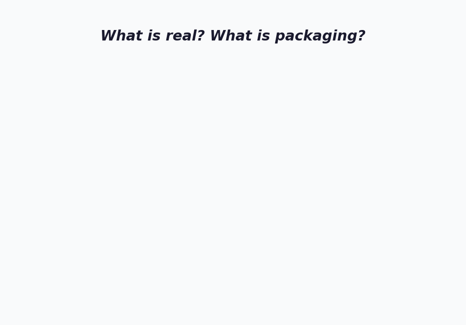
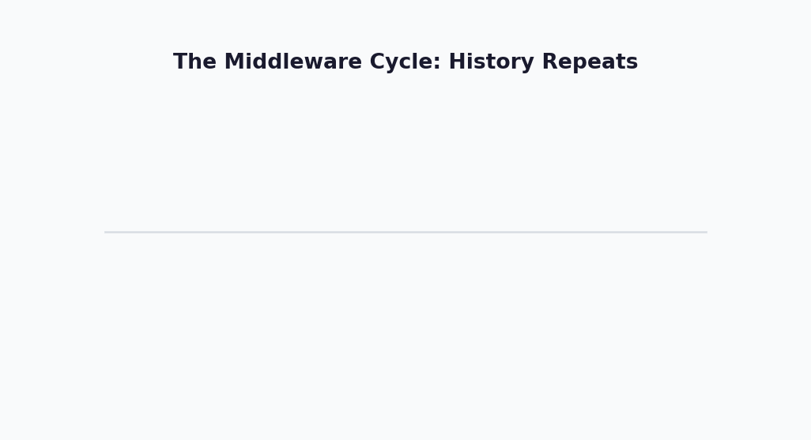
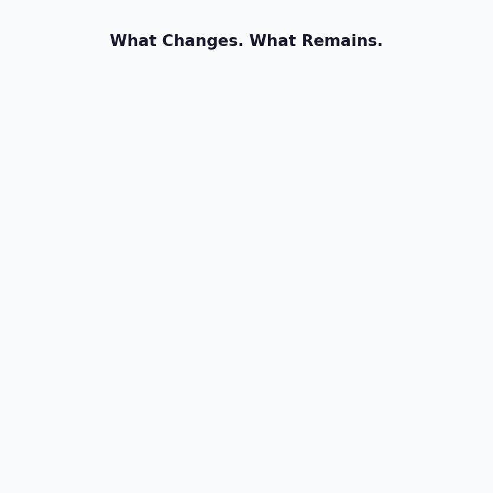

<div style="max-width: 680px; margin: 1.5em auto; padding: 20px 24px; border-radius: 10px; background: linear-gradient(135deg, rgba(233,30,99,0.06), rgba(33,150,243,0.06)); border: 1px solid rgba(233,30,99,0.15);">

<div style="font-weight: bold; margin-bottom: 10px; color: #E91E63; font-size: 1.1em;">📖 写在前面</div>

这篇文章不是教程，不是测评，也不是"手把手教你搭建 AI Agent"。

这是一篇**反思文**。

过去一个月，我写了十几篇技术解析——从 Transformer 的数学原理到 DeepSeek-R1 的推理机制，从 MoE 的稀疏激活到 GRPO 的训练算法。那些文章在回答一个问题：**AI 是怎么工作的？**

但最近的一些经历让我想写一篇不一样的东西。

我自己也在学 Agent、配 MCP、搭工作流。但学着学着，心里冒出一个挥之不去的问题：**我到底要用它来做什么？**

每个人关心的方向不同。有人喜欢做应用，有人喜欢研究商业。而我个人，更着迷于 AI 的原理、架构和数学——那些不随热词更替而改变的东西。所以才做了这个公众号，想把自己的思考分享出来，给同路的小伙伴们一些参考。

这篇文章没有标准答案，只是我最近的一些真实想法。

</div>

---

## 从一个朋友的故事说起

前段时间，一个做产品经理的朋友兴奋地跟我说：**"我花了整整一个周末，搭了一个 AI Agent 工作流，自动抓取竞品信息、生成分析报告、发到飞书群里。"**

我说："挺厉害的。然后呢？"

他愣了一下："然后……然后我发现，报告发出去之后，没有人看。"

我们都笑了。但笑完之后，他说了一句让我想了很久的话：

> "我好像花了一个周末，非常高效地做了一件没人需要的事情。"

**这就是我写这篇文章的原因。**

---

## 第一章：一张你需要的地图 🗺️

### 先理清关系

如果你也被这些词搞晕了，不怪你——我一开始也是。理了一阵，画出了这么一张图：



<div style="text-align: center; font-size: 0.85em; color: #888; margin-top: -10px; margin-bottom: 20px;">▲ 从外到内：你看到的产品 → 中间层热词 → 真正的引擎 → 底层架构</div>

<div style="max-width: 660px; margin: 1.5em auto; padding: 16px 20px; border-radius: 8px; background: rgba(33,150,243,0.06); border: 1px solid rgba(33,150,243,0.15);">

**最外层：** 你用的产品——ChatGPT、Claude、豆包、Kimi

**中间层：** Agent、MCP、RAG、Skills、Coze、Dify——所有热词都在这里

**核心层：** LLM（大语言模型）——GPT-4、Claude、DeepSeek、Qwen——这是真正的引擎

**底层：** Transformer 架构、深度学习——几十年积累的数学和工程

</div>

**看到了吗？所有热词都在中间那一层。** 它们不是 AI 本身，它们是 AI 的**使用方式**。

我不是在贬低它们——使用方式当然重要，很多人在这一层做出了非常优秀的产品。只是从我个人的兴趣出发，我更想搞明白下面两层——引擎是怎么转的。

---

## 第二章：那些热词到底是什么？ 🔍

### 我试着用自己的话解释

这些概念刚开始接触时都挺绕的。我尝试用自己理解的方式重新说一遍，不一定完全准确，但可能更容易消化：

<div style="max-width: 660px; margin: 1.5em auto; padding: 16px 20px; border-radius: 8px; background: rgba(255,152,0,0.06); border: 1px solid rgba(255,152,0,0.2);">

**Agent（智能代理）**

官方说法：*"能自主规划、使用工具、多步骤完成复杂任务的 AI 系统。"*

我的理解：**本质上是一个 while 循环——反复问 LLM "下一步做什么"，执行完再问，直到任务完成。**

不是魔法，不是通用人工智能。是一个循环。但这个循环里的"判断"由 LLM 做，所以它能处理以前需要写无数 if-else 才能覆盖的情况。

---

**MCP（Model Context Protocol）**

官方说法：*"AI 的 USB-C 接口。"*

我的理解：**一套 JSON 格式的规范，让 AI 应用和外部工具用同一种"语言"对话。**

以前，每个 AI 应用想连数据库，得自己写一套接口。100 个应用 × 50 个工具 = 5000 个接口。MCP 说：**大家都按我这个格式来，100 + 50 = 150 个接口就够了。**

它解决的是**标准化**问题，不是技术革命。就像 USB 没有发明数据传输，但它统一了接口。

---

**RAG（检索增强生成）**

官方说法：*"让 AI 具备实时知识检索能力。"*

我的理解：**AI 回答前先搜一搜你给它的资料库，然后把搜到的内容和问题一起丢给 LLM。**

就像考试时允许翻书。AI 本身的"知识"有截止日期，RAG 让它能查你公司的内部文档、最新的网页内容。

---

**Coze / Dify / FastGPT**

我的理解：**可视化的 Agent 搭建平台——拖拖拽拽就能把 LLM 和各种工具串起来。**

降低了门槛，让不会写代码的人也能做 AI 应用。但它们的能力上限，取决于底层 LLM 的能力上限。

---

**Skills / Function Calling / Tool Use**

我的理解：**让 LLM 告诉你"我想调用某个函数"的机制。**

2023 年叫 Function Calling，2024 年叫 Tool Use，2025 年叫 Skills，再加上 MCP。换了三个名字，本质是同一件事。

</div>

---

## 第三章：Manus 启示录 💥

### 一夜爆火

2025 年 3 月，一个叫 Manus 的 AI Agent 产品刷爆了所有科技媒体和朋友圈。创始人季逸超发布了令人震惊的 demo——Agent 自主浏览网页、创建 PPT、搭建网站。邀请码一码难求，全网 FOMO。

**三天后，开源社区在 3 小时内做出了替代品 OpenManus，拿到了 5.5 万颗 GitHub 星。**

这件事让很多人兴奋，也让我陷入了思考。

### 三个触及本质的问题

<div style="max-width: 660px; margin: 1.5em auto; padding: 16px 20px; border-radius: 8px; background: rgba(156,39,176,0.06); border: 1px solid rgba(156,39,176,0.15);">

**第一个问题：如果 3 小时就能复制，壁垒在哪里？**

OpenManus 用 3 小时复制了 Manus 的核心功能。这说明：Agent 的技术壁垒极低。

真正的核心能力——理解、推理、生成——全在底层的 LLM 里。Agent 框架只是一层薄薄的胶水代码。

**这不是在贬低 Agent 开发者的工作。** 胶水代码的设计可以很精巧，用户体验可以天差地别。但如果有人告诉你某个 Agent 产品有"护城河"——你可以多想一想。

</div>

<div style="max-width: 660px; margin: 1.5em auto; padding: 16px 20px; border-radius: 8px; background: rgba(33,150,243,0.06); border: 1px solid rgba(33,150,243,0.15);">

**第二个问题：为什么 demo 总是比真实使用好看得多？**

所有 Agent 的 demo 展示的都是"一切顺利"的情况——精心挑选的任务、受控的环境、测试过无数次的流程。

真实场景里呢？网页结构突然改版、弹窗挡住了按钮、网络超时、API 返回了意料之外的格式……Agent 会懵。Claude Computer Use 的官方文档自己写着：*"延迟可能过高"、"坐标输出可能产生幻觉"*。

2024 年的 Devin 也是前车之鉴——号称"世界第一个 AI 软件工程师"，估值 20 亿美元。社区实测后发现，效果远不如宣传。

**我不是说这些产品没有价值。** 而是说——目前真正能稳定工作的 Agent，都有一个共同点：**人在循环里。** 开发者能实时审查每一步输出的编程 Agent（Claude Code、Cursor）之所以最成熟，恰恰因为"人类监督"是内建的。

</div>

<div style="max-width: 660px; margin: 1.5em auto; padding: 16px 20px; border-radius: 8px; background: rgba(76,175,80,0.06); border: 1px solid rgba(76,175,80,0.15);">

**第三个问题：那些花了一个周末搭 Agent 工作流的人，他们解决了什么问题？**

回到文章开头那个朋友的故事。他搭了一个完美的自动化流程，但没人看那些报告。

问题不在于 Agent 搭得好不好。问题在于——**在搭之前，他没问过自己：这个报告是给谁的？他们需要知道什么？这些信息会影响什么决策？**

工具越来越强大，"该用它来做什么"这个问题反而越来越重要了。

</div>

---

## 第四章：一个让人不安的历史规律 ⏳

### 如果你经历过互联网时代，这一切似曾相识

现在，让我带你做一次时间旅行：



<div style="text-align: center; font-size: 0.85em; color: #888; margin-top: -10px; margin-bottom: 20px;">▲ 每一代中间件都相信自己是不同的。但历史一直在重复。</div>

<div style="max-width: 660px; margin: 1.5em auto; padding: 16px 20px; border-radius: 8px; background: rgba(255,152,0,0.06); border: 1px solid rgba(255,152,0,0.2);">

**2000 年代**——企业软件的热词是 **ESB（企业服务总线）**。每个厂商都说："你需要一个 ESB 来连接所有系统！"公司花了大笔预算采购。后来呢？微服务架构出来了，ESB 没人提了。

**2010 年代**——热词变成了 **SOA（面向服务架构）** 和 **CORBA**。"统一所有服务接口！"后来呢？REST API 出来了，简单到不需要中间件。

**2020 年代**——AI 的热词是 **Agent 框架、MCP、LangChain**。"连接 LLM 和你的业务！"

</div>

我不是在预言 MCP 或 Agent 框架一定会消失。而是想说——**每一代中间件都有它存在的合理性，但它们最终都会被底层平台的进化所吸收。**

<div style="max-width: 660px; margin: 1.5em auto; padding: 16px 20px; border-radius: 8px; background: rgba(33,150,243,0.06); border: 1px solid rgba(33,150,243,0.15);">

**中间件的生命周期：**

```text
新技术出现，与现有系统不兼容
        ↓
中间件诞生，充当"翻译官"
        ↓
中间件标准化，成为"热词"       ← 我们正在这里
        ↓
底层平台强大到直接集成中间层功能
        ↓
中间件被吸收，变得无形
```

</div>

想想看：

- 为什么需要 MCP？因为 LLM 不能直接访问你的数据库。
- 为什么需要 Agent 框架？因为 LLM 不能直接规划和执行多步任务。
- 为什么需要 RAG？因为 LLM 的知识有截止日期。

**但如果 LLM 的上下文窗口大到可以装下所有文档呢？** 如果 LLM 原生支持所有工具调用呢？如果 LLM 的推理能力强到可以自主规划复杂任务呢？

那些"中间层"就会像 ESB 一样，安静地退出舞台。

**但请注意——我说的是"最终"。** 在"最终"到来之前，这些中间层有真实的价值。关键是不要把整个职业生涯押在一个可能只有 3-5 年寿命的中间层上。

---

## 第五章：一个更深层的问题 🤔

### 当技术不再是瓶颈

前面四章是技术梳理。这一章是我自己这段时间一直在想的事。

在学了这么多 AI 技术之后，我越来越感到一个反差：

<div style="max-width: 660px; margin: 1.5em auto; padding: 16px 20px; border-radius: 8px; background: rgba(255,152,0,0.06); border: 1px solid rgba(255,152,0,0.2);">

**AI 的工具能力在飞速进步。**

它能写代码了、能做 PPT 了、能分析数据了、能搜索信息了、能翻译文档了、能自动回复客户了。

**但"该做什么"的能力——这不是 AI 的能力，是人的能力——并没有变化。** 甚至，因为执行成本变得越来越低，决策失误的代价反而变大了：AI 会高效地在错误的方向上全速前进。

</div>

过去，技术能力是瓶颈。你想做一个网站，得学 HTML、CSS、JavaScript。你想分析数据，得学 SQL、Python。**技术限制了你能做什么。**

现在，AI 正在消除这些技术瓶颈。**但一个新问题浮出水面——一个我们一直假装不存在的问题：**

> 当你可以做任何事的时候，你到底想做什么？

### 人的判断力，在 AI 时代反而更重要了

<div style="max-width: 660px; margin: 1.5em auto; padding: 16px 20px; border-radius: 8px; background: rgba(76,175,80,0.06); border: 1px solid rgba(76,175,80,0.15);">

Agent 可以自动浏览 100 个网页。**但该浏览哪 100 个？** 这需要人来判断。

MCP 可以连接你的所有系统。**但连接之后要解决什么问题？** 这需要人来判断。

RAG 可以让 AI 检索你的知识库。**但知识库里该放什么、怎么组织？** 这需要人来判断。

LLM 可以生成任何文本。**但该生成什么、给谁看、解决什么需求？** 这需要人来判断。

</div>

这不是一个技术问题。这是一个关于**我们每个人自己**的问题。

我自己也陷入过这种模式：**不断学习新工具，好像学完就安心了。** 学完 LangChain 学 Dify，学完 Dify 学 MCP，学完 MCP 学 Agent——工具永远有新的，但最核心的那个问题一直没有回答。

后来我想明白了：我真正感兴趣的不是这些工具，而是它们背后的 LLM 到底是怎么工作的。想通这一点之后，焦虑感就消失了大半。

---

## 第六章：那什么才是不变的？ 🔭



<div style="text-align: center; font-size: 0.85em; color: #888; margin-top: -10px; margin-bottom: 20px;">▲ 最外层的工具每 2-3 年更换一次。但最中心的问题——"我们该做什么？"——从未改变。</div>

### 我自己的三个选择

这不是建议，只是我在这场热潮中给自己定的方向。分享出来，希望有共鸣的朋友觉得有用。

<div style="max-width: 660px; margin: 1.5em auto; padding: 16px 20px; border-radius: 8px; background: rgba(156,39,176,0.06); border: 1px solid rgba(156,39,176,0.15);">

**1. 我选择花更多时间在引擎上，而不只是方向盘上**

LLM 是引擎，Agent/MCP/RAG 是方向盘和仪表盘。方向盘每几年换一个设计，但引擎的工作原理——注意力机制、概率分布、梯度下降、MoE——这些一旦理解了，心里就踏实了。

这也是我做这个公众号的初衷：不是教谁用什么框架，而是把自己学原理的过程记录下来，给同样对"底层"感兴趣的朋友一些参考。

**2. 判断一个 AI 产品时，我会问自己一个问题**

> **"去掉 LLM 之后，还剩什么？"**

如果答案是"一个普通的自动化脚本"——那它的价值可能主要来自底层 LLM，而不是产品本身。

如果答案是"对某个领域的深刻理解、独特的数据、不可替代的用户关系"——那它的价值更独立。

**3. 比起追工具，我更想搞清楚自己关心什么**

每个人的答案不一样。有人热爱应用，有人热爱商业，都好。我碰巧是对数学和原理着迷。想明白这一点之后，面对满屏的新工具新框架，焦虑感就少了很多。

</div>

---

## 结语：热潮之下

<div style="max-width: 660px; margin: 1.5em auto; padding: 20px 24px; border-radius: 10px; border: 2px solid #FF9800; background: rgba(255,152,0,0.04);">

2000 年，所有人都在谈论 "dot-com"。大部分公司死了，但互联网留下了。

2017 年，所有人都在谈论 "区块链改变一切"。大部分项目消失了，但加密技术留下了。

2025 年，所有人都在谈论 "AI Agent 改变一切"。

大部分 Agent 框架会消失。但 LLM 的能力会留下——它们会被吸收进操作系统、进浏览器、进每一个应用的基础设施里。到那时，没有人会再说"我在用一个 Agent"，就像今天没有人说"我在用一个 REST API"一样。

**那时候真正留下的是什么？**

我不知道。但我隐约觉得，不是某个框架的使用技巧。

也许是我们在这场热潮中，有没有停下来想过：**对我来说，什么事情是真正重要的？**

这个问题，AI 不会替我们回答。

它是我们自己的。

</div>

---

<div style="max-width: 680px; margin: 1.5em auto; padding: 20px 24px; border-radius: 8px; background: rgba(233,30,99,0.04); border: 1px solid rgba(233,30,99,0.12);">

**📚 延伸阅读**

- MCP 官方文档：[modelcontextprotocol.io](https://modelcontextprotocol.io/introduction)
- OpenManus（Manus 开源替代）：[GitHub](https://github.com/FoundationAgents/OpenManus)（55.4k ⭐）
- 前文：**[DeepSeek-R1：一个模型如何学会思考](/ai-blog/posts/deepseek-r1-thinking/)** — 模型层面的真正突破
- 前文：**[MoE：671B 参数只用 37B 的秘密](/ai-blog/posts/moe-architecture/)** — 架构层面的真正创新
- 前文：**[为什么把模型做大就能变聪明？](/ai-blog/posts/why-llm-understand-world/)** — 从过拟合悖论到压缩即智能

**📌 后续文章暂存清单（规划中）：**
- 从 RLHF 到 GRPO：大模型训练的三次革命
- 蒸馏：大模型如何"教"小模型
- Attention 进化：从标准注意力到 MLA
- Transformer 会被取代吗？—— Mamba 与混合架构

</div>

<div style="margin-top: 30px; padding-top: 20px; border-top: 1px solid #e0e0e0; font-size: 0.9em; color: #888;">

博客：https://Jason-Azure.github.io/ai-blog/

微信公众号：AI-lab学习笔记

</div>
