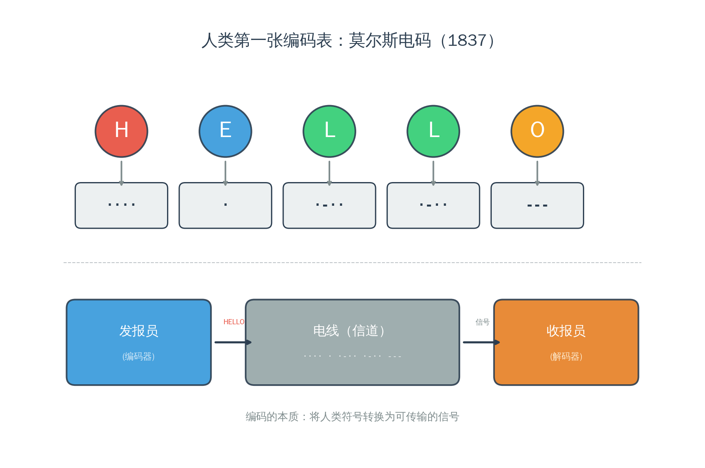
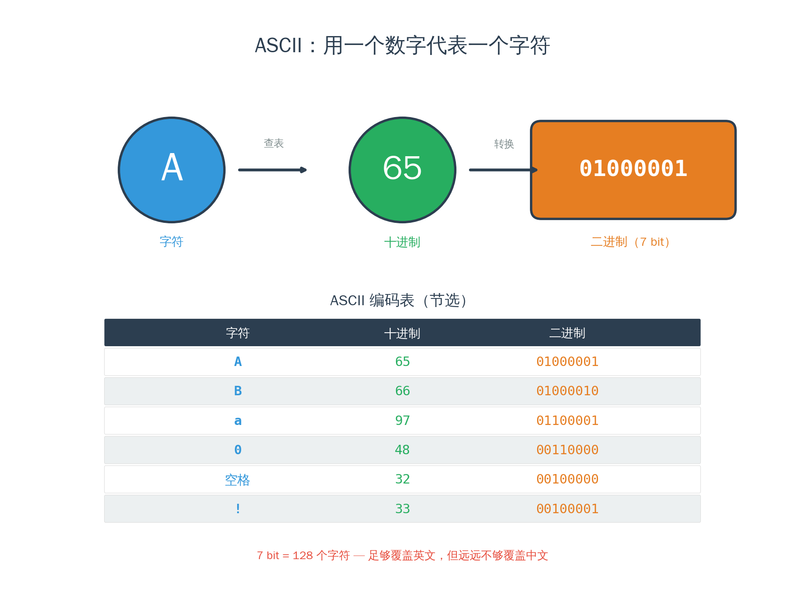
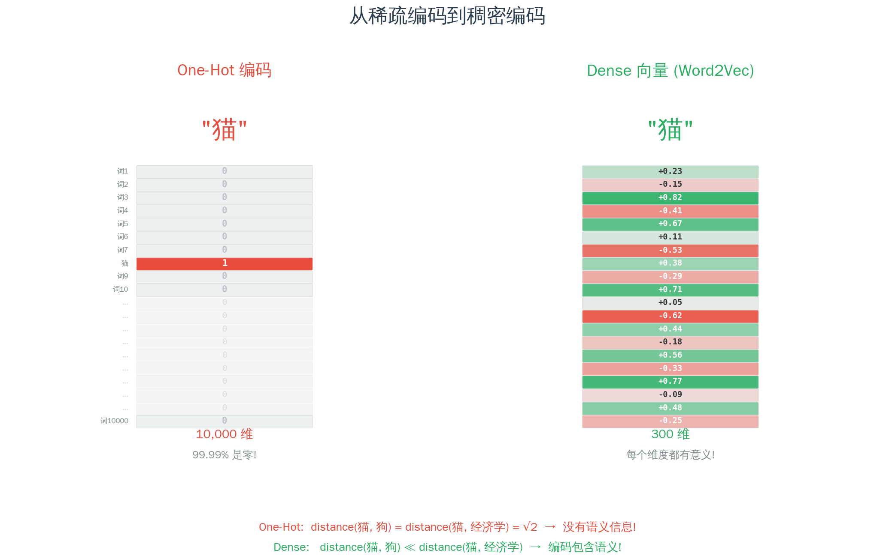
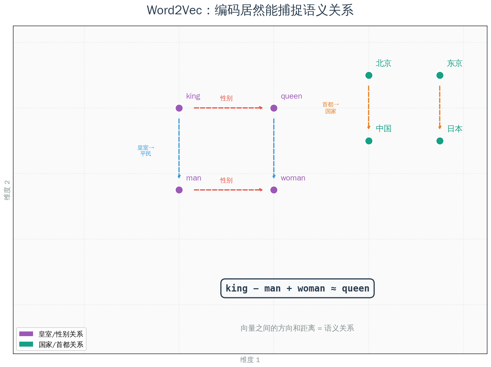
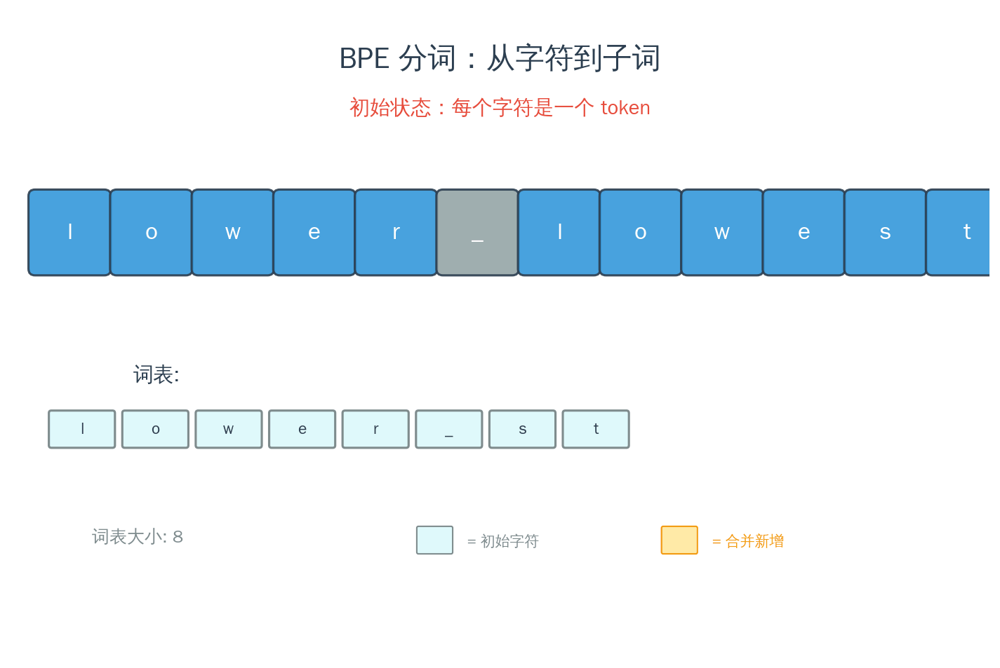
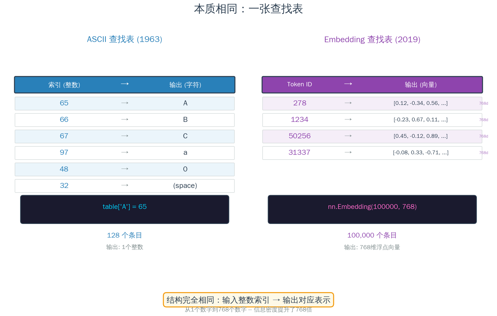
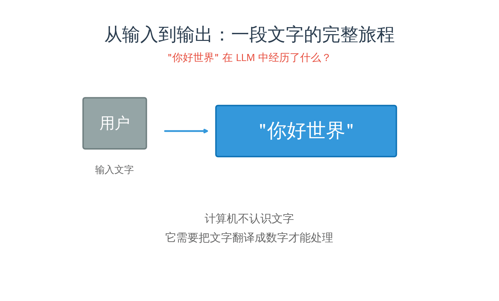
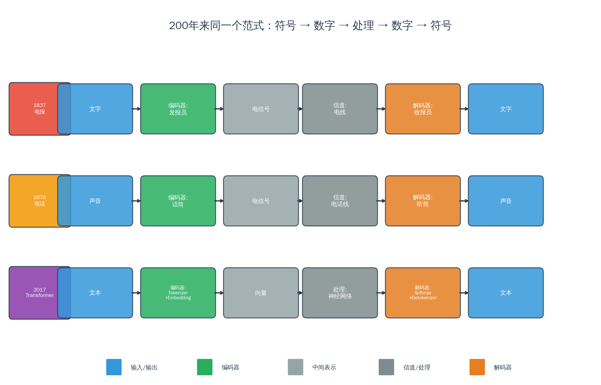

## 从一件你每天都在做的事说起

你拿起手机，在微信里打了两个字："你好"。按下发送。

对面的人看到了"你好"。

看起来很简单。但你有没有想过——在你按下发送到对方收到之间，这两个字经历了什么？

计算机不认识"你"，也不认识"好"。它不认识任何一个字。它唯一认识的东西是——**0 和 1**。

所以你打的"你好"，在进入计算机的瞬间，就被翻译成了一串数字：`11100100 10111101 10100000 11100101 10100101 10111101`。48 个 0 和 1。

这串数字通过网线/WiFi/基站飞到对方手机上，对方的手机再把它翻译回"你好"，显示在屏幕上。

**符号 → 数字 → 传输 → 数字 → 符号。**

这个过程你每天做几百次。发微信、刷网页、写文档——每一次，你看到的"文字"都在背后经历了这趟翻译之旅。

现在换一个场景。你打开 ChatGPT，输入同样的"你好"。

**完全相同的事情发生了。** "你好"被翻译成数字，AI 用数字做了一堆计算，然后把结果的数字翻译回文字给你看。

Token、Embedding、Encode、Decode——你在 AI 话题里听到的这些术语，说的**就是这件事**：把符号变成数字、把数字变回符号。

这不是什么新发明。人类做这件事已经快 200 年了。

---

## 一切始于翻译

### 莫尔斯电码（1837）：第一张编码表

故事从一根电线开始。

1837 年，Samuel Morse 发明了电报。他面对一个前所未有的问题：怎么通过一根电线传递文字？电线只能做一件事——通电或断电。通就是 1，断就是 0。

所以 Morse 做了一件后来被反复重复了 200 年的事：**他发明了一张对照表**。

每个字母对应一组"长短信号"——短信号是"点"（·），长信号是"划"（-）。A = ·-，B = -···，SOS = ···---···。



发报员把文字翻译成电信号（**编码/encode**），收报员把电信号翻译回文字（**解码/decode**）。

注意：encode 和 decode 这两个词不是 AI 发明的。它们的历史和电报一样古老。本质就是**翻译**——在两种表示之间来回转换。

Morse 还做了一件聪明的事：最常见的字母"E"，编码最短（一个点 ·）；不常见的字母"Q"，编码最长（--·-）。**高频的用短编码，低频的用长编码。** 记住这个原则——它会反复出现。

### ASCII（1963）：给字符编号

一百多年后，计算机来了。计算机面对的问题和 Morse 一模一样——它只认识 0 和 1，怎么处理人类的文字？

1963 年，美国国家标准协会发布了 **ASCII**（美国标准信息交换码）。原理简单得不能再简单：

**给每个字符一个数字编号。**

大写 A = 65，B = 66，C = 67……小写 a = 97，数字 0 = 48，空格 = 32。一共 128 个字符，用 7 位二进制就能表示。



这就是一张**查找表**（lookup table）——输入一个字符，查表得到一个数字；输入一个数字，查表得到一个字符。**编码就是查表，解码也是查表。**

当你在键盘上按下"A"，计算机存储的是 65。当屏幕上显示"A"，是计算机从 65 查回了"A"的字形。**你看到的是字母，计算机看到的永远是数字。**

这里有一个容易忽略的事实：**就连你输入的"数字"，对计算机来说也是字符。**

当你在计算器里输入 `127+456`，你以为计算机直接看到了数字 127 和 456？不是的。它首先看到的是 7 个字符：`'1'` `'2'` `'7'` `'+'` `'4'` `'5'` `'6'`。在 ASCII 表里，字符 `'1'` 的编码是 49，`'2'` 是 50，`'7'` 是 55——注意，这些和数值 1、2、7 完全不同。

这就是为什么编程语言里有"类型"的概念。字符串 `"123"` 和整数 `123` 在内存里是完全不同的东西：

- 字符串 `"123"` 存的是三个 ASCII 码：49, 50, 51
- 整数 `123` 存的是二进制数值：01111011

从字符串到数字，需要**显式转换**——Python 里的 `int("123")`，JavaScript 里的 `Number("123")`，C 语言里的 `atoi("123")`。这些函数做的事情，本质上就是**解码**：把人类可读的字符表示，翻译成计算机能做算术的数值表示。

**所有信息——文字、数字、标点——进入计算机的第一步都是编码成字符。** 编码无处不在，比你想象的更彻底。

但 ASCII 有一个致命的问题：128 个位置用完了。英文字母、数字、标点符号刚好够用，但——

中文呢？日文呢？韩文、阿拉伯文、泰文、emoji 呢？

### Unicode 和 UTF-8：全人类的编码表

这个问题困扰了业界三十年。各国各自发明编码——中国用 GB2312，日本用 Shift_JIS，韩国用 EUC-KR。同一个数字在不同编码里代表不同的字。于是你收到一封邮件，满屏乱码。

1991 年，**Unicode** 诞生了。思路很暴力：给**世界上每一个字符**一个唯一编号（叫"码点"）。

"你" = U+4F60，"好" = U+597D，"😀" = U+1F600。

目前 Unicode 收录了超过 15 万个字符，覆盖了人类发明过的几乎所有书写系统。

但新问题来了：ASCII 用 1 个字节（8 位）就够了，但 Unicode 的码点范围太大，有的需要 3 个甚至 4 个字节。如果所有字符都用 4 个字节存储，英文文本的存储空间会膨胀 4 倍——太浪费了。

1993 年，**UTF-8** 解决了这个问题。它的设计非常聪明：

- 英文字母（高频）→ 1 个字节
- 中文（中频）→ 3 个字节
- emoji 和生僻字（低频）→ 4 个字节


**高频的用短编码，低频的用长编码。**

等等，这不是 Morse 在 1837 年就用过的原则吗？没错，而且这个原则有一个名字。在 [信息论](/ai-blog/posts/see-math-extra-information-theory/) 里，Shannon 在 1948 年就数学地证明了：**最优编码就是让高频项的编码最短**。这不是巧合，这是数学定理。

到这里，我们做了 200 年的事总结起来就一句话：**发明越来越大、越来越聪明的查找表，把人类的符号翻译成计算机的数字。**

但故事远没有结束。因为接下来发生了一件改变一切的事：我们开始给**词**编码——不再是单个字符，而是整个词。而且编码方式不再是人类设计的，而是**机器自己学的**。

---

## 从"一个数字"到"一组数字"

### One-Hot 编码：天真但重要的一步

ASCII 给每个字符一个数字。那能不能给每个词一个数字？

当然可以。假设我们的词表有 10000 个词，"猫"排在第 3721 个，我们就给它编号 3721。

但这样做有一个问题：3721 这个数字暗示"猫"比 3720（可能是"经济"）"大一点"，比 3722（可能是"钢琴"）"小一点"。但猫和经济、钢琴之间没有大小关系。数字的大小误导了计算机。

于是人们想到了一个办法：**独热编码（One-Hot Encoding）**。

10000 个词的词表，每个词用一个 10000 维的向量表示。"猫"的向量是：[0, 0, 0, ..., 1, ..., 0, 0]——只有第 3721 个位置是 1，其余全是 0。



这消除了"大小"的误导，但引入了两个新问题：

**第一，太浪费了。** 10000 维的向量里只有一个 1，其余全是 0。99.99% 的空间是浪费的。

**第二，没有语义。** 在 One-Hot 编码里，"猫"和"狗"的距离 = "猫"和"经济学"的距离。每对词之间的距离完全一样。计算机看不出哪些词意思接近，哪些词毫不相关。

ASCII 给字符编号时也有同样的问题——A=65，B=66 并不意味着 A 和 B 的"意思"比 A 和 Z 更接近。但 ASCII 只是在做通信——传对字符就行了，不需要"理解意思"。

然而，当我们开始让机器**理解**语言时，编码就必须携带含义了。

### Word2Vec（2013）：编码的革命

2013 年，Google 的 Tomas Mikolov 和他的同事们发表了一篇改变 NLP（自然语言处理）的论文：*"Efficient Estimation of Word Representations in Vector Space"*。

他们的想法基于一个语言学的古老洞察——英国语言学家 J.R. Firth 在 1957 年说过的一句话：

> **"You shall know a word by the company it keeps."**
> 一个词的意思，由它周围的词决定。

"猫"经常出现在"毛茸茸"、"喵"、"宠物"旁边。"狗"也经常出现在类似的上下文里。所以"猫"和"狗"的意思应该接近。"经济学"出现在完全不同的上下文里，所以它和"猫"应该很远。

Mikolov 做了一件天才的事：**让神经网络自己从大量文本中学习每个词的编码。** 不是人类指定，而是机器从数据中发现。

结果：每个词变成一个 **300 维的向量**——300 个浮点数。不是 10000 维里只有一个 1，而是每个维度都有值，每个值都编码了词义的某个方面。

然后人们发现了一个惊人的现象：

$$\vec{king} - \vec{man} + \vec{woman} \approx \vec{queen}$$

**"国王"减去"男性"加上"女性"，等于"女王"！**



这些向量不只是"编号"——它们捕捉了词与词之间的关系。"性别"这个概念，在向量空间里有一个固定的方向；"皇室"有另一个方向；"国家-首都"又有一个方向。

让我用 ASCII 做对比，你就能感受到这个飞跃有多大：

- **ASCII** 给 "A" 编号 65——这个 65 没有任何含义，它只是一个编号
- **Word2Vec** 给 "国王" 编码 [0.23, -0.15, 0.82, ...]——这 300 个数字的**每一个都有含义**，它们共同编码了"男性"、"皇室"、"权力"等语义维度

**从"没有含义的编号"到"充满含义的向量"——这是 200 年编码史上最关键的一步。** 人类第一次让机器不只是"记住"符号，而是"理解"符号之间的关系。

如果你想更深入地理解向量和矩阵在 AI 中的角色，可以看 [《矩阵乘法到底对 LLM 做了什么？》](/ai-blog/posts/geometric-intuition/)。

---

## BPE：当压缩算法变成了分词器

### 一个意想不到的问题：按什么切分？

Word2Vec 把每个词变成了向量。但"词"是什么？

英文还好——单词之间有空格。"I love cats" → ["I", "love", "cats"]。

但中文呢？"联合国气候变化框架公约"——这是一个词还是七个词？"今天天气不错"——"天天"是一个词吗？"不错"是"不"+"错"还是一个词？

还有另一个问题：世界上的词太多了。英文有几十万个词，加上人名、地名、新造词、专业术语……一个固定的词表永远不够用。碰到词表外的词（叫 OOV，out-of-vocabulary），模型就两眼一抹黑。

怎么办？

答案来自一个出人意料的地方——**数据压缩算法**。

### 从压缩到分词（1994 → 2016）

1994 年，Philip Gage 在 *C Users Journal* 上发表了一个叫 **BPE（Byte Pair Encoding，字节对编码）** 的数据压缩算法。原理很简单：

1. 扫描文本，找到出现频率最高的相邻字节对
2. 把这对合并成一个新符号
3. 重复步骤 1-2，直到达到目标词表大小



2016 年，Sennrich 等人把这个压缩算法借来做 NLP 分词——同一个算法，换了个目的。**压缩是为了减少数据大小，分词是为了找到合适的编码单位。** 但本质上，两者都在做同一件事：**找到最高效的表示方式**。

GPT-2（2019）更进一步，使用了 **byte-level BPE**——从 256 个原始字节开始构建词表。

**256 个字节。** 这个数字让你想起什么了？对——ASCII 编码的扩展版（Extended ASCII）正好也是 256 个字符。GPT 的分词器，**起点和 1963 年的 ASCII 编码完全一样**——都是从"给每个字节编号"开始。

而且 BPE 的设计哲学和 UTF-8 一模一样：

- UTF-8："the"（高频）→ 3 字节，"鬱"（低频）→ 3 字节但编码位置靠后
- BPE："the"（高频）→ 1 个 token，"tokenization"（低频）→ 3 个 token

**高频的用短编码，低频的用长编码。**

这不是巧合。这是 Shannon 在 1948 年就证明了的最优编码原理。**200 年来，从莫尔斯电码到 UTF-8 到 BPE，最聪明的编码都在遵守同一个数学定理。** 我在 [《为什么用 -log(p) 做损失函数？》](/ai-blog/posts/cross-entropy-loss/) 里详细推导了这个定理。

如果你想深入了解 BPE 在中英文上的差异，推荐读 [《中文 vs 英文：大语言模型的语言鸿沟》](/ai-blog/posts/chinese-english-llm/)。

---

## Embedding：进化的查找表

### 一张古老的对照表

好了，到这一步，我们有了 BPE 分词器，能把任何文本切成 token 序列，每个 token 有一个整数 ID。

"你好世界" → [19526, 31809]（实际 ID 取决于具体模型）

但整数 ID 和 ASCII 码有同样的问题——它们只是编号，没有含义。19526 和 19527 之间没有任何语义关系。

所以我们需要把这些 ID 变成有含义的向量——就像 Word2Vec 做的事情一样。

怎么做？**查表。**

GPT 模型里有一个叫 **Embedding 层**的东西。它的本质是什么？一张巨大的查找表。

在 PyTorch 里，这张表是这样定义的：

```python
embedding = nn.Embedding(100000, 768)
```

10 万行（词表大小），768 列（向量维度）。输入一个整数 Token ID，输出一个 768 维的向量。

**和 ASCII 表的结构完全一样：**



| 对比项 | ASCII 表（1963） | Embedding 表（2019） |
|--------|------------------|----------------------|
| 大小 | 128 行 × 1 列 | 100,000 行 × 768 列 |
| 输入 | 整数索引（如 65） | 整数 Token ID（如 19526） |
| 输出 | 一个字符（A） | 一个 768 维向量 |
| 设计方式 | 人类手工指定 | 机器从数据中学习 |

**区别只有两个：**

1. 维度从 1 变成了 768（从"一个数字"到"一组数字"）
2. 从人类设计变成了机器学习

结构？完全相同。都是查找表。都是输入索引、输出表示。

如果你想看 embedding 的实际数值长什么样，推荐 [《LLM 全流程可视化》](/ai-blog/posts/llm-pipeline-visual/)，那里有用真实 nanoGPT 模型提取的 embedding 数据。

### Encode → Process → Decode：古老的范式

现在让我们把完整的流程连起来：

1. **Encode（编码）**：文本 → Tokenizer 切分 → Token ID → Embedding 查表 → 向量序列
2. **Process（处理）**：向量序列 → 神经网络做一堆矩阵运算 → 新的向量序列
3. **Decode（解码）**：新向量 → 反查表得到概率分布 → 选出最可能的 Token ID → 查回文字

**符号 → 数字 → 处理 → 数字 → 符号。**

让我们用一个完整的动画，看看"你好世界"在 LLM 中经历的每一步：



这个模式你在哪里见过？



1837 年的电报：**文字 → 发报员编码 → 电信号 → 收报员解码 → 文字**

1876 年的电话：**声音 → 话筒编码 → 电信号 → 听筒解码 → 声音**

2017 年的 Transformer：**文本 → Tokenizer+Embedding 编码 → 向量 → Softmax+Detokenizer 解码 → 文本**

**同一个范式。** 200 年来没变过。Shannon 在 1948 年把它画成了数学模型：信源 → 编码器 → 信道 → 解码器 → 信宿。Transformer 论文的原标题里那个 "Encoder-Decoder" 架构——不是什么新概念，是在致敬一个 200 年的传统。

完整的编码到训练流程，可以看 [《从文本到模型：LLM 数据处理全流程详解》](/ai-blog/posts/llm-data-pipeline/)。

---

## 一个统一的视角

让我们把 200 年的编码史放在一张表里：

| 年代 | 技术 | 输入 | 查找表 | 输出 |
|------|------|------|--------|------|
| 1837 | 莫尔斯电码 | 字母 A | 电码表 | ·- |
| 1963 | ASCII | 字母 A | ASCII 表 | 65（01000001） |
| 1991 | Unicode | 汉字 "你" | Unicode 表 | U+4F60 |
| 2013 | Word2Vec | 词 "king" | 嵌入矩阵 | [0.23, -0.15, ...] (300维) |
| 2019 | GPT-2 BPE | 子词 "ing" | BPE 词表 | Token ID 278 |
| 2019 | GPT-2 Embedding | Token 278 | Embedding 层 | [0.12, 0.34, ...] (768维) |

**每一行都在做同一件事。**

区别只有三个维度在升级：

**编码的单位越来越大**：字符 → 词 → 子词。

**编码的维度越来越高**：1 个数（ASCII）→ 300 个数（Word2Vec）→ 768 个数（GPT-2）→ 12288 个数（GPT-4）。

**编码从手工设计变成了机器学习**：人类发明莫尔斯电码和 ASCII——用智慧和直觉设计。机器学习 Word2Vec 和 Embedding——用数据和计算发现。

### 这解释了 AI 的很多"怪行为"

Andrej Karpathy（前 OpenAI、前特斯拉 AI 负责人）说过一句非常精辟的话：

> **"LLM 的很多奇怪行为，其实根源在 tokenization。"**

为什么 LLM 有时候不会做简单的数学？因为当你输入"127+456"时，LLM 看到的不是三个数字和一个加号——它看到的是几个 token ID。"127"可能是一个 token，但"456"可能被切成了"4"+"56"两个 token。它必须从这些碎片中"学会"加法。

就像你如果只看 ASCII 码 `49 50 55 43 52 53 54`，你能立刻知道这是"127+456"吗？大概不能。你需要先把数字翻译回字符，才能理解这是一道数学题。**LLM 的处境和你看 ASCII 码时一模一样。** 还记得前面说的吗？即便是"数字"，进入计算机的第一步也是变成字符编码——LLM 面对的困难，从字符编码那一刻就已经埋下了。

为什么 LLM 在英语上表现比中文好？因为 BPE 分词器在英文上更高效——常见英文词往往是一个 token，但中文一个字可能就要 2-3 个 token。同样的"意思"，中文需要更多的 token 来表达，AI 处理起来更费劲。这和 UTF-8 的问题如出一辙——英文字母 1 字节，中文 3 字节。

**编码效率的问题，从 ASCII 到 UTF-8 到 BPE，一直在跟着我们。**

### 为什么这件事很重要

理解了"一切都是编码"这个视角，AI 就不再神秘了。

GPT 不是一个"理解语言"的魔法黑盒。它是一个**极其精密的编码-解码器**——把文本编码成高维向量，在向量空间里做运算，再解码回文本。

和 200 年前的电报员做的事，**在结构上完全一样**。

区别在于：电报员用的是人类设计的简单编码表（26 个字母 → 26 个电码），GPT 用的是机器学习的超级编码表（10 万个子词 → 10 万个高维向量）。编码的**丰富程度**天壤之别——ASCII 用 1 个数字代表 1 个字符，Embedding 用 12288 个数字代表 1 个子词——但**底层范式一脉相承**。

Stephen Wolfram 在他那篇著名的 ChatGPT 解读文章里说得很直白：

> **"神经网络的根基就是数字。所以要处理文本，你必须把文字变成数字。"**

就是这么简单。

---

## 写在最后

200 年前，Morse 面对一根电线，想出了"把字母编成长短信号"这个主意。

160 年前，ASCII 的设计者面对一台计算机，想出了"给每个字符一个数字编号"。

30 年前，Unicode 的工程师面对全世界的语言，想出了"给每个字符一个唯一码点，用变长编码存储"。

10 年前，Mikolov 面对语言理解的难题，想出了"让机器自己学每个词的数字编码"。

今天，GPT 面对人类语言的全部复杂性，用 BPE + Embedding 构建了有史以来最庞大、最精密的编码系统。

**但他们做的都是同一件事：把符号变成数字。**

真正让人敬畏的不是 AI 的复杂——而是 200 年来，人类一直在用同一个简单的想法，解决越来越复杂的问题。

从莫尔斯电码到 ASCII 到 Unicode 到 Word2Vec 到 BPE 到 Embedding——**每一步都是上一步的自然延伸**。没有魔法，没有断裂。只有一个越来越聪明的查找表。

所以下次有人问你"什么是 Token？什么是 Embedding？"——你可以说：

> 这和 ASCII 是同一件事。只不过 ASCII 用 1 个数字代表 1 个字符，Embedding 用 768 个数字代表 1 个子词。**计算机从来都只懂数字，AI 也不例外。**

如果你想继续深入，我在 [开篇语](/ai-blog/posts/opening-essay/) 里提出了"压缩即智能"——编码的本质就是压缩。在 [从逻辑门到 GPT](/ai-blog/posts/gates-to-gpt/) 里，我从最底层的 0 和 1 开始，一路搭建到完整的 AI 系统。而在上一篇 [《Shannon 没有想到的事》](/ai-blog/posts/epiplexity/) 里，我们讨论了一个更深的问题：对于有限算力的观察者来说，"信息"意味着什么。

这些文章讲的其实都是同一件事的不同面向——**人类如何用有限的手段，表示和理解无限复杂的世界。**

---

> **参考文献**
>
> - Shannon, C.E. (1948). "A Mathematical Theory of Communication." *Bell System Technical Journal*.
> - Mikolov, T., et al. (2013). "Efficient Estimation of Word Representations in Vector Space." *arXiv:1301.3781*.
> - Sennrich, R., et al. (2016). "Neural Machine Translation of Rare Words with Subword Units." *ACL 2016*.
> - Vaswani, A., et al. (2017). "Attention Is All You Need." *NeurIPS 2017*.
> - Gage, P. (1994). "A New Algorithm for Data Compression." *C Users Journal*.
> - Wolfram, S. (2023). "What Is ChatGPT Doing and Why Does It Work?" *writings.stephenwolfram.com*.
> - Karpathy, A. (2024). "Let's Build the GPT Tokenizer." *github.com/karpathy/minbpe*.
