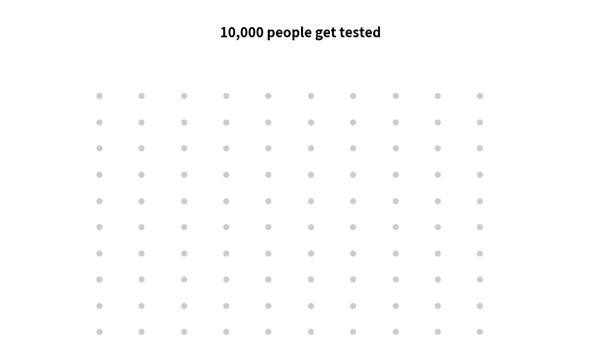
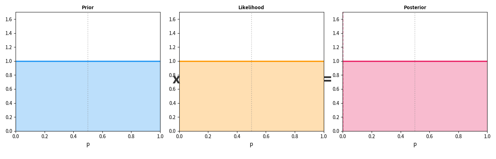

## 一个牧师的未完成论文

1761 年，英国小镇滕布里奇韦尔斯（Tunbridge Wells），一位 59 岁的长老会牧师去世了。

他叫托马斯·贝叶斯（Thomas Bayes）。

他的一生平平无奇——在一个小教堂布道，偶尔研究数学，没有发表过什么重要论文。去世后，他的朋友理查德·普莱斯（Richard Price）在整理遗物时发现了一篇未完成的手稿。

普莱斯读完后意识到：**这篇手稿可能改变人类理解世界的方式。**

1763 年，普莱斯把这篇遗稿整理发表在英国皇家学会的 *Philosophical Transactions* 上。标题很朴素：*"An Essay towards solving a Problem in the Doctrine of Chances"*——《论解决概率论中一个问题的尝试》。

263 年后，这篇论文里的核心思想成了 GPT、BERT、Stable Diffusion 等所有现代 AI 的数学骨架之一。

**贝叶斯没有想到的事：他为了解决赌博问题推导的公式，最终教会了机器如何学习。**

---

## 一、一个反直觉的问题

在讲贝叶斯定理之前，让我先给你出一道题。

<div style="max-width: 660px; margin: 1.5em auto; padding: 20px; border-radius: 8px; background: rgba(255,152,0,0.06); border: 1px solid rgba(255,152,0,0.2);">

<div style="font-weight: bold; margin-bottom: 12px; color: #FF9800; font-size: 1.05em;">医学检测悖论</div>

有一种罕见病，每 1000 人中只有 1 人患病（患病率 0.1%）。

现在有一种检测方法，准确率很高：
- 如果你**真的有病**，检测显示阳性的概率是 **99%**（灵敏度）
- 如果你**没有病**，检测显示阴性的概率是 **99%**（特异度）

你去检测，结果显示**阳性**。

**问：你真正患病的概率是多少？**

</div>

大多数人的第一反应：**"99%！检测那么准！"**

直觉告诉你几乎一定患病了。

**但正确答案是：大约 9%。**

你没有看错。即使检测准确率高达 99%，阳性结果只意味着你有大约 **十分之一** 的概率真正患病。

为什么？让我们算一算。

<div style="max-width: 660px; margin: 1.5em auto; padding: 20px; border-radius: 8px; background: rgba(33,150,243,0.06); border: 1px solid rgba(33,150,243,0.2);">

<div style="font-weight: bold; margin-bottom: 12px; color: #2196F3; font-size: 1.05em;">算给你看：10000 人中发生了什么</div>

```text
10000 人参加检测
│
├── 10 人真有病（患病率 0.1%）
│   ├── 9.9 人 → 检测阳性（真阳性，灵敏度 99%）
│   └── 0.1 人 → 检测阴性（漏诊）
│
└── 9990 人没有病
    ├── 99.9 人 → 检测阳性（假阳性，误报率 1%）
    └── 9890.1 人 → 检测阴性（正确排除）

所有阳性结果 = 9.9 + 99.9 = 109.8 人
其中真正患病的 = 9.9 人

真正患病的概率 = 9.9 / 109.8 ≈ 9.0%
```

</div>

**关键洞察：** 虽然假阳性率只有 1%，但因为没病的人（9990 人）远远多于有病的人（10 人），1% 的 9990 人（≈100 人）仍然远超真正患病的 10 人。

**你的直觉出了什么问题？**

你忽略了一个关键信息——**患病率本身就很低（0.1%）**。在你做检测**之前**，你患病的概率就已经很低了。检测阳性只是在这个很低的基础上"升级"了概率，但没有把它翻转到 99%。

这就是贝叶斯定理要解决的核心问题：**当你获得新证据时，你原来的信念应该怎样更新？**



---

## 二、贝叶斯定理——六个字就够了

<div style="max-width: 660px; margin: 1.5em auto; padding: 20px; border-radius: 8px; border: 2px solid #E91E63; background: rgba(233,30,99,0.04);">

<div style="font-weight: bold; margin-bottom: 12px; font-size: 1.05em; color: #E91E63;">贝叶斯定理</div>

$$P(A|B) = \frac{P(B|A) \cdot P(A)}{P(B)}$$

翻译成人话：

$$\text{新信念} = \frac{\text{证据的力量} \times \text{旧信念}}{\text{证据本身有多常见}}$$

</div>

### 用一个生活场景，把三个角色讲透

公式看起来吓人，但其实你每天都在用它——只是你的大脑自动帮你算了。让我用一个例子把三个角色讲清楚。

**场景：早上醒来，你听到窗外有"哗哗"的声音。外面在下雨吗？**

<div style="max-width: 660px; margin: 1.5em auto; padding: 20px; border-radius: 8px; background: rgba(76,175,80,0.06); border: 1px solid rgba(76,175,80,0.2);">

<div style="font-weight: bold; margin-bottom: 12px; color: #4CAF50; font-size: 1.05em;">三个角色，一个故事</div>

**① 先验（Prior）—— 在听到声音之前，你觉得下雨的可能性有多大？**

你昨晚看了天气预报，说今天晴天。所以你心里觉得："下雨大概 10% 的可能吧。"

这就是**先验**——**在看到任何证据之前，你根据已有知识做出的判断**。

---

**② 似然（Likelihood）—— 如果真的在下雨，你听到"哗哗"声的可能性有多大？**

如果外面真的在下雨，你听到哗哗声的概率很高——比如 **90%**（也有可能雨很小你听不到）。

但注意：如果外面**没下雨**，你也可能听到哗哗声——邻居在浇花、楼上在洗车，概率大约 **20%**。

似然衡量的是：**如果这件事为真，那我看到的证据有多合理？**

---

**③ 后验（Posterior）—— 综合考虑后，下雨的概率是多少？**

$$P(\text{下雨}|\text{哗哗声}) = \frac{P(\text{哗哗声}|\text{下雨}) \times P(\text{下雨})}{P(\text{哗哗声})} = \frac{0.9 \times 0.1}{0.9 \times 0.1 + 0.2 \times 0.9} = \frac{0.09}{0.27} = 33\%$$

从 10% 升到了 33%——**证据（哗哗声）把你的信念从 10% 拉高到了 33%，但没有拉到 90%**。因为你的先验（天气预报说晴天）在拉着另一头。

</div>

> **关键直觉：** 后验 = 先验和似然的"拔河"结果。如果先验很强（天气预报非常准），证据需要很强才能推翻它。如果先验很弱（你对天气一无所知），一点点证据就能主导你的信念。

这就是为什么医学检测的例子让人惊讶——**先验太低了（0.1%），即使似然很高（99%），后验也只有 9%**。先验在拔河中占了上风。

### 贝叶斯公式的四个角色

让我把每个部分正式拆开：

<div style="max-width: 660px; margin: 1.5em auto; padding: 20px; border-radius: 8px; background: rgba(156,39,176,0.06); border: 1px solid rgba(156,39,176,0.2);">

<div style="font-weight: bold; margin-bottom: 12px; color: #9C27B0; font-size: 1.05em;">贝叶斯公式的四个角色</div>

| 符号 | 名称 | 医学检测的例子 | 直觉解释 |
|------|------|--------------|---------|
| **P(A)** | **先验概率** (Prior) | 患病率 = 0.1% | 在看到任何证据之前，你对 A 的信念 |
| **P(B\|A)** | **似然** (Likelihood) | 有病→检测阳性 = 99% | 如果 A 为真，看到证据 B 的可能性 |
| **P(B)** | **边际概率** (Evidence) | 总体阳性率 ≈ 1.1% | 不管 A 是否为真，看到 B 的概率 |
| **P(A\|B)** | **后验概率** (Posterior) | 阳性→真患病 ≈ 9% | 看到证据 B 之后，对 A 的更新信念 |

</div>

用医学检测验证：

$$P(\text{患病}|\text{阳性}) = \frac{P(\text{阳性}|\text{患病}) \times P(\text{患病})}{P(\text{阳性})} = \frac{0.99 \times 0.001}{0.011} ≈ 0.09 = 9\%$$

完美吻合。

### 贝叶斯更新：每一条新证据都在"调焦"

贝叶斯定理最强大的地方在于：**它可以反复使用**。上一轮的后验，变成下一轮的先验——你的信念在一条条新证据的推动下，越来越精确。



上面这张动图展示了一个简单的例子：你有一枚硬币，不知道它是否公平。一开始你什么都不知道（平坦的先验），然后每次抛硬币得到新数据——**每多看到一条证据，你的信念分布就从"宽而平"变得"窄而尖"**，越来越确定硬币的真实偏向。

这个过程就像相机调焦——一开始画面模糊（高不确定性），每一条新证据都在拧动对焦环，画面逐渐清晰。

但贝叶斯定理的深意不在这个计算——**它在于它描述了一种思维方式：**

> **带着旧知识（先验），拥抱新证据（似然），更新你的信念（后验）。**

这六个字——**先验 × 似然 → 后验**——就是贝叶斯定理的全部。

---

## 三、贝叶斯 vs 频率学派——一场 260 年的战争

贝叶斯发表论文后的两百多年里，统计学界分裂为两个阵营：

<div style="max-width: 660px; margin: 1.5em auto; padding: 20px; border-radius: 8px; background: rgba(33,150,243,0.06); border: 1px solid rgba(33,150,243,0.2);">

<div style="font-weight: bold; margin-bottom: 12px; color: #2196F3; font-size: 1.05em;">两种概率观</div>

| | **频率学派** (Frequentist) | **贝叶斯学派** (Bayesian) |
|---|--------------------------|------------------------|
| **概率是什么** | 事件在大量重复中的频率 | 对事件的信念程度 |
| **"这枚硬币正面朝上的概率是 50%"意味着** | 如果抛无穷多次，正面出现的比例趋近 50% | 我相信正面和反面一样可能 |
| **参数是什么** | 一个固定的未知常数 | 一个随证据更新的随机变量 |
| **核心方法** | 最大似然估计 (MLE) | 后验推断 |
| **对先验知识** | 排斥——"主观的东西不应该出现在科学中" | 拥抱——"不用先验知识才是浪费" |
| **代表人物** | Fisher, Neyman, Pearson | Bayes, Laplace, Jaynes |

</div>

这场争论持续了两个多世纪。频率学派长期占据主流——因为"主观先验"听起来不够科学。

但从 2010 年代开始，深度学习的崛起悄悄改变了一切。

**因为 AI 做的事情，本质上就是贝叶斯更新。**

---

## 四、AI 训练 = 贝叶斯更新

这是本文最重要的一节。

### 先验 = 预训练

GPT 在互联网文本上训练了万亿个 token。训练完成后，它的几十亿个权重（参数）中存储了"世界知识"——语法规则、常识推理、文学典故、科学事实……

这些知识就是**先验**——在看到你的具体问题之前，模型已经"相信"的东西。

$$\text{预训练后的权重} = P(\theta) = \text{先验分布}$$

### 似然 = 新数据

当你用特定领域的数据微调模型时（比如医学文献、法律条文、你公司的内部文档），你给了模型**新的证据**。

$$\text{领域数据} = P(D|\theta) = \text{似然函数}$$

似然函数说的是："如果模型的参数是 θ，那它生成这些新数据的概率有多大？"

### 后验 = 微调后的模型

微调的目标是找到一组参数，让模型既保留预训练的通用知识，又适应新领域：

$$P(\theta|D) = \frac{P(D|\theta) \cdot P(\theta)}{P(D)}$$

$$\text{微调后的模型} = \frac{\text{新数据对参数的要求} \times \text{预训练知识}}{\text{归一化常数}}$$

<div style="max-width: 660px; margin: 1.5em auto; padding: 20px; border-radius: 8px; border: 2px solid #FF9800; background: rgba(255,152,0,0.04);">

<div style="font-weight: bold; margin-bottom: 12px; font-size: 1.05em; color: #FF9800;">AI 训练的贝叶斯本质</div>

```text
贝叶斯公式          AI 训练流程
─────────────────────────────────────────────
先验 P(θ)        ←→  预训练权重（万亿 token 的通用知识）
似然 P(D|θ)      ←→  微调数据（领域/任务专用数据）
后验 P(θ|D)      ←→  微调后的模型
─────────────────────────────────────────────
先验 × 似然 → 后验    预训练 + 微调 → 专业模型
```

**这不是比喻。这是数学等价。**

</div>

你可能会说："等等，实际训练中没人在算贝叶斯公式啊，用的不是 SGD（随机梯度下降）吗？"

没错。实际的训练算法不是直接计算后验分布——因为参数空间太大，精确贝叶斯推断在计算上不可行。SGD 是一种**近似**方法。但这种近似在数学上可以被理解为贝叶斯推断的一种特殊情况。

尤其是当训练加入了**正则化**（L2 regularization / weight decay）——

$$\text{Loss} = \text{交叉熵} + \lambda \sum \theta_i^2$$

这个正则化项的概率解释，**恰好是给参数加了一个高斯先验**：

$$P(\theta) = \mathcal{N}(0, \sigma^2) \propto e^{-\frac{\theta^2}{2\sigma^2}}$$

——倾向于认为参数应该接近零（简单模型），不要太极端。

> **正则化 = 先验。** 当你给损失函数加一个惩罚项来防止过拟合时，你其实是在说："我先验地相信简单的模型更可能是对的。"这就是奥卡姆剃刀的数学表达。

---

## 五、In-Context Learning——贝叶斯定理的实时版

2020 年 GPT-3 论文中最惊人的发现不是模型有多大，而是一个叫 **In-Context Learning (ICL)** 的现象：

你不需要微调模型。只要在 prompt 里给几个例子，模型就能"学会"新任务。

比如：

```text
输入：happy → 快乐
输入：sad → 悲伤
输入：beautiful → ？
输出：美丽
```

你没有改变模型的任何参数。但它"学会"了翻译。

**这件事用贝叶斯框架看，清晰得惊人：**

<div style="max-width: 660px; margin: 1.5em auto; padding: 20px; border-radius: 8px; background: rgba(76,175,80,0.06); border: 1px solid rgba(76,175,80,0.2);">

<div style="font-weight: bold; margin-bottom: 12px; color: #4CAF50; font-size: 1.05em;">In-Context Learning 的贝叶斯解释</div>

```text
预训练知识（先验）:
  模型知道英语和中文
  模型知道"翻译"是一种可能的任务
  模型见过大量翻译的例子

Prompt 中的例子（似然/证据）:
  happy → 快乐    ← "这看起来像翻译任务"
  sad → 悲伤      ← "而且是英译中"

贝叶斯更新（后验）:
  P(任务=英译中 | 看到的例子) → 非常高
  所以 beautiful → 美丽
```

</div>

2023 年，Xie 等人在论文 *"An Explanation of In-context Learning as Implicit Bayesian Inference"* 中严格证明了：**Transformer 在做 In-Context Learning 时，其内部计算过程在数学上等价于贝叶斯推断。**

每多看一个 example，模型就做一次隐式的贝叶斯更新——把"这是什么任务"的后验概率变得更尖锐、更确定。

> 这和你的大脑做的事情一模一样。当你走进一个陌生城市，看到第一个路牌是中文，你就开始假设这可能是中国。看到第二个中文路牌，假设变得更强。看到第三个——你已经非常确定了。**你没有"重新训练"大脑，但你的信念更新了。**

---

## 六、大语言模型的每一步预测，都是贝叶斯

让我把这个连接推得更远。

LLM 生成文本的过程——逐个预测下一个 token——本身就是贝叶斯过程。

$$P(w_{t+1} | w_1, w_2, ..., w_t)$$

- **先验**：模型在预训练中学到的语言规律（语法、语义、世界知识）
- **似然**：前面已经生成的 token 提供的上下文信息
- **后验**：在给定所有上下文后，下一个 token 的概率分布

每生成一个新 token，上下文就增长一位，"证据"就多一条——模型对后续内容的预测就更精确。

<div style="max-width: 660px; margin: 1.5em auto; padding: 20px; border-radius: 8px; background: rgba(156,39,176,0.06); border: 1px solid rgba(156,39,176,0.2);">

<div style="font-weight: bold; margin-bottom: 12px; color: #9C27B0; font-size: 1.05em;">文本生成 = 逐步贝叶斯更新</div>

```text
[开始]
先验分布很"宽"——下一个词可能是任何东西

"今天"
后验更新 → 大概率跟时间/天气/事件有关

"今天天气"
后验更新 → 几乎一定是天气描述

"今天天气真"
后验更新 → "好"的概率最高，"差"次之，"冷"也有可能

"今天天气真好"
✓ 后验最高概率的那个词被选中
```

**每一步都是：旧信念（先验）+ 新证据（最新 token）→ 更新信念（后验）**

</div>

> 如果你读过 [《LLM 中的概率论》](/ai-blog/posts/llm-probability/)，你已经知道 LLM 的核心是预测下一个词的概率分布。现在你知道了：**这个概率分布的数学本质，就是贝叶斯后验。**

---

## 七、贝叶斯与 Shannon——两条暗线的交汇

如果你读过 [《Shannon 没有想到的事》](/ai-blog/posts/epiplexity/) 和 [《信息论——从电报到 GPT 的一条暗线》](/ai-blog/posts/see-math-extra-information-theory/)，你可能已经隐约感觉到了——

**贝叶斯和 Shannon 讲的是同一件事的两个面。**

<div style="max-width: 660px; margin: 1.5em auto; padding: 20px; border-radius: 8px; background: rgba(33,150,243,0.06); border: 1px solid rgba(33,150,243,0.2);">

<div style="font-weight: bold; margin-bottom: 12px; color: #2196F3; font-size: 1.05em;">Shannon vs Bayes：同一枚硬币的两面</div>

| | **Shannon (信息论)** | **Bayes (概率论)** |
|---|---------------------|-------------------|
| 核心问题 | 数据能被压缩到多短？ | 证据如何改变信念？ |
| 核心概念 | 熵 H = -Σ p·log(p) | 后验 P(A\|B) = P(B\|A)·P(A)/P(B) |
| 训练目标 | 最小化交叉熵（尽可能好地压缩数据） | 最大化后验概率（找到最合理的参数） |
| 对 LLM 的解释 | LLM 是一个压缩器 | LLM 是一个贝叶斯推理机 |
| 对预训练的解释 | 压缩互联网文本的规律 | 从数据中提取先验知识 |
| 对过拟合的解释 | 记住了噪声，压缩效率下降 | 似然压过了先验，信念太极端 |

</div>

事实上，交叉熵损失函数的数学推导可以从两条路走到同一个终点：

- **Shannon 路径**：最小化预测分布和真实分布之间的 KL 散度 → 交叉熵
- **Bayes 路径**：最大化数据的对数似然 → 交叉熵的负数

$$\text{最小化交叉熵} \equiv \text{最大化对数似然} \equiv \text{贝叶斯推断的近似}$$

> 在 [《交叉熵损失函数》](/ai-blog/posts/cross-entropy-loss/) 中，我们从 Shannon 的公理出发推导了 -log(p)。现在你从另一个角度看到了同一个公式——**-log(p) 既是"惊讶程度"（Shannon 视角），也是"数据反对当前模型的力度"（Bayes 视角）。**

**Shannon 告诉你"压缩即理解"。Bayes 告诉你"更新即学习"。LLM 同时在做这两件事。**

---

## 八、我们的大脑也是贝叶斯机器

贝叶斯定理不只是 AI 的理论工具——越来越多的神经科学研究表明，**人类的大脑也在用贝叶斯推断来感知世界。**

### 视觉错觉：你的大脑在做贝叶斯

看过那些经典的视觉错觉图吗？两条一样长的线段，加上不同方向的箭头，你就觉得一条长一条短（Müller-Lyer 错觉）。

为什么？因为你的大脑不是在"看"——它是在做推断：

```text
视网膜收到的光信号（似然） + 过去的视觉经验（先验） → 你"看到"的画面（后验）
```

你的大脑根据过去的经验（先验）"预期"带向外箭头的线段更远、因此更长。即使光信号告诉你它们一样长，先验的力量仍然影响了你的感知。

**视觉错觉，本质上是你的先验在某些特殊情况下压过了似然。**

### 语言理解：同样是贝叶斯

当你听到一句模糊的话——比如在嘈杂的酒吧里有人说了一句话，你只听清了 70%——你的大脑怎么"补全"剩下的 30%？

```text
听到的声音片段（似然） + 语言知识和上下文（先验） → 你理解的句子（后验）
```

这就是为什么在中文环境里，即使你只听到"今天天..."，大脑就已经在预测"气"或"是"。

**LLM 的下一个 token 预测，和你的大脑在做完全相同的事。**

> Karl Friston（自由能原理的提出者）走得更远。他认为大脑的**所有**功能——感知、行动、学习、计划——都可以用一个统一的贝叶斯框架来描述：大脑在不断地最小化"预测误差"（自由能），而这在数学上等价于贝叶斯推断。这个理论叫做 **Predictive Processing**，目前是认知科学最具影响力的框架之一。

---

## 九、贝叶斯的"不可能"——计算困难

如果贝叶斯推断这么好，为什么不直接用？

**因为精确的贝叶斯推断在高维空间中是计算地狱。**

<div style="max-width: 660px; margin: 1.5em auto; padding: 20px; border-radius: 8px; background: rgba(255,152,0,0.06); border: 1px solid rgba(255,152,0,0.2);">

<div style="font-weight: bold; margin-bottom: 12px; color: #FF9800; font-size: 1.05em;">为什么精确贝叶斯推断不可行</div>

贝叶斯定理的分母是：

$$P(D) = \int P(D|\theta) \cdot P(\theta) \, d\theta$$

这意味着你要对**所有可能的参数组合**求积分。

- GPT-2 有 1.5 亿个参数
- GPT-3 有 1750 亿个参数
- GPT-4 估计有超过 1 万亿个参数

在 1750 亿维空间里做积分？**这比宇宙中原子的数量还要大不知道多少个数量级。**

</div>

所以，整个深度学习的历史，就是一部"近似贝叶斯推断"的历史：

| 方法 | 贝叶斯解释 | 近似方式 |
|------|-----------|---------|
| **SGD** (随机梯度下降) | 寻找最大后验估计 (MAP) | 只找后验的峰值，忽略分布形状 |
| **Dropout** | 模型平均 | 随机丢弃神经元 ≈ 对大量不同模型求平均 |
| **L2 正则化** | 高斯先验 | 假设参数服从正态分布 |
| **Ensemble** | 后验采样 | 训练多个模型，投票 |
| **变分推断 (VI)** | 用简单分布逼近后验 | 把"求积分"变成"求优化" |
| **MCMC** | 从后验中采样 | 随机游走探索参数空间 |

**你在深度学习中见过的几乎所有"技巧"——正则化、Dropout、学习率调度、Ensemble——都有一个贝叶斯解释。**

这不是巧合。这些技巧之所以有效，正是因为它们在不同程度上近似了正确的贝叶斯推断。

---

## 十、RLHF——贝叶斯更新的最新化身

如果你读过 [《DeepSeek-R1：一个模型如何学会思考》](/ai-blog/posts/deepseek-r1-thinking/)，你知道现代 LLM 训练有三个阶段：

```text
预训练 (Pre-training) → 有监督微调 (SFT) → 人类反馈强化学习 (RLHF)
```

用贝叶斯的眼光看：

<div style="max-width: 660px; margin: 1.5em auto; padding: 20px; border-radius: 8px; border: 2px solid #4CAF50; background: rgba(76,175,80,0.04);">

<div style="font-weight: bold; margin-bottom: 12px; font-size: 1.05em; color: #4CAF50;">三阶段训练 = 三次贝叶斯更新</div>

```text
第一次更新：预训练
  先验：随机初始化的权重（一无所知）
  似然：万亿 token 的互联网文本
  后验：通用语言模型（"会说话"但不一定好用）

第二次更新：有监督微调 (SFT)
  先验：预训练后的模型
  似然：人类标注的高质量问答对
  后验：对话模型（"知道怎么回答问题"）

第三次更新：RLHF
  先验：SFT 后的模型
  似然：人类偏好数据（"这个回答比那个好"）
  后验：对齐后的模型（"不仅会回答，还知道什么是好回答"）
```

</div>

**每一个阶段都是同一个故事：旧知识（先验）+ 新证据（似然）→ 更新的模型（后验）。**

贝叶斯定理像一条暗流，从 1763 年的牧师遗稿，流过 263 年的统计学争论，最终流入了 2026 年全球每天被使用数十亿次的 AI 系统的核心。

---

## 十一、贝叶斯没有想到的三件事

回到标题。贝叶斯推导公式时，他没有想到——

### 第一件：他的公式适用于一切学习

贝叶斯只是想解决一个赌博问题——知道一些观测结果，推断骰子是不是公平的。他不知道同一个公式可以描述：

- 婴儿学习语言
- 科学家检验假说
- 医生诊断疾病
- AI 理解世界

**贝叶斯定理不是一个概率公式。它是一个学习公式。**

### 第二件：先验不是偏见，是智慧

在贝叶斯被争议了两百年的历史中，最大的批评是："先验是主观的，不科学。"

但 AI 的发展证明了：**先验是最珍贵的东西**。

没有先验的模型（随机初始化）什么都不会。预训练就是在积累先验。一个"有偏见"的模型（对世界有预期的模型）远比一个"无知"的模型强。

**关键不在于有没有先验，而在于先验是不是合理的，以及你是否愿意根据新证据更新它。**

这不也是做人的道理吗？

### 第三件：他的公式会成为 AI 的第一性原理

2026 年，当你向 ChatGPT 提问时：

- 它的**预训练知识**是先验
- 你的**prompt**是新证据
- 它的**回答**是后验

每一次对话，都是一次贝叶斯更新。

一个 1761 年去世的英国牧师，用一篇未完成的遗稿，为 263 年后全球最强大的技术写下了第一性原理。

**他不知道。但数学知道。**

---

## 十二、一句话总结

<div style="max-width: 660px; margin: 1.5em auto; padding: 20px; border-radius: 8px; border: 2px solid #E91E63; background: rgba(233,30,99,0.04);">

<div style="font-weight: bold; margin-bottom: 12px; font-size: 1.05em; color: #E91E63; text-align: center;">贝叶斯定理的终极启示</div>

**学习，就是带着你已经知道的东西，拥抱你刚刚看到的证据，然后更新你的信念。**

这是贝叶斯定理说的。

这是 AI 在做的。

这也是你每天在做的。

$$P(\text{新信念}|\text{新证据}) = \frac{P(\text{新证据}|\text{旧信念}) \cdot P(\text{旧信念})}{P(\text{新证据})}$$

</div>

---

## 参考与延伸

> **原始文献**
>
> - Bayes, T. (1763). *An Essay towards solving a Problem in the Doctrine of Chances.* Philosophical Transactions of the Royal Society, 53, 370-418. [由 Richard Price 整理发表的遗稿]
> - Laplace, P.-S. (1774). *Mémoire sur la probabilité des causes par les événements.* 独立重新发现并推广了贝叶斯定理
> - Jaynes, E. T. (2003). *Probability Theory: The Logic of Science.* Cambridge University Press. 贝叶斯学派的集大成之作

> **AI 中的贝叶斯**
>
> - Xie, S. M. et al. (2022). *An Explanation of In-context Learning as Implicit Bayesian Inference.* ICLR 2022. 证明了 Transformer 的 ICL 等价于贝叶斯推断
> - Wilson, A. G. & Izmailov, P. (2020). *Bayesian Deep Learning and a Probabilistic Perspective of Generalization.* NeurIPS 2020. SGD 的贝叶斯解释
> - Friston, K. (2010). *The free-energy principle: a unified brain theory?* Nature Reviews Neuroscience. 大脑作为贝叶斯机器

> **博客相关文章**
>
> - [Shannon 没有想到的事——当信息论遇上有限算力](/ai-blog/posts/epiplexity/) — 信息论的另一条暗线
> - [看见数学（番外）：信息论——从电报到 GPT 的一条暗线](/ai-blog/posts/see-math-extra-information-theory/) — 压缩 = 预测 = 理解
> - [交叉熵损失函数：从 -log(p) 的完整推导](/ai-blog/posts/cross-entropy-loss/) — 贝叶斯视角的损失函数
> - [LLM 中的概率论：从掷骰子到生成文本](/ai-blog/posts/llm-probability/) — 概率论基础
> - [看见数学（十三）：概率——拥抱不确定](/ai-blog/posts/see-math-13-probability/) — 概率的直觉
> - [DeepSeek-R1：一个模型如何学会思考](/ai-blog/posts/deepseek-r1-thinking/) — RLHF 与对齐
> - [欧拉的 e——一个数字如何同时出现在复利、衰变和神经网络里](/ai-blog/posts/eulers-e/) — e 在 Softmax 和损失函数中的角色
> - [知识蒸馏——当模型学会偷师](/ai-blog/posts/knowledge-distillation/) — 另一种知识传递方式
