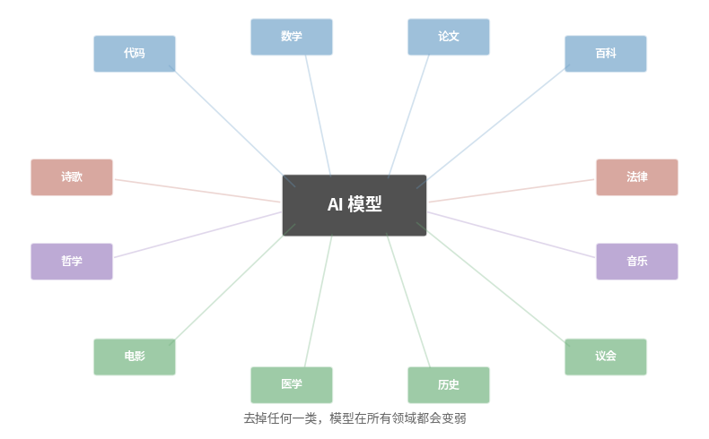
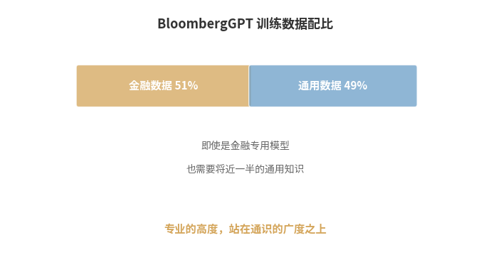
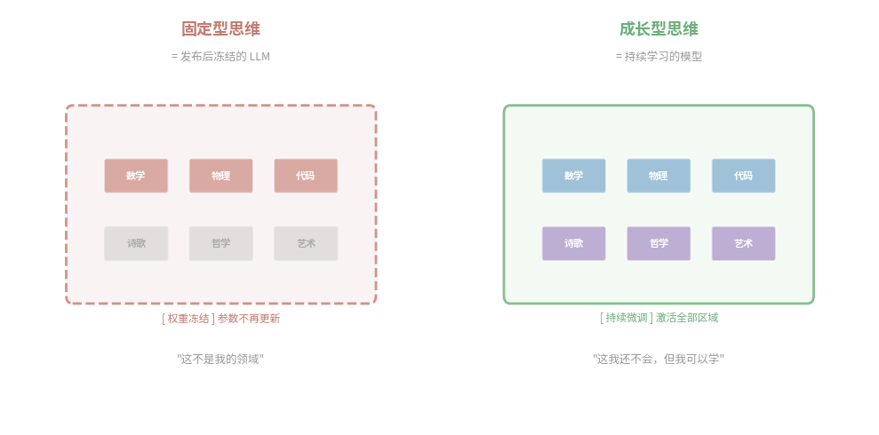
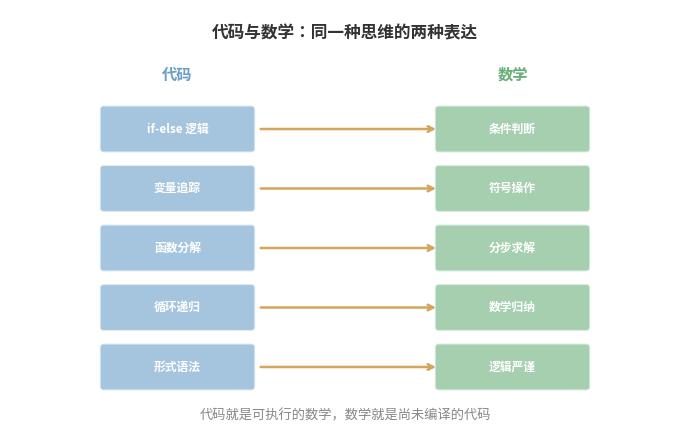
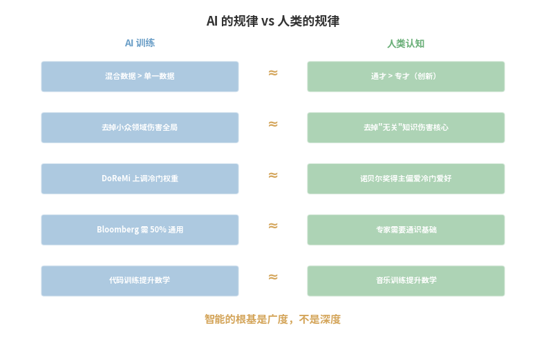

高考那年，我在志愿表上勾了「理科」。

从那一刻起，我再也没有认真读过一首诗，没有翻开过一本哲学书，没有走进过一次美术馆。我不觉得有什么损失——理科生不需要这些，对吧？术业有专攻，我有我的赛道。

二十年后，我开始学 AI。然后 AI 告诉了我一件事——

> **把诗歌从训练数据中删掉，模型的数学能力会下降。**

不是诗歌能力下降。是**数学**能力下降。

这个发现让我愣了很久。然后我意识到：**当年那张志愿表，不是让我选了一个方向——而是让我砍掉了自己的一半。**

---

## 一、去掉诗歌，数学变差

这不是比喻，是实验数据。

2020 年，EleutherAI 发布了 **The Pile** 数据集——825 GB 文本，来自 22 个不同领域：代码、论文、医学、法律、百科、古典文学、哲学、电影字幕、议会记录……

当研究者用这个混合数据集训练模型，再跟只用网页文本训练的模型对比时，发现：**在几乎所有领域上，混合训练的模型都更强**——包括那些跟文学、哲学毫无关系的技术领域。



2023 年，Google 和斯坦福发表了 **DoReMi** 论文。他们让一个小模型自动寻找"最优数据配比"。结果：

> **算法一次又一次地上调那些小而冷门的领域——哲学、议会记录、数学习题——同时下调占比最大的网页文本。**

准确率提升 **6.5 个百分点**，训练效率提升 **2.6 倍**。

你以为那些"没用"的数据是杂质，AI 说它们是维生素。

---

## 二、只喂金融数据，连金融都做不好

如果你觉得"通用模型需要通用数据"是理所当然的，那来看专业模型的教训。

彭博社训练了一个金融专用大模型 **BloombergGPT**，500 亿参数。他们拥有全世界最好的金融数据——40 年的新闻、财报、研报。

最终的训练配比？**金融 51%，通用 49%。** 几乎对半开。



为什么？因为一个只读过财报的模型，不理解"黑天鹅"是一个隐喻，不知道"量化宽松"的政治背景，不明白为什么一条推特可以让股价暴跌。

**只用金融数据训练的模型，连金融任务都做不好。**

停一下。你有没有觉得这句话很耳熟？

把"金融"换成"理科"——只学理科的人，连理科都学不透。把"金融"换成你的专业——只懂你专业的人，连你的专业都理解不深。

> **专业的高度，不是由专业的深度单独决定的。它站在通识的广度之上。**

---

## 三、你就是一个大模型

让我把话说透。

**你就是一个大语言模型。**

从出生到高考，你的"预训练数据"被精心筛选过。文科生的训练集里几乎没有微积分，理科生的训练集里几乎没有诗歌。你以为你是在"选择专业方向"，但实际上，你是在**人为缩窄自己的训练分布**。

就像 BloombergGPT 发现的——只激活一半的参数区域，你对世界的理解一定是有偏差的。

更让人不安的是接下来发生的事。

毕业了。工作了。你的"参数"定型了。你开始用固定的思维模式处理所有问题。就像一个已经发布的 LLM——**权重冻结，不再更新**。面对分布外的问题，你会困惑、会抗拒、会说"这不是我的领域"。

你管这叫"专业"。但换一种说法，它叫**过拟合**。

过拟合的模型在训练集上表现完美，在真实世界中一塌糊涂。过拟合的人在自己的领域游刃有余，面对跨界问题时手足无措——不是因为他笨，而是因为他从未被那些数据训练过。

```text
固定型思维 ≈ 发布后冻结的 LLM
                权重不再更新
                只能处理训练分布内的问题
                "这不是我擅长的"

成长型思维 ≈ 持续学习的模型
                不断用新数据微调
                主动扩展训练分布
                "这我还不会，但我可以学"
```



那什么是**成长型思维**？

就是拒绝让自己的参数冻结。时刻准备好接收新领域的数据，激活那些从未被激活的神经元区域。

费曼学画画，乔布斯学书法，达芬奇同时研究解剖和飞行器。他们不是天才。他们只是**拒绝让自己的权重冻结**。

> **文理分科最大的伤害，不是让你少学了几门课。而是让你相信，有些知识"不属于你"。这个信念本身，就是对你的参数空间最残酷的剪枝。**

---

## 四、AI 证明了一件事——知识没有边界

你可能会说：代码提升数学，这不奇怪——代码和数学本来就是近亲嘛。

没错。代码就是可执行的数学，数学就是尚未编译的代码。从欧几里得的算法到图灵的可计算性理论，二者的边界从来就不存在。



但问题来了——如果代码和数学的互助在意料之中，那么**诗歌和逻辑推理呢？哲学和科学计算呢？电影字幕和自然语言理解呢？**

The Pile 和 DoReMi 的实验给出了答案：**它们都在帮忙。**

而且不只是"有点帮助"。当算法自动寻找最优配比时，它会**拼命上调那些占比最小的冷门领域**——因为这些领域提供的信息密度最高、跟其他领域的互补最强。

这说明什么？

> **知识之间的连接，远比我们看到的更深、更广。你以为不相关的两个领域，在深层可能共享同一根神经。**

David Epstein 在《广度》中发现了人类世界里完全相同的规律：

> **诺贝尔奖得主拥有艺术爱好的概率，是普通科学家的 22 倍。**

二十二倍。他们演奏乐器、画画、写小说。这不是业余消遣——最具影响力的科学突破往往来自**类比思维**，从一个领域借用概念解决另一个领域的问题。而类比思维需要你在多个领域都有真实的体验。

```text
AI 的规律：                        人类的规律：
─────────────────────────         ─────────────────────────
多领域混合数据 > 单一领域数据       通才 > 专才（在创新上）
去掉小众领域会伤害所有领域         去掉"无关"知识会伤害核心能力
DoReMi 上调冷门领域权重            诺贝尔奖得主偏爱冷门爱好
Bloomberg 需要 50% 通用数据        专家需要通识基础
```



AI 用万亿 token 的实验，重新发现了一个古老的真理：**智能的根基是广度，不是深度。**

---

## 五、其实中国人早就知道

我们今天讨论"文理融合"，仿佛这是什么新发现。但中国文明从来就没分过文理。

**农历**不是"落后的旧历法"。它同时追踪太阳（365.24219 天）和月亮（29.53059 天）两个不同步的周期——这是一个精妙的数学优化问题。中国古人在春秋时期就发现了「十九年七闰」：19 个太阳年 ≈ 235 个朔望月，误差仅 2 小时。元代郭守敬的《授时历》（1281 年）测定的回归年精度，与 300 年后欧洲格里历**完全相同**。

**农历是天文学 + 数学 + 农业 + 哲学的熔炉。** 你告诉我，这是"文科"还是"理科"？

**庄子**在《养生主》里讲庖丁解牛——三个境界：看到整头牛，看到内部结构，最后"以神遇而不以目视"。这难道不是深度学习训练的完美隐喻？从随机初始化到特征提取到泛化——两千三百年前，庄子用一个屠夫的故事讲透了。

老子说**"为学日益，为道日损"**——学知识做加法，理解本质做减法。这恰恰是模型压缩的核心哲学：删去冗余参数，保留本质，模型反而更强。

> **道家思想不是"文科知识"。它是人类最早的系统论。它只是没有用数学公式写出来——因为在那个时代，汉语本身就是最好的公式。**

我学习 AI 的许多灵感，受到了道家的启示。当我理解了「万物负阴而抱阳，冲气以为和」的时候，我更容易理解——世界不是非此即彼的二元对立，而是阴阳交融的动态平衡。

**文理分科，恰恰是一种人为制造的二元对立。**

---

## 六、谁在塑造 AI 的灵魂？

如果你还觉得"文科无用"，来看看谁在做 AI 最难的工作。

**Amanda Askell**——Claude 的"性格设计师"。邓迪大学美术+哲学学士，牛津哲学硕士，纽约大学哲学博士。没有一行代码背景。

她负责的工作——**定义一个 AI 应该具有什么样的价值观**——是整个行业最难的问题。什么叫"诚实"？什么叫"有帮助"？什么叫"无害"？这些是从苏格拉底到康德一直在追问的哲学问题。

AI 公司招聘 RLHF 标注员时，特别偏好作家、哲学系博士生、记者。因为他们需要的判断力——**对语气的敏感、对文化语境的理解、对微妙伤害的识别**——恰好是人文教育培养的核心能力。

而 AI 在艺术上的不足，更深刻地揭示了人文学科的价值。2024 年的创造力研究发现，LLM 能把一个想法发展得很好，但在**原创性**上远远落后于人类——因为训练过程惩罚偏离统计均值，而偏离均值恰恰是艺术的生命。

> **艺术不是"没有规律"。艺术的规律比数学更复杂、更高维、更深地嵌入在人类文化之中。AI 在艺术上的不足，恰恰证明了人文学科的深度，而非它的浅薄。**

---

## 七、67 年的错误

我们觉得"文理分科"天经地义，仿佛知识本来就应该这样分。

但**亚里士多德**同时研究物理学、伦理学、诗学、逻辑学。**达芬奇**说："研究艺术的科学。研究科学的艺术。学会如何看。意识到所有事物都彼此相连。"**Ada Lovelace**——诗人拜伦的女儿——把**诗意的想象力**带入计算领域，写出了世界上第一个计算机程序，称之为"诗性科学"。

1959 年，C.P. Snow 发表了著名演讲"两种文化"，批评知识界分裂成科学和人文两个阵营。但**他的本意是批评这种分裂，不是描述自然状态**。

67 年过去了，我们不仅没有解决这个问题，还把它制度化了——分文理科、分院系、分预算、分就业方向、分社会尊重。

分科不是为了学生的认知发展设计的。**它是为了行政效率设计的**——学校需要课表，考试需要科目，大学需要院系。这就像火车轨距是 1435 毫米——不是因为这是物理最优宽度，而是英国矿车就这么宽，然后所有人跟着用了。

AI 出现了。它不在乎你的制度。它用万亿 token 的实验告诉我们：

> **知识的自然状态不是分裂，而是融合。硬把它分开的，不是知识的本质，而是我们的管理需要。**

---

## 八、解冻你的权重

我曾经也是文理分科的产物。我曾经也相信"术业有专攻"就够了。我曾经也觉得，不读诗不听音乐不影响我做技术。

**我错了。**

写《看见数学》十六篇的过程中，我不断被历史、哲学和艺术的故事打动——它们不是数学的点缀，而是数学的血肉。不理解毕达哥拉斯对音乐和数字的痴迷，你就不理解数学为什么追求"美"。不理解中国古人对天象的敬畏和对"道"的追问，你就不理解十九年七闰的精度为什么能比肩三百年后的欧洲。

每一次我试图深入一个领域，最终都被引向另一个看似无关的领域。

> **知识不是一棵树——它是一张网。你拉动任何一个节点，整张网都会震动。**

所以我在构思《看见物理》的同时，也在想《看见艺术》、《看见哲学》。不是因为我想做跨学科专家——而是因为我发现，**根本就没有"跨学科"这回事**。从来只有一个学科，它叫"理解世界"。

此刻就是最好的时候。

你不需要文凭、不需要学科标签、不需要任何人的许可。你只需要一样东西——

**解冻你的权重。**

打开一本你"不该看"的书。听一首你"听不懂"的音乐。学一门你"用不上"的课。去激活那些从未被激活的参数区域。

你可能会发现，那些你以为"没用"的东西，正是让你涌现出突破性想法的那 49%。

> **一个模型需要读诗歌、读法律、读代码、读哲学，才能学会思考。**
>
> **你也一样。**
>
> **别等下一个版本了。现在就开始更新。**

---

*附：本文引用的研究*

| 研究 | 年份 | 关键发现 |
|------|------|----------|
| The Pile (EleutherAI) | 2020 | 22 领域混合训练优于单一网页数据 |
| DoReMi (Google/Stanford) | 2023 | 算法自动上调冷门领域权重，+6.5pp 准确率 |
| BloombergGPT | 2023 | 金融专用模型仍需 49% 通用数据 |
| code-davinci 现象 | 2022 | 代码训练大幅提升数学推理能力 |
| TTCT 创造力测试 | 2024 | LLM 展开能力强但原创性弱 |
| Epstein《广度》| 2019 | 诺贝尔奖得主有艺术爱好的概率是普通科学家 22 倍 |

---

<div style="margin-top:30px;padding-top:20px;border-top:1px solid #e0e0e0;font-size:14px;color:#999;line-height:1.8;text-align:center;">

博客：https://Jason-Azure.github.io/ai-blog/

微信公众号：AI-lab学习笔记

</div>
