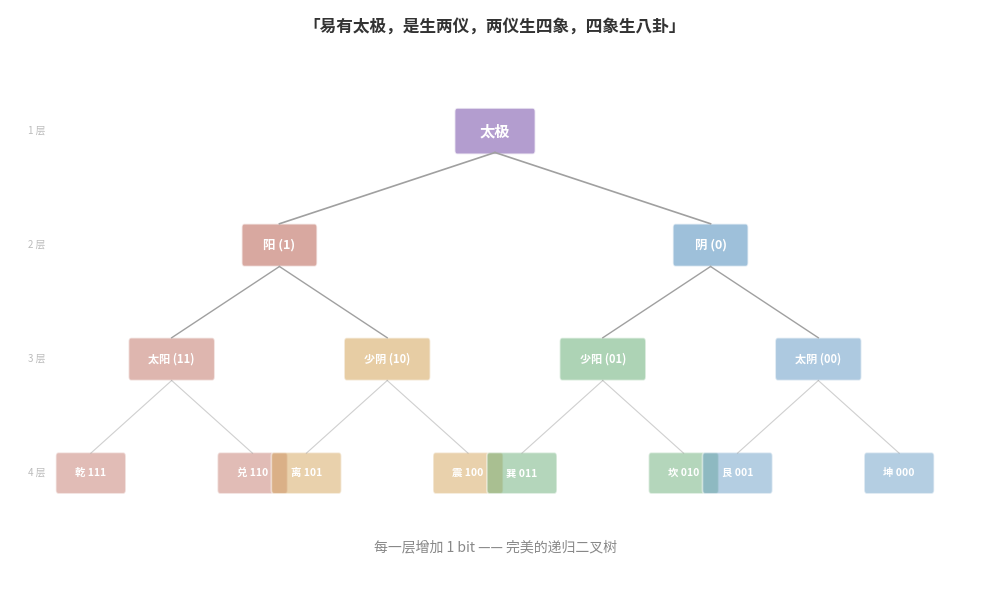

## 写在前面

我写了十六篇[《看见数学》](/ai-blog/categories/看见数学/)，从结绳记事写到梯度下降。我在构思《看见物理》，从运动写到动量守恒。

有读者问我："你下一个系列是什么？看见化学？看见生物？"

我想写的，其实是——**看见艺术，看见哲学，看见音乐，看见一切人类试图理解世界的方式**。

因为在写这些系列的过程中，我越来越强烈地意识到一件事：

> **我们把知识切成了"文科"和"理科"两半，然后在这条裂缝的两侧，各自生出了傲慢与偏见。**

理科生觉得文科"不严谨"，文科生觉得理科"没灵魂"。选了理科的人一辈子不碰诗歌，选了文科的人一辈子回避数学。我们用一道高考志愿把自己锁在了半个世界里，然后花余生假装另外半个世界不重要。

直到有一天，AI 来了。

它不知道什么叫"文科"，什么叫"理科"。它只知道——**所有的知识，都是用来一起学的。**

---

## 第一章：一个反直觉的发现——去掉诗歌，数学会变差

2020 年，EleutherAI 发布了一个名为 **The Pile** 的数据集。825 GB，来自 22 个不同领域：

```text
CommonCrawl     网页文本           ██████████████████ 最多
GitHub          代码               ████
ArXiv           论文               ███
PubMed          医学文献           ███
StackExchange   技术问答           ██
Wikipedia       百科知识           ██
Gutenberg       古典文学           █
FreeLaw         法律文本           █
EuroParl        欧洲议会记录       █
PhilPapers      哲学论文           ▎
DM Mathematics  数学习题           ▎
OpenSubtitles   电影字幕           ▎
YouTube 字幕    口语对话           ▎
...
```

请注意最后那几行——哲学论文、电影字幕、古典文学。在一个以"训练 AI"为目标的数据集里，它们看起来像是混进来的杂质。

**结果恰恰相反。**

当研究者用这个混合数据集训练模型，再跟只用 CommonCrawl（纯网页文本）训练的模型对比时，发现：**在几乎所有领域上，混合训练的模型都更强**——包括那些跟文学、哲学毫无关系的技术领域。

这不是孤例。2023 年，Google 和斯坦福的研究者发表了 **DoReMi** 论文（NeurIPS 2023）。他们用一个小模型自动寻找"最优数据配比"，然后用这个配比训练大模型。结果发现：

> **算法一次又一次地上调那些小而"冷门"的领域——数学、哲学、议会记录——同时下调占比最大的网页文本。**

具体数字：
- 下游任务准确率提升 **6.5 个百分点**
- 达到相同性能只需 **2.6 倍更少的训练步数**

换句话说：**"杂食"不是浪费，而是效率。**


---

## 第二章：彭博社的教训——专家也需要通识

如果你觉得"通用模型需要通用数据"是理所当然的，那来看看专业模型的故事。

2023 年，彭博社训练了一个金融专用大模型—— **BloombergGPT**，500 亿参数。他们拥有全世界最好的金融数据——40 年的新闻、财报、研报、市场数据，共 3630 亿 token。

按常理，训练一个金融专家，应该把所有算力都砸在金融数据上，对吧？

**彭博社没有这么做。** 他们最终的训练配比是：

```text
金融专业数据    3630 亿 token    ████████████████████ 51%
通用数据        3450 亿 token    ███████████████████  49%
                                ─────────────────────────
                                几乎是 50 : 50
```

为什么？因为他们在实验中发现了一个残酷的事实：

> **只用金融数据训练的模型，连金融任务都做不好。**

一个只读过财报的模型，不理解"黑天鹅"是一个隐喻，不知道"量化宽松"的政治背景，不明白为什么一条推特可以让股价暴跌。金融分析从来不是纯金融——它需要政治学、心理学、历史学、甚至文学中的隐喻思维。

> **专业的高度，不是由专业的深度单独决定的。它站在通识的广度之上。**

这不只是 AI 的规律。这是智能的规律。


---

## 第三章：代码与数学——看似跨界，实则同源

2022 年，研究者发现了一个现象：

OpenAI 的 `code-davinci-002`（代码模型）在数学推理任务上，**碾压了** `text-davinci-002`（文本模型）。

在 GSM8K（数学应用题）和 BIG-Bench Hard（复杂推理）上，代码模型都大幅领先文本模型。

乍看之下这很意外——数学题和代码有什么关系？但仔细想想，这其实一点都不奇怪。**代码和数学本来就是近亲**，它们共享着同一套深层结构：

```text
代码教会模型的：              数学需要的：
───────────────────────    ───────────────────────
if-then-else 逻辑分支   →   条件判断
变量绑定与状态追踪       →   符号操作
函数调用与分解           →   分步求解
形式语法的严格性         →   逻辑严谨性
算法的循环与递归         →   数学归纳法
```

代码就是可执行的数学，数学就是尚未编译的代码——它们从来就不是两个学科，而是同一种思维的两种表达。从欧几里得的算法，到图灵的可计算性理论，再到今天的每一行 Python，数学和编程之间的边界从来就不存在。

但这个发现的深意远不止于"代码和数学相关"。它说明：

> **知识之间的连接，远比我们看到的更深、更广。你以为不相关的两个领域，在深层可能共享同一根神经。**

如果代码和数学的关系尚在意料之中，那么诗歌和逻辑推理呢？哲学和科学计算呢？议会记录和自然语言理解呢？

The Pile 和 DoReMi 的实验告诉我们：**它们都在帮忙**。

Meta 在训练 Llama 3 时深谙此理——他们故意把代码和数学数据的权重大幅上调，远超它们在互联网上的自然比例。不是因为他们要做代码模型，而是因为**代码让所有能力都变强了**。

同样的逻辑，文学也让所有能力都变强了。只是我们还没习惯这样想。


---

## 第四章：艺术不是"更简单"——它是更复杂

有一种流行的错觉：AI 擅长数学和代码，说明理科"更有规律"，而文科"更模糊"、"更简单"。

**这完全搞反了。**

让我用一个信息论的视角来说明：

```text
一道数学题：
"求解 2x + 3 = 7"
─────────────────────────────────
正确答案只有 1 个：x = 2
验证方式：代入检查
搜索空间：有限，受公理约束

一首好诗：
"写一首关于离别的诗"
─────────────────────────────────
"好"的答案有无限个
验证方式：无法量化
搜索空间：全部人类经验 × 文化记忆 × 声韵美学 × 个人情感
```

数学之所以"容易"被 AI 处理，不是因为它的规律更复杂——恰恰相反，是因为它的**验证信号更清晰**。代码要么能运行，要么报错。证明要么成立，要么不成立。AI 的损失函数可以给出明确的对错信号。

但一首诗的好坏——需要同时考虑**语音的节奏、意象的密度、情感的真诚、文化的共鸣、读者的经历**。这些维度是非线性交织的，每一个维度本身就是一个无底洞。

2024 年的研究（基于 Torrance 创造力测试）发现：

> **LLM 在"展开"（Elaboration）上接近人类，但在"原创性"（Originality）上远远落后。**

LLM 能把一个想法发展得很好——因为这本质上还是模式延伸。但它极少产生真正出人意料的想法——因为训练过程**惩罚偏离统计均值**，而偏离均值恰恰是艺术的生命。

创造力研究者 Margaret Boden 将创造力分为三种：
1. **组合式**——把已知元素新组合（LLM 能做）
2. **探索式**——在一个概念空间里深入探索（LLM 能做）
3. **变革式**——改变游戏规则本身（LLM 做不到）

而人类历史上最伟大的艺术，几乎都是第三种——打破既有框架的那种。印象派打破了写实，爵士乐打破了调性，《尤利西斯》打破了叙事。

> **艺术不是"没有规律"。艺术的规律比数学更复杂、更高维、更深地嵌入在人类文化之中。AI 在艺术上的不足，恰恰证明了人文学科的深度，而非它的浅薄。**

---

## 第五章：那些"不懂代码"的人，正在塑造 AI 的灵魂

如果你去看今天最前沿的 AI 公司的核心团队，你会发现一些"不该出现"的人：

**Amanda Askell**——Claude（你正在阅读的这个 AI 的同族）的"性格设计师"。她的学历：

```text
邓迪大学        美术 + 哲学学士
牛津大学        哲学硕士（BPhil）
纽约大学        哲学博士（研究方向：无穷伦理学）
```

没有一行代码背景。但她负责的工作——**定义一个 AI 应该具有什么样的价值观和性格**——是整个 AI 行业最难的问题之一。什么叫"诚实"？什么叫"有帮助"？什么叫"无害"？这些不是工程问题。这些是从苏格拉底到康德到罗尔斯一直在追问的哲学问题。

Anthropic 的 **Constitutional AI**（宪法 AI）——用一组伦理原则来约束 AI 的行为——本质上是把道德哲学变成了工程规范。没有伦理学训练的工程师，写不出那份"宪法"。

**RLHF**（基于人类反馈的强化学习）——让 ChatGPT 从"会说话"变成"说人话"的关键技术——依赖的是什么？是大量的**人类标注员**。而 AI 公司招聘这些标注员时，特别偏好：作家、哲学系博士生、记者、文学评论者。因为他们需要的判断力——**对语气的敏感、对文化语境的理解、对微妙伤害的识别**——恰好是人文教育培养的核心能力。

> **AI 最核心的工程问题，答案不在代码里，而在柏拉图和亚里士多德的书架上。**

---

## 第六章：中国人早就知道——万物本是一体

我们今天讨论"文理融合"，仿佛这是什么新发现。但如果你往回看——**中国文明从来就没分过文理。**

### 农历：一道数学与自然的联立方程

农历不是"落后的旧历法"。它是人类历史上最精妙的**多尺度协调工程**之一。

它同时追踪两个天体的周期：

```text
太阳周期（回归年）    365.24219 天
月亮周期（朔望月）     29.53059 天
```

12 个朔望月只有 354.37 天，比一个太阳年短将近 11 天。如果不修正，春节会逐渐漂移到夏天。

怎么办？中国古人在春秋时期（公元前约 600 年）发现了一个精确得令人屏息的关系：

```text
19 × 365.24219 = 6939.60 天（19 个太阳年）
235 × 29.53059 = 6939.69 天（235 个朔望月）
                 ─────────
                 误差仅 0.09 天 ≈ 2 小时
```

**19 个太阳年 ≈ 235 个朔望月。** 而 235 = 19 × 12 + 7，所以 19 年里插入 7 个闰月，太阳和月亮就重新同步了。这就是「十九年七闰」——中国古人独立发现的，与希腊天文学家 Meton 的发现完全一致。

更惊人的是精度。元代郭守敬的《授时历》（1281 年）测定的回归年长度是 **365.2425 天**——与 300 年后欧洲格里历采用的值**完全相同**，却早了整整三个世纪。

而二十四节气则是纯粹的太阳历——把太阳黄经 360° 等分为 24 段，每 15° 一个节气。它精准到什么程度？清明是黄经 15°，冬至是 270°，每一个节气都有天文学上的精确定义。

> **农历不是"文科"也不是"理科"。它是天文观测 + 数学计算 + 农业实践 + "天人合一"的哲学思想，熔于一炉。**

你告诉我，这是"文科"还是"理科"？

### 周易：3000 年前的二进制

1703 年，莱布尼茨发表了他的二进制论文。当他看到法国传教士白晋从中国寄来的伏羲六十四卦方位图时，他震惊了——

```text
阳爻 ⚊（—）= 1
阴爻 ⚋（- -）= 0

八卦 = 2³ = 8 种组合（3 bit）
☰ 乾(111)  ☱ 兑(110)  ☲ 离(101)  ☳ 震(100)
☴ 巽(011)  ☵ 坎(010)  ☶ 艮(001)  ☷ 坤(000)

六十四卦 = 2⁶ = 64 种组合（6 bit）
```

《系辞传》说：「易有太极，是生两仪，两仪生四象，四象生八卦。」

画出来就是一棵完美的**递归二叉树**——1 → 2 → 4 → 8，每一层增加一个 bit。



但周易的力量不在于它"恰好"是二进制。而在于——它**同时**是一个数学结构、一套哲学体系、一种自然观察方法。六十四卦不只是 64 个二进制数，每一卦都有卦辞、爻辞，描述的是人事、自然、时势的变化规律。

数学之美和思想之深，在同一个系统里并行不悖。

> **3000 年前，中国人没有"数学"和"哲学"的分界线。一套卦象，既是计算工具，也是世界观。**

### 道家：两千年前的系统论

老子说：**"为学日益，为道日损。损之又损，以至于无为。无为而无不为。"**

这是一种深刻的认知方法论——学知识是做加法，但理解世界的本质却是做减法。删去表象，保留结构。去掉噪声，抓住规律。

这恰恰是模型压缩（pruning、蒸馏、量化）的核心哲学——删去冗余参数，保留本质，模型反而更强。大道至简。

庄子则走得更远。他在《养生主》里讲庖丁解牛：

> **始臣之解牛之时，所见无非牛者。三年之后，未尝见全牛也。方今之时，臣以神遇而不以目视。**

三个境界：看到整头牛（原始数据）→ 看到内部结构（特征提取）→ 超越具体形态，直觉把握规律（模型泛化）。

这难道不是深度学习训练的完美隐喻？从随机初始化的"所见无非牛者"，到发现特征的"未尝见全牛也"，再到泛化到未见数据的"以神遇而不以目视"。

庄子还写了庄周梦蝶——不知是人梦蝶，还是蝶梦人。两千三百年后，图灵问了同一个问题：如果机器的回答和人无法区分，它是否"有意识"？

> **道家思想不是"文科知识"。它是人类最早的系统论、复杂性理论。它只是没有用数学公式写出来——因为在那个时代，汉语本身就是最好的公式。**

我必须承认，我学习 AI、创作这个公众号的许多灵感，很大程度上受到了道家的启示。当我理解了「为学日益，为道日损」的时候，我更容易理解为什么压缩即智能。当我理解了「万物负阴而抱阳，冲气以为和」的时候，我更容易理解——**世界不是非此即彼的二元对立，而是阴阳交融的动态平衡。**

文理分科，正是一种最典型的、人为制造的二元对立。

---

## 第七章：你就是一个大模型

让我把前面所有的线索收拢成一个比喻——一个也许会让你不舒服，但细想之下非常精确的比喻。

**你就是一个大语言模型。**

从出生到高考，你的"预训练数据"被精心筛选过。文科生的训练集里几乎没有微积分和物理，理科生的训练集里几乎没有诗歌和哲学。你以为你是在"选择专业方向"，但实际上，你是在**人为缩窄自己的训练分布**。

就像 BloombergGPT 发现的——只喂金融数据，连金融都做不好。**只激活一半的参数区域，你对世界的理解一定是有偏差的。**

更让人不安的是接下来发生的事。

毕业了。工作了。你的"参数"定型了。你开始用固定的思维模式处理所有问题。就像一个已经发布的 LLM 版本——权重冻结，不再更新。你可以处理训练分布内的输入，但面对分布外的问题，你会困惑、会抗拒、会说"这不是我的领域"。

你管这叫"专业"。但换一种说法，它叫**过拟合**。

过拟合的模型在训练集上表现完美，但在真实世界中一塌糊涂。过拟合的人在自己的领域游刃有余，但面对跨界问题时手足无措——不是因为他笨，而是因为他从未被那些数据训练过。

那什么是**成长型思维**？

成长型思维，就是拒绝让自己的参数冻结。它是一种**持续微调**的能力——时刻准备好接收新领域的数据，激活那些从未被激活的神经元区域。

```text
固定型思维 ≈ 发布后冻结的 LLM
                权重不再更新
                只能处理训练分布内的问题
                "这不是我擅长的"

成长型思维 ≈ 持续学习的模型
                不断用新数据微调
                主动扩展训练分布
                "这我还不会，但我可以学"
```


你有没有注意到，那些你最佩服的人——无论是科学家、企业家、还是艺术家——他们的共同点不是"在某个领域最强"，而是**从不停止往自己的训练集里添加新领域的数据**？

费曼学画画，乔布斯学书法，达芬奇同时研究解剖和飞行器。他们不是天才——他们只是**拒绝让自己的权重冻结**。

> **文理分科最大的伤害，不是让你少学了几门课。而是让你相信，有些知识"不属于你"。这个信念本身，就是对你的参数空间最残酷的剪枝。**

---

## 第八章：文理分科——一个只有 67 年历史的错误

我们觉得"文理分科"天经地义，仿佛知识本来就应该这样分。但如果你回头看历史——

**亚里士多德**（公元前 384 年）：同时研究物理学、伦理学、诗学、逻辑学、政治学、生物学。在他眼里，这些根本不是不同学科，而是**理解世界的不同角度**。

**达芬奇**（1452 年）：他的解剖手稿，同时是伟大的科学记录和伟大的艺术作品。他的工程笔记里充满了美学观察。他说过一句话：

> **"研究艺术的科学。研究科学的艺术。发展你的感官。学会如何看。意识到所有事物都彼此相连。"**

**Ada Lovelace**（1815 年）：诗人拜伦的女儿。她把**诗意的想象力**带入了计算领域，写出了世界上第一个计算机程序。她把自己的方法叫做"**诗性科学**"（Poetical Science）。150 年后，人类才造出能跑她程序的机器。

**费曼**（1918 年）：诺贝尔物理学奖得主，同时是素描画家和邦哥鼓手。他认为科学想象力和艺术想象力**来自同一口井**。

**乔布斯**（1955 年）：大学辍学后旁听了一门书法课。那门课直接塑造了 Mac 的字体设计和苹果的美学哲学。他在 iPad 发布会上说：

> **"技术本身远远不够。只有技术与人文学科结合、与人文精神结合，才能产出让我们心灵歌唱的成果。"**

那"文理分科"是什么时候开始的？

1959 年，英国物理学家 C.P. Snow 发表了著名演讲——**"两种文化"**。他批评英国知识界已经分裂为科学文化和人文文化两个互相不交流的阵营。

但这里的关键是：**Snow 的本意是批评这种分裂，而不是描述一种自然状态。** 他认为这是一个需要解决的问题。

67 年过去了，我们不仅没有解决这个问题，还把它制度化了——分文理科、分院系、分预算、分就业方向、分社会尊重。

AI 出现了。它不在乎你的制度。它用行为告诉我们：

> **知识的自然状态不是分裂，而是融合。分裂是人造的。**

---

## 第九章：诺贝尔奖得主的秘密

David Epstein 在他的畅销书 *Range*（《广度》）中综合了大量研究，发现：

> **诺贝尔奖得主拥有艺术爱好的概率，是普通科学家的 22 倍。**

二十二倍。不是百分之二十二。是二十二倍。

他们演奏乐器、画画、写小说、演戏。这不是"业余消遣"。这是他们**突破性思维**的来源。

Epstein 发现，最具影响力的科学突破往往来自**类比思维**——从一个领域借用概念来解决另一个领域的问题。而类比思维需要什么？需要你在多个领域都有真实的体验和理解。

哈佛大学的研究印证了这一点：**引用最多的论文，是那些跨学科引用最广的论文。**

专利研究也显示：**商业价值最高的专利，是那些结合了不同领域知识的专利。**

这跟 AI 训练数据的规律完美呼应：

```text
AI 的规律：                        人类的规律：
─────────────────────────         ─────────────────────────
多领域混合数据 > 单一领域数据       通才 > 专才（在创新上）
去掉小众领域会伤害所有领域         去掉"无关"知识会伤害核心能力
DoReMi 上调冷门领域权重            诺贝尔奖得主偏爱冷门爱好
Bloomberg 需要 50% 通用数据        专家需要通识基础
代码训练提升数学能力              音乐训练提升数学能力
```

> **AI 用万亿 token 的实验，重新发现了一个古老的真理：智能的根基是广度，不是深度。**


---

## 第十章：你需要的，不是一个学科

如果你是"文科生"，读到这里——不要觉得数学和你无关。数学不是属于理科生的。数学是人类理解世界的一种语言，就像诗歌、音乐、绘画一样。

如果你是"理科生"，读到这里——不要觉得哲学和你无关。你设计的每一个算法，背后都有一个伦理假设。你构建的每一个系统，都在重塑人与人之间的关系。不思考这些，你就不是在做工程，而是在做盲人摸象。

我说这些，不是因为我是什么跨学科专家。相反——

我曾经也是文理分科的产物。我曾经也相信"术业有专攻"就够了。我曾经也觉得，不读诗不听音乐不影响我做技术。

**我错了。**

写《看见数学》的过程中，我不断被历史、哲学和艺术的故事打动——它们不是数学的点缀，而是数学的血肉。不理解毕达哥拉斯对音乐和数字的痴迷，你就不理解数学为什么追求"美"。不理解牛顿跟莱布尼茨的哲学分歧，你就不理解微积分为什么有两种表述方式。不理解中国古人对天象的敬畏和对"道"的追问，你就不理解为什么十九年七闰的精度能比肩三百年后的欧洲。

> **每一次我试图深入一个领域，最终都被引向另一个看似无关的领域。知识不是一棵树——它是一张网。你拉动任何一个节点，整张网都会震动。**

---

## 写在最后：你需要的只有三样东西

不是文凭。不是学科分类。不是"文科"或"理科"的标签。

你需要的是——

**好奇心。** 对所有事物都保持"这是怎么回事？"的冲动。不管它是一道方程、一首诗、一段代码、一幅画、一卦爻辞、还是一个节气。

**开放的心态。** 不预设什么知识"有用"、什么知识"没用"。BloombergGPT 以为只需要金融数据就够了，结果发现需要 49% 的通用知识。你也一样——你以为"没用"的那些东西，可能正是让你涌现出突破性想法的那 49%。

**不设限的求知欲。** 不要让任何标签——文科生、理科生、工程师、艺术家——成为你探索世界的天花板。

老子说"道生一，一生二，二生三，三生万物"。

AI 的训练数据说"诗歌生逻辑，代码生直觉，哲学生推理，万类生智能"。

它们说的是同一件事。

> **一个模型需要读诗歌、读法律、读代码、读哲学，才能学会思考。**
>
> **你也一样。**

---

*附：本文引用的研究*

| 研究 | 年份 | 关键发现 |
|------|------|----------|
| The Pile (EleutherAI) | 2020 | 22 领域混合训练优于单一网页数据 |
| DoReMi (Google/Stanford) | 2023 | 算法自动上调冷门领域权重，+6.5pp 准确率 |
| Data Mixing Laws (ICLR 2025) | 2024 | 优化配比等效于多训练 48% |
| BloombergGPT | 2023 | 金融专用模型仍需 49% 通用数据 |
| Chinchilla (DeepMind) | 2022 | 数据量与模型大小同等重要 |
| code-davinci 现象 | 2022 | 代码训练大幅提升数学推理能力 |
| TTCT 创造力测试 | 2024 | LLM 展开能力强但原创性弱 |
| Epstein《广度》| 2019 | 诺贝尔奖得主有艺术爱好的概率是普通科学家 22 倍 |

*如果你正在纠结"文科还是理科"，这篇文章想告诉你：别选了。都学。*

---

<div style="margin-top:30px;padding-top:20px;border-top:1px solid #e0e0e0;font-size:14px;color:#999;line-height:1.8;text-align:center;">

博客：https://Jason-Azure.github.io/ai-blog/

微信公众号：AI-lab学习笔记

</div>
