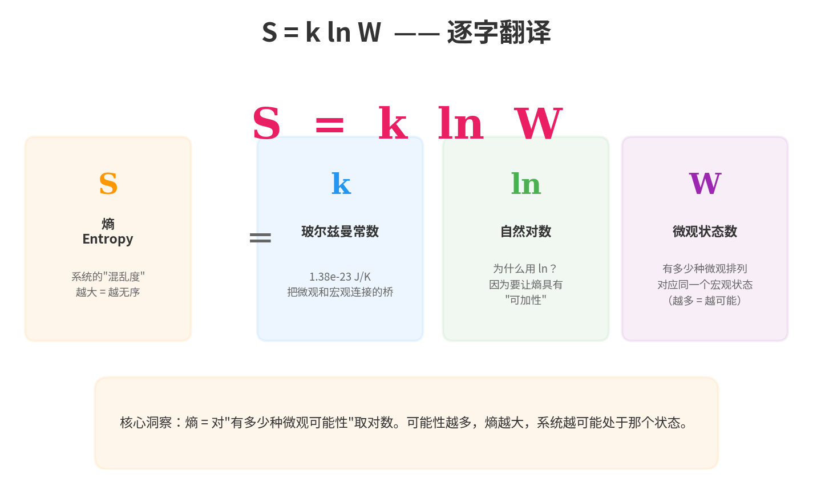
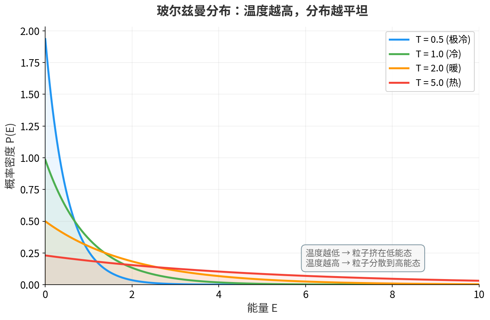
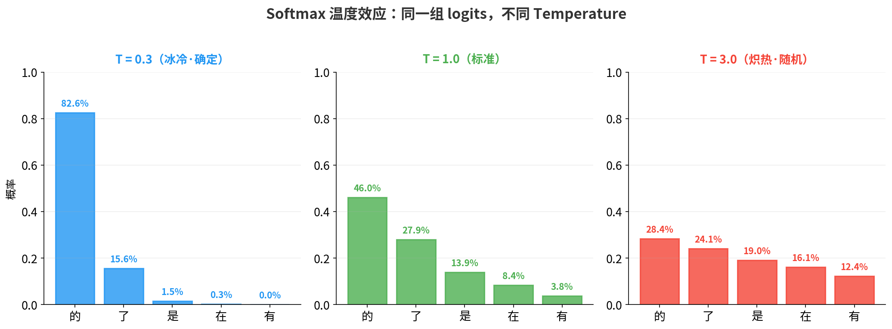
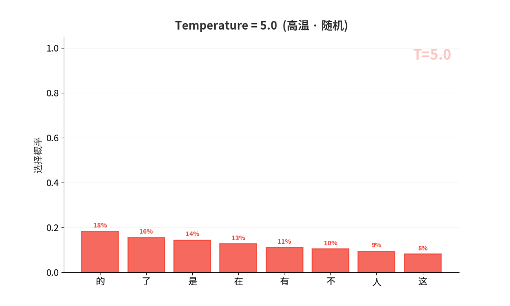
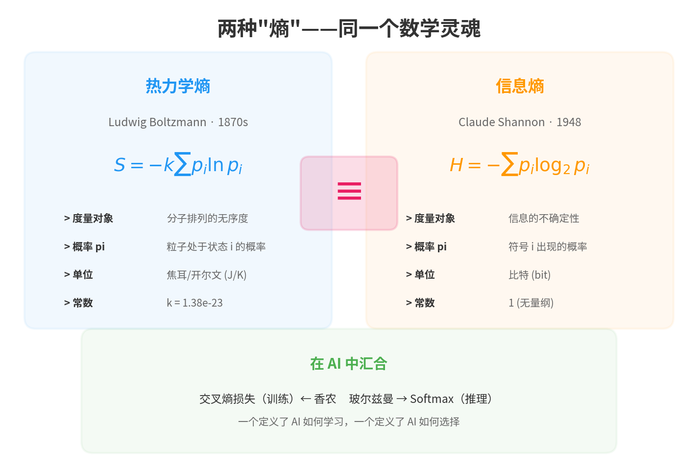
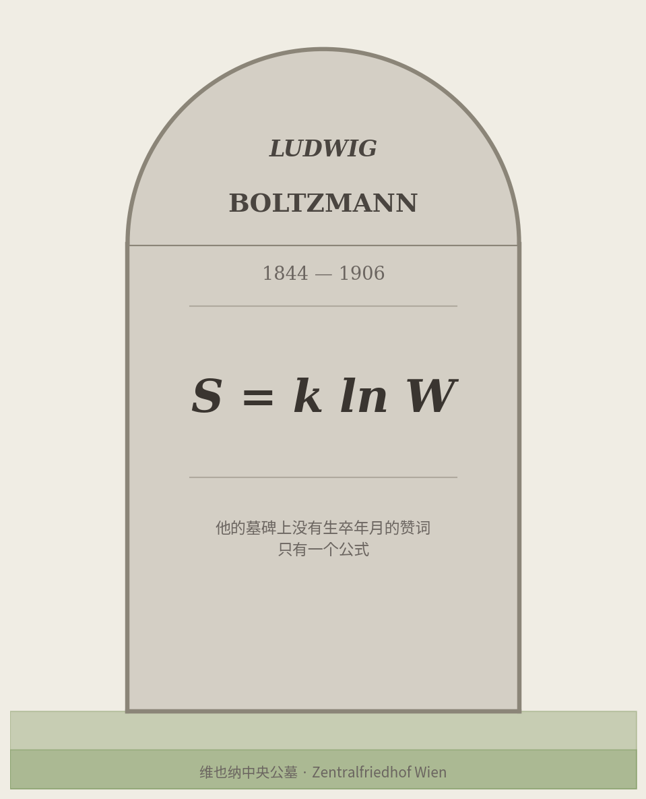

1906 年 9 月 5 日，意大利的里雅斯特附近的杜伊诺，一个面朝亚得里亚海的小度假村。

62 岁的路德维希·玻尔兹曼（Ludwig Boltzmann）在妻子和女儿去海滩游泳的时候，永远闭上了眼睛。

他是维也纳大学的物理学教授，统计力学的奠基人，一位用数学重新定义了"热"与"冷"的天才。但在生命的最后十年，他陷入了一场没有尽头的战争——**他坚信原子是真实存在的，而当时物理学界最有权势的人们说他错了。**

恩斯特·马赫称原子是"思维经济的辅助手段"，威廉·奥斯特瓦尔德认为一切可以用能量来解释而不需要原子，甚至连他在柏林的椅子继任者都在反对他。

他不知道的是：就在他离世的前一年，一个叫爱因斯坦的年轻人发表了布朗运动的论文，间接证明了原子的存在。几年后，让·佩兰的实验将彻底终结这场争论。

他更不知道的是：120 年后，他为分子写的概率公式，正以一个新名字在全世界每秒被执行数十亿次。

**那个名字叫 Softmax。**

但在讲述这个公式之前，让我先问你一个问题。

---

## 一、一个你每天都在调的参数

如果你用过 ChatGPT 的 API，你一定见过一个参数叫 **Temperature**。

文档说：Temperature 越高，输出越随机。你调成 0.7，AI 回答比较稳定；调成 1.5，AI 开始胡说八道；调成 0，AI 变成一个只会重复最高概率答案的复读机。

你可能以为"温度"只是一个比喻——就像我们说代码有"坏味道"一样，不是真的有味道。

**但如果我告诉你：这个 Temperature，和物理温度是同一个东西？**

不是类比。不是隐喻。是**数学等价**。

Temperature = 1.0 对应的是一个系统在热平衡下的自然分布——就像室温下的空气分子，大部分安静，少数活跃。Temperature = 0 对应绝对零度——所有粒子冻结在最低能态，GPT 永远只选概率最高的词。Temperature = 2.0 相当于把系统加热到两倍温度——分子剧烈震荡，GPT 开始语无伦次。

**1870 年的气体分子和 2026 年的 GPT，用的是同一个公式。写出这个公式的人，就是那位在杜伊诺永远闭上眼睛的物理学家。**

这不是一个修辞。接下来我会让你亲眼看到这两个公式，然后你会发现——它们一模一样。

---

## 二、一个不被相信的人

玻尔兹曼生活在一个奇怪的时代。

19 世纪末的物理学正处于一场身份危机中。经典力学已经完美运转了两百年，热力学的宏观定律——能量守恒、熵增——也已经被验证得无可挑剔。一切看起来如此完美，以至于开尔文勋爵在 1900 年说出了那句著名的话："物理学的天空只剩下两朵乌云。"

但有一个问题：**热力学的定律从哪里来？**

为什么热量总是从高温流向低温？为什么杯子里的咖啡会变冷，却从来不会自发变热？卡诺、克劳修斯和开尔文用宏观实验建立了热力学定律，但这些定律的**本质**是什么？

玻尔兹曼的回答惊人而大胆：**热力学定律不是基本定律，而是概率的结果。**

他说：一杯热咖啡变冷，不是因为某个神秘的"熵增法则"在强迫它——而是因为**咖啡分子的能量均匀分散是一种压倒性的概率优势**。分子"可以"自发聚集到一侧让咖啡重新变热，但这件事发生的概率，大约是 10 的负天文数字次方。

用今天的话说：不是"不能"，是"不可能到你等到宇宙结束也等不到"。

这个思想在今天看来如此自然——**宏观规律 = 微观概率的统计涌现**——但在 1870 年代，它是异端。

因为它有一个前提：**你必须相信原子存在。**

而马赫说：我们从来没有看见过原子。看不见的东西，就不应该出现在物理学中。

玻尔兹曼和马赫之间的争论不是普通的学术辩论。马赫是维也纳大学的哲学教授，玻尔兹曼在同一所大学教物理。两人在走廊里擦肩而过，在学术会议上针锋相对。马赫的"实证主义"主张只有可观测的量才有意义——原子既然看不见摸不着，就不应该存在于物理理论中。

这不是一个人反对他。这是一个**时代**在反对他。

玻尔兹曼晚年的信件中充满了疲惫和孤独。他在一次演讲中自嘲："我是统计力学最后的幸存者。"他患有严重的抑郁症，视力急剧衰退，多次住院。

1906 年的那个夏天，他带着家人去杜伊诺度假，试图在亚得里亚海的阳光下恢复精神。

他没有做到。

---

## 三、一盒气体里的赌博

让我用一个最简单的例子来说明玻尔兹曼的核心直觉——也是整个统计力学的基石。

想象一个盒子，中间有一道隔板。左边有 100 个气体分子，右边是真空。现在你把隔板抽掉。

发生了什么？

分子会扩散到整个盒子里，最终大致左右各 50 个。这是我们的日常经验。但**为什么**？是什么力量驱使分子均匀分布？

玻尔兹曼的回答令人拍案叫绝：**没有任何力量。纯粹是概率。**

让我们数一数。100 个分子分布在左右两半的方式有多少种？

微观状态数 W

- 全部 100 个在左边（0 个在右边）：只有 **1** 种方式
- 50 个在左边、50 个在右边：有 $C_{100}^{50} \approx 10^{29}$ 种方式

两者的比例是 **1 : 100,000,000,000,000,000,000,000,000,000**

每个分子都在随机运动，每一种微观排列都是等概率的。但"均匀分布"对应的微观排列数量，**比"全部挤在一边"多出 29 个数量级**。

这就像你扔 100 次硬币——理论上可以全部正面，但你试试看。

玻尔兹曼把这个微观排列的数量叫做 **W**（来自德语 Wahrscheinlichkeit，概率）。

然后他写下了那个公式：

玻尔兹曼熵公式

$$S = k \ln W$$

- **S** = 熵（系统的"混乱度"）
- **k** = 玻尔兹曼常数（1.38 × 10⁻²³ J/K）
- **W** = 微观状态数（有多少种微观排列对应同一个宏观状态）

这个公式说的是一件极其深刻的事：**熵不是一种神秘的力量，而是对"有多少种微观可能性"的度量。**

系统倾向于高熵状态，不是因为有什么力量推动它，而是因为**高熵状态对应的微观方式太多了**——多到你几乎不可能看到别的。

用更直白的话说：**宇宙不是在"追求"混乱，它只是在做随机选择——而随机选择的压倒性多数结果，恰好看起来是混乱的。**

这就是玻尔兹曼的核心直觉。马赫说它是幻想。而玻尔兹曼赌上了一生。

---

## 四、那个改变一切的公式

S = k ln W 回答了"系统最终会去哪里"——答案是 W 最大的状态。

但如果我们不只关心最终状态，而是想知道**在给定温度下，每个能量水平有多少粒子**呢？

这就引出了玻尔兹曼最伟大的贡献：**玻尔兹曼分布**。

玻尔兹曼分布

$$P(E_i) = \frac{e^{-E_i / kT}}{Z}$$

其中归一化常数 $Z = \sum_j e^{-E_j / kT}$（配分函数）

让我翻译一下这个公式在说什么：

**一个系统中的粒子处于能量为 Eᵢ 的状态的概率，和 e 的负（能量/温度）次方成正比。**

直觉很简单：
- **能量越低的状态，概率越高**（分子更"喜欢"低能态）
- **温度越高，高能态和低能态的差异越小**（分子被加热后变得"不挑剔"）
- **温度趋近于零，所有粒子都冻在最低能态**
- **温度趋近于无穷，所有状态几乎等概率**

这个结果是怎么来的？核心思想极其优美：在所有满足"粒子总数不变、总能量不变"的分布方式中，**哪种分布对应的微观排列方式最多**？用拉格朗日乘数法求这个约束最优化问题，答案自然跳出来——就是这个指数分布。

换句话说：玻尔兹曼分布不是假设，而是**组合数学的必然结果**。

请你把这四条直觉记住。因为下一章，你会在一个完全不同的世界里——AI 的世界里——再次看到它们。一字不差。

---

## 五、Softmax 的真名

现在，让我兑现第一章的承诺。

在每一本深度学习教科书中，Softmax 都是这样出场的：

> Softmax 函数将一组实数转换为概率分布。

然后给你一个公式，告诉你它很有用，然后翻到下一页。

但没人告诉你**它从哪里来**。

LLM 在选择下一个词时，神经网络会为每个候选词计算一个分数，叫做 **logit**。然后这些 logit 通过以下公式变成概率：

Softmax with Temperature

$$P(w_i) = \frac{e^{z_i / T}}{\sum_j e^{z_j / T}}$$

现在把它和上一章的玻尔兹曼分布放在一起：

$$P(E_i) = \frac{e^{-E_i / kT}}{\sum_j e^{-E_j / kT}}$$

**它们是同一个公式。**

物理 → AI 翻译

| 物理学 | AI（Softmax） |
|--------|--------------|
| 能量 Eᵢ | 负 logit（-zᵢ） |
| 温度 T | Temperature 参数 |
| 配分函数 Z | 归一化分母 |
| 粒子选择能量态 | 模型选择下一个词 |

logit 越高 = 能量越低 = 概率越大。Temperature 参数就是物理温度。这不是类比，**这是数学等价**。

还记得上一章的四条直觉吗？现在让它们穿上 AI 的衣服：

T → 0

绝对零度 所有粒子冻在最低能态 
<strong>≡ 贪心解码</strong> 永远选概率最高的词

T = 1

室温 自然的能量分布 
<strong>≡ 标准采样</strong> 平衡创造力与连贯性

T → ∞

极高温度 所有状态等概率 
<strong>≡ 均匀随机</strong> 输出完全不可预测

Softmax 的名字暗示了一半真相：**soft** + **max**——它是 argmax（硬选最大值）的"软化"版本。当 T→0 时，Softmax 退化为 argmax——只有最大值得到概率 1，其余为 0。

但名字只说了一半。它还有一个更古老、更本质的名字——**玻尔兹曼分布的归一化形式。**

同一个数学对象的四个名字

- 物理学家称它为"**玻尔兹曼分布**"，称分母为"配分函数"
- 机器学习工程师称它为"**Softmax**"
- 数学家称它为"**Gibbs 测度**"
- 经济学家称它为"**logit 模型**"

**它们是同一个公式，只是换了衣服。**

这意味着什么？

意味着每次 GPT 选下一个词、每次图像分类器判断"这是猫还是狗"、每次推荐系统决定给你看哪条视频——**都在执行一次玻尔兹曼采样**。

全球每秒数十亿次。一个为 19 世纪的气体分子写的公式。

而这个公式的作者，生前没有等到世界相信他。

> 如果你读过 [《LLM 中的概率论》](/ai-blog/posts/llm-probability/)，你已经见过 Temperature 的效果。但现在你知道了它的真名——**它是 1870 年代统计力学的温度参数，穿越 150 年走进了你的聊天窗口。**

---

## 六、玻尔兹曼与香农的相遇

故事还没有结束。

1948 年，贝尔实验室的一位工程师发表了一篇论文，标题是《通信的数学理论》。这篇论文创立了信息论，作者的名字叫克劳德·香农。

在定义"信息的不确定性"时，香农需要一个名字。

传说是这样的：香农去请教冯·诺依曼，冯·诺依曼说——

**冯·诺依曼：**

> "你应该叫它'熵'。第一，因为你的公式和统计力学中的熵公式完全一样。第二，更重要的是，**因为没人真正知道熵到底是什么**，所以在辩论中你总能占上风。"

这个故事的真实性存疑，但数学等价性是铁一般的事实：

两种"熵"

**热力学熵**（玻尔兹曼，1870s）：

$$S = -k \sum_i p_i \ln p_i$$

**信息熵**（香农，1948）：

$$H = -\sum_i p_i \log_2 p_i$$

**唯一的区别**：一个常数 k，和对数的底数（自然对数 vs 以 2 为底）。

数学结构**完全相同**。

这意味着：**玻尔兹曼的物理学和香农的信息论，在数学上是同一件事。**

当你训练一个 LLM 时，损失函数是**交叉熵**——这直接来自香农的信息熵。当 AI 选词时使用的 Softmax——这直接来自玻尔兹曼的概率分布。

两条从不同源头流出的河流——一条从 1870 年代维也纳的物理课堂流出，另一条从 1948 年新泽西的贝尔实验室流出——在"AI"这片海洋中汇合了。

**训练时用香农的熵，推理时用玻尔兹曼的分布。** 现代 AI 的每一次呼吸，都同时继承了两个人的遗产。

> 如果你读过 [《信息论——从电报到 GPT 的一条暗线》](/ai-blog/posts/see-math-extra-information-theory/)，你会看到信息熵的完整推导。如果你读过 [《贝叶斯没有想到的事》](/ai-blog/posts/bayes-not-expected/)，你会看到另一个穿越世纪的公式。而现在你知道了：Softmax 的灵魂，来自一位 1906 年在杜伊诺永远闭上眼睛的物理学家。

---

## 七、墓碑上的方程

让我们回到杜伊诺。

1906 年 9 月 5 日。

玻尔兹曼去世时，物理学界对原子的态度正处于转折点——但他不知道。

1905 年——他去世的前一年——爱因斯坦发表了关于布朗运动的论文。他证明了花粉粒在水中的随机运动可以用分子的碰撞来定量解释。如果原子不存在，这种运动就无法被解释。

1908 年——他去世两年后——让·佩兰通过精密实验验证了爱因斯坦的理论。

1909 年，威廉·奥斯特瓦尔德——那个声称不需要原子就能解释一切的人——公开承认："原子假说已经被提升为一个有充分根据的科学理论。"

**玻尔兹曼没有等到这一天。差了三年。**

他的遗体被安葬在维也纳中央公墓。墓碑上没有生卒年月，没有头衔，没有赞美之词。

只有一个公式：

$$S = k \ln W$$

这是他留给世界的全部遗言。

一行公式，把宇宙的不可逆性——时间的方向、秩序的消亡、热量的流动——归结为一个简单的计数问题：**哪种排列方式最多，系统就去那里。**

而从这个公式中推导出的玻尔兹曼分布——那个 $e^{-E/kT}$——后来获得了一个他从未听过的名字：Softmax。

---

## 尾声

玻尔兹曼的遗产

$$P(x_i) = \frac{e^{-E_i / T}}{\sum_j e^{-E_j / T}}$$

**他为分子写的概率分布，成了智能的心跳。**

1906 年，他在杜伊诺的度假村写下人生最后一页。他不知道原子的存在即将被证实，不知道他的公式将穿越一个世纪，不知道每一次 ChatGPT 选择下一个词、每一次推荐系统决定你看什么——都在执行他写下的方程。

他什么都不知道。

但数学知道。

下次看到这些，想起他

- 看到 **Softmax**？那是玻尔兹曼分布
- 看到 **Temperature**？那是物理温度 T
- 看到 **logits**？那是负能量 -E
- 看到**交叉熵损失**？那是玻尔兹曼的熵穿上了香农的衣服

**每一次 AI 推理，都是一次玻尔兹曼采样。他为分子写的公式，如今是智能的心跳。**

---

## 参考与延伸

> **原始文献**
>
> - Boltzmann, L. (1877). *Über die Beziehung zwischen dem zweiten Hauptsatze der mechanischen Wärmetheorie und der Wahrscheinlichkeitsrechnung respektive den Sätzen über das Wärmegleichgewicht.* 统计力学的奠基论文
> - Shannon, C. E. (1948). *A Mathematical Theory of Communication.* Bell System Technical Journal. 信息论开山之作

> **玻尔兹曼传记**
>
> - Cercignani, C. (1998). *Ludwig Boltzmann: The Man Who Trusted Atoms.* Oxford University Press. 最权威的玻尔兹曼传记
> - Lindley, D. (2001). *Boltzmann's Atom: The Great Debate That Launched a Revolution in Physics.* 原子论之争的通俗叙事

> **博客相关文章**
>
> - [《LLM 中的概率论》](/ai-blog/posts/llm-probability/) --- Temperature 参数的详细讲解
> - [《贝叶斯没有想到的事》](/ai-blog/posts/bayes-not-expected/) --- 贝叶斯定理与 AI 的联系
> - [《欧拉的 e》](/ai-blog/posts/eulers-e/) --- e 这个常数的前世今生
> - [《信息论——从电报到 GPT 的一条暗线》](/ai-blog/posts/see-math-extra-information-theory/) --- 信息熵的完整推导
> - [《交叉熵损失函数》](/ai-blog/posts/cross-entropy-loss/) --- AI 训练中的熵
> - [《知识蒸馏——当模型学会偷师》](/ai-blog/posts/knowledge-distillation/) --- 温度参数在蒸馏中的应用
