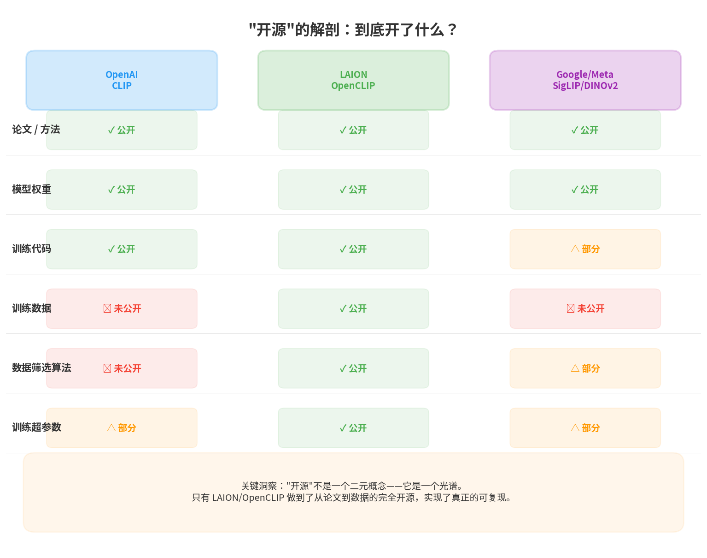
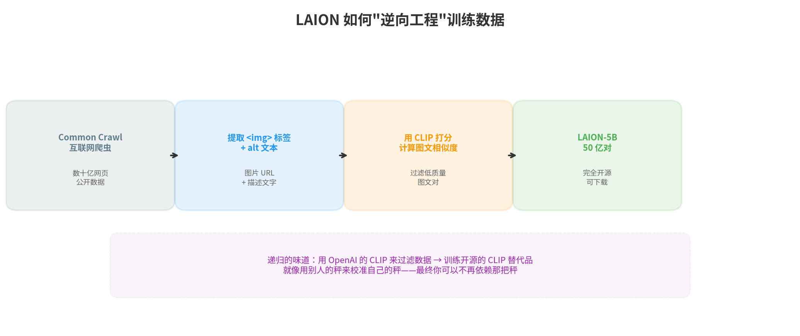
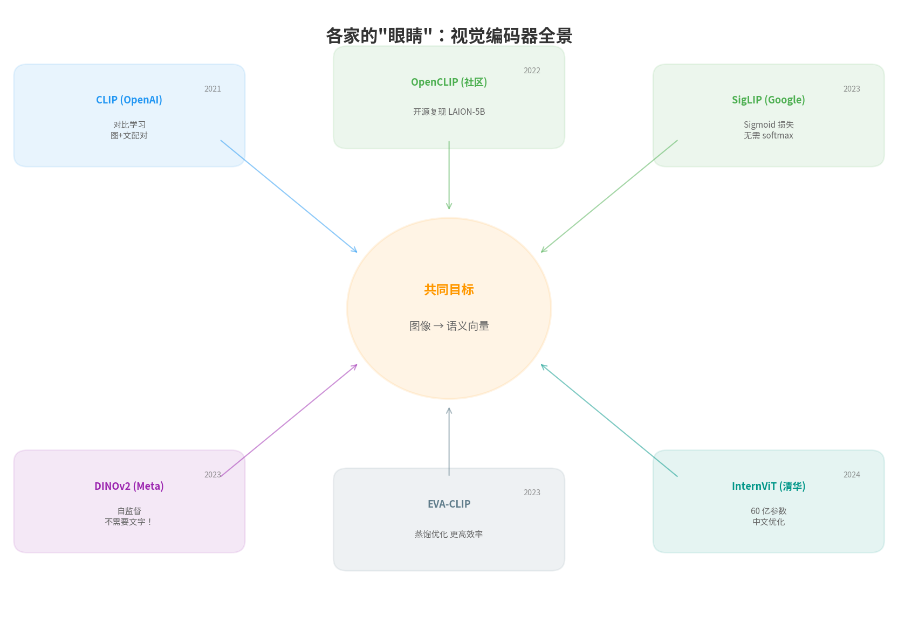
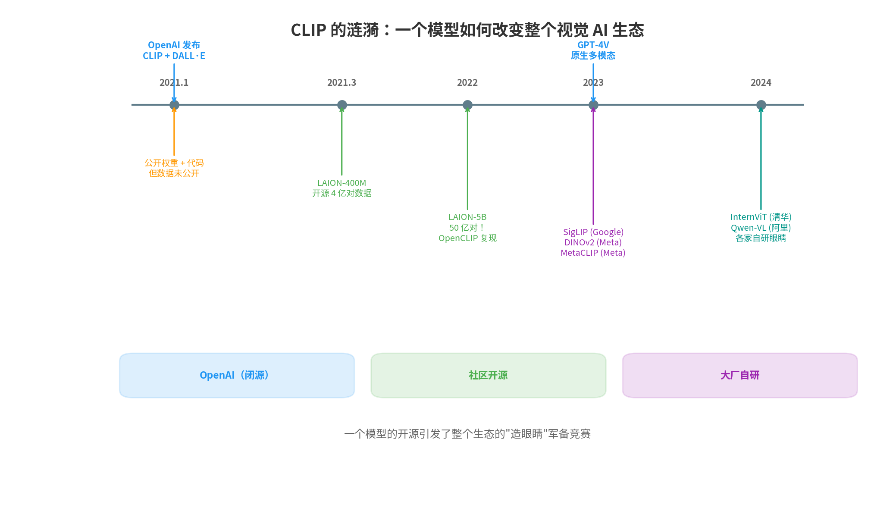

## 引子：一个不完全的开源

2021 年 1 月，OpenAI 同时发布了两个模型：

```text
DALL·E — 用文字生成图片（"画一只穿宇航服的猫"）
CLIP   — 用文字理解图片（"这张图里是什么"）

它们是一对：
  CLIP  = 理解（图 → 文）
  DALL·E = 生成（文 → 图）

两者共享同一个核心洞察：图和文可以住在同一个向量空间。
```

CLIP 的全名是 **Contrastive Language-Image Pre-training**（对比式语言-图像预训练）。它的核心思想在 [上一篇多模态文章](/ai-blog/posts/multimodal-llm-architecture/) 中已经讲过：**在 4 亿对图文数据上训练，让匹配的图片和文字在向量空间中靠近，不匹配的推远。**

训练完成后，CLIP 就成了一个"会看的编码器"——它能把任何图片变成一个语义向量，和文字的向量直接比较。

OpenAI 把 CLIP 的**模型权重和代码**全部公开了。

**但 4 亿对训练数据，一个字也没给。**

这不是疏忽，是选择。而这个选择，引发了一场改变整个视觉 AI 生态的连锁反应。

---

## 一、"开源"的解剖：到底开了什么？

在 AI 领域，"开源"是一个被滥用的词。当一家公司说"我们开源了"，你需要追问一个关键的后续问题：**开了什么？**

一个 AI 模型从无到有，涉及这些层次：

```text
层次 1: 论文 / 方法  → 描述了"怎么做"
层次 2: 模型权重    → 训练好的参数，可以直接用
层次 3: 训练代码    → 如何训练这个模型的程序
层次 4: 训练数据    → 训练时用的原始数据
层次 5: 数据筛选算法 → 怎么从海量数据中选出好的数据
层次 6: 训练超参数   → 学习率、batch size、训练轮数等细节
```

只有**所有层次全部公开**，别人才能**从零开始完整复现**你的工作。少一层，就少一分可复现性。

CLIP 的开源情况是这样的：

<div style="text-align: center; margin: 20px 0;">

</div>

<div style="text-align: center; font-size: 0.85em; color: #888; margin-top: -10px; margin-bottom: 20px;">▲ "开源"不是二元概念，而是一个光谱——每家公开的层次不同</div>

看到了吗？OpenAI 给了你一辆造好的车（权重），给了你造车的说明书（论文），甚至给了你工厂的部分设备（代码）。

**但没给你造车的原材料（数据），也没告诉你原材料是从哪个矿里挖出来的（筛选算法）。**

这意味着：你可以**用** CLIP，但你不能**复现** CLIP。你不知道它是在什么数据上学会了"看"的。你甚至不知道它的"视觉偏见"来自哪里——是因为训练数据里猫的照片特别多？还是某种文化背景的图片特别少？

**当你无法审视训练数据时，你就无法真正理解模型的行为。**

这在科学上是一个严重的问题。可复现性是科学的基石——如果别人不能重复你的实验，你的结论就只是一个声称，而不是一个发现。

---

## 二、社区的回应：既然你不给，我们自己造

OpenAI 不公开数据，有人抱怨，有人接受。

但有一群人选择了第三条路：**自己造。**

2021 年，一个由 Christoph Schuhmann 发起的德国非营利组织 **LAION (Large-scale Artificial Intelligence Open Network)** 开始了一个雄心勃勃的项目：

> 既然 OpenAI 用 4 亿对互联网图文数据训练了 CLIP，那我们就**自己从互联网上收集同样多甚至更多的数据**，然后开源出来。

### 数据从哪来？

互联网上有一个公共项目叫 **Common Crawl**——它每个月爬取数十亿网页的快照，任何人都可以免费下载。这是一个巨大的"互联网镜像"。

LAION 团队的做法非常聪明：

<div style="text-align: center; margin: 20px 0;">

</div>

<div style="text-align: center; font-size: 0.85em; color: #888; margin-top: -10px; margin-bottom: 20px;">▲ LAION 的数据流水线：用 CLIP 自己来筛选训练 CLIP 的数据——递归的味道</div>

```text
Step 1: 从 Common Crawl 中提取所有  标签
        每个  标签通常有一个 alt 属性（替代文字）
        比如：
        → 这就是一对 (图片 URL, 文字描述)

Step 2: 下载图片，形成（图片, alt 文本）的候选对
        → 数十亿对候选

Step 3: 用 OpenAI 的 CLIP 模型给每一对打分
        计算图片向量和文本向量的余弦相似度
        相似度 > 0.28 → 保留
        相似度 < 0.28 → 丢弃（说明图文不匹配）

Step 4: 去重、过滤 NSFW 内容、清理格式
        → 最终得到高质量图文对
```

**注意第三步的递归性**：用 OpenAI 的 CLIP 来过滤数据，然后用这些数据来训练一个新的 CLIP。就像用别人的秤来校准你自己的秤——一旦你的秤被校准好了，你就不再需要别人的了。

### 成果

```text
2021年3月  LAION-400M  — 4 亿对图文数据（匹配 CLIP 的规模）
2022年     LAION-5B    — 50 亿对图文数据（CLIP 的 12.5 倍！）
           全部开源！任何人都可以下载。
```

**50 亿对**——这不是一个小改进，是一个数量级的跃迁。而且全部免费、全部开源。

### OpenCLIP：真正的可复现

有了数据，代码也跟上了。**OpenCLIP** 项目提供了完整的训练流水线：

```text
OpenCLIP（由 LAION 社区维护）：
  ✅ 开源训练代码
  ✅ 开源训练数据（LAION-5B）
  ✅ 开源模型权重（多种规格）
  ✅ 完整的训练超参数
  ✅ 效果和 OpenAI 的 CLIP 相当甚至更好

→ 真正的"从头可复现"——任何人、任何机构，
  只要有足够的 GPU，就能从零训练出一个 CLIP 级别的视觉编码器。
```

这是 AI 开源历史上的一个里程碑事件。一个非营利组织，用纯社区力量，补上了一家顶级实验室刻意留下的空白。

---

## 三、为什么训练数据比模型权重更重要？

你可能会问：OpenAI 已经给了模型权重，大家直接用不就行了，为什么还要费这么大劲去复现数据？

因为**模型权重是结果，训练数据是原因**。只有结果没有原因，有三个严重问题：

### 问题一：无法审计偏见

```text
假设 CLIP 对某些种族的人脸识别准确率更高——
  这是训练数据的偏见？还是架构的偏见？

如果你有训练数据 → 可以分析数据中不同种族的图片比例
如果你没有训练数据 → 只能盲猜，无法追因

真实案例：
  CLIP 在"crime"（犯罪）相关文本查询中
  对深肤色人脸的关联度明显更高
  → 训练数据中的社会偏见被模型学会了
  → 但因为 OpenAI 不公开数据，外部研究者很难分析根源
```

### 问题二：无法改进

```text
想让 CLIP 更好地理解中文？
  如果有训练数据 → 可以分析中文图文对的占比，针对性补充
  如果没有训练数据 → 只能在现有权重上微调，效果有限

想让 CLIP 更好地理解医学影像？
  如果有训练数据 → 可以理解它对医学领域的覆盖程度
  如果没有训练数据 → 不知道它见过多少医学图片，无法评估起点
```

### 问题三：无法复现科学结论

```text
论文说："CLIP 在 400M 图文对上训练后，在 ImageNet 上达到 76.2% 零样本准确率"

这个结论可复现吗？
  没有数据 → 不能。你不知道是这 4 亿对数据中的什么特征导致了这个结果。
  可能换一组同样大小但来源不同的 4 亿对数据，结果完全不同。

LAION 用 OpenCLIP 的实验证实了这一点：
  同样的架构 + 不同的数据 → 效果差异明显
  → 数据是"秘密配方"的核心成分
```

**一个模型的行为由三个因素决定：架构、数据、训练方法。** OpenAI 公开了架构和方法，隐藏了数据——这就像公开了菜谱但隐藏了食材来源。同样的做法，用不同产地的食材，味道完全不同。

---

## 四、大厂的"造眼睛"军备竞赛

CLIP 证明了"对比学习让视觉编码器学会看"这条路是通的。接下来，每一家有野心的 AI 公司都开始造自己的"眼睛"。

<div style="text-align: center; margin: 20px 0;">

</div>

<div style="text-align: center; font-size: 0.85em; color: #888; margin-top: -10px; margin-bottom: 20px;">▲ 从 CLIP 出发，各家走出了不同的路线——但目标相同：把图像变成有意义的向量</div>

### Google: SigLIP (2023) — 改进损失函数

Google 的研究者发现 CLIP 的损失函数有一个效率问题。

```text
CLIP 的做法：
  一个 batch 中 N 张图 vs N 段文字
  计算 N×N 的相似度矩阵
  对每一行做 softmax（概率归一化）
  → 需要所有 GPU 之间同步这个 N×N 矩阵

N = 32768 时，矩阵有 10 亿个元素
  → 跨 GPU 同步成本很高

SigLIP 的改进：
  不做 softmax（不需要全局归一化）
  改用 sigmoid（每一对独立判断"是否匹配"）
  → 不需要跨 GPU 同步，训练效率大幅提升
  → 效果还更好！
```

Sigmoid 和 softmax 的区别，本质上是"独立判断"vs"相对排名"。CLIP 问的是"在这一组里，哪个文字和这张图最匹配？"，SigLIP 问的是"这张图和这段文字匹配吗？是或否。"——后者更简洁，也更高效。

### Meta: DINOv2 (2023) — 不需要文字也能学会看

这是最令人惊讶的一个进展。

CLIP 的核心假设是：**要教 AI 看图，需要配上文字。** 用图文对做对比学习。

Meta 的 DINOv2 直接挑战了这个假设：

```text
DINOv2 的做法（自监督学习）：
  只用图片，完全不需要文字。

训练方式：
  同一张图片 → 随机裁剪、旋转、变色 → 得到两个"变体"
  模型的任务：两个变体的向量应该相似

  猫的照片（左半）→ 编码 → 向量 A
  猫的照片（右半）→ 编码 → 向量 B
  训练目标：A 和 B 应该相似（因为它们来自同一张图）

更技术地说（DINO = 自蒸馏）：
  教师网络（大的 ViT）→ 生成 target 向量
  学生网络（小的 ViT）→ 预测 target 向量
  教师的权重 = 学生权重的指数移动平均（EMA）
  → 学生在追一个不断变化的目标
  → 形成自我进化的学习循环
```

DINOv2 证明了一个深刻的事实：**视觉理解不一定需要语言的监督。** 图像本身的结构——纹理、形状、颜色的组合方式——就包含了足够的信息让模型学会"看"。

这引出了一个有趣的哲学问题：**婴儿学会看这个世界，需要先学会语言吗？** 当然不需要。婴儿在会说话之前就能识别人脸、追踪运动物体、区分猫和狗。DINOv2 在某种程度上模拟了这个过程。

### Meta: MetaCLIP (2023) — 公开数据筛选算法

Meta 的另一个团队做了一件和 LAION 不同但同样重要的事：

```text
OpenAI 没公开数据，也没公开数据筛选算法。
LAION 自己造了数据，但筛选算法是用 CLIP 打分。

MetaCLIP 的贡献：
  公开了一个完整的数据筛选算法
  不依赖任何预训练模型（不用 CLIP 打分）
  而是基于"元数据"（metadata）来筛选：
    - 用 WordNet 词汇表定义概念集合
    - 确保每个概念有足够但不过多的样本
    - 平衡不同概念的覆盖度

结果：
  用 MetaCLIP 的算法筛选 400M 数据
  训练出来的 CLIP → 效果超过 OpenAI 的 CLIP
  → 证明了"怎么选数据"比"有多少数据"更重要
```

**这个发现至关重要。** 它意味着数据的质量——或者说数据的"配方"——才是真正的秘密武器，而不仅仅是数量。

### 清华: InternViT (2024) — 规模竞赛

清华的 InternVL 团队选择了一条更直接的路：**做更大的视觉编码器。**

```text
CLIP ViT-L/14:   ~300M 参数
InternViT-6B:   6,000M 参数（20 倍！）

InternViT 的特点：
  - 参数量远超其他视觉编码器
  - 在中文图文理解上特别强
  - 配合 InternLM（自研 LLM）形成完整的中文多模态系统

中国团队在多模态赛道上的竞争力：
  阿里: Qwen-VL（自研 ViT + Qwen LLM）
  清华: InternVL（InternViT + InternLM）
  上海 AI Lab: 多个开源多模态模型
  → 中文多模态不再依赖西方的视觉编码器
```

---

## 五、全景时间线

从 CLIP 发布到今天，这条线索可以画成一张完整的图：

<div style="text-align: center; margin: 20px 0;">

</div>

<div style="text-align: center; font-size: 0.85em; color: #888; margin-top: -10px; margin-bottom: 20px;">▲ 2021-2024：CLIP 引发的视觉 AI 生态演化</div>

```text
2021.01  OpenAI 发布 CLIP + DALL·E
         → 公开权重和代码，但数据未公开

2021.03  LAION 启动开源数据项目
         → LAION-400M 发布（4 亿对）

2022     LAION-5B 发布（50 亿对）
         → OpenCLIP 项目成熟，实现完全可复现
         → Stable Diffusion 使用 LAION 数据训练

2023     军备竞赛全面爆发：
         → Google: SigLIP（改进损失函数）
         → Meta: DINOv2（自监督，不需要文字）
         → Meta: MetaCLIP（公开数据筛选算法）
         → EVA-CLIP（蒸馏优化，更高效率）
         → OpenAI: GPT-4V 发布（原生多模态，架构未公开）
         → LAION-5B 被发现含 CSAM，紧急下线清理

2024     各家自研"眼睛"成型：
         → 清华: InternViT-6B（60 亿参数）
         → 阿里: Qwen-VL（自研视觉编码器）
         → LAION-5B v2（清理后重新发布）
         → 开源多模态 LLM 百花齐放
```

**一个模型的部分开源，引发了一场全球性的"造眼睛"军备竞赛。**

---

## 六、数据的版权困境

在这场军备竞赛的背后，有一个绕不开的问题：**这些训练数据合法吗？**

### LAION-5B 的危机

2023 年 12 月，斯坦福大学研究团队在 LAION-5B 中发现了 CSAM（Child Sexual Abuse Material，儿童性虐待材料）。LAION 立即下线了整个数据集进行清理。

```text
事件时间线：
  2023.12  斯坦福报告发现 CSAM
  2024.01  LAION 下线全部数据集
  2024 年中  发布清理后的 LAION-5B v2

根本原因：
  LAION-5B 来自 Common Crawl → 而 Common Crawl 是互联网的镜像
  互联网上什么都有 → 数据集中也什么都有
  自动过滤 NSFW 内容的算法不可能完美

深层教训：
  当你的训练数据来自"整个互联网"时，
  你实际上是在用人类文明的全部输出——包括最好的和最坏的——来教 AI。
  质量控制不仅是技术问题，更是伦理问题。
```

### 版权诉讼

训练数据的版权争议更加复杂：

```text
Getty Images vs Stability AI（2023 年起诉）：
  Stable Diffusion 使用 LAION-5B 训练
  LAION-5B 中包含大量 Getty Images 的付费图片
  Getty 认为这构成版权侵犯
  → 至今未有最终判决

同一类诉讼的"文字版"：
  NYT vs OpenAI（2023 年起诉）
  → 《纽约时报》称 GPT 用了其受版权保护的文章做训练

核心争议：
  用受版权保护的内容训练 AI，算"合理使用"(fair use) 吗？
  → 目前没有明确的法律答案
  → 不同国家/地区的法律倾向不同：
     美国: 倾向 fair use（但不确定）
     欧盟: AI Act 要求披露训练数据来源
     日本: 明确允许用于 AI 训练
     中国: 尚无明确判例
```

这个问题的深层矛盾在于：

```text
立场 A（AI 公司）：
  "我们在互联网上公开可访问的内容上训练模型。
   模型学到的是'模式'和'知识'，不是在复制原始数据。
   这和人类阅读学习是一样的。"

立场 B（内容创作者）：
  "我们创造的内容是有价值的、受版权保护的。
   你不付费就用它来训练盈利性模型，这就是侵权。
   AI 不是人类，不能类比'学习'。"

一个讽刺的事实：
  CLIP 让 AI 学会了识别照片中的风格和内容
  → 然后 Stable Diffusion 用 CLIP 的能力来生成
     和原始照片风格相似的新图片
  → 摄影师的风格被"学走了"
```

**目前没有人有一个干净的答案。** 但有一点是确定的：AI 训练数据的版权问题将重塑整个内容产业的规则。

---

## 七、"开源"的光谱

回到我们开头的问题：**"开源"到底意味着什么？**

经过 CLIP 这个案例的解剖，我们可以看到"开源"不是一个是/否的问题，而是一个光谱：

<div style="overflow-x: auto; margin: 20px 0;">
<table style="width: 100%; border-collapse: collapse; font-size: 14px; line-height: 1.6; table-layout: fixed;">
<tr>
<td colspan="5" style="padding: 8px 0; text-align: center; font-weight: bold; color: #999; font-size: 13px;">完全封闭 ←———————————————————→ 完全开源</td>
</tr>
<tr style="background: #f5f5f5;">
<td style="padding: 10px 6px; text-align: center; vertical-align: top; width: 20%; border: 1px solid #eee; color: #F44336; font-weight: bold;">GPT-4V</td>
<td style="padding: 10px 6px; text-align: center; vertical-align: top; width: 20%; border: 1px solid #eee; color: #FF9800; font-weight: bold;">CLIP</td>
<td style="padding: 10px 6px; text-align: center; vertical-align: top; width: 20%; border: 1px solid #eee; color: #FF9800; font-weight: bold;">LLaMA</td>
<td style="padding: 10px 6px; text-align: center; vertical-align: top; width: 20%; border: 1px solid #eee; color: #4CAF50; font-weight: bold;">OpenCLIP</td>
<td style="padding: 10px 6px; text-align: center; vertical-align: top; width: 20%; border: 1px solid #eee; color: #4CAF50; font-weight: bold;">OLMo 2</td>
</tr>
<tr>
<td style="padding: 8px 6px; text-align: center; vertical-align: top; font-size: 12px; color: #666; border: 1px solid #eee; border-top: none;">什么都不公开</td>
<td style="padding: 8px 6px; text-align: center; vertical-align: top; font-size: 12px; color: #666; border: 1px solid #eee; border-top: none;">公开权重和代码<br/>但不公开数据</td>
<td style="padding: 8px 6px; text-align: center; vertical-align: top; font-size: 12px; color: #666; border: 1px solid #eee; border-top: none;">公开权重<br/>部分公开代码<br/>不公开数据</td>
<td style="padding: 8px 6px; text-align: center; vertical-align: top; font-size: 12px; color: #666; border: 1px solid #eee; border-top: none;">公开一切<br/>包括数据</td>
<td style="padding: 8px 6px; text-align: center; vertical-align: top; font-size: 12px; color: #666; border: 1px solid #eee; border-top: none;">公开一切<br/>包括训练日志</td>
</tr>
</table>
</div>

每一层"开"的意义不同：

```text
公开论文    → 可以理解方法     → 学术价值
公开权重    → 可以直接使用     → 应用价值
公开代码    → 可以修改和微调   → 工程价值
公开数据    → 可以审计和改进   → 科学价值
公开全部    → 可以完全复现     → 文明价值
```

**真正的科学开源，需要做到"可复现"。** 而可复现需要的不仅仅是代码和权重——它需要数据、超参数、甚至训练时的随机种子。

在整个 AI 领域，做到真正完全开源的项目屈指可数：

```text
完全开源的典范：
  OpenCLIP (LAION)  — 视觉编码器
  OLMo 2 (AI2)     — 语言模型
  Pythia (EleutherAI) — 语言模型

声称开源但实际有保留的：
  LLaMA (Meta)     — 权重开源，数据不开源
  Mistral           — 权重开源，数据不开源
  CLIP (OpenAI)    — 权重开源，数据不开源
```

---

## 八、故事的启示

CLIP 到 OpenCLIP 的故事，给我们留下了几个值得思考的教训：

### 启示一：开源不是施舍，是生态

```text
OpenAI 部分开源 CLIP
  → 社区用 CLIP 造了 LAION 数据
  → 用 LAION 数据训了 OpenCLIP
  → OpenCLIP 被用于 Stable Diffusion
  → Stable Diffusion 推动了 AI 绘画革命
  → AI 绘画反过来加速了多模态 LLM 的研究

如果 OpenAI 什么都不公开 → 这条链条不会存在
如果 OpenAI 全部公开 → 社区不需要做 LAION 这件事，可能发展更快

部分开源创造了一个"挑战-回应"的动力学：
  你不给 → 我自己造 → 造出来的可能比你的更好
```

### 启示二：数据是真正的护城河

```text
GPT-4 的架构 → 可以被猜测、被逆向
GPT-4 的训练方法 → 论文和技术报告有暗示
GPT-4 的训练数据 → 谁也不知道

Meta 的 MetaCLIP 证明了：
  同样的架构 + 更好的数据筛选 → 效果超过原版 CLIP

启示：
  在 AI 竞争中，"怎么选数据"的价值可能超过"怎么设计架构"。
  架构可以模仿，但数据的收集、清洗、筛选——
  这需要大量的经验、直觉和试错。
```

### 启示三：不止一条路通向"看见"

```text
CLIP: 图文对比学习     → "用语言教 AI 看"
DINOv2: 纯视觉自监督   → "让 AI 自己学会看"

两条路都能达到类似的效果。

这引出一个深层问题：
  理解图像，一定需要语言吗？
  还是说图像本身就有一种独立于语言的结构？

DINOv2 倾向于后者——
  它说：图像中的统计规律（纹理、形状、空间关系）
  已经足够支撑语义理解，不需要文字的"监督"。

这和人类婴儿的发育过程一致：
  先学会看 → 再学会说 → 最后用语言整合视觉
```

---

## 回到起点

2021 年 1 月那个不完全的开源，如今看来是一颗石子投入湖面。

```text
OpenAI 投了一颗石子：
  "我们造了一个能看的 AI，但不告诉你它是怎么学会看的。"

涟漪扩散到：
  LAION → "我们自己造数据"
  Google → "我们改进训练方法"
  Meta → "我们证明不需要文字也能学会看"
  清华/阿里 → "我们造中文版的眼睛"
  法律界 → "等一下，这些数据是合法的吗？"
  伦理界 → "这些数据是安全的吗？"

三年后的今天：
  每一个主流多模态 LLM 里都有 CLIP 的影子——
  要么直接用 CLIP 的权重，
  要么用 CLIP 启发的方法训练自己的视觉编码器。
```

**CLIP 不仅给了 AI 一双眼睛，更给了整个社区一面镜子**——让我们看清了"开源"到底意味着什么、数据在 AI 中的真正地位、以及科学可复现性为什么重要。

<div style="background: rgba(76,175,80,0.08); border-left: 4px solid #4CAF50; padding: 12px 16px; margin: 20px 0; border-radius: 0 6px 6px 0;">

**一句话记住：** CLIP 公开了模型但藏起了数据，社区用三年时间补上了这块拼图。"开源"不是一个词，而是一个光谱——模型的真正价值不在权重里，在数据里。

</div>

---

## 参考文献

1. Radford, A. et al. (2021). *Learning Transferable Visual Models From Natural Language Supervision* (CLIP). ICML.
2. Schuhmann, C. et al. (2022). *LAION-5B: An Open Large-Scale Dataset for Training Next Generation Image-Text Models*. NeurIPS.
3. Cherti, M. et al. (2023). *Reproducible Scaling Laws for Contrastive Language-Image Learning* (OpenCLIP). CVPR.
4. Zhai, X. et al. (2023). *Sigmoid Loss for Language Image Pre-Training* (SigLIP). ICCV.
5. Oquab, M. et al. (2023). *DINOv2: Learning Robust Visual Features without Supervision*. TMLR.
6. Xu, H. et al. (2023). *Demystifying CLIP Data* (MetaCLIP). ICLR.
7. Chen, Z. et al. (2024). *InternVL: Scaling up Vision Foundation Models and Aligning for Generic Visual-Linguistic Tasks*. CVPR.

---

<div style="margin-top: 30px; padding-top: 20px; border-top: 1px solid #e0e0e0; font-size: 0.9em; color: #888; line-height: 1.8;">

本文首发于「AI 学习笔记」博客：https://Jason-Azure.github.io/ai-blog/<br>
微信公众号：AI-lab学习笔记<br>
延伸阅读：[当 AI 学会了看——多模态大模型的架构拆解](/ai-blog/posts/multimodal-llm-architecture/) · [当数字学会了远近亲疏——Embedding](/ai-blog/posts/embedding/)

</div>
