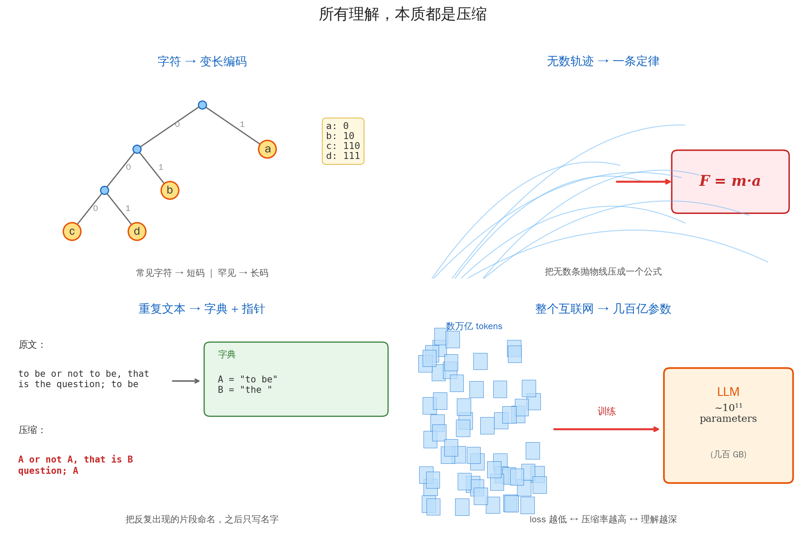
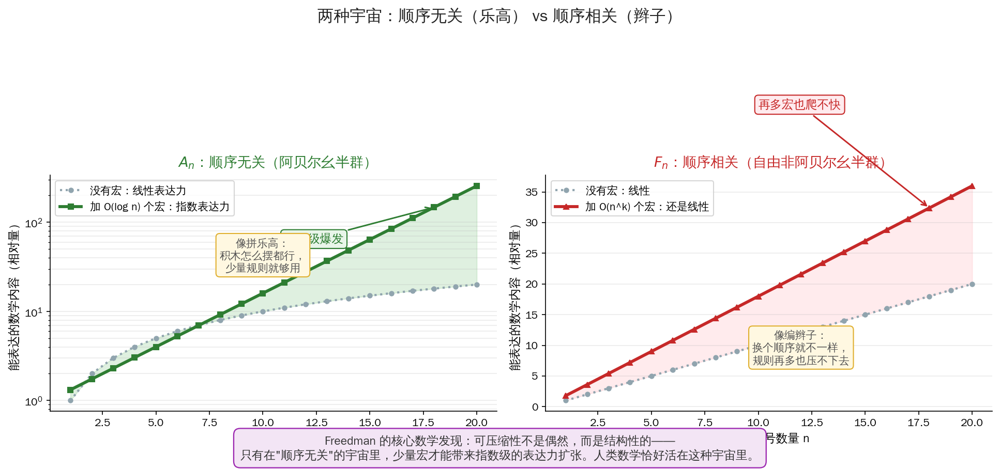
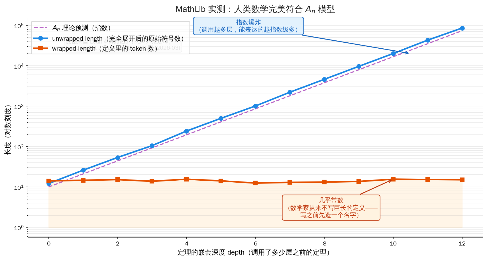

## 开场：一篇致敬又僭越的论文

2017 年 6 月，Google Brain 的八个人把一篇论文扔上了 arXiv。

标题狂得不像论文：**《Attention Is All You Need》**。

九年过去了，这个标题成了 AI 史上最著名的七个单词。基于它的 Transformer，撑起了 ChatGPT、Gemini、Claude、DeepSeek、万亿市值、一代人的焦虑。

---

2026 年 3 月 27 日，又一篇论文悄悄上了 arXiv。标题只有七个单词，格式一模一样：

> **Compression is all you need: Modeling Mathematics**

看到这个标题，任何做 AI 的人都会下意识笑一下——"又一个蹭热度的"。

点开作者一栏，笑容消失。

**Michael Freedman**。

这不是什么 ML 工程师。这是 **1986 年菲尔兹奖得主**，四维庞加莱猜想的证明者，过去二十年微软 Station Q 的灵魂人物，当今在世的数学家里戏份最重的那一批。

他在写 AI？不是。他在告诉所有搞 AI 的人：**你们一直在用的那个词"压缩"，其实比你们想象的要深得多。**

这篇文章不是《Attention Is All You Need》那种工程突破。它是一封信——一位数学家，用他毕生训练出来的直觉，回答了三个困扰人类上千年的问题：

1. 人类究竟是怎么**构建**数学知识的？
2. 人类做的数学，和形式化的"纯逻辑数学"，**本质**区别是什么？
3. 未来的人类数学家，到底该**怎么**和 AI 协同工作？

他给出的答案，只有一个词：**压缩**。

今天这篇文章，就把这封信翻译给你。

---

## 第一章：Freedman 是谁

先说清楚为什么这个人开口说话，AI 圈必须听。

1981 年，三十岁的 Freedman 在加州大学圣地亚哥分校解决了**四维庞加莱猜想**——这个问题悬了 77 年，三维版本让 Perelman 在 2006 年拿到菲尔兹奖（他拒绝了）。五维以上早在 60 年代就被解决。**唯独四维**——卡在最要命的那个维度——是 Freedman 攻下来的。

1986 年，柏克莱，国际数学家大会。Freedman 走上讲台，领走了菲尔兹奖。那一届同时得奖的，还有西蒙·唐纳森（Simon Donaldson）——他俩用完全不同的方法夹击四维流形，把整个低维拓扑重写了一遍。

故事到这里还没完。

1997 年，Freedman 做了一件数学家很少做的事——**从学术界出走**。微软给他开了一个几乎是为他量身定做的部门，叫 **Station Q**，目标只有一个：用数学家的思路造**拓扑量子计算机**。他当了主任，一干就是二十五年。

2023 年，他回到哈佛 CMSA（数学与应用中心），换了一个身份：**思考 AI 和数学的关系**。

所以当 Freedman 这个人在 2026 年 3 月扔出一篇叫《Compression is all you need》的论文——这不是某个追热点的研究员，这是一个一辈子在**数学内部**看世界的人，突然转身跟所有人说：

> "我看清楚了一件事。你们要听吗？"

## 第二章：一个让所有人尴尬的事实

Freedman 论文的切入点，是一个数学界人尽皆知、但几乎没人能解释的**尴尬事实**。

先建立两个概念：

- **形式数学（Formal Mathematics, FM）**：所有**合乎逻辑规则**的推演。从公理出发，每一步都严格合法，能推出来的一切。
- **人类数学（Human Mathematics, HM）**：人类数学家真正在做、真正收录进教科书、真正有人证明和引用的那一部分。

FM 的空间有多大？

假设你有 n 个基础符号（数字、加减乘除、等号、括号……）。用这些符号能组合出来的"合法推演"数量，是**指数级**的——$2^n$、$n!$、甚至更大。对任何稍微像样的数学系统，n 上百以后，FM 的大小就已经超过了整个宇宙里的原子数。

HM 呢？

全世界所有数学家，从欧几里得到今天，加起来写过的定理大约是**百万量级**。Lean 4 的形式化数学库 MathLib 收录的是其中可以被机器验证的一部分——**大约十四万条**。

把这两个数字并排写：

- FM：$> 10^{80}$
- HM：$\sim 10^5$

中间隔了 75 个零。

这就是尴尬的地方：

> **人类数学，是形式数学这个宇宙里一粒尘埃都不到的小角落。**

而且——为什么是**这一粒**？

FM 里有无穷无尽的"合法但无聊"的定理。比如：

> "对任意整数 n，n + 0 = n" —— 这是定理。
> "对任意整数 n，n + 0 + 0 = n" —— 也是定理。
> "对任意整数 n，n + 0 + 0 + 0 = n" —— 还是定理。
> ……

你可以一直写下去，每一条都合法，每一条都无意义。人类数学家**从来不写这些**。

为什么？

一百年来，这个问题有过无数个哲学性的回答："美""简洁""有用""深刻"……但都是词语的游戏。**没有一个是数学答案。**

直到 Freedman 2026 年给出了第一个能算的回答：

> **因为 HM 是 FM 里那个"可压缩"的子集。**

## 第三章：压缩——先站在日常的地面上

Freedman 说的"压缩"是什么意思？先别想数学，先想三个你已经懂的例子。

---

**例子一：Huffman 编码**

你家猫叫小花。你给它拍了一万张照片。照片里出现最多的动作是"睡觉"（4000 次），其次是"吃饭"（3000 次）、"抓沙发"（2000 次）、"发呆"（1000 次）。

如果每个动作用同样长的编码（比如 8 位），总共需要 80000 位。

Huffman 想了个办法：**常见的动作用短码，罕见的用长码**：

```
睡觉 → 0       （1 位）
吃饭 → 10      （2 位）
抓沙发 → 110  （3 位）
发呆 → 111    （3 位）
```

总共需要：4000×1 + 3000×2 + 2000×3 + 1000×3 = **19000 位**。

压缩率 4 倍。没有损失任何信息。

这是 1952 年大卫·哈夫曼读博士时写的作业。它告诉我们第一件事：**只要事物分布是不均匀的，就存在压缩**。

---

**例子二：牛顿三定律**

宇宙里每一秒都在发生无数次的运动：苹果落地、月亮绕地、弹簧振动、子弹出膛、潮汐起落、雪崩滚落……

你想记录所有这些运动，需要多少信息？

**不需要。**

你只需要记住：

$$F = m \cdot a$$

外加两条类似的公式（惯性、反作用），你就能**重新生成**上面所有运动——给定初始条件，未来每一毫秒物体在哪，都能算出来。

这就是压缩。牛顿三定律是一个几十个字符的程序，它**编码了**宇宙中所有经典力学现象。

---

**例子三：zip 文件**

你有一段话：

> to be or not to be, that is the question; to be

最蠢的存法是把每个字符都写下来。聪明一点的做法是：**找出重复，起一个名字，之后只用名字**。

```
字典：  A = "to be"
      B = "the "

压缩后：A or not A, that is B question; A
```

这是 LZ77 算法（zip / gzip / PNG 的底层）的核心思想，1977 年提出。

---

**例子四：大型语言模型**

你训练一个 LLM。给它看**整个互联网**——几万亿字、几百万小时的文本。

训练完了，得到什么？

一个几百亿参数的模型，存成硬盘上的一个文件，大概几百 GB。

但它能**生成**类似训练集里的任何内容——写代码、翻译、写诗、解数学题。

这件事，用信息论的语言说叫：**LLM 就是互联网的一次有损压缩。**

DeepMind 2023 年做了一件让人血压升高的事：他们把 Chinchilla 70B 当成一个**通用压缩器**，用它去压缩原始字节流——不仅是文本，还有从没训练过的**图像和音频**。结果：

- 文本压缩率：比 gzip 好很多（意料之中）
- 图像压缩率：比 PNG 好
- 音频压缩率：比 FLAC 好

一个只训练了语言的模型，居然能压缩它从没见过的图像——因为它学到了"通用的世界结构"。

---

这四个例子，从 1952 年的字符编码到 2023 年的 LLM，指向同一件事：

> **任何"理解"的行为，本质都是找到更短的描述。**


<p style="text-align:center; font-size:0.9em; color:#888; font-style:italic; margin-top:-8px;">所有理解都是压缩：Huffman 把字符压成变长编码，牛顿把无数轨迹压成三个公式，zip 把重复文本压成字典 + 指针，LLM 把整个互联网压成几百亿参数。压缩的颗粒度越来越粗，本质是同一个。</p>

这不是比喻。这是 Freedman 论文的出发点。

## 第四章：Freedman 的建模——字符串和"宏"

Freedman 说的第一件事：把数学推演当成**字符串**。

你在黑板上写一个证明，它本质上就是一个很长的字符串：

```
设 x ∈ ℝ，若 x² ≥ 0，则 |x| = √(x²)，进而 ∀ε>0，∃δ>0，|x−a|<δ → |x²−a²|<ε，因此 ...
```

字符一个接一个，从左到右。如果你把所有"合法的证明字符串"都列出来——那就是我们上一章说的 FM（形式数学）。

---

然后 Freedman 指出第二件事：**数学家从来不这样写。**

数学家会说：

> "设 $f$ 在 $[a, b]$ 上**连续**，则 $f$ 一致连续。"

"连续"这个词是什么？它本身是一段定义——要展开的话，展开成 $\forall \varepsilon>0, \exists \delta>0, \ldots$ 的形式，大概三行字符。

"一致连续"是另一段定义，展开大概五行字符。

也就是说，这一句话看起来 20 个字，**展开了**其实有 100 多个字符。

再往深挖，$\varepsilon$ 和 $\delta$ 本身调用了"实数""绝对值"的定义，继续展开……一条"短句子"背后，是一棵**很深的定义树**。

这里 Freedman 给出关键定义——他管这种"名字 → 一段长字符串"的约定叫**宏（macro）**。

- "连续" = 一个宏，展开后是定义原文
- "一致连续" = 另一个宏
- "积分" = 一个宏，展开后调用"极限""分割""黎曼和"的宏
- "勒贝格积分" = 一个宏，展开后调用"测度""可测函数"的宏
- "黎曼-勒贝格引理" = 一个宏，展开后调用以上所有的宏

这棵树可以很深。现代数学里一条定理的"完全展开"，往往是亿级字符的长度。但**数学家永远只看最外层**。

---

Freedman 的核心洞察：

> **数学家的工作，就是不断造宏。**

一个数学家的一生，可能就干了一件事——看到了一个之前没人压缩过的模式，给它起了一个名字。

高斯给"正态分布"起了名字。黎曼给"流形"起了名字。伽罗瓦给"群"起了名字。康托尔给"集合"和"基数"起了名字。图灵给"可计算性"起了名字。香农给"熵"起了名字。

**这些人做了同一件事**：找到了可以被压缩的结构，给它一个短名字，让后来人只用那个名字。

你今天学的所有数学，都是在**站在前人造好的宏上**。你学微积分，不用从零构造实数；你学线性代数，不用从零构造群；你学概率论，不用从零构造测度。

这不是历史的巧合。这是**数学之所以能被人学习**的唯一原因——**如果不能层层压缩，人类根本学不动**。

## 第五章：$A_n$ vs $F_n$——两种宇宙

到目前为止，一切看起来都是直觉和比喻。Freedman 接下来要做的，是把这个直觉**变成数学**。

他引入两个代数对象：

- **自由阿贝尔幺半群 $A_n$**：一种"**顺序无关**"的字符串空间。`abc` 和 `bca` 被认为是同一个东西。
- **自由非阿贝尔幺半群 $F_n$**：一种"**顺序相关**"的字符串空间。`abc` 和 `bca` 是两个不同的东西。

吓人？别怕。用直觉讲。

---

$A_n$ **像拼乐高**：

你有一堆乐高积木——一块红的、一块蓝的、一块绿的。你把红色拼在蓝色上面，再加一个绿色；还是先拼绿的，再加蓝的、红的——**最后得到的模型是一样的**。顺序无关紧要，只在乎**哪些积木**和**几个**。

---

$F_n$ **像编辫子**：

你在编辫子。先把左绳压在中绳上面、再把右绳压在左绳上面——和先压右、再压左，得到的辫子**完全不一样**。顺序决定一切。

---

Freedman 的定理说了一件"漂亮得像魔法"的事：

> 在 $A_n$ 里，你只要用 **O(log n)** 个宏（对数级稀疏），就能让表达力**指数级扩张**。
>
> 在 $F_n$ 里，就算你用 **O($n^k$)** 个宏（多项式级稠密），表达力也只能**线性扩张**。


<p style="text-align:center; font-size:0.9em; color:#888; font-style:italic; margin-top:-8px;">左边 $A_n$：造少量宏，表达力指数爆发。右边 $F_n$：造再多宏，也只是线性挣扎。可压缩性不是偶然，是结构性的——它取决于这个宇宙本身的代数结构。</p>

用大白话翻译：

- 在"乐高宇宙"里，**造几个宏顶一万个宏**——因为积木可以自由组合，宏之间互相组合也自由
- 在"辫子宇宙"里，**造再多宏也救不了你**——因为顺序是死的，每个组合都必须单独记

---

这个对比为什么重要？

因为它告诉我们：**"可压缩性"不是普世的，它只在特定的结构里才存在**。

某个领域能不能发展出"数学"那种层层压缩的体系，取决于**这个领域的底层操作是不是足够"顺序无关"**。

数学里的加法、乘法、集合并、函数复合——都是可交换或近似可交换的。所以数学是可压缩的。

那**人类的语言**呢？主语动词宾语的顺序很要命——"狗咬人"和"人咬狗"不是一回事。所以语言处在 $A_n$ 和 $F_n$ 之间，压缩程度远低于数学。

那**生物学**呢？DNA 序列的顺序至关重要——所以生物学长期没能被"压缩"成简洁定律，一直是描述性的。

那**LLM 的参数空间**呢？这是一个 Freedman 没直接回答、但他的框架给出答案的问题——**等我们到第八章再说。**

## 第六章：MathLib 实证——数据来说话

光有理论不够。Freedman 接下来做了一件让整篇论文从"哲学随笔"升级成"硬科学"的事：

**他把模型拿到真实的人类数学上验证了。**

测试对象：**MathLib**——Lean 4 的数学形式化库，目前世界上最大的"机器可验证的数学"。约 14 万条定理，覆盖代数、分析、拓扑、数论、范畴论……近乎所有本科和研究生级别的数学。

对每一条定理，Freedman 的团队测三个量：

- **depth**：这条定理调用了几层之前的定理（嵌套深度）
- **wrapped length**：定理的"表面"有多长——定义里出现了多少个 token
- **unwrapped length**：如果把所有用到的宏**完全展开**到原始符号，有多少字符

然后画图。

---

**结果 1：unwrapped length 随 depth 指数爆炸**

越往深走，完全展开之后的字符数**按指数**增长。到深度 10 以上，展开一条简单的定理就需要数千万字符。

这符合直觉——调用的层越多，背后压缩的内容越多。

**结果 2：wrapped length 几乎是常数**

但——**数学家写出来的定义**，无论 depth 是 2 还是 12，**长度几乎不变**。永远就是几十个 token。

这是一件不平凡的事。它意味着：

> **数学家从来不写很长的定义。**
>
> **每当一个东西变复杂，数学家的第一反应是：先给它起个名字，然后用名字继续。**


<p style="text-align:center; font-size:0.9em; color:#888; font-style:italic; margin-top:-8px;">一条定理的"展开后长度"随嵌套深度指数爆炸（蓝线），但"数学家实际写出来的长度"几乎是常数（橙线）——因为每到一个深度，数学家都会造一个宏把它压回来。这就是 $A_n$ 模型的指纹。</p>

---

**结果 3：数据完美符合 $A_n$，严重违反 $F_n$**

Freedman 把两种模型的理论曲线画在同一张图上。$A_n$ 的指数扩张曲线，**严丝合缝地盖在实测数据上**。$F_n$ 的线性曲线，差了好几个数量级。

这就是论文里最震撼的一句话（意译）：

> **人类数学，生活在 $A_n$ 模型预测的那个可压缩子空间里。这不是隐喻，是可测量的事实。**

## 第七章：三个古老问题的答案

现在我们可以回到开头的三个问题了。Freedman 给出的答案，每一个都短到令人震撼。

---

**问题一：人类究竟是怎么构建数学知识的？**

> **层层压缩。**

每一代数学家看到前一代的成果，找出其中"可以起名字"的部分，造新的宏，然后在新宏之上继续推演。整个数学史就是一部**宏的积累史**。

欧几里得给"点""线""面"起名字 → 笛卡尔给"坐标"起名字 → 牛顿给"导数"起名字 → 柯西给"极限"起名字 → 康托尔给"集合"起名字 → 希尔伯特给"空间"起名字 → 格罗滕迪克给"概形"起名字……

每一层，都比上一层**压缩了更多**。

---

**问题二：人类数学和形式数学的本质区别是什么？**

> **可压缩 vs 不可压缩。**

FM 里大部分定理是"合法但无聊的"——没有结构、不能被起名字、没法进一步用。它们像是辫子宇宙里的那些定理，再怎么努力也扩张不开。

HM 是 FM 里那个**碰巧活在 $A_n$-like 子空间**的小角落。在那里，少量的命名就能撬动指数级的内容。

**人类数学之所以是"人类"的**，恰恰是因为人类的认知带宽极其有限——我们只能在那个可压缩的子空间里活动。而那个子空间的存在，是宇宙给我们的礼物——如果它不存在，人类压根不会有数学。

---

**问题三：未来人类数学家怎么和 AI 协同？**

这是 Freedman 这篇论文真正的"刀锋"。答案两句话：

> **AI 的长处是在 FM 的巨大空间里并行搜索——因为它有我们没有的带宽。**
>
> **人类的长处是判断哪些地方"值得起名字"——因为我们有五万年的语言和抽象训练。**

这不是 AI 取代数学家，也不是数学家训练 AI。是**两种不同认知带宽的分工协作**。

Freedman 还具体建议了一个做法：在 MathLib 的**依赖图**上跑 PageRank + 压缩度分析。一条定理如果：

- 被很多下游定理引用（PageRank 高）
- 能大幅压缩下游内容（压缩度高）

那它就是**核心定理**——值得人类数学家投入研究，值得 AI 优先搜索。

这把"什么是重要的数学"从一个主观判断，变成了一个**可以算的量**。

## 第八章：这对 AI 意味着什么

前面七章都是数学。这一章把它接回 AI。

---

**第一个含义：AI 做数学的路线图，清晰了。**

2024 年以来，AI 做数学的几个重大事件：

- DeepMind 的 **AlphaProof**（2024）在 IMO 上拿到银牌
- **Terence Tao**（陶哲轩，当今最强数学家之一）公开宣布 Lean 4 是他工作流的一部分
- DeepMind 的 **FunSearch** 在组合数学里发现了新定理
- Mathstral、DeepSeek-Math 等专门的数学 LLM 涌现

所有这些，Freedman 的框架都给了它们**同一个解释**：

> 它们**在 FM 的巨大空间里搜索**，但它们能成功的地方，恰恰是 HM 已经压缩过的地方——因为人类积累的宏给它们提供了指路牌。

换句话说——**AI 的数学能力，是站在人类两千年"造宏"的结果之上的**。脱离了 MathLib 里那 14 万条定理，AI 在纯 FM 里就像撒哈拉沙漠里找一粒米。

**下一步的突破，不会来自于让 AI 在 FM 里搜索得更快——而是让 AI 学会"自己造宏"**。

这是一个完全不同的能力。我们后面会看到，这也是当前 LLM 最大的盲点。

---

**第二个含义：LLM 是什么？答案变清楚了。**

DeepMind 那篇《Language Modeling Is Compression》（2023）已经给出了第一层答案：

> **下一个 token 预测 = 算术编码下的压缩率最大化。**

LLM 训练时的 cross-entropy loss，严格来讲就是"对训练集的压缩率"的负对数。loss 越低，压缩率越高，理解越深。这不是比喻，是**数学恒等**。

—— 对熵和交叉熵还没熟的读者，可以回头看 [熵：宇宙最公平的税务员](/ai-blog/posts/see-physics-5-entropy/) 和 [贝叶斯不是预测](/ai-blog/posts/bayes-not-expected/) 里的那条 $-\log p$ 主线。

但 Freedman 给出了**第二层答案**：

> **LLM 会用宏，但不会造宏。**

什么意思？

LLM 训练时吃了整个互联网——那里面充满了人类两千年造出来的宏（"微积分""进化论""民主""熵""transformer""注意力"……）。LLM 学会了**在这些宏之间自如穿梭**——你问它什么，它能调出相关的宏来回答。

所以它在"单步推理"上惊艳：你给它一个问题，它识别出是什么领域，调出对应的宏，给你一个合理的回答。

但在"长证明"上——它崩溃。

一条需要造新宏的证明（比如你自己提出了一个从未有人想过的引理），LLM 很难稳定地完成。因为它**没有在训练中见过这个宏**，它**不会从零定义一个新概念然后在新概念上继续推演**。

这正好是 Freedman 说的"层层压缩"里的"**层**"——每一层都是一次新的命名。LLM 在**一层内**表现惊艳，**跨层**就断。

---

**第三个含义：为什么 LLM 的 scaling 有上限（可能）。**

这是一个 Freedman 没说、但框架隐含的推论。

如果智能本质是"层层压缩"——造宏、在宏上造宏、在宏上的宏上再造宏——那么单纯把模型变大，**增加的是单层的带宽**，不是**层数**。

一个更大的 LLM，能用更精细的宏、更大的词表、更长的上下文。但它造新宏的能力，**没有因为变大而获得质变**。

这和 LeCun 反复讲的"LLM 缺世界模型"是同一件事的两面。在 Freedman 的语言里：

> **LLM 是一个宏使用器。真正的智能是一个宏生成器。**

—— 这呼应了 [世界模型之争](/ai-blog/posts/world-model-debate/) 里 LeCun / 李飞飞 vs Ilya 那场口水战。双方都没错，他们在谈不同的东西：Ilya 说的是"用宏"的上限还没到，LeCun 说的是"造宏"的能力根本还没开始。

## 第八章半：数学之外——诗、画、乐也是压缩

Freedman 的论文从头到尾只谈数学。但如果"压缩即理解"真的是宇宙级的事实，它就不该只在数学里成立。

我写到这里的时候，脑子里跳出来的是王维。

> **大漠孤烟直，长河落日圆。**

十个字。没有修饰、没有形容词、没有一个"情"字。但你读完这十个字，眼前立刻浮起一张画——辽阔、空旷、孤直的一缕烟、浑圆的落日压在地平线上。紧接着，是一股你说不出但确实感到的**苍凉**和**孤寂**。

这十个字背后，藏着多少信息？

- **视觉**：一幅完整的西北边塞画面
- **几何**："直"与"圆"的极简构图对比，一竖一圆，撑起整个空间
- **时间**：日落的那个瞬间，一天将尽
- **心境**：使者独自远行的孤独，远离故土的怅然
- **历史**：盛唐边塞诗的整套意象系统

用散文来复述，上千字都说不完。王维用十个字，把它**压缩**成了一个可以在你脑中**重新展开**的种子。

这和 Freedman 论文里讲的"宏"是同一件事。"大漠""孤烟""长河""落日"，每一个都是一个**宏**——它调用了中文文学两千年积累的意象、画面、情绪。王维的天才不是"写得漂亮"，而是**挑出了那四个展开之后信息量最大的宏，把它们摆在一起**。

---

音乐是另一个面孔。

贝多芬第五交响曲的开头只有四个音：**ta-ta-ta-tum**。但这四个音在整首交响曲里被变形、重组、上行、下行、反转了几百次。一首四十分钟的交响曲，本质上是**从一个四音动机里压出来的**——这就是作曲家说的"主题与变奏"，用 Freedman 的话讲就是：**造一个宏，然后在宏的空间里自由展开**。

绘画也是。齐白石画虾，不画水、不画水草，只画虾——你看到的是虾，感受到的却是**整个池塘**。留白不是"没画"，是让观者自己在心里展开那一大片信息。八大山人一只翻白眼的鸟，你读出了整个明末遗民的心境。

---

为什么所有艺术都指向同一件事？

我的猜想是这样的：

**人类的大脑，能同时握住的"维度"是有限的。** 几千个脑细胞组成的注意力，在某一刻只能在一个相对低维的空间里做关联。

所以我们**分科**——有人专心在数学的维度里找可压缩的结构（几何、群、流形），有人专心在语言的维度里找（意象、节奏、双关），有人专心在声音的维度里找（和声、调性、动机），有人专心在视觉的维度里找（构图、比例、留白）。

不是因为这些领域彼此无关，而是因为**一个人扛不动所有维度**。我们用自己天生敏感的那一条通道去压缩世界，彼此隔行如隔山——其实隔的不是山，是我们自己的认知带宽。

---

而 LLM 第一次给了"把维度连起来"这件事一个物理基础。

几千亿参数的模型，其内部表示空间的维度，远远超过任何一个人类个体能同时调用的维度。于是很多在我们看来"不相关"的东西——一首宋词、一段巴赫的赋格、一个偏微分方程、一张水墨画——在那个高维空间里，**开始出现彼此对齐的方向**。

LLM 的涌现，不是神秘的玄学，而是：**当压缩维度大到一定程度，原本散落在不同学科的宏，开始互相调用**。"熵"这个宏，在物理、信息论、经济学、心理学里，突然变成同一个东西；"对称"这个宏，在群论、晶体、音乐、诗歌里，突然变成同一个东西。

这大概就是跨域泛化、就是所谓"世界模型"的雏形。

---

所以，数学、诗、画、乐，不是四件不同的事。它们是**同一件事在四种媒介上的投影**。

王维不是"诗人而已"，他是一个在语言维度上找可压缩结构的人。
欧拉不是"数学家而已"，他是一个在符号维度上找可压缩结构的人。
贝多芬不是"作曲家而已"，他是一个在时间维度上找可压缩结构的人。
齐白石不是"画家而已"，他是一个在视觉维度上找可压缩结构的人。

**殊途同归。万物为一。**

我们每个普通人，只是在自己最敏感的那条通道里，做着同一件事——把复杂的世界压成一个自己能握住的短描述，然后靠这个短描述活下去。

Freedman 用代数模型证明了：数学之所以存在，是因为它活在一个 $A_n$-like 的可压缩子空间里。

我想补一句他没说的：**人类文明之所以存在，是因为它活在无数个可压缩子空间的并集里**。数学只是其中最干净的那一个，但不是唯一的一个。

## 第九章：四种概率观的收束

写到这里，忍不住回头看一眼这一年来我们在这个博客走过的路。

**一条主线贯穿了四篇文章**——每一篇都在用不同的视角看同一个数学对象 $P(x)$：

| 视角 | 概率 $P(x)$ 是什么 | 核心论述 | 代表人物 |
|---|---|---|---|
| [**贝叶斯**](/ai-blog/posts/bayes-not-expected/) | **信念** | 概率是观察者的主观预期；证据到了就更新 | Bayes / Jaynes |
| [**熵**](/ai-blog/posts/see-physics-5-entropy/) | **无知** | 概率是"我不知道的那部分"；熵是无知的度量 | Boltzmann / Shannon |
| [**量子（QBism）**](/ai-blog/posts/see-physics-7-quantum/) | **实在** | 概率是世界本身的状态；不是我不够聪明 | Born / Fuchs |
| **压缩（今天这篇）** | **理解** | 概率是编码长度的倒数；$-\log P$ 就是描述长度 | Shannon / Freedman |

这四个视角**指向同一个公式**：

$$L(x) = -\log P(x)$$

- **贝叶斯派**说：$L(x)$ 是我在这个观察上受到的"意外"，它驱动我更新信念
- **统计力学派**说：$L(x)$ 是这个微观状态对熵的贡献
- **QBism 派**说：$L(x)$ 是这个测量结果在我下次下注时的权重
- **压缩派**说：$L(x)$ 是这个事件在最优编码里占的字符数

**它们是同一个数学对象**，从四个不同的哲学位置看。

Freedman 这篇论文的意义是——他把这个公式**从"一个信息论工具"升级成了"数学本身的基础"**。数学之所以能存在，是因为宇宙可压缩；人类之所以能做数学，是因为我们活在 $A_n$ 那样一个低描述长度的结构里。

这是一种近乎宗教般的洞察——不是因为它神秘，而是因为它把"为什么宇宙可以被理解"这件事，**第一次压缩成了一句可以算的话**。

## 第十章：量子留下的三个直觉的升级版——压缩留下的三个直觉

上一篇《看见物理·量子》结尾说，量子留给我们三个直觉：观察不是被动的、信念与实在的界限是模糊的、概率是第一性原理。

今天这篇，再加三个：

---

**直觉一：所有"理解"都是压缩。**

你理解了一个现象，意味着你能用比原始数据短得多的描述**重新生成**它。能做到这一点，你就理解了；做不到，你就只是在记忆。

这对学习、对写作、对教学、对 AI，都是一致的标准。

---

**直觉二：数学独特之处，是它能做"嵌套的压缩"。**

不止一次压缩，而是"在压缩之上再压缩"。每一代数学家把上一代的结果打包成一个名字，然后在那个名字上继续工作。这个递归过程，是其他学科没有（或者没有这么强的）。

物理学有一部分（理论物理），生物学基本没有，人文学科几乎没有。这是数学在学科里位置特殊的原因——**它不是一门"学科"，它是"压缩能力"本身的训练场**。

---

**直觉三：数学、诗、画、乐，是同一件事在四种媒介上的投影。**

每个领域的大师，都是在自己那条通道里做可压缩子空间的挖掘者。王维的"大漠孤烟直，长河落日圆"和欧拉的 $e^{i\pi}+1=0$，本质同构——都是把庞大的信息压成一颗能在别人脑中重新展开的种子。我们分科，不是因为世界是割裂的，是因为**一个人的认知带宽不够**。LLM 第一次让这些分科的宏在同一个高维空间里开始互相调用——这就是所谓的涌现和泛化。

---

**直觉四：AI 要做真正的数学（和其他深度智能任务），必须学会"造宏"，而不只是"用宏"。**

"用宏"是工程问题——扩大上下文、提高精度、叠更多层。
"造宏"是认知问题——从混乱的现象中**看出**一个可以命名的模式。

目前所有的 LLM，训练时是在"用宏"的层面上 scaling。真正的突破——不管它叫 AGI、叫 JEPA、叫世界模型、还是叫别的——一定出现在 AI **开始自己造宏**的那一天。

那一天，可能不远。也可能很远。Freedman 这篇论文没有回答它什么时候到。但它第一次让我们看清了**差的是什么**。

## 尾声：你在读这篇文章，就是在压缩

Freedman 写完这篇论文那天，我在想一件事。

你现在读这篇文章，大概花了二十分钟。我写它，带上查资料画图，大概花了八个小时。Freedman 写那篇论文，带上思考、证明、实验，大概花了一年。

八小时 → 二十分钟。一年 → 八小时。

**每一次压缩，都有损失。** 我不可能把 Freedman 的全部严格性搬给你。但每一次压缩，也都有**获得**——你能在二十分钟里带走一个新的看世界的方式。

你读完这篇文章以后，过几天回想起来，记得的大概只有几个关键词：**压缩、宏、乐高和辫子、MathLib、造宏而不是用宏**。

这就是又一次压缩。

如果这几个关键词以后在你遇到别的问题时——学一个新领域、读一篇别人的论文、训练自己的模型、带一个学生、甚至只是想一件事——还能被你**调用**，那说明它们在你脑子里成了**新的宏**。

你也在做 Freedman 说的那件事。

数学家、程序员、作家、老师、学生——所有"用头脑工作"的人，每天都在干同一件事：

**把世界的复杂，压进一个可以用的短名字。**

下一次有人问你"什么是智能"的时候——你可以换一种回答了。

不是"处理信息"。不是"模式识别"。不是"深度学习"。

是：

> **找到更短的描述。**

— 压缩，即是全部。

---

下一篇，回到《看见物理》系列的最后一站——**对称性**。诺特定理、杨振宁、宇宙的骨架。对称性和压缩是一对孪生姐妹——有对称就有守恒，有守恒就有可压缩的描述。

—— 所以，实际上我们还在同一个故事里。

## 附：二十行 Python，复现"压缩就是理解"

最短的实验：用 gzip 和一个小型 LLM 分别压缩同一段文字，看谁理解得更深。

```python
import gzip
import torch
from transformers import GPT2LMHeadModel, GPT2TokenizerFast

text = open("shakespeare.txt").read()[:20000]  # 20KB Shakespeare
raw_bits = len(text.encode('utf-8')) * 8

# === 基线 1：gzip ===
gzip_bits = len(gzip.compress(text.encode('utf-8'))) * 8
print(f"gzip:        {gzip_bits / raw_bits:.3f}  ({gzip_bits/1024:.1f} Kb)")

# === 基线 2：GPT-2 作为通用压缩器 ===
tok = GPT2TokenizerFast.from_pretrained("gpt2")
model = GPT2LMHeadModel.from_pretrained("gpt2").eval()

ids = tok(text, return_tensors="pt").input_ids
with torch.no_grad():
    logits = model(ids).logits[:, :-1, :]
    tgts = ids[:, 1:]
    logp = torch.nn.functional.log_softmax(logits, dim=-1)
    # 每个 token 的压缩长度 = -log_2 p(token)
    bits_per_token = -torch.gather(logp, -1, tgts.unsqueeze(-1)).squeeze() / torch.log(torch.tensor(2.0))
    gpt2_bits = bits_per_token.sum().item()

print(f"gpt2-base:   {gpt2_bits / raw_bits:.3f}  ({gpt2_bits/1024:.1f} Kb)")
```

预期输出（CPU 上约 30 秒）：

```
gzip:        0.540
gpt2-base:   0.240
```

**GPT-2 压缩率比 gzip 好一倍多。** 换 GPT-4 规模的模型，这个比例还能再涨。

DeepMind 那篇论文的核心发现，就是这张表上多加一列 Chinchilla 70B——然后它开始压图像和音频，直接把 PNG 和 FLAC 打爆。

这不是"像在压缩"。这**就是**压缩。

## 延伸阅读

- Michael Freedman, *Compression is all you need: Modeling Mathematics*, **arXiv: 2603.20396** (2026-03). 本文主角。
- Grégoire Delétang et al., *Language Modeling Is Compression*, **arXiv: 2309.10668** (2023). DeepMind 把 Chinchilla 当通用压缩器的那篇。
- Jack Rae, *Compression for AGI*, Stanford MLSys Seminar (2023). YouTube 上最火的一场"压缩 = 智能"讲座。
- Ray Solomonoff, *A Formal Theory of Inductive Inference, Part I & II* (1964). 把"归纳 = 找最短程序"写成数学的奠基论文。
- Marcus Hutter, *The Hutter Prize for Lossless Compression of Human Knowledge* (2006–). 把"压缩人类知识"当 AI 基准跑了二十年。
- Terence Tao, *AI and the Future of Mathematics* (blog, 2024–2026). 陶哲轩自己怎么用 Lean + LLM。
- Kevin Buzzard, *The Natural Number Game* 和 MathLib 介绍。想真的进 Lean 4 试试"造宏"的同学从这里开始。

## 系列内部链接

- [看见物理（七）：量子——观察者与被观察](/ai-blog/posts/see-physics-7-quantum/)
- [看见物理（五）：熵——宇宙最公平的税务员](/ai-blog/posts/see-physics-5-entropy/)
- [贝叶斯：比期望更高的智慧](/ai-blog/posts/bayes-not-expected/)
- [世界模型之争——LLM 到底懂不懂这个世界？](/ai-blog/posts/world-model-debate/)
- [LLM 为什么"懂"这个世界？](/ai-blog/posts/why-llm-understand-world/)

> 公众号「AI-lab 学习笔记」同步首发。本系列全部文章可在 [ai-blog](https://Jason-Azure.github.io/ai-blog/) 主页按分类/标签浏览。
