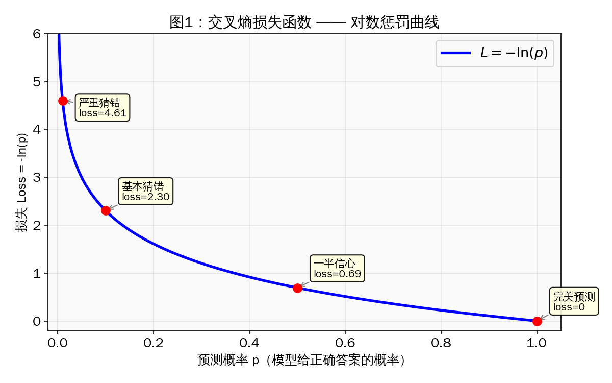
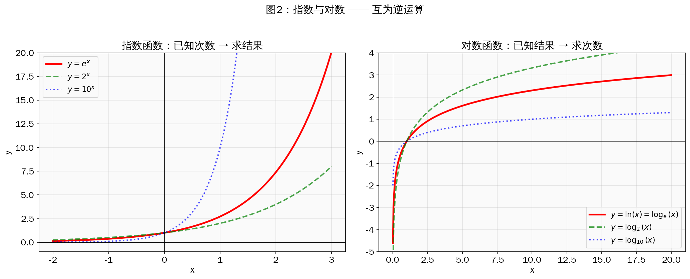
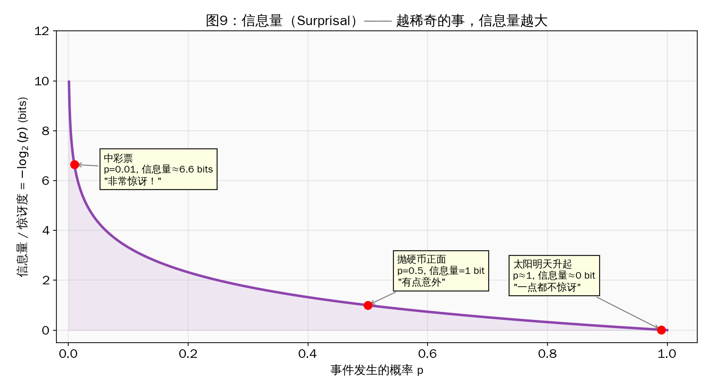
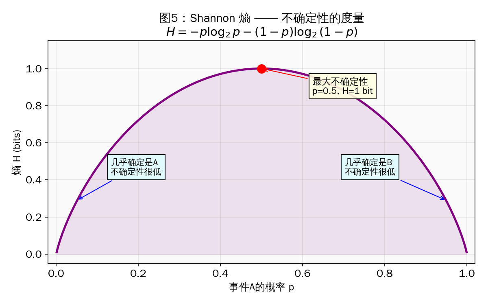
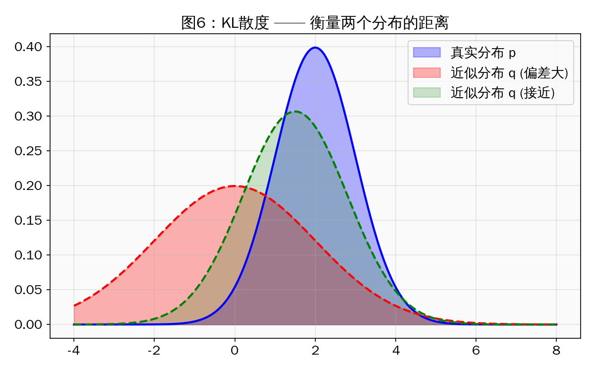
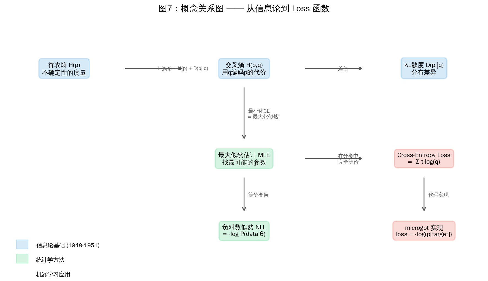
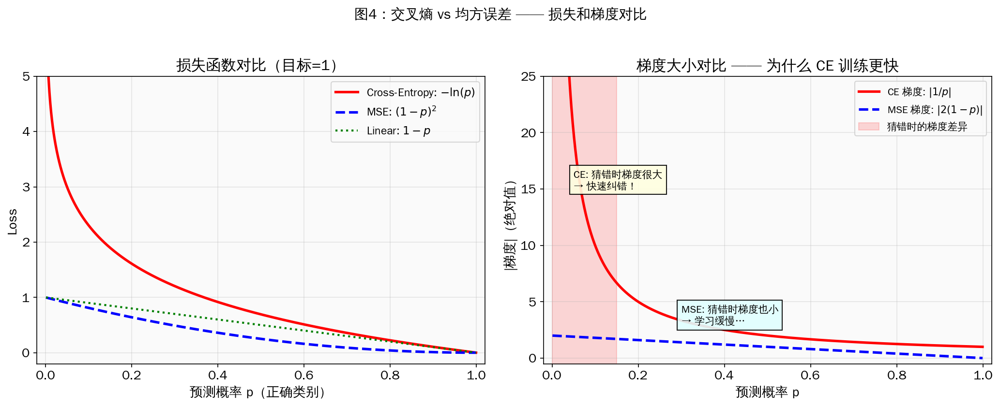
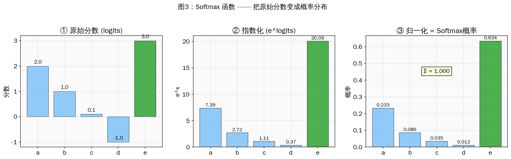
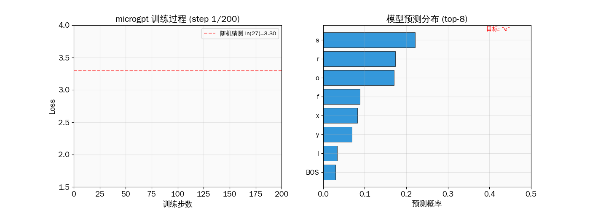

> **从 Shannon 1948 年的一个简单问题出发，理解为什么 GPT 的 loss 必须是 `-log(p)`，而不是别的东西。**
>
> 本文基于 [microgpt](https://gist.github.com/karpathy/8627fe009c40f57531cb18360106ce95)（Andrej Karpathy 的 200 行 GPT 实现）中的 loss 计算，追溯其理论根源。

---

## 1. 从一个直觉问题开始

假设你在训练一个模型，让它预测下一个字符。模型输出了 27 个字符的概率分布，正确答案是字符 `e`。

**问：模型猜得好不好？用什么数字来衡量？**

你可能想到几种方案：

| 方案 | 公式 | p=0.9 时 | p=0.01 时 | 问题 |
|------|------|----------|-----------|------|
| 直接用概率 | 1 - p | 0.1 | 0.99 | 猜错得多离谱，惩罚都差不多 |
| 平方误差 | (1-p)² | 0.01 | 0.98 | 同上，区分度太低 |
| **负对数** | **-ln(p)** | **0.11** | **4.61** | **对"自信地猜错"惩罚极重** ✓ |

`-ln(p)` 不是拍脑袋想出来的——它有深厚的数学根基。



---

## 2. 指数与对数：互为逆运算

### 指数：已知次数，求结果

**2³ = 8 　　 e¹ ≈ 2.718 　　 10² = 100**

### 对数：已知结果，求次数

**log₂(8) = 3 　　 ln(e) = 1 　　 log₁₀(100) = 2**

**对数就是指数的反问题。** 就像加法和减法、乘法和除法一样，它们是一对互逆运算。

特别地，**自然对数 ln(x) = logₑ(x)**，底数是 e ≈ 2.71828。

> **命名混乱提醒**：在编程中（Python `math.log`、PyTorch `torch.log`）和论文中，`log` 几乎总是指 `ln`（自然对数）。只有数学课本里才严格区分 `ln` 和 `log`。



### 为什么选 e 做底数？

因为 e 有一个独一无二的性质：

<div style="max-width: 660px; margin: 1.5em auto; padding: 20px; border-radius: 8px; border: 2px solid #E91E63; background: rgba(233,30,99,0.04);">

**d/dx (eˣ) = eˣ**

**e 的 x 次方，求导后还是自己。** 这让所有包含 e 的微积分运算都特别简洁——没有多余的系数。

</div>

所以 ln(x) 的导数也极其简单：**d/dx ln(x) = 1/x**

这个 `1/x` 的简洁导数，正是 microgpt 代码中写的：

```python
def log(self):
    # 对数的导数：∂ln(a)/∂a = 1/a
    return Value(math.log(self.data), (self,), (1/self.data,))
```

---

## 3. Shannon 的信息量：-log(p) 的诞生

### 源头：一个关于"惊讶"的公理

1948 年，Claude Shannon 在他的开创性论文 [*A Mathematical Theory of Communication*](https://people.math.harvard.edu/~ctm/home/text/others/shannon/entropy/entropy.pdf) 中提出了一个问题：

> **如何用数学来衡量一个事件包含多少"信息"？**

Shannon 提出了三个看似平凡的公理：

1. **概率越小的事件，信息量越大。**（"太阳明天升起"没什么信息量，"中了彩票"信息量巨大。）
2. **确定事件的信息量为零。**（p=1 时，I=0。）
3. **独立事件的信息量可以相加。**（先中彩票再被雷劈，总信息量 = 中彩票的信息量 + 被雷劈的信息量。）

### 唯一满足这三条的函数

Shannon 用数学严格证明了：**满足以上三条的函数，有且只有一个形式：**

<div style="max-width: 660px; margin: 1.5em auto; padding: 20px; border-radius: 8px; border: 2px solid #E91E63; background: rgba(233,30,99,0.04);">

**I(x) = −log p(x)**

</div>

> **证明关键**：公理 3 要求 I(A∩B) = I(A) + I(B)，对于独立事件 p(A∩B) = p(A)·p(B)。
> 要把"乘法"变成"加法"，数学中**只有对数**能做到：log(a·b) = log(a) + log(b)。

这就是为什么 `-log(p)` 不是人为选择的——**它是满足"信息量"这个概念的唯一数学形式。**



**参考文献：**
> Shannon, C. E. (1948). *A Mathematical Theory of Communication*. Bell System Technical Journal, 27(3), 379-423.
> 这是信息论的奠基之作，至今被引用超过 16 万次。

---

## 4. 从信息量到熵 H(p)

单个事件有"信息量"，那一个**概率分布的整体不确定性**是多少？Shannon 定义了**熵（Entropy）**：

<div style="max-width: 660px; margin: 1.5em auto; padding: 20px; border-radius: 8px; border: 2px solid #E91E63; background: rgba(233,30,99,0.04);">

**H(p) = −∑ᵢ p(xᵢ) log p(xᵢ) = E[−log p(x)]**

**熵 = 信息量的期望值 = 平均惊讶程度。**

</div>

### 直觉理解

- **公平硬币**（正反各 50%）：H = 1 bit → 最大不确定性
- **作弊硬币**（99% 正面）：H ≈ 0.08 bits → 几乎没有不确定性
- **一定是正面**（100%）：H = 0 → 完全确定



### 熵的物理含义

**H 的值 = 用最优编码传输这个分布的信息，平均每个符号最少需要多少 bit。**

这不是比喻——这是 Shannon 的精确定理。

---

## 5. 交叉熵 H(p,q)：模型的"平均惊讶度"

现在到了关键概念。假设：
- **p** = 真实分布（数据的真相）
- **q** = 模型的预测分布

**交叉熵**衡量的是：**用模型 q 的编码方案，去编码真实数据 p，平均每个符号需要多少 bit？**

<div style="max-width: 660px; margin: 1.5em auto; padding: 20px; border-radius: 8px; border: 2px solid #E91E63; background: rgba(233,30,99,0.04);">

**H(p, q) = −∑ᵢ p(xᵢ) log q(xᵢ)**

</div>

### 在分类中的简化

在分类任务中，真实分布 p 是 **one-hot**（正确类别概率=1，其余=0），所以求和中只剩一项：

**H(p, q) = −log q(y_target)**

**这就是 microgpt 里的 loss！**

```python
loss_t = -probs[target_id].log()  # 就是 -log(q(target))
```

### 为什么叫"交叉"熵？

因为它"交叉"使用了两个分布：
- 用 **p** 的概率加权（哪些事件重要）
- 用 **q** 的对数计算（模型认为的编码长度）

---

## 6. KL 散度：交叉熵减去熵

KL 散度（Kullback-Leibler Divergence）衡量两个分布的"差距"：

**D_KL(p ‖ q) = ∑ᵢ p(xᵢ) log(p(xᵢ) / q(xᵢ))**

它和交叉熵的关系极其简洁：

<div style="max-width: 660px; margin: 1.5em auto; padding: 20px; border-radius: 8px; border: 2px solid #E91E63; background: rgba(233,30,99,0.04);">

**H(p, q) = H(p) + D_KL(p ‖ q)**

即：**交叉熵 = 真实熵 + 分布差距**

</div>

### 为什么在训练中可以直接用交叉熵？

因为真实分布 p 是固定的（来自训练数据），所以 H(p) 是常数。优化时：

**min_q H(p, q) = min_q [H(p) + D_KL(p ‖ q)] = H(p) + min_q D_KL(p ‖ q)**

**最小化交叉熵 ⟺ 最小化 KL 散度 ⟺ 让模型分布尽可能接近真实分布。**



**参考文献：**
> Kullback, S. & Leibler, R. A. (1951). *On Information and Sufficiency*. Annals of Mathematical Statistics, 22(1), 79-86.
> KL 散度的原始定义论文。

---

## 7. 最大似然估计 MLE = 最小化交叉熵

这是一个令人惊叹的等价关系。

### 从统计学的角度

给定 N 个训练样本 {x₁, x₂, ..., xₙ}，**最大似然估计（MLE）** 要找模型参数 θ，使得：

**max_θ ∏ᵢ q_θ(xᵢ)** 　（数据在模型下的概率最大）

取对数（不改变最优解）：

**max_θ ∑ᵢ log q_θ(xᵢ)**

加个负号，变成最小化：

**min_θ −∑ᵢ log q_θ(xᵢ) = min_θ ∑ᵢ [−log q_θ(xᵢ)]**

### 这不就是交叉熵吗？

**交叉熵 = −∑ᵢ p(xᵢ) log q(xᵢ) ≈ −(1/N) ∑ᵢ log q_θ(xᵢ)**

**结论**：

<div style="max-width: 660px; margin: 1.5em auto; padding: 20px; border-radius: 8px; border: 2px solid #E91E63; background: rgba(233,30,99,0.04);">

**最小化交叉熵 = 最小化 KL 散度 = 最大似然估计**

**三条独立发展的数学道路，最终指向同一个公式：`-log(p)`。**

</div>

这就是为什么说 `-log(p)` 有"深厚的理论支撑"——不是一个启发式技巧，而是三个数学分支的必然交汇点。



**参考文献：**
> - Bishop, C. M. (2006). *Pattern Recognition and Machine Learning*. Springer. Chapter 1.6.1 (KL Divergence), Chapter 4.3.4 (MLE for logistic regression).
> - Goodfellow, I., Bengio, Y., & Courville, A. (2016). *Deep Learning*. MIT Press. Section 3.13 (Information Theory), Section 5.5 (Maximum Likelihood Estimation).

---

## 8. 为什么不用 MSE？—— 梯度分析

理论上 MSE（均方误差）也能用，但实际表现差很多。原因在**梯度**：

### Cross-Entropy 的梯度

**L_CE = −log(σ(z))** 　⟹　 **∂L/∂z = σ(z) − y**

其中 σ 是 sigmoid/softmax。当模型严重猜错时（σ(z) 远离 y），**梯度很大**，模型快速纠正。

### MSE 的梯度

**L_MSE = (σ(z) − y)²** 　⟹　 **∂L/∂z = 2(σ(z) − y) · σ&#39;(z)**

多出一个 **σ&#39;(z)** 因子。sigmoid 的导数在两端趋近于零（饱和区），所以当模型严重猜错时，**梯度反而很小** → 学习停滞！

这就是 **梯度消失（Vanishing Gradient）** 问题。



### 实验验证

Golik et al. (2013) 在语音识别任务上实验证明：

> "用随机初始化权重时，MSE 训练的神经网络**无法收敛到好的局部最优**。"
> 但如果先用交叉熵预训练，再用 MSE 微调，可以获得微小的额外提升。

**结论：Cross-Entropy 是训练分类神经网络的默认选择，MSE 只适合做微调。**

**参考文献：**
> Golik, P., Doetsch, P., & Ney, H. (2013). *Cross-Entropy vs. Squared Error Training: A Theoretical and Experimental Comparison*. Proc. Interspeech 2013, 1756-1760.

---

## 9. Softmax + Cross-Entropy 的数值技巧

### microgpt 的做法（教学版）

```python
# 第一步：softmax
max_val = max(val.data for val in logits)
exps = [(val - max_val).exp() for val in logits]  # 减去 max 防溢出
total = sum(exps)
probs = [e / total for e in exps]

# 第二步：取负对数
loss = -probs[target_id].log()
```

分两步算，清晰但有数值风险：softmax 可能输出极小的浮点数（如 1e-38），再取 log 会放大误差。

### PyTorch 的做法（生产版）

PyTorch 的 `F.cross_entropy()` 把两步合并，用 **log-sum-exp trick**：

<div style="max-width: 660px; margin: 1.5em auto; padding: 20px; border-radius: 8px; border: 2px solid #E91E63; background: rgba(233,30,99,0.04);">

**−log(e^z_t / ∑_j e^z_j) = −z_t + log(∑_j e^z_j)**

</div>

直接用 logits 计算，避免了中间产生极小浮点数，**数值更稳定**。



---

## 10. 在 microgpt 中看到这一切

microgpt 用 200 行代码展示了上述所有理论的**工程实现**：

```python
# 训练循环（microgpt_words.py 第 402-444 行）
for step in range(num_steps):
    doc = docs[step % len(docs)]
    tokens = [BOS] + [char_to_id[ch] for ch in doc] + [BOS]

    for pos_id in range(n):
        token_id = tokens[pos_id]
        target_id = tokens[pos_id + 1]

        # 前向传播：模型预测
        logits = gpt(token_id, pos_id, keys_t, values_t)

        # Softmax → 概率分布
        probs = softmax(logits)

        # Cross-Entropy Loss = -log(正确答案的概率)
        # = Shannon 的信息量
        # = 负对数似然
        # = 模型对正确答案的"惊讶程度"
        loss_t = -probs[target_id].log()
        losses.append(loss_t)

    # 平均 loss
    loss = (1 / n) * sum(losses)

    # 反向传播 + Adam 更新
    loss.backward()
    # ... (Adam optimizer) ...
```

### 训练过程可视化



**训练开始时**：
- Loss ≈ ln(27) ≈ 3.30（随机猜 27 个字符之一）
- 模型对每个字符"同样惊讶"

**训练结束时**：
- Loss ≈ 2.5
- 模型学会了英文名字的模式（e 后面常接 n、r、s...）

---

## 11. 总结与参考文献

### 一句话总结

<div style="max-width: 660px; margin: 1.5em auto; padding: 20px; border-radius: 8px; border: 2px solid #E91E63; background: rgba(233,30,99,0.04);">

**`-log(p)` 是满足"信息量"公理的唯一函数，用它做 loss 等价于最大似然估计、最小化 KL 散度——这不是经验选择，是数学必然。**

</div>

### 关键公式速查

| 概念 | 公式 | 含义 |
|------|------|------|
| 信息量 | I(x) = −log p(x) | 一个事件包含多少信息 |
| 熵 | H(p) = −∑ p·log(p) | 一个分布的平均不确定性 |
| 交叉熵 | H(p,q) = −∑ p·log(q) | 用 q 编码 p 的平均代价 |
| KL 散度 | D(p‖q) = H(p,q) − H(p) | p 和 q 的分布差距 |
| CE Loss | L = −log q(target) | 交叉熵在 one-hot 下的简化 |

### 完整参考文献

1. **Shannon, C. E.** (1948). *A Mathematical Theory of Communication*. Bell System Technical Journal, 27(3), 379-423. [[PDF]](https://people.math.harvard.edu/~ctm/home/text/others/shannon/entropy/entropy.pdf)
   — 信息论奠基之作。定义了信息量、熵、信道容量等核心概念。

2. **Kullback, S. & Leibler, R. A.** (1951). *On Information and Sufficiency*. Annals of Mathematical Statistics, 22(1), 79-86. [[JSTOR]](https://www.jstor.org/stable/2236703)
   — KL 散度的原始定义。

3. **Golik, P., Doetsch, P., & Ney, H.** (2013). *Cross-Entropy vs. Squared Error Training: A Theoretical and Experimental Comparison*. Proc. Interspeech 2013, 1756-1760. [[PDF]](https://www.isca-archive.org/interspeech_2013/golik13_interspeech.html)
   — 实验证明 MSE 从随机初始化无法收敛，而交叉熵可以。

4. **Bishop, C. M.** (2006). *Pattern Recognition and Machine Learning*. Springer.
   — Chapter 1.6.1: KL 散度；Chapter 4.3.4: 逻辑回归的 MLE 推导。

5. **Goodfellow, I., Bengio, Y., & Courville, A.** (2016). *Deep Learning*. MIT Press. [[在线]](https://www.deeplearningbook.org/)
   — Section 3.13: 信息论；Section 5.5: 最大似然估计；Section 6.2.2: 交叉熵与 softmax。

6. **Karpathy, A.** (2024). *microgpt*. [[Gist]](https://gist.github.com/karpathy/8627fe009c40f57531cb18360106ce95)
   — 200 行纯 Python 实现的完整 GPT，本文的代码示例来源。

7. **Rubner, Y., Tomasi, C., & Guibas, L. J.** (2000). *The Earth Mover's Distance as a Metric for Image Retrieval*. International Journal of Computer Vision, 40(2), 99-121.
   — 对比分布差异的其他度量方法。

8. **Cover, T. M. & Thomas, J. A.** (2006). *Elements of Information Theory*, 2nd ed. Wiley.
   — 信息论权威教材。Chapter 2, 8 覆盖熵、KL 散度的严格证明。

9. **Murphy, K. P.** (2012). *Machine Learning: A Probabilistic Perspective*. MIT Press.
   — Section 2.8: 信息论基础；Section 8.3: 逻辑回归与交叉熵推导。

### 推荐阅读

- **Chris Olah** (2015). [*Visual Information Theory*](https://colah.github.io/posts/2015-09-Visual-Information/) — 用 Alice 和 Bob 通信的比喻，直观解释熵、交叉熵和 KL 散度。强烈推荐！
- **Lei Mao** (2019). [*Cross Entropy, KL Divergence, and Maximum Likelihood Estimation*](https://leimao.github.io/blog/Cross-Entropy-KL-Divergence-MLE/) — 三者等价性的数学推导。
- **Stanford CS231n** — [*Linear Classification (Softmax)*](https://cs231n.github.io/linear-classify/) — Softmax 分类器的信息论解释。

---

<div style="margin-top: 30px; padding-top: 20px; border-top: 1px solid #e0e0e0; font-size: 0.9em; color: #888; line-height: 1.8;">

**💡 相关文章**

- [看见数学（番外）：信息论——从电报到 GPT 的一条暗线](/ai-blog/posts/see-math-extra-information-theory/)
- [看见数学（十五）：梯度下降——数学会学习](/ai-blog/posts/see-math-15-gradient/)
- [LLM 训练全流程详解](/ai-blog/posts/llm-training-stages/)

本文首发于「AI 学习笔记」博客：https://Jason-Azure.github.io/ai-blog/

微信公众号：AI-lab学习笔记

> **"This file is the complete algorithm. Everything else is just efficiency."**
> — Andrej Karpathy, microgpt
>
> 同样地，`-log(p)` 就是完整的 loss 函数。PyTorch 的 `F.cross_entropy()` 做的一切，都只是效率和数值稳定性的优化。
</div>
