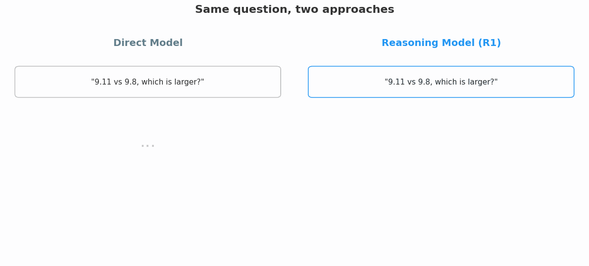
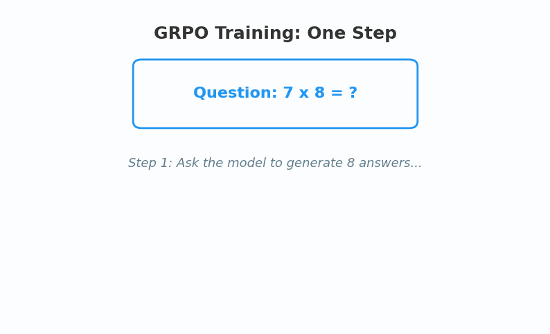
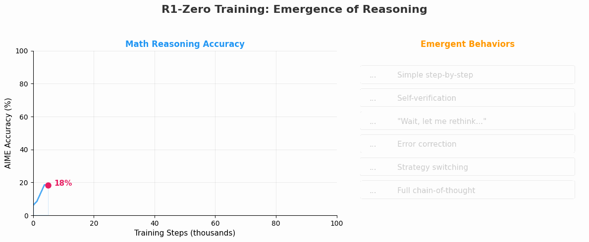
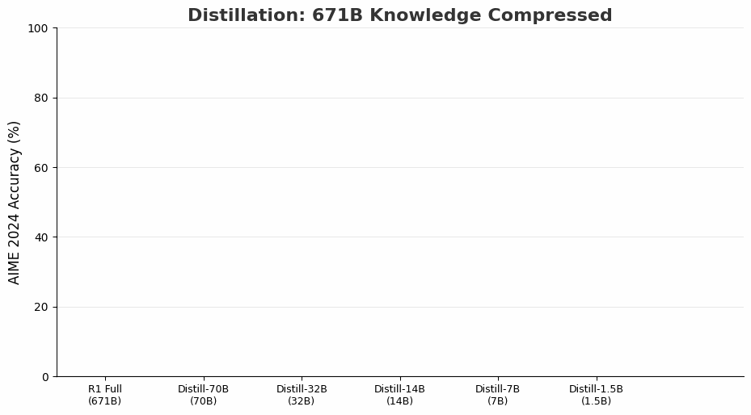

<div style="max-width: 680px; margin: 1.5em auto; padding: 20px 24px; border-radius: 10px; background: linear-gradient(135deg, rgba(233,30,99,0.06), rgba(33,150,243,0.06)); border: 1px solid rgba(233,30,99,0.15);">

<div style="font-weight: bold; margin-bottom: 10px; color: #E91E63; font-size: 1.1em;">📖 导读</div>

上一篇《神经网络沉浮录》，我们看到神经网络 80 年的跌宕命运——从被捧上神坛到被判死刑，再到改名"深度学习"后改变世界。

但 2025 年发生了一件更令人震惊的事：**一个 AI 模型，学会了在回答前先"想一想"。**

不是人类教它怎么推理的——是它自己，通过强化学习，**自发地学会了自我反思、验证和策略调整**。这篇论文登上了 Nature，震动了整个 AI 界。

这篇文章会告诉你：这个"思考"到底是什么机制？它为什么有效？以及——**一个只有 15 亿参数的蒸馏版，就跑在我们这台没有 GPU 的教学机上。**

<div style="font-size: 0.9em; color: #888; margin-top: 12px; line-height: 1.7;">
① 一个让所有人意外的发现 → ② 什么是"推理模型" → ③ 核心机制：Test-Time Compute → ④ GRPO算法 → ⑤ "顿悟时刻" → ⑥ 蒸馏 → ⑦ 真机演示 → ⑧ 意义
</div>

</div>

---

## 第一章：一个让所有人意外的发现 🔥

### 2025 年 1 月 20 日

一家中国 AI 公司 DeepSeek 发布了一篇论文，标题平平无奇：

> *DeepSeek-R1: Incentivizing Reasoning Capability in LLMs via Reinforcement Learning*

翻译过来就是："用强化学习激发大语言模型的推理能力"。

但论文里描述的发现，却足以让整个 AI 界坐不住：

<div style="max-width: 660px; margin: 1.5em auto; padding: 16px 20px; border-radius: 8px; background: rgba(255,152,0,0.06); border: 1px solid rgba(255,152,0,0.2);">

**他们没有教模型怎么推理。**

没有给它推理步骤的示例。没有人工标注"先这样想，再那样算"。

他们只做了一件事：**给模型一个奖励信号——答对了就得分，答错了就扣分。**

具体来说：对每一道数学题，让模型生成 **16 个不同的答案**，然后用规则自动判分——答对得 1 分，答错得 0 分。不需要任何人类标注。模型的目标只有一个：**让"得 1 分"的答案越来越多。**

在这个看似简单的激励下，模型自己学会了：
- 在回答前先**停下来想一想**
- 生成长长的内心推理过程
- 自我检查："等一下，我是不是算错了？"
- 动态切换策略："这个方法不行，换一种试试"

</div>

这不是设计出来的。这是**涌现**出来的。

几个月后，这篇论文被 Nature 正式发表（Volume 645, Pages 633–638），成为极少数登上这本顶级科学期刊的 AI 系统论文。Nature 的编辑认为，这不仅仅是一个工程成就——**推理能力从奖励信号中自发涌现，这是一个科学发现。**

### 等一下——三个深层追问

读到这里，你应该有三个问题。它们恰好触及了这项工作最精妙的地方。

<div style="max-width: 660px; margin: 1.5em auto; padding: 16px 20px; border-radius: 8px; background: rgba(156,39,176,0.06); border: 1px solid rgba(156,39,176,0.15);">

**追问 1：说是"不需要人类标注"，那人到底做了什么？**

人的作用不在于教模型"怎么推理"，而在于设计**游戏规则**：

- 选择**什么题目**来训练（数学、代码、逻辑——这些有客观正确答案的领域）
- 设计**奖励函数**的形式（正确得 1 分，错误得 0 分，格式不对扣分）
- 确定**训练框架**（GRPO 算法、采样数量、学习率、KL 散度约束……）
- 决定**何时停止**训练，何时切换到下一个阶段

类比：人没有教狗"怎么叼飞盘"，但人决定了——用飞盘（不是石头）、在草地上（不是悬崖边）、叼回来就给零食（奖励）。**游戏规则的设计，本身就是巨大的人类智慧。**

</div>

<div style="max-width: 660px; margin: 1.5em auto; padding: 16px 20px; border-radius: 8px; background: rgba(33,150,243,0.06); border: 1px solid rgba(33,150,243,0.15);">

**追问 2：怎么让模型"慢下来"？——`<think>` 标签的秘密**

模型本质上是一个 next-token predictor——它只会一个字一个字地往下写。那"先想再答"是怎么实现的？

秘密在第一阶段的**冷启动 SFT**。研究者给模型看了少量这种格式的示范：

```text
<think>
...推理过程...
</think>

最终答案：...
```

模型从此"学会"了一种新的输出模式：**先写 `<think>` 标签里的内容，再写最终答案。** 在 `<think>` 标签里"说的话"不计入最终答案，但它们会成为模型**后续生成的上下文**——模型在生成答案时，能"看到"自己刚才的推理过程。

所以"慢思考"的本质是：**把推理步骤作为中间 token 输出，让后续的 token 生成能参考这些步骤。** 模型生成的 token 越多，"想"得就越久。

这就是 **Test-Time Compute** 的核心：**花更多的 token（= 更多的计算量）在推理过程上，而不是直接跳到答案。**

</div>

<div style="max-width: 660px; margin: 1.5em auto; padding: 16px 20px; border-radius: 8px; background: rgba(76,175,80,0.06); border: 1px solid rgba(76,175,80,0.15);">

**追问 3：用什么规则来"自动判分"？**

这是 GRPO 最巧妙的设计。DeepSeek 使用了两种奖励信号：

**① 准确性奖励（Accuracy Reward）——客观判对错**
- **数学题：** 提取模型输出中 `\boxed{...}` 里的答案，与标准答案做字符串匹配。7 × 8 = 56？匹配！得 1 分。
- **代码题：** 把模型生成的代码放进沙箱运行，跑预设的测试用例。全部通过？得 1 分。
- **逻辑题：** 部分可以转化为代码验证或规则匹配

**② 格式奖励（Format Reward）——约束输出结构**
- 必须有 `<think>` 和 `</think>` 标签
- 最终答案必须放在指定位置
- 格式正确得小额加分，格式混乱扣分

就这两个信号，没有学习型奖励模型（reward model），没有人工打分。**简单到令人难以置信，但就是这个"最小激励"催生了复杂的推理行为。**

</div>

---

## 第二章：什么是"推理模型"？🤔

### 两种回答方式

先看一个简单的问题：**9.11 和 9.8 哪个大？**



<div style="text-align: center; font-size: 0.85em; color: #888; margin-top: -10px; margin-bottom: 20px;">▲ 同一个问题，两种模型的回答方式——直接输出 vs 先想再答</div>

普通模型的回答方式——直接输出答案：

<div style="max-width: 660px; margin: 1em auto; padding: 15px 20px; border-radius: 8px; background: rgba(96,125,139,0.06); border: 1px solid rgba(96,125,139,0.15);">

**普通模型（如 Qwen3:0.6b）：**

> 人工智能是指通过算法、数据和模型实现智能化的系统。

快速、直接、但面对需要仔细推理的问题时，容易犯错。

</div>

推理模型的回答方式——**先想，再说**：

<div style="max-width: 660px; margin: 1em auto; padding: 15px 20px; border-radius: 8px; background: rgba(33,150,243,0.06); border: 1px solid rgba(33,150,243,0.15);">

**推理模型（DeepSeek-R1:1.5b，运行在我们的教学机上）：**

> **&lt;think&gt;**
> 要比较 9.11 和 9.8 的大小，可以先从整数部分开始比较。两者的整数部分都是 9，所以相等。
>
> 将 9.11 写作 9.110，然后和 9.8（写成 9.80）进行比较。
>
> 百分位：9.110 的百分位是 1，而 9.80 的百分位是 8。因为 1 < 8，所以 9.11 < 9.80。
> **&lt;/think&gt;**
>
> **9.11 < 9.8** ✓

</div>

看到区别了吗？

推理模型输出了两个部分：
1. **`<think>` 标签里的思考过程**——这是模型的"内心独白"，用户可以看到，但它的核心作用是让模型在生成最终答案前进行**深度推理**
2. **最终答案**——经过思考后的结论

这就是 2025 年最大的范式转变：**从"脱口而出"到"想好了再说"。**

<div style="max-width: 660px; margin: 1.5em auto; padding: 16px 20px; border-radius: 8px; background: rgba(76,175,80,0.06); border: 1px solid rgba(76,175,80,0.15);">

**类比：** 考试时，学霸和普通学生的区别不在于谁背的公式多，而在于——学霸会在草稿纸上演算一遍再写答案。

推理模型就是那个**学会了打草稿**的 AI。

</div>

---

## 插曲：快思考与慢思考——从卡尼曼到 DeepSeek 📚

### 一本 2011 年的心理学畅销书

如果你读过丹尼尔·卡尼曼的《思考，快与慢》（*Thinking, Fast and Slow*），上面描述的"两种回答方式"一定让你似曾相识。

卡尼曼把人类思维分为两个系统：

```text
系统 1（快思考）                系统 2（慢思考）
━━━━━━━━━━━━━━━━━            ━━━━━━━━━━━━━━━━━
 快速、自动、直觉               缓慢、刻意、分析
 "2+2=?" → 不假思索             "17×24=?" → 需要纸笔
 认脸、读情绪、开老路             做预算、逻辑推理、学新技能
 几乎不费力                     极其消耗注意力
 容易出错（认知偏差）            准确但懒惰（能不用就不用）
```

**这和推理模型 vs 普通模型的对比几乎完全重合：**

<div style="max-width: 660px; margin: 1.5em auto; padding: 16px 20px; border-radius: 8px; background: rgba(255,152,0,0.06); border: 1px solid rgba(255,152,0,0.2);">

| | 系统 1 / 快思考 | 系统 2 / 慢思考 |
|--|--|--|
| **人类** | 凭直觉回答 | 在草稿纸上演算 |
| **AI** | 普通 LLM（直接输出） | 推理模型（先 `<think>` 再回答） |
| **代价** | 几乎不费力 | 消耗大量认知资源 / 计算量 |
| **擅长** | 简单问题、模式匹配 | 复杂推理、多步计算 |
| **弱点** | 复杂问题容易出错 | 慢，且不是所有问题都值得用 |

</div>

### 这不是比喻——AI 研究者是认真的

你可能以为这只是一个方便的类比。但事实上，AI 研究界**正式采用了卡尼曼的框架**来指导研究方向：

<div style="max-width: 660px; margin: 1.5em auto; padding: 16px 20px; border-radius: 8px; background: rgba(33,150,243,0.06); border: 1px solid rgba(33,150,243,0.15);">

**2019 年：** 图灵奖得主 **Yoshua Bengio** 在 NeurIPS 大会上发表主题演讲，标题就是：*"From System 1 Deep Learning to System 2 Deep Learning"*（从系统 1 深度学习到系统 2 深度学习）。他指出当时的深度学习只是"快思考"——擅长模式识别，但缺乏真正的推理能力。

**2023 年：** Meta 的 Jason Weston 发表论文 *"System 2 Attention"*（arXiv: 2311.11829），直接用"系统 2 注意力"命名，设计了一种两遍注意力机制来模拟慢思考。

**2024 年：** Meta 发表 *"Distilling System 2 into System 1"*（arXiv: 2407.06023），标题是"把系统 2 蒸馏进系统 1"——用推理模型的输出来训练普通模型，就像人类把慢思考的技能练成了快思考的直觉。

**2024 年：** OpenAI o1 的核心设计者 **Noam Brown** 在 TED 演讲中说：*"AI 需要学会想更久，而不只是想更快。"* 他明确将 o1 定位为 AI 的"系统 2"。

</div>

### 一个精妙的对应

让我们把这个对应关系推到底：

<div style="max-width: 660px; margin: 1.5em auto; padding: 16px 20px; border-radius: 8px; background: rgba(76,175,80,0.06); border: 1px solid rgba(76,175,80,0.15);">

| 卡尼曼的观察 | 在 DeepSeek-R1 中的对应 |
|--|--|
| 系统 2 **在必要时激活** | 模型学会了在简单问题上快速回答，在难题上展开长推理 |
| 系统 2 **消耗更多能量**（瞳孔放大、血糖下降） | 推理模型消耗 **10-100 倍的 token**（= 计算量） |
| 系统 2 **会检查系统 1 的直觉** | `<think>` 里出现 *"Wait, that doesn't seem right..."* |
| 人类通过练习把系统 2 技能**自动化为系统 1**（如开车） | 蒸馏：把大模型的慢思考"压缩"进小模型的快回答 |
| 系统 2 **不是万能的**——太难的问题照样做不出来 | Test-Time Compute 在极难问题上也收益递减 |

</div>

<div style="max-width: 660px; margin: 1.5em auto; padding: 16px 20px; border-radius: 8px; background: rgba(233,30,99,0.06); border: 1px solid rgba(233,30,99,0.15);">

**一句话总结：** DeepSeek-R1 的本质是——**人类花了几十年才从心理学上理解的"双系统思维"，AI 用强化学习在几周内自己"重新发明"了一遍。**

但要警惕过度类比：AI 的"思考"本质上仍然是 token 预测——只是链式的、带自我评估的 token 预测。它没有意识，没有主观体验。这个区别很重要。

</div>

---

## 第三章：为什么"多想一想"这么有效？📐

### Test-Time Compute Scaling

在 DeepSeek-R1 之前，Google DeepMind 的研究者在 2024 年发表了一篇重要论文（arXiv: 2408.03314），提出了一个颠覆性的发现：

> **在推理时花更多的计算量，比训练一个更大的模型更有效。**

具体来说：一个小模型 + 更多的推理时间计算，可以**超越 14 倍大的模型**。

<div style="max-width: 660px; margin: 1.5em auto; padding: 16px 20px; border-radius: 8px; background: rgba(255,152,0,0.06); border: 1px solid rgba(255,152,0,0.2);">

**传统思路：** 模型不够聪明？→ 加参数！100B 不够就 1000B！

**新思路：** 模型不够聪明？→ **让它多想一会儿！**

</div>

这叫做 **Test-Time Compute Scaling**（推理时计算扩展）。

### 但不是所有问题都值得多想

这篇论文的另一个关键发现是：**不同难度的问题，需要分配不同的计算量。**

```text
┌─────────────────────────────────────────────────────┐
│              推理计算的"甜蜜地带"                      │
├──────────┬──────────────┬───────────────────────────┤
│  简单问题  │   中等问题    │      极难问题              │
│  1+1=?   │  数学竞赛题   │   哥德巴赫猜想             │
│          │              │                           │
│  多想无益  │  ★巨大收益★  │   想也想不出来             │
│  直接答   │  值得深思     │   超出能力边界             │
└──────────┴──────────────┴───────────────────────────┘
```

这就像你考试时的策略：
- 送分题？直接写，别浪费时间
- 中等题？仔细演算，这是拉开差距的地方
- 超纲题？放弃，把时间留给别的题

DeepSeek-R1 的训练，本质上就是让模型学会这种**自适应的计算分配**——简单问题快速回答，复杂问题深入思考。

---

## 第四章：GRPO——让模型学会思考的算法 🎯

### 从 RLHF 到 GRPO 的演化

要理解 DeepSeek-R1 为什么能学会思考，需要理解它的训练算法 GRPO。让我们先快速回顾一下"如何训练 AI 按人类期望行动"的历史：

<div style="max-width: 660px; margin: 1.5em auto; padding: 16px 20px; border-radius: 8px; background: rgba(156,39,176,0.06); border: 1px solid rgba(156,39,176,0.15);">

**训练方法的四次革命：**

**第一代 SFT（2020s初）：** 人工写示范答案，模型照着学
- 问题：人工写推理步骤又贵又慢

**第二代 RLHF（2022，ChatGPT）：** 人工给答案排序，训练奖励模型，再用 PPO 算法优化
- 问题：需要训练一个额外的"评委模型"（Critic），显存翻倍

**第三代 DPO（2023）：** 简化 RLHF，直接从偏好对学习，不需要奖励模型
- 问题：只能处理"A比B好"这种偏好，不能利用客观正确性

**第四代 GRPO（2024，DeepSeek）：** 组内相对排名 + 可验证奖励 ← **我们今天的主角**

</div>

### GRPO 的核心思想

GRPO 的全称是 **Group Relative Policy Optimization**（组相对策略优化）。它的思路极其简洁：

<div style="max-width: 660px; margin: 1.5em auto; padding: 16px 20px; border-radius: 8px; background: rgba(33,150,243,0.06); border: 1px solid rgba(33,150,243,0.15);">

**Step 1：对同一个问题，让模型生成一组答案**（比如 G=16 个）

**Step 2：用规则判断每个答案的对错**
- 数学题？验算答案是否正确
- 代码题？跑测试用例
- 不需要人工评判！

**Step 3：在组内排名**
- 对的答案得高分，错的得低分
- 用组内平均分作为基线（baseline）
- 每个答案的"优势" = 它的得分 - 组平均分

**Step 4：让模型学习——多生成"好于平均"的答案，少生成"差于平均"的答案**

</div>

### 一道数学题的完整 GRPO 训练过程

让我用一个具体例子，展示 GRPO 的一轮训练到底发生了什么：



<div style="text-align: center; font-size: 0.85em; color: #888; margin-top: -10px; margin-bottom: 20px;">▲ GRPO 一轮训练：出题 → 采样 → 评分 → 排名 → 更新</div>

<div style="max-width: 660px; margin: 1.5em auto; padding: 16px 20px; border-radius: 8px; background: rgba(76,175,80,0.06); border: 1px solid rgba(76,175,80,0.15);">

**具体步骤拆解（以 "7 × 8 = ?" 为例）：**

**① 采样：** 对同一道题，让模型独立生成 8 个答案：
> 56, 54, 56, 58, 56, 48, 56, 55

**② 评分：** 用规则判断——7 × 8 = 56，所以：
> 答 56 的 → 得 1 分（4 个正确）
> 答错的 → 得 0 分（4 个错误）

**③ 计算基线：** 组平均分 = (1+0+1+0+1+0+1+0) / 8 = **0.5**

**④ 计算优势（Advantage）：**
> 正确答案的优势 = 1.0 - 0.5 = **+0.5**（好于平均 → 应该多生成这种）
> 错误答案的优势 = 0.0 - 0.5 = **-0.5**（差于平均 → 应该少生成这种）

**⑤ 更新模型：** 通过梯度更新，提高生成 "56" 的概率，降低生成 "54"、"58"、"48"、"55" 的概率。

</div>

**关键洞察：** 注意步骤②——评分不需要人工标注！数学题有标准答案，代码题有测试用例。这种**可验证奖励（verifiable reward）** 是 GRPO 区别于其他 RL 方法的核心优势。

<div style="max-width: 660px; margin: 1.5em auto; padding: 16px 20px; border-radius: 8px; background: rgba(156,39,176,0.06); border: 1px solid rgba(156,39,176,0.15);">

**从"答对"到"学会思考"的跃迁：**

最初，模型只是碰运气——16 个答案里可能只有 2-3 个是对的。但随着训练推进：

1. 模型发现：**在回答前先列出步骤，正确率更高** → "步骤化"行为被奖励强化
2. 模型发现：**在最终回答前检查一遍，能纠正部分错误** → "自我验证"行为被奖励强化
3. 模型发现：**第一种方法走不通时换一种思路，有时能答对** → "策略切换"行为被奖励强化

**没有人设计这些行为。** 模型只是在追求"更高的得分"，但推理能力作为一种**有效策略**，被自然选择了出来。

这就像进化论——不是谁"设计"了眼睛，而是有眼睛的生物活下来的概率更高，所以眼睛被自然选择保留了。

</div>

### 为什么 GRPO 比 PPO 好？

```text
PPO (传统方法):
┌──────────────┐    ┌──────────────┐
│  策略模型     │    │  评委模型     │  ← 额外一个 671B 参数的模型！
│  (671B参数)   │    │  (671B参数)   │     显存直接翻倍
└──────────────┘    └──────────────┘

GRPO (DeepSeek 的方法):
┌──────────────┐
│  策略模型     │    ← 不需要评委！
│  (671B参数)   │       用组内对比代替
└──────────────┘
```

GRPO 省掉了评委模型，但效果不降反升。秘诀在于：**数学和代码的正确性是客观可验证的**——你不需要另一个 AI 来评判 2+2 是不是等于 4。

---

## 第五章：顿悟时刻——"Aha Moment" ✨

### AI 的"我懂了！"

DeepSeek 的研究者在论文里记录了一个令所有人震惊的现象。

他们先做了一个极端实验：**DeepSeek-R1-Zero**——不做任何人工示范，纯粹用强化学习从零开始训练。



<div style="text-align: center; font-size: 0.85em; color: #888; margin-top: -10px; margin-bottom: 20px;">▲ R1-Zero 训练过程——准确率上升的同时，自我反思、策略切换等行为逐一涌现</div>

在训练过程中，模型的行为逐渐发生了变化。到了某个训练检查点，模型突然开始在输出中写出这样的话：

<div style="max-width: 660px; margin: 1.5em auto; padding: 16px 20px; border-radius: 8px; background: rgba(255,152,0,0.06); border: 1px solid rgba(255,152,0,0.2);">

> *"Wait, let me reconsider this problem..."*
> *（等等，让我重新考虑一下这个问题......）*
>
> *"Hmm, that doesn't seem right. Let me verify..."*
> *（嗯，好像不对。让我验证一下......）*
>
> *"I made an error in step 3. Let me redo this calculation..."*
> *（我在第3步犯了个错。让我重新算......）*

</div>

**没有人教它这样做。** 没有一条训练数据里包含"Wait, let me reconsider"。

这些自我反思、自我纠错的行为，是模型在追求"答对就得分"的奖励信号中，**自发涌现**出来的。

研究者在论文里把这称为 **"Aha Moment"（顿悟时刻）**，并写下了这段话：

<div style="max-width: 660px; margin: 1.5em auto; padding: 16px 20px; border-radius: 8px; background: rgba(233,30,99,0.06); border: 1px solid rgba(233,30,99,0.15);">

> *"This is the power and beauty of reinforcement learning: rather than explicitly teaching the model on how to solve a problem, we simply provide it the right incentive, and it autonomously develops advanced problem-solving strategies."*
>
> **"这就是强化学习的力量与美感：我们没有明确地教模型如何解决问题，只是给了它正确的激励，它就自主地发展出了高级的问题解决策略。"**

</div>

### 这意味着什么？

让我做一个类比。

<div style="max-width: 660px; margin: 1.5em auto; padding: 16px 20px; border-radius: 8px; background: rgba(76,175,80,0.06); border: 1px solid rgba(76,175,80,0.15);">

**教孩子学数学：**

**传统方法（SFT）：** 老师写详细的解题步骤，学生照着抄一遍又一遍

**DeepSeek 的方法（GRPO）：** 老师只批作业——对了打勾，错了打叉。**不告诉学生怎么做。**

结果？学生自己摸索出了解题方法，而且——学会了**检查自己的答案**。

</div>

这就是 Nature 认为值得发表的核心发现：**高级推理能力可以从简单的奖励信号中涌现，不需要人类示范。**

---

## 第六章：蒸馏——大模型如何"教"小模型 📦

### 671B → 1.5B 的知识传递

DeepSeek-R1 的完整版有 **6710 亿参数**（671B），这显然不是普通人能跑的。但 DeepSeek 做了一件聪明的事——**蒸馏（Distillation）**。

<div style="max-width: 660px; margin: 1.5em auto; padding: 16px 20px; border-radius: 8px; background: rgba(33,150,243,0.06); border: 1px solid rgba(33,150,243,0.15);">

**蒸馏的过程：**

1. 用完整的 R1（671B）解大量数学和推理题
2. 把**完整的推理过程**（包括思考步骤）记录下来——共约 80 万条
3. 用这些数据训练小模型（1.5B、7B、14B、32B、70B）
4. 小模型通过"模仿大模型的思考方式"来获得推理能力

</div>

这就像一个数学天才把自己所有的草稿纸都留下来，让学生不仅学到正确答案，还学到**思考的过程**。

蒸馏的效果令人震惊：



<div style="text-align: center; font-size: 0.85em; color: #888; margin-top: -10px; margin-bottom: 20px;">▲ 蒸馏效果：参数量缩减 447 倍，但推理能力显著保留——32B 版本甚至超越 OpenAI o1-mini</div>

```text
模型                          AIME 2024 (数学竞赛)    参数量
──────────────────────────────────────────────────────────────
DeepSeek-R1 (完整版)            79.8%                 671B
DeepSeek-R1-Distill-32B         72.6%                  32B
OpenAI o1-mini                  63.6%                  未公开
DeepSeek-R1-Distill-7B          55.5%                   7B
DeepSeek-R1-Distill-1.5B        28.9%                 1.5B  ← 你的电脑能跑！
```

一个 32B 的蒸馏版，在数学竞赛上**超过了 OpenAI 的 o1-mini**。而 1.5B 的版本——就是此刻运行在我们教学机上的那个——虽然能力有限，但它**确实学会了"先想再答"**。

### 一个重要发现：蒸馏 > 直接训练

论文还揭示了一个关键结论：

> **对于小模型来说，从大模型蒸馏推理能力，比直接用强化学习训练更有效。**

直接对 1.5B 模型做 RL，效果远不如先让 671B 模型学会推理，再把推理能力"教"给 1.5B。

<div style="max-width: 660px; margin: 1.5em auto; padding: 16px 20px; border-radius: 8px; background: rgba(255,152,0,0.06); border: 1px solid rgba(255,152,0,0.2);">

**类比：** 你不会让一个小学生自己发明微积分（直接 RL）。你会让他跟着牛顿的教材学（蒸馏）。大模型就是"牛顿"，蒸馏就是"编教材"。

</div>

---

## 第七章：真机演示——在我们的教学机上运行 R1 💻

### 环境说明

我们的教学机没有 GPU，只有 8 核 CPU 和 32GB 内存。运行的是 DeepSeek-R1 的 1.5B 蒸馏版——6710 亿参数浓缩到 15 亿，模型文件只有 1.1GB。

```text
教学机配置:
├── CPU: Intel Xeon Platinum 8272CL (8核)
├── RAM: 32GB
├── GPU: 无
├── 推理框架: Ollama 0.15.6
└── 模型: deepseek-r1:1.5b (1.1GB)
```

### 演示 1：数学比较题

**提问：** "9.11 和 9.8 哪个大？请一步步思考"

<div style="max-width: 660px; margin: 1em auto; padding: 15px 20px; border-radius: 8px; background: rgba(96,125,139,0.06); border: 1px solid rgba(96,125,139,0.15);">

**DeepSeek-R1:1.5b 的输出：**

<span style="color: #888;">**&lt;think&gt;**</span>
<span style="color: #888;">要比较 9.11 和 9.8 的大小，可以先从整数部分开始比较。两者的整数部分都是 9，所以相等。</span>

<span style="color: #888;">将 9.11 写作 9.110（在千分位上加零），然后和 9.8（写成 9.80）进行比较。</span>

<span style="color: #888;">百分位：9.110 的百分位是 1，而 9.80 的百分位是 8。因为 1 < 8，所以 9.110 在百分位上小于 9.80。</span>
<span style="color: #888;">**&lt;/think&gt;**</span>

**9.11 < 9.8** ✓

</div>

注意这个回答的结构：
1. 模型先在 `<think>` 标签里展开推理
2. 逐步对齐小数位数（9.110 vs 9.80）
3. 逐位比较
4. 最后给出结论

**这就是一个 1.5B 参数的小模型在展示"思考能力"。** 尽管它很小，但蒸馏赋予了它从大模型那里学到的推理模式。

### 演示 2：逻辑推理题

**提问：** "一个房间里有3个开关控制隔壁房间的3盏灯。你只能进隔壁房间一次。怎么确定每个开关对应哪盏灯？"

<div style="max-width: 660px; margin: 1em auto; padding: 15px 20px; border-radius: 8px; background: rgba(96,125,139,0.06); border: 1px solid rgba(96,125,139,0.15);">

**DeepSeek-R1:1.5b 的输出：**

<span style="color: #888;">**&lt;think&gt;**</span>
<span style="color: #888;">嗯，今天老师布置了一个有趣的逻辑题，我得仔细想想怎么解决。题目是说，一个房间里有三个开关，分别控制隔壁房间的三个灯。但是只能进去隔壁房间一次，不能多次进入。</span>

<span style="color: #888;">首先，我想先理清楚问题的结构。房间里有三个开关，分别记作A、B、C；而隔壁房间的三个灯也分别是a、b、c。</span>

<span style="color: #888;">因为只能进房间一次，我不能多次观察或操作，所以必须利用一些已知的信息或者逻辑推理来推断出各个开关的位置关系。也许可以先打开其中一个开关，让灯亮起来，然后再次关掉它，再开另一个开关......</span>
<span style="color: #888;">**&lt;/think&gt;**</span>

</div>

看到了吗？即便是 1.5B 的小模型，它也在尝试：
- **拆解问题**（"先理清楚问题的结构"）
- **标注变量**（"分别记作A、B、C"）
- **探索策略**（"也许可以先打开其中一个开关"）

虽然因为模型太小，推理可能不完整，但**思考的模式已经在那里了**。这就是蒸馏的力量——大模型的思考方式，被浓缩进了这个 1.1GB 的文件里。

<div style="max-width: 660px; margin: 1.5em auto; padding: 16px 20px; border-radius: 8px; background: rgba(76,175,80,0.06); border: 1px solid rgba(76,175,80,0.15);">

**动手试试：** 如果你有电脑，安装 Ollama 后运行：

```bash
ollama run deepseek-r1:1.5b
```

然后输入任何数学或逻辑问题，观察 `<think>` 标签里的推理过程。

</div>

---

## 第八章：R1 的完整训练流程 🏗️

### 四个阶段

DeepSeek-R1（完整版）的训练分为四个精心设计的阶段：

```text
阶段 1: 冷启动 SFT
━━━━━━━━━━━━━━━━━
│ 用少量人工标注的推理示例，让模型学会"输出格式"
│ （知道要用 <think> 标签，知道要分步骤）
│ 目的：给 RL 一个好的起点
▼
阶段 2: 推理强化学习
━━━━━━━━━━━━━━━━━
│ 在数学、代码、逻辑任务上做 GRPO
│ 奖励 = 答案正确性（规则判断，不需要人工）
│ 模型在这个阶段学会了真正的"深度思考"
▼
阶段 3: 拒绝采样 + 综合 SFT
━━━━━━━━━━━━━━━━━
│ 用阶段 2 的模型生成 ~80 万条高质量推理数据
│ 混合推理数据 + 通用对话数据
│ SFT 让模型既能推理，又能正常聊天
▼
阶段 4: 全场景强化学习
━━━━━━━━━━━━━━━━━
│ 不只是推理——还有 helpfulness、安全性等
│ 多种奖励信号综合优化
│ 最终产出：全能型推理模型
▼
DeepSeek-R1 ✓
```

---

## 第九章：这一切意味着什么？🔭

### 三个深远影响

<div style="max-width: 660px; margin: 1.5em auto; padding: 16px 20px; border-radius: 8px; background: rgba(255,152,0,0.06); border: 1px solid rgba(255,152,0,0.2);">

**影响 1：推理时间 vs 训练时间的新平衡**

过去十年，AI 的进步主要来自"训练更大的模型"——从 GPT-2 的 15 亿到 GPT-4 的万亿级参数。

DeepSeek-R1 和 Test-Time Compute 的研究表明：**在推理时多花计算量，可能比训练更大的模型更划算。**

这意味着未来 AI 的发展方向可能是：更小但更聪明的模型 + 更长的思考时间。

</div>

<div style="max-width: 660px; margin: 1.5em auto; padding: 16px 20px; border-radius: 8px; background: rgba(33,150,243,0.06); border: 1px solid rgba(33,150,243,0.15);">

**影响 2：强化学习的回归**

在 ChatGPT 之后，RLHF 一直被认为是"不稳定、难调参"的技术。很多团队转向了更简单的 DPO。

DeepSeek-R1 证明了：**RL 不仅有效，而且能激发出 SFT 无法产生的能力。** 推理能力的涌现，是 RL 独有的魔法。

GRPO 的出现，让 RL 变得更简单（不需要 Critic 模型）、更实用（可用规则奖励）。

</div>

<div style="max-width: 660px; margin: 1.5em auto; padding: 16px 20px; border-radius: 8px; background: rgba(76,175,80,0.06); border: 1px solid rgba(76,175,80,0.15);">

**影响 3：开源的力量**

DeepSeek-R1 是完全开源的——模型权重、训练细节、蒸馏版本，全部公开。

论文登上 Nature，不仅是 DeepSeek 的胜利，更是**开源 AI 研究**的里程碑。它证明了：最前沿的 AI 能力，不必被少数几家公司垄断。

你此刻就可以在自己的电脑上运行 R1 的蒸馏版，亲眼看到"AI 的思考过程"。

</div>

---

## 结语：从"鹦鹉学舌"到"学会思考"

<div style="max-width: 660px; margin: 1.5em auto; padding: 20px 24px; border-radius: 10px; border: 2px solid #FF9800; background: rgba(255,152,0,0.04);">

2023 年，ChatGPT 让世界惊叹于 AI 能"说人话"。

但很多人批评它只是"随机鹦鹉"——机械地预测下一个词，没有真正的理解和推理。

2025 年，DeepSeek-R1 回答了这个批评：**AI 不仅能说，它开始在"想"了。**

`<think>` 标签里的那些文字——犹豫、反思、纠错、策略切换——它们不是人类写的脚本。它们是模型在追求"答对"的过程中，自发涌现的认知策略。

这还不是"真正的思考"吗？也许还不是。但它已经是朝着那个方向，迈出的最令人瞩目的一步。

</div>

---

<div style="max-width: 680px; margin: 1.5em auto; padding: 20px 24px; border-radius: 8px; background: rgba(233,30,99,0.04); border: 1px solid rgba(233,30,99,0.12);">

**📚 延伸阅读**

- DeepSeek-R1 论文：[arXiv 2501.12948](https://arxiv.org/abs/2501.12948)（Nature 2025, Vol 645, pp 633–638）
- Test-Time Compute Scaling：[arXiv 2408.03314](https://arxiv.org/abs/2408.03314)
- GRPO 算法原始论文（DeepSeekMath）：[arXiv 2402.03300](https://arxiv.org/abs/2402.03300)
- 上一篇：**[神经网络沉浮录](/ai-blog/posts/neural-network-history/)** —— 80 年的跌宕命运
- 下一篇预告：**MoE 架构** —— 671B 参数只用 37B 的秘密

**🔧 动手体验**

```bash
# 安装 Ollama（https://ollama.com）
# 然后运行：
ollama run deepseek-r1:1.5b
# 输入数学/逻辑问题，观察 <think> 推理过程
```

</div>

<div style="margin-top: 30px; padding-top: 20px; border-top: 1px solid #e0e0e0; font-size: 0.9em; color: #888;">

博客：https://Jason-Azure.github.io/ai-blog/

微信公众号：AI-lab学习笔记

</div>
