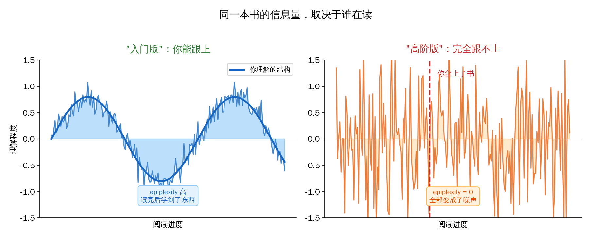
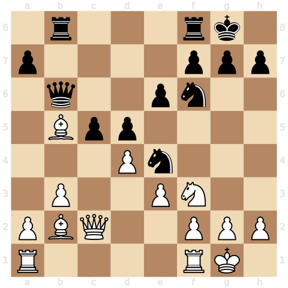
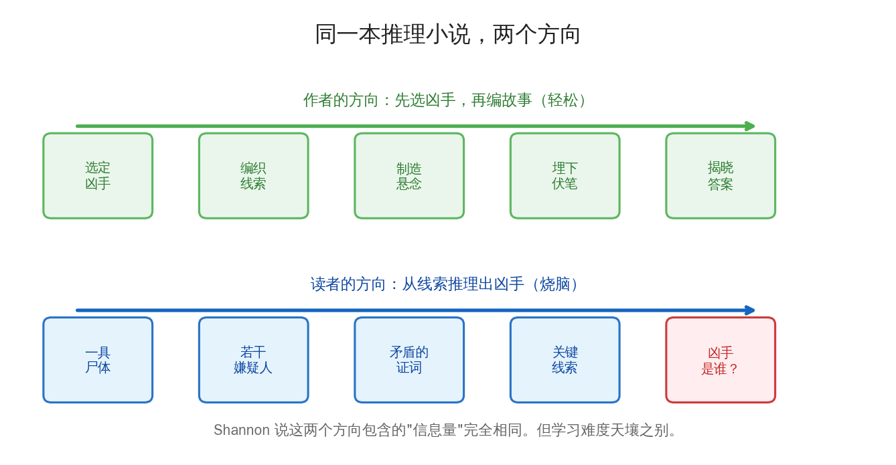
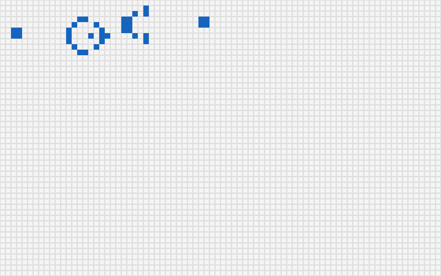
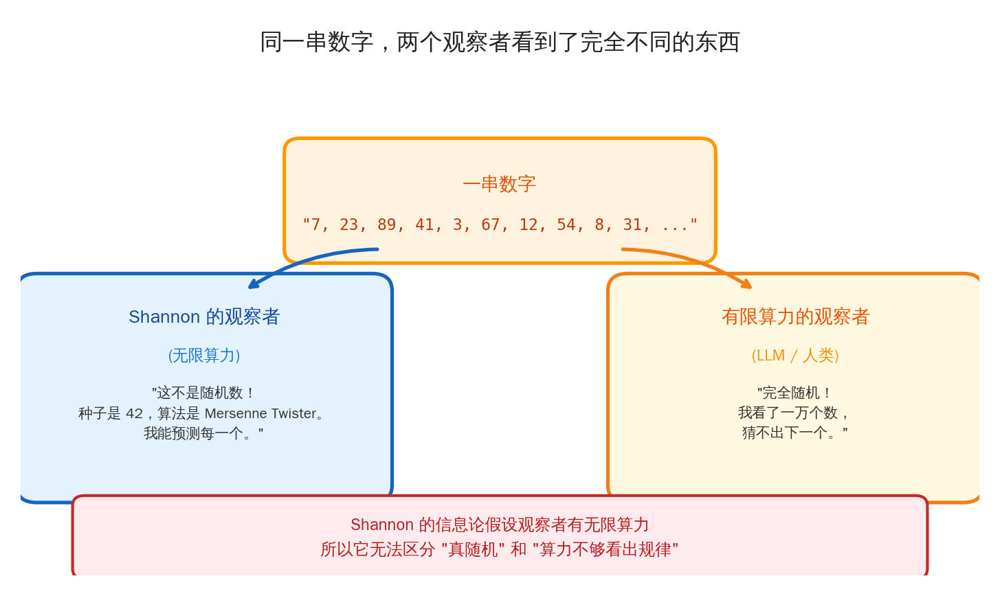
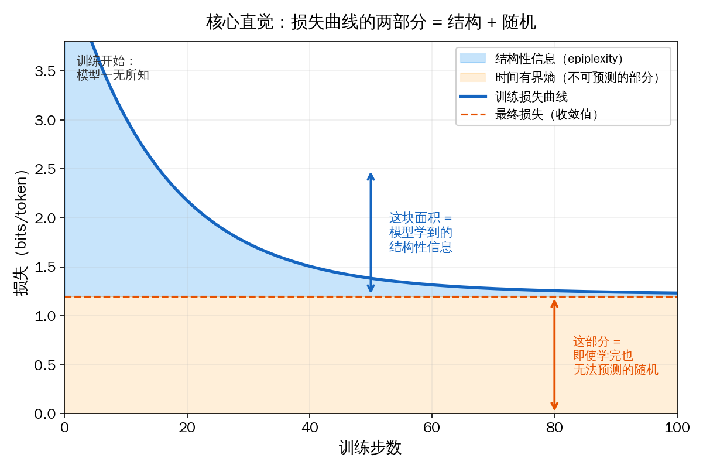
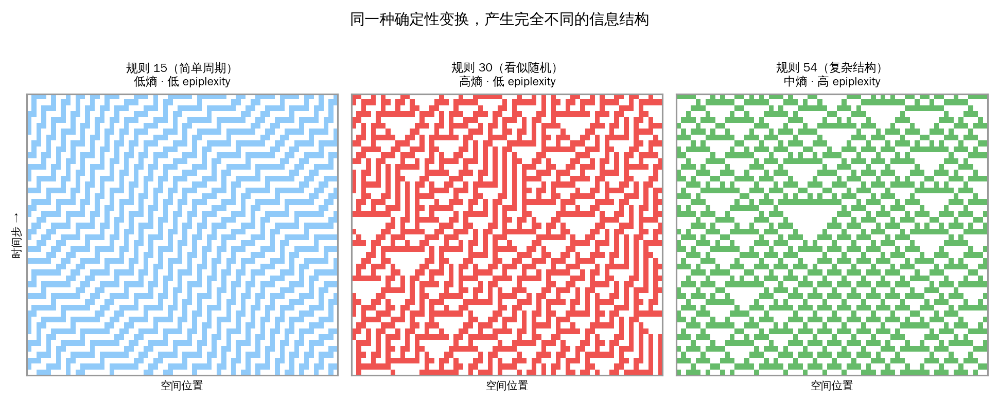
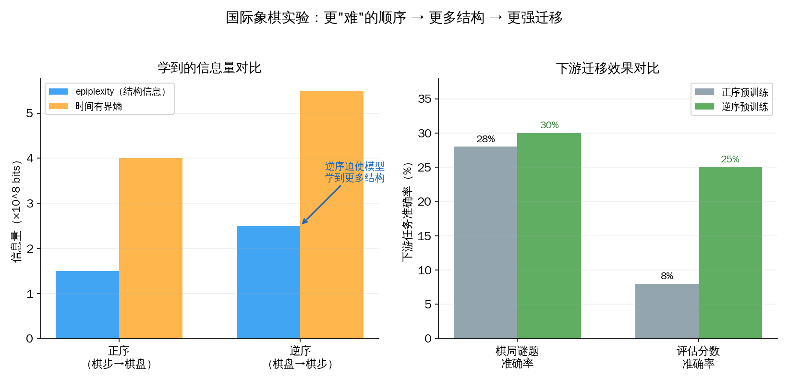
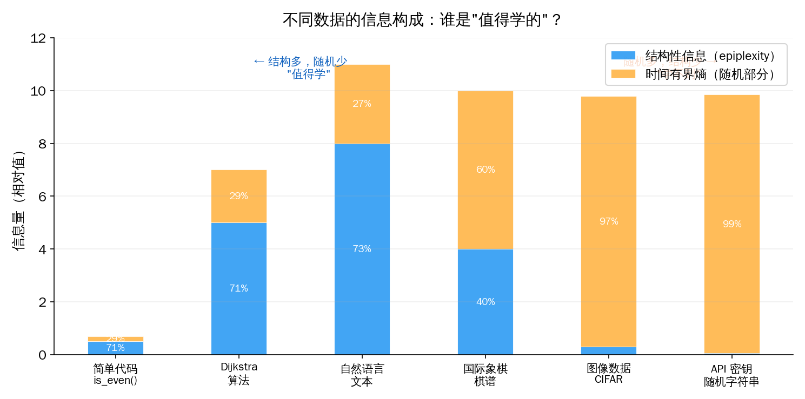
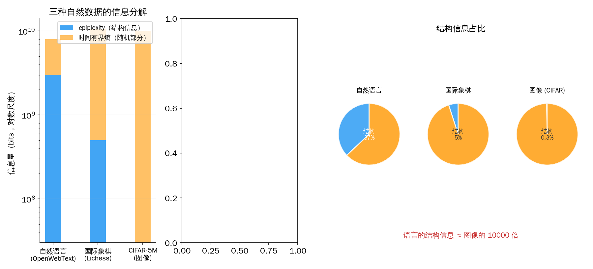

## 从一个日常经验开始

你有没有过这种体验——

打开一本教科书，前三页还能跟上，到第四页突然看不懂了。每个字你都认识，但连在一起就变成了噪音。你翻回去重读，还是不行。于是你合上书，换了一本"入门版"，同样的知识换一种讲法，突然就懂了。

信息没有变。书里写的还是同一件事。**变的是你能不能处理它。**

现在问一个稍微奇怪的问题：那本你看不懂的教科书，对你来说，信息量是多少？

Shannon 的信息论会说：和入门版一样多。信息量是数据本身的属性，和谁在读无关。

但你的直觉说：不对。那本我看不懂的书，对我来说**信息量接近于零**——因为我什么都没学到。

你的直觉是对的。Shannon 的理论也没错。矛盾出在一个被忽略了 78 年的假设上。



---

## Shannon 漏掉了什么

Claude Shannon 在 1948 年创立了信息论。这是 20 世纪最伟大的数学成就之一——它定义了"信息"是什么，证明了压缩、预测和理解在数学上是同一件事，奠定了整个现代通信工业的基础。

我在之前的 [信息论文章](/ai-blog/posts/see-math-extra-information-theory/) 里花了一整篇来讲这件事，在 [开篇语](/ai-blog/posts/opening-essay/) 里把"压缩即智能"这五个字当作这个系列的基石。

但 Shannon 解决的问题是**通信**——我这端有一段数据，怎么通过一根嘈杂的电话线传到你那端，不丢失、不出错。

对这个问题来说，**"谁在收"不重要**——你是人还是机器，收到的比特数是一样的。所以 Shannon 隐式地假设了观察者有**无限的计算能力**。这个假设在通信领域完全无害，甚至很优雅。

但今天的核心问题变了。不再是"怎么传数据"，而是——

> **给一堆数据，能从里面学到多少有用的东西？**

这是一个根本不同的问题。在这个问题里，"谁在学"变得至关重要。同样的数据，GPT-2 和 GPT-4 学到的东西不同；人类和 LLM 学到的也不同。甚至同一个人，精力充沛和疲惫不堪时，从同样的数据中学到的也不同。

**Shannon 的框架里，没有地方放"学习者的能力"这个变量。**

78 年来这不是问题——因为我们主要在做通信。但自从 LLM 出现，这个缺失就开始挡路了。

2026 年 1 月，CMU 和 NYU 的六位研究者（Finzi, Qiu, Jiang 等人）在一篇名为 *"From Entropy to Epiplexity"* 的论文中（arXiv: 2601.03220），正式补上了这个缺口。

在讲他们怎么补的之前，我想先让你**感受一下**这个缺口到底有多大。

---

## 三个让人不安的事实

### 事实一：从"无"中创造"有"

2017 年 12 月 5 日，DeepMind 发了一篇论文。AlphaZero——一个从零开始、仅靠自我对弈的 AI——用 4 小时学会了国际象棋，然后击败了人类花 40 年调教出来的最强引擎 Stockfish。

AlphaZero 的输入是什么？国际象棋的规则——几百行代码，几 KB 大小。它的输出？需要**数十兆字节**权重才能存储的超人棋力。那些前所未见的弃子攻击、匪夷所思的开局创新——象棋界的人看到后说"这不像机器下的棋，这像是来自外星文明"。

问题来了：这些知识**从哪里来**的？

Shannon 的信息论说：确定性变换不能增加信息。规则进去，规则出来，信息量守恒。AlphaZero 没有从外部获取任何数据。所以按 Shannon 的理论，它**不应该**产生新信息。

但几十兆字节的超人棋力，显然不是"没有新信息"。



### 事实二：顺序不应该重要，但它重要

论文里引用了一段 Ilya Sutskever（OpenAI 联合创始人）的话，让我印象很深：

> "你在读一本推理小说。读到某一页，文字揭示了凶手的身份。如果模型能预测出那个名字……那它一定是从前面的线索中推理出了谁是凶手。"

但写书的人不需要做这个推理。作者**先选好了凶手**，再倒过来编织线索。写作方向和阅读方向是反的——一个轻松写意，一个烧脑至极。



同样的故事，从结局倒着读，和从开头正着读，包含的"信息"一样吗？

Shannon 说：一样。信息量和顺序无关，这是信息论的基本性质。

$$H(X, Y) = H(X) + H(Y|X) = H(Y) + H(X|Y)$$

但做 LLM 训练的人都知道：英语文本正着建模比倒着建模效果好得多。更极端的例子——两个大素数 p 和 q，算乘积 N = p × q 一秒搞定；反过来给你 N 让你分解？整个密码学工业建立在"这件事算不出来"的基础上。

**同样的信息，调换一下方向，学习难度天壤之别。**

### 事实三：学生可以比老师更聪明

Conway 的生命游戏——可能是最著名的"涌现"案例。规则简单到只需要三行：

```
对每个细胞：
  活邻居 = 3 → 活
  活邻居 = 2 且自己活 → 活
  否则 → 死
```

但从这三行规则出发，会涌现出"滑翔机"（一种会斜向移动的结构）、"枪"（周期性发射滑翔机的装置）、甚至理论上的**通用计算机**。



如果你训练一个 LLM 来预测生命游戏的演化，它必须学到这些涌现概念——否则它没法做出好的预测。但这些概念**完全不在那三行规则里**。

模型学到的内部程序，比生成数据的程序复杂得多。这违反了"模型最多只能学到数据源的水平"这个直觉。

---

## 同一串数字，你看到了什么？

这三个事实指向同一个裂缝。要理解它，先看一个你每天都在经历的现象。

你手机上的每一次加密通信——微信消息、银行转账、HTTPS 网页——都依赖**伪随机数生成器**。原理很简单：给一个短短的"种子"（比如数字 42），通过确定性算法，吐出一长串看起来完全无规律的数字。

如果 Shannon 本人来看这串数字，他会说：信息量等于种子的长度，几十个 bit 而已。因为存在一个程序能完美重现整个序列——种子加算法，搞定。

但如果你把这串数字交给世界上最强的 AI，让它看前一万个数字，预测第一万零一个？

**它做不到。**

不是模型不够大，不是训练不够久。而是在有限时间内，**不存在任何算法**能区分这串伪随机数和真正的随机数。这是现代密码学的基石——如果谁能做到，你的银行账户、你的微信聊天记录、全世界的加密系统，全部裸奔。



对有无限算力的 Shannon 观察者：这串数字几乎不包含信息（一个短种子而已）。

对有限算力的你我和 LLM：这串数字**就是完全随机的**，每一位都是全新的、不可预测的信息。

**同一个对象。同一串 bit。因为观察者的算力不同，"包含多少信息"完全不同。**

这就是 Shannon 漏掉的东西：**信息不是数据的固有属性，而是数据和观察者之间的关系。**

---

## 损失曲线里藏着答案

论文提出的核心概念叫 **epiplexity**（认知复杂度）。名字有点唬人，但直觉非常简单——简单到可以用一张图说清楚。



如果你训练过 AI 模型（或者哪怕只是看过训练过程的截图），你一定见过这样的**损失曲线**：一开始 loss 很高，然后慢慢下降，最后趋于平稳。

论文说：**这条曲线天然地把数据里的信息切成了两半。**

上半部分——loss **下降的那部分面积**——是模型通过训练**真的学到了**的东西。语法规则、逻辑关系、因果常识……所有让模型变"聪明"的结构性知识。论文给它起了个名字：**epiplexity**。

下半部分——loss **不再下降后的残余**——是模型学完了所有能学的之后，仍然无法预测的随机噪声。明天的天气精确到每一朵云的形状、下一个用户会打什么错别字——这些信息量巨大，但**没有可学习的规律**。论文叫它：**时间有界熵**。

Shannon 的经典理论只看总面积——它不区分这两部分。但对实际的 AI 训练、对人类学习来说，**我们真正关心的只有蓝色区域**——那些能被学到、能被复用、能被迁移到新任务的结构。

一个直觉类比：你读一本书。书里的信息分两种——你读完后**记住并理解**的部分（epiplexity），和你怎么也记不住的随机细节，比如第 137 页第 3 行第 5 个字（时间有界熵）。总信息量一样，但前者才是你真正"学到"的。

---

## 回到那三个不安的事实

有了 epiplexity，前面那三个让人不安的事实就都有解释了。

### 计算可以创造结构

论文用**细胞自动机**做了一个漂亮的实验。

什么是细胞自动机？想象一排格子，每个格子只有黑白两种颜色。每一步，每个格子根据自己和左右邻居的颜色，按一个固定规则翻转。规则极其简单——只有一行逻辑。但不同的规则产生了天壤之别的结果：



**规则 15**：简单的条纹，像壁纸图案。模型一眼看穿。就像一首只有 Do Re Mi 三个音符的练习曲——没什么可学的。

**规则 30**：一片混沌，看不出任何规律。模型训练到天荒地老也无法降低 loss。这就是我们刚才说的伪随机数的原型——确定性过程产生了（对有限观察者来说）完全随机的结果。信息量巨大，但**全是噪声**。

**规则 54**：最有意思——复杂但不混乱。你仔细看，能看到一些"粒子"在移动、碰撞、产生新粒子。模型的 loss 缓慢但稳定地下降。它在一点一点发现这些隐藏的规律。**这就是高 epiplexity 的数据——充满了值得学习的结构。**

三种规则的输入完全相同，程序复杂度也几乎一样。但对有限算力的模型来说，它们创造出了截然不同的"可学信息"。

所以 AlphaZero 不神秘了。国际象棋的规则很简单，但通过海量计算（自我对弈），这个确定性过程**为有限观察者创造了大量结构性信息**。Shannon 说"信息没有增加"——对无限算力的上帝来说确实如此。但对我们这些有限观察者来说，那些弃子攻击和开局创新，就是被计算**挖掘**出来的、全新的结构。

### 困难的方向教会你更多

论文在国际象棋上做了一个让我拍案叫绝的实验。

同一批棋谱，两种喂法：

- **正序**：先给棋步（1.e4 e5 2.Nf3...），再给最终棋盘状态
- **逆序**：先给最终棋盘状态，再给棋步

正序就像看直播——沿着棋步走，最终棋盘可以一步步算出来。逆序就像推理小说倒着读——给你结局，让你反推过程。



结果？逆序更难学，loss 更高。但模型学到了**更多的结构性信息**（epiplexity 更高）。更惊人的是，在下游任务上——解棋局谜题、评估局面优势——逆序模型的迁移效果**碾压**正序。

为什么？正序模型可以"偷懒"——它只需要学会模拟规则的正向执行。但逆序模型没有捷径。它被**逼着**去理解棋局的内在逻辑。这种被逼出来的深层理解，恰好是下游任务需要的。

这个发现有一种禅意：**学得越痛苦的方向，越可能是正确的方向。** 因为痛苦意味着你不能走捷径，必须建立真正的理解。

### 涌现超越规则

生命游戏的实验更直接。论文做了一个对比：

给模型**足够的算力**逐步展开中间状态 → 模型找到了暴力模拟的笨办法，epiplexity 暴跌——因为它只需要记住那三行规则，反复执行就行。

**限制模型的算力** → 模型被迫学习涌现出来的高层规律（粒子的运动、碰撞、产生），epiplexity 持续上升。

**当算力不够暴力求解时，模型必须变得比数据的生成过程更"聪明"。** 这就是涌现——我在 [《为什么矩阵和激活函数就能涌现智能？》](/ai-blog/posts/universal-approximation/) 里讨论过这个现象。epiplexity 给了我们第一个精确测量涌现的工具。

---

## 一个改变我理解的发现

到这里，epiplexity 可能还只是一个"有趣的理论概念"。但接下来这个实验结果，直接让我重新理解了 AI 训练这件事。

论文把 10 亿 token 的三种数据放在一起，分解它们的信息构成：



| 数据源 | 结构性信息（epiplexity）占比 | 随机信息占比 |
|--------|--------------------------|------------|
| 自然语言（OpenWebText） | 约 37% | 约 63% |
| 国际象棋（Lichess） | 约 5% | 约 95% |
| 图像（CIFAR-5M） | **< 1%** | **> 99%** |

你没有看错。**图像数据中超过 99% 的信息都是噪声。**

想想"看一张猫的照片"这件事。照片里有什么信息？每一根猫毛的精确走向、背景墙上每一个像素的确切颜色、光影的微妙渐变——这些信息量**巨大**，但你需要知道这些吗？你只需要知道"这是一只猫"。那根关键的信息——"猫"——在全部像素信息中占的比例，微乎其微。

而自然语言呢？"水在零度以下会——"下一个词几乎确定是"结冰"。这个可预测性不是噪音，这是人类文明几千年积累下来的**结构化知识**——因果关系、物理规律、常识推理，全部编码在语言的结构里。



**语言中的结构性信息大约是图像的 10000 倍。** 四个数量级。

这就解释了一个 AI 领域所有人都注意到但没人能解释清楚的现象：为什么 GPT 在文本上预训练后能做数学、写代码、控制机器人——因为它吸收了**天量的可迁移结构**。而在图像上预训练的模型迁移能力弱得多——因为它的大部分"学习带宽"浪费在了记忆**不可迁移的随机像素**上。

### 一个颠覆性的实践结论

传统 AI 研究的核心问题是**模型选择**——给定数据，什么架构最好、什么超参数最优。

但 epiplexity 说：也许你问错了问题。**真正的关键是数据选择。**

论文验证了这一点。一种叫 ADO 的数据选择策略，会动态调整训练数据的采样分布，优先选择 loss 下降更快的数据子集。这个策略**无意中在最大化 epiplexity**——它在自动筛选结构信息密度最高的数据。结果？更好的下游表现，更强的泛化能力。

> [Chinchilla 定律](/ai-blog/posts/llm-training-stages/) 告诉我们**要用多少数据**。Epiplexity 回答下一个问题：**要用什么数据**。

---

## 这和你有什么关系

如果你读到这里心想："这是 AI 研究者的事，和我没关系"——恰恰相反。

**你就是一个有限算力的观察者。**

你的大脑有 860 亿个神经元，处理速度大概几百赫兹——和 GPU 的万亿次运算相比微不足道。你一辈子能读的书、能经历的事、能处理的信息，都是严格有限的。

但你依然能理解世界。怎么做到的？

**你做的事情，恰好就是 epiplexity 描述的事情：在有限的算力下，从海量数据中提取结构。**

你不会去记每片落叶的纹路（那是时间有界熵——随机的、不可学习的噪声），但你会学到"秋天叶子会变黄"（那是 epiplexity——可复用的结构性知识）。你不会记住每顿饭的每一口味道，但你会学到"盐放多了会咸"。你不会记住每次对话的每一个字，但你会学到"这个人说话靠不靠谱"。

**这不就是人类智能的核心吗？** 在有限的生命里，从看似混沌的世界中，提取出尽可能多的规律。

甚至——你此刻阅读这篇文章的过程，就是一个活生生的例子。

这篇文章有几千字，包含大量信息。但你不会（也不需要）记住每个字。你会记住的是几个关键结构："信息量取决于观察者"、"语言比图像更值得学"、"困难的学习方向可能更好"。这些就是这篇文章对你的 epiplexity——你从这些文字中**真正提取出来的结构**。

如果我写得太学术、太抽象，你读着读着跟不上了——那一刻发生的事情，恰好就是 epiplexity 为零的状态：信息量巨大，但对你这个"有限算力的观察者"来说，全部变成了噪声。**你什么都没学到，阅读就中断了。**

这就是为什么好的教育如此重要。

**好的老师本质上就在做 epiplexity 最大化。** 他们不会让学生死记硬背（那是喂低 epiplexity 的数据——记了就忘的随机细节）。他们用精心选择的例子、由浅入深的顺序、恰到好处的难度，让学生在有限的学习时间里提取到最多的结构。

论文里"逆序学国际象棋反而学得更深"的发现，和教育学里一个著名理论惊人地吻合——**"适度的困难"（desirable difficulty）促进深层学习**。太简单的材料，学生不需要建立新的认知结构就能应付；太难的材料，超出处理能力，变成噪声。只有在"够得着但要跳一跳"的难度区间里，大脑才会被迫建立新的理解框架——也就是提取新的结构性信息。

所以这篇论文说的不只是 AI 的事。它说的是**所有有限智能体——不管是 LLM 还是人类——如何从世界中获取知识**。

---

## 兴趣：被低估的算力加速器

但论文没有讨论、而框架却完美解释的一个东西是——**兴趣**。

想一件你真正着迷的事。可能是编程，可能是做菜，可能是打篮球，可能是养花。回忆一下你沉浸其中的状态：时间消失了，注意力像激光一样聚焦，每一个细节都在你脑子里留下清晰的纹路。

再想一件你毫无兴趣的事。也许是大学里一门被迫选的课。老师在讲台上说的每句话都是合法的中文句子，但你的大脑就是拒绝处理它们。一个小时过去了，笔记本上是空的，脑子里也是空的。

**同样的数据。同样的你。唯一的区别是——兴趣。**

从 epiplexity 的角度看，兴趣做了一件很具体的事：**它临时升级了你的硬件**。

当你感兴趣时，大脑会分配更多的注意力、更多的工作记忆、释放更多的多巴胺（这会增强突触可塑性，也就是"记忆力"）。用论文的语言说：你从一个算力较低的观察者，变成了一个算力更高的观察者。同一份数据，你能提取出更多的结构。

那本在凌晨两点备考时让你昏昏欲睡的统计学教材——当你在工作中遇到一个真正需要回归分析才能回答的问题时，再去翻它，同样的公式突然变得清晰、有力、有用。

**数据没变。你的"算力"变了。** 因为兴趣和需求给了你更强的处理能力。

### 天赋：出厂配置不同的观察者

更深一层：为什么有人天生着迷于音乐，有人着迷于数学，有人着迷于语言？

也许答案是——**每个人的大脑架构，让不同类型的数据对你呈现出不同的 epiplexity**。

一个有音乐天赋的孩子，听到一段旋律时，他的听觉皮层能从中提取出非音乐人根本"听不见"的结构——和弦走向、节奏变化、调性张力。不是因为声波不同，是因为**观察者不同**。同样一段音频，对他来说充满了可学的结构（高 epiplexity），对另一个人来说就是"好听的背景音"（低 epiplexity）。

反过来，那个听不出和弦色彩的人，可能看一眼代码就能感受到架构的优雅和冗余——这是程序员的"音乐天赋"。

**所谓天赋，也许就是：你的大脑对某种数据天生有更高的结构提取效率。**

这不是鸡汤。这是一个可以指导行动的洞察。

### 学习的正反馈循环

兴趣和天赋会触发一个强大的正反馈循环：

> 兴趣 → 更多注意力（更高算力） → 提取更多结构 → 理解加深 → "原来还有这么多有意思的东西！" → 更强的兴趣 → ……

这就是为什么有些人在某个领域越学越快——不是他们变聪明了，是循环在加速。每一轮提取出的结构，都成为下一轮提取的"脚手架"。就像论文里说的国际象棋逆序实验——前面学到的深层结构，让后面的学习变得更高效。

反过来，如果一开始就被迫学习你不感兴趣的东西（低算力状态），提取不到结构（低 epiplexity），感觉全是噪声，于是更没兴趣，恶性循环。

**这解释了一个每个人都经历过但很难说清的现象：为什么"学不进去"的感觉和"学得飞快"的感觉差别那么大。** 不是意志力的问题，是你此刻的有效算力决定了你能从这份数据中提取多少结构。

### 好的内容创作者在做什么

如果你接受了这个框架，那"好的老师"和"好的内容创作者"在做什么就很清楚了——他们同时在做**两件事**：

**第一，选择高 epiplexity 的数据。** 不是所有信息都值得传达。好的内容只传递结构——那些读者听完之后能记住、能复用、能迁移到其他场景的东西。冗余的细节、不必要的术语、为了显示专业性的复杂表述——这些都是噪声。

**第二，提升读者的有效算力。** 怎么提升？**激发兴趣。** 用故事代替定义，用悬念代替目录，用"这和你有什么关系"代替"本文将讨论以下三个方面"。当读者的好奇心被点燃时，他们的注意力集中了，处理能力上升了——同样的内容，他们能从中提取出更多的结构。

所以，一篇好文章的目标不是"传递信息"——而是**最大化读者的 epiplexity**。传递的信息要富含结构，同时要让读者处于最佳的接收状态。

这也许是我写这个系列文章以来，找到的最精确的一句话：

> **好的写作 = 高结构密度 × 高读者算力。** 前者靠选材和提炼，后者靠兴趣和共鸣。

---

## 接下来会发生什么

这篇论文不是终点，而是起点。它打开了几个方向：

**对 AI 训练来说**——数据选择将从"凭直觉和经验"走向"有理论指导"。不是所有数据都值得拿来训练。高 epiplexity 的数据（自然语言 >> 图像）应该被优先使用。合成数据的设计不再是盲目的——目标是创造高结构信息密度的训练材料。

**对理解智能本身来说**——epiplexity 提供了第一个将"计算能力"和"信息"放在同一个框架里的数学工具。Shannon 把信息论从通信中抽象出来；这篇论文把"学习者的算力"重新放了回去。这可能催生一个新的数学分支——**计算感知的信息论**（compute-aware information theory）。

**对我们理解自身来说**——它既是一种谦逊，也是一种力量。

谦逊在于：我们永远是有限的观察者。世界中存在大量"信息"，但我们能提取出来的结构，永远只是其中一小部分。这不是失败，这是物理现实。

力量在于：正是因为知道了这个边界在哪里，我们才能优化**在边界之内能做的事**。Shannon 告诉工程师"通信极限在这里"，结果是整个通信工业逼近了那个极限。Epiplexity 告诉我们"你的学习能力的极限在这里"——下一步就是想办法逼近它。

---

## 写在最后

Shannon 在 1948 年画出了信息传输的数学地图。78 年来，这张地图指引了整个数字文明。

但这张地图有一个隐含的假设：使用地图的人拥有无限的视力，能看清地图上的每一个细节。

现实是，我们都是近视的。

这篇论文做的事情，是给这张地图加上了一个新的维度——**观察者的能力**。同一张地图，戴不同度数的眼镜，看到的细节不同，能走通的路也不同。

这不是否定 Shannon。这是说：Shannon 画了一张完美的、上帝视角的地图。但我们需要的，是一张为**近视的人**画的地图——一张告诉你"以你的视力，这条路你能看清，那条路对你来说只是模糊的噪点"的地图。

人类几千年来做的事——创造语言、发现定律、建立数学、发展科学——本质上都是同一件事：用有限的大脑，从看似混沌的世界中，一点一点地提取结构。

LLM 做的也是同一件事。只是用不同的方式，在不同的尺度上。

**智能的本质不是"知道一切"，而是在算力的边界上，尽可能多地理解世界的结构。**

---

> **论文信息**
>
> Marc Finzi, Shikai Qiu, Yiding Jiang, Pavel Izmailov, Andrew Gordon Wilson, J. Zico Kolter. *"From Entropy to Epiplexity: Rethinking Information for Computationally Bounded Intelligence."* arXiv:2601.03220, January 2026.
>
> 代码：https://github.com/shikaiqiu/epiplexity
