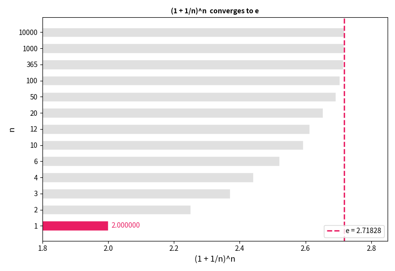
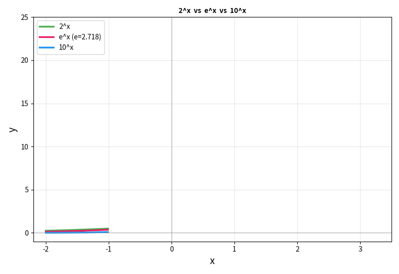
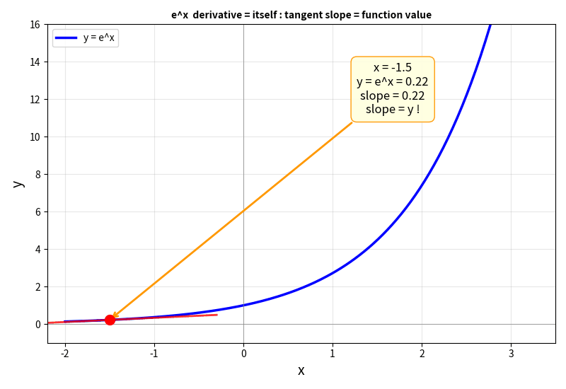

## 一个让人害怕的字母

你翻开任何一本 AI 教科书，十页之内一定会遇到它：

$$e^x$$

然后是 Softmax 公式：

$$\text{softmax}(z_i) = \frac{e^{z_i}}{\sum_j e^{z_j}}$$

再然后是学习率衰减：

$$\eta_t = \eta_0 \cdot e^{-\lambda t}$$

你合上书。**"e 到底是什么？为什么到处都是它？"**

大多数人对 e 的记忆停留在高中课堂——老师说"e 大约等于 2.71828，是自然对数的底数"，然后就开始做题了。

至于**它从哪来、为什么是这个数、为什么自然界选中了它**——没人告诉你。

今天我想把这个故事补上。读完之后，你再看到含 e 的公式，不会害怕，而会觉得——**"老朋友，又见面了。"**

---

## 一、从一个银行的问题开始

### 1690 年，雅各布·伯努利的利息难题

时间回到 17 世纪末。瑞士数学家雅各布·伯努利（Jacob Bernoulli）在研究一个很实际的问题：

> **如果银行年利率是 100%，一年后你的钱最多能变成多少？**

听起来简单。1 块钱，年利率 100%，一年后 → **2 块钱**。

但伯努利想得更深：如果银行**每半年结算一次**，每次利率 50%（年利率 100% 平摊到两个半年），会怎样？

### 让我们一步步推导

**第一步：一年结算一次**

年利率 100%，一年后：1 × (1 + 1) = **2 块钱**。简单。

**第二步：半年结算一次**

年利率 100% 平摊到两个半年 → 每半年利率 = 100%/2 = **50%**。

- 第 1 个半年结束：1 × (1 + 0.5) = 1.5 元
- 第 2 个半年结束：1.5 × (1 + 0.5) = **2.25 元**

比一年结算多赚了 0.25 元！这多出来的钱，就是"**利息的利息**"——第一个半年赚的 0.5 元利息，在第二个半年也参与了计息。

用公式写出来：1 × (1 + 1/2)² = 2.25

**第三步：看出规律**

如果把一年切成 **n 段**，每段利率就是 100%/n = 1/n，一年结束后：

$$\text{总额} = 1 \times \left(1 + \frac{1}{n}\right)^n$$

逻辑很清楚：**每段利率变小了**（分母 n 越大，1/n 越小），**但计息次数变多了**（指数 n 越大）。两股力量在博弈。那谁赢？

<div style="max-width: 660px; margin: 1.5em auto; padding: 20px; border-radius: 8px; background: rgba(255,152,0,0.06); border: 1px solid rgba(255,152,0,0.2);">

<div style="font-weight: bold; margin-bottom: 12px; color: #FF9800; font-size: 1.05em;">复利实验：把一年切成 n 段</div>

```text
n（切分次数）   每段利率     公式                  一年后总额
──────────────────────────────────────────────────────────
  1（年结）      100%       (1 + 1/1)¹          = 2.000000
  2（半年结）     50%       (1 + 1/2)²          = 2.250000
  4（季结）       25%       (1 + 1/4)⁴          = 2.441406
 12（月结）      8.33%      (1 + 1/12)¹²        = 2.613035
 52（周结）      1.92%      (1 + 1/52)⁵²        = 2.692597
365（日结）      0.274%     (1 + 1/365)³⁶⁵      = 2.714567
8760（时结）     0.0114%    (1 + 1/8760)⁸⁷⁶⁰     = 2.718127
  ∞（连续复利）   → 0       (1 + 1/∞)^∞         = 2.718281...
```

</div>



**你发现了一件奇妙的事：**

切分越细，利息的利息的利息……层层叠加，总额不断增长——但它**不是无限增长的**。两股力量博弈的结果是：增长**收敛**到一个数字，然后停住了。

这个数字就是 **e ≈ 2.71828182845904523536…**

<div style="max-width: 660px; margin: 1.5em auto; padding: 20px; border-radius: 8px; border: 2px solid #E91E63; background: rgba(233,30,99,0.04);">

<div style="font-weight: bold; margin-bottom: 12px; font-size: 1.05em; color: #E91E63;">e 的诞生</div>

$$e = \lim_{n \to \infty} \left(1 + \frac{1}{n}\right)^n = 2.71828...$$

**e 就是「连续复利」的极限**——当你把增长切到无限细碎，利滚利滚利……最终收敛到的那个数。

不是"利率越高增长越多"这么简单——是**"计息越频繁，利息的利息越多，但多出来的部分越来越小"**，最终总和有一个天花板。这个天花板就是 e。

</div>

伯努利没有给它命名。半个世纪后，莱昂哈德·欧拉（Leonhard Euler）用自己名字的首字母 **e** 来称呼它——从此这个数字有了名字。

> **一句话记住：** e 不是人造的。它是"连续增长"本身的数学指纹。只要世界上存在"一边增长，一边把增长的部分也算进去"的过程，e 就会出现。

---

## 二、e 的第一个秘密——它是"自然变化"的速率

### 一条神奇的曲线

让我们画一条曲线：y = eˣ。

<div style="max-width: 660px; margin: 1.5em auto; padding: 20px; border-radius: 8px; background: rgba(33,150,243,0.06); border: 1px solid rgba(33,150,243,0.2);">

<div style="font-weight: bold; margin-bottom: 12px; color: #2196F3; font-size: 1.05em;">eˣ 的值</div>

```text
  x      eˣ
────────────────
 -2      0.135
 -1      0.368
  0      1.000    ← e⁰ = 1，任何数的 0 次方都是 1
  1      2.718    ← e¹ = e
  2      7.389
  3     20.086
  5    148.413
 10  22026.466
```

</div>

这条曲线有什么特别？

很多函数都能增长。2ˣ 也行，10ˣ 也行。先来看看它们长什么样：



三条曲线都是指数增长，只是"快慢"不同。但 **eˣ 的独特之处不在于它的增长速度，而在于一个惊人的性质：**

<div style="max-width: 660px; margin: 1.5em auto; padding: 20px; border-radius: 8px; border: 2px solid #FF9800; background: rgba(255,152,0,0.04);">

**eˣ 是唯一一个"变化率等于自身"的函数。**

如果 y = eˣ，那么 y 的导数（变化率）= eˣ = y 本身。

$$\frac{d}{dx} e^x = e^x$$

用大白话说：**eˣ 在每一个点的「增长速度」，恰好等于它在那个点的「当前值」。**

</div>

下面这张动图让你"看见"这件事——红色切线的斜率（增长速度），始终等于蓝色曲线在那个点的高度（当前值）：



这意味着什么？

- 当 eˣ = 1 时，它的增长速度 = 1
- 当 eˣ = 100 时，它的增长速度 = 100
- 当 eˣ = 一百万时，它的增长速度 = 一百万

**你越大，你增长得越快。增长速度永远和你自身成正比。**

这不是人为设计的。在所有可能的指数底数中——2、3、10、π——**只有 e** 拥有这个性质。这就是为什么数学家叫它"自然常数"：它不是某个天才发明的，而是自然界自己选出来的。

### 所有指数函数，都是 eˣ 的"变速版"

你可能会问：**那 2ˣ 和 10ˣ 跟 eˣ 到底是什么关系？**

答案出奇的简单——**它们都可以写成 eˣ 乘以一个常数**：

<div style="max-width: 660px; margin: 1.5em auto; padding: 20px; border-radius: 8px; background: rgba(33,150,243,0.06); border: 1px solid rgba(33,150,243,0.2);">

<div style="font-weight: bold; margin-bottom: 12px; color: #2196F3; font-size: 1.05em;">万能转换公式：任何指数 = e 的指数</div>

$$a^x = e^{x \cdot \ln(a)}$$

也就是说：

```text
2ˣ  = e^(x × 0.693)     ← ln(2)  ≈ 0.693
3ˣ  = e^(x × 1.099)     ← ln(3)  ≈ 1.099
eˣ  = e^(x × 1.000)     ← ln(e)  = 1.000  ← 就是它自己！
10ˣ = e^(x × 2.303)     ← ln(10) ≈ 2.303
```

</div>

**所有指数函数，都是 eˣ 的"变速版"**——只是把 x 轴拉伸或压缩了。

- 2ˣ 是 eˣ 的"慢放版"（乘以 0.693，增长变慢）
- 10ˣ 是 eˣ 的"快进版"（乘以 2.303，增长加快）
- eˣ 是"原速版"（乘以 1，最干净）

这就是为什么在数学和物理中，所有指数增长的公式都写成 eᵏᵗ 而不是 2ᵏᵗ——**用 e 做底数，指数上的 k 直接就是增长速率，不需要额外换算**。

> **一句话总结：** 高中学的 2ˣ、10ˣ 不白学——它们都是 eˣ 的特殊情况。学会了 eˣ，你就掌握了**所有**指数函数的"母体"。

> 如果你读过 [《看见数学（七）：指数爆炸》](/ai-blog/posts/see-math-7-exponential/)，你已经感受过指数增长的威力——一张纸对折 42 次就能到达月球。那篇用的是 2ˣ。现在你知道了：2ˣ = e^(0.693x)——它只是 eˣ 的慢放版。e 才是所有指数的"母体"。

---

## 三、为什么自然界到处都是 e

### 因为自然界到处都有"与自身成正比的变化"

一旦你知道 eˣ 的导数等于自身，你就明白了为什么 e 无处不在——因为自然界的大量现象，都服从同一条规律：

> **变化的速率，与当前的状态成正比。**

<div style="max-width: 660px; margin: 1.5em auto; padding: 20px; border-radius: 8px; background: rgba(76,175,80,0.06); border: 1px solid rgba(76,175,80,0.2);">

<div style="font-weight: bold; margin-bottom: 12px; color: #4CAF50; font-size: 1.05em;">e 出没的地方</div>

| 领域 | 现象 | 为什么是 e |
|------|------|-----------|
| **金融** | 复利增长 | 利息与本金成正比 → 本金越多，利息越多 |
| **生物** | 细菌繁殖 | 分裂速度与现有数量成正比 |
| **物理** | 放射性衰变 | 衰变速度与当前原子数成正比 |
| **化学** | 反应速率 | 速率与反应物浓度成正比 |
| **医学** | 药物代谢 | 排出速率与血液浓度成正比 |
| **工程** | 电容充放电 | 电流与电压差成正比 |
| **社交** | 病毒传播（初期） | 感染速度与已感染人数成正比 |

</div>

所有这些现象的数学描述，都长成同一个样子：

$$\frac{dy}{dt} = k \cdot y$$

——变化率等于某个常数 k 乘以当前值 y。

这个方程的解是：

$$y(t) = y_0 \cdot e^{kt}$$

- k > 0：指数增长（细菌繁殖、复利）
- k < 0：指数衰减（放射性衰变、药物代谢）

**不管是增长还是衰减，e 都在那里。因为 e 就是"与自身成正比的变化"的数学签名。**

---

## 四、中国古人的 e 直觉

你可能以为 e 是纯粹的西方数学。但中国古人早就感受到了 e 背后的规律。

<div style="max-width: 640px; margin: 1.5em auto; padding: 15px 20px; border-radius: 8px; background: rgba(76,175,80,0.06); border-left: 4px solid #4CAF50;">

**庄子·天下篇：**

> **"一尺之棰，日取其半，万世不竭。"**

一根一尺的木棍，每天取走一半。永远取不完。

这就是指数衰减：y = (1/2)ⁿ。而连续版本正是 y = e^{-kt}。

庄子在两千多年前触摸到的"无穷递减但永不到零"的直觉——正是 e 的衰减曲线。

</div>

<div style="max-width: 640px; margin: 1.5em auto; padding: 15px 20px; border-radius: 8px; background: rgba(255,152,0,0.06); border-left: 4px solid #FF9800;">

**"利滚利"**——中国民间对复利的精准描述。

古代放贷者的"驴打滚"，大明律专门立法限制的高利贷，本质上就是 (1 + r/n)ⁿ → eʳ 的现实版本。

老百姓不认识 e，但他们的痛苦是真实的——因为 e 的威力不需要你理解它，它就在那里运作。

</div>

---

## 五、e 进入 AI——Softmax 的秘密

现在，让我们把 e 带进你最关心的领域：AI。

### LLM 的最后一步

在 [《LLM 中的概率论》](/ai-blog/posts/llm-probability/) 里，我们详细拆解过：LLM 预测下一个词时，最后一步是 Softmax。但那篇文章没有细讲一个问题：

> **Softmax 里为什么用 e？为什么不用 2 或 10？**

让我们从头来过。

LLM 的倒数第二层输出一组"分数"（叫 logits），比如预测下一个词时：

```text
词语       logits（原始分数）
─────────────────────────
"的"        3.2
"了"        1.8
"在"        0.5
"猫"       -1.0
```

这些分数有正有负，大小不一。我们需要把它们**转换成概率**——每个数在 0 到 1 之间，总和为 1。

Softmax 公式就是这个转换器：

$$P(词_i) = \frac{e^{z_i}}{\sum_j e^{z_j}}$$

来算一下：

<div style="max-width: 660px; margin: 1.5em auto; padding: 20px; border-radius: 8px; background: rgba(156,39,176,0.06); border: 1px solid rgba(156,39,176,0.2);">

<div style="font-weight: bold; margin-bottom: 12px; color: #9C27B0; font-size: 1.05em;">Softmax 手算示例</div>

```text
词语     logit z    e^z          概率 P
────────────────────────────────────────
"的"      3.2     e^3.2 = 24.53   24.53/28.08 = 87.4%
"了"      1.8     e^1.8 =  6.05    6.05/28.08 = 21.5%
"在"      0.5     e^0.5 =  1.65    1.65/28.08 =  5.9%
"猫"     -1.0     e^-1  =  0.37    0.37/28.08 =  1.3%
                         ──────
                 总和 =   32.60              ≈ 100%
```

</div>

### 三个为什么

**为什么不用简单的比例？** 比如直接用 z/Σz？

因为 logits 可以是负数。-1.0 除以总和会产生负概率——概率不能为负。

**为什么不用 z²（先平方消除负号）？**

因为平方会让 -3 和 +3 得到相同的概率。但 -3 和 +3 的含义完全不同——一个是"非常不可能"，一个是"非常可能"。

**为什么偏偏是 eˣ？**

<div style="max-width: 660px; margin: 1.5em auto; padding: 20px; border-radius: 8px; border: 2px solid #E91E63; background: rgba(233,30,99,0.04);">

<div style="font-weight: bold; margin-bottom: 12px; font-size: 1.05em; color: #E91E63;">eˣ 做 Softmax 的四个优势</div>

1. **永远为正**：不管 x 是多少（包括负数），eˣ > 0。完美解决负概率问题。

2. **保序**：x 越大，eˣ 越大。原来分数高的词，转换后概率依然高。

3. **放大差异**：eˣ 是指数函数，把微小的分数差距放大成明显的概率差距。logit 差 1.4（3.2 vs 1.8），概率差 4 倍（87% vs 22%）。

4. **求导最干净**：因为 d(eˣ)/dx = eˣ，Softmax 的梯度表达式极其简洁——这让反向传播的计算效率最高。

</div>

第 4 点是工程上最关键的。如果用 2ˣ 或 10ˣ，求导时会多出一个 ln(2) 或 ln(10) 的常数因子，让梯度传播变得不那么"干净"。而 eˣ 的导数就是自己——**数学最简洁的形式，往往就是自然选中的形式**。

> 如果你读过 [《交叉熵损失函数》](/ai-blog/posts/cross-entropy-loss/)，你会记得损失函数里有一个 -log(p)。而 Softmax 里有 eˣ。log 和 eˣ 互为逆运算——一个把概率变成"信息量"，一个把"分数"变成概率。它们是同一枚硬币的两面。Shannon 在 1948 年选择了 log，AI 研究者在 Softmax 中选择了 e——**这不是巧合，是同一条数学暗线的两个端点。**

---

## 六、e 在 AI 训练中的第二个角色——学习率衰减

如果说 Softmax 是 e 在"推理"阶段的表演，那**学习率衰减**就是 e 在"训练"阶段的表演。

### 为什么学习率要衰减？

训练神经网络就像在一片山地里找最低点（损失函数最小值）。

- **训练初期**：你在高山上，方向大致正确，**步子要大**，快速下山。
- **训练后期**：你已经到了谷底附近，**步子要小**——否则会在最低点两侧来回跳跃，永远停不下来。

这就是学习率衰减：让每一步的大小**随时间减小**。

### 最经典的衰减方式：指数衰减

$$\eta_t = \eta_0 \cdot e^{-\lambda t}$$

- η₀ = 初始学习率（比如 0.01）
- λ = 衰减速率
- t = 当前训练步数

<div style="max-width: 660px; margin: 1.5em auto; padding: 20px; border-radius: 8px; background: rgba(33,150,243,0.06); border: 1px solid rgba(33,150,243,0.2);">

<div style="font-weight: bold; margin-bottom: 12px; color: #2196F3; font-size: 1.05em;">指数衰减的学习率</div>

```text
训练步数    学习率 η (λ=0.001)
──────────────────────────────
    0        0.01000           ← 初始，大步走
  100        0.00905
  500        0.00607
 1000        0.00368           ← 不到原来的 1/3
 2000        0.00135
 5000        0.00007           ← 几乎是微调了
10000        0.00000454        ← 极精细的打磨
```

</div>

为什么用 e⁻ˡᵗ 而不是直接除以 t？

因为 e 的衰减有一个完美的性质：**每经过相同的时间间隔，学习率变为原来的相同比例**。

$$\frac{\eta_{t+\Delta t}}{\eta_t} = e^{-\lambda \Delta t} = \text{常数}$$

这就是"半衰期"思维。放射性衰变中，铀-238 的半衰期是 45 亿年——不管你是从 100 克开始还是从 1 克开始，经过 45 亿年都会变成一半。学习率也一样：衰减的"节奏"是均匀的。

> 还记得庄子的"日取其半"吗？学习率的指数衰减，就是"日取其半"的连续版本——每一步都取走一点点，但永远不会到零。

---

## 七、e 的更多面孔

e 在 AI 中还有更多化身，它们可能你已经在其他文章中遇到过：

<div style="max-width: 660px; margin: 1.5em auto; padding: 20px; border-radius: 8px; background: rgba(255,152,0,0.06); border: 1px solid rgba(255,152,0,0.2);">

<div style="font-weight: bold; margin-bottom: 12px; color: #FF9800; font-size: 1.05em;">e 在 AI 中的七个化身</div>

| # | 出现位置 | 公式 | 它在做什么 |
|---|---------|------|-----------|
| 1 | **Softmax** | eᶻⁱ / Σeᶻʲ | 把分数变成概率 |
| 2 | **交叉熵损失** | -log(p) = -ln(p) | 衡量预测的"惊讶程度"（ln = logₑ） |
| 3 | **学习率衰减** | η₀·e⁻ˡᵗ | 让训练步伐越来越精细 |
| 4 | **Sigmoid 激活** | 1/(1+e⁻ˣ) | 把任意数压缩到 0~1 之间 |
| 5 | **正态分布** | (1/√2π)·e^(-x²/2) | 自然界的"默认概率分布" |
| 6 | **注意力权重** | softmax(QKᵀ/√d) | Transformer 里计算"关注度" |
| 7 | **温度参数** | eᶻⁱ/ᵀ / Σeᶻʲ/ᵀ | 控制生成的"创造力"——T大→平均，T小→尖锐 |

</div>

你看出规律了吗？

**每当 AI 需要做以下任何一件事时，e 就会出现：**

- 把任意数变成正数 → eˣ
- 把任意数变成概率 → Softmax（基于 eˣ）
- 计算信息量 → log（eˣ 的逆运算）
- 描述自然衰减 → e⁻ˣ
- 描述钟形分布 → e^(-x²)

这些看似不同的需求，数学上都指向同一个函数。**不是 AI 研究者偏爱 e——是 e 恰好是所有这些需求的唯一解。**

---

## 八、Sigmoid——e 的一个优美变形

让我单独讲讲 Sigmoid，因为它是理解 e 在 AI 中角色的一个绝佳窗口。

$$\sigma(x) = \frac{1}{1 + e^{-x}}$$

<div style="max-width: 660px; margin: 1.5em auto; padding: 20px; border-radius: 8px; background: rgba(156,39,176,0.06); border: 1px solid rgba(156,39,176,0.2);">

<div style="font-weight: bold; margin-bottom: 12px; color: #9C27B0; font-size: 1.05em;">Sigmoid 函数的行为</div>

```text
  x       e⁻ˣ      1+e⁻ˣ     σ(x)
─────────────────────────────────────
 -5     148.41     149.41     0.007   ← 几乎是 0
 -2       7.39       8.39     0.119
 -1       2.72       3.72     0.269
  0       1.00       2.00     0.500   ← 正好 50%
  1       0.37       1.37     0.731
  2       0.14       1.14     0.881
  5       0.01       1.01     0.993   ← 几乎是 1
```

</div>

Sigmoid 做了一件精妙的事：**它把整条数轴（从 -∞ 到 +∞）"压缩"到 0 和 1 之间**。

- 极大的正数 → 接近 1
- 极大的负数 → 接近 0
- 0 → 正好 0.5

这个形状被早期 AI 研究者用来模拟神经元的"激活"——输入超过阈值就激活（→1），低于阈值就沉默（→0），中间地带有一个平滑的过渡。

如果你读过 [《激活函数》](/ai-blog/posts/math-for-ai-5-activation/)，你知道后来 ReLU 因为计算更快而取代了 Sigmoid 成为主流。但在需要输出概率的场合（比如二分类问题），Sigmoid 依然不可替代——因为它把 e 的指数特性和概率的 0~1 范围完美结合。

**Sigmoid 本质上就是"二选一的 Softmax"——Softmax 是多选题版本，Sigmoid 是判断题版本。**

---

## 九、e 和 π 的一次意外相遇——正态分布

数学中有一个让所有人都感到不可思议的公式。

正态分布（高斯分布）的概率密度函数：

$$f(x) = \frac{1}{\sqrt{2\pi}} \cdot e^{-\frac{x^2}{2}}$$

**e 和 π 同时出现了。**

一个来自复利极限（e），一个来自圆的周长（π）。它们看起来毫不相关——一个和"增长"有关，一个和"形状"有关。但它们在正态分布里**不期而遇**。

为什么？

- **e^(-x²/2)** 负责创造钟形曲线的"形状"——离中心越远衰减越快
- **1/√(2π)** 负责让曲线下面积等于 1——因为概率总和必须是 1

而 π 出现在这里，是因为 e^(-x²) 从 -∞ 到 +∞ 的积分恰好等于 √π。这是一个深刻的数学事实，高斯当年用极坐标变换证明了它——圆（π 的领地）和指数衰减（e 的领地）在高维积分中相遇。

> 在 [《看见数学（十三）：概率》](/ai-blog/posts/see-math-13-probability/) 里我们讨论了概率论。在 [《LLM 中的概率论》](/ai-blog/posts/llm-probability/) 里我们讨论了 LLM 的采样。正态分布在 AI 中无处不在——权重初始化是正态分布，噪声是正态分布，Batch Normalization 假设每层输出近似正态分布。**e 和 π 的这次相遇，是 AI 数学根基中最深的那一层。**

---

## 十、欧拉公式——最美的方程

说到 e 和 π 的相遇，就不得不提数学史上公认的"最美方程"：

<div style="max-width: 660px; margin: 1.5em auto; padding: 20px; border-radius: 8px; border: 2px solid #9C27B0; background: rgba(156,39,176,0.04);">

<div style="font-weight: bold; margin-bottom: 12px; font-size: 1.1em; color: #9C27B0; text-align: center;">欧拉恒等式</div>

$$e^{i\pi} + 1 = 0$$

五个最基本的数学常数——**e、i、π、1、0**——在一个方程里相遇。

- **e** (2.718…)：连续变化的签名
- **i** (√-1)：虚数，"不存在"的数
- **π** (3.14159…)：圆的签名
- **1**：乘法的基石
- **0**：加法的基石

</div>

物理学家费曼第一次看到这个公式时说："如果这个公式不美，那没有什么是美的。"

它为什么重要？不只是因为它美。它背后的更一般形式——**欧拉公式** e^(iθ) = cos(θ) + i·sin(θ)——直接连接了指数函数和三角函数。

这意味着：**增长和振荡，在数学的最深处是同一件事。**

你在 [《看见数学（八）：圆与波》](/ai-blog/posts/see-math-8-waves/) 里见过三角函数描述波动。你在本文里见过 e 描述增长和衰减。欧拉公式说：**它们是同一枚硬币的两面**。

这个统一性在 AI 中有实际用途——Transformer 的位置编码（Positional Encoding）用的就是 sin 和 cos 函数，而它们的数学本质正是 e^(iθ)。

---

## 十一、把 e 的故事拉回原点

让我们从银行的复利开始，走了一条很长的路。回头看看：

<div style="max-width: 660px; margin: 1.5em auto; padding: 20px; border-radius: 8px; background: rgba(76,175,80,0.06); border: 1px solid rgba(76,175,80,0.2);">

<div style="font-weight: bold; margin-bottom: 12px; color: #4CAF50; font-size: 1.05em;">e 的一生</div>

```text
1690  伯努利发现连续复利的极限 → 2.71828...
1728  欧拉命名为 e，发现 d(eˣ)/dx = eˣ
1748  欧拉公式 e^(iπ) + 1 = 0
1809  高斯用 e^(-x²) 定义正态分布
1948  Shannon 用 log（e 的逆运算）定义信息
1986  反向传播算法依赖 Sigmoid = 1/(1+e⁻ˣ)
2017  Transformer 的 Softmax = eˣ/Σeˣ
2026  每一个 LLM 的每一次预测，都在用 e
```

</div>

一个数字，跨越三百多年，从银行家的利息表走进了人工智能的核心。

**这不是因为 AI 研究者对 e 有偏爱。是因为 e 捕捉了自然界最基本的规律：变化的速率与当前状态成正比。** 银行的利息是这样，细菌的繁殖是这样，放射性的衰变是这样，神经网络的学习也是这样。

---

## 十二、祛魅——从此不再害怕

最后，让我把你可能在 AI 论文里遇到的含 e 公式列一个"翻译表"：

<div style="max-width: 660px; margin: 1.5em auto; padding: 20px; border-radius: 8px; border: 2px solid #2196F3; background: rgba(33,150,243,0.04);">

<div style="font-weight: bold; margin-bottom: 12px; font-size: 1.05em; color: #2196F3;">e 公式翻译表——从此看到 e 不用怕</div>

| 公式 | 翻译成人话 |
|------|-----------|
| eˣ | "x 越大，我越大，而且增长越来越快" |
| e⁻ˣ | "x 越大，我越小，但永远不会到零" |
| eˣ/Σeˣ (Softmax) | "把一组分数变成概率分布" |
| 1/(1+e⁻ˣ) (Sigmoid) | "把任意数压缩到 0~1 之间" |
| -ln(p) (信息量) | "概率越小，惊讶程度越大"（ln = logₑ） |
| η₀·e⁻ˡᵗ | "学习步伐随时间平滑地变小" |
| e^(-x²/2) (高斯) | "离中心越远的值，出现概率越低" |
| e^(iθ) | "增长和旋转其实是同一件事" |

</div>

**下次你在论文里看到 e，不要急着合上书。**

问自己一个问题：**"这里的变化，是不是和当前状态成正比？"**

如果是——那 e 出现在这里就是理所当然的，就像水往低处流一样自然。

它不是故意刁难你的符号。**它是自然界在告诉你："这里有一种连续的、与自身成正比的变化。"**

就这么简单。

---

## 参考与延伸

> **历史文献**
>
> - Bernoulli, J. (1690). 关于复利极限的最早研究，记录于 *Ars Conjectandi* (1713 出版)
> - Euler, L. (1748). *Introductio in analysin infinitorum*. 系统建立了 e 的理论体系
> - Shannon, C. E. (1948). *A Mathematical Theory of Communication*. Bell System Technical Journal, 27(3), 379-423. 用 log（e 的逆运算）定义了信息量

> **博客相关文章**
>
> - [看见数学（七）：指数爆炸——人脑理解不了的增长](/ai-blog/posts/see-math-7-exponential/) — 指数增长的直觉
> - [交叉熵损失函数：从信息论到 -log(p)](/ai-blog/posts/cross-entropy-loss/) — log 和 e 的互逆关系
> - [LLM 中的概率论：从掷骰子到生成文本](/ai-blog/posts/llm-probability/) — Softmax 和温度参数
> - [看见数学（番外）：信息论——从电报到 GPT 的一条暗线](/ai-blog/posts/see-math-extra-information-theory/) — Shannon 与压缩即智能
> - [看见数学（八）：圆与波——三角函数的真面目](/ai-blog/posts/see-math-8-waves/) — e^(iθ) 与三角函数的统一
> - [AI 的数学语言（五）：激活函数](/ai-blog/posts/math-for-ai-5-activation/) — Sigmoid vs ReLU
> - [Shannon 没有想到的事——当信息论遇上有限算力](/ai-blog/posts/epiplexity/) — 信息论的前沿延伸
