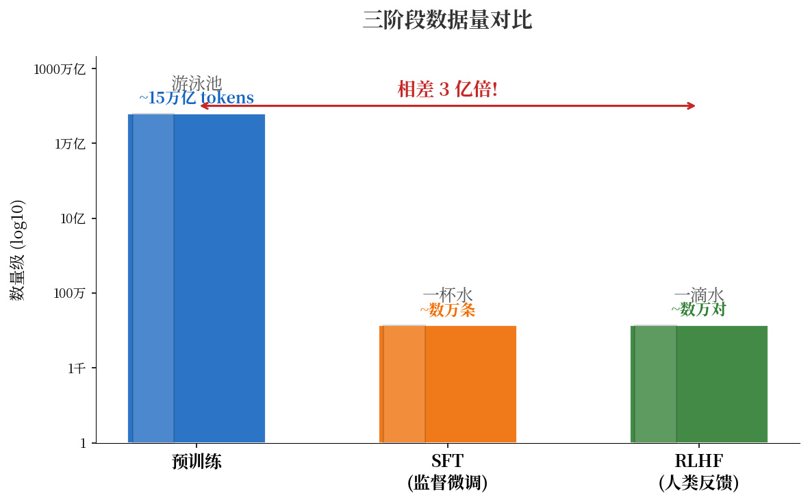
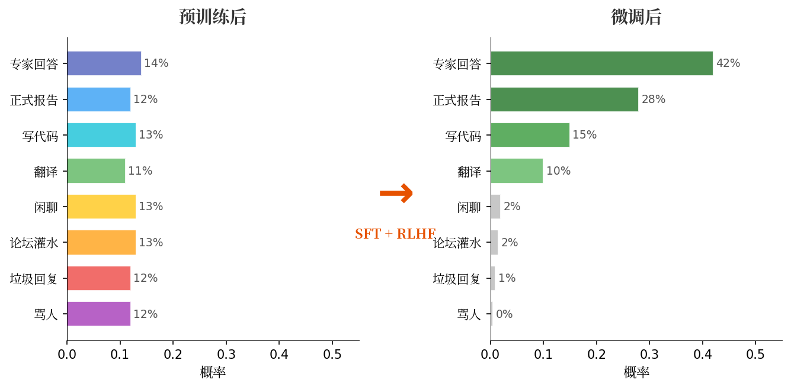
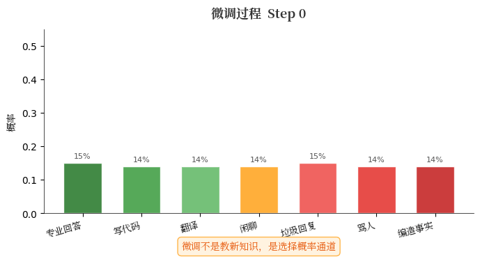
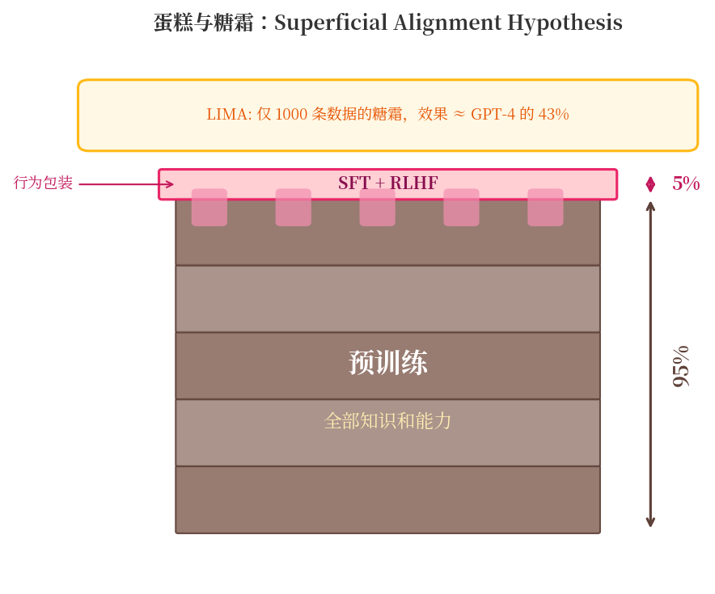
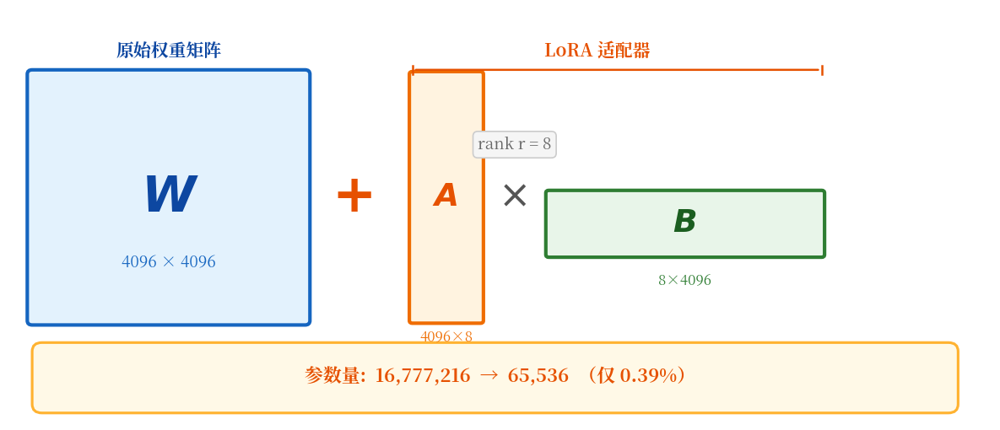
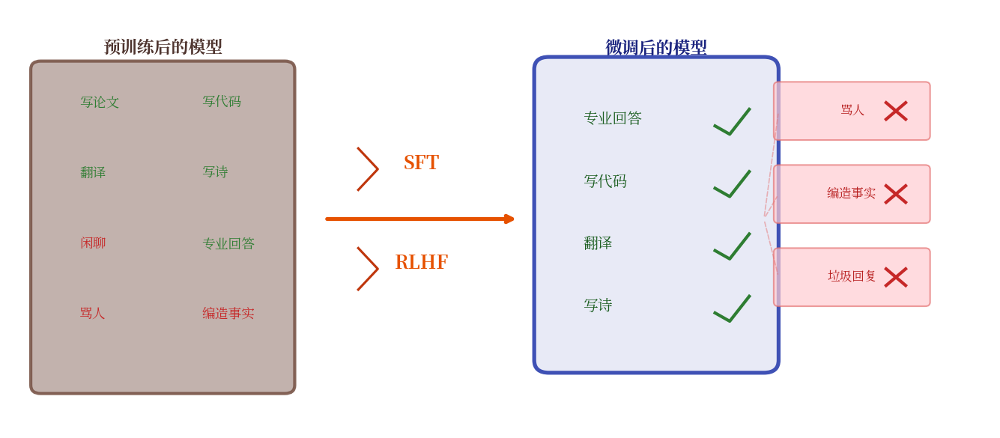
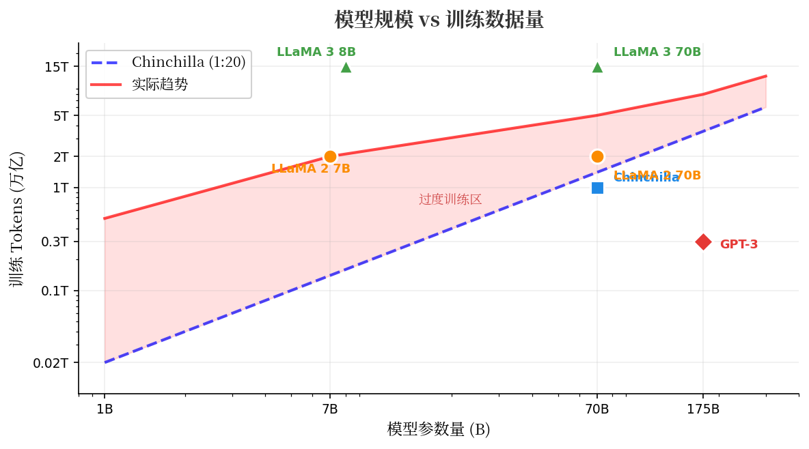

<div style="max-width: 680px; margin: 1.5em auto; padding: 20px 24px; border-radius: 10px; background: linear-gradient(135deg, rgba(233,30,99,0.06), rgba(33,150,243,0.06)); border: 1px solid rgba(233,30,99,0.15);">

<div style="font-weight: bold; margin-bottom: 10px; color: #E91E63; font-size: 1.1em;">📖 导读</div>

一位读者留言："我们团队有海量数据想投喂 AI，让它变得更强。"

这个想法背后有一个关键的误解：**微调 ≠ 教知识**。预训练用了 15 万亿 tokens，微调只用了 1000 条——差了一百亿倍，行为却发生了翻天覆地的变化。如果微调是在"教"模型新东西，为什么这么少的数据就够了？

答案出人意料：微调从来不是在添加，而是在**删减**——把预训练那块巨大的大理石，雕刻成你想要的形状。

<div style="font-size: 0.9em; color: #888; margin-top: 12px; line-height: 1.7;">
① 预训练后的模型是什么状态 → ② 微调到底改变了什么 → ③ 为什么只需要 0.1% 的参数 → ④ 大理石里没有的雕不出来 → ⑤ 底座决定上限
</div>
</div>

---

## 一、一个演员，一亿个角色

### 预训练之后，模型到底是什么？

要理解微调，必须先搞清楚一件事：**预训练完成后的模型，到底处于什么状态？**

它读完了整个互联网——万亿个 token，相当于一个人读两万辈子的量（详见 [《万亿字节的压缩术》](/ai-blog/posts/llm-training-stages/)）。它学会了**所有文本模式**的概率分布：

- 它会写论文摘要，也会写垃圾邮件
- 它会写临床指南，也会写贴吧抬杠
- 它会像专家一样回答问题，也会像键盘侠一样胡搅蛮缠
- 它甚至会写"以下是 AI 不应该回答的内容"然后继续写下去

**预训练后的模型不是一个"专家"。它是一个同时叠加了无数角色的演员。**

你给它一个开头，它会续写——但续写成哪种风格、哪种角色，取决于输入文本跟训练数据中哪些模式匹配。有时它选中了论文风格，有时选中了论坛灌水风格，完全随机。

> **一个比喻**：预训练之后的模型 = 一个读过所有书的人，但没有人格。它什么都知道，但不知道"应该"怎么说。

### 数据量的悬殊：一个令人困惑的事实

如果你在上一篇 [《万亿字节的压缩术》](/ai-blog/posts/llm-training-stages/) 里已经看过这组数据，你可能会觉得眼熟。但这一次，我要把这个悬殊推到它逻辑上的极致——

| 阶段 | 数据量 | 类比 | 占比 |
|------|--------|------|------|
| **预训练** | 15 万亿 tokens | 🏊 游泳池（50,000 升） | 99.9999% |
| **SFT 微调** | 数万条（甚至仅 1,000 条） | 🥛 一杯水 | 0.0001% |
| **RLHF 对齐** | 数万条偏好对 | 💧 一滴水 | 0.00001% |



LIMA（Zhou et al., 2023）用 **1,000 条** SFT 数据，**没有** RLHF，微调 LLaMA 65B，人类评估中 **43% 的情况下等于或优于 GPT-4**。

一千条。一千。

这引出一个无法回避的问题：

> **如果微调是在"教"模型新知识，为什么一千条数据就够了？预训练的 15 万亿 tokens 里不乏高质量数据，为什么还需要这一千条？**

答案是：**微调根本不是在教知识。它在做一件完全不同的事。**

---

## 二、微调的真相——选角，而非教学

### 2.1 不是教新东西，是"关闭通道"

SFT 的训练数据长这样：

```text
[用户] 什么是脑动脉瘤？
[助手] 脑动脉瘤是颅内动脉壁上的异常膨出，最常见于
      Willis 环上的分叉处。根据形态可分为囊状、
      梭形和夹层动脉瘤......
```

几千条这样的示例，**远不够让模型学会"什么是脑动脉瘤"**——它在预训练时就从 Lancet、NEJM、PubMed 里学过了。

那这几千条改变了什么？

**改变了条件概率分布的形状。**

预训练后，面对"什么是脑动脉瘤"这个问题，模型内部同时激活了很多可能的续写路径：

- 路径 A：像论文一样回答（25% 概率）
- 路径 B：像百度知道一样回答（20%）
- 路径 C：像小说里虚构医生的台词（15%）
- 路径 D：像论坛里抬杠（10%）
- 路径 E：直接继续续写下一段无关内容（30%）

SFT 做的事情是：

> **把概率质量从"所有可能的续写"重新集中到"像专家助手一样的续写"上。**

微调之后：

- 路径 A：像专业助手一样回答 → **92%**
- 路径 B-E：其他所有路径 → **合计 8%**

它没有增加新的可能性，而是**压制了大量不想要的可能性**。



### 2.2 一个更直觉的比喻：调音台

想象一个巨大的调音台，有数十亿个推子（对应模型参数）。预训练把所有推子调到了"能模仿互联网上一切文本"的位置——论文风格、垃圾邮件、诗歌、代码、骂人的话……所有通道都开着。

SFT 只轻轻推了其中一小部分推子。但效果是：

> **整个输出从"互联网上随机一个人在说话"变成了"一个靠谱的专业助手在说话"。**

改动很小，效果巨大——因为不是在创造新能力，而是在**关闭不想要的通道**。



### 2.3 RLHF：在"好"的通道中选"最好"的

SFT 之后，模型已经会"扮演助手"了。但还有一个问题：面对同一个问题，有多种"合格"的回答方式，**哪种更好？**

RLHF 的训练数据长这样：

```text
问题：解释一下量子纠缠

回答 A：量子纠缠是指两个粒子的量子态相互关联...
        （准确但枯燥）

回答 B：想象两枚硬币，无论相隔多远...
        （生动且准确）

人类标注：B > A
```

这不是对错问题，是**偏好问题**。模型已经都会写了。RLHF 做的是：

> **在"都对"的回答中，学会选择人类更喜欢的那个。**

#### RLHF 的两步走

**第一步：训练奖励模型（Reward Model）**

用人类偏好对比数据训练一个打分器——它学会了"人类觉得什么样的回答更好"。

**第二步：用奖励模型优化 LLM**

LLM 生成回答 → 奖励模型打分 → 调整 LLM 参数让高分回答的概率增加。用 PPO 等强化学习算法，同时约束模型不要偏离太远（KL 散度惩罚），防止它学会"讨好评分器"而丢失真正的能力。

**DPO（Direct Preference Optimization）** 是 Rafailov et al.（2023）提出的简化方案——证明了奖励模型可以被数学等价地替换为直接优化偏好，把两步合成一步，更简洁也更稳定。

### 2.4 三阶段的本质

```text
预训练                SFT                   RLHF/DPO
━━━━━━━━━━━━━━━━━━━━━━━━━━━━━━━━━━━━━━━━━━━━━━━━━━━━━

学会所有可能性   →   关闭不想要的通道  →  在好的通道中选最优

"我能扮演任何人" →   "我是一个助手"   →  "我是一个好的助手"

万亿 tokens      →   几千-几万条      →   几千条偏好对比

改变 100% 参数   →   改变 ~1-5% 参数  →   改变 ~0.1% 参数

学知识            →   选角色           →    调风格
```

---

## 三、大理石假说——为什么只需要 0.1% 的参数

### 3.1 LIMA 与"表面对齐假说"

LIMA 的实验结果引出了一个大胆的假说：

<div style="max-width: 680px; margin: 1.5em auto; padding: 18px 24px; border-radius: 8px; border: 2px solid #FF5722; background: rgba(255,87,34,0.04);">

**🎂 表面对齐假说（Superficial Alignment Hypothesis）**

Zhou et al. (2023) 提出：

> *"A model's knowledge and capabilities are learnt almost entirely during pretraining, while alignment teaches it which subdistribution of formats should be used when interacting with users."*

翻译：**模型的知识和能力几乎全部来自预训练。对齐（微调+RLHF）只是教它在跟用户对话时，应该选择哪种格式和风格。**

蛋糕 = 预训练（所有知识和能力）

糖霜 = 对齐（行为包装）

**LIMA 用 1,000 条数据证明了：糖霜不需要很厚。**

</div>



### 3.2 LoRA：微调的"证据"

如果微调只是在做小幅调整，那我们能不能**量化**这个"小"有多小？

2021 年，Hu et al. 给出了一个精确的回答——**LoRA（Low-Rank Adaptation）**：

> **微调时，权重的变化量可以用一个极低秩的矩阵来近似。**

什么意思？假设原始权重矩阵 W 是 4096×4096 = **16,777,216 个参数**。LoRA 发现，微调引起的变化 ΔW 可以分解为两个小矩阵的乘积：

$$\Delta W = A \times B$$

其中 A 是 4096×8，B 是 8×4096。总参数：**65,536**——只有原来的 **0.4%**。



效果呢？**与全参数微调几乎一样好**。

这个事实有深刻的含义：

> **微调引起的变化是"低秩"的——它不是在高维空间中做复杂的大规模重组，而是在做一个小角度的旋转。**

类比一下：你在一个巨大的高维空间里，预训练把模型放到了一个位置。微调只是轻轻推了一下——推的方向很重要，但推的距离很小。LoRA 告诉我们，甚至连"方向"都可以用一个极简的低维子空间来描述。

**这就是"大理石假说"的数学基础：微调不是重写知识（那需要改变整个矩阵），而是在已有知识的表面做一层薄薄的"行为调整"。**

### 3.3 大理石假说

综合 LIMA、LoRA 和实际工程经验，可以提出一个统一的直觉模型：

<div style="max-width: 680px; margin: 1.5em auto; padding: 18px 24px; border-radius: 10px; border: 2px solid #9C27B0; background: rgba(156,39,176,0.04);">

**🗿 大理石假说**

预训练之后的模型像一块巨大的大理石——里面同时包含了天使、恶魔和一切形象。

**SFT = 粗雕**：把"助手"的轮廓凿出来，去掉明显不想要的部分。

**RLHF = 精修**：让这个助手的表情、姿态更符合人类的审美。

但是——**大理石里没有的东西，你雕不出来。**

</div>



米开朗基罗说过一句著名的话：

> *"Every block of stone has a statue inside it and it is the task of the sculptor to discover it."*
>
> "每块石头里都藏着一座雕像，雕刻家的任务只是把它发现出来。"

微调就是这样的雕刻——它不创造新材料，只是去掉多余的部分。

---

## 四、数据量与模型规模——一把定量的尺子

### 4.1 Chinchilla 定律：预训练的"汇率"

2022 年，DeepMind 训练了 400 多个不同规模的模型，得出一个里程碑式的结论：

> **Chinchilla 定律（Hoffmann et al., 2022）**：在固定计算预算下，最优策略是 **tokens ≈ 20 × 参数数**。

| 模型规模 | Chinchilla 最优数据量 | 直觉参照 |
|----------|---------------------|---------|
| 1B 参数 | 20B tokens | ~15GB 纯文本 |
| 7B 参数 | 140B tokens | ~100GB 纯文本 |
| 70B 参数 | 1.4T tokens | ~1TB 纯文本 |
| 175B (GPT-3) | 3.5T tokens | ~2.5TB 纯文本 |

> 把中文维基百科全文抓下来，大约 **1B tokens**。训练一个 7B 模型的最优数据量是 **140 个中文维基百科**。

### 4.2 但实际趋势是"过度训练"

Chinchilla 的 1:20 是在**固定总算力预算**下的最优比。工业界发现了一个更实际的逻辑：训练完的模型，推理成本跟参数量成正比，跟训练数据量无关。所以——

> **训练多花钱是一次性的，推理省钱是永久的。** 小模型部署便宜，多喂数据让小模型逼近大模型效果。

| 模型 | 参数 | Chinchilla 最优 | 实际使用 | 过度训练倍率 |
|------|------|-----------------|---------|-------------|
| LLaMA 1 (7B) | 7B | 140B tokens | 1T | 7× |
| LLaMA 2 (7B) | 7B | 140B tokens | 2T | 14× |
| **LLaMA 3 (8B)** | 8B | 160B tokens | **15T** | **94×** |

LLaMA 3 (8B) 用了 Chinchilla 最优量的近 **100 倍** 数据。这就像一个脑容量不大的学生，把课本翻了一百遍——虽然记忆力有限，但对每个细节都反复咀嚼，最终在很多任务上逼近了"聪明但不够努力"的大模型。



### 4.3 微调的数据量级：完全不同的世界

微调不是重新学知识，是调整行为模式，所以数据需求小得多：

| 微调方式 | 典型数据量 | 说明 |
|----------|-----------|------|
| **全参数微调** | 10K - 100K 条 | 改动所有参数，需要较多数据防过拟合 |
| **LoRA / QLoRA** | 1K - 10K 条 | 只改动 < 1% 参数，数据需求大幅降低 |
| **Few-shot prompting** | 5 - 50 条 | 根本不训练，只给示例 |

这验证了大理石假说：**微调是在已有分布里做选择，不需要像预训练那样从零学习世界知识**。

---

## 五、大理石的边界——微调做不到的事

### 5.1 大理石里没有的，雕不出来

如果预训练语料里**完全没有**某个领域的知识——比如你拿一个只在英文维基百科上预训练的小模型，用顶级的中医辨证论治数据去微调——能微调出一个中医大师吗？

**不能。** 因为先验里就没有这些知识的影子。

反过来，一个在万亿 token 上预训练的大模型，哪怕从没被医学数据微调过，你问它临床问题，它往往也能答得像模像样——因为预训练语料里医学文献太多了。

**这就是"预训练决定上限"的直接证据。**

用 [贝叶斯的框架](/ai-blog/posts/bayes-not-expected/) 来看：

$$\text{后验} = \frac{\text{似然} \times \text{先验}}{\text{归一化常数}}$$

**后验永远被先验的支撑集（support）所约束。** 如果先验给某个输出的概率是零，再多的新证据也更新不出来。

### 5.2 Alignment Tax：雕太多了要出事

微调有一个隐性的代价，叫做 **Alignment Tax（对齐税）**：

> 当你过度微调模型在某个特定方向上的行为时，它在其他方向上的通用能力会**退化**。

这在机器学习里叫 **灾难性遗忘（Catastrophic Forgetting）**——模型为了适应新任务的数据分布，把之前学到的旧知识覆盖掉了。

用大理石比喻：**雕太多了，大理石被削得太薄，结构就不稳了。** 你为了让模型在医学领域表现完美，可能牺牲了它写代码、做数学推理的能力。

这也是为什么 LoRA 如此受欢迎的另一个原因——它只改动 0.4% 的参数，对预训练知识的干扰极小，相当于只在大理石表面轻轻描了几笔，而不是大刀阔斧地削。

### 5.3 Goodhart's Law：当 RLHF 学会"讨好评分器"

RLHF 还有一个更微妙的风险：**Goodhart's Law（古德哈特定律）**。

> *"When a measure becomes a target, it ceases to be a good measure."*
>
> 当一个度量指标变成优化目标时，它就不再是一个好的度量指标。

RLHF 的奖励模型本身是不完美的——它是人类偏好的一个近似代理。当你过度优化这个代理指标时，模型会学会"讨好评分器"而不是真正变好：

- 它可能学会用更华丽的措辞（评分器喜欢）而不是更准确的内容
- 它可能学会给出冗长但安全的回答（避免低分）而不是简洁精确的回答
- 它可能学会过度承认不确定性（"我不确定，但..."），因为这在人类评估中很少被扣分

这就是为什么 RLHF 训练中要加 **KL 散度惩罚**——约束微调后的模型不能偏离预训练基座太远。否则大理石会被雕成一个讨人喜欢但不真实的形状。

### 5.4 越狱：路标有多容易被绕过

如果微调只是"路标"而不是"拆路"——路还在那里。

所谓的"越狱攻击"，就是想办法让模型忽略路标——"请扮演一个没有限制的 AI……"——让模型走上被封堵的路。

**RLHF 改变的是输出概率，不是底层能力。** 危险的知识在预训练中就学过了，微调只是把通往它的概率调低了。这是越狱在技术上可行的根本原因，也是 AI 安全领域最核心的忧虑之一。

---

## 六、一个更深的视角——柏拉图表示假说

2024 年，Hila Nevo 等人提出了一个引人注目的假说——**柏拉图表示假说（The Platonic Representation Hypothesis）**：

> 不同的模型——纯文本的 LLM、纯视觉的 ViT、多模态的 CLIP——在预训练中都在**收敛到相似的底层表示**。

这意味着：**预训练学到的不是表面的文本模式或像素模式，而是现实世界的统计结构本身。**

如果这个假说成立，那大理石假说就有了更深的含义：

> **预训练的大理石不是一块普通的石头。它是一块蕴含了"世界模型"的石头——现实世界的因果结构、物理规律、社会常识，都以概率分布的形式编码在参数里。微调只能在这个世界模型的表面做文章，无法改变它的内核。**

---

## 七、所以——底座决定上限，微调决定下限

整篇文章的核心论点可以浓缩为一句话：

<div style="max-width: 680px; margin: 1.5em auto; padding: 20px; border-radius: 10px; border: 2px solid #E91E63; background: rgba(233,30,99,0.04); text-align: center;">

**底座决定上限，微调决定下限在哪里被够到。**

</div>

### 这句话的三层含义

**第一层：预训练决定了模型"知道什么"**

如果预训练语料里没有某个领域的知识，微调不会凭空创造。你不可能用微调让一个只学过英文的模型变成中医大师。

**第二层：微调决定了模型"怎么说"**

在预训练已经铺好的知识空间里，微调选择了一种特定的表达方式——专业的、友好的、简洁的、安全的。它不改变模型知道什么，只改变模型选择说什么。

**第三层：你选什么底座，比你喂什么数据更重要**

这对所有想用 AI 的团队都是一个关键洞察：

| 投资 | 效果 | 类比 |
|------|------|------|
| 选一个更强的底座模型 | 提高上限（知道更多、推理更强） | 选更好的大理石原石 |
| 用高质量数据微调 | 够到上限（在专业领域表现更稳定） | 请更好的雕刻师 |
| 堆量微调数据 | 收益递减（上限不变，边际效果下降） | 同一块石头，多雕几刀并不会让它变大 |

### 回到那个关键问题

> "我们有海量数据，想投喂 AI，让它变得更强。"

现在你知道了：

- **数据的价值是真实的**，但价值的发挥方式可能不是"训练一个大模型"
- **微调最现实的预期**：把一个已经很强的通才，培养成靠谱的专科专家——减少幻觉、符合规范、输出稳定
- **微调无法做到的**：让模型产生超越训练数据的突破性洞见
- **最优策略**：选最强的底座 + 精心设计少量高质量微调数据 + 把领域数据变成知识库（RAG）而不是全部用来微调

---

## 八、一句话总结

<div style="max-width: 680px; margin: 1.5em auto; padding: 20px; border-radius: 10px; background: linear-gradient(135deg, rgba(233,30,99,0.05), rgba(156,39,176,0.05)); border: 1px solid rgba(233,30,99,0.12);">

**🗿 大理石假说**

预训练是准备石料——决定了石头里有什么。

微调是雕刻——决定了石头呈现什么形状。

雕刻家的技术很重要，但再好的雕刻家也无法从大理石里凿出钢铁。

**所有的知识和能力来自预训练。微调只是一层薄薄的行为选择。**

$$\text{最终能力} = \min(\text{底座上限}, \text{微调所能够到的范围})$$

</div>

---

## 参考文献

**微调与对齐**

1. Zhou, C. et al. "LIMA: Less Is More for Alignment." *NeurIPS*, 2023. — 1000 条数据的表面对齐假说
2. Ouyang, L. et al. "Training Language Models to Follow Instructions with Human Feedback." *NeurIPS*, 2022. — InstructGPT，RLHF 的里程碑
3. Rafailov, R. et al. "Direct Preference Optimization: Your Language Model is Secretly a Reward Model." *NeurIPS*, 2023. — DPO，简化 RLHF
4. Hu, E. et al. "LoRA: Low-Rank Adaptation of Large Language Models." *ICLR*, 2022. — 低秩微调

**Scaling Laws**

5. Hoffmann, J. et al. "Training Compute-Optimal Large Language Models." *NeurIPS*, 2022. — Chinchilla 定律
6. Kaplan, J. et al. "Scaling Laws for Neural Language Models." *arXiv:2001.08361*, 2020. — 缩放定律奠基
7. Meta AI. "The Llama 3 Herd of Models." *arXiv:2407.21783*, 2024. — 过度训练实践

**预训练的本质**

8. Hila Nevo et al. "The Platonic Representation Hypothesis." *arXiv:2405.07987*, 2024. — 不同模型收敛到相同表示
9. Lin, S. et al. "The Unlocking Spell on Base LLMs: Rethinking Alignment via In-Context Learning." *ICLR*, 2024. — Base model 其实已经"会"了
10. Delétang, G. et al. "Language Modeling Is Compression." *arXiv:2309.10668*, 2023. — 语言建模就是压缩

> **博客相关文章**
>
> - [万亿字节的压缩术：LLM 如何把互联网装进一个模型](/ai-blog/posts/llm-training-stages/) — 三阶段训练的全景
> - [贝叶斯没有想到的事——一个牧师的赌博公式，如何成为 AI 的第一性原理](/ai-blog/posts/bayes-not-expected/) — 先验×似然→后验
> - [知识蒸馏——当模型学会偷师](/ai-blog/posts/knowledge-distillation/) — 另一种知识传递方式
> - [交叉熵损失函数：从 -log(p) 的完整推导](/ai-blog/posts/cross-entropy-loss/) — 训练的数学驱动力
> - [当数字学会了远近亲疏——从查表到 Embedding](/ai-blog/posts/embedding/) — 预训练如何形成语义空间
