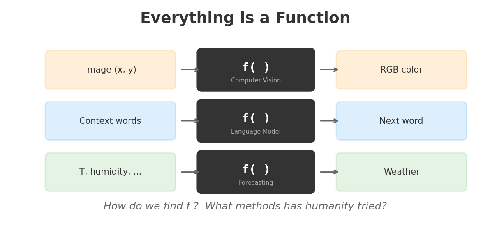
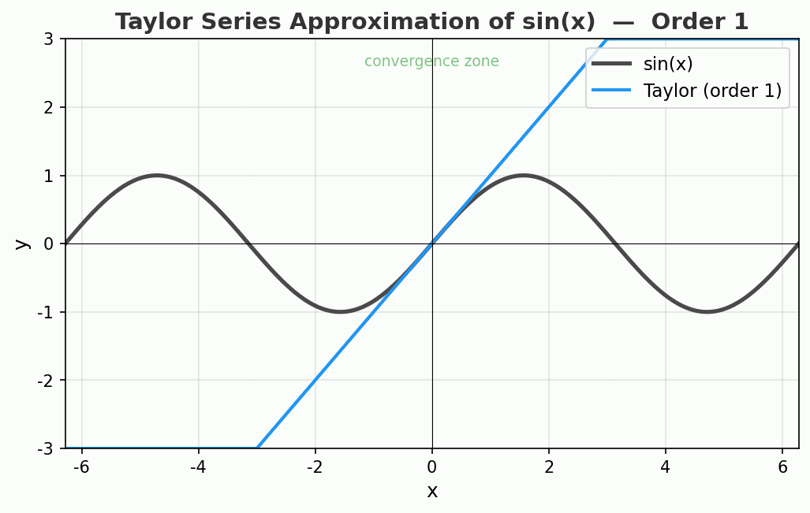
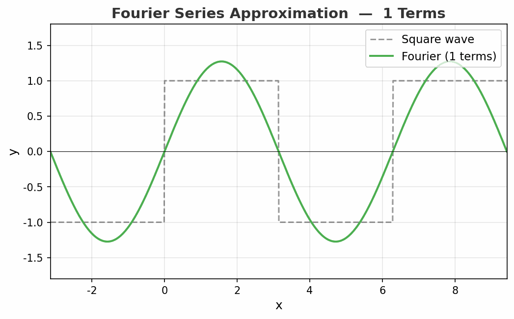
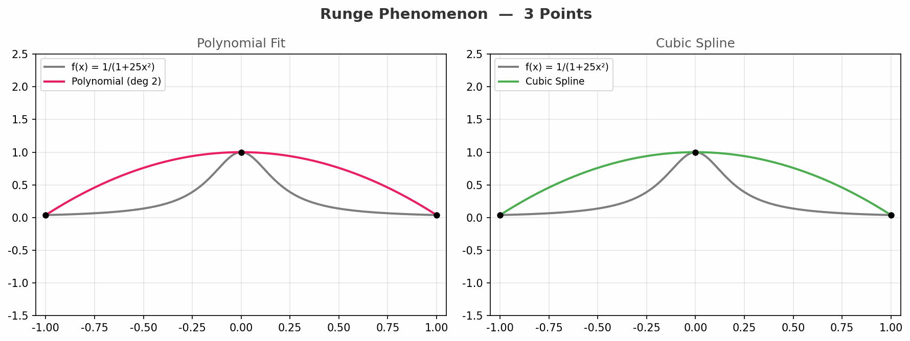
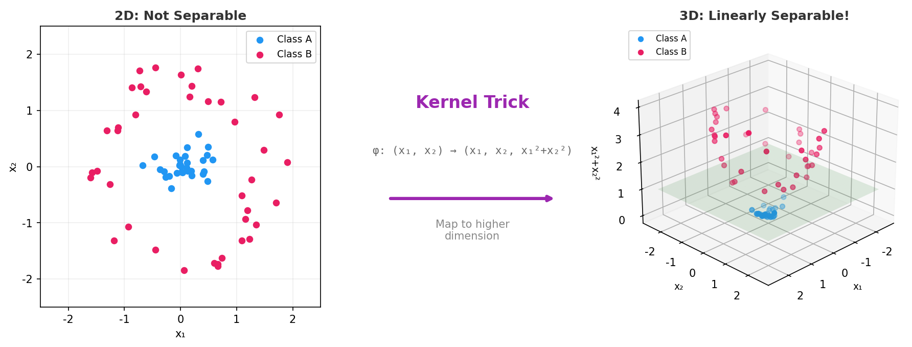
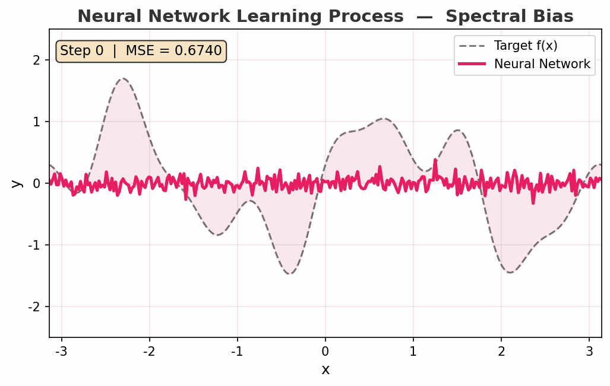
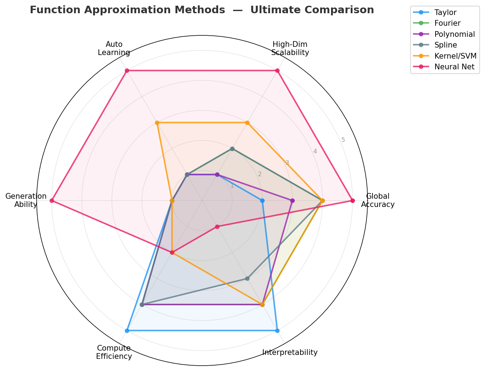

<div style="max-width: 680px; margin: 1.5em auto; padding: 20px 24px; border-radius: 10px; background: linear-gradient(135deg, rgba(233,30,99,0.06), rgba(33,150,243,0.06)); border: 1px solid rgba(233,30,99,0.15);">

<div style="font-weight: bold; margin-bottom: 10px; color: #E91E63; font-size: 1.1em;">📖 导读</div>

这不是一篇"什么是神经网络"的科普。

这篇文章要回答的问题是：**数学世界里有那么多精妙的工具，凭什么偏偏选了神经网络来做 AI？**

我们将检阅人类 400 年来发明的函数拟合方法——泰勒级数、傅里叶级数、多项式插值、样条曲线、核方法——像一场淘汰赛一样，逐一看清它们的优势与致命缺陷。最后你会发现：**不是人类"选择"了神经网络，而是只有神经网络满足所有条件。**

灵感来源：Emergent Garden 的精彩视频 [*Watching Neural Networks Learn*](https://www.youtube.com/watch?v=TkwXa7Cvfr8)。

<div style="font-size: 0.9em; color: #888; margin-top: 12px; line-height: 1.7;">
① 万物皆是函数 → ② 泰勒级数 → ③ 傅里叶级数 → ④ 多项式与样条 → ⑤ 核方法与 SVM → ⑥ 神经网络 → ⑦ 终极对比
</div>

</div>

---

## 第一章：万物皆是函数 🎨

你拍一张照片，手机里发生了什么？

**每个像素**接收一个坐标 (x, y)，输出一个颜色 (R, G, B)。这就是一个函数：

> f(x, y) → (R, G, B)

你问 ChatGPT 一个问题，它做了什么？

**接收一串文字**（上文），输出下一个最可能的词。这也是一个函数：

> f("今天天气") → "很好"

天气预报、股票预测、医学诊断、自动驾驶——**所有这些任务，本质上都是在求解一个函数**。



问题来了：**这个函数 f，我们不知道它长什么样。**

我们只有一堆输入-输出的样本（数据），需要找到一个函数来"拟合"这些数据——让它在没见过的输入上也能给出合理的输出。

**这就是函数拟合问题。人类为此探索了 400 年。**

<div style="max-width: 660px; margin: 1.5em auto; padding: 16px 20px; border-radius: 8px; background: rgba(255,152,0,0.06); border: 1px solid rgba(255,152,0,0.2);">

**关键设问：** 400 年来，数学家发明了各种精妙的方法来逼近未知函数。泰勒、傅里叶、拉格朗日、贝塞尔、SVM&hellip;&hellip;每一种都在自己的领域里璀璨夺目。但当我们需要一个"通用学习机器"时，为什么最终胜出的是神经网络？

让我们一个一个来看。

</div>

---

## 第二章：泰勒级数——局部的完美主义者 🔵

### 1715 年的天才想法

布鲁克·泰勒（Brook Taylor）在 1715 年提出了一个优美的想法：

> **在一个点附近，任何"光滑"的函数都可以用多项式来逼近。**

公式长这样：

<div style="max-width: 660px; margin: 1em auto; padding: 15px 20px; border-radius: 8px; background: rgba(33,150,243,0.06); border: 1px solid rgba(33,150,243,0.15); text-align: center; font-size: 1.05em;">

f(x) &asymp; f(a) + f&prime;(a)(x&minus;a) + f&Prime;(a)(x&minus;a)&sup2;/2! + f&prime;&prime;&prime;(a)(x&minus;a)&sup3;/3! + &hellip;

</div>

直觉翻译：**站在点 a 上，用这个点的函数值、斜率、曲率&hellip;&hellip;一层层叠加，像搭积木一样拼出函数的形状。**

阶数越高，逼近越精确——至少在 a 附近是这样。

### 看看效果



动图展示了 sin(x) 的泰勒展开从 1 阶到 15 阶的过程。注意看：

- **绿色区域**（收敛区）里，逼近精度惊人
- **离开中心点越远**，曲线开始疯狂偏离
- 15 阶时，中心附近已经完美重合，但两端飞到了天上

### 泰勒的成绩单

<div style="max-width: 660px; margin: 1.5em auto; padding: 16px 20px; border-radius: 8px; background: rgba(33,150,243,0.06); border: 1px solid rgba(33,150,243,0.15);">

✅ **优点：**
- 数学优美，推导简洁
- 在展开点附近精度极高
- 物理学的核心工具（力学、电磁学、量子力学处处用到）
- 可以用有限的导数信息重建函数

❌ **致命缺陷：**
- **收敛半径有限**——离开展开点就崩溃
- **全局拟合无能为力**——想逼近一个定义在整个实数轴上的函数？没门
- **高维扩展困难**——二维的泰勒展开已经很复杂，万维？不可能

</div>

泰勒级数是"局部思维"的极致。它像一个显微镜——在一个点上看得无比清晰，但视野极其有限。

**对 LLM 来说**：语言模型需要理解万亿维度的全局规律，而泰勒只能看一个点的邻域。第一个选手，淘汰。

---

## 第三章：傅里叶级数——频率的魔法师 🟢

### 1807 年的革命

约瑟夫·傅里叶（Joseph Fourier）在研究热传导时，发现了一个惊人的事实：

> **任何周期函数，都可以写成正弦波和余弦波的叠加。**

这听起来不可思议——**一个锯齿形的方波，竟然能用光滑的正弦波拼出来？**

能！只要你愿意叠加足够多的波。

### 与泰勒的本质区别

泰勒在一个"点"附近展开，傅里叶在"全局"用波去拼。这是两种完全不同的哲学：

```text
泰勒：站在一个点，向外扩张      → 局部 → 全局（常常失败）
傅里叶：用全局的波，拼出细节    → 全局 → 局部（通过高频）
```

### 看看效果



动图展示了方波的傅里叶逼近从 1 项到 50 项的过程。注意看：

- 随着项数增加，整体形状越来越接近方波
- **但在跳变点处，总有一个约 9% 的过冲永远消不掉**——这就是著名的**吉布斯现象（Gibbs Phenomenon）**
- 即使用无穷多项，跳变点的过冲也不会消失！

### 傅里叶的成绩单

<div style="max-width: 660px; margin: 1.5em auto; padding: 16px 20px; border-radius: 8px; background: rgba(76,175,80,0.06); border: 1px solid rgba(76,175,80,0.15);">

✅ **优点：**
- **全局逼近**——不像泰勒那样局限于一个点
- 信号处理的基石——MP3、JPEG、5G 通信、MRI 成像全靠它
- 数学理论完备（Parseval 定理、卷积定理）
- 快速算法（FFT）使大规模计算成为可能

❌ **致命缺陷：**
- **吉布斯现象**——对不连续函数永远有过冲
- **高维失效**——从 1D 到 1000D，需要的基函数数量指数爆炸
- **不能自动学习**——基函数（sin/cos）是固定的，参数需要解析计算
- **非周期信号需要拓展处理**（DFT/STFT/小波）

</div>

### 一个来自视频的关键洞察：频谱偏差

Emergent Garden 的视频中展示了一个有趣现象：**神经网络在学习目标函数时，总是先学会低频成分，再慢慢学习高频细节。** 这被称为"频谱偏差（Spectral Bias）"。

这恰好说明了傅里叶视角的价值——即使在神经网络内部，频率依然是理解学习过程的关键语言。傅里叶没有赢得比赛，但它的思想渗透在了赢家的每一步训练中。

**对 LLM 来说**：语言不是周期信号，文本的"维度"是词汇表大小（数万到十万维），傅里叶的基函数数量会爆炸。第二个选手，淘汰。

---

## 第四章：多项式与样条——曲线的裁缝 🟣

### 多项式插值：精确但危险

拉格朗日（Lagrange）证明了一个优美的定理：

> **n 个数据点，恰好能唯一确定一个 n&minus;1 次多项式通过所有点。**

这听起来完美——有多少数据就用多高的多项式，精确通过每一个点。但问题来了&hellip;&hellip;

### 龙格现象：多项式的噩梦

1901 年，卡尔·龙格（Carl Runge）用一个简单的函数 f(x) = 1/(1+25x&sup2;) 击碎了高阶多项式的美梦：

> **当插值点数增加时，多项式在边缘处疯狂振荡，误差不减反增！**



动图从 3 个点到 21 个点，对比两种方法：

- **左图（多项式）**：随着点数增加，边缘振荡越来越剧烈，完全失控
- **右图（样条）**：始终平稳地贴合原函数，没有失控

### 样条的智慧：分而治之

样条曲线（Spline）的思路极其朴素：

> **别用一条高阶多项式通吃，把曲线切成小段，每段用低阶多项式（通常是三次），接合处保证光滑。**

这就像一个好裁缝——不用一整块布裁出衣服，而是分片裁剪再缝合。每一片都简单可控，缝合处平滑自然。

贝塞尔曲线（Bézier Curve）是样条思想的明星应用：
- **Photoshop** 的钢笔工具
- **字体设计**（TrueType/OpenType 字体的每个字母）
- **工业设计**（汽车曲面、飞机机翼）
- **动画**（运动路径插值）

### 多项式与样条的成绩单

<div style="max-width: 660px; margin: 1.5em auto; padding: 16px 20px; border-radius: 8px; background: rgba(156,39,176,0.06); border: 1px solid rgba(156,39,176,0.15);">

✅ **优点：**
- 样条拟合稳定，没有龙格现象
- 在 2D/3D 曲线拟合中无可替代
- 计算高效，理论成熟
- 工业设计和计算机图形学的基石

❌ **致命缺陷：**
- **维度诅咒**——从 2D 到 1000D，需要的控制点数量指数爆炸
  - 2D 曲面：100&times;100 = 10,000 个控制点
  - 100D：100&sup1;&sup0;&sup0; = 10&sup2;&sup0;&sup0; 个控制点——比宇宙原子数还多
- **不能自动学习**——控制点位置需要人工指定或预设
- **不能做生成**——它只能内插，不能创造新数据

</div>

**对 LLM 来说**：GPT-4 的输入空间是 128,000 个 token &times; 100,000 词汇 = 天文数字维度。样条在这个维度下需要的参数量超出宇宙能承载的范围。第三个选手，淘汰。

---

## 第五章：核方法与 SVM——高维的魔术 🔘

### 核技巧：天才的迂回

到了 1990 年代，机器学习的明星是支持向量机（SVM）。它的核心思想极其巧妙：

> **在原始空间中无法线性分类的数据，映射到更高维的空间后，可能就能用一个平面一刀切开。**

举个例子：



- **左图**：二维平面上，两类数据（蓝色和粉色）套在一起，画不出一条直线分开它们
- **中间**：核技巧把 (x₁, x₂) 映射到 (x₁, x₂, x₁²+x₂²)，加了一个维度
- **右图**：在三维空间中，两类数据被一个平面（绿色）干净利落地分开了

这就是"核技巧（Kernel Trick）"——用数学上的映射代替真正的高维计算，优雅而高效。

### SVM 的黄金时代

在 2000 年代，SVM 统治了机器学习竞赛。它有严格的数学基础（统计学习理论、VC 维），在手写数字识别、文本分类等任务上表现优异。

### 核方法的成绩单

<div style="max-width: 660px; margin: 1.5em auto; padding: 16px 20px; border-radius: 8px; background: rgba(96,125,139,0.06); border: 1px solid rgba(96,125,139,0.15);">

✅ **优点：**
- 理论优雅，有坚实的数学保障（最大间隔、泛化边界）
- 小数据上表现好，不容易过拟合
- 可解释性强（支持向量就是决策依据）
- 核技巧避免了真正的高维计算

❌ **致命缺陷：**
- **计算复杂度 O(n&sup2;)~O(n&sup3;)**——数据量超过十万就崩溃
- **不能做"生成"**——SVM 只能分类和回归，不能输出一段话、一张图
- **不能端到端学习特征**——需要人工设计特征（特征工程），模型本身不学特征
- **不能增量学习**——新数据来了要重新训练全部

</div>

### 关键对比：分类 vs 生成

这是核方法被淘汰的最根本原因——**LLM 需要的是生成，不是分类。**

```text
SVM 做的事：    输入一封邮件  → 输出一个标签（垃圾/非垃圾）
LLM 做的事：    输入一段话    → 输出下一段话（创造新内容）
```

分类是从有限选项中选一个。生成是在无穷可能中创造一个。

SVM 是一个优秀的裁判，但它不会写诗。

**对 LLM 来说**：训练数据是数万亿 token，SVM 的 O(n³) 复杂度让它连启动都做不到。更根本的是，SVM 不能生成。第四个选手，淘汰。

---

## 第六章：神经网络——为什么是它？ 💗

四个选手全部淘汰。现在我们来看最后一个——**神经网络**。

### 万能逼近定理：理论底气

1989 年，Cybenko 和 Hornik 分别证明了：

> **只要一个隐藏层足够宽，带非线性激活函数的前馈神经网络可以逼近任何连续函数。**

这就是**万能逼近定理（Universal Approximation Theorem）**。它给了神经网络一张理论"入场券"——任何你想拟合的函数，原则上它都能拟合。

（详细解读见：[为什么矩阵和激活函数就能涌现智能？](/ai-blog/posts/universal-approximation/)）

但这还不够。泰勒级数也能逼近任何光滑函数——理论上可以，实际上做不到。神经网络凭什么不一样？

### 看看神经网络怎么学的



动图展示了一个神经网络从随机初始化到拟合复杂函数的过程：

- **Step 0**：一条杂乱的噪声线
- **Step 200**：已经学到了函数的"大致走向"（低频成分）
- **Step 2000**：开始捕获高频细节
- **Step 5000**：几乎完美重合

注意 **频谱偏差（Spectral Bias）**：网络先学低频、再学高频。这不是缺点——这是一种**隐式正则化**，帮助模型避免过拟合，先抓本质规律再抓细节。

### 五个独一无二的优势

为什么前面四个选手做不到的事，神经网络做到了？因为它同时具备了五个关键特性：

<div style="max-width: 660px; margin: 1.5em auto; padding: 20px 24px; border-radius: 8px; background: rgba(233,30,99,0.06); border: 1px solid rgba(233,30,99,0.15);">

**❶ 可扩展性（Scalability）**

参数量可以从 4,000（microgpt）到 1.8 万亿（GPT-4），性能随规模平滑提升。这就是 **Scaling Laws**——不是"越大越好"的经验主义，而是有数学规律的幂律关系。

其他方法？泰勒加阶数只在局部有用，傅里叶加项数会遇到吉布斯现象，多项式加阶数会遇到龙格现象，SVM 加数据会遇到 O(n³) 的墙。

（详细解读见：[为什么把模型做大就能变聪明？](/ai-blog/posts/why-llm-understand-world/)）

**❷ 自动学习（Automatic Learning）**

泰勒需要你手动算导数，傅里叶需要你解析计算系数，样条需要你选择控制点，SVM 需要你设计特征。

神经网络？**给它数据和一个损失函数，梯度下降自动找到所有参数。** 不需要人设计基函数，不需要先验知识，不需要手工特征工程。

**❸ 高维友好（High-Dimensional Friendly）**

这是最关键的一点。前面每个方法都被"维度诅咒"击败了。神经网络为什么能绕过？

因为**真实数据不是均匀分布在整个高维空间中的，而是集中在低维流形（manifold）上**。想象一张照片的所有像素值——理论上有 256^(百万) 种组合，但真正有意义的图片只占极小的一部分。

神经网络通过层层变换，自动发现这些低维结构。再加上**参数共享**（卷积网络共享卷积核，Transformer 共享注意力头），参数量远小于"暴力覆盖"全空间所需的量。

（相关分析见：[为什么 AI 离不开线性？](/ai-blog/posts/why-linearity/)）

**❹ 表示学习（Representation Learning）**

泰勒用多项式基，傅里叶用正弦基，SVM 用核函数——这些基函数都是**人类预先选定的**。

神经网络自动学习中间表示（embedding）。一个词被映射到一个高维向量，这个向量捕获了语义、语法、情感等多层信息——**这些"特征"是模型自己发现的，不是人设计的。**

这就是为什么同一个架构能做翻译、写诗、编程、做数学——它能自动学习不同任务需要的表示。

**❺ 生成能力（Generation）**

核方法能分类，不能生成。样条能插值，不能创造。

神经网络可以输出任意复杂的高维结构——一段话（GPT）、一张图（DALL-E）、一段音频（Whisper）、一段视频（Sora）。

> **生成，是从"理解规律"到"应用规律"的跨越。只有神经网络做到了。**

</div>

### 来自视频的关键洞察：激活函数的选择

Emergent Garden 的视频展示了不同激活函数对拟合效果的影响：

**ReLU（修正线性单元）**：最常用的激活函数。它把负数变成零，正数保持不变。结果是**分段线性逼近**——像用折线去拼曲线。简单、高效、计算快，但存在频谱偏差（学高频慢）。

**SIREN（sin 激活）**：Matthew Tancik 等人提出，用正弦函数作为激活函数。效果惊人——平滑地拟合高频细节，连毛发纹理都能捕获。但训练不稳定，需要精心初始化。

**Fourier Features（傅里叶特征）**：在输入端用正弦函数编码坐标，解决 ReLU 的频谱偏差问题。这是一个绝妙的混合——**傅里叶的思想嫁接到了神经网络的框架中**。

看到了吗？**傅里叶级数没有赢得比赛，但它的精髓被神经网络吸收了。** 历史上被淘汰的选手，并没有真正消失——它们的思想活在了冠军的 DNA 里。

---

## 第七章：一张表终结所有比较

现在，让我们把六种方法放在一起做一次终极对比。

### 雷达图总览



一眼就能看到：**神经网络是唯一在高维可扩展性、自动学习、生成能力三个维度上得分为 5 的方法。** 但它的可解释性和计算效率是所有方法中最差的。

### 详细对比表

| 维度 | 泰勒级数 | 傅里叶级数 | 多项式/样条 | 核方法/SVM | 神经网络 |
|:---|:---|:---|:---|:---|:---|
| **诞生年代** | 1715 | 1807 | 1795/1946 | 1992/1995 | 1943/1989 |
| **逼近方式** | 点展开 | 频率叠加 | 点插值/分段 | 核映射 | 层层变换 |
| **全局精度** | ⭐⭐ | ⭐⭐⭐⭐ | ⭐⭐⭐⭐ | ⭐⭐⭐⭐ | ⭐⭐⭐⭐⭐ |
| **高维扩展** | ⭐ | ⭐⭐ | ⭐ | ⭐⭐⭐ | ⭐⭐⭐⭐⭐ |
| **自动学习** | ⭐ | ⭐ | ⭐ | ⭐⭐⭐ | ⭐⭐⭐⭐⭐ |
| **生成能力** | ⭐ | ⭐ | ⭐ | ⭐ | ⭐⭐⭐⭐⭐ |
| **计算效率** | ⭐⭐⭐⭐⭐ | ⭐⭐⭐⭐ | ⭐⭐⭐⭐ | ⭐⭐ | ⭐⭐ |
| **可解释性** | ⭐⭐⭐⭐⭐ | ⭐⭐⭐⭐ | ⭐⭐⭐⭐ | ⭐⭐⭐⭐ | ⭐ |
| **杀手锏** | 局部高精度 | 频域分析 | 曲线设计 | 小样本分类 | 高维生成 |
| **致命伤** | 全局崩溃 | 吉布斯+维度 | 维度诅咒 | O(n³)+不能生成 | 黑盒+耗能 |
| **今日角色** | 物理推导 | 信号处理 | CAD/字体 | 生物信息学 | AI/LLM |

### 没有"最好"，只有"最适合"

**泰勒级数**在物理推导中不可替代——牛顿力学、广义相对论的线性化、量子微扰论，离了它寸步难行。

**傅里叶级数**在信号处理中不可替代——你听的每一首 MP3、看的每一张 JPEG、打的每一通 5G 电话，都在用傅里叶。

**样条曲线**在工业设计中不可替代——你手机屏幕上每一个字母、汽车车身的每一条曲线，都是贝塞尔曲线。

**核方法**在小样本场景中依然强大——基因组分类、蛋白质功能预测，SVM 至今在用。

**但当任务变成"在万亿维空间中，从万亿数据中，学习并生成复杂规律"——只有神经网络满足所有条件。**

<div style="max-width: 660px; margin: 1.5em auto; padding: 20px 24px; border-radius: 8px; background: rgba(233,30,99,0.08); border: 2px solid rgba(233,30,99,0.3);">

**🎯 核心洞察：** LLM 不是"选择"了神经网络——是只有神经网络同时满足了五个条件：可扩展、可学习、高维友好、能表示学习、能生成。这不是选择题，这是淘汰赛。其他方法都在某个维度上碰到了不可逾越的墙。

</div>

---

## 结语：400 年的接力赛

回到 Emergent Garden 的视频标题：***Watching Neural Networks Learn***——看着神经网络学习。

你现在知道了，当你看着那些神经网络逐步拟合目标函数的动画时，你看到的不仅仅是一个算法的运行。

你看到的是：

> **人类 400 年数学探索的最新一章。**

泰勒打下了逼近论的地基，傅里叶发现了频率的语言，拉格朗日和贝塞尔建造了曲线的工具箱，Vapnik 和 Cortes 探索了高维的魔术——每一步都不白走。

神经网络之所以能胜出，不是因为它"更好"，而是因为它站在了所有前人的肩膀上。

**ReLU 里有分段逼近的智慧，Fourier Features 里有傅里叶的回声，Scaling Laws 里有统计学的积累，梯度下降里有微积分的力量。**

没有谁被真正淘汰。他们都活在冠军的 DNA 里。

---

<div style="max-width: 660px; margin: 2em auto; padding: 20px 24px; border-radius: 8px; background: rgba(233,30,99,0.04); border: 1px solid rgba(233,30,99,0.12);">

📚 **延伸阅读**

- [为什么矩阵和激活函数就能涌现智能？——万能近似定理](/ai-blog/posts/universal-approximation/)
- [为什么 AI 离不开线性？——傅里叶分析与维度诅咒](/ai-blog/posts/why-linearity/)
- [为什么把模型做大就能变聪明？——Scaling Laws](/ai-blog/posts/why-llm-understand-world/)

🎬 **灵感来源**

本文灵感来自 Emergent Garden 的精彩视频 [*Watching Neural Networks Learn*](https://www.youtube.com/watch?v=TkwXa7Cvfr8)，强烈推荐观看。

</div>

<div style="text-align: center; color: #999; font-size: 0.85em; margin-top: 30px;">

博客：[https://Jason-Azure.github.io/ai-blog/](https://Jason-Azure.github.io/ai-blog/)

公众号：**AI-lab学习笔记**

</div>
