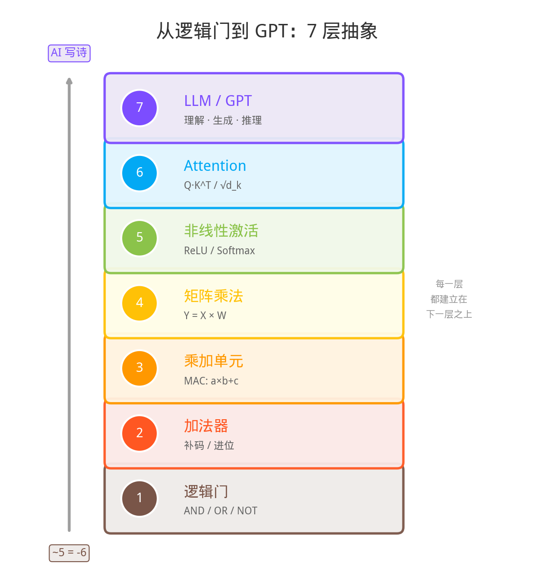
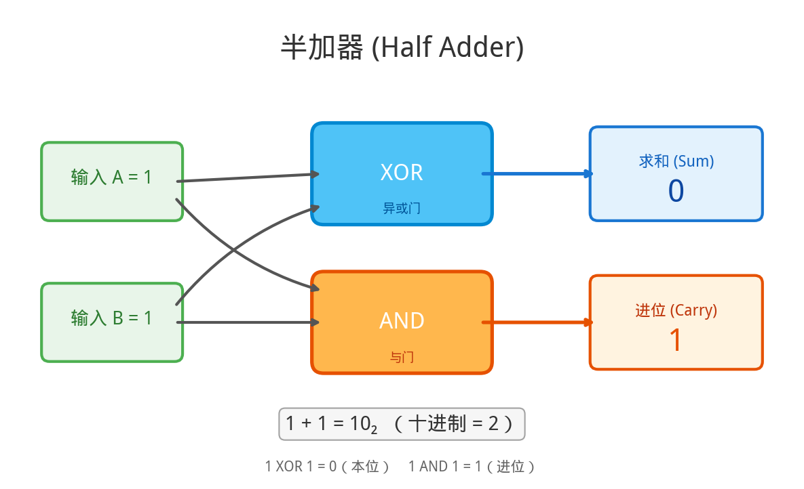
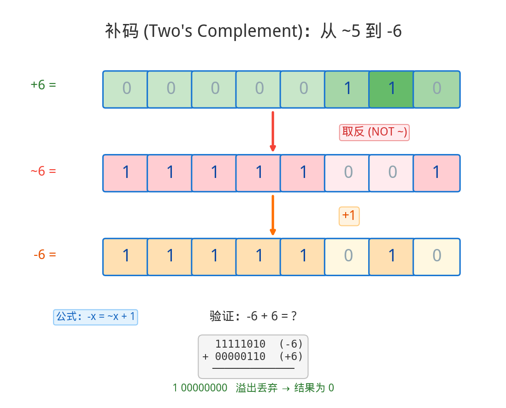
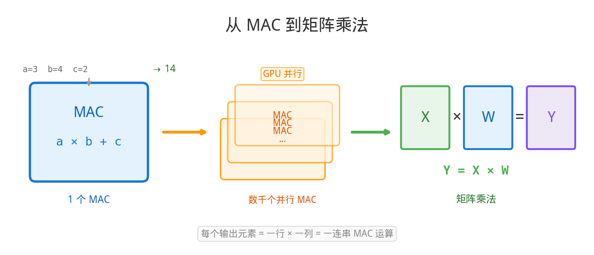
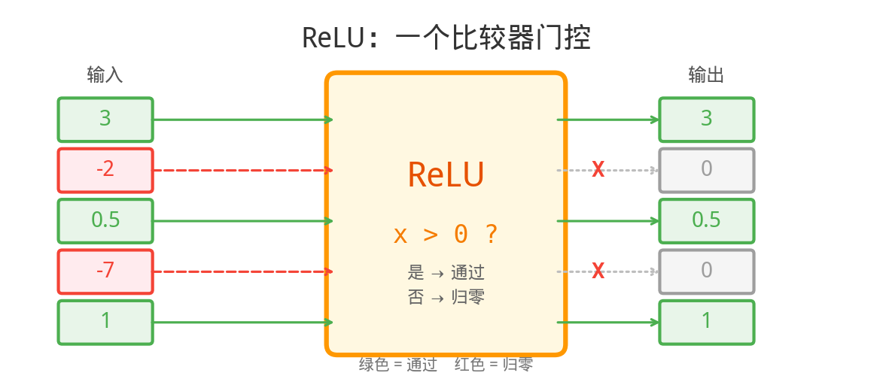
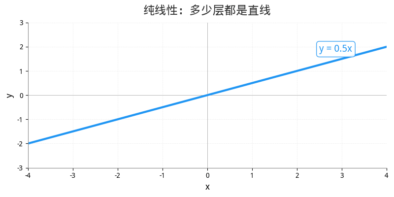
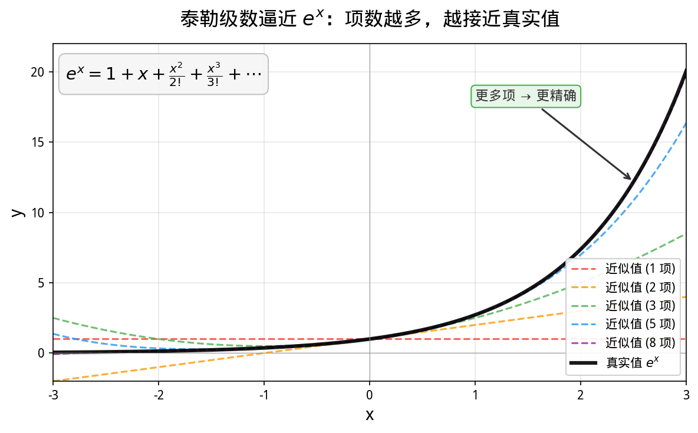

## 引子：一个让人困惑的等号

有一天，有人问我一个 Python 问题：

```python
print(~5)   # 输出：-6
```

**取反一个 5，怎么就变成 -6 了？**

这个问题看似很小，但当我试着解释它的时候，发现自己正在打开一扇通往计算机最底层的门——

从这个 `~5 = -6` 出发，我顺着补码往下走，走到了逻辑门；又顺着逻辑门往上爬，一路爬到了 ChatGPT。

我惊讶地发现：**从一个取反操作到 AI 写诗，中间只隔了 7 层抽象。**

每一层都建立在上一层的基础上，每一层都只做一件简单的事。简单规则的无限堆叠，最终涌现出了智能。

这篇文章，就是这趟旅程的记录。

---

## 7 层全景：从门电路到 GPT

在深入每一层之前，先看一眼全貌：



```text
第 7 层  LLM / GPT           ← AI 写诗
第 6 层  Attention 注意力
第 5 层  非线性激活 (ReLU)
第 4 层  矩阵乘法
第 3 层  乘加单元 (MAC)
第 2 层  加法器 (补码)
第 1 层  逻辑门 AND/OR/NOT    ← ~5 = -6
```

接下来，我们从最底层开始，逐层攀登。

---

## 第一层：逻辑门——计算机只会做三件事

计算机的一切，建立在三个最简单的操作上：

```text
 AND（与）：两个都是 1，才输出 1
  1 AND 1 = 1
  1 AND 0 = 0
  0 AND 1 = 0
  0 AND 0 = 0

 OR（或）：有一个是 1，就输出 1
  1 OR 1 = 1
  1 OR 0 = 1
  0 OR 1 = 1
  0 OR 0 = 0

 NOT（非）：翻转
  NOT 1 = 0
  NOT 0 = 1
```

就这三个。**没有第四个。**

但这三个门可以组合出任何运算。这是 1937 年香农（Claude Shannon）在他的硕士论文中证明的——被称为"有史以来最重要的硕士论文"。

> Shannon, C.E. (1937). *A Symbolic Analysis of Relay and Switching Circuits*. MIT Master's Thesis.

回到我们的问题：`~5 = -6` 中的 `~` 就是 NOT 门——把每一位都翻转。

```text
    5 的二进制：  0 0 0 0 0 1 0 1
    NOT 每一位：  1 1 1 1 1 0 1 0  ← 这是什么数？
```

要回答"这是什么数"，我们需要理解**补码**。而补码的故事，发生在第二层。

<div style="background: rgba(76,175,80,0.08); border-left: 4px solid #4CAF50; padding: 12px 16px; margin: 20px 0; border-radius: 0 6px 6px 0;">

**一句话记住：** 计算机的全部能力，建立在 AND、OR、NOT 三个门上。就像乐高只有几种基础砖块，但可以拼出一切。

</div>

---

## 第二层：加法器——补码让减法消失

### 加法器：用门电路搭出来的计算器

用 AND 和 XOR（异或，可由 AND/OR/NOT 组合而成）两个门，就能造出一个**半加器**：



```text
输入 A=1, B=1

XOR 门 → 求和 = 0    （1⊕1=0，满二进一）
AND 门 → 进位 = 1    （1∧1=1，需要进位）

结果：1 + 1 = 10（二进制）= 2（十进制）  ✓
```

把多个这样的单元串联起来，就是**全加器**——可以算任意位数的加法。

### 补码的天才：把减法变成加法

计算机只有加法器，没有减法器。那怎么算 `5 - 3`？

**答案：不算减法。把 -3 用一种特殊的二进制表示出来，然后做加法。**

这种"特殊表示"就是**补码（Two's Complement）**。



以 -6 为例（8 位）：

```text
第 1 步：写出 +6         0 0 0 0 0 1 1 0
第 2 步：所有位取反       1 1 1 1 1 0 0 1
第 3 步：加 1             1 1 1 1 1 0 1 0  ← -6 的补码
```

验证：-6 + 6 应该等于 0

```text
    1 1 1 1 1 0 1 0     (-6)
  + 0 0 0 0 0 1 1 0     (+6)
  ─────────────────
  1 0 0 0 0 0 0 0 0     9 位，溢出！
    └─丢掉──┘
    0 0 0 0 0 0 0 0     = 0  ✓  完美！
```

**补码让加法器直接算出正确结果，不需要额外判断正负号。** 这就是为什么 `~5`（取反）的结果是 `-6`——取反后的二进制 `11111010`，在补码规则下就代表 -6。

> 补码的灵感来自时钟：现在 3 点，想回到 0 点，往回拨 3 格（-3），**等价于往前拨 9 格**（因为 9+3=12，溢出回到 0）。计算机用同样的"溢出归零"原理。

<div style="background: rgba(76,175,80,0.08); border-left: 4px solid #4CAF50; padding: 12px 16px; margin: 20px 0; border-radius: 0 6px 6px 0;">

**一句话记住：** 补码是计算机的天才设计——让硬件只需要一个加法器，就能搞定加减法。减法不是被"做"出来的，而是被"消除"了。

</div>

---

## 第三层：乘加单元——计算的原子动作

有了加法器，乘法也解决了：**乘法就是反复加法。**

```text
5 × 3 = 5 + 5 + 5 = 15
```

但现代芯片不会真的循环加，它用移位和加法在一个时钟周期内完成。更重要的是，芯片里有一个核心单元叫 **MAC（Multiply-Accumulate，乘加单元）**：

```text
MAC 操作：a × b + c

一次完成"乘一下再加一下"
这就是 AI 计算的原子动作
```



为什么 MAC 如此重要？因为——

```text
神经网络的每一层，做的事情就是：

  输出 = 输入₁×权重₁ + 输入₂×权重₂ + ... + 输入ₙ×权重ₙ

         └─── 一次 MAC ───┘  └─── 一次 MAC ───┘       └── 一次 MAC ──┘
```

一个神经元 = 一堆 MAC。一层网络 = 一堆神经元。一个 LLM = 一堆层。

**从门电路到 MAC，只经过了三层抽象，但已经触及了 AI 的运算核心。**

<div style="background: rgba(76,175,80,0.08); border-left: 4px solid #4CAF50; padding: 12px 16px; margin: 20px 0; border-radius: 0 6px 6px 0;">

**一句话记住：** MAC（乘加）是 AI 芯片的原子操作。一块 GPU 里有几千个 MAC 单元同时工作，就像几千个工人同时搬砖。

</div>

---

## 第四层：矩阵乘法——并行的力量

一个 MAC 算一个"乘加"。但 LLM 需要一次算**几百万个**。怎么办？

**把数据排成矩阵，一次搞定。**

```text
单个神经元：
  y = x₁×w₁ + x₂×w₂ + x₃×w₃        ← 3 次 MAC

4 个神经元并行：
  ┌ y₁ ┐   ┌ x₁ x₂ x₃ ┐   ┌ w₁₁ w₁₂ w₁₃ w₁₄ ┐
  │ y₂ │ = │            │ × │ w₂₁ w₂₂ w₂₃ w₂₄ │
  │ y₃ │   │            │   │ w₃₁ w₃₂ w₃₃ w₃₄ │
  └ y₄ ┘   └            ┘   └                    ┘

  这就是矩阵乘法 Y = X × W        ← 12 次 MAC，可以全部并行！
```

**GPU 存在的意义，就是把这些 MAC 并行化。**

| 硬件 | MAC 并行度 | 类比 |
|------|-----------|------|
| CPU | 几个~几十个 | 一个数学天才做题 |
| GPU (CUDA 核心) | 几千个 | 几千个工人搬砖 |
| GPU (Tensor Core) | 每周期 4×4=16 个 | 流水线批量作业 |

> NVIDIA 在 2017 年推出的 Tensor Core，专门为矩阵乘法设计：每个 Tensor Core 在一个时钟周期内完成一个 4×4 矩阵的乘加操作。这就是"AI 芯片"的本质——**不是芯片更聪明了，而是并行 MAC 更多了。**

### GPT 的计算量有多大？

根据 EleutherAI 的分析，Transformer 模型每处理一个 token 需要大约 **6P 次浮点运算**（P = 参数量）：

> Biderman et al. *Transformer Math 101*. EleutherAI Blog, 2023.

对 GPT-3（1750 亿参数）来说：

```text
每个 token 的计算量 = 6 × 175,000,000,000 ≈ 1 万亿次浮点运算

你问它"今天天气怎么样？"（约 10 个 token）
它回答 100 个 token
→ 总共 110 × 1 万亿 = 110 万亿次运算

全部由矩阵乘法完成
全部归结为 MAC
全部建立在加法器上
全部由逻辑门实现
```

<div style="background: rgba(76,175,80,0.08); border-left: 4px solid #4CAF50; padding: 12px 16px; margin: 20px 0; border-radius: 0 6px 6px 0;">

**一句话记住：** 矩阵乘法 = 大规模并行 MAC。GPU 的本质不是"更聪明"，而是"人多力量大"。

</div>

---

## 第五层：非线性激活——打破直线的魔法

到这里，我们遇到了一个关键问题：

**纯线性运算（加法、乘法、矩阵乘法），无论堆多少层，数学上等价于一层。**

```text
Y = W₃ × (W₂ × (W₁ × X))
  = (W₃ × W₂ × W₁) × X
  = W_合并 × X           ← 三层线性 = 一层线性！
```

这意味着，光靠矩阵乘法，神经网络永远只能画直线，永远无法学会复杂的模式。

**解决方案：在每层之间插入一个非线性函数。**

### ReLU：最简单的非线性

```text
ReLU(x) = max(0, x)

如果 x ≥ 0 → 输出 x（通过）
如果 x < 0 → 输出 0（拦截）
```



ReLU 在硬件上只需要**一次比较操作**——本质上就是一个门电路！比较 x 和 0 的大小，大于 0 就放行，否则输出 0。

```python
# 纯 Python，零依赖
def relu(x):
    return max(0, x)

# 试试看
inputs = [3, -2, 0.5, -7, 1, -0.1]
for x in inputs:
    result = relu(x)
    status = "✓ 通过" if result > 0 else "✗ 归零"
    print(f"  {x:>5} → {result:>5}   {status}")
```

输出：

```text
      3 →     3   ✓ 通过
     -2 →     0   ✗ 归零
    0.5 →   0.5   ✓ 通过
     -7 →     0   ✗ 归零
      1 →     1   ✓ 通过
   -0.1 →     0   ✗ 归零
```

> Glorot, Bordes & Bengio (2011). *Deep Sparse Rectifier Neural Networks*. AISTATS. 这篇论文首次系统证明了 ReLU 在深度网络中的优越性——计算简单、收敛快、还能产生稀疏表示。

### 为什么非线性这么重要？



纯线性网络只能画一条直线——因为直线的组合还是直线。但加了 ReLU 之后，直线被"掰弯"了——每个 ReLU 贡献一个折点。多层堆叠后，足够多的折线段就能拟合任意复杂的曲线。

**数学定理保证：** 一个足够宽的单隐层网络 + 非线性激活函数，可以逼近任意连续函数。这就是**万能逼近定理**（Universal Approximation Theorem）。

> Hornik, K. (1991). *Approximation capabilities of multilayer feedforward networks*. Neural Networks, 4(2), 251-257.

<div style="background: rgba(33,150,243,0.06); border: 1px solid rgba(33,150,243,0.3); border-radius: 8px; padding: 12px 16px; margin: 20px 0;">

**📖 延伸阅读（本站文章）：**
- [为什么矩阵和激活函数就能涌现智能？——万能近似定理](/ai-blog/posts/universal-approximation/) — 从符号主义到万能近似定理的完整故事
- [AI 的数学语言（五）：激活函数——神经网络的开关](/ai-blog/posts/math-for-ai-5-activation/) — ReLU、Sigmoid、Tanh 等激活函数的深度对比
- [函数的竞赛：人类试过的所有方法，和神经网络胜出的原因](/ai-blog/posts/function-competition/) — 泰勒级数、傅里叶级数、多项式、样条……400 年的淘汰赛
- [为什么 AI 离不开线性？](/ai-blog/posts/why-linearity/) — 从认知科学到 Transformer，一根直线如何撬动整个 AI

</div>

### 非线性函数在硬件上是怎么算的？

你可能会问：计算机只会加法和乘法，那 ReLU 之外的非线性函数（比如 Softmax 里的指数函数 e^x）怎么算？

**答案：用加法和乘法去逼近！**



```text
泰勒展开：

e^x ≈ 1 + x + x²/2 + x³/6 + x⁴/24 + ...
       │   │    │      │       │
       │   │    │      │       └─ 乘法+加法
       │   │    │      └───────── 乘法+加法
       │   │    └──────────────── 乘法+加法
       │   └───────────────────── 加法
       └──────────────────────── 常数

全是加法和乘法！项数越多越精确。
```

硬件上有三种主流方法来计算非线性函数：

| 方法 | 原理 | 用在哪 |
|------|------|-------|
| **泰勒展开** | 用多项式（加法+乘法）逼近 | 软件数学库 |
| **CORDIC 算法** | 只用移位和加法，迭代逼近 | 早期硬件、嵌入式芯片 |
| **查找表（LUT）** | 预先算好，直接查表 | GPU 的特殊函数单元（SFU） |

> CORDIC 算法由 Jack Volder 于 1959 年发明，只用移位和加法就能计算三角函数、指数、对数——完美体现了"一切归结为加法"的哲学。
>
> Volder, J.E. (1959). *The CORDIC Trigonometric Computing Technique*. IRE Trans. Electronic Computers.

**所以，即使是非线性函数，在最底层仍然是加法和乘法的组合。** 一切回到了第一层的逻辑门。

<div style="background: rgba(76,175,80,0.08); border-left: 4px solid #4CAF50; padding: 12px 16px; margin: 20px 0; border-radius: 0 6px 6px 0;">

**一句话记住：** 非线性是神经网络的灵魂——没有它，多少层都等于一层。而 ReLU 的硬件实现只需要一次比较，优雅到令人窒息。

</div>

---

## 第六层：Attention——学会"看重点"

有了矩阵乘法（第四层）和非线性（第五层），我们可以搭建各种神经网络了。但 2017 年，Google 的一篇论文提出了一个改变世界的架构：

> Vaswani et al. (2017). *Attention Is All You Need*. NeurIPS.

这篇论文的核心思想是：**让模型学会"该看哪里"。**

### Attention 的直觉

想象你在读这句话：

> "**小猫**跳上了**桌子**，因为**它**很好奇。"

当你读到"它"的时候，你的大脑会**回头看**——"它"指的是谁？是小猫还是桌子？

你的大脑给"小猫"分配了很高的注意力权重，给"桌子"分配了较低的权重。这就是 Attention 做的事。

### Attention 的计算：全是矩阵乘法

```text
Attention(Q, K, V) = Softmax(Q × K^T / √d) × V

拆解一下：

第 1 步：Q × K^T        ← 矩阵乘法（第四层）
         计算每个词和其他词的"相关度"

第 2 步：/ √d            ← 除法（可以用乘法实现）
         缩放，防止数值太大

第 3 步：Softmax          ← 非线性函数（第五层）
         把相关度变成概率（加起来等于 1）
         内部用到 e^x ← 泰勒展开/查找表

第 4 步：× V             ← 矩阵乘法（第四层）
         用概率加权求和，得到输出
```

**Attention 不是什么神秘的新操作。它就是两次矩阵乘法 + 一次非线性。** 全部建立在我们已经搭好的前五层上。

```text
Attention 的运算链路：

逻辑门 → 加法器 → MAC → 矩阵乘法 →  Q×K^T
                                      ↓
逻辑门 → 加法器 → MAC → 泰勒展开  →  Softmax(...)
                                      ↓
逻辑门 → 加法器 → MAC → 矩阵乘法 →  × V
                                      ↓
                                   Attention 输出
```

<div style="background: rgba(76,175,80,0.08); border-left: 4px solid #4CAF50; padding: 12px 16px; margin: 20px 0; border-radius: 0 6px 6px 0;">

**一句话记住：** Attention = 两次矩阵乘法 + 一次 Softmax。它教会了模型"该看哪里"，这是 LLM 理解语言的关键。

</div>

---

## 第七层：LLM——涌现的奇迹

一个 Transformer = 多层 Attention + 前馈网络（FFN）交替堆叠。

一个 LLM（如 GPT）= 一个超大的 Transformer + 海量数据训练。

```text
一个 Transformer 层：
┌─────────────────────────────────┐
│  Attention（第六层）              │
│    ↓                             │
│  Add & LayerNorm                 │
│    ↓                             │
│  FFN = 线性 → ReLU → 线性       │
│  （矩阵乘法 → 非线性 → 矩阵乘法）│
│    ↓                             │
│  Add & LayerNorm                 │
└─────────────────────────────────┘
        ↓  重复 N 次

GPT-3: N = 96 层
GPT-4: 估计更多（未公开）
```

### 每一层做的事，全部可以追溯到逻辑门

```text
LLM 生成一个字的过程：

第 7 层  GPT 输出"的"          ← 从概率分布中采样
第 6 层  96 层 Attention       ← 理解上下文
第 5 层  ReLU / GELU           ← 引入非线性
第 4 层  数百万次矩阵乘法       ← Y = X × W
第 3 层  数十亿次 MAC           ← a×b+c
第 2 层  数十亿次加法           ← 补码加法器
第 1 层  数千亿次逻辑门操作     ← AND / OR / NOT
```

### 涌现（Emergence）

最令人震惊的是：**每一层都只做简单的事，但堆叠到足够多层时，复杂的行为就"涌现"了。**

逻辑门不懂加法，但堆起来能做加法。
加法器不懂乘法，但重复执行能做乘法。
MAC 不懂语言，但排成矩阵能做变换。
矩阵乘法不懂"注意力"，但配合 Softmax 能做 Attention。
Attention 不懂"写诗"，但堆叠 96 层并训练后，GPT 能写诗。

**没有任何一个零件"理解"最终的行为。但整体表现出了零件不具备的能力。**

这正是诺贝尔物理学奖得主 Philip Anderson 在 1972 年的经典论文中所说的：

> **"More is different."**（多即不同。）
>
> 简单的基本规律在大规模堆叠后，会产生全新的、不可预测的性质。这不是数量的变化，而是**质的飞跃**。
>
> Anderson, P.W. (1972). *More Is Different*. Science, 177(4047), 393-396.

<div style="background: rgba(255,152,0,0.08); border: 2px solid #FF9800; padding: 15px 20px; margin: 20px 0; border-radius: 8px;">

**从 ~5 = -6 到 AI 写诗，中间只有 7 层抽象。**

每一层都只做一件简单的事：
- 第 1 层：翻转 0 和 1
- 第 2 层：两个数相加
- 第 3 层：乘一下再加一下
- 第 4 层：把很多乘加排成矩阵
- 第 5 层：小于 0 的归零
- 第 6 层：算一下谁跟谁更相关
- 第 7 层：重复以上步骤几十亿次

**这就是计算机科学最美的地方：简单规则 + 无限堆叠 = 涌现。**

</div>

---

## 回到起点：~5 = -6 的全部真相

现在你理解了 7 层抽象，让我们回到最初的问题：

```python
print(~5)   # -6
```

```text
5 的二进制：  0 0 0 0 0 1 0 1
                ↓ NOT 门（第一层）翻转每一位
~5 的二进制：  1 1 1 1 1 0 1 0
                ↓ 补码规则（第二层）解读这个数
              = -6

公式：~n = -(n+1)
```

这个小小的取反操作，用到了第一层（逻辑门）和第二层（补码）。

而这两层，正是撑起整个 AI 大厦的地基。

---

## 本篇小结

<div style="border: 2px solid #FF9800; border-radius: 8px; padding: 15px 20px; margin: 20px 0; background: rgba(255,152,0,0.04);">

**一、计算机只会三件事**
AND、OR、NOT 三个逻辑门是一切计算的基石。Shannon 1937 年证明了这一点。

**二、补码消灭了减法**
用特殊的二进制编码表示负数，让加法器直接算出减法结果。~5 = -6 的秘密就在这里。

**三、乘加（MAC）是 AI 的原子操作**
一个神经元 = 一堆 MAC。GPU 的本质 = 几千个 MAC 单元并行。

**四、矩阵乘法让计算并行化**
把数据排成矩阵，一次搞定大规模乘加。这是 LLM 的核心运算。

**五、非线性打破了线性的局限**
没有 ReLU，多少层网络都等于一层。非线性让网络能学会复杂模式。

**六、Attention 教会模型"看重点"**
两次矩阵乘法 + 一次 Softmax = Attention。它是 Transformer 的灵魂。

**七、简单规则的堆叠产生涌现**
每一层都只做简单的事，但 7 层堆叠后涌现出了"智能"。More is different.

</div>

---

## 动手验证：用 Python 走一遍

```python
# 纯 Python，零依赖——亲手验证 7 层抽象

# === 第 1 层：逻辑门 ===
def AND(a, b): return a & b
def OR(a, b):  return a | b
def NOT(a):    return 1 - a  # 单 bit 取反

print("=== 第 1 层：逻辑门 ===")
print(f"AND(1,1) = {AND(1,1)}")
print(f"OR(1,0)  = {OR(1,0)}")
print(f"NOT(1)   = {NOT(1)}")

# === 第 2 层：补码 ===
print("\n=== 第 2 层：补码 ===")
n = 5
print(f"~{n} = {~n}")
print(f"验证: {n} 的二进制 = {n:08b}")
print(f"       取反后       = {~n & 0xFF:08b} (补码) = {~n}")

# === 第 3 层：MAC ===
def mac(a, b, c):
    """乘加：a × b + c"""
    return a * b + c

print("\n=== 第 3 层：MAC (乘加) ===")
print(f"MAC(3, 4, 5) = 3×4+5 = {mac(3, 4, 5)}")

# === 第 4 层：矩阵乘法（手写，零依赖）===
def matmul(A, B):
    """矩阵乘法，纯 Python"""
    rows_A, cols_A = len(A), len(A[0])
    cols_B = len(B[0])
    result = [[0] * cols_B for _ in range(rows_A)]
    for i in range(rows_A):
        for j in range(cols_B):
            for k in range(cols_A):
                result[i][j] = mac(A[i][k], B[k][j], result[i][j])
    return result

print("\n=== 第 4 层：矩阵乘法 ===")
A = [[1, 2], [3, 4]]
B = [[5, 6], [7, 8]]
C = matmul(A, B)
print(f"[1,2] × [5,6] = {C[0]}")
print(f"[3,4]   [7,8]   {C[1]}")

# === 第 5 层：ReLU ===
def relu(x):
    return max(0, x)

print("\n=== 第 5 层：ReLU ===")
for x in [3, -2, 0.5, -7]:
    print(f"  ReLU({x:>5}) = {relu(x):>5}")

# === 第 6 层：Attention（简化版）===
import math

def softmax(xs):
    max_x = max(xs)
    exps = [math.exp(x - max_x) for x in xs]
    total = sum(exps)
    return [e / total for e in exps]

print("\n=== 第 6 层：简化 Attention ===")
scores = [2.0, 1.0, 0.1]
weights = softmax(scores)
print(f"  相关度分数: {scores}")
print(f"  Attention 权重: [{', '.join(f'{w:.3f}' for w in weights)}]")
print(f"  → 第一个词获得最高注意力 ({weights[0]:.1%})")

# === 第 7 层：涌现 ===
print("\n=== 第 7 层：涌现 ===")
print("  每一层都只做简单的事：")
print("  逻辑门 → 加法器 → MAC → 矩阵乘法 → ReLU → Attention → GPT")
print("  但堆叠 96 层 × 1750 亿参数后...它能写诗。")
print("  More is different. ✨")
```

---

## 参考文献

1. Shannon, C.E. (1937). *A Symbolic Analysis of Relay and Switching Circuits*. MIT Master's Thesis. — 证明了布尔逻辑可以实现任何数字电路。
2. Volder, J.E. (1959). *The CORDIC Trigonometric Computing Technique*. IRE Trans. Electronic Computers. — 只用移位和加法计算三角函数的算法。
3. Anderson, P.W. (1972). *More Is Different*. Science, 177(4047), 393-396. — "多即不同"，简单规则堆叠产生涌现。
4. Hornik, K. (1991). *Approximation capabilities of multilayer feedforward networks*. Neural Networks. — 万能逼近定理。
5. Glorot, X., Bordes, A., & Bengio, Y. (2011). *Deep Sparse Rectifier Neural Networks*. AISTATS. — ReLU 在深度网络中的系统验证。
6. Vaswani, A. et al. (2017). *Attention Is All You Need*. NeurIPS. — Transformer 架构的提出。
7. Biderman, S. et al. (2023). *Transformer Math 101*. EleutherAI Blog. — Transformer 计算量分析（6P FLOPs per token）。

---

<div style="margin-top: 30px; padding-top: 20px; border-top: 1px solid #e0e0e0; font-size: 14px; color: #999; line-height: 1.8;">

博客：https://Jason-Azure.github.io/ai-blog/

微信公众号：AI-lab学习笔记

</div>
