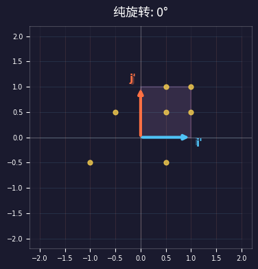
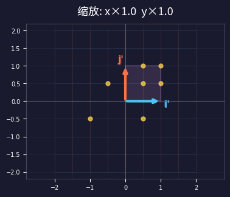
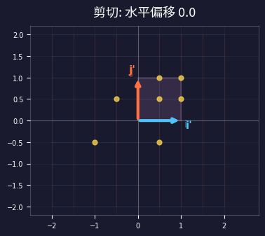
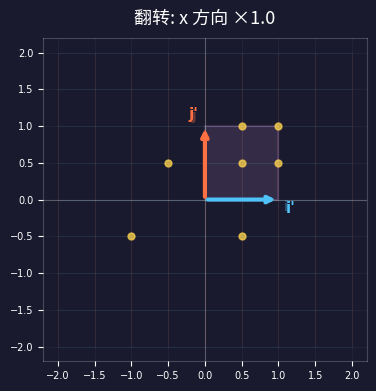
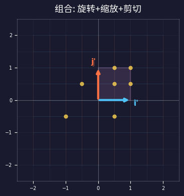
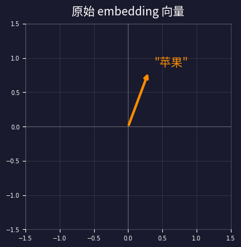
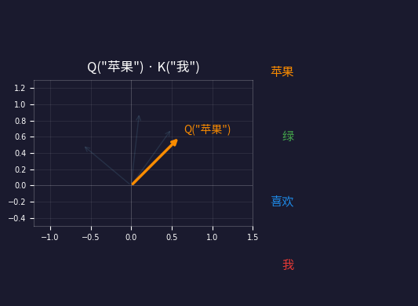
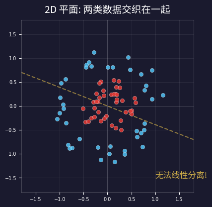
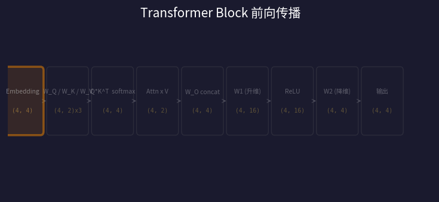

> 你一定听说过：**GPT 的本质就是矩阵乘法**。
>
> 但"矩阵乘法"到底在干什么？为什么乘来乘去就能理解语言？
>
> 别急。今天不写公式，不讲定理——**只看动图**。

矩阵乘法在几何上做了什么，用眼睛就能看明白。而 GPT 里的 Attention、MLP 等等，**和你眼前看到的 2D 变换，是完全一样的数学**——只不过维度从 2 变成了 768。

*维度变了，几何没变。看懂 2D，就看懂了 GPT。*

---

## 一、矩阵乘法在干什么？——5 张动图告诉你

先忘掉 GPT，忘掉人工智能。我们就在一张白纸上画箭头。

一个 2×2 的矩阵乘以一个箭头（向量），就是把这个箭头**搬到新位置**。具体怎么搬？看矩阵的数值。我们来看 5 种最基本的搬法：

> **看图秘诀：** 每张图里有两个关键箭头——蓝色 i 和红色 j。它们是"基向量"，相当于坐标系的两根轴。**只要你知道这两根轴去了哪里，空间里所有点的命运就确定了。**

### 1. 旋转——所有点绕原点转圈

蓝色 i 和红色 j 同时转动，它们之间始终保持 90°。网格跟着一起转，整个空间像一张转盘：



### 2. 缩放——沿不同方向拉伸或压扁

蓝色 i 变长、红色 j 变短。正方形变成了扁扁的长方形：



### 3. 剪切——像推扑克牌一样倾斜

蓝色 i 不动，红色 j 被推歪了。正方形变成了平行四边形：



### 4. 翻转——像照镜子

蓝色 i 从右边跑到了左边，整个空间被"翻面"：



### 5. 组合——真实世界里矩阵做的事

旋转+缩放+剪切同时发生。这才是 GPT 里矩阵真正在做的事——**复杂的组合变换**：



> **记住这三件事——矩阵乘法就是：**
> 1. **改变方向**（旋转）
> 2. **改变大小**（缩放）
> 3. **改变形状**（剪切、翻转）
>
> 就这三件事，没了。后面你会发现，GPT 里的 QKV、Attention、MLP——**全是这三件事在更高维度的重演**。

---

## 二、从 2D 到 768 维——维度变了，规则没变

前面的动图是 2 维平面。GPT 工作在 768 维空间。听起来吓人？别怕——**规则一模一样**。

为了方便演示，我们建一个"迷你 GPT"，全文用同一组数值：

| 参数 | 值 |
|------|------|
| 句子 | "我" "喜欢" "绿" "苹果" |
| d_model | 4（真实 GPT 是 768） |
| n_heads | 2, d_head = 2, d_ff = 16 |

每个 token 变成一个 4 维向量（embedding）——相当于 4 维空间中的一个**点**：

| Token | Embedding 向量 |
|-------|---------------|
| "我" | [0.8, -0.3, 0.5, 0.1] |
| "喜欢" | [0.2, 0.7, -0.4, 0.6] |
| "绿" | [-0.5, 0.1, 0.9, -0.2] |
| "苹果" | [0.3, 0.4, 0.2, 0.8] |

你画不出 4 维空间，但**所有 2D 的几何直觉全部适用**：

| 2D 能做的事 | 768 维一样能做 |
|------------|---------------|
| 算两个向量的夹角 | 公式一模一样，768 个数相乘再相加 |
| 矩阵乘法 = 旋转+缩放 | 768×768 矩阵，做的还是同样的事 |
| 方向相同 = 相似 | 语义相似的词，embedding 方向也相近 |

> **类比：** 你不需要"看见"768 维空间，就像你不需要看见空气来理解风。只要知道风的规则（方向、力度、叠加）在不在，就够了。这些规则在 2D 和 768D **完全一样**。

---

## 三、QKV 投影——同一个向量的三种"透视"

在 Attention 里，每个 token 的 embedding 要通过**三个不同的矩阵**，变出 Q（查询）、K（键）、V（值）三个版本。

这在干什么？想象你在看一个苹果：

| 变换 | 角度 | 含义 |
|------|------|------|
| Q 矩阵变换 | 正面照 | "我在**找什么**？" |
| K 矩阵变换 | 侧面照 | "我能**匹配什么**？" |
| V 矩阵变换 | X光照 | "我的**实际内容**" |

几何上看，就是第一章那种矩阵变换——**同一个箭头，被三个不同矩阵旋转到三个不同方向**：



```text
"苹果" embedding = [0.3, 0.4, 0.2, 0.8]

Q = W_Q × embedding → 旋转到"查询空间"
K = W_K × embedding → 旋转到"匹配空间"
V = W_V × embedding → 旋转到"内容空间"

维度: (4,) × (4,2) = (2,)  每个头 d_head=2
```

> **本质：** W_Q、W_K、W_V 就是三个不同的"旋转+缩放"矩阵。每个矩阵选了不同的"观察角度"，让同一个向量展示不同侧面。这和第一章的矩阵变换**是同一件事**。
>
> 关于"为什么要分成三份"的更深入讨论，见第 18 篇《为什么 Transformer 需要 Q、K、V》

---

## 四、Attention 点积——就是比较两个箭头的方向

QKV 投影完毕后，Attention 的核心操作出奇简单：**把 Q 和 K 放在一起，看它们指向的方向有多接近**。

数学上叫"点积"，几何上就是比较两个箭头的**夹角**：

| 两个箭头的关系 | 夹角 | 点积 | 意思 |
|---------------|------|------|------|
| 同方向 | 0° | 最大 | 高度相关，多关注 |
| 垂直 | 90° | 零 | 完全无关，忽略 |
| 反方向 | 180° | 最小（负） | 高度对立 |

看动图："苹果" 的 Q 箭头，逐个跟每个 token 的 K 箭头比较夹角——



### 从分数到概率：Softmax

点积给出原始分数（可正可负），softmax 把它变成概率——所有分数加起来等于 100%：

```text
一步一步算：
1. Q * K = 原始分数  [0.54, 0.74, 0.12, 0.78]
2. / sqrt(d_head) = 缩放  [0.38, 0.52, 0.08, 0.55]
3. softmax = 概率    [0.22, 0.25, 0.16, 0.26]
4. 概率 × V = 加权混合 → 输出
```

> **一句话总结：** Attention = 比较所有 token 的**方向相似度**，然后按相似度加权混合。方向越接近的 token，贡献越大。

---

## 五、MLP——升到高维分开，再降回来

Attention 之后，Transformer 还有一个 MLP（前馈网络）。它的结构极其简单：

```text
x (d=4) → W1 升维 (d=16) → ReLU → W2 降维 (d=4)
```

为什么要先升维再降维？用一个真实的例子来看——

想象你有一堆红色点和蓝色点，混在 2D 平面上。红色点在内圈，蓝色点在外圈。你想画一条直线把它们分开——**不可能**。

但如果我们加一个维度 z，让每个点"飞"到 3D 空间？红色点飞得低，蓝色点飞得高——现在一刀就能切开！最后再把它们"按"回 2D，它们已经分开了。



| 步骤 | 数学操作 | 几何直觉 |
|------|---------|---------|
| W1 升维 | 4 维 → 16 维 | 把纸**展开到高维**——纠缠的点被拉开了 |
| ReLU | 负值变成 0 | **选择性保留**——只留有用的特征 |
| W2 降维 | 16 维 → 4 维 | 按回原来的维度——但**已经分开了** |

> **为什么这招管用？** 在低维空间纠缠在一起的东西，升到高维后更容易被分开。ReLU 做"选择"——只保留正值，约一半维度被关掉。最后降维回来，信息已经被**重新整理**了。
>
> 这就是第 19 篇《万能近似》的核心——足够宽的 MLP 能逼近任意函数。MLP 其实还在存储"知识"，详见第 20 篇《MLP 知识仓库》。

---

## 六、完整前向传播——一次走完

把所有部件连起来，看 4 个 token 如何走完一个 Transformer Block：



### 维度变化一览

| 步骤 | 操作 | 形状 | 几何意义 |
|------|------|------|---------|
| 1 | Embedding | (4, 4) | 4 个 token → 4 维空间的 4 个点 |
| 2 | Q / K / V 投影 | (4, 2) ×3 | 旋转到 3 个子空间 |
| 3 | Q × K 点积 | (4, 4) | 4×4 夹角比较 |
| 4 | softmax × V | (4, 2) | 按相似度加权混合 |
| 5 | 多头拼接 + W_O | (4, 4) | 多个视角合并 |
| 6 | MLP W1 升维 | (4, 16) | 展开到高维 |
| 7 | ReLU | (4, 16) | 选择性激活 |
| 8 | MLP W2 降维 | (4, 4) | 折回原维度 |
| **9** | **输出 + 残差** | **(4, 4)** | **形状不变，语义已更新** |

> **注意首尾维度：** 输入 (4, 4) → 输出 (4, 4)。形状没变！所以 Transformer Block 可以**堆叠**——一个 Block 的输出直接喂给下一个。GPT-2 堆了 12 层，GPT-4 据说堆了 120 层。

---

## 七、对照表——同一种数学，不同的名字

最后，一张表把今天所有内容串起来：

| 数学操作 | 2D 直觉 | GPT 里叫什么 |
|---------|---------|-------------|
| 矩阵 × 向量 | 旋转+缩放+剪切 | W_Q / W_K / W_V 投影 |
| 点积 | 比较夹角 → 相似度 | Q × K → 注意力分数 |
| 升维 | 2D → 3D，"展开" | MLP W1: d_model → d_ff |
| ReLU | 砍掉负半边 | 约 50% 神经元归零 |
| 降维 | 3D → 2D，"折回" | MLP W2: d_ff → d_model |
| 加权平均 | 求重心 | softmax(QK) × V |
| 堆叠 | 复合变换 | 12~120 层 Transformer Block |

> **核心结论**
>
> GPT 的每一个操作——投影、点积、升降维、激活——你都可以在 2D 平面上找到对应的几何直觉。
>
> **768 维不是魔法，是你眼前这些动图在更高维度的 384 倍平行展开。**

---

### 本系列回顾

| # | 文章 | 核心问题 |
|---|------|---------|
| 16 | 矩阵：连接数学与 AI 的桥梁 | 矩阵的列视角，W 为什么在右边 |
| 18 | 为什么 Transformer 需要 Q、K、V | QKV 发明的哲学动机 |
| 19 | 万能近似：矩阵+激活能逼近一切 | 万能近似定理的直觉证明 |
| 20 | MLP 知识仓库 | MLP 作为键值记忆网络 |
| **22** | **一看就懂：矩阵乘法对 LLM 做了什么（本文）** | **9 张动图，几何直觉桥接** |

---

> 现在你有了从 2D 到 768 维的完整直觉链。
>
> 下次看到 "multi-head attention" 或 "feed-forward network"——
>
> **别慌。它们就是你刚才看到的那些旋转和缩放，只不过在更高的维度上同时做了很多遍。**
