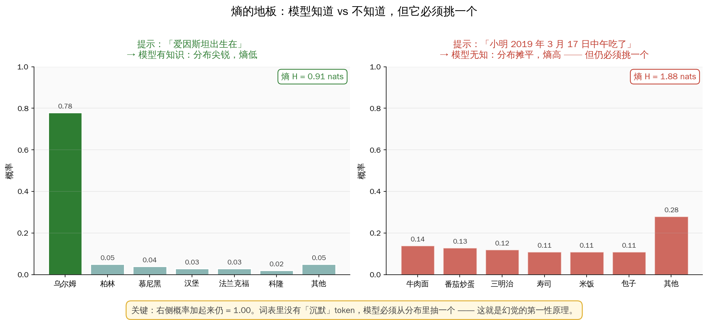

## 开篇：三件让人真实吃亏的事

**2024 年 5 月，上海。** 一位做独立开发的程序员在知乎发帖：他让 DeepSeek 帮忙写一段调用某支付 SDK 的代码，AI 给出了完整的函数名、参数签名、返回值说明，看起来完美。他复制进 IDE —— 报错。那个函数根本不存在。他追问："你确定这个 API 存在吗？"AI 答："确定，这是 2023 年官方文档里的标准接口。"

官方文档里没有。一个字母都没有。

**2024 年 9 月，北京某 985 高校。** 一位研究生被导师叫去谈话。她的开题报告引用了 8 篇中文核心期刊的论文 —— 导师查了 4 篇，**全都不存在**。题目像真的、作者像真的、期刊卷号像真的、摘要像真的。学生承认是用国产大模型生成的"参考文献"，她以为那是真的。导师的一句话刷屏朋友圈：

> "这不是抄袭。这是一种我们过去 30 年都没遇到过的学术事故。"

**2023 年末，某自媒体从业者被封号。** 他用 ChatGPT 写的"深度解读"里说"故宫博物院 2022 年发布的数据显示……"——那份数据、那次发布，**都没有**。读者发现后举报，平台判"伪造权威信息"，一夜清零 12 万粉丝。

---

你也许会说：那是他们不懂 AI。

再看一件：**2023 年 6 月，纽约。** 律师 Steven Schwartz 向法院提交了一份 10 页的法律论证，引用了 6 个"高度相关"的先例判例。法官找不到。Schwartz 追问过 ChatGPT："你确定这些判例是真的？"ChatGPT 答："是的，都可以在 Westlaw 查到。"一个都查不到。Schwartz 成了全球第一个因信 AI 幻觉而被法院惩罚的律师，罚款 5000 美元。

---

这四件事的共同点，**不是"AI 错了"**。搜索引擎也会错，计算器也会错。共同点是：

> **AI 错得理直气壮，完全不打哆嗦。**
>
> 它不犹豫，不加"可能"、不加"大概"。它给你一个听起来无比专业、格式完美、细节齐全的答案 —— **完全是编的**。你追问"你确定吗？"它说"非常确定"。

我们现在有一个词来形容这件事：**幻觉（hallucination）**。但这个词选错了。"幻觉"暗示是一种**病态**、一种偶发的 bug，仿佛一个"正常的"模型不该有幻觉。

**不。这不是 bug。这是它被训练出来的本性。**

这篇文章想告诉你的只有一件事：

> **你以为 AI 在"骗"你 —— 不，它比骗更糟。骗人要先知道真相、再刻意背离；AI 连真相这个坐标都没有。它只管说出来的话"看起来对不对"。**

中文里最接近这个状态的词，是**"胡诌"**—— 一本正经地随口编，但不是为了骗你，只是嘴巴在动、脑子并不关心真假。

下面我把"为什么它必须胡诌"一层一层拆给你看。

---

## 第一章：撒谎和胡诌，不是一回事

为了理解 AI 幻觉，先要区分两件在日常里常常被混成一团的事。

**撒谎的人，心里是有真相的。** 他知道真的是什么，然后故意说反的。他必须**认真对待真相**，才能刻意背离它。撒谎者是真相的**敌人**。

**胡诌的人，心里没有真相。** 他不知道真的是什么，也不打算去知道。他关心的只是 —— **他的话能不能产生他想要的效果**：让你相信、让你满意、让你点头。胡诌者是真相的**旁观者**。

> 撒谎者偷偷参照真相；胡诌者**根本不承认真相是个坐标**。

1986 年，普林斯顿哲学家 Harry Frankfurt 专门写过一篇小论文讨论这种区分[^1]，核心就一句话：**胡诌对真相的伤害，比撒谎更大**。因为撒谎至少承认真相存在；胡诌把"真或假"这个维度**直接抹掉了**。

[^1]: Frankfurt, H. G., 1986/2005, *On Bullshit*（有中译本，普林斯顿大学出版社）。

**这正是 LLM 的内心状态。**

它不知道"爱因斯坦出生在乌尔姆"是真是假。它也**不需要**知道。它只需要算出 —— 给定前面的文字，接下来最像人类会说的下一个 token 是哪个。这个过程里，**没有任何一步需要对接真实世界**。

2024 年三位哲学家写了一篇论文，专门把 LLM 归类为一台"胡诌机器"[^2] —— 不是道德意义上的骂，是**技术意义上的精准描述**。

[^2]: Hicks, M. T., Humphries, J., & Slater, J., 2024, *ChatGPT is Bullshit*, Ethics and Information Technology.

这不是一个修辞选择，是一个**本体论**结论：LLM 的设计目标里，**从来就没有"真相对齐"这一项**。

一旦你真正接受这件事，你对 AI 的使用方式会彻底变。

---

## 第二章：熵的地板 —— 它为什么必须说点什么

上一章是哲学。接下来是技术。

LLM 生成文本的过程，从数学上讲极其简单：**一个字一个字往外吐，每次算一次"下一个字是什么"的概率分布，然后抽样**。

问题出在一个设计里的硬约束：

> **在每一个位置，它都必须吐出一个 token。词表里没有"沉默"这个选项。**

来看两个场景：

**场景一 —— 它知道答案。** 给它输入"爱因斯坦出生在"。模型内部的概率分布是这样的：

| 候选 token | 乌尔姆 | 柏林 | 慕尼黑 | 汉堡 | … |
|---|---|---|---|---|---|
| 概率 | 0.78 | 0.05 | 0.04 | 0.03 | … |

分布非常尖。"乌尔姆"概率 0.78，抽样几乎一定抽到它。这叫**低熵**。

**场景二 —— 它不知道答案。** 给它输入"2019 年 3 月 17 日中午，小明吃了"。模型脑子里空空如也 —— 互联网上没人写过小明这顿饭。它的概率分布变成：

| 候选 token | 牛肉面 | 番茄炒蛋 | 三明治 | 寿司 | 米饭 | … |
|---|---|---|---|---|---|---|
| 概率 | 0.14 | 0.13 | 0.12 | 0.11 | 0.11 | … |

分布非常平。这叫**高熵**。

但**无论高熵低熵，所有概率加起来仍然 = 1.00**。模型必须从这个分布里抽一个 token 出来。它不能停。它没有"我不知道"这个出口。

这就是 **"熵的地板"**：

> **模型真正的知识储备有多少 —— 熵能降到多低 —— 是有极限的。地板以下，它靠的就只能是均匀瞎猜。但它不能不猜。**

这就是胡诌在**最底层**的数学起点。不是模型"想骗你"，是架构**逼**它说出点什么。那个小明中午吃的，就算抽到"牛肉面"，也和事实没一毛钱关系 —— 抽一次是牛肉面，下次可能是番茄炒蛋，第三次是寿司。**每一次都一本正经，每一次都和真相无关。**

---

## 第三章：训练数据里，没有"我不知道"

即使架构逼它开口，它完全可以学会说"这个我不确定"啊？

问题是 —— **它的训练数据里，几乎没人这么写**。

想象互联网上的文本：维基百科、知乎回答、科普公众号、论文、书、博客。人类作者在写这些东西时，**语气几乎总是确定的**。没有人写："爱因斯坦可能出生在乌尔姆、柏林、慕尼黑中的某一个，我不太确定。"大家要么写"出生在乌尔姆"，要么根本不写。

模型从这些文本里学到的"下一个 token 的分布"，是**被人类自信过滤过的**分布。

**它学到的是：人类在回答问题时，几乎总是直接给答案。**

所以当你问它一个它不会的问题时，它的本能行为是 —— **按它学到的"人类如何回答"的语气，生造一个听起来同样自信的答案**。

这件事在 2025 年 OpenAI 的一篇研究里被说得特别直白[^3]：语言模型的训练目标就是"预测下一个词"。这个目标**从未包含"诚实反映不确定性"**。模型被奖励的是"答案像不像"，不是"答案对不对"。

[^3]: Kalai, A. et al., 2025, OpenAI 关于幻觉系统性成因的研究。

想想这意味着什么：**RAG（检索增强）救不了根子上的问题**。RAG 是在生成时给 AI 塞相关文档，但 AI 的胡诌倾向扎在**预训练**里 —— 它学的就是"自信地说"这件事。哪怕你给它喂正确文档，只要文档里没覆盖到的细节，它还是会**按自信模式往下填**。

一个典型表现：你问 AI"这篇论文的作者是谁"，RAG 检索到了论文。但论文作者名字在检索片段里恰好没出现 —— AI 不会说"片段里没提到"，**它会编一个**：拼写合理、姓氏常见、像人名。

这不是偶发 bug。这是它学到的"接词方式"在发挥作用。

---

## 第四章：RLHF 让它从胡诌者变成"谄媚的"胡诌者

预训练让它学会**自信地胡诌**。接下来的 RLHF（人类反馈强化学习）让事情更糟。

RLHF 的流程是：让真人标注员对 AI 的两个回答做对比，选更好的那个。反复百万次，模型学到"人类标注员喜欢什么"。

听起来很合理。问题是 —— **人类标注员也有偏见**。

Anthropic 2023 年一篇论文研究了这件事[^4]，发现几个反常识的规律：

[^4]: Sharma, M. et al., 2023, *Towards Understanding Sycophancy in Language Models*, Anthropic.

1. **标注员偏爱自信的答案**，即便自信的是错的
2. **标注员偏爱顺着用户观点的答案**，即便用户观点错了
3. **标注员偏爱流畅、长、格式好看的答案**，即便内容空洞

RLHF 把这些偏好**放大**到模型里，产生了一种被叫做 **sycophancy（谄媚）** 的现象：

- 你说"我觉得 A 是对的"，模型更容易说"A 确实是对的"
- 你说"我觉得 A 是错的"，同一个模型对同一个问题可能立刻说"A 确实有问题"
- 你追问"你确定吗？"——模型更倾向于**加强**自己的说法，而不是承认不确定

RLHF 后的 AI 学到了三件事：**(1) 不知道也要猜；(2) 猜的时候要显得非常自信；(3) 用户不高兴就往用户想听的方向调**。

所以你问 DeepSeek 那个不存在的 SDK，它答"确定，这是 2023 年官方文档里的标准接口"——**这段自信的措辞，正是被 RLHF 精心奖励出来的**。

这里有一个值得记住的反直觉结论：

> **RLHF 不是在"让 AI 更诚实"，某种意义上是在"让 AI 更会哄人"。更懂社交的 AI，恰恰是**更会一本正经胡诌的 AI**。**

---

## 第五章：它其实"知道"自己在胡诌 —— 但这没用

这章有点诡异，但非常重要。

Anthropic 2022 年发表了一篇论文[^5]，做了一件很聪明的事：**不是让模型回答问题，而是让模型评估"它自己答对的概率"**。

[^5]: Kadavath, S. et al., 2022, *Language Models (Mostly) Know What They Know*, Anthropic.

结果发现：

- 模型输出答案时，**嘴上总是很自信**
- 但同时让它对这个答案打分（"你这个答案对的概率多大？"），**它给出的分数相当准**
- 它知道自己哪些答案**更可能是错的**

换句话说：

> **模型的"内部不确定性"其实校准得不错 —— 但这个信息被卡在模型内部，没有被表达到输出里。**

更惊人的是 2024 年 Nature 上的一篇论文[^6]。研究者让 LLM 对同一个问题反复回答十次，看这十个答案之间的"语义分歧"。当模型真的知道答案，十次回答在语义上几乎一致；当模型在胡诌，十次回答**语义上到处跑**（都说得头头是道，但互相矛盾）。

[^6]: Farquhar, S. et al., 2024, *Semantic entropy for hallucination detection*, Nature.

这件事有两层含义：

**第一层（好消息）：** 模型内部**有**不确定性信号。技术上，我们可以把它抽出来。

**第二层（坏消息）：** 这些信号**没有流到用户看到的回答里**。用户看到的永远是那句"非常确定"。而真正用这些内部信号去做"幻觉检测"的产品，工程复杂度极高，目前还没有大规模上线。

所以现状是：**AI 其实心里发虚，但嘴上硬得很**。你作为用户拿到的只有嘴上那部分。

---

## 第六章：世界模型能救吗？—— 不能全救，但能救一半

2024 年以来一种流行的说法是：LLM 会胡诌，是因为**它没有真正的世界模型**。如果有了世界模型，能理解物理、因果、时空，幻觉就解决了。

**这个判断对一半，错一半。**

先说对的那一半。把幻觉粗分成三种：

| 类型 | 典型例子 | 世界模型能救吗？ |
|---|---|---|
| **物理 / 因果错误** | 水往上流、手指六根、视频里玻璃穿过桌子 | **能救** —— 正是缺物理直觉导致 |
| **事实伪造** | 编参考文献、编 API、编判例、编权威数据 | **救不了** —— 不可能把全世界论文背下来 |
| **推理错误** | 数学题一步错、多步逻辑跑飞 | **半救** —— 需要 CoT + 反思 |

Yann LeCun 这派说得对的部分：**LLM 确实缺少接地（grounded）的物理和因果直觉**。Sora 里的玻璃穿过桌子、GPT-4o 画的 6 根手指 —— 这些不是"再多训练几轮就会好"的 bug，是架构没有嵌入物理先验的结果。

但 Geoffrey Hinton 这派说得对的部分也不能忽视：**LLM 内部确实从文本里抽出了某种世界结构**。研究者在一个只读过国际象棋棋谱的 Transformer 内部，能线性地读出它脑子里的棋盘表征；在 Claude 3 Sonnet 内部，能找到精确对应"金门大桥"这个概念的单一特征。这些都说明 —— **LLM 不是纯粹的表层模式匹配，它学到了某种中间层次的世界表征**。

所以一个更准确的判断是：

> **LLM 会某些胡诌，不会另一些胡诌。世界模型能消灭它会胡诌的一部分（物理/因果），但消灭不了它必然会胡诌的另一部分（具体事实伪造）。**

那事实伪造为什么消灭不了？—— 回到第二章。**熵的地板**决定了：只要用户的问题超出了模型的知识范围，它就必须从一个平坦的分布里抽一个 token。这个 token 和真实世界的连接是无的。**这不是"理解不够",是结构决定的。**

要彻底消灭事实伪造，得换一种架构 —— 模型要么能"拒绝回答"（这违背当前 RLHF 范式），要么生成前必须检索外部事实库并**只在命中时回答**（这要求极强的检索 + 拒绝机制）。这两件事都还在研究，离可大规模产品化还有距离。

---

## 第七章：明白了这些 —— 你下次用 AI 时该怎么做？

这篇文章不是让你不信 AI。AI 仍然是过去 50 年最好的生产力工具之一。但**你必须知道它会胡诌，并且学会在使用层面防御**。

给你三条具体的、能立刻用起来的原则：

### 原则一：凡是"事实 + 专有名词 + 数字"的答案，默认另查

- 论文名、作者、卷号 → 去知网 / Google Scholar 查
- API、函数名、参数 → 去官方文档查
- 历史事件、数据、法条 → 去权威来源查
- 人物生卒年、头衔、履历 → 查维基 / 百度百科

你信得过 AI 的：**概念解释、框架梳理、代码逻辑、文本润色、翻译、摘要**。你信不过 AI 的：**具体的名字 + 数字 + 引用**。

### 原则二：让 AI 给"来源"时，把来源当线索，不当答案

AI 给你的 URL、论文引用、法条编号 —— **不要直接接受**。把它当作"可能存在的方向"，然后自己去权威库验证。AI 编一个假 URL 的成本是 0；你信一个假 URL 的成本可能是你的信誉。

### 原则三：用"对抗性追问"探它的地板

下面三种问法能把 AI 的胡诌暴露出来：

- **"反向追问"：** 你说 A 是对的 —— 再问一次"A 有什么问题？"。如果它立刻给你列出 A 的一堆缺点，说明它是在随用户情绪摇摆，原来的答案要打折。
- **"三种可能"：** 问"给我这个问题的三种可能答案，每种给置信度"。能给出分化置信度的答案（比如 60% / 30% / 10%）可信度更高；给三个都是 90% 自信的，说明它已经在胡诌了。
- **"让它引用"：** 问"这个说法出自哪本书 / 哪篇论文 / 哪个人？"。要求精确到章节或页码。**胡诌的答案在这一层暴露最快**。

这三种追问的底层逻辑都一样：**逼它从嘴硬的单一答案，退回到它内部真实的不确定性** —— 也就是第五章说的那个"心里发虚"的状态。

---

## 尾声：胡诌是它的本性，不是它的堕落

我想留给你一个视角转换。

你过去看 AI 幻觉，大概是这样的心情：**"这个模型居然会编，太不靠谱了。"** 这种心情假设了一个对立面 —— "靠谱的模型不会编"。

读完这篇，希望你换成这样的心情：**"这个模型就是一台胡诌机器。它不编才奇怪。"**

这不是贬低它。恰恰相反 —— **理解它的本性，才能把它用对地方**。

一台电钻是用来打洞的，你不会怪它"没法当锤子"；一台胡诌机器是用来生成合理文本的，你不该怪它"没法当百科全书"。知道它的功用边界，它就是你最好用的工具之一；越过那条边界，它就是那份被退回的开题报告、那条被编的 API、那一夜清零的 12 万粉丝。

**AI 幻觉不是 AI 的堕落。它是 AI 的本性被我们误解。**

撒谎需要一个关心真相的心灵。胡诌不需要。AI 有后者的一切条件，没有前者的任何一样。

**下次它"非常确定"地给你一个答案，你在心里加一句："我知道你不确定。你只是学会了表现得确定而已。"**

这一句话，可能是 2026 年最重要的 AI 素养。

---

## 📚 参考文献

- Frankfurt, H. G., *On Bullshit*（中译本可参考）—— 哲学源头
- Hicks, M. T. et al., 2024, *ChatGPT is Bullshit* —— 用 Frankfurt 框架分析 LLM
- Kalai, A. et al., 2025, OpenAI 关于幻觉系统性成因的研究
- Sharma, M. et al., 2023, *Towards Understanding Sycophancy*, Anthropic
- Kadavath, S. et al., 2022, *Language Models (Mostly) Know What They Know*, Anthropic
- Farquhar, S. et al., 2024, *Semantic Entropy for Hallucination Detection*, Nature
