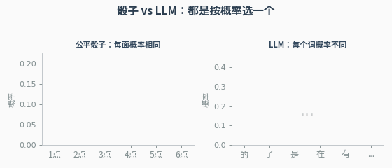
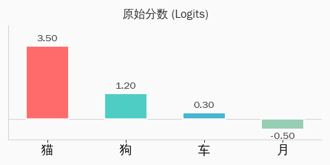
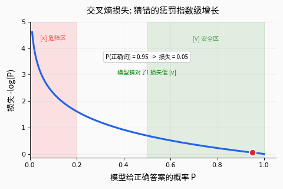
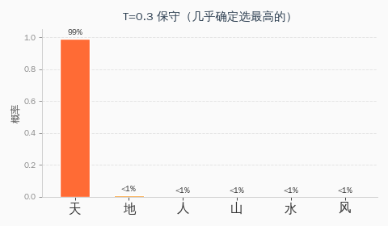
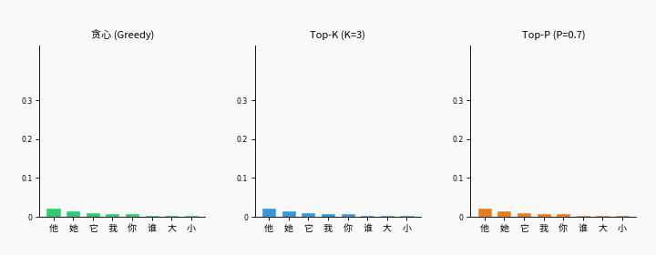
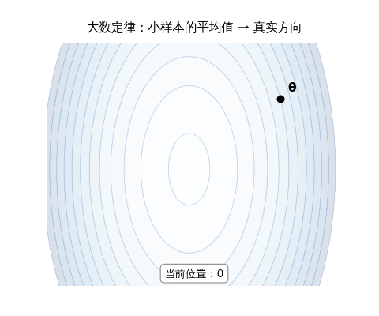

## 引言

你和 ChatGPT 对话时，它每次给出的回答都略有不同。为什么？

因为 LLM 的本质，**不是一个知道答案的数据库**，而是一台 **「下一个词的概率预测机器」**。它不是"知道"该说什么，而是在所有候选词中**掷一颗加权骰子**，概率高的词更容易被选中。

这篇文章，我们从零开始，用掷骰子的直觉，一步步拆解 LLM 背后的概率论——从最基础的"什么是概率"，到 Softmax、交叉熵、Temperature、采样策略，再到训练中最深层的两大支柱：大数定律和中心极限定理。

> **阅读前提：** 不需要任何数学基础。每个公式都会用生活类比先讲清楚直觉，再给出数学表达。

---

## 本文导读

<div style="max-width: 600px; margin: 1.5em auto; font-size: 0.93em; line-height: 1.9;">

<div style="border-left: 3px solid #FF9800; padding-left: 14px; margin-bottom: 10px;">
<strong>概率基础（第一~二章）</strong><br>
<span style="color: var(--secondary);">① 条件概率：LLM 在做什么？ → ② Softmax：把分数变成概率</span><br>
从掷骰子讲起，理解 LLM 预测下一个词的核心逻辑。
</div>

<div style="border-left: 3px solid #2196F3; padding-left: 14px; margin-bottom: 10px;">
<strong>训练与评估（第三~四章）</strong><br>
<span style="color: var(--secondary);">③ 交叉熵：训练的指挥棒 → ④ 困惑度：给模型打分</span><br>
模型怎么从一无所知变成能说话？怎么衡量它学得好不好？
</div>

<div style="border-left: 3px solid #9C27B0; padding-left: 14px; margin-bottom: 10px;">
<strong>生成控制（第五~六章）</strong><br>
<span style="color: var(--secondary);">⑤ Temperature：调节创造力 → ⑥ 采样策略：怎么选词</span><br>
同一个模型，为什么有时保守有时疯狂？Top-K 和 Top-P 是什么？
</div>

<div style="border-left: 3px solid #4CAF50; padding-left: 14px;">
<strong>深层支柱（第七~八章）</strong><br>
<span style="color: var(--secondary);">⑦ 大数定律：训练为什么能成功 → ⑧ 中心极限定理：架构设计的隐形之手</span><br>
不写在代码表面，却是 LLM 能训练成功的地基级理论保障。
</div>

</div>

---

## 第一章：LLM 在做什么？——条件概率

### 从猜字游戏说起

小时候玩过猜字游戏吗？我说"床前明月"，你脱口而出——"光"。

你的大脑在做什么？**根据前面的字，预测下一个字。** LLM 做的事情**完全一样**——只不过它是用数学来做的。

### 什么是条件概率？

先看一个最简单的例子。

一副扑克牌有 52 张。随机抽一张是红心的概率：

```text
P(红心) = 13/52 = 1/4 = 25%
```

但如果我告诉你"这张牌是红色的"，那它是红心的概率变成多少？

```text
红色的牌有 26 张（红心13 + 方块13）
其中红心有 13 张

P(红心 | 已知是红色) = 13/26 = 1/2 = 50%
```

> **这个竖线 "|" 读作"在……条件下"。** 它的意思是：**已知了一些信息后**，某件事的概率会变化。

这就是**条件概率**——你拥有的信息越多，预测就越准确。

### LLM 的核心任务

LLM 做的就是一个超大规模的条件概率计算。给定前面所有的字，预测下一个字的概率：

```text
P(下一个字 | 前面所有的字)
```

具体来说：

```text
输入: "床前明月"
模型计算:
  P("光" | "床前明月") = 0.92   ← 最可能
  P("色" | "床前明月") = 0.03
  P("亮" | "床前明月") = 0.02
  P("下" | "床前明月") = 0.01
  ...其他几万个字，概率都很小
```

**有前文 vs 没前文，差别巨大：**

```text
没有前文:  P("光") = 0.001           ← "光"只是几万个字中普通的一个
有了前文:  P("光"|"床前明月") = 0.92  ← 知道了前文，"光"几乎是唯一答案
```

> **一句话：条件概率就是"已知一些信息后的概率"。LLM 的全部工作，就是利用前文信息，算出每个候选词的条件概率。**

### 概率的链式法则：一句话的概率怎么算？

一整句话的概率，等于每个字的条件概率**逐个相乘**：

```text
P("床前明月光")
= P("床")                     ← 第一个字的概率
× P("前" | "床")              ← 已知"床"，"前"的概率
× P("明" | "床前")            ← 已知"床前"，"明"的概率
× P("月" | "床前明")          ← 已知"床前明"，"月"的概率
× P("光" | "床前明月")        ← 已知"床前明月"，"光"的概率
```

> **这不是近似，不是假设——这是概率论的恒等式，叫做链式法则（Chain Rule）。**

为什么要相乘而不是相加？因为这些事件要**同时发生**。就像你抛两次硬币都要正面朝上的概率是 1/2 × 1/2 = 1/4，每个字都对了，整句话才对。

### 掷骰子的类比

想象 LLM 是这样工作的：

1. 看到前文"床前明月"
2. 拿出一颗**特殊骰子**——这颗骰子不是均匀的，它有几万个面（每个面代表一个字），但"光"那个面**特别大**，占了 92% 的面积
3. 掷骰子，结果大概率落在"光"上
4. 把"光"拼到文本后面，变成"床前明月光"
5. 重新看前文"床前明月光"，换一颗新骰子，掷出下一个字
6. 如此循环往复

<div style="max-width: 420px; margin: 1.5em auto;">



</div>

> **关键洞察：** 每生成一个字，骰子就换一颗。因为前文变了，概率分布就变了。LLM 不是用一颗固定骰子，而是**每一步都重新计算概率**。

---

## 第二章：Softmax——把分数变成概率

### 问题：神经网络输出的不是概率

LLM 内部的神经网络做完所有计算后，最终会给每个候选词打一个分数，叫做 **logit（逻辑值）**。比如：

```text
词:      "光"    "色"    "亮"    "下"
分数:    3.5     1.2     0.3    -0.5
```

问题来了：

- 分数可以是**负数**（"下"得了 -0.5 分）
- 分数**不加起来等于 1**（3.5 + 1.2 + 0.3 + (-0.5) = 4.5，不是 1）
- 分数**没有上限**（可以是 100、1000）

这些分数不是概率！**概率必须满足两个条件：每个值在 0 到 1 之间，所有值加起来等于 1。**

### Softmax：一台概率制造机

Softmax 函数的工作就是把这些"野蛮"的分数，驯化成"文明"的概率。它分三步：

**第一步：用 e 的指数把所有分数变成正数**

```text
e 是一个数学常数 ≈ 2.718（像圆周率 π ≈ 3.14 一样）

e^3.5  = 33.12    ← 分数高 → 值大
e^1.2  =  3.32
e^0.3  =  1.35
e^-0.5 =  0.61    ← 负分数 → 值小但仍然是正数！
```

> **为什么用 e 的指数？** 因为 e 的任意次方**永远是正数**。不管原始分数是 -100 还是 +100，经过 e^x 都变成正数。这就解决了"概率不能是负数"的问题。

**第二步：把所有值加起来**

```text
总和 = 33.12 + 3.32 + 1.35 + 0.61 = 38.40
```

**第三步：每个值除以总和**

```text
P("光") = 33.12 / 38.40 = 0.863  (86.3%)
P("色") =  3.32 / 38.40 = 0.086  ( 8.6%)
P("亮") =  1.35 / 38.40 = 0.035  ( 3.5%)
P("下") =  0.61 / 38.40 = 0.016  ( 1.6%)
                            ─────
                     总和 = 1.000  ✓
```

三个条件全满足了：

- ✅ 每个值都在 0~1 之间
- ✅ 所有值加起来 = 1
- ✅ 原来分数高的，概率也高（顺序不变）

<div style="max-width: 480px; margin: 1.5em auto;">



</div>

### 一个更直观的类比

想象你在比赛，四个选手的成绩分别是 3.5、1.2、0.3、-0.5 分。现在要根据成绩分奖金——成绩越高分得越多，但每个人都要分到一些（不能是零），而且奖金总额固定。

Softmax 就是**分奖金的规则**：分数高的拿大头，分数低的拿小头，所有人拿到的比例加起来正好是 100%。

> **Softmax 的另一个名字叫"归一化指数函数"——"归一化"就是"让总和变成 1"的意思。**

### Softmax 的公式

写成数学公式就是：

```text
              e^(分数_i)
P(词_i) = ─────────────────
           所有 e^(分数) 之和
```

就这么一个分式。分子是"这个词的指数值"，分母是"所有词的指数值之和"。

> **一句话：Softmax 是 LLM 的「概率出口」——神经网络算了一路的数字，最后通过这扇门，变成了一个合法的概率分布。**

---

## 第三章：交叉熵——训练的指挥棒

### 训练的本质：让模型猜得更准

LLM 训练时，我们给它大量的文本。对于每一段文本，模型的任务是：**看到前面的字，猜下一个字。** 猜对了奖励，猜错了惩罚。

但"奖励"和"惩罚"需要一个**数学上精确的衡量方式**——这就是**损失函数**。LLM 用的损失函数叫**交叉熵（Cross-Entropy）**。

### 直觉：老师改考卷

想象你是一位老师，学生在做填空题：

**题目：** 床前明月＿＿

| 学生 | 答案 | 给"光"的概率 | 你的评价 |
|:---:|:---:|:---:|:---:|
| 学神 | 光 | 92% | 很好！几乎确定答对了 |
| 普通生 | 光/色/亮都有可能 | 40% | 还行，但不够自信 |
| 学渣 | 随便猜 | 2% | 完全不行，需要努力 |

交叉熵做的事就像你改考卷——**给正确答案的概率越高，损失越低；概率越低，损失越高。**

### 负对数：惩罚的力度

交叉熵用**负对数**来衡量惩罚力度。为什么用对数？看看这张表：

```text
模型给正确答案的概率    损失 = -log(概率)    直觉
─────────────────────────────────────────────────
      0.90               0.105          猜得很准，小惩罚 ✓
      0.50               0.693          半信半疑，中等惩罚
      0.10               2.303          基本猜错，重罚
      0.01               4.605          完全乱猜，巨额罚款 ✗
      0.001              6.908          ← 概率再低10倍，损失只多2
```

注意两个关键性质：

**① 概率越低，惩罚越大——而且不是线性增大，是指数级增大。**
从 0.9 到 0.5，损失增加了 0.6；从 0.1 到 0.01，损失增加了 2.3。对"完全猜错"的惩罚远远大于"差一点"。

**② 概率为 0 时，损失趋向无穷大。**
这意味着模型**绝不能把正确答案的概率设为零**——必须给每个可能的词都留一点概率。

<div style="max-width: 480px; margin: 1.5em auto;">



</div>

### 为什么叫"交叉"熵？

"交叉"指的是**两个分布之间的比较**：

- **真实分布**（Reality）：正确答案是"光"，概率 = 100%，其他都是 0%
- **模型分布**（Model）：模型猜"光" = 86%，"色" = 9%，"亮" = 3%，...

交叉熵衡量的是：**用模型的分布去"编码"真实分布，需要多少额外的代价？** 两个分布越接近，交叉熵越低；越远，交叉熵越高。

### 三种等价的理解方式

交叉熵损失其实有三个身份——在数学上**完全等价**，只是从不同角度看同一件事：

<div style="max-width: 550px; margin: 1.5em auto; font-size: 0.93em;">

<div style="border: 2px solid #FF9800; border-radius: 8px; padding: 12px 16px; margin-bottom: 10px; background: rgba(255,152,0,0.05);">
<strong>视角一：概率论——最大似然估计</strong><br>
找一组参数，让训练数据出现的概率最大。<br>
<span style="color: var(--secondary);">类比：调整骰子的重量，让它掷出训练数据里实际出现的序列的概率最大。</span>
</div>

<div style="border: 2px solid #2196F3; border-radius: 8px; padding: 12px 16px; margin-bottom: 10px; background: rgba(33,150,243,0.05);">
<strong>视角二：信息论——最小化 KL 散度</strong><br>
让模型分布尽可能接近真实分布。<br>
<span style="color: var(--secondary);">类比：让学生的答题模式尽可能接近标准答案。</span>
</div>

<div style="border: 2px solid #4CAF50; border-radius: 8px; padding: 12px 16px; background: rgba(76,175,80,0.05);">
<strong>视角三：编码论——最优压缩</strong><br>
用模型做压缩器，最小化编码训练数据所需的比特数。<br>
<span style="color: var(--secondary);">类比：模型越好 = 压缩率越高 = 用更少的字节存储同样的文本。</span>
</div>

</div>

> **这三个视角殊途同归——最小化交叉熵 = 最大化预测概率 = 最优压缩数据。这是概率论中最优美的等价关系之一。**

### 在代码里是什么样？

如果你去看 nanoGPT 的训练代码（或任何 LLM 的训练代码），核心就一行：

```text
loss = cross_entropy(模型预测的概率分布, 正确答案)
```

整个训练过程，就是不断调整模型参数，让这个 loss 数字越来越小。

---

## 第四章：困惑度——给模型打分

### 直觉：模型有多"困惑"？

想象你做完形填空。如果每道题你都很确定答案，你就"不困惑"；如果每道题你都在好几个选项间犹豫不决，你就"很困惑"。

**困惑度（Perplexity，简写 PPL）就是衡量模型有多"困惑"的指标。**

### 数学定义

困惑度 = 交叉熵的指数。用 e（自然常数 ≈ 2.718）的"损失次方"：

```text
PPL = e^(交叉熵损失)
```

### 怎么理解这个数字？

| 困惑度 | 含义 | 类比 |
|:---:|:---:|:---|
| **1** | 每个字都 100% 确定 | 考试每题都会，不困惑 |
| **5** | 平均在 5 个字之间犹豫 | 每道选择题有 5 个看起来都对的选项 |
| **50** | 平均在 50 个字之间犹豫 | 几乎是蒙的 |
| **5000** | 约等于词表大小 | 完全随机猜，什么都没学到 |

### 实际例子

nanoGPT 用《西游记》训练后，验证集损失是 1.47：

```text
PPL = e^1.47 ≈ 4.35
```

这意味着：模型在预测《西游记》的下一个字时，**平均在约 4~5 个候选字之间犹豫**。考虑到中文词表有几千个字，这说明模型已经学到了很多语言规律。

> **PPL 越低，模型越好。** GPT-4 等顶级模型在通用文本上的 PPL 可以低到个位数。

---

## 第五章：Temperature——调节创造力的旋钮

### 日常经验

你问 ChatGPT "给我讲个故事"，它每次讲的故事都不一样——有时中规中矩，有时天马行空。这背后就是 **Temperature（温度）** 在起作用。

### Temperature 做了什么？

还记得 Softmax 吗？在做 Softmax 之前，先把所有分数除以一个温度值 T：

```text
              e^(分数/T)
P(词) = ─────────────────────
         所有 e^(分数/T) 之和
```

就多了一个"÷T"，效果却天差地别：

<div style="max-width: 480px; margin: 1.5em auto;">



</div>

### 三种温度，三种性格

用一个具体例子说明。假设模型输出了 4 个词的分数：

```text
原始分数:  "天"=3.0   "地"=1.5   "人"=0.8   "山"=0.3
```

**低温 T=0.3（保守严谨）：**

```text
分数÷0.3:  10.0    5.0    2.67    1.0
Softmax:   [0.95,  0.04,  0.008,  0.002]

→ "天"占了 95%！几乎一定选"天"
```

**正常 T=1.0（原始分布）：**

```text
分数÷1.0:   3.0    1.5    0.8    0.3
Softmax:   [0.59,  0.23,  0.10,  0.08]

→ "天"最可能，但其他词也有机会
```

**高温 T=3.0（冒险疯狂）：**

```text
分数÷3.0:   1.0    0.5    0.27    0.1
Softmax:   [0.35,  0.22,  0.17,  0.14]

→ 四个词概率接近，差什多少都可能被选中
```

<div style="max-width: 550px; margin: 1.5em auto; font-size: 0.93em;">

<div style="display: flex; gap: 8px; flex-wrap: wrap; justify-content: center;">

<div style="flex: 1; min-width: 140px; border: 2px solid #2196F3; border-radius: 8px; padding: 10px; text-align: center; background: rgba(33,150,243,0.05);">
<div style="font-size: 1.3em; font-weight: bold;">T → 0</div>
<div style="font-size: 0.9em; color: var(--secondary); margin-top: 4px;">
确定性模式<br>永远选概率最高的词<br>
<strong>适合：翻译、数学</strong>
</div>
</div>

<div style="flex: 1; min-width: 140px; border: 2px solid #FF9800; border-radius: 8px; padding: 10px; text-align: center; background: rgba(255,152,0,0.05);">
<div style="font-size: 1.3em; font-weight: bold;">T = 1</div>
<div style="font-size: 0.9em; color: var(--secondary); margin-top: 4px;">
正常模式<br>使用模型原始分布<br>
<strong>适合：日常对话</strong>
</div>
</div>

<div style="flex: 1; min-width: 140px; border: 2px solid #E91E63; border-radius: 8px; padding: 10px; text-align: center; background: rgba(233,30,99,0.05);">
<div style="font-size: 1.3em; font-weight: bold;">T → ∞</div>
<div style="font-size: 0.9em; color: var(--secondary); margin-top: 4px;">
随机模式<br>所有词接近等概率<br>
<strong>适合：头脑风暴</strong>
</div>
</div>

</div>

</div>

### 为什么叫"温度"？

这个名字来自物理学的 **玻尔兹曼分布**——描述分子在不同温度下的能量分布。

想象一锅水：
- **低温（冰）**：分子几乎不动，都挤在最低能量状态 → 概率集中在一处
- **高温（沸腾）**：分子剧烈运动，高能低能都有 → 概率分散到各处

LLM 的 Temperature 和物理温度是**完全相同的数学公式**——这不是巧合，而是统计力学和机器学习共享同一套数学。

---

## 第六章：采样策略——怎么从概率中选词

模型算出了每个词的概率，现在要从中**选一个词**输出。怎么选？这就是**采样策略**。

### 策略一：贪心解码——永远选最高的

```text
概率:  "天"=59%  "地"=23%  "人"=10%  "山"=8%
选择:  "天" ← 永远选概率最高的那个
```

**优点**：稳定、可重复
**缺点**：无聊、容易重复。想象一个人说话，每次都选"最安全"的词——"今天天气……好。明天天气……好。后天天气……好。"

### 策略二：随机采样——按概率掷骰子

```text
概率:  "天"=59%  "地"=23%  "人"=10%  "山"=8%
选择:  按概率随机抽一个（59% 的概率选"天"，23% 选"地"...）
```

**优点**：多样、有创意
**缺点**：偶尔会选到极低概率的离谱词，比如概率只有 0.01% 的"袜"。

### 策略三：Top-K——只从前 K 个里选

把概率从高到低排列，**只保留前 K 个词**，其余全部排除。然后在这 K 个词里按概率随机选。

```text
K = 3 时：
保留:  "天"=59%  "地"=23%  "人"=10%  ← 只在这3个里选
排除:  "山"=8%  ...其余所有词

重新分配概率（让3个词加起来 = 100%）:
"天"=64%  "地"=25%  "人"=11%
```

**问题**：K 是固定的。有时候只有 1 个合理选项（如"床前明月__"），有时候有 20 个合理选项（如"今天我想吃__"），固定的 K 不灵活。

### 策略四：Top-P（Nucleus 采样）——动态选词

不固定数量，而是**按概率从高到低累加，直到累积概率达到 P**（比如 P=0.9），超过后的词全部排除。

```text
P = 0.7 时：
"天" = 59%  ← 累积 59%，还没到 70%，保留
"地" = 23%  ← 累积 82%，超过 70% 了，保留（它让我们过线的）
"人" = 10%  ← 排除
"山" = 8%   ← 排除
```

**妙处**：候选词数量是**自适应**的！

```text
"法国的首都是__"  → 概率高度集中在"巴黎"
  Top-P 自动只保留 1-2 个词

"今天晚饭我想吃__"  → 概率分散在很多食物上
  Top-P 自动保留 20+ 个词
```

<div style="max-width: 600px; margin: 1.5em auto;">



</div>

### 实际使用中的组合

实际的 LLM API（如 ChatGPT、Claude）通常**同时使用** Temperature + Top-P：

1. 先用 Temperature 调整概率分布的"尖锐程度"
2. 再用 Top-P 过滤掉概率太低的词
3. 最后在剩余词中按概率随机选

```text
OpenAI API 的默认参数:
  temperature = 1.0  （正常分布）
  top_p = 1.0        （不过滤）

写代码时建议:
  temperature = 0.2  （保守，减少胡编）
  top_p = 0.95       （只去掉最离谱的）

写创意故事时建议:
  temperature = 1.2  （更多随机性）
  top_p = 0.9        （适度过滤）
```

---

## 第七章：大数定律——训练为什么能成功

前面六章讲的都是 LLM "表面上"在做的事。从这一章开始，我们潜入更深的水底——看看**为什么这些方法能工作**。

### 什么是大数定律？

先做一个思想实验。

你想知道全中国人的平均身高。最准确的方法是量 14 亿人——但这不现实。

于是你在街上随机拉 10 个人量身高：

```text
10 个人的平均身高 = 172.3 cm   （可能偏差很大）
```

再多拉一些人：

```text
   100 个人 → 169.8 cm   （更接近了）
  1000 个人 → 170.3 cm   （很接近了）
 10000 个人 → 170.1 cm   （非常接近真实值）
```

> **大数定律说的就是这件事：样本越多，样本平均值就越接近真实平均值。**

这听起来很"常识"——但把它形式化为数学定理，是概率论最重要的成就之一。因为它给了我们一个**保证**：我们不需要看到全部数据，只要样本足够多，就可以用样本代替整体。

### 在 LLM 训练中的三大应用

#### 应用一：Mini-batch SGD——为什么用小样本能训练大模型

这是大数定律在深度学习中**最核心的应用**。

LLM 的训练目标是：**在全部训练数据上，让平均损失最小。** GPT-4 的训练数据有几万亿个 token。每一步都算全量数据的损失？计算机会崩溃。

实际做法：每一步只**随机抽取一小批**（比如 512 条）数据，算这一小批的平均损失和梯度方向，然后更新模型参数。

```text
全量数据的真实损失：  L = 所有样本损失的平均

每一步实际算的：     L̂ = 随机512条样本损失的平均

大数定律保证：      L̂ ≈ L   （512 条足够代表整体的趋势）
```

<div style="max-width: 500px; margin: 1.5em auto;">



</div>

> **没有大数定律，SGD 就是"闭着眼睛乱走"。大数定律说：虽然每一步有噪声，但平均方向是对的。**

#### 应用二：训练集代表真实分布

我们用有限的训练语料（比如几 TB 的互联网文本）去学习"人类语言的分布"。

凭什么有限的语料能代表无限的语言？

```text
训练集上算的损失   ──(大数定律)──→   真实语言上的损失
 (有限样本平均)                      (理论期望值)
```

> **大数定律保证：只要训练数据足够多且足够多样，模型在训练集上学到的规律，就能推广到它没见过的文本。**

#### 应用三：评估指标的可靠性

当我们在验证集上测试模型，得到 PPL = 15.2，这个数字可信吗？

- 如果验证集只有 10 句话 → 不可信，换 10 句可能变成 PPL = 8 或 25
- 如果验证集有 10 万句话 → 可信，大数定律保证样本 PPL 接近真实 PPL

> **一句话总结：大数定律是 LLM 训练合法性的数学基础——它保证了"用有限数据训练"和"用小批量更新"都是靠谱的。**

---

## 第八章：中心极限定理——架构设计的隐形之手

### 什么是中心极限定理？

再做一个思想实验。

你掷一颗骰子，结果在 1~6 之间随机分布——这**不是**正态分布（钟形曲线）。

但如果你掷 30 颗骰子并算它们的**平均值**，重复很多次，你会发现：

```text
1 颗骰子的结果: 1,3,6,2,5,4,1,6,...     → 均匀分布（平的）
30 颗骰子的平均: 3.4,3.6,3.5,3.8,3.2,...  → 正态分布（钟形曲线）
```

> **中心极限定理说：不管原始数据是什么分布，大量数据的平均值（或总和）总是趋向正态分布。**

这个定理的强大之处在于"不管原始数据是什么分布"——不管你掷的是骰子、抛的是硬币、还是量的是身高体重，只要把足够多的样本加起来或求平均，结果就是钟形曲线。

### 在 LLM 中的四大应用

#### 应用一：注意力机制的 1/√d 缩放——最漂亮的应用

这是中心极限定理在 LLM 中**最直接、最优雅**的体现。

在 Transformer 的注意力机制中，我们需要计算两个向量的**点积**（衡量相似度）。点积就是对应位置相乘再相加：

```text
Query = [q₁, q₂, q₃, ..., q₆₄]     ← 64 维向量
Key   = [k₁, k₂, k₃, ..., k₆₄]     ← 64 维向量

点积 = q₁×k₁ + q₂×k₂ + ... + q₆₄×k₆₄
```

这是 **64 个乘积的求和**。每个乘积 q_i × k_i 是一个随机变量。根据中心极限定理，这 64 项之和近似服从正态分布。

假设每个 q_i 和 k_i 都是均值为 0、方差为 1 的随机变量，那么：

```text
每一项 q_i × k_i 的方差 = 1
64 项之和的方差 = 64
64 项之和的标准差 = √64 = 8
```

**问题**：标准差是 8，意味着点积可能达到 ±16 甚至 ±24。这些大数字送进 Softmax 会怎样？

```text
Softmax([16, 2, -5, 1]) ≈ [0.9999, 0.0001, 0.0000, 0.0000]
```

几乎变成了"全或无"——一个词独占 99.99% 的注意力，其他词几乎被完全忽略。梯度趋近于零，模型无法学习。

**解法**：除以 √d（d 是向量维度）：

```text
缩放后的点积 = (q₁×k₁ + ... + q₆₄×k₆₄) ÷ √64

原来方差 = 64  →  缩放后方差 = 64 ÷ 64 = 1
原来标准差 = 8  →  缩放后标准差 = 1
```

> **这个 √d 不是炼丹调参调出来的，是中心极限定理计算出来的精确值。** 它让 Softmax 的输入保持在一个合理的范围内，确保注意力权重不会太极端。

这就是 Transformer 论文中著名的 **Scaled Dot-Product Attention**：

```text
Attention = Softmax(Q × K^T ÷ √d) × V
                           ↑
                    这个÷√d 来自 CLT
```

#### 应用二：权重初始化——让信号逐层稳定

一个神经元的输出是多个输入的加权和：

```text
输出 = w₁×x₁ + w₂×x₂ + ... + wₙ×xₙ
```

这又是 **n 个随机变量之和**，中心极限定理告诉我们输出近似正态分布，而且：

```text
输出的方差 = n × (每个权重的方差) × (每个输入的方差)
```

如果权重初始化得太大（方差太大），信号每过一层就**放大一倍**，几十层后数字爆炸到天文数字。反之太小，信号逐层衰减到零。

**Xavier 初始化的解法**：让每个权重的方差 = 1/n

```text
输出方差 = n × (1/n) × 输入方差 = 输入方差
```

> **信号方差逐层不变！** 不爆炸也不消失。CLT 告诉我们只需要控制方差就能控制一切，Xavier 初始化精确地做到了这一点。

#### 应用三：SGD 噪声——为什么 Batch Size 翻倍时学习率也要翻倍

Mini-batch 梯度和真实梯度之间有一个"噪声"（误差）。CLT 告诉我们：

```text
噪声的标准差 ∝ 1/√B   （B = batch size）
```

这推导出一个著名的实践规则——**线性缩放规则**：

```text
Batch Size 翻倍 → 噪声减半 → 学习率可以翻倍
```

GPT-3 的训练就用了这个规则，从小 batch 开始热身，逐步增大 batch size 和学习率。

#### 应用四：LayerNorm 的稳定性

Transformer 每一层都有 Layer Normalization（层归一化）：

```text
LayerNorm(x) = (x - 均值) / 标准差
```

其中均值和标准差是对隐藏层的几百到几千个神经元算的。CLT 保证：**当维度足够大时（如 768、4096），这些统计量本身是稳定可靠的。** 如果隐藏层只有 3 个神经元，均值和标准差会剧烈波动，LayerNorm 就不稳定了。

---

## 全景总结

<div style="max-width: 620px; margin: 1.5em auto; font-size: 0.93em;">

<div style="border: 2px solid #FF9800; border-radius: 8px; padding: 12px 16px; text-align: center; background: rgba(255,152,0,0.05); margin-bottom: 6px;">
<strong>输入</strong>："床前明月"
</div>

<div style="text-align: center; font-size: 1.2em; color: var(--secondary); margin: 4px 0;">↓</div>

<div style="border: 2px solid #2196F3; border-radius: 8px; padding: 10px 16px; background: rgba(33,150,243,0.05); margin-bottom: 6px;">
<strong>条件概率</strong>（第一章）<br>
<span style="font-size: 0.9em;">P(下一个字 | 前面所有的字) — LLM 的核心任务</span>
</div>

<div style="text-align: center; font-size: 1.2em; color: var(--secondary); margin: 4px 0;">↓</div>

<div style="border: 2px solid #2196F3; border-radius: 8px; padding: 10px 16px; background: rgba(33,150,243,0.05); margin-bottom: 6px;">
<strong>Softmax</strong>（第二章）<br>
<span style="font-size: 0.9em;">logits → 概率分布（非负 + 归一化）</span>
</div>

<div style="text-align: center; font-size: 1.2em; color: var(--secondary); margin: 4px 0;">↓</div>

<div style="border: 2px solid #9C27B0; border-radius: 8px; padding: 10px 16px; background: rgba(156,39,176,0.05); margin-bottom: 6px;">
<strong>Temperature ÷ T</strong>（第五章）<br>
<span style="font-size: 0.9em;">控制分布的"尖锐"或"平坦"</span>
</div>

<div style="text-align: center; font-size: 1.2em; color: var(--secondary); margin: 4px 0;">↓</div>

<div style="border: 2px solid #9C27B0; border-radius: 8px; padding: 10px 16px; background: rgba(156,39,176,0.05); margin-bottom: 6px;">
<strong>采样策略</strong>（第六章）<br>
<span style="font-size: 0.9em;">Greedy / Top-K / Top-P — 从分布中选出一个词</span>
</div>

<div style="text-align: center; font-size: 1.2em; color: var(--secondary); margin: 4px 0;">↓</div>

<div style="border: 2px solid #4CAF50; border-radius: 8px; padding: 12px 16px; text-align: center; background: rgba(76,175,80,0.05);">
<strong>输出</strong>："光" → 拼回输入，重复以上过程
</div>

</div>

<div style="max-width: 620px; margin: 2em auto; font-size: 0.93em;">

<div style="border: 2px solid #607D8B; border-radius: 8px; padding: 14px 16px; background: rgba(96,125,138,0.05);">

<div style="text-align: center; font-weight: bold; margin-bottom: 10px; font-size: 1.05em;">地基层：两大定律</div>

<div style="display: flex; gap: 10px; flex-wrap: wrap;">
<div style="flex: 1; min-width: 200px; border: 1px solid var(--border); border-radius: 6px; padding: 10px;">
<strong>大数定律</strong>（第七章）<br>
<span style="font-size: 0.9em; color: var(--secondary);">
保证训练方向正确<br>
• mini-batch ≈ 全量梯度<br>
• 训练集 ≈ 真实分布<br>
• 评估指标可靠
</span>
</div>
<div style="flex: 1; min-width: 200px; border: 1px solid var(--border); border-radius: 6px; padding: 10px;">
<strong>中心极限定理</strong>（第八章）<br>
<span style="font-size: 0.9em; color: var(--secondary);">
保证训练过程稳定<br>
• Attention 的 ÷√d<br>
• Xavier 初始化<br>
• Batch Size 缩放规则
</span>
</div>
</div>

</div>

</div>

---

## 结语

概率论在 LLM 中扮演的角色，可以用两句话概括：

> **表面上，LLM 的每一步都在操纵概率分布**——学习它（训练）、输出它（推理）、被它衡量（评估）、被人为操控它（Temperature + 采样）。
>
> **底层，两大定律默默撑起整个大厦**——大数定律保证训练方向正确，中心极限定理保证训练过程稳定。

从 Karpathy 的 200 行 microgpt 到 GPT-4，参数从 4000 到 1.8 万亿，规模差了 4 亿倍——但概率论的部分，**一个字都没变**。理解了这篇文章的内容，你就握住了所有 LLM 共享的数学骨架。

---

*本文的所有概念，都可以在这台 VM 上亲手验证：运行 `~/microgpt/microgpt.py` 看 4192 个参数的 Softmax 和交叉熵，运行 nanoGPT 的 `demo_temperature.py` 观察温度对采样的影响。从 200 行代码里看到的概率论，和 GPT-4 里的，是同一套数学。*
