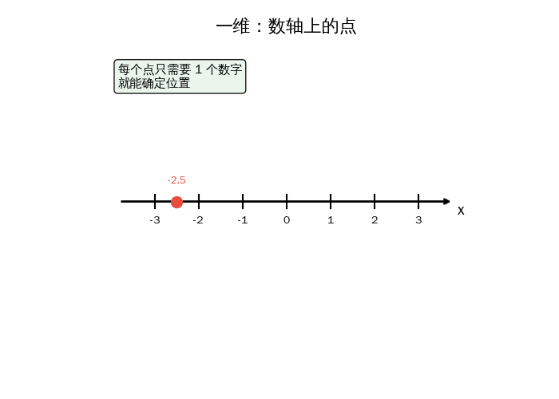
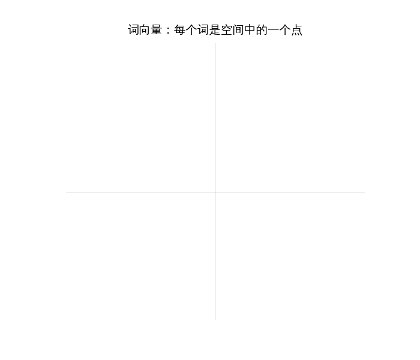

## 引言

如果有人告诉你——

> ChatGPT 不认识任何一个字。它只认识数字。

你可能会觉得奇怪。它明明能写诗、能翻译、能回答"猫为什么喜欢纸箱"。

但事实就是如此。**在 AI 的世界里，一切都是数字。** 文字是数字，图片是数字，声音也是数字。AI 做的所有事情——理解、推理、生成——都是**数字之间的计算**。

这个系列共四篇，带你从零开始理解这些计算的数学语言——**线性代数**。别被这个名字吓到。我们从最简单的东西开始：**一个数字**。

> **系列导航**
>
> 你正在读第一篇。如果你已经读过我们的 [Attention 机制文章](/ai-blog/posts/transformer-attention/)，你会在这个系列中找到很多"原来如此！"的瞬间。
>
> <div style="max-width: 500px; margin: 0.5em 0; font-size: 0.93em; line-height: 1.9;">
> <div style="border-left: 3px solid #4CAF50; padding-left: 12px; margin-bottom: 6px; background: rgba(76,175,80,0.05); padding: 8px 12px; border-radius: 0 4px 4px 0;">
> <strong>▸ 第一篇（本文）：从数轴到高维空间</strong> — 向量是什么？词怎么变成数字？</div>
> <div style="border-left: 3px solid #ccc; padding-left: 12px; margin-bottom: 6px; padding: 8px 12px; color: #888;">
> ▹ 第二篇：向量的加减法 — 点积、余弦相似度、AI 衡量"相似"的方法</div>
> <div style="border-left: 3px solid #ccc; padding-left: 12px; margin-bottom: 6px; padding: 8px 12px; color: #888;">
> ▹ 第三篇：矩阵——空间的变形术 — 矩阵如何变换空间（含动画演示）</div>
> <div style="border-left: 3px solid #ccc; padding-left: 12px; margin-bottom: 6px; padding: 8px 12px; color: #888;">
> ▹ 第四篇：矩阵乘法与 AI — 理解 Transformer 的最后一块拼图</div>
> <div style="border-left: 3px solid #ccc; padding-left: 12px; margin-bottom: 6px; padding: 8px 12px; color: #888;">
> ▹ 第五篇：激活函数——神经网络的开关</div>
> <div style="border-left: 3px solid #ccc; padding-left: 12px; padding: 8px 12px; color: #888;">
> ▹ 第六篇：梯度下降——AI 怎么学习</div>
> </div>

---

## 第一章：一个数字能描述什么？

### 温度计：最简单的例子

看看你家的温度计。上面只有**一个数字**——比如 23°C。

这一个数字就能告诉你：现在冷不冷、该穿什么衣服、要不要开空调。

**一个数字 = 一条信息。**

<div style="max-width: 500px; margin: 1.5em auto; padding: 15px 20px; border-radius: 8px; background: rgba(76,175,80,0.06); border: 1px solid rgba(76,175,80,0.2);">

<div style="font-weight: bold; margin-bottom: 10px; color: #4CAF50;">生活中"一个数字"的例子</div>

| 场景 | 数字 | 描述了什么 |
|------|------|-----------|
| 温度计 | 23°C | 冷热程度 |
| 体重秤 | 65kg | 体重 |
| 车速表 | 80km/h | 行驶速度 |
| 银行余额 | ¥3500 | 有多少钱 |

</div>

这些都可以画在一根线上——**数轴**：

<div style="max-width: 500px; margin: 1.5em auto; text-align: center; font-size: 0.95em;">

```text
冷                    舒适                    热
◄──────┼──────┼──────┼──────┼──────┼──────►
      10     15     20     25     30    (°C)
                           ▲
                      你家: 23°C
```

</div>

数轴上的每个点，只需要**一个数字**就能确定位置。数学家说这叫**一维空间**。

> **公式时间**
>
> 一维空间中的一个点 = 一个数字 x
>
> 例：温度 = 23，体重 = 65，余额 = 3500

简单吧？但一个数字能描述的东西太有限了。如果我想告诉你**一个地方在哪**，一个数字够吗？

---

## 第二章：两个数字能做什么？

### 城市地图：用两个数字定位

想象你在一个整齐的棋盘格城市（像纽约的曼哈顿）。朋友问你"星巴克在哪"，你说：

> "第 3 街，第 5 大道的路口。"

**两个数字，精确定位一个点。**

这就是数学课上的**坐标系**——一个横轴 x，一个纵轴 y，两根轴交叉。任何一个点都可以用 (x, y) 来表示。

<div style="max-width: 400px; margin: 1.5em auto;">



</div>

<div style="max-width: 500px; margin: 1em auto; padding: 12px 20px; border-radius: 8px; background: rgba(33,150,243,0.06); border: 1px solid rgba(33,150,243,0.2);">

<div style="font-weight: bold; margin-bottom: 10px; color: #2196F3;">两个数字定位的例子</div>

| 场景 | 两个数字 | 意思 |
|------|---------|------|
| GPS | (39.9°N, 116.4°E) | 北京天安门 |
| 棋盘 | (E, 4) | 国际象棋 E4 |
| 屏幕像素 | (1920, 1080) | 屏幕右下角 |
| 地图 | (3街, 5大道) | 一个路口 |

</div>

看到了吗？**从一个数字到两个数字，我们的描述能力大幅跳跃**——从线上的点，变成了平面上的点。

> **公式时间**
>
> 二维空间中的一个点 = 两个数字 (x, y)
>
> 例：星巴克 = (3, 5)，天安门 = (39.9, 116.4)

---

## 第三章：更多数字 = 更多信息

### 加到三个数字

如果那个城市的建筑有很多层楼呢？"第 3 街，第 5 大道，**12 层**"——三个数字，定位三维空间中的任何一个点。

```text
1 个数字 → 线上的点    (一维)
2 个数字 → 平面上的点  (二维)
3 个数字 → 空间中的点  (三维)
```

这三个你都能想象出来。但接下来呢？

### 游戏角色：五个数字描述一个人物

如果你玩过 RPG 游戏（角色扮演），你一定见过这样的属性卡：

<div style="max-width: 400px; margin: 1.5em auto; padding: 15px 20px; border-radius: 10px; background: linear-gradient(135deg, rgba(156,39,176,0.06), rgba(233,30,99,0.06)); border: 1px solid rgba(156,39,176,0.2);">

<div style="text-align: center; font-weight: bold; font-size: 1.1em; margin-bottom: 12px;">🗡️ 勇者·阿光</div>

| 属性 | 数值 |
|------|------|
| 攻击力 | 85 |
| 防御力 | 40 |
| 速度 | 92 |
| 生命值 | 1200 |
| 魔力 | 30 |

</div>

五个数字完整地描述了这个角色的能力。我们可以把它写成一组数字：

```text
阿光 = [85, 40, 92, 1200, 30]
```

这组数字叫做**向量**（vector）。

### 向量 = 一组有序的数字

没有什么高深的。**向量就是一串数字，按固定顺序排列。**

<div style="max-width: 500px; margin: 1.5em auto; padding: 15px 20px; border-radius: 8px; background: rgba(255,152,0,0.06); border: 1px solid rgba(255,152,0,0.2);">

<div style="font-weight: bold; margin-bottom: 10px; color: #FF9800;">向量的各种面孔</div>

| 维度 | 向量 | 描述对象 |
|------|------|---------|
| 1 维 | [23] | 一个温度 |
| 2 维 | [3, 5] | 地图上一个位置 |
| 3 维 | [3, 5, 12] | 大厦里一个房间 |
| 5 维 | [85, 40, 92, 1200, 30] | 一个游戏角色 |
| 256 维 | [0.12, -0.03, 0.87, ...] | 一个词的"含义" |

</div>

**关键认知跳跃：**

> 你没法在脑子里想象 256 维空间。没人能。
>
> **但数学完全一样。** 2 维空间里怎么计算距离、怎么比较相似度，256 维空间里用完全相同的公式。
>
> 所以不用害怕"高维"——它只是更长的数字列表。

> **公式时间**
>
> n 维向量 = n 个数字按顺序排列
>
> 写法：**v** = [v₁, v₂, v₃, ..., vₙ]
>
> 1 维是向量，2 维是向量，256 维也是向量。

---

## 第四章：AI 怎么把文字变成数字？

好了，到了关键问题：**ChatGPT 是怎么处理文字的？**

答案很简单——**它把每个词变成一个向量。**

### 词向量（Word Embedding）

在 AI 内部，有一张巨大的"词典"。这个词典不是给你查释义的，而是给每个词分配一串数字：

<div style="max-width: 520px; margin: 1.5em auto; padding: 15px 20px; border-radius: 8px; background: rgba(33,150,243,0.06); border: 1px solid rgba(33,150,243,0.2);">

```text
"国王" → [0.21, -0.45, 0.89, 0.12, ..., 0.33]   ← 256个数字
"王后" → [0.19, -0.42, 0.85, -0.15, ..., 0.30]   ← 256个数字
"汽车" → [-0.82, 0.11, -0.03, 0.67, ..., -0.21]  ← 256个数字
```

</div>

注意看"国王"和"王后"的数字：前几位很接近（0.21 vs 0.19，-0.45 vs -0.42）。而"汽车"的数字完全不同。

**这不是巧合。这些数字经过训练，让意思相近的词拥有相近的向量。**

### 类比：词向量就是超级属性卡

还记得游戏角色的 5 个属性吗？词向量是同样的概念，只不过：

<div style="max-width: 500px; margin: 1.5em auto;">

| | 游戏角色 | 词向量 |
|---|---------|--------|
| **有多少个数字** | 5 个 | 256~4096 个 |
| **每个数字的含义** | 人类定义的（攻击力、防御力...） | 机器自己学的（人类说不清） |
| **相似 = 数字接近** | 两个战士的属性很像 | "国王"和"王后"的向量很像 |

</div>

第二行很重要：**词向量的每个维度，不是人类起名的。** AI 在大量文本上训练后，自动发现了区分词义的最佳方式。我们只知道，意思接近的词，向量就接近。

### 动画：词向量空间

下面的动画展示了一个简化的二维投影——把高维词向量"压缩"到二维平面，你可以直观看到**相似的词聚在一起**：

<div style="max-width: 500px; margin: 1.5em auto;">



</div>

注意动画中的两个关键现象：

<div style="max-width: 500px; margin: 1em auto;">

<div style="border-left: 3px solid #FF9800; padding-left: 12px; margin-bottom: 12px; padding: 8px 12px; background: rgba(255,152,0,0.05); border-radius: 0 4px 4px 0;">
<strong>现象一：平行四边形</strong><br>
king - man ≈ queen - woman<br>
从 man 到 king 的"方向"，和从 woman 到 queen 的"方向"几乎一样。<br>
这个方向代表了"皇室"这个概念。
</div>

<div style="border-left: 3px solid #4CAF50; padding-left: 12px; padding: 8px 12px; background: rgba(76,175,80,0.05); border-radius: 0 4px 4px 0;">
<strong>现象二：聚类</strong><br>
动物（cat, dog, fish）聚在一起。交通工具（car, truck, bus）聚在一起。<br>
没有人告诉 AI "这些是动物"——它从文本中自己学到了。
</div>

</div>

> 如果你读过我们的 [Attention 机制文章](/ai-blog/posts/transformer-attention/)，你会记得第一章里的"雷达图"——那正是词向量的简化表示。现在你知道了：那些数字是怎么来的，以及为什么意思相近的词数字也接近。

---

## 第五章：这和 AI 有什么关系？

到这里我们建立了一个认知：

<div style="max-width: 500px; margin: 1.5em auto; padding: 20px; border-radius: 8px; background: rgba(156,39,176,0.06); border: 1px solid rgba(156,39,176,0.2); text-align: center; font-size: 1.05em; line-height: 2;">

文字 → 数字（词向量）<br>
图片 → 数字（像素值）<br>
声音 → 数字（波形采样）<br>
<strong style="color: #9C27B0; font-size: 1.1em;">一切 → 向量</strong>

</div>

但 AI 不只是**看**这些数字，它要**处理**这些数字。怎么处理？

### 第一步：比较——谁和谁相似？

"国王"和"王后"相似吗？比较它们的向量就知道了。**向量越接近，意思越接近。**

这就是搜索引擎、推荐系统、ChatGPT 理解你的话的起点。

### 第二步：变换——把向量从一个空间映射到另一个空间

AI 拿到词向量后，不是原封不动地用。它会通过一个"变换"，把词向量变成新的向量——提取出不同的信息（比如"这个词在问什么""这个词提供了什么信息"）。

**这个"变换"就是矩阵乘法。** 这是第三篇文章的内容。

### 第三步：组合——把多个向量的信息合并

一句话有很多个词，每个词都是一个向量。AI 需要让它们互相交流——"你"这个词需要知道"好"在旁边。

**这个"交流"就是注意力机制（Attention）。** 它的核心运算也是矩阵乘法。这是第四篇的内容。

<div style="max-width: 500px; margin: 1.5em auto; padding: 15px 20px; border-radius: 8px; border: 2px solid #4CAF50; background: rgba(76,175,80,0.04);">

<div style="font-weight: bold; margin-bottom: 10px; color: #4CAF50;">全景预告：四篇文章的连接</div>

```text
第一篇（本文）   → 万物变成向量（数字列表）
                      ↓
第二篇（下一篇） → 比较向量（点积、余弦相似度）
                      ↓
第三篇           → 变换向量（矩阵 × 向量）
                      ↓
第四篇           → 批量变换（矩阵 × 矩阵 = AI 的核心运算）
```

</div>

---

## 第六章：动手验证

光说不练假把式。下面是我们在 AI 实验 VM 上用 Python + NumPy 实际跑的实验：给三个词分配简化的 5 维向量（真实模型用 256 维以上，原理完全一样），然后计算它们之间的距离。

*以下命令在 Ubuntu 22.04 + Python 3.10 环境中执行：*

```bash
azureuser@ai-lab:~$ source ~/ai-lab-venv/bin/activate
(ai-lab-venv) azureuser@ai-lab:~$ python3
```

```python
>>> import numpy as np
>>>
>>> # 给三个词分配简化的 5 维向量（真实模型用 256 维以上）
>>> king  = np.array([0.9, 0.8, 0.1, 0.3, 0.7])   # 皇室 + 男性
>>> queen = np.array([0.8, 0.2, 0.1, 0.3, 0.7])   # 皇室 + 女性
>>> car   = np.array([0.1, 0.5, 0.9, 0.8, 0.1])   # 交通工具
>>>
>>> # 计算欧氏距离（越小越相似）
>>> print(f"king ↔ queen 距离: {np.linalg.norm(king - queen):.2f}")
king ↔ queen 距离: 0.61
>>> print(f"king ↔ car   距离: {np.linalg.norm(king - car):.2f}")
king ↔ car   距离: 1.41
```

> **结果解读：** 0.61 vs 1.41 —— king 和 queen 的距离只有 king 和 car 的一半不到。**向量越接近，语义越接近。**

继续验证"平行四边形"关系——king − man ≈ queen − woman：

```python
>>> man   = np.array([0.2, 0.9, 0.1, 0.2, 0.5])
>>> woman = np.array([0.1, 0.1, 0.1, 0.2, 0.5])
>>>
>>> print(f"king  - man   = {king - man}")
king  - man   = [ 0.7 -0.1  0.   0.1  0.2]
>>> print(f"queen - woman = {queen - woman}")
queen - woman = [0.7 0.1 0.  0.1 0.2]
>>>
>>> # 两个"方向向量"之间的距离
>>> print(f"两个方向的距离: {np.linalg.norm((king-man) - (queen-woman)):.2f}")
两个方向的距离: 0.20
```

> **结果解读：** 距离只有 0.20，几乎一样！从 man 到 king 的"方向"和从 woman 到 queen 的"方向"高度一致——**"皇室"这个概念被编码成了一个方向。**

---

## 本章小结

<div style="max-width: 520px; margin: 1.5em auto; padding: 20px; border-radius: 8px; border: 2px solid #FF9800; background: rgba(255,152,0,0.04);">

<div style="font-weight: bold; margin-bottom: 12px; font-size: 1.05em;">本篇核心要点</div>

**一、用数字描述一切**
- 1 个数字 → 数轴上的点（温度、体重）
- 2 个数字 → 平面上的点（地图坐标）
- N 个数字 → N 维空间中的点（游戏属性卡）

**二、向量 = 一串有序的数字**
- 写法：v = [v₁, v₂, ..., vₙ]
- 256 维向量不比 2 维向量更"难"，只是更长

**三、AI 把每个词变成向量**
- 词向量 = 几百个数字，描述一个词的"含义"
- 意思相近的词 → 向量相近 → 空间中距离更短
- king - man ≈ queen - woman（向量的方向蕴含语义关系）

**四、这是一切 AI 计算的起点**
- 神经网络不认字，只认向量
- 后续的所有操作（比较、变换、组合）都是对向量的数学运算

</div>

---

## 下一篇预告

我们已经知道万物可以变成向量。下一个问题是：

> **怎么衡量两个向量有多相似？**

答案是一个简单到令人惊讶的运算——**点积**。它是 AI 里最重要的单步运算，ChatGPT 每次回答你的问题，都要执行数万亿次点积。

下一篇：**AI 的数学语言（二）：向量的加减法——数字世界的方向与距离**

---

<div style="margin-top: 30px; padding-top: 20px; border-top: 1px solid #e0e0e0; font-size: 0.9em; color: #888; line-height: 1.8;">

本文首发于「AI 学习笔记」博客：https://Jason-Azure.github.io/ai-blog/<br>
微信公众号：AI-lab学习笔记<br>
系列文章完整列表见 [标签：线性代数](/ai-blog/tags/线性代数/)

</div>
