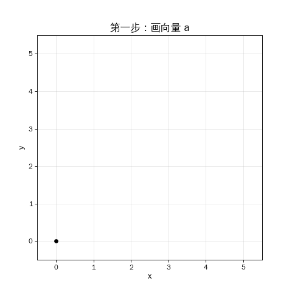
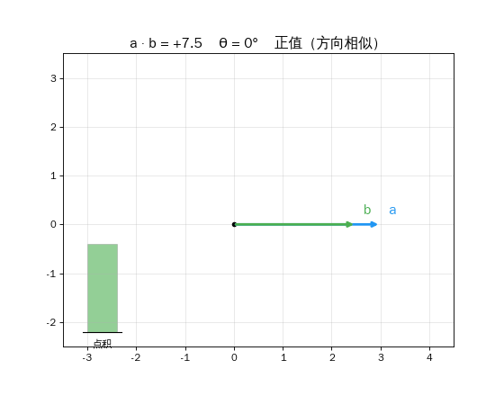
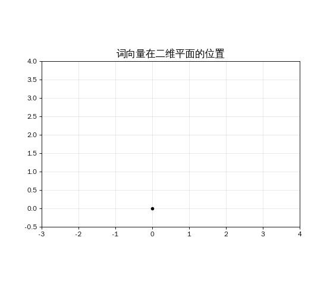

## 引言

上一篇我们建立了一个关键认知：**万物皆可用一串数字（向量）来描述。**

但光有数字还不够。AI 要用这些数字做事——第一件事就是：

> **比较。** 两个词有多相似？两张图有多接近？用户搜索的内容和哪篇文章最匹配？

今天这篇，我们从向量最基本的运算——加法和减法开始，一步步走到 AI 衡量相似度的核心工具：**点积**和**余弦相似度**。

> **系列导航**
>
> <div style="max-width: 500px; margin: 0.5em 0; font-size: 0.93em; line-height: 1.9;">
> <div style="border-left: 3px solid #ccc; padding-left: 12px; margin-bottom: 6px; padding: 8px 12px; color: #888;">
> ▹ 第一篇：从数轴到高维空间 — 向量是什么？词怎么变成数字？</div>
> <div style="border-left: 3px solid #4CAF50; padding-left: 12px; margin-bottom: 6px; background: rgba(76,175,80,0.05); padding: 8px 12px; border-radius: 0 4px 4px 0;">
> <strong>▸ 第二篇（本文）：向量的加减法</strong> — 点积、余弦相似度、AI 衡量"相似"的方法</div>
> <div style="border-left: 3px solid #ccc; padding-left: 12px; margin-bottom: 6px; padding: 8px 12px; color: #888;">
> ▹ 第三篇：矩阵——空间的变形术 — 矩阵如何变换空间（含动画演示）</div>
> <div style="border-left: 3px solid #ccc; padding-left: 12px; padding: 8px 12px; color: #888;">
> ▹ 第四篇：矩阵乘法与 AI — 理解 Transformer 的最后一块拼图</div>
> </div>

---

## 第一章：向量的加法——首尾相接

### 超市购物：最直观的类比

假设你用一个向量记录每次超市购物：[苹果数, 面包数, 牛奶数]。

```text
第一次购物 = [2, 3, 1]   ← 2个苹果, 3个面包, 1瓶牛奶
第二次购物 = [1, 0, 2]   ← 1个苹果, 0个面包, 2瓶牛奶
```

两次一共买了多少？**对应位置相加**：

```text
[2, 3, 1] + [1, 0, 2] = [3, 3, 3]
```

就是这么简单。**向量加法 = 对应位置的数字相加。**

### 几何视角：首尾相接

如果把向量画在坐标系上，加法的几何意义是**首尾相接**——把第二个向量的"起点"接到第一个向量的"终点"，然后从原点到最终位置画一条新箭头。

<div style="max-width: 400px; margin: 1.5em auto;">



</div>

> **公式时间**
>
> 向量加法：[a₁, a₂] + [b₁, b₂] = [a₁+b₁, a₂+b₂]
>
> 例：[3, 1] + [1, 3] = [4, 4]

### 向量的减法——方向反过来

减法就是加法的反面：**对应位置相减**。

```text
[3, 1] - [1, 3] = [2, -2]
```

几何上，a − b 表示**从 b 指向 a 的方向**。还记得上一篇的 king − man ≈ queen − woman 吗？那就是**用减法提取两个词之间的"关系方向"**。

---

## 第二章：向量有多长？——范数

在比较两个向量之前，我们先回答一个更基本的问题：**一个向量有多"长"？**

### 勾股定理的推广

二维向量 [3, 4] 在坐标系上就是一个直角三角形的斜边。它的长度？勾股定理：

```text
|[3, 4]| = √(3² + 4²) = √(9 + 16) = √25 = 5
```

推广到任意维度：

> **公式时间**
>
> 向量 v = [v₁, v₂, ..., vₙ] 的长度（范数）：
>
> **||v|| = √(v₁² + v₂² + ... + vₙ²)**
>
> 2 维、5 维、256 维——公式一模一样，只是加的项数不同。

### 单位向量：只保留方向

把向量除以它的长度，就得到**单位向量**——长度为 1，只保留方向信息。

```text
[3, 4] 的单位向量 = [3/5, 4/5] = [0.60, 0.80]
```

这一步在 AI 中极其重要——比较两个词的"意思"时，我们通常只关心**方向**，不关心"长度"。

---

## 第三章：点积——AI 最重要的单步运算

现在到了重头戏。**点积（Dot Product）** 是 AI 里使用频率最高的运算——ChatGPT 每回答你一句话，内部都要执行数万亿次点积。

### 计算方法：对应相乘，再加起来

```text
a = [1, 2, 3]
b = [4, 5, 6]

a · b = 1×4 + 2×5 + 3×6
     = 4 + 10 + 18
     = 32
```

就是这么简单。**对应位置相乘，结果全部加起来，得到一个数字。**

> **公式时间**
>
> a · b = a₁×b₁ + a₂×b₂ + ... + aₙ×bₙ
>
> 两个向量进去，一个数字出来。

### 点积的秘密：它在测量"方向一致性"

点积的结果不仅仅是一个数字。它藏着一个深刻的几何含义：

<div style="max-width: 520px; margin: 1.5em auto; padding: 15px 20px; border-radius: 8px; background: rgba(33,150,243,0.06); border: 1px solid rgba(33,150,243,0.2);">

| 点积值 | 含义 | 类比 |
|--------|------|------|
| **大正数** | 方向很一致 | 两人同路 |
| **≈ 0** | 几乎垂直，无关 | 十字路口各走各的 |
| **大负数** | 方向相反 | 面对面迎头走来 |

</div>

下面的动画让你直观看到这个关系——当向量 b 绕一圈旋转时，点积值随角度变化：

<div style="max-width: 500px; margin: 1.5em auto;">



</div>

<div style="max-width: 500px; margin: 1em auto;">

<div style="border-left: 3px solid #4CAF50; padding-left: 12px; margin-bottom: 8px; padding: 8px 12px; background: rgba(76,175,80,0.05); border-radius: 0 4px 4px 0;">
<strong>同方向</strong>（0°附近）：点积为正，值最大</div>

<div style="border-left: 3px solid #FF9800; padding-left: 12px; margin-bottom: 8px; padding: 8px 12px; background: rgba(255,152,0,0.05); border-radius: 0 4px 4px 0;">
<strong>垂直</strong>（90°/ 270°）：点积为零</div>

<div style="border-left: 3px solid #f44336; padding-left: 12px; padding: 8px 12px; background: rgba(244,67,54,0.05); border-radius: 0 4px 4px 0;">
<strong>反方向</strong>（180°附近）：点积为负，值最小</div>

</div>

> 如果你读过我们的 [Attention 机制文章](/ai-blog/posts/transformer-attention/)，你会记得 Q · K 这一步——"查询向量和键向量的点积"。现在你知道了：**那就是在算两个向量的方向有多一致**，也就是"这个词和那个词有多相关"。

---

## 第四章：余弦相似度——消除"大嗓门"的影响

点积有一个小问题：它不仅受**方向**影响，还受**长度**影响。

打个比方：两个人喊同一句话。一个小声说，一个用喇叭喊——他们说的话一模一样，只是"音量"不同。点积会因为"音量"大的那个给出更大的值，但我们其实只关心他们说的内容是否一致。

### 解决方案：除以长度

> **公式时间**
>
> 余弦相似度 = 点积 ÷ (向量 a 的长度 × 向量 b 的长度)
>
> **cos(a, b) = (a · b) / (||a|| × ||b||)**
>
> 结果范围：-1（完全相反）到 +1（完全一致）

除以长度后，只剩下纯粹的**方向信息**。这就是**余弦相似度**——AI 世界里最常用的相似度衡量方式。

<div style="max-width: 520px; margin: 1.5em auto; padding: 15px 20px; border-radius: 8px; background: rgba(156,39,176,0.06); border: 1px solid rgba(156,39,176,0.2);">

| 余弦值 | 意思 | 例子 |
|--------|------|------|
| **1.0** | 完全一致 | 同一个词 |
| **0.9+** | 非常相似 | "国王" vs "王后" |
| **0.3~0.7** | 有点关系 | "国王" vs "汽车" |
| **≈ 0** | 毫不相关 | 随机两个词 |
| **-1.0** | 完全相反 | "热" vs "冷"（理想情况） |

</div>

### 动画：词向量的角度

下面的动画展示了不同词向量之间的角度关系——角度越小，余弦相似度越高，意思越接近：

<div style="max-width: 500px; margin: 1.5em auto;">



</div>

---

## 第五章：动手验证

在我们的 AI 实验 VM 上实际验证这些运算。

*以下命令在 Ubuntu 22.04 + Python 3.10 环境中执行：*

```bash
azureuser@ai-lab:~$ source ~/ai-lab-venv/bin/activate
(ai-lab-venv) azureuser@ai-lab:~$ python3
```

### 实验一：点积计算

```python
>>> import numpy as np
>>>
>>> a = np.array([1, 2, 3])
>>> b = np.array([4, 5, 6])
>>> print(f"a · b = 1×4 + 2×5 + 3×6 = {np.dot(a, b)}")
a · b = 1×4 + 2×5 + 3×6 = 32
```

### 实验二：余弦相似度——词向量比较

```python
>>> # 定义余弦相似度函数
>>> def cosine_sim(v1, v2):
...     return np.dot(v1, v2) / (np.linalg.norm(v1) * np.linalg.norm(v2))
>>>
>>> # 沿用上一篇的简化词向量
>>> king  = np.array([0.9, 0.8, 0.1, 0.3, 0.7])
>>> queen = np.array([0.8, 0.2, 0.1, 0.3, 0.7])
>>> car   = np.array([0.1, 0.5, 0.9, 0.8, 0.1])
>>>
>>> print(f"cos(king, queen) = {cosine_sim(king, queen):.4f}")
cos(king, queen) = 0.9133
>>> print(f"cos(king, car)   = {cosine_sim(king, car):.4f}")
cos(king, car)   = 0.4751
>>> print(f"cos(queen, car)  = {cosine_sim(queen, car):.4f}")
cos(queen, car)  = 0.3924
```

> **结果解读：** king ↔ queen 余弦值 0.91（非常相似），king ↔ car 只有 0.48（不太相关）。**余弦相似度完美区分了语义关系。**

### 实验三：向量范数

```python
>>> v = np.array([3, 4])
>>> print(f"v = {v}, ||v|| = {np.linalg.norm(v):.2f}")
v = [3 4], ||v|| = 5.00
>>>
>>> # 单位向量：除以长度，只保留方向
>>> unit_v = v / np.linalg.norm(v)
>>> print(f"单位向量 = {unit_v}, 长度 = {np.linalg.norm(unit_v):.2f}")
单位向量 = [0.6 0.8], 长度 = 1.00
```

> **结果解读：** [3, 4] 的长度正好是 5（勾股定理），除以长度后得到 [0.6, 0.8]，长度正好是 1.00。

---

## 第六章：这些运算在 AI 里怎么用？

学了加法、减法、范数、点积、余弦相似度——它们在真实 AI 系统中的用途是什么？

<div style="max-width: 520px; margin: 1.5em auto; padding: 15px 20px; border-radius: 8px; background: rgba(33,150,243,0.06); border: 1px solid rgba(33,150,243,0.2);">

| 运算 | AI 中的用途 |
|------|-----------|
| **向量加法** | 合并多个信号（残差连接、Embedding 叠加） |
| **向量减法** | 提取语义关系（king − man + woman ≈ queen） |
| **点积** | Attention 机制的核心（Q · K 算注意力分数） |
| **余弦相似度** | 语义搜索、推荐系统、RAG 检索 |
| **范数** | Layer Norm（归一化层，每层都用） |

</div>

尤其是**点积**——在 Transformer 的 Attention 机制中，每个 token 都要和所有其他 token 做点积，来决定"该关注谁"。ChatGPT 处理一句话时，可能要算几万亿次点积。

> 但目前我们只能比较向量。下一个问题是：**怎么改变一个向量？** 比如把词向量"国王"变成"这个词想问什么"——这种变换需要一个新工具：**矩阵**。

---

## 本章小结

<div style="max-width: 520px; margin: 1.5em auto; padding: 20px; border-radius: 8px; border: 2px solid #FF9800; background: rgba(255,152,0,0.04);">

<div style="font-weight: bold; margin-bottom: 12px; font-size: 1.05em;">本篇核心要点</div>

**一、向量加减法**
- 加法：对应位置相加，几何上首尾相接
- 减法：对应位置相减，表示两个向量的"差异方向"

**二、向量的长度（范数）**
- ||v|| = √(v₁² + v₂² + ... + vₙ²)，勾股定理的推广
- 除以长度 = 单位向量，只保留方向

**三、点积 = AI 最核心的单步运算**
- 计算：对应相乘再求和，a · b = Σ aᵢ × bᵢ
- 意义：衡量方向一致性（正=同向，0=垂直，负=反向）

**四、余弦相似度 = 标准化的点积**
- cos(a, b) = 点积 / (||a|| × ||b||)，范围 [-1, 1]
- 消除长度影响，只比较方向 → AI 衡量语义相似的标准工具

</div>

---

## 下一篇预告

到目前为止，我们学会了用向量描述万物，也学会了比较向量。但 AI 不只是**比较**——它要**变换**。

> **把一个向量变成另一个向量——旋转、拉伸、投影——这就是矩阵的魔法。**

下一篇：**AI 的数学语言（三）：矩阵——空间的变形术**

---

<div style="margin-top: 30px; padding-top: 20px; border-top: 1px solid #e0e0e0; font-size: 0.9em; color: #888; line-height: 1.8;">

本文首发于「AI 学习笔记」博客：https://Jason-Azure.github.io/ai-blog/<br>
微信公众号：AI-lab学习笔记<br>
系列文章完整列表见 [标签：线性代数](/ai-blog/tags/线性代数/)

</div>
