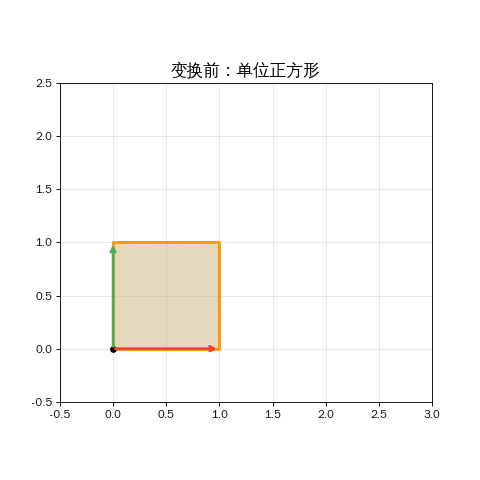
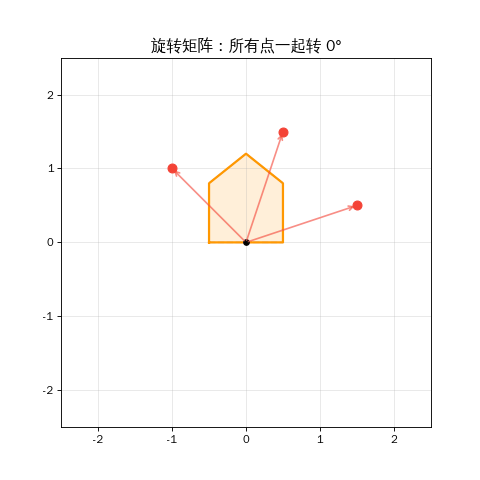

## 引言

前两篇我们掌握了：**向量**（用数字描述万物）和**点积**（比较两个向量有多相似）。

但 AI 不仅仅比较——它要**变换**。

> 在 Transformer 中，每个词向量都要经过**三次不同的变换**，变成 Q（查询）、K（键）、V（值）三个新向量。做这件事的工具就是**矩阵**。

今天这篇，我们从最直观的"空间变形"开始，理解矩阵到底在做什么。

> **系列导航**
>
> <div style="max-width: 500px; margin: 0.5em 0; font-size: 0.93em; line-height: 1.9;">
> <div style="border-left: 3px solid #ccc; padding-left: 12px; margin-bottom: 6px; padding: 8px 12px; color: #888;">
> ▹ 第一篇：从数轴到高维空间</div>
> <div style="border-left: 3px solid #ccc; padding-left: 12px; margin-bottom: 6px; padding: 8px 12px; color: #888;">
> ▹ 第二篇：向量的加减法 — 点积与余弦相似度</div>
> <div style="border-left: 3px solid #4CAF50; padding-left: 12px; margin-bottom: 6px; background: rgba(76,175,80,0.05); padding: 8px 12px; border-radius: 0 4px 4px 0;">
> <strong>▸ 第三篇（本文）：矩阵——空间的变形术</strong></div>
> <div style="border-left: 3px solid #ccc; padding-left: 12px; padding: 8px 12px; color: #888;">
> ▹ 第四篇：矩阵乘法与 AI — 理解 Transformer 的最后一块拼图</div>
> </div>

---

## 第一章：矩阵是什么？

### 一张数字表格

向量是一行数字。矩阵就是**把好几个向量摞在一起**——一张数字表格：

```text
向量: [1, 2, 3]               ← 1 行 3 列

矩阵: [[1, 2, 3],             ← 2 行 3 列
        [4, 5, 6]]
```

矩阵的大小用**"行 × 列"**来描述。上面是一个 2×3 矩阵（2 行 3 列）。

### 矩阵的超能力：变换向量

矩阵最重要的用途不是存数据，而是**变换向量**。想象它是一台"加工机"：

```text
原向量 → [ 矩阵加工机 ] → 新向量

输入: 5维词向量    输出: 3维查询向量
"国王" [0.9, 0.8, 0.1, 0.3, 0.7]  →  W_q  →  [0.35, 0.68, -1.27]
```

这就是**矩阵 × 向量**——AI 里最核心的操作之一。

---

## 第二章：矩阵 × 向量 = 空间变换

### 怎么算：每行和向量做点积

矩阵乘以向量的计算，其实就是**矩阵的每一行和向量分别做点积**：

```text
矩阵 M = [[2, 0],     向量 v = [3, 1]
           [0, 3]]

M × v = [第1行 · v,  第2行 · v]
      = [2×3 + 0×1,  0×3 + 3×1]
      = [6, 3]
```

看到了吗？输入 [3, 1]，输出 [6, 3]。x 方向放大了 2 倍，y 方向放大了 3 倍。**这个矩阵是一个缩放变换。**

> **公式时间**
>
> 矩阵 M (m×n) × 向量 v (n×1) = 新向量 (m×1)
>
> 每行和 v 做点积，得到结果的一个分量。

### 动画：矩阵把正方形变成平行四边形

下面的动画展示了一个矩阵作用于整个正方形区域——**每个点都被同一个矩阵变换**，正方形变成了平行四边形：

<div style="max-width: 400px; margin: 1.5em auto;">



</div>

<div style="max-width: 500px; margin: 1em auto;">

<div style="border-left: 3px solid #f44336; padding-left: 12px; margin-bottom: 8px; padding: 8px 12px; background: rgba(244,67,54,0.05); border-radius: 0 4px 4px 0;">
<strong>红色箭头</strong>：原来的 (1, 0) 被变换到新位置 — 这是矩阵第一列</div>

<div style="border-left: 3px solid #4CAF50; padding-left: 12px; padding: 8px 12px; background: rgba(76,175,80,0.05); border-radius: 0 4px 4px 0;">
<strong>绿色箭头</strong>：原来的 (0, 1) 被变换到新位置 — 这是矩阵第二列</div>

</div>

> **关键洞察：** 只要你知道矩阵把 (1,0) 和 (0,1) 变到了哪里，就能知道它把**任何点**变到哪里。矩阵的两列，就是这两个基础方向的"新位置"。

---

## 第三章：常见的变换类型

不同的矩阵 = 不同的变换。这里是三种最直观的：

<div style="max-width: 520px; margin: 1.5em auto; padding: 15px 20px; border-radius: 8px; background: rgba(33,150,243,0.06); border: 1px solid rgba(33,150,243,0.2);">

| 变换类型 | 矩阵示例 | 效果 |
|---------|---------|------|
| **缩放** | `[[2, 0], [0, 3]]` | x 放大 2 倍，y 放大 3 倍 |
| **旋转** | `[[0.71, -0.71], [0.71, 0.71]]` | 逆时针旋转 45° |
| **投影** | `3×5 矩阵` | 5 维压缩到 3 维 |

</div>

### 动画：旋转矩阵——整个空间一起转

旋转矩阵是最优美的变换——所有点保持原来的距离和角度关系，只是整体旋转了一个角度：

<div style="max-width: 400px; margin: 1.5em auto;">



</div>

---

## 第四章：AI 里的矩阵——Q、K、V 投影

在 Transformer 中，矩阵最重要的用途是把词向量变成三个新向量：

```text
词向量 "国王" → W_q → 查询向量 Q  ("我在找什么？")
词向量 "国王" → W_k → 键向量   K  ("我能提供什么？")
词向量 "国王" → W_v → 值向量   V  ("我的具体内容")
```

这三个矩阵 W_q、W_k、W_v 不是人类设计的——它们是 AI 在训练中**自己学到的**。训练的目标是找到最好的变换方式，让模型能准确预测下一个词。

<div style="max-width: 500px; margin: 1.5em auto; padding: 15px 20px; border-radius: 8px; background: rgba(156,39,176,0.06); border: 1px solid rgba(156,39,176,0.2);">

<div style="font-weight: bold; margin-bottom: 10px; color: #9C27B0;">为什么需要不同的变换？</div>

同一个词在不同角色下需要不同的表示：

- **当它在"找东西"时**（Q）：强调"我需要什么信息"
- **当它在"被找"时**（K）：强调"我是什么类型的信息"
- **当它在"传递内容"时**（V）：强调"我的实际内容是什么"

</div>

矩阵还有一个关键能力：**改变向量的维度**。一个 3×5 矩阵可以把 5 维向量变成 3 维向量——这就是"降维"或"投影"。

---

## 第五章：动手验证

*以下命令在 Ubuntu 22.04 + Python 3.10 环境中执行：*

```bash
azureuser@ai-lab:~$ source ~/ai-lab-venv/bin/activate
(ai-lab-venv) azureuser@ai-lab:~$ python3
```

### 实验一：旋转矩阵

```python
>>> import numpy as np
>>>
>>> # 45度旋转矩阵
>>> theta = np.pi / 4
>>> R = np.array([[np.cos(theta), -np.sin(theta)],
...               [np.sin(theta),  np.cos(theta)]])
>>> print(f"R = [[{R[0,0]:.2f}, {R[0,1]:.2f}], [{R[1,0]:.2f}, {R[1,1]:.2f}]]")
R = [[0.71, -0.71], [0.71, 0.71]]
>>>
>>> v = np.array([1, 0])  # 指向右边的单位向量
>>> print(f"R × [1, 0] = [{(R @ v)[0]:.2f}, {(R @ v)[1]:.2f}]")
R × [1, 0] = [0.71, 0.71]
```

> **结果解读：** (1, 0) 旋转 45° 后变成 (0.71, 0.71) — 正好是 45° 方向的单位向量！

### 实验二：模拟 Transformer 的 Q 投影

```python
>>> # 模拟 W_q: 把 5 维词向量投影到 3 维查询空间
>>> np.random.seed(42)
>>> W_q = np.random.randn(3, 5) * 0.5
>>>
>>> king = np.array([0.9, 0.8, 0.1, 0.3, 0.7])
>>> q_king = W_q @ king
>>> print(f"king (5维) = {king}")
king (5维) = [0.9 0.8 0.1 0.3 0.7]
>>> print(f"q_king (3维) = [{', '.join(f'{x:.2f}' for x in q_king)}]")
q_king (3维) = [0.35, 0.68, -1.27]
```

> **结果解读：** 5 维词向量经过 3×5 矩阵，变成了 3 维查询向量。**矩阵完成了降维投影！**

### 实验三：矩阵改变向量之间的关系

```python
>>> queen = np.array([0.8, 0.2, 0.1, 0.3, 0.7])
>>> q_queen = W_q @ queen
>>>
>>> # 比较变换前后的余弦相似度
>>> cos_before = np.dot(king, queen) / (np.linalg.norm(king) * np.linalg.norm(queen))
>>> cos_after = np.dot(q_king, q_queen) / (np.linalg.norm(q_king) * np.linalg.norm(q_queen))
>>> print(f"变换前 cos(king, queen) = {cos_before:.4f}")
变换前 cos(king, queen) = 0.9133
>>> print(f"变换后 cos(q_king, q_queen) = {cos_after:.4f}")
变换后 cos(q_king, q_queen) = 0.9570
```

> **结果解读：** 变换前 0.91，变换后 0.96。矩阵不仅改变了向量本身，还**改变了向量之间的关系**。AI 训练的目标就是找到能让"有用的关系"变得更明显的矩阵。

---

## 本章小结

<div style="max-width: 520px; margin: 1.5em auto; padding: 20px; border-radius: 8px; border: 2px solid #FF9800; background: rgba(255,152,0,0.04);">

<div style="font-weight: bold; margin-bottom: 12px; font-size: 1.05em;">本篇核心要点</div>

**一、矩阵 = 向量的加工机**
- 输入一个向量，输出一个新向量
- 计算方法：矩阵每行和向量做点积

**二、矩阵 = 空间变换**
- 缩放、旋转、投影——都是矩阵
- 矩阵的列 = 基向量被变换到的新位置

**三、AI 用矩阵做 Q、K、V 投影**
- 同一个词向量经过三个不同矩阵 → 三种不同角色
- 矩阵是训练出来的——AI 自己学习最好的变换方式

**四、矩阵可以改变维度**
- m×n 矩阵：n 维向量 → m 维向量
- 这就是降维/升维/投影的数学本质

</div>

---

## 下一篇预告

一个矩阵变换一个向量——这我们会了。但如果有**一百个词**同时需要变换呢？一个一个算太慢了。

> **把一百个词向量摞成一个矩阵，和变换矩阵相乘——一步搞定！** 这就是矩阵乘法，也是 GPU 被称为"AI 芯片"的根本原因。

下一篇（完结）：**AI 的数学语言（四）：矩阵乘法与 AI——理解 Transformer 的最后一块拼图**

---

<div style="margin-top: 30px; padding-top: 20px; border-top: 1px solid #e0e0e0; font-size: 0.9em; color: #888; line-height: 1.8;">

本文首发于「AI 学习笔记」博客：https://Jason-Azure.github.io/ai-blog/<br>
微信公众号：AI-lab学习笔记<br>
系列文章完整列表见 [标签：线性代数](/ai-blog/tags/线性代数/)

</div>
