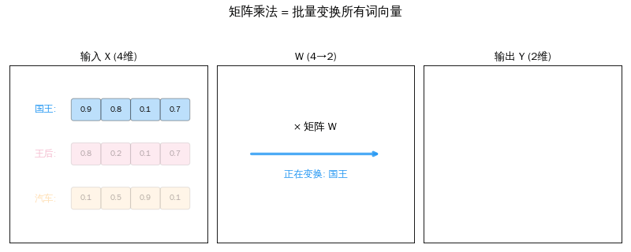
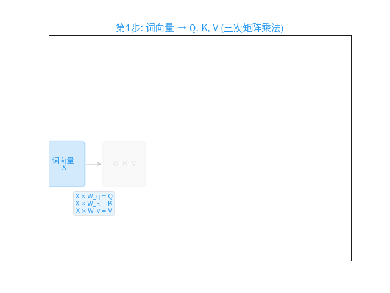

## 引言

恭喜你走到了这个系列的最后一篇。回顾一下我们的路径：

```text
第一篇: 万物 → 向量（一串数字）
第二篇: 向量 → 比较（点积、余弦相似度）
第三篇: 向量 → 变换（矩阵 × 向量）
第四篇: 批量变换 → Attention 的完整公式
```

今天，我们把所有零件组装在一起，看到 Transformer 的核心公式：

<div style="max-width: 520px; margin: 1.5em auto; padding: 20px; border-radius: 8px; background: #FFF9C4; border: 2px solid #FF9800; text-align: center;">

**Attention(Q, K, V) = softmax(QKᵀ / √dₖ) × V**

</div>

这个公式里的每一步，你都已经学过了。今天只是把它们串起来。

> **系列导航**
>
> <div style="max-width: 500px; margin: 0.5em 0; font-size: 0.93em; line-height: 1.9;">
> <div style="border-left: 3px solid #ccc; padding-left: 12px; margin-bottom: 6px; padding: 8px 12px; color: #888;">
> ▹ 第一篇：从数轴到高维空间</div>
> <div style="border-left: 3px solid #ccc; padding-left: 12px; margin-bottom: 6px; padding: 8px 12px; color: #888;">
> ▹ 第二篇：向量的加减法 — 点积与余弦相似度</div>
> <div style="border-left: 3px solid #ccc; padding-left: 12px; margin-bottom: 6px; padding: 8px 12px; color: #888;">
> ▹ 第三篇：矩阵——空间的变形术</div>
> <div style="border-left: 3px solid #4CAF50; padding-left: 12px; background: rgba(76,175,80,0.05); padding: 8px 12px; border-radius: 0 4px 4px 0;">
> <strong>▸ 第四篇（本文）：矩阵乘法与 AI</strong> — 理解 Transformer 的最后一块拼图</div>
> <div style="border-left: 3px solid #ccc; padding-left: 12px; margin-bottom: 6px; padding: 8px 12px; color: #888;">
> ▹ 第五篇：激活函数——神经网络的开关</div>
> <div style="border-left: 3px solid #ccc; padding-left: 12px; padding: 8px 12px; color: #888;">
> ▹ 第六篇：梯度下降——AI 怎么学习</div>
> </div>

---

## 第一章：矩阵 × 矩阵 = 批量变换

### 从一个词到一百个词

上一篇我们学了矩阵 × 向量——把一个词向量变成新向量。但一句话有很多词，每个都要变换。

聪明的做法：**把所有词向量摞成一个矩阵，和变换矩阵一次相乘。**

```text
X = [[国王的向量],        W = 变换矩阵       Y = X × W
     [王后的向量],   ×                =   [[q_国王],
     [汽车的向量]]                           [q_王后],
                                            [q_汽车]]
  3 个词 × 4 维     4 × 3 矩阵      3 个词 × 3 维
```

**一次矩阵乘法 = 同时变换所有词。** 这就是 GPU 擅长的事——大规模并行计算。

<div style="max-width: 500px; margin: 1.5em auto;">



</div>

> **公式时间**
>
> 矩阵乘法：A (m×n) × B (n×p) = C (m×p)
>
> C 的第 i 行第 j 列 = A 的第 i 行和 B 的第 j 列做点积。

---

## 第二章：Attention 的四步公式

有了矩阵乘法，我们可以用四步写出完整的 Attention 机制：

<div style="max-width: 520px; margin: 1.5em auto;">

<div style="border-left: 4px solid #2196F3; padding: 12px 16px; margin-bottom: 12px; background: rgba(33,150,243,0.05); border-radius: 0 4px 4px 0;">
<strong>第 1 步：三次投影</strong><br>
Q = X × W_q　　K = X × W_k　　V = X × W_v<br>
<span style="color: #888; font-size: 0.9em;">（三次矩阵乘法，词向量变成三种角色）</span></div>

<div style="border-left: 4px solid #FF9800; padding: 12px 16px; margin-bottom: 12px; background: rgba(255,152,0,0.05); border-radius: 0 4px 4px 0;">
<strong>第 2 步：计算注意力分数</strong><br>
scores = Q × Kᵀ / √d<br>
<span style="color: #888; font-size: 0.9em;">（每个词和所有词做点积，再缩放。又是矩阵乘法）</span></div>

<div style="border-left: 4px solid #9C27B0; padding: 12px 16px; margin-bottom: 12px; background: rgba(156,39,176,0.05); border-radius: 0 4px 4px 0;">
<strong>第 3 步：Softmax 归一化</strong><br>
weights = softmax(scores)<br>
<span style="color: #888; font-size: 0.9em;">（把分数变成概率，加起来 = 1。逐元素运算，不是矩阵乘法）</span></div>

<div style="border-left: 4px solid #4CAF50; padding: 12px 16px; background: rgba(76,175,80,0.05); border-radius: 0 4px 4px 0;">
<strong>第 4 步：加权求和</strong><br>
output = weights × V<br>
<span style="color: #888; font-size: 0.9em;">（用权重"混合"所有词的 V 向量。最后一次矩阵乘法）</span></div>

</div>

<div style="max-width: 500px; margin: 1.5em auto;">



</div>

四步中有**三步是矩阵乘法**。这就是为什么 GPU（擅长大规模并行矩阵运算的芯片）成了 AI 的核心硬件。

---

## 第三章：动手验证——完整 Attention 流程

*以下命令在 Ubuntu 22.04 + Python 3.10 环境中执行：*

```bash
azureuser@ai-lab:~$ source ~/ai-lab-venv/bin/activate
(ai-lab-venv) azureuser@ai-lab:~$ python3
```

### 实验一：矩阵乘法 = 批量投影

```python
>>> import numpy as np
>>>
>>> # 3 个词，每个 4 维
>>> X = np.array([
...     [0.9, 0.8, 0.1, 0.7],   # 国王
...     [0.8, 0.2, 0.1, 0.7],   # 王后
...     [0.1, 0.5, 0.9, 0.1],   # 汽车
... ])
>>>
>>> # W_q: 4维 → 3维
>>> np.random.seed(42)
>>> W_q = np.random.randn(4, 3) * 0.5
>>> Q = X @ W_q   # 一次矩阵乘法，3个词同时投影！
>>>
>>> print("Q (3个词 × 3维):")
Q (3个词 × 3维):
>>> for name, q in zip(["国王","王后","汽车"], Q):
...     print(f"  q_{name}: [{', '.join(f'{x:.2f}' for x in q)}]")
  q_国王: [1.10, -0.28, 0.01]
  q_王后: [0.62, -0.20, 0.05]
  q_汽车: [1.14, 0.26, -0.26]
```

### 实验二：Q × Kᵀ = 注意力分数

```python
>>> W_k = np.random.randn(4, 3) * 0.5
>>> K = X @ W_k
>>>
>>> # Attention 分数 = Q × K^T / √d
>>> d_k = K.shape[1]
>>> scores = (Q @ K.T) / np.sqrt(d_k)
>>> print(f"注意力分数 (Q × K^T / √{d_k}):")
注意力分数 (Q × K^T / √3):
>>> for name, s in zip(["国王","王后","汽车"], scores):
...     print(f"  {name} → [{', '.join(f'{x:.2f}' for x in s)}]")
  国王 → [0.05, 0.09, -0.19]
  王后 → [0.04, 0.05, -0.07]
  汽车 → [-0.19, -0.03, -0.59]
```

### 实验三：Softmax → 注意力权重

```python
>>> def softmax(x):
...     e = np.exp(x - np.max(x, axis=-1, keepdims=True))
...     return e / e.sum(axis=-1, keepdims=True)
>>>
>>> weights = softmax(scores)
>>> for name, w in zip(["国王","王后","汽车"], weights):
...     max_j = np.argmax(w)
...     target = ["国王","王后","汽车"][max_j]
...     print(f"  {name}: [{', '.join(f'{x:.0%}' for x in w)}] → 最关注: {target}")
  国王: [35%, 37%, 28%] → 最关注: 王后
  王后: [34%, 35%, 31%] → 最关注: 王后
  汽车: [35%, 41%, 23%] → 最关注: 王后
```

> **结果解读：** 这是简化示例（只有 3 个词 + 随机矩阵），所以权重比较均匀。真实 Transformer 经过训练后，权重会有明显的倾向性——比如"国王"会强烈关注"他的"。

### 实验四：完整 Attention 输出

```python
>>> W_v = np.random.randn(4, 3) * 0.5
>>> V = X @ W_v
>>> output = weights @ V   # 最终输出！
>>>
>>> print("Attention 输出 = softmax(QK^T/√d) × V:")
Attention 输出 = softmax(QK^T/√d) × V:
>>> for name, o in zip(["国王","王后","汽车"], output):
...     print(f"  {name}: [{', '.join(f'{x:.2f}' for x in o)}]")
  国王: [-0.46, 0.40, -0.77]
  王后: [-0.45, 0.42, -0.74]
  汽车: [-0.47, 0.39, -0.80]
```

> **完整流程走通了！** 从 3 个词的 4 维词向量开始，经过 Q/K/V 投影、注意力分数、Softmax、加权求和，得到了每个词融合上下文后的新表示。这就是一次 Self-Attention 的全部计算。

---

## 第四章：为什么 GPU 是 AI 的核心？

现在你能理解一个事实：

> Transformer 的**几乎所有计算**都是矩阵乘法。GPU 的设计初衷就是快速做大规模并行乘加运算。所以 GPU = AI 的心脏。

<div style="max-width: 520px; margin: 1.5em auto; padding: 15px 20px; border-radius: 8px; background: rgba(33,150,243,0.06); border: 1px solid rgba(33,150,243,0.2);">

| 模型 | 参数量 | 矩阵乘法次数/token |
|------|--------|-------------------|
| GPT-2 (小) | 1.17 亿 | ~100 次 |
| GPT-3 | 1750 亿 | ~400 次 |
| GPT-4 (估) | ~1 万亿 | ~1000+ 次 |

</div>

每个矩阵都是几千维 × 几千维。一次推理就是**数万亿次乘加运算**。没有 GPU，这些计算可能需要几分钟；有了 GPU，不到一秒。

---

## 本章小结

<div style="max-width: 520px; margin: 1.5em auto; padding: 20px; border-radius: 8px; border: 2px solid #4CAF50; background: rgba(76,175,80,0.04);">

四篇文章，我们走过了一条清晰的路径：

```text
第一篇: 文字 → 数字（向量 = 一串有序的数字）
             ↓
第二篇: 数字 → 比较（点积 = 方向一致性）
             ↓
第三篇: 数字 → 变换（矩阵 = 空间变形术）
             ↓
第四篇: 全部组装 → Attention = softmax(QKᵀ/√d) × V
```

</div>

你现在具备了理解任何 AI 论文中数学符号的基础。看到 θ、W、Q、K、V、softmax——你都知道它们在做什么。

但 Attention 只是 Transformer 的一半。下一篇我们来看另一半——**激活函数**。它是让深度学习"深"起来的关键。

> 下一篇：**AI 的数学语言（五）：激活函数——神经网络的开关**

---

<div style="margin-top: 30px; padding-top: 20px; border-top: 1px solid #e0e0e0; font-size: 0.9em; color: #888; line-height: 1.8;">

本文首发于「AI 学习笔记」博客：https://Jason-Azure.github.io/ai-blog/<br>
微信公众号：AI-lab学习笔记<br>
系列文章完整列表见 [标签：线性代数](/ai-blog/tags/线性代数/)

</div>
