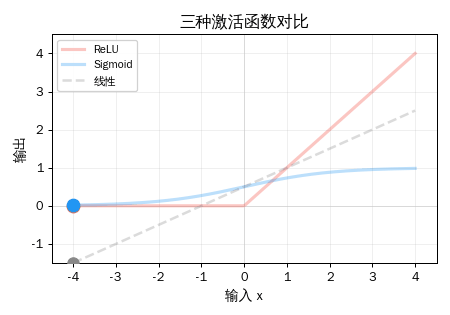
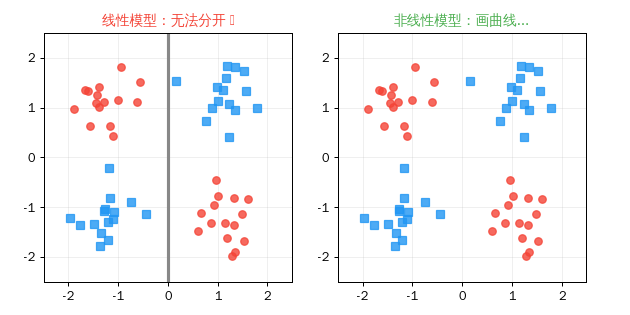

## 引言

前四篇，我们从向量走到了 Attention 公式。你现在知道 Transformer 的核心是矩阵乘法。

但有一个问题：**矩阵乘法是"线性"的**——不管你叠多少层矩阵，数学上都等于一个矩阵。

```text
W2 × (W1 × x) = (W2 × W1) × x = W_合并 × x
```

**一百层网络 = 一层网络？** 那深度学习还"深"什么？

答案是：**激活函数**。它是插在每两层矩阵之间的"非线性开关"，让多层网络真正比一层强大。

今天的主角是 **ReLU**——整个深度学习时代最重要的一行代码。

> **系列导航**
>
> <div style="max-width: 500px; margin: 0.5em 0; font-size: 0.93em; line-height: 1.9;">
> <div style="border-left: 3px solid #ccc; padding-left: 12px; margin-bottom: 6px; padding: 8px 12px; color: #888;">
> ▹ 第一篇：从数轴到高维空间</div>
> <div style="border-left: 3px solid #ccc; padding-left: 12px; margin-bottom: 6px; padding: 8px 12px; color: #888;">
> ▹ 第二篇：向量的加减法 — 点积与余弦相似度</div>
> <div style="border-left: 3px solid #ccc; padding-left: 12px; margin-bottom: 6px; padding: 8px 12px; color: #888;">
> ▹ 第三篇：矩阵——空间的变形术</div>
> <div style="border-left: 3px solid #ccc; padding-left: 12px; margin-bottom: 6px; padding: 8px 12px; color: #888;">
> ▹ 第四篇：矩阵乘法与 AI — 理解 Transformer 的最后一块拼图</div>
> <div style="border-left: 3px solid #4CAF50; padding-left: 12px; background: rgba(76,175,80,0.05); padding: 8px 12px; border-radius: 0 4px 4px 0;">
> <strong>▸ 第五篇（本文）：激活函数——神经网络的开关</strong></div>
> <div style="border-left: 3px solid #ccc; padding-left: 12px; padding: 8px 12px; color: #888;">
> ▹ 第六篇：梯度下降——AI 怎么学习</div>
> </div>

---

## 第一章：ReLU——史上最简单的"激活函数"

### 一行代码，改变了 AI

```text
ReLU(x) = max(0, x)
```

就这么简单：
- **输入是正数 → 原样输出**
- **输入是负数 → 输出 0**

```text
ReLU(-3)  = 0      ← 负数？关掉！
ReLU(-1)  = 0      ← 负数？关掉！
ReLU(0)   = 0
ReLU(0.5) = 0.5    ← 正数？通过！
ReLU(2)   = 2      ← 正数？通过！
ReLU(5)   = 5      ← 正数？通过！
```

<div style="max-width: 520px; margin: 1.5em auto; padding: 15px 20px; border-radius: 8px; background: rgba(33,150,243,0.06); border: 1px solid rgba(33,150,243,0.2);">

**类比：** ReLU 就像一个单向阀门——水（正数）可以流过，但不允许倒流（负数被截断为 0）。

</div>

### 三种激活函数对比

ReLU 不是唯一的激活函数。历史上还有 Sigmoid 和 Tanh：

<div style="max-width: 500px; margin: 1.5em auto;">



</div>

<div style="max-width: 520px; margin: 1.5em auto; padding: 15px 20px; border-radius: 8px; background: rgba(33,150,243,0.06); border: 1px solid rgba(33,150,243,0.2);">

| 激活函数 | 公式 | 输出范围 | 特点 |
|---------|------|---------|------|
| **ReLU** | max(0, x) | [0, +∞) | 简单快速，现代首选 |
| **Sigmoid** | 1/(1+e⁻ˣ) | (0, 1) | 老一代，有梯度消失问题 |
| **Tanh** | (eˣ-e⁻ˣ)/(eˣ+e⁻ˣ) | (-1, 1) | 比 Sigmoid 好，但仍有问题 |

</div>

> **为什么 ReLU 赢了？** 因为它计算快（一个 max 操作 vs 指数运算），而且在正数区域梯度恒为 1，不会随着层数增加而衰减（后面讲梯度下降时会解释）。

---

## 第二章：为什么非线性如此重要？

### 没有激活函数：一百层 = 一层

这是最关键的直觉：

```text
第1层: h = W1 × x         (矩阵乘法 = 线性)
第2层: y = W2 × h = W2 × W1 × x

合并: y = (W2 × W1) × x = W_合并 × x
```

两个矩阵的乘积还是一个矩阵。**线性操作的叠加仍然是线性的。** 不管你叠多少层，最终都等价于一个矩阵乘法——一层网络。

### 加上激活函数：每一层都有意义

```text
第1层: h = ReLU(W1 × x)    ← 非线性！
第2层: y = W2 × h

现在 y = W2 × ReLU(W1 × x) ≠ W_任何 × x
```

ReLU 打破了线性，让每一层都能学到新的东西。**这就是"深度"学习的"深度"来源。**

### 动画：线性 vs 非线性的分类能力

<div style="max-width: 600px; margin: 1.5em auto;">



</div>

> **关键洞察：** 线性模型只能画直线来分隔数据。但现实世界的问题往往需要曲线——比如区分"猫"和"狗"的特征边界不可能是一条直线。非线性激活函数让神经网络能画出任意复杂的曲线。

---

## 第三章：ReLU 在 Transformer 里的位置

还记得 Transformer 的结构吗？每一层有两个主要模块：

```text
词向量 → [Self-Attention] → 残差连接
                                ↓
         [FFN: 扩展 → ReLU → 压缩] → 残差连接 → 下一层
```

ReLU 就住在 **FFN（前馈网络）** 里：

<div style="max-width: 520px; margin: 1.5em auto;">

<div style="border-left: 4px solid #2196F3; padding: 12px 16px; margin-bottom: 12px; background: rgba(33,150,243,0.05); border-radius: 0 4px 4px 0;">
<strong>第 1 步：扩展</strong><br>
768 维 → W₁ → 3072 维<br>
<span style="color: #888; font-size: 0.9em;">（放大 4 倍，给 ReLU 更多维度来"选择"）</span></div>

<div style="border-left: 4px solid #F44336; padding: 12px 16px; margin-bottom: 12px; background: rgba(244,67,54,0.05); border-radius: 0 4px 4px 0;">
<strong>第 2 步：ReLU 过滤</strong><br>
3072 维 → ReLU → 3072 维（约 50% 被置零）<br>
<span style="color: #888; font-size: 0.9em;">（"这些维度的信息有用，那些不要"）</span></div>

<div style="border-left: 4px solid #4CAF50; padding: 12px 16px; background: rgba(76,175,80,0.05); border-radius: 0 4px 4px 0;">
<strong>第 3 步：压缩</strong><br>
3072 维 → W₂ → 768 维<br>
<span style="color: #888; font-size: 0.9em;">（只保留有用信息，回到原来的维度）</span></div>

</div>

<div style="max-width: 520px; margin: 1.5em auto; padding: 15px 20px; border-radius: 8px; background: rgba(156,39,176,0.06); border: 1px solid rgba(156,39,176,0.2);">

<div style="font-weight: bold; margin-bottom: 10px; color: #9C27B0;">ReLU 的稀疏性 = 效率</div>

ReLU 把约 50% 的神经元输出置零。这种"稀疏激活"意味着：
- **每个词只激活一半的特征**——不同的词激活不同的特征组合
- **这就像一个智能筛选器**——只保留对当前任务有用的信息

</div>

> **注意：** 现代 Transformer（如 GPT-3/4）通常用 **GELU**（高斯误差线性单元）代替 ReLU。GELU 类似 ReLU 但在 0 附近更平滑。核心思想不变——都是非线性激活。

---

## 第四章：动手验证

*以下命令在 Ubuntu 22.04 + Python 3.10 环境中执行：*

```bash
azureuser@ai-lab:~$ source ~/ai-lab-venv/bin/activate
(ai-lab-venv) azureuser@ai-lab:~$ python3
```

### 实验一：ReLU 就是 max(0, x)

```python
>>> import numpy as np
>>>
>>> inputs = [-3, -1, 0, 0.5, 2, 5]
>>> print("输入 → ReLU 输出:")
输入 → ReLU 输出:
>>> for x in inputs:
...     print(f"  ReLU({x:>4}) = max(0, {x:>4}) = {max(0, x)}")
  ReLU(  -3) = max(0,   -3) = 0
  ReLU(  -1) = max(0,   -1) = 0
  ReLU(   0) = max(0,    0) = 0
  ReLU( 0.5) = max(0,  0.5) = 0.5
  ReLU(   2) = max(0,    2) = 2
  ReLU(   5) = max(0,    5) = 5
```

> **结果解读：** 负数全部归零，正数原样通过。就这么简单。

### 实验二：没有 ReLU，多层 = 一层

```python
>>> W1 = np.array([[2, -3], [1, 2]])
>>> W2 = np.array([[1, 2], [3, 1]])
>>> x = np.array([1, 2])
>>>
>>> # 没有激活函数：两层分开算
>>> h = W1 @ x
>>> y = W2 @ h
>>> print(f"W1 @ x = {h}")
W1 @ x = [-4  5]
>>> print(f"W2 @ (W1 @ x) = {y}")
W2 @ (W1 @ x) = [ 6 -7]
>>>
>>> # 合并成一个矩阵
>>> W_combined = W2 @ W1
>>> print(f"(W2 @ W1) @ x = {W_combined @ x}")
(W2 @ W1) @ x = [ 6 -7]
>>> print("结果完全一样！两层白搭了。")
结果完全一样！两层白搭了。
```

```python
>>> # 加上 ReLU
>>> h_relu = np.maximum(0, W1 @ x)
>>> y_relu = W2 @ h_relu
>>> print(f"W1 @ x = {W1 @ x}")
W1 @ x = [-4  5]
>>> print(f"ReLU(W1 @ x) = {h_relu}  ← -4 被截断为 0!")
ReLU(W1 @ x) = [0 5]  ← -4 被截断为 0!
>>> print(f"W2 @ ReLU(h) = {y_relu}")
W2 @ ReLU(h) = [10  5]
>>> print(f"(W2@W1) @ x  = {W_combined @ x}")
(W2@W1) @ x  = [ 6 -7]
>>> print("[10, 5] ≠ [6, -7]，结果不一样！ReLU 让多层有意义。")
[10, 5] ≠ [6, -7]，结果不一样！ReLU 让多层有意义。
```

> **结果解读：** 没有 ReLU 时，`[6, -7]` = `[6, -7]`，两层完全等于一层。加了 ReLU 后，`[10, 5]` ≠ `[6, -7]`——中间的 -4 被截断为 0，彻底改变了结果。

### 实验三：不同激活函数对比

```python
>>> x_vals = np.array([-2.0, -1.0, -0.5, 0.0, 0.5, 1.0, 2.0])
>>> relu = np.maximum(0, x_vals)
>>> sigmoid = 1 / (1 + np.exp(-x_vals))
>>> tanh = np.tanh(x_vals)
>>>
>>> print(f"{'x':>6} | {'ReLU':>6} | {'Sigmoid':>8} | {'Tanh':>6}")
     x |   ReLU |  Sigmoid |   Tanh
>>> for i in range(len(x_vals)):
...     print(f"{x_vals[i]:>6.1f} | {relu[i]:>6.1f} | {sigmoid[i]:>8.4f} | {tanh[i]:>6.4f}")
  -2.0 |    0.0 |   0.1192 | -0.9640
  -1.0 |    0.0 |   0.2689 | -0.7616
  -0.5 |    0.0 |   0.3775 | -0.4621
   0.0 |    0.0 |   0.5000 | 0.0000
   0.5 |    0.5 |   0.6225 | 0.4621
   1.0 |    1.0 |   0.7311 | 0.7616
   2.0 |    2.0 |   0.8808 | 0.9640
```

> **结果解读：** ReLU 是"硬开关"（0 或原值），Sigmoid 是"软开关"（0~1 之间），Tanh 是"双向软开关"（-1~1 之间）。

### 实验四：ReLU 的稀疏性

```python
>>> np.random.seed(42)
>>> layer_output = np.random.randn(100)  # 模拟 100 个神经元
>>> after_relu = np.maximum(0, layer_output)
>>>
>>> alive = np.sum(after_relu > 0)
>>> dead = np.sum(after_relu == 0)
>>> print(f"100 个神经元经过 ReLU:")
100 个神经元经过 ReLU:
>>> print(f"  激活 (>0): {alive} 个")
  激活 (>0): 46 个
>>> print(f"  沉默 (=0): {dead} 个")
  沉默 (=0): 54 个
>>> print(f"  稀疏率: {dead}%")
  稀疏率: 54%
```

> **结果解读：** 约一半神经元被 ReLU 关闭。这不是浪费——不同的输入会激活不同的神经元组合，就像不同的词激活大脑的不同区域。

### 实验五：模拟 GPT-2 的 FFN

```python
>>> np.random.seed(42)
>>> d_model, d_ff = 8, 32  # 简化版：真实 GPT-2 是 768 → 3072
>>> x = np.random.randn(d_model)
>>> W1 = np.random.randn(d_model, d_ff) * 0.5
>>> W2 = np.random.randn(d_ff, d_model) * 0.5
>>>
>>> h = x @ W1
>>> print(f"扩展到 {d_ff} 维，前 8 个值:")
扩展到 32 维，前 8 个值:
>>> print(f"  [{', '.join(f'{v:.2f}' for v in h[:8])}] ...")
  [0.12, 1.26, 2.17, 1.62, -1.50, -1.44, -1.52, -0.26] ...
>>>
>>> h_relu = np.maximum(0, h)
>>> active = np.sum(h_relu > 0)
>>> print(f"ReLU 后: {active}/{d_ff} 个激活 (稀疏率 {(d_ff-active)/d_ff:.0%})")
ReLU 后: 16/32 个激活 (稀疏率 50%)
>>>
>>> y = h_relu @ W2
>>> print(f"压缩回 {d_model} 维: [{', '.join(f'{v:.2f}' for v in y)}]")
压缩回 8 维: [-0.40, 1.76, 1.42, -3.08, 1.53, -4.22, -2.19, -3.30]
```

> **完整流程走通了！** 8 维 → 扩展到 32 维 → ReLU 过滤掉 50% → 压缩回 8 维。这就是 Transformer 中每一层 FFN 在做的事情，真实模型只是把 8 换成 768，把 32 换成 3072。

---

## 本章小结

<div style="max-width: 520px; margin: 1.5em auto; padding: 20px; border-radius: 8px; border: 2px solid #FF9800; background: rgba(255,152,0,0.04);">

<div style="font-weight: bold; margin-bottom: 12px; font-size: 1.05em;">本篇核心要点</div>

**一、ReLU = max(0, x)**
- 正数通过，负数归零
- 整个深度学习时代最常用的激活函数

**二、非线性让深度成为可能**
- 没有激活函数：多层 = 一层（矩阵乘法可合并）
- 有了激活函数：每层都能学到新特征

**三、ReLU 在 Transformer 的 FFN 中**
- 768 维 → 扩展到 3072 维 → ReLU 过滤 → 压缩回 768 维
- 约 50% 稀疏激活，不同词激活不同神经元

**四、一行公式速查**

| 概念 | 公式 |
|------|------|
| ReLU | max(0, x) |
| Sigmoid | 1/(1+e⁻ˣ) |
| 核心作用 | 打破线性，让深度有意义 |

</div>

---

## 下一篇预告

我们知道了矩阵做变换，ReLU 加非线性。但有一个根本问题：

> **矩阵 W 里的数字是怎么来的？AI 怎么知道该用什么参数？**

答案是：**梯度下降**——让 AI 从错误中学习的算法。这也是 microgpt 训练时 loss 不断下降的原因。

下一篇（完结）：**AI 的数学语言（六）：梯度下降——AI 怎么学习**

---

<div style="margin-top: 30px; padding-top: 20px; border-top: 1px solid #e0e0e0; font-size: 0.9em; color: #888; line-height: 1.8;">

本文首发于「AI 学习笔记」博客：https://Jason-Azure.github.io/ai-blog/<br>
微信公众号：AI-lab学习笔记<br>
系列文章完整列表见 [标签：激活函数](/ai-blog/tags/激活函数/)

</div>
