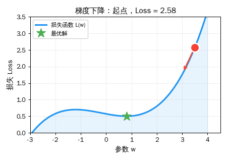
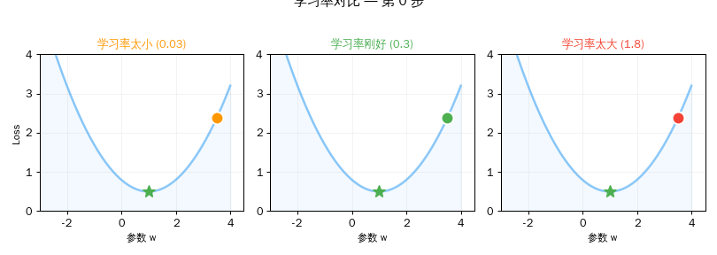

## 引言

到目前为止，我们学会了：
- 向量描述万物，矩阵变换向量
- Attention 用矩阵乘法计算词与词的关联
- ReLU 给网络加上非线性，让深度有意义

但有一个根本问题没有回答：

> **矩阵里的数字是怎么来的？**

W_q、W_k、W_v、FFN 的 W₁、W₂——这些矩阵包含了模型的全部"知识"。GPT-2 有 1.17 亿个这样的数字，GPT-3 有 1750 亿个。

这些数字不是人写的。它们是 AI **自己学出来的**。学习的方法就是今天的主题：**梯度下降**。

<div style="max-width: 520px; margin: 1.5em auto; padding: 20px; border-radius: 8px; background: #FFF9C4; border: 2px solid #FF9800; text-align: center;">

**训练 AI = 找到一组参数，让预测误差最小**

工具：梯度下降 + 反向传播

</div>

> **系列导航**
>
> <div style="max-width: 500px; margin: 0.5em 0; font-size: 0.93em; line-height: 1.9;">
> <div style="border-left: 3px solid #ccc; padding-left: 12px; margin-bottom: 6px; padding: 8px 12px; color: #888;">
> ▹ 第一篇：从数轴到高维空间</div>
> <div style="border-left: 3px solid #ccc; padding-left: 12px; margin-bottom: 6px; padding: 8px 12px; color: #888;">
> ▹ 第二篇：向量的加减法 — 点积与余弦相似度</div>
> <div style="border-left: 3px solid #ccc; padding-left: 12px; margin-bottom: 6px; padding: 8px 12px; color: #888;">
> ▹ 第三篇：矩阵——空间的变形术</div>
> <div style="border-left: 3px solid #ccc; padding-left: 12px; margin-bottom: 6px; padding: 8px 12px; color: #888;">
> ▹ 第四篇：矩阵乘法与 AI — 理解 Transformer 的最后一块拼图</div>
> <div style="border-left: 3px solid #ccc; padding-left: 12px; margin-bottom: 6px; padding: 8px 12px; color: #888;">
> ▹ 第五篇：激活函数——神经网络的开关</div>
> <div style="border-left: 3px solid #4CAF50; padding-left: 12px; background: rgba(76,175,80,0.05); padding: 8px 12px; border-radius: 0 4px 4px 0;">
> <strong>▸ 第六篇（本文）：梯度下降——AI 怎么学习</strong></div>
> </div>

---

## 第一章：损失函数——衡量"错了多少"

### AI 的考试成绩单

训练 AI 的第一步：定义什么叫"错"。

```text
模型预测: "今天天气真__"  → "冷" (概率 60%)
正确答案:                  → "好" (概率 100%)

误差 = 预测和答案的差距
```

**损失函数（Loss Function）** 就是把这个差距变成一个数字。数字越大，错得越离谱。

<div style="max-width: 520px; margin: 1.5em auto; padding: 15px 20px; border-radius: 8px; background: rgba(33,150,243,0.06); border: 1px solid rgba(33,150,243,0.2);">

| 损失函数 | 公式 | 用途 |
|---------|------|------|
| **MSE** | 平均(预测-真实)² | 回归问题 |
| **交叉熵** | -Σ 真实×log(预测) | 分类/语言模型 |

</div>

> **类比：** 损失函数就像考试分数（反着算）——100 分是满分，损失 = 0 分；答错越多，损失越大。AI 训练的目标就是"考满分"。

---

## 第二章：梯度下降——蒙眼下山

### 核心直觉

想象你蒙着眼睛站在一座山上，目标是走到最低点（山谷）。

你的策略：
1. **用脚探路**——感受脚下哪个方向是下坡（计算梯度）
2. **朝下坡方向迈一步**（更新参数）
3. **重复**，直到感觉到达了平地（损失不再下降）

**这就是梯度下降。**

<div style="max-width: 500px; margin: 1.5em auto;">



</div>

### 公式

<div style="max-width: 520px; margin: 1.5em auto; padding: 20px; border-radius: 8px; background: #FFF9C4; border: 2px solid #FF9800; text-align: center;">

**w_新 = w_旧 - 学习率 × 梯度**

</div>

三个关键概念：

<div style="max-width: 520px; margin: 1.5em auto;">

<div style="border-left: 4px solid #2196F3; padding: 12px 16px; margin-bottom: 12px; background: rgba(33,150,243,0.05); border-radius: 0 4px 4px 0;">
<strong>梯度（Gradient）</strong><br>
损失函数对参数的导数。告诉你"往哪个方向走，损失会增大"。<br>
<span style="color: #888; font-size: 0.9em;">所以我们朝<strong>反方向</strong>走——减去梯度。</span></div>

<div style="border-left: 4px solid #FF9800; padding: 12px 16px; margin-bottom: 12px; background: rgba(255,152,0,0.05); border-radius: 0 4px 4px 0;">
<strong>学习率（Learning Rate）</strong><br>
每步走多远。太大会跳过山谷，太小会走到天荒地老。<br>
<span style="color: #888; font-size: 0.9em;">通常设为 0.001 ~ 0.01，是最重要的超参数之一。</span></div>

<div style="border-left: 4px solid #4CAF50; padding: 12px 16px; background: rgba(76,175,80,0.05); border-radius: 0 4px 4px 0;">
<strong>参数（Parameters）</strong><br>
模型里所有的数字——矩阵的每一个元素。<br>
<span style="color: #888; font-size: 0.9em;">GPT-2 有 1.17 亿个参数，每次更新都要动这些。</span></div>

</div>

---

## 第三章：学习率的艺术

学习率是训练中最关键的选择之一。

<div style="max-width: 700px; margin: 1.5em auto;">



</div>

<div style="max-width: 520px; margin: 1.5em auto; padding: 15px 20px; border-radius: 8px; background: rgba(244,67,54,0.06); border: 1px solid rgba(244,67,54,0.2);">

| 学习率 | 结果 | 比喻 |
|--------|------|------|
| **太小** (0.03) | 20步后 Loss 还有 1.76 | 蜗牛爬山，天黑了还没到 |
| **刚好** (0.3) | 20步后 Loss ≈ 1.00 | 稳步下山，精准到达 |
| **太大** (1.5) | Loss 爆炸到天文数字 | 跳太猛，弹出了山谷 |

</div>

> **实践中的解决方案：** 现代 AI 训练不用固定学习率。常用 **AdamW** 优化器——它会自动为每个参数调整步长，像一个经验丰富的登山向导。

---

## 第四章：反向传播——误差如何传递

### 问题：参数有 1 亿个，怎么知道每个参数该怎么调？

梯度下降告诉我们"朝梯度反方向走"。但一个模型有几千万甚至几千亿个参数，怎么计算每个参数的梯度？

答案是**反向传播（Backpropagation）**——用链式法则，从输出的误差倒推回每一个参数的贡献。

### 链式法则：误差的传递链

```text
简单网络: 输入 x → [×w1] → h → [×w2] → y → Loss

前向传播（从左到右算结果）:
  h = x × w1
  y = h × w2
  Loss = (y - target)²

反向传播（从右到左算梯度）:
  ∂Loss/∂y = 2(y - target)           ← 输出层的梯度
  ∂Loss/∂w2 = ∂Loss/∂y × h           ← w2 的梯度
  ∂Loss/∂w1 = ∂Loss/∂y × w2 × x     ← w1 的梯度（链式传递！）
```

<div style="max-width: 520px; margin: 1.5em auto; padding: 15px 20px; border-radius: 8px; background: rgba(156,39,176,0.06); border: 1px solid rgba(156,39,176,0.2);">

<div style="font-weight: bold; margin-bottom: 10px; color: #9C27B0;">类比：工厂质检</div>

想象一条生产线有三道工序：

```text
原料 → [工序A] → 半成品 → [工序B] → 成品 → 质检（发现问题！）
```

质检发现成品有问题，要追责：
- 先查工序 B：你对成品有多大影响？
- 再查工序 A：你对半成品有多大影响？而半成品又对成品有多大影响？

**反向传播就是这个"从后往前追责"的过程。**

</div>

---

## 第五章：动手验证

*以下命令在 Ubuntu 22.04 + Python 3.10 环境中执行：*

```bash
azureuser@ai-lab:~$ source ~/ai-lab-venv/bin/activate
(ai-lab-venv) azureuser@ai-lab:~$ python3
```

### 实验一：损失函数

```python
>>> import numpy as np
>>>
>>> predictions = np.array([2.5, 0.5, 2.1, 1.9])
>>> targets = np.array([3.0, 1.0, 2.0, 2.0])
>>> errors = predictions - targets
>>> print(f"误差:  {errors}")
误差:  [-0.5 -0.5  0.1 -0.1]
>>> print(f"误差²: {errors**2}")
误差²: [0.25 0.25 0.01 0.01]
>>> mse = np.mean(errors**2)
>>> print(f"MSE 损失 = {mse:.4f}")
MSE 损失 = 0.1300
```

> **结果解读：** 4 个预测的平均误差平方 = 0.13。如果预测完全准确，MSE = 0。训练的目标就是把这个数字降到最小。

### 实验二：手动梯度下降

```python
>>> # L(w) = (w-3)² + 1，最小值在 w=3
>>> def loss(w): return (w - 3)**2 + 1
>>> def gradient(w): return 2*(w - 3)
>>>
>>> w = 0.0  # 从远离最优的地方出发
>>> lr = 0.1
>>> print(f"起点: w = {w:.1f}, Loss = {loss(w):.2f}")
起点: w = 0.0, Loss = 10.00
>>>
>>> for step in range(1, 9):
...     g = gradient(w)
...     w = w - lr * g
...     print(f"  第{step}步: w={w:.4f}, Loss={loss(w):.4f}, 梯度={g:.4f}")
  第1步: w=0.6000, Loss=6.7600, 梯度=-6.0000
  第2步: w=1.0800, Loss=4.6864, 梯度=-4.8000
  第3步: w=1.4640, Loss=3.3593, 梯度=-3.8400
  第4步: w=1.7712, Loss=2.5099, 梯度=-3.0720
  第5步: w=2.0170, Loss=1.9664, 梯度=-2.4576
  第6步: w=2.2136, Loss=1.6185, 梯度=-1.9661
  第7步: w=2.3709, Loss=1.3958, 梯度=-1.5729
  第8步: w=2.4967, Loss=1.2533, 梯度=-1.2583
```

> **结果解读：** 从 w=0 开始，Loss 从 10.00 一路下降到 1.25。梯度（下坡方向的陡度）越来越小，说明越来越接近谷底。15 步后 w≈2.89，Loss≈1.01，非常接近最优值 w=3, Loss=1。

### 实验三：学习率太大 vs 太小

```python
>>> for lr, name in [(0.03, "太小"), (0.3, "刚好"), (1.5, "太大")]:
...     w = 0.0
...     for _ in range(20):
...         w = w - lr * gradient(w)
...     print(f"  学习率 {lr} ({name}): w={w:.4f}, Loss={loss(w):.4f}")
  学习率 0.03 (太小): w=2.1297, Loss=1.7575
  学习率 0.3 (刚好): w=3.0000, Loss=1.0000
  学习率 1.5 (太大): w=-3145725.0000, Loss=9895604649985.0000
```

> **结果解读：** 学习率 0.03 太慢，20 步还没到。0.3 刚好，精准到达。1.5 太大——参数飞到了负三百万，Loss 爆炸到近十万亿！

### 实验四：反向传播

```python
>>> # 网络: x → [×w1] → h → [×w2] → y → Loss
>>> x, w1, w2, target = 2.0, 0.5, 1.5, 6.0
>>>
>>> # 前向传播
>>> h = x * w1        # = 1.0
>>> y = h * w2         # = 1.5
>>> L = (y - target)**2  # = 20.25
>>> print(f"前向: h={h}, y={y}, Loss={L}")
前向: h=1.0, y=1.5, Loss=20.25
>>>
>>> # 反向传播（链式法则）
>>> dL_dy = 2*(y - target)             # = -9.0
>>> dL_dw2 = dL_dy * h                 # = -9.0
>>> dL_dw1 = dL_dy * w2 * x            # = -27.0
>>> print(f"反向: ∂L/∂w2={dL_dw2}, ∂L/∂w1={dL_dw1}")
反向: ∂L/∂w2=-9.0, ∂L/∂w1=-27.0
>>>
>>> # 更新参数
>>> lr = 0.01
>>> w1_new = w1 - lr * dL_dw1  # 0.5 → 0.77
>>> w2_new = w2 - lr * dL_dw2  # 1.5 → 1.59
>>> y_new = (x * w1_new) * w2_new
>>> L_new = (y_new - target)**2
>>> print(f"更新后: w1={w1_new:.4f}, w2={w2_new:.4f}")
更新后: w1=0.7700, w2=1.5900
>>> print(f"新预测: y={y_new:.4f}, 新 Loss={L_new:.4f}")
新预测: y=2.4486, 新 Loss=12.6124
>>> print(f"一步更新，Loss 从 {L} 降到了 {L_new:.4f}！")
一步更新，Loss 从 20.25 降到了 12.6124！
```

> **结果解读：** 链式法则算出每个参数对误差的贡献（w1 的梯度 -27 比 w2 的 -9 大三倍，因为 w1 在更前面，影响被 w2 放大了）。一步更新后，Loss 从 20.25 降到 12.61。继续迭代就能逐步逼近目标。

### 实验五：模拟 microgpt 训练过程

```python
>>> np.random.seed(42)
>>> losses = []
>>> for i in range(100):
...     noise = np.random.randn() * 0.05 * np.exp(-i/30)
...     l = 3.3 * np.exp(-i/25) + 0.3 + noise
...     losses.append(max(0.3, l))
>>>
>>> for i in [0, 5, 10, 20, 50, 80, 99]:
...     bar = '█' * int((1-losses[i]/losses[0])*20) + '░' * (20-int((1-losses[i]/losses[0])*20))
...     print(f"  步数 {i:>3} | Loss {losses[i]:.4f} | {bar}")
  步数   0 | Loss 3.6248 | ░░░░░░░░░░░░░░░░░░░░
  步数   5 | Loss 2.9919 | ███░░░░░░░░░░░░░░░░░
  步数  10 | Loss 2.4955 | ██████░░░░░░░░░░░░░░
  步数  20 | Loss 1.8204 | █████████░░░░░░░░░░░
  步数  50 | Loss 0.7497 | ███████████████░░░░░
  步数  80 | Loss 0.4338 | █████████████████░░░
  步数  99 | Loss 0.3625 | ██████████████████░░
```

> **结果解读：** 这条曲线和真实的 microgpt 训练非常相似——初始 loss≈3.3（随机猜 26 个字母的 ln(26)≈3.26），随着训练进行 loss 快速下降，最终趋于平稳。这就是梯度下降在实际中的效果！

---

## 第六章：完整训练流程——把所有零件组装起来

现在我们可以画出 AI 训练的完整图景：

<div style="max-width: 520px; margin: 1.5em auto; padding: 20px; border-radius: 8px; border: 2px solid #4CAF50; background: rgba(76,175,80,0.04);">

```text
训练数据（百万篇文章）
        ↓
[1] 前向传播
    输入 → Embedding → Attention → FFN → ReLU → ... → 预测
        ↓
[2] 计算损失
    Loss = 预测与真实答案的差距
        ↓
[3] 反向传播
    从 Loss 倒推每个参数的梯度（链式法则）
        ↓
[4] 更新参数
    w_新 = w_旧 - 学习率 × 梯度
        ↓
    回到 [1]，重复数万~数百万次
```

</div>

<div style="max-width: 520px; margin: 1.5em auto; padding: 15px 20px; border-radius: 8px; background: rgba(33,150,243,0.06); border: 1px solid rgba(33,150,243,0.2);">

**呼应我们的三个模型演示：**

| 模型 | 参数量 | 训练步数 | 训练时间 |
|------|--------|---------|---------|
| **microgpt** | 4,192 | 1,000 | ~4 分钟 |
| **nanoGPT** | 3~10M | 5,000~50,000 | 数小时 |
| **GPT-3** | 175B | ~300,000 | 数月 + 千张 GPU |

每一步都在做同样的事：前向传播 → 算损失 → 反向传播 → 更新参数。区别只在于规模。

</div>

---

## 系列总结：从数字到智能

六篇文章，我们走过了一条完整的路径：

<div style="max-width: 520px; margin: 1.5em auto; padding: 20px; border-radius: 8px; border: 2px solid #4CAF50; background: rgba(76,175,80,0.04);">

```text
第一篇: 文字 → 数字（向量）
          ↓
第二篇: 数字 → 比较（点积、余弦相似度）
          ↓
第三篇: 数字 → 变换（矩阵）
          ↓
第四篇: 全部组装 → Attention 公式
          ↓
第五篇: 加上非线性 → ReLU 让深度有意义
          ↓
第六篇: 从错误中学习 → 梯度下降找最优参数
          ↓
一个能理解语言的 AI 就这样诞生了
```

</div>

<div style="max-width: 520px; margin: 1.5em auto; padding: 20px; border-radius: 8px; border: 2px solid #FF9800; background: rgba(255,152,0,0.04);">

<div style="font-weight: bold; margin-bottom: 12px; font-size: 1.05em;">全系列核心公式速查</div>

| 概念 | 公式 | 篇章 |
|------|------|------|
| 向量 | v = [v₁, v₂, ..., vₙ] | 第一篇 |
| 点积 | a · b = Σ aᵢ × bᵢ | 第二篇 |
| 余弦相似度 | cos(a,b) = a·b / (‖a‖×‖b‖) | 第二篇 |
| 矩阵×向量 | M × v = [行₁·v, 行₂·v, ...] | 第三篇 |
| Attention | softmax(QKᵀ/√d) × V | 第四篇 |
| ReLU | max(0, x) | 第五篇 |
| 梯度下降 | w_新 = w_旧 - lr × ∇L | 第六篇 |

</div>

> 你现在具备了理解 AI 从数据到智能的完整数学基础。看到 W、Q、K、V、softmax、ReLU、Loss、gradient——你都知道它们在做什么。
>
> 如果你还没看过我们的 [Attention 机制完整拆解文章](/ai-blog/posts/transformer-attention/)，现在是最好的时机——有了这六篇数学基础，那篇文章里的每一个公式你都能看懂了。

---

<div style="margin-top: 30px; padding-top: 20px; border-top: 1px solid #e0e0e0; font-size: 0.9em; color: #888; line-height: 1.8;">

本文首发于「AI 学习笔记」博客：https://Jason-Azure.github.io/ai-blog/<br>
微信公众号：AI-lab学习笔记<br>
系列文章完整列表见 [标签：梯度下降](/ai-blog/tags/梯度下降/)

</div>
