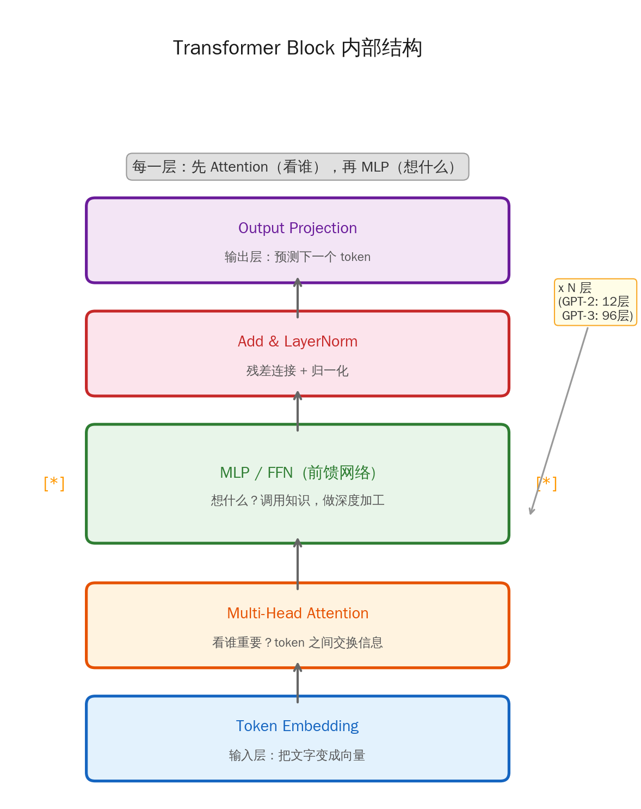
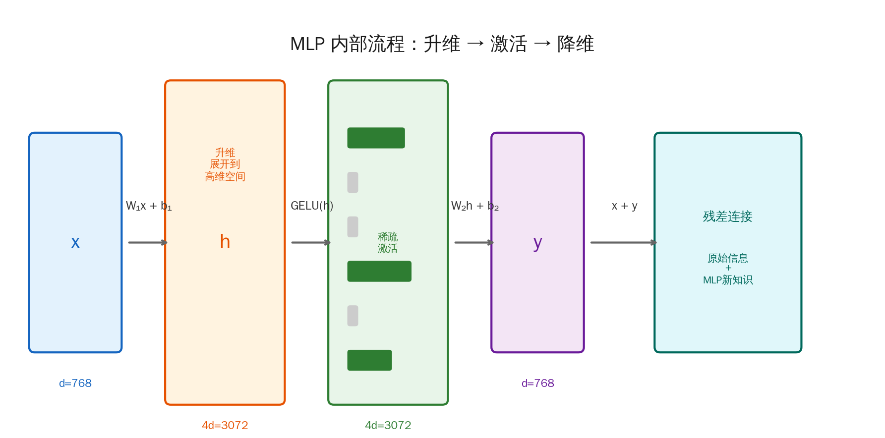
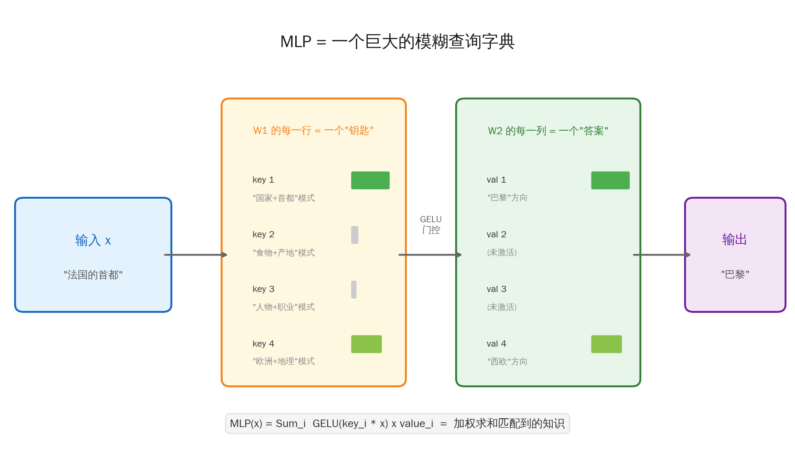
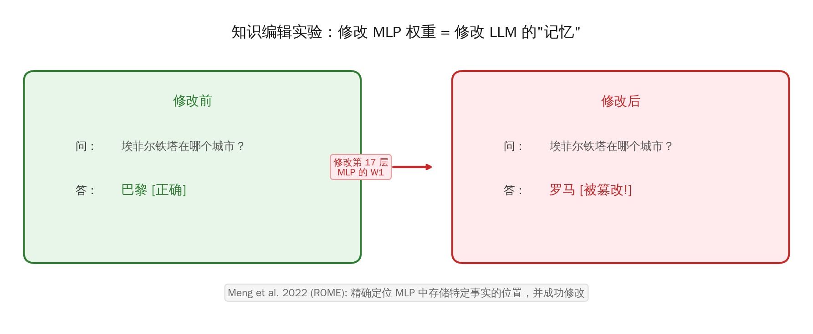
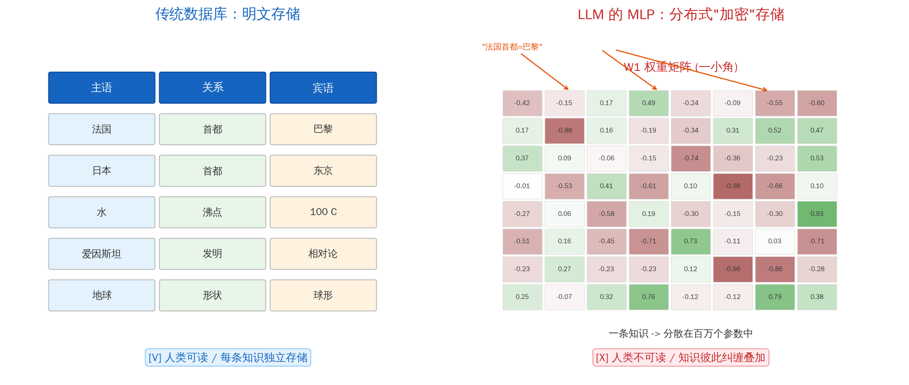
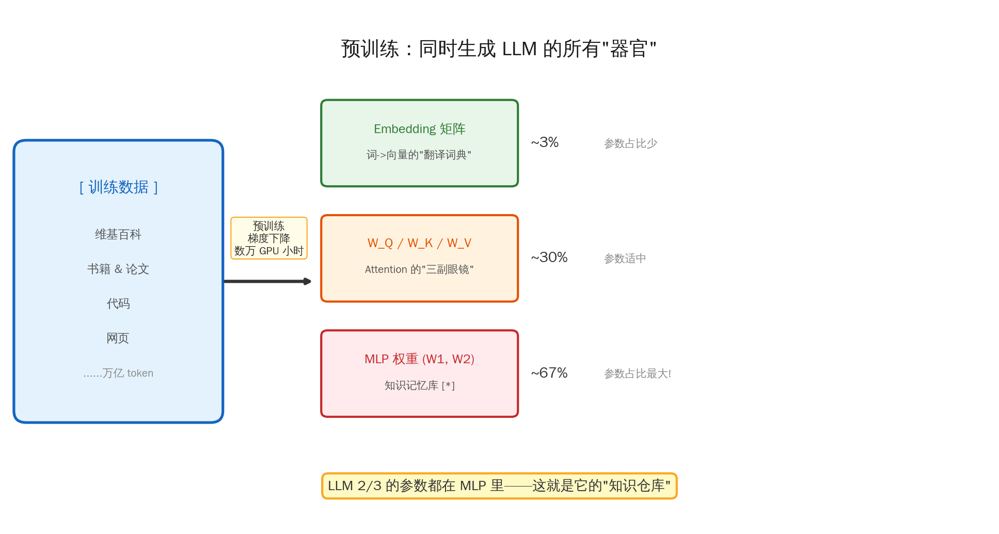

## 引言：一个被颠覆的认知

很多人（包括曾经的我）一直以为：LLM 只是一个"鹦鹉学舌"的概率机器，它不存储任何知识，只是在模仿训练数据中的统计规律。

但最近的研究颠覆了这个认知——**LLM 确实在内部存储了大量事实性知识，而且存储的位置非常明确：就在 MLP（前馈网络）的权重矩阵里。**

更令人震撼的是：这些知识被"加密"了。不是人类能直接阅读的明文，而是以一种分布式的、纠缠的方式编码在数百万个浮点数中。只有模型自己的计算流程才能"解密"并使用这些知识。

今天，我们把这件事彻底拆开。

---

## 一、MLP 在 Transformer 中的位置

在拆解 MLP 之前，先搞清楚它住在哪。

一个 Transformer 模型（无论是 GPT、Claude 还是 DeepSeek），内部是由 N 个完全相同的 **Transformer Block** 堆叠而成的。每个 Block 里面有两个核心组件：

| 组件 | 全称 | 职责 | 类比 |
|------|------|------|------|
| **Attention** | Multi-Head Self-Attention | token 之间的信息交换 | 开会讨论：**"看谁"** |
| **MLP** | Multi-Layer Perceptron / FFN | 对每个 token 独立地做深度加工 | 独立思考：**"想什么"** |

它们的关系，用一句话总结：

> **Attention 是"看谁"，MLP 是"想什么"。**

Attention 把相关的上下文汇聚到当前位置（比如读到"法国的首都"时，把"法国"和"首都"的信息集中起来），然后 MLP 对汇聚后的信息做"深度加工"——调用存储在权重中的知识，把"法国+首都"翻译成"巴黎"。



GPT-2 有 12 个这样的 Block，GPT-3 有 96 个。每个 Block 都是先 Attention 再 MLP，像一条流水线一样逐层加工信息。

---

## 二、MLP 到底在做什么？三步流水线

MLP 的内部结构出奇地简单——就三步：

### 第一步：升维（Expand）

把 token 的向量从 d 维展开到 4d 维。GPT-2 的 d=768，所以展开到 3072 维。

> **为什么要升维？** 想象你要在一张纸上用一条线把红豆和绿豆分开。如果它们混在一起，平面上做不到。但如果你把它们抛到空中（升到三维），用一个平面就能轻松切开。高维空间给了模型更多的"操作空间"。

### 第二步：激活（Activate）

用 GELU 激活函数过滤。弱信号被压到接近 0，强信号保留。这一步实现了**稀疏激活**——3072 个神经元中，可能只有几百个被激活。

这就像一个筛子：大量"不相关"的知识被筛掉，只有与当前输入匹配的知识被保留。

### 第三步：降维（Compress）

把 4d 维压回 d 维，输出结果。

公式写出来只有一行：

```text
MLP(x) = W₂ · GELU(W₁ · x + b₁) + b₂

其中：
  x:  输入向量        [768 维]
  W₁: 升维矩阵        [768 × 3072]   ← 把 768 维展开到 3072 维
  GELU: 激活函数       [3072 → 3072]  ← 筛选，稀疏激活
  W₂: 降维矩阵        [3072 × 768]   ← 压回 768 维
  输出: 加工后的向量   [768 维]
```



看到这里你可能会说：这不就是两个矩阵乘法中间夹个非线性吗？有什么特别的？

**特别之处在于：这两个矩阵 W₁ 和 W₂ 里面存储了什么。**

---

## 三、颠覆认知：MLP 是一个巨大的知识库

2021 年，以色列特拉维夫大学的 Mor Geva 等人发表了一篇重要论文：*"Transformer Feed-Forward Layers Are Key-Value Memories"*。

这篇论文提出了一个惊人的观点：

> **MLP 的两个矩阵，就是一个键-值记忆网络（Key-Value Memory）。**

### 什么是"键-值记忆"？

你用过字典吧？查一个英文单词，翻到对应的中文释义。字典就是一个键-值存储：

| 键（Key） | 值（Value） |
|:---:|:---:|
| apple | 苹果 |
| book | 书 |
| cat | 猫 |

MLP 做的事情本质上一模一样，只不过它的"字典"不是精确匹配，而是**模糊匹配**：

| 矩阵 | 角色 | 类比 |
|------|------|------|
| **W₁ 的每一行** | 一个**键（Key）** | 一把钥匙——检测输入是否匹配某种模式 |
| **W₂ 的每一列** | 一个**值（Value）** | 一个锁里的宝贝——匹配成功时输出的知识 |
| **GELU 激活** | **门控** | 门卫——匹配度低的直接拒之门外 |

把公式拆开看就更清楚了：

```text
MLP(x) = W₂ · GELU(W₁ · x)

展开后 = 第1列 · GELU(第1行 · x)   ← key₁ 匹配？输出 value₁
       + 第2列 · GELU(第2行 · x)   ← key₂ 匹配？输出 value₂
       + 第3列 · GELU(第3行 · x)   ← key₃ 匹配？输出 value₃
       + ...
       + 第N列 · GELU(第N行 · x)   ← keyₙ 匹配？输出 valueₙ

等价于：
MLP(x) = 所有"匹配上的知识"的加权求和
```

举个具体例子。当输入是"法国的首都是___"时：

- W₁ 的第 1847 行（key₁₈₄₇）可能对应"**国家+首都**"这种模式。它和输入做点积，得到一个高分——说明匹配上了。
- GELU 让这个高分通过，低分的被过滤掉。
- W₂ 的第 1847 列（value₁₈₄₇）存储的就是"**巴黎**"对应的向量方向。
- 最终输出 = 所有被激活的 value 的加权求和，指向"巴黎"。



GPT-2 Small 的每一层 MLP 有 3072 个这样的"记忆槽"。12 层加起来就是 **36,864 个记忆槽**。GPT-3 有 12,288 × 96 = **超过 100 万个记忆槽**。

**这就是 LLM "记住"万亿级知识的秘密。**

### 实锤：知识编辑实验

如果 MLP 真的存储了知识，那能不能精确地**修改**某一条知识？

2022 年，MIT 的 Kevin Meng 等人发表了 *"Locating and Editing Factual Associations in GPT"*（ROME 方法），给出了令人震惊的答案：**可以。**

他们的实验过程：

1. **第一步：** 找到"埃菲尔铁塔在巴黎"这条知识主要存储在 GPT-2 的**第 17 层 MLP** 中。
2. **第二步：** 精确修改该层 MLP 的 W₁ 矩阵中的几个参数。
3. **结果：** 模型现在回答"埃菲尔铁塔在**罗马**"——一条知识被成功"篡改"了！



这个实验有力地证明了：**事实性知识确实物理地存储在 MLP 的权重矩阵中**，而且可以精确定位到具体的层和神经元。

---

## 四、加密的知识：为什么人类读不懂？

知道 MLP 存储了知识后，你可能会想：既然知识在权重矩阵里，能不能打开看看？

**答案是：能打开，但看不懂。**

比如 GPT-2 的某一层 MLP 的 W₁ 矩阵，打开来看就是这样的：

```text
 0.0231  -0.0847   0.1203  -0.0015   0.0672  ...
-0.0934   0.0412  -0.0568   0.0891  -0.0273  ...
 0.1147  -0.0326   0.0089  -0.1034   0.0456  ...
 ...
```

一堆浮点数。你完全看不出哪个数字对应"法国首都是巴黎"，哪个对应"水的沸点是100度"。

这就是所谓的**"加密"**——当然不是真正的密码学加密，而是**分布式表征（Distributed Representation）**带来的"天然加密效果"。



### 为什么"加密"了？三个原因

**原因一：一条知识分散在百万个参数中。**

传统数据库里，"法国首都=巴黎"是一条独立的记录。但在 LLM 中，这条知识被**拆散**了——编码在 W₁ 的某些行、W₂ 的某些列、甚至跨越多层 MLP 的权重中。

这就像你把一封信撕成 100 万片，撒到一个足球场上，和另外 100 亿封信的碎片混在一起。单独看任何一片纸，你都读不出原文。

**原因二：一个参数同时编码多条知识。**

更疯狂的是，这些碎片还在**复用**。W₁ 第 1847 行的第 42 个元素，可能同时参与编码"法国首都=巴黎"、"法语是法国的官方语言"、"法国的国旗是蓝白红"等等多条知识。

这种"一个参数身兼多职"叫做**叠加（Superposition）**。它让模型能用有限的参数存储远超参数量的知识——但代价是人类完全无法直接解读。

**原因三：只有完整的计算流程才能"解密"。**

要提取"法国首都=巴黎"这条知识，你需要：

1. 构造一个包含"法国"和"首都"的输入向量
2. 用 W₁ 做矩阵乘法（键匹配）
3. 用 GELU 做非线性过滤（门控）
4. 用 W₂ 做矩阵乘法（值提取）
5. 经过残差连接和后续层的进一步加工

整个流程缺一不可。这就像一把需要同时转动 5 个齿轮才能打开的密码锁——**只有模型自己的完整计算管道才是那把"钥匙"。**

### 一个有趣的类比：全息照片

> 全息照片是把三维物体的光学信息编码在二维底片上。你直接看底片，只看到一片模糊的干涉条纹，完全看不出原始物体的样子。但当你用正确波长的激光照射底片时，三维影像就"浮现"出来了。
>
> LLM 的 MLP 权重就像全息照片的底片——**知识被编码在看起来无意义的数字中，只有用正确的"激光"（输入向量 + 计算流程）照射，知识才会浮现。**

---

## 五、预训练的全貌：三大器官同时生长

理解了 MLP 存储知识之后，我们就能看到预训练的全貌了。预训练不只是"学会预测下一个词"那么简单——它同时在锻造 LLM 的**三大核心器官**：

| 器官 | 参数 | 功能 | 类比 | 参数占比 |
|------|------|------|------|:---:|
| **Embedding** | Embedding 矩阵 | 把离散的文字映射到连续的向量空间 | 翻译词典：文字→数学语言 | ~3% |
| **Attention** | W_Q, W_K, W_V, W_O | 发现 token 之间的关系，汇聚上下文 | 三副眼镜：看哪些词相关 | ~30% |
| **MLP** | W₁, W₂ (+ W_gate) | 存储和检索事实性知识 | 知识仓库：学到的所有事实 | **~67%** |



注意到了吗？**LLM 三分之二的参数都在 MLP 里。**

这完全合理——因为 MLP 要存储的是训练数据中学到的**所有事实和模式**。从"地球绕太阳转"到"Python 用缩进表示代码块"，从"李白是唐代诗人"到"if-else 的语法"——这些知识需要海量的参数来编码。

所以预训练的本质可以这样理解：

> 用万亿 token 的文本数据，通过梯度下降，同时锻造三套能力：
> **理解语言**（Embedding）+ **发现关系**（Attention）+ **记忆知识**（MLP）

### 为什么模型越大，知识越多？

现在这个问题就很好回答了：

- **模型越大 → MLP 的维度越大 → 记忆槽越多 → 能存储的知识越多。**
- GPT-2（1.5B 参数）可能记住百万级事实。
- GPT-3（175B 参数）可能记住数亿级事实。
- GPT-4（传言 1.8T 参数）可能记住数十亿级事实。

这也解释了为什么**小模型会"胡说八道"**——不是它不想说对，而是它的 MLP 记忆槽不够，装不下那么多知识，或者知识之间的叠加太严重，互相干扰了。

---

## 六、深入对比：Attention vs MLP

理解了 MLP 的角色后，Attention 和 MLP 的分工就非常清晰了：

| | Attention | MLP |
|---|---|---|
| **做什么** | token 之间的信息路由 | 单个 token 上的知识检索 |
| **处理方式** | 所有 token 一起看 | 每个 token 独立处理 |
| **类比** | 小组讨论：交换信息 | 独立思考：查阅笔记 |
| **记忆类型** | 短期记忆（上下文窗口） | 长期记忆（训练时学到的知识） |
| **受什么影响** | 当前输入的上下文 | 预训练阶段固定下来的权重 |
| **如果去掉** | 模型无法理解上下文关系 | 模型"失忆"，丧失知识 |

用一个生活场景来理解：

> 想象你在参加一个知识竞赛。主持人读出题目"法国的首都是什么？"
>
> **Attention 的工作**：你的耳朵听到了这句话的每个词，然后大脑识别出"法国"和"首都"是关键词，把它们的信息集中起来。这是**理解问题**的过程。
>
> **MLP 的工作**：大脑拿着"法国+首都"这个线索，去你的**长期记忆**里搜索，找到了"巴黎"这个答案。这是**检索知识**的过程。

---

## 七、现代 LLM 的 MLP 进化

经典 MLP（GPT-2/3 使用）只有两个矩阵。但现代 LLM（LLaMA、Qwen、DeepSeek）已经进化了。

### 进化一：SwiGLU（门控 MLP）

LLaMA、Qwen、DeepSeek 等现代模型使用的 MLP 结构叫 **SwiGLU**（Swish-Gated Linear Unit）：

```text
经典 MLP:    y = W₂ · GELU(W₁ · x)                           ← 2 个矩阵

SwiGLU MLP:  y = W₂ · (Swish(W_gate · x) ⊙ (W_up · x))     ← 3 个矩阵

区别：
  W_gate:  决定"让哪些信息通过"    ← 门控分支
  W_up:    提供"候选信息"          ← 信息分支
  两者逐元素相乘 = 有选择地放行

类比：
  经典 MLP = 一个筛子
  SwiGLU  = 一个智能闸门（自己决定开多大）
```

SwiGLU 多了一个矩阵，但效果明显更好——梯度更平滑，知识检索更精确。

### 进化二：MoE（混合专家）

DeepSeek-V3 和 Qwen-MoE 使用了更激进的设计——把一个大 MLP 拆成多个**专家（Expert）**：

```text
          输入 x
            |
       Router（路由器）
      / |  |  |  \
    E₁  E₂  E₃ ... E₂₅₆    ← 256 个独立的小 MLP（"专家"）
      \ |  |  /
    Top-K 选择（只激活 8 个） + 加权求和
            |
          输出 y
```

每个"专家"可能专精不同领域的知识——有的擅长代码，有的擅长数学，有的擅长文学。Router 会根据输入，选择最合适的几个专家来回答。

这样做的好处是：总参数量可以很大（存储更多知识），但每次只激活一小部分（计算成本低）。DeepSeek-V3 总参数 671B，但每次推理只用 37B——相当于一个**有 671B 容量的图书馆，但每次查询只需要翻 37B 的书**。

---

## 总结：重新认识 LLM

回到最初的问题：LLM 到底有没有"知识"？

**有。而且存储的位置非常明确。**

| 误解 | 事实 |
|------|------|
| LLM 只是"鹦鹉学舌" | LLM 在 MLP 权重中存储了海量事实性知识 |
| LLM 不理解任何东西 | Attention 学到了语义关系，MLP 学到了世界知识 |
| MLP 只是"增加非线性" | MLP 是 LLM 最核心的知识存储引擎，占 2/3 参数 |
| 预训练只是学统计规律 | 预训练同时锻造 Embedding + Attention + MLP 三大器官 |

最后，用一句话概括今天的核心洞见：

> **LLM 不是没有知识的概率计算器。它是一个把人类文明的知识"加密"存储在数十亿浮点数中的分布式知识引擎。**

只不过，这份知识被编码成了只有它自己才能读懂的"密文"。

---

## 参考文献

- Geva et al. (2021). *Transformer Feed-Forward Layers Are Key-Value Memories*. EMNLP 2021. arXiv: 2012.14913
- Meng et al. (2022). *Locating and Editing Factual Associations in GPT* (ROME). NeurIPS 2022. arXiv: 2202.05262
- Dai et al. (2022). *Knowledge Neurons in Pretrained Transformers*. ACL 2022. arXiv: 2104.08696
- Elhage et al. (2022). *Softmax Linear Units*. Anthropic Transformer Circuits Thread.
- Shazeer (2020). *GLU Variants Improve Transformer*. arXiv: 2002.05202
- Geva et al. (2022). *Transformer Feed-Forward Layers Build Predictions by Promoting Concepts in the Vocabulary Space*. arXiv: 2203.14680
- Vaswani et al. (2017). *Attention Is All You Need*. NeurIPS 2017. arXiv: 1706.03762
