> 我用纯 Python 和 NumPy 从零写了一个神经网络——10 个神经元，7960 个参数，用来识别手写数字。然后我把它拆开，看懂了它的每一个参数在做什么。这篇文章从这个最简单的网络出发，聊聊神经网络到底是怎么工作的，以及它和今天的 ChatGPT 之间的关系。
>
> ① 数据与结构 → ② 前向传播 → ③ 损失函数与反向传播 → ④ 拆开黑盒 → ⑤ FNN → CNN → RNN → Transformer → ⑥ 当下的大模型 → ⑦ 可解释性的边界

---

## 写在前面

前段时间用 Python 从零写了一个神经网络。

没有 PyTorch，没有 TensorFlow，没有任何框架。就是矩阵乘法和梯度下降。

它只有 **10 个神经元，7960 个参数**，任务是识别手写数字 0-9。训练 500 步之后，准确率 85%。我写了个小程序，用鼠标画数字，它能认出来。

写完之后，我把它拆开了。W1 矩阵 reshape 成图片，W2 矩阵画成热力图，把每一张图的决策路径可视化。7960 个参数全部摊开，看看它到底学到了什么。

然后我发现一件事：**这个只有 10 个神经元的小网络，和 GPT-4 用的是同一套数学。**点积、Softmax、梯度下降——一模一样。区别只是规模和架构。

这篇文章就从这个小网络出发，聊聊神经网络在做什么，FNN、CNN、RNN、Transformer 各自解决了什么问题，以及它们和今天的大语言模型之间的关系。

---

## 一、数据：一张图片就是 784 个数字

先说数据。MNIST 数据集有 42000 张手写数字图片，每张 28×28 像素的灰度图。

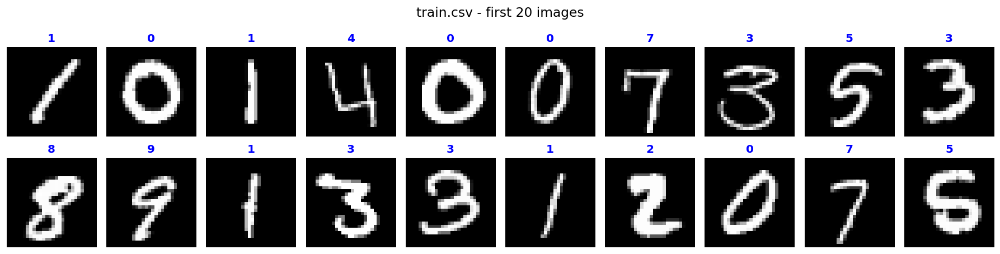

每个像素是一个 0-255 的灰度值：0 = 黑，255 = 白。一张 28×28 的图就是 784 个数字。

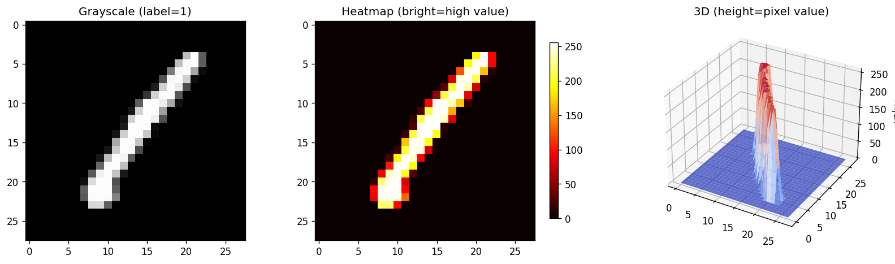

把 784 个像素值排成一行，这张图就变成了一组数字——一个 784 维的向量。这就是神经网络的输入。

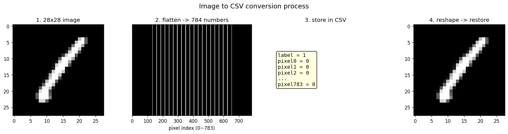

---

## 二、结构：784 → 10 → 10

网络很简单，三层：

- **输入层**：784 个节点，对应 784 个像素
- **隐藏层**：10 个神经元（这就是网络学到"知识"的地方）
- **输出层**：10 个节点，对应数字 0-9 的概率

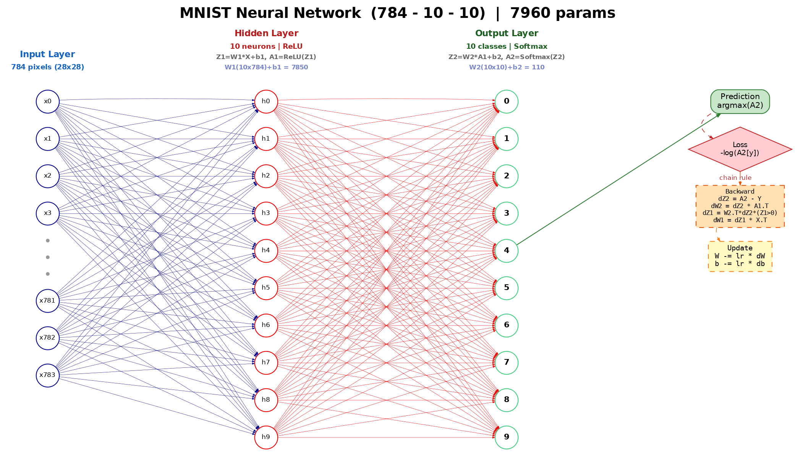

参数量：

- W1 (10×784) + b1 (10) = **7850**
- W2 (10×10) + b2 (10) = **110**
- 共 **7960** 个参数

数据在进网络之前做了两步预处理：

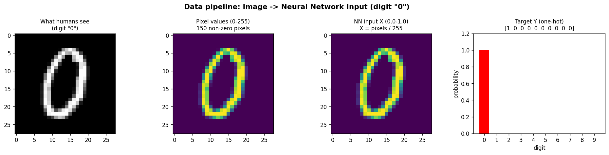

---

## 三、前向传播：四步算出一个预测

把一张图片喂给网络，它做四步运算：

### 第一步：加权求和

$$Z_1 = W_1 \times X + b_1$$

每个隐藏神经元把 784 个像素值和自己的 784 个权重逐一相乘再相加。这个操作叫**点积**——本质上是在算"这张图和我的模板有多像"。

换一个角度看：W1 是一个 10×784 的矩阵，X 是一个 784×1 的向量。`Z1 = W1 × X` 就是一次矩阵乘法——10 个神经元同时和整张图做点积，一次算完。这正是神经网络里矩阵运算和神经元之间最直接的关系：**每一行权重就是一个神经元，矩阵乘法就是所有神经元同时"看"一张图。**理解了这一步，后面 Transformer 里的 Q·Kᵀ 也是同一个操作——只不过维度从 784 变成了几千。

### 第二步：ReLU 激活

$$A_1 = \max(0, Z_1)$$

负数变 0，正数不变。听起来简单，但没有它，两层线性运算叠在一起还是线性运算——等于白叠了一层。ReLU 引入了非线性，让网络有了"取舍"的能力：匹配的保留，不匹配的闭嘴。一个 ReLU 产生一个"折"，多个折就能逼近任意曲线——这就是万能近似定理的直觉。

### 第三步：再来一次加权求和

$$Z_2 = W_2 \times A_1 + b_2$$

第二层把 10 个神经元的输出组合起来，形成对 10 个数字的"打分"。

### 第四步：Softmax 转概率

$$A_2 = \frac{e^{z_i}}{\sum e^{z_j}}$$

把原始分数变成 0 到 1 之间的概率，总和为 1。最大概率对应的数字就是答案。

这四步就是"前向传播"。数据从左到右流过网络，变成一个预测。每一步都是简单的算术——乘法、加法、取最大值、指数。没有魔法。

---

## 四、训练：怎么从错误中学习

### 损失函数

模型预测 P(3) = 73%，真实答案确实是 3。不错，但 73% 不是 100%。怎么量化"还不够好"？用**交叉熵损失**（Cross-Entropy Loss）：

$$Loss = -\ln(P(\text{正确答案})) = -\ln(0.73) = 0.31$$

预测完美时 Loss = 0，预测越差 Loss 越大。训练的目标就是让 Loss 越来越小。

> 为什么偏偏是 −log(p)？这背后有 Shannon 信息论的深层原因——**交叉熵衡量的是"模型的平均惊讶度"**。这个话题我写过一篇完整的推导：**《为什么用 -log(p) 做损失函数？——从信息论到 Cross-Entropy 的完整推导》**，从 Shannon 的三条公理出发，证明 −log(p) 是唯一满足所有条件的函数——它不是经验选择，而是数学必然。

### 反向传播

**反向传播**回答一个问题：每个参数对这次的错误贡献了多少？从输出层开始往回推，用链式法则算出每个参数的梯度——Loss 对该参数的偏导数。

关键公式出奇地简洁：

```text
输出层误差：dZ2 = A2 − Y          ← softmax + 交叉熵联合求导，完美约分
第二层权重：dW2 = dZ2 × A1.T      ← 误差 × 输入
隐藏层误差：dZ1 = W2.T × dZ2 × (Z1 > 0)   ← 误差传回 + ReLU 的门
第一层权重：dW1 = dZ1 × X.T       ← 同样的模式
```

`dZ2 = A2 − Y` 为什么这么简洁？因为 Softmax 用的 eˣ 和交叉熵用的 ln 天生互为逆运算，求导时完美抵消，最终只剩下"预测值 − 真实值"。

### 梯度下降

算出梯度之后，用它更新参数：

```text
W1 -= lr × dW1    # lr = 学习率，控制每步走多大
W2 -= lr × dW2
b1 -= lr × db1
b2 -= lr × db2
```

梯度指向"上坡方向"，减去梯度就是"下坡"——让 Loss 变小。

> **神经网络学习的全部流程：**
> 前向传播 → 计算损失 → 反向传播 → 更新参数 → 重复

每重复一次，模型就准一点点。下面是实际的训练曲线——Loss 从 2.3 降到 0.5，准确率从 10% 涨到 85%：

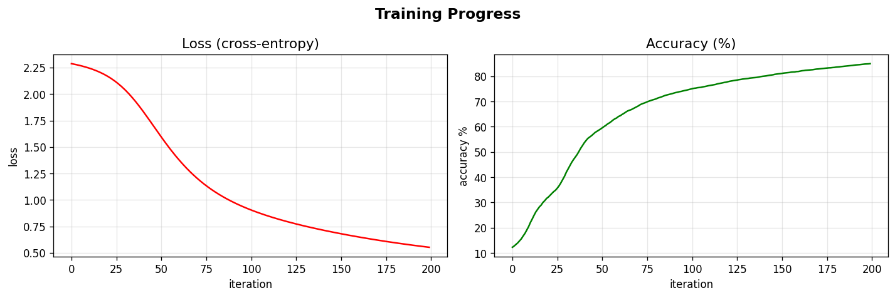

训练完成后，看看它在测试集上的表现——绿色是对的，红色是错的：

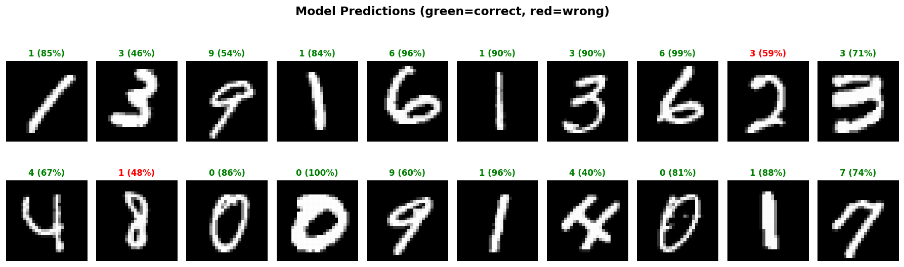

---

## 五、拆开黑盒：它到底学到了什么

训练完成后，7960 个参数不再是随机数。它们变成了某种"知识"。

我把 W1 的每一行——784 个权重——重新排列成 28×28 的图片，想看看每个神经元在"找什么"：

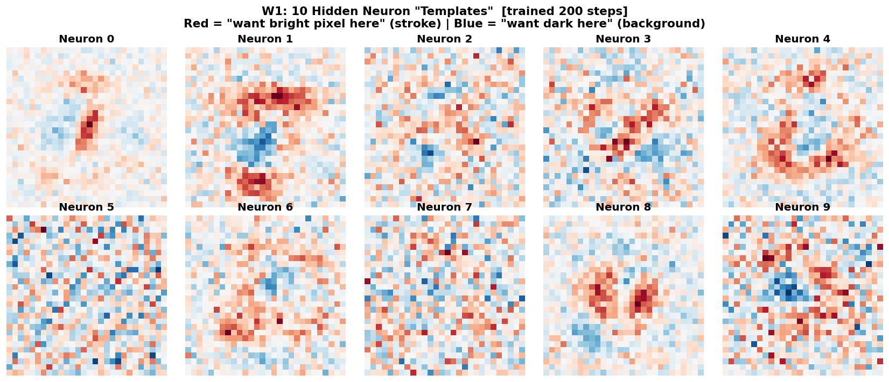

红色区域 = "我期望这里有笔画"。蓝色区域 = "我期望这里是空白"。没有人教它什么数字长什么样——这 10 张模板是它从 42000 张图片中自己"长"出来的。

然后看 W2——一个 10×10 的投票矩阵。它决定了每个模板匹配后，给哪个数字投多少票：

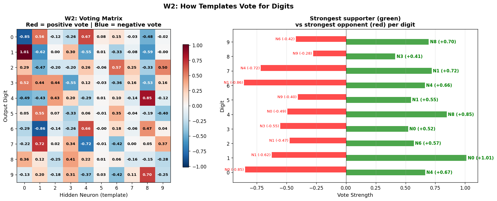

这个网络的识别方式不是"理解"——而是**模板匹配 + 投票**：

1. 拿到一张图，和 10 个模板逐一比较（点积 = 相似度打分）
2. 只保留匹配的（ReLU 把负分清零）
3. 匹配的模板按权重投票（W2 矩阵）
4. 票最多的数字就是答案

下面这张图把整个决策过程展开了。三张不同的输入图片，从左到右依次是：输入 → 哪些神经元被激活 → 10 个数字各得多少概率 → 最终预测：

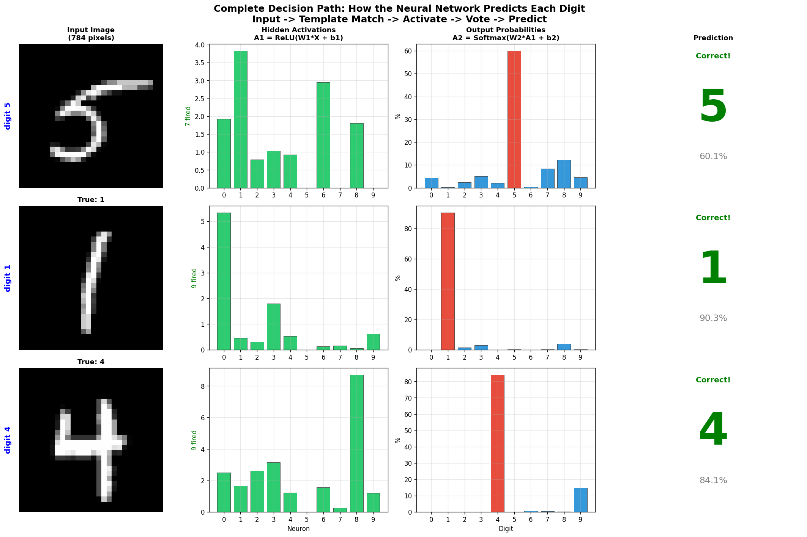

再具体一点——为什么某个神经元会"激活"？因为输入和模板**长得像**。下面的图把一张数字"5"和最匹配的模板叠在一起看：

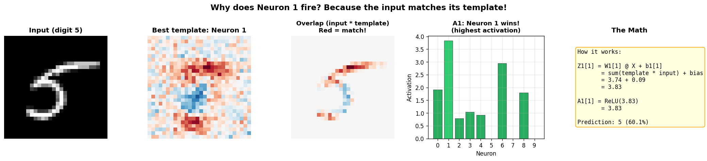

> 到这里，一个神经网络的工作原理就说完了。矩阵乘法就是所有神经元同时"看"一张图，ReLU 给每个结果"折"一下，梯度下降沿着下坡方向调整参数——这不是某一种网络特有的东西，这是**所有神经网络共享的基础**。关于矩阵乘法在几何上到底做了什么——旋转、缩放、剪切——以及这些 2D 变换如何直接对应 GPT 里的 QKV 投影，我在**《一看就懂：矩阵乘法到底对 LLM 做了什么？》**里用动图演示过。后面要聊的 CNN、RNN、Transformer，改变的只是前向传播里"怎么算"的部分，训练循环始终不变。

---

## 六、FNN 的问题，以及 CNN 怎么解决的

85% 的准确率不算差，但最好的模型能到 99.7%。差在哪？

我们的网络把 28×28 的图片拍平成了 784 个数字，**丢失了所有空间结构**。打个比方：把一张照片剪成 784 个碎片扔给你，让你猜是什么数字——你能猜个大概，但肯定不如看完整照片准。

具体来说：数字往左移两个像素，匹配分数就变了（没有位移不变性）；它看的是全局模板，认不出"一个小圆弧"或"一条竖线"这种局部笔画（没有局部特征）。

**CNN（卷积神经网络）**的思路是：不看整张图，用小窗口扫描局部。

```text
FNN:  整张图(784) → 全局模板匹配
CNN:  小窗口(3×3) → 在图上从左到右、从上到下滑动 → 找局部特征
```

CNN 的卷积核就是小版的"模板"。一个 3×3 的小矩阵在图片上滑动，每到一个位置做一次点积。因为同一个卷积核在所有位置共享权重，所以数字写在哪都能检测到——这就是位移不变性。

多层 CNN 从低到高提取特征：低层找边缘，中层找笔画，高层找整体形状。最后几层通常就是全连接层——也就是我们写的 FNN。**CNN = 卷积提特征 + FNN 做分类。**

```text
输入 (28×28) → 卷积层 → 池化 → 卷积层 → 池化 → 全连接层 → 输出
               (找边缘)         (找笔画)         (做分类)
```

CNN 在 MNIST 上能到 99% 以上。代表作：LeNet（1998）、AlexNet（2012，引爆深度学习革命）、ResNet（2015，152 层）。从感知机被一本书判了死刑，到深度学习靠改名字重获新生——这段 80 年的曲折历程，我在**《神经网络沉浮录：从万众瞩目到无人问津，再到改变世界》**里讲过。

但 CNN 是为图像设计的，文本不是图片。怎么办？

---

## 七、RNN：给网络装上记忆

文本和图片有本质区别：文本是**序列**，字的顺序至关重要。"狗咬了人"和"人咬了狗"用一样的字，意思完全不同。

**RNN（循环神经网络）**的做法是：处理每个字的时候，带着前面的记忆。

```text
"我" → [RNN] → h1 (记住了"我")
"喜" → [RNN] → h2 (记住了"我喜")
"欢" → [RNN] → h3 (记住了"我喜欢")
"猫" → [RNN] → h4 (记住了"我喜欢猫") → 输出
```

每一步，RNN 接收当前输入和上一步的隐藏状态 h，输出新的隐藏状态。h 就是"记忆"。

问题在于：读到第 100 个字的时候，第 1 个字的信息已经在 99 次变换中稀释殆尽了。这叫**梯度消失**——反向传播经过 100 层链式法则，梯度指数衰减。LSTM 和 GRU 通过"门控"机制缓解了这个问题，但治标不治本。

2017 年之前，NLP 主要靠 RNN / LSTM。Google 翻译、Siri 背后都是它。

然后有一篇论文改变了一切。

---

## 八、Transformer：Attention Is All You Need

2017 年，Google 发了一篇论文，标题叫 "Attention Is All You Need"。此后，GPT、BERT、Claude、DeepSeek、Llama——全部基于这篇论文提出的 **Transformer** 架构。

### 核心想法：自注意力（Self-Attention）

RNN 必须一个字一个字地读，第 100 个字很难回忆第 1 个字。Transformer 的做法是：让每个字直接和所有其他字交互。

```text
RNN:          我 → 喜欢 → 可爱的 → 猫     (串行，"猫"很难回看"我")
Transformer:  我 ←→ 喜欢 ←→ 可爱的 ←→ 猫  (并行，每个字直接看所有字)
```

具体做法：每个字被变换成三个向量——Query（我在找什么）、Key（我有什么）、Value（我的内容）。然后用 Q 和 K 做点积算相关性，再用这个相关性对 V 做加权求和。

```text
注意力得分 = Q · Kᵀ / √d      ← 又是点积
注意力权重 = Softmax(得分)      ← 又是 Softmax
输出       = 注意力权重 × V     ← 加权求和
```

> **点积和 Softmax**——和我们那个 10 个神经元的小网络用的是一样的数学运算。我们的网络是"拿模板去匹配图片"，Transformer 是"让句子里的每个词互相匹配"。底层数学没变，维度变了，几何没变。关于 Attention 机制的完整拆解，我写过**《从加减乘除到预测下一个字：Attention 机制零基础拆解》**，从向量相似度一路推到多头注意力。而 QKV 为什么要分成三个矩阵、背后涉及的符号接地问题和分布式假说，在**《从语言的本质到 Attention 的诞生——QKV 为什么长这样》**里有更深的追问。

### Transformer vs RNN

|  | RNN | Transformer |
|------|---------|-------------|
| 处理方式 | 串行，一个一个读 | 并行，全部同时看 |
| 长距离依赖 | 越远越弱 | 直接点积，距离无关 |
| 训练速度 | 慢（没法并行） | 快（GPU 友好） |

一个 Transformer 层 = 自注意力 + 前馈网络（MLP） + 残差连接 + 层归一化。堆 N 层就是一个完整的模型：

> **输入 → Embedding → [Attention + MLP] × N 层 → 输出**

---

## 九、四代架构回顾

|  | FNN | CNN | RNN | Transformer |
|------|----------|---------|---------|-------------|
| 核心运算 | W·X 矩阵乘 | 卷积核滑动 | 隐藏状态传递 | Q·Kᵀ·V |
| 擅长 | 分类 / 回归 | 图像识别 | 序列处理 | 几乎一切 |
| 弱点 | 无空间感知 | 处理不了序列 | 长距离遗忘 | 计算量大 |
| MNIST | ~85% | ~99%+ | 能做但不适合 | 大材小用 |
| 代表 | 本文 Demo | ResNet | LSTM | GPT / Claude |
| 年代 | 1960s | 1990s–2012 | 1990s–2017 | 2017–至今 |

> 无论架构怎么变，训练循环始终不变：**前向传播 → 计算损失 → 反向传播 → 更新参数 → 重复**。理解了这个循环——也就是前面用 MNIST 讲的全部内容——就理解了所有神经网络最核心的部分。

---

## 十、当下的大模型

我们的小网络有 7960 个参数。看看现在真实运行的大语言模型：

|  | 我们的 NN | Llama 3.1 405B | DeepSeek-V3 | GPT-4 |
|------|----------|----------------|-------------|-------|
| 参数量 | **7,960** | 4,050 亿 | 6,710 亿 | ~1.76 万亿 |
| 层数 | 2 | 126 | 61 | ~120 |
| 训练数据 | 4.2 万张图 | 15.6 万亿 token | 14.8 万亿 token | ~13 万亿 token |
| 架构 | FNN | Dense Transformer | MoE Transformer | MoE Transformer |

GPT-4 的参数量是我们模型的 2.2 亿倍。但底层原理是一样的——矩阵乘法、激活函数、梯度下降。区别在于 Transformer 架构和规模带来的涌现。关于 AI、Machine Learning、Deep Learning、LLM 之间的嵌套关系，我在**《AI 全景定位：从概念迷雾到清晰地图》**里画过一张完整的地图。

### 几个关键区别

**分词（Tokenization）。**我们的输入是像素值，LLM 的输入是文字。GPT 把文本拆成 token——大约是半个到一个英文单词，或一个到几个中文字符。每个 token 查一张嵌入表，变成高维向量。

**自回归生成。**我们的网络一次输出 10 个概率。LLM 一个字一个字地生成——预测下一个 token，然后把它加到输入里，再预测下一个。ChatGPT 一个字一个字往外蹦，就是在做这个。

**混合专家（MoE）。**DeepSeek-V3 有 6710 亿参数，但每次推理只激活约 370 亿。网络里有 256 个"专家"子网络，每个 token 只路由到最相关的 8 个。

> 关于预训练、SFT、RLHF 三个阶段分别在做什么——以及为什么"一杯水"的微调数据就能彻底改变"一个游泳池"的预训练模型——我在**《万亿字节的压缩术：LLM 如何把互联网装进一个模型》**里有更详细的展开。MoE 的稀疏激活机制写在**《MoE：671B 参数的模型，为什么只用 37B 就够了？》**，知识蒸馏涉及的"偷师"争议在**《当模型学会「偷师」——知识蒸馏、版权战争与学习的边界》**。

### 主流模型一览

| 模型 | 开发者 | 参数量 | 开源 | 亮点 |
|------|--------|--------|------|------|
| GPT-4 | OpenAI | ~1.76T | 否 | MoE，最早的旗舰级模型 |
| Claude | Anthropic | 未公开 | 否 | 长上下文，安全对齐 |
| Llama 3.1 | Meta | 8B–405B | 是 | 开源旗舰，生态最完整 |
| DeepSeek-V3 | DeepSeek | 671B (37B 激活) | 是 | 极致性价比 |
| Qwen 2.5 | 阿里 | 0.5B–72B | 是 | 中文能力强 |
| Gemini | Google | 未公开 | 否 | 原生多模态 |

这些模型全部基于 Transformer，全部用同一个训练循环。区别在于规模、数据、对齐策略和工程优化。

---

## 十一、可解释性的边界

回到我们的小模型。训练完成后，我把它的"知识"全部可视化了——模板图、投票矩阵、决策路径。看起来全看懂了。

但当我试着回答更深的问题时，发现不行。

为什么是这些模板？换个随机种子训练，出来完全不同的模板，但准确率一样。为什么把某张 5 认成了 3？我能看到哪些神经元激活了，但说不清为什么训练没能学到区分它们。我能描述"做了什么"，但没办法解释"为什么这样做是最好的"。

**而这只是 10 个神经元、1 层隐藏层。**

10 个神经元的时候，我们至少还能把 W1 reshape 成 28×28 的图片，看到模板的轮廓。但再加一层隐藏层呢？第二层的输入不再是像素，而是第一层的输出——一组抽象的激活值。你没法把它画成图片了。第三层更抽象，第四层更抽象。每多一层，人类的直觉就退后一步。

GPT-4 有 120 层，每层 96 个注意力头，参数量是我们模型的 2.2 亿倍。在那个尺度上，一个概念被分散编码在成千上万个神经元里（superposition），一个神经元同时参与编码多个不相关的概念（polysemanticity）。Anthropic 在 Claude 中找到了少数可解释的特征——比如代表"金门大桥"的方向——但那只是冰山一角。

不过我们也不是完全失明。研究者发现，LLM 的事实知识确实有迹可循——它大量存储在 MLP（前馈网络）层的权重矩阵里，就像我们小网络的 W1 存储模板一样。只不过大模型里的"模板"被加密了：知识分散编码在几百万个浮点数中，只有当正确的输入向量流过来，才能把它"解密"出来。甚至有人成功编辑了个别事实——比如把模型记忆中"埃菲尔铁塔在巴黎"改成"在罗马"。

> 1950 年代 AI 有两条路线：**符号主义**（用规则编写智能，透明但脆弱）和**联结主义**（用神经网络从数据中学，不写规则）。联结主义最终胜出，但有一个代价——选择"让数据塑造参数"，就意味着放弃"理解每个参数为什么是这个值"。这不是技术限制，是方法论的必然结果。关于这场 70 年的拉锯战，以及为什么矩阵乘法加激活函数就能逼近任何函数，我在**《为什么矩阵和激活函数就能涌现智能？——从符号主义到万能近似定理》**里写过完整的回顾。而 MLP 权重如何存储知识、为什么它们像"全息照片"一样只有被正确的输入照射才会浮现，在**《LLM 的知识藏在哪里？MLP 权重中的加密记忆》**里有更深入的分析。

---

## 写在最后

从 10 个神经元出发，走了挺远。

但让我印象最深的不是这条路有多长，而是起点和终点的反差。

在这个最小的网络里，我能把每个权重都看清楚——W1 的十张模板，W2 的投票矩阵，每一步计算都摊在阳光下。这种透明感让人觉得"原来如此"。

但仔细想想，即便在这里，我也无法解释*为什么*是这些模板。换个随机种子，出来完全不同的模板，准确率一样。模型找到了一条路，但没人知道这条路是不是最好的，更没人知道还有多少条别的路。

10 个神经元尚且如此。GPT-4 有几千亿个。

矩阵乘法、点积、Softmax、梯度下降——1960 年代的数学，2017 年的架构，2024 年的算力。这些东西从来没变过。变的是规模，以及规模带来的涌现。我们搭了一个框架，往里面灌了人类文明几千年写下的所有文字，然后惊讶地发现它学会了推理、会了类比、懂了讽刺。但我们说不清它是怎么学会的。

也许这就是联结主义的宿命：选择了让数据塑造参数，就注定放弃了对每个参数的解释权。我们能测试、能探针、能局部验证——但完整的理解，至少目前，还不在人类手中。

不过，不理解并不意味着不能继续追问。

如果你想亲手试试，所有代码都在 Jupyter Notebook 里。从 CSV 加载到训练到可视化，Python + NumPy，不需要框架。你会看到那 10 张模板——模糊的、歪歪扭扭的数字形状——那是一个网络从零开始学到的全部"知识"。很简陋，但那里面藏着 GPT 的全部原理。

---

**参考资料**

- Samson Zhang, "Building a neural network FROM SCRATCH" (YouTube)
- Vaswani et al., "Attention Is All You Need" (2017)
- Meta, Llama 3.1 Technical Report (2024)
- DeepSeek-AI, DeepSeek-V3 Technical Report (arXiv:2412.19437)
- MNIST Handwritten Digit Dataset (42,000 images)
