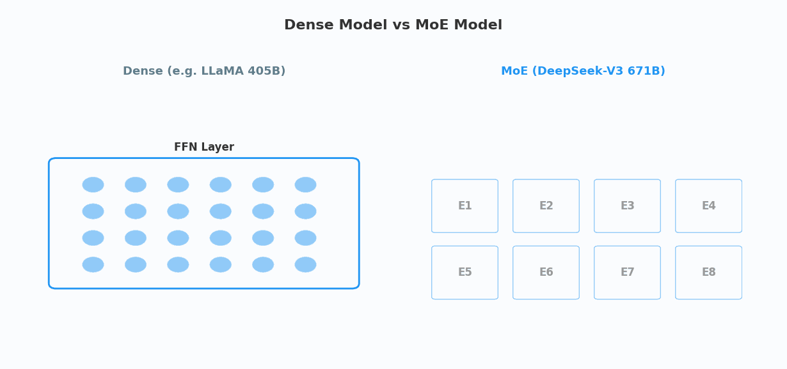
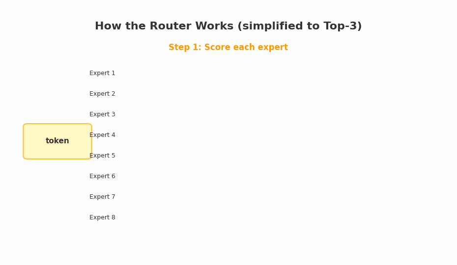
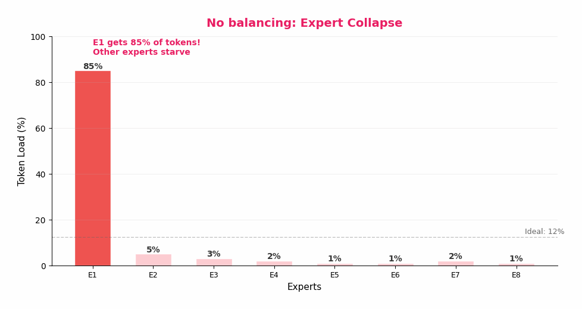
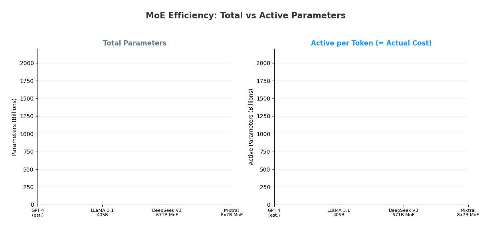

<div style="max-width: 680px; margin: 1.5em auto; padding: 20px 24px; border-radius: 10px; background: linear-gradient(135deg, rgba(233,30,99,0.06), rgba(33,150,243,0.06)); border: 1px solid rgba(233,30,99,0.15);">

<div style="font-weight: bold; margin-bottom: 10px; color: #E91E63; font-size: 1.1em;">📖 导读</div>

上一篇《DeepSeek-R1：一个模型如何学会思考》，我们看到了推理模型的惊人突破——AI 学会了"先想再答"。

但你有没有注意到一个细节？DeepSeek-R1 的完整版有 **6710 亿参数**（671B），却只需要约 556 万美元就训练出来了。作为对比，GPT-4 的训练成本估计超过 1 亿美元。

秘密在于：DeepSeek-V3 的每个 token，**只激活 37B 参数**——不到总量的 6%。

这背后是一个叫做 **Mixture of Experts（混合专家）** 的架构。它的核心思想简单到令人难以置信：**不是所有神经元都需要对每个问题开工。**

这篇文章会告诉你：什么是"专家"？谁来决定激活哪些专家？以及——当所有 token 都挤向同一个专家时，该怎么办？

<div style="font-size: 0.9em; color: #888; margin-top: 12px; line-height: 1.7;">
① 公司类比 → ② Dense vs MoE → ③ 什么是"专家" → ④ 路由机制 → ⑤ 负载均衡 → ⑥ 共享专家 → ⑦ MoE 与彩票假说 → ⑧ 进化史 → ⑨ 成本对比 → ⑩ 意义
</div>

</div>

---

## 第一章：一家公司的比喻 🏢

### 一个你立刻能懂的类比

想象你经营一家 671 人的咨询公司。

<div style="max-width: 660px; margin: 1.5em auto; padding: 16px 20px; border-radius: 8px; background: rgba(255,152,0,0.06); border: 1px solid rgba(255,152,0,0.2);">

**方案 A（Dense 模式）：** 每接到一个客户咨询，**全部 671 人**都去处理这个问题——不管问题是报税、打官司还是修电脑。每个人的工时费都要算进去。

**方案 B（MoE 模式）：** 公司分成 256 个小组，每组是某个领域的专家。前台（路由器）先听客户的问题，然后**只派 8 个最相关的小组**去处理——报税问题就派财务组，打官司就派法律组。其他 248 个组该喝茶喝茶。

</div>

哪个方案更高效？显然是 B。

**这就是 Mixture of Experts 的全部直觉。** DeepSeek-V3 有 671B 参数（= 671 个人），但每个 token 只激活 37B（= 37 个人）。那些没被激活的参数不是废物——它们是"待命的专家"，等着自己擅长的问题到来。

---

## 第二章：Dense vs MoE——两种模型的根本区别 ⚡



<div style="text-align: center; font-size: 0.85em; color: #888; margin-top: -10px; margin-bottom: 20px;">▲ Dense 模型：所有参数全部激活 | MoE 模型：路由器选择少量专家，其余待命</div>

### 标准 Transformer 的 FFN 层

回忆一下，一个标准 Transformer 的每一层是这样的：

```text
输入 → [注意力层] → [加 & 归一化] → [FFN 层] → [加 & 归一化] → 输出
```

其中 **FFN 层**（前馈网络）是计算量最大的部分——它通常占整个 Transformer 块计算量的 **2/3**。在 Dense（密集）模型里，每个 token 都要走完整个 FFN 层的全部参数。

### MoE 的改动

MoE 的改动只有一个：**把单一的 FFN 层，替换成多个 FFN 副本（"专家"）+ 一个路由器。**

```text
Dense Transformer:
输入 → [注意力层] → [单一 FFN] → 输出
                      ↑ 全部参数参与计算

MoE Transformer:
输入 → [注意力层] → [路由器] → [选中的几个 FFN] → 输出
                      ↑ 评分打分   ↑ 只有 Top-K 参与
                      ↑ 选 Top-K   ↑ 其余专家不激活
```

<div style="max-width: 660px; margin: 1.5em auto; padding: 16px 20px; border-radius: 8px; background: rgba(76,175,80,0.06); border: 1px solid rgba(76,175,80,0.15);">

**关键洞察：** MoE 解耦了两个东西——

- **模型容量**（总参数量）= 存储了多少知识
- **计算成本**（活跃参数量）= 每次推理要算多少

一个 671B 的 MoE 模型拥有 **671B 的知识量**，但只需要 **37B 的计算量**。

这就像一个拥有 671 名员工的公司，知识储备是 671 人的总和，但每个项目只需要 37 人的人力成本。

</div>

---

## 第三章：什么是"专家"？——最容易被误解的概念 🔍

### 专家 ≠ 一个完整的模型

这是 MoE 中**最容易被误解的概念**。很多人听到"256 个专家"，以为模型里有 256 个独立的 AI。

**不是的。**

一个"专家"只是一个 **FFN 层**——两个矩阵乘法加一个激活函数：

```text
Expert(x) = W₂ · ReLU(W₁ · x)
```

就这么简单。每个专家的**结构完全相同**，区别只在于**权重不同**。通过训练，不同专家的权重自然地向不同方向发展，形成各自的"专长"。

<div style="max-width: 660px; margin: 1.5em auto; padding: 16px 20px; border-radius: 8px; background: rgba(33,150,243,0.06); border: 1px solid rgba(33,150,243,0.15);">

**类比：** 256 个专家 ≠ 256 个医生。更像是一个大脑里的 **256 个不同的神经通路**——每个通路对不同类型的刺激最敏感。看到文字时激活阅读通路，听到音乐时激活听觉通路。

</div>

### DeepSeek-V3 的具体数字

```text
DeepSeek-V3 架构：
├── 总层数：61 层
├── 前 3 层：标准 Dense FFN（所有 token 走同一条路）
├── 第 4-61 层：MoE 层（58 层，每层有 256+1 个专家）
│   ├── 共享专家：1 个（每个 token 都经过，存储通用知识）
│   └── 路由专家：256 个（每个 token 只选 8 个）
├── 总参数：671B
├── 每 token 激活：37B（= 1 共享 + 8 路由 = 9 个专家的参数）
└── 激活比例：5.5%
```

---

## 第四章：路由器——谁来决定激活哪些专家？ 🎯

### 路由的工作流程

路由器是 MoE 的"前台"——它决定每个 token 应该被哪些专家处理。



<div style="text-align: center; font-size: 0.85em; color: #888; margin-top: -10px; margin-bottom: 20px;">▲ 路由器为每个专家打分，选择得分最高的 K 个，归一化后加权输出</div>

<div style="max-width: 660px; margin: 1.5em auto; padding: 16px 20px; border-radius: 8px; background: rgba(33,150,243,0.06); border: 1px solid rgba(33,150,243,0.15);">

**Step 1：给每个专家打分**

每个专家有一个"重心向量" e_i。路由器计算 token 表示 u_t 和每个专家重心的相似度：

> s(i,t) = sigmoid(u_t · e_i)

直觉：**token 离哪个专家的"重心"更近，分就越高。**

**Step 2：选 Top-K**

从 256 个分数中，选出最高的 K=8 个专家：

> TopK = top_8(s(i,t) + b_i)

其中 b_i 是一个偏置项（后面会讲它的妙用）。

**Step 3：归一化权重**

被选中的 8 个专家的分数做归一化，确保权重总和为 1：

> g(i,t) = s(i,t) / Σ s(j,t) （j 遍历 Top-8）

**Step 4：加权输出**

最终输出 = 共享专家的输出 + 8 个路由专家的加权输出：

> output = FFN_shared(x) + Σ g(i,t) · FFN_i(x)

</div>

<div style="max-width: 660px; margin: 1.5em auto; padding: 16px 20px; border-radius: 8px; background: rgba(76,175,80,0.06); border: 1px solid rgba(76,175,80,0.15);">

**为什么用 sigmoid 而不是 softmax？**

Softmax 让所有专家的分数互相竞争——一个高了另一个就低了。Sigmoid 让每个专家的分数**独立计算**，竞争只发生在 Top-K 选择阶段。

好处：把"评分"和"选择"解耦了。路由器可以先客观评估每个专家的适合程度，再从中选最好的。

</div>

---

## 第五章：负载均衡——MoE 最大的工程难题 ⚖️

### 专家坍塌：一个致命的问题

MoE 听起来很美好，但有一个致命问题：**专家坍塌（Expert Collapse）**。

想象一下：训练初期，Expert 1 碰巧在某类 token 上表现稍好。路由器学到了这一点，开始把更多同类 token 分给 Expert 1。Expert 1 因此得到更多训练数据，变得更强。路由器看到它更强了，分给它的 token 就更多了……

<div style="max-width: 660px; margin: 1.5em auto; padding: 16px 20px; border-radius: 8px; background: rgba(244,67,54,0.06); border: 1px solid rgba(244,67,54,0.15);">

**恶性循环：**

Expert 1 稍好 → 获得更多 token → 变得更强 → 获得更多 token → ……

最终：**85% 的 token 都去了 Expert 1，其他 7 个专家几乎没有数据**。

这就是"坍塌"——256 个专家变成了事实上的 1 个专家，MoE 退化为 Dense 模型，但还多了 255 个专家的参数浪费。

</div>



<div style="text-align: center; font-size: 0.85em; color: #888; margin-top: -10px; margin-bottom: 20px;">▲ 从左到右：无均衡（坍塌）→ 辅助损失（均衡但损害质量）→ 偏置项（均衡且保质）</div>

### 传统方案：辅助损失（Auxiliary Loss）

Google 的 Switch Transformer 提出的解决方案是：给训练损失函数加一个**惩罚项**，如果 token 分布不均匀就扣分。

```text
L_total = L_语言建模 + α × L_均衡惩罚
```

问题是：**这两个目标在打架。** 语言建模说"这个 token 应该去 Expert 1 效果最好"，均衡惩罚说"Expert 1 太忙了去 Expert 5 吧"。α 太小则没效果，太大则损害模型质量。这个超参数极难调。

### DeepSeek 的创新：偏置项（Bias Terms）

DeepSeek-V3 的方案精巧到堪称艺术品：

<div style="max-width: 660px; margin: 1.5em auto; padding: 16px 20px; border-radius: 8px; background: rgba(76,175,80,0.06); border: 1px solid rgba(76,175,80,0.15);">

**核心思路：** 不修改损失函数，而是给每个专家加一个**可调节的偏置项** b_i：

**路由决策：** TopK = top_8(s(i,t) **+ b_i**)    ← 偏置影响"选谁"

**权重计算：** g(i,t) = s(i,t) / Σ s(j,t)         ← 偏置**不**影响"权重多大"

**动态调整（每个训练步之后）：**
- Expert i 太忙了？→ **减小** b_i（让它更难被选中）
- Expert i 太闲了？→ **增大** b_i（让它更容易被选中）

</div>

**为什么这比辅助损失好？**

1. **不干扰梯度：** 偏置只影响"选谁"，不影响"权重多大"——语言建模的梯度完全不受干扰
2. **自我纠正：** 忙的专家自动变得不那么容易被选中，闲的自动变得更容易被选中
3. **实现简单：** 每步训练后，一行代码就能更新所有偏置项
4. **无需调参：** 不需要辅助损失的 α 超参数

<div style="max-width: 660px; margin: 1.5em auto; padding: 16px 20px; border-radius: 8px; background: rgba(255,152,0,0.06); border: 1px solid rgba(255,152,0,0.2);">

**类比：** 医院的分诊台。

传统方案（辅助损失）：硬性规定"每个科室每天必须接诊相同数量的病人"——结果骨科空着等人，而急诊排着长队。

DeepSeek 方案（偏置项）：分诊台根据**各科室当前等候人数**动态调整推荐——急诊太忙了？先推荐去全科看看是不是小问题。但如果病人确实需要急诊，急诊的治疗方案（权重）**不会因为排队而打折扣**。

</div>

---

## 第六章：共享专家——被忽略的关键创新 🧱

### 为什么需要"共享专家"？

DeepSeek-V2 引入了一个看似不起眼、但影响深远的设计：**共享专家（Shared Expert）**。

在纯 MoE 中，如果没有共享专家，会出现一个问题：**很多路由专家会重复学习通用知识。**

比如语法规则——几乎每个 token 都需要知道主谓宾的基本结构。如果没有共享专家，Expert 1 学一遍语法，Expert 2 也学一遍，Expert 256 也学一遍。这是巨大的冗余。

<div style="max-width: 660px; margin: 1.5em auto; padding: 16px 20px; border-radius: 8px; background: rgba(33,150,243,0.06); border: 1px solid rgba(33,150,243,0.15);">

**共享专家的设计：**

```text
DeepSeek-V3 每个 MoE 层：
├── 共享专家 ×1（每个 token 必过，不需要路由）
│   └── 存储：语法、常见模式、通用语义
└── 路由专家 ×256（每个 token 只选 8 个）
    └── 存储：领域专业知识（数学技巧、代码模式、特定语言知识……）
```

共享专家 = **全科医生**（人人都要先看一下）
路由专家 = **专科医生**（按需转诊）

</div>

**效果：** 路由专家不再需要浪费容量去学通用知识，可以把全部容量用于发展自己的专长。这让 256 个路由专家的**有效知识密度**大幅提升。

---

## 第七章：MoE 与彩票假说——一个深层的理论联系 🎰

### 回忆：彩票假说说了什么

在之前的文章《为什么把模型做大就能变聪明？》中，我们介绍过 MIT 的 **彩票假说（Lottery Ticket Hypothesis, 2019）**：

<div style="max-width: 660px; margin: 1.5em auto; padding: 16px 20px; border-radius: 8px; background: rgba(156,39,176,0.06); border: 1px solid rgba(156,39,176,0.15);">

一个大型神经网络中，**高达 96% 的权重可以被移除**，剩下的 4% 子网络性能完全不变。

大网络之所以有效，不是因为它需要那么多参数来"记住"数据，而是因为——**参数越多，越有可能在随机初始化中"碰巧"包含一个有利的小子网络**。

> 每个子网络就是一张彩票。单张中奖概率微乎其微。但当你有**几十亿张彩票**时，中奖就是必然事件。

</div>

当时我们写了一句话：

> **MoE 实现了彩票假说的承诺——每次推理只用一小部分参数——但通过架构设计，而不是事后剪枝。**

现在，让我们把这个联系展开。

### 彩票假说的困境

彩票假说告诉我们：大网络里真正干活的是一个小子网络。那么理论上最高效的做法应该是——先训练大网络，然后找出那个"中奖彩票"子网络，只用它来推理。

但实操完全行不通：

<div style="max-width: 660px; margin: 1.5em auto; padding: 16px 20px; border-radius: 8px; background: rgba(244,67,54,0.06); border: 1px solid rgba(244,67,54,0.15);">

**困境 1：找彩票太贵。** 要找到"中奖"子网络，需要反复训练-剪枝-重置-再训练，对 LLM 来说意味着 30 倍的训练成本。

**困境 2：稀疏在硬件上跑不快。** 找到的子网络是"非结构化稀疏"——权重矩阵里随机散落着零。GPU 为密集矩阵优化，96% 稀疏并不会快 25 倍。

**困境 3：不同问题的"中奖彩票"可能不同。** 处理数学题和处理诗歌，需要的子网络可能完全不一样。一张彩票不够用。

</div>

### MoE：彩票假说的"正确工程实现"

现在让我们看看 MoE 是怎么解决这三个困境的：

<div style="max-width: 660px; margin: 1.5em auto; padding: 16px 20px; border-radius: 8px; background: rgba(76,175,80,0.06); border: 1px solid rgba(76,175,80,0.15);">

| 彩票假说的困境 | MoE 的解法 |
|--|--|
| 找彩票太贵（训练-剪枝-重置 30 轮） | **不需要找！** 路由器在训练过程中自动学会"派活"，每个 token 天然只用最相关的专家 |
| 非结构化稀疏硬件不友好 | **结构化稀疏！** 每个专家是完整的 FFN，GPU 可以高效运算。不用的专家整个跳过，不是跳过零散的权重 |
| 不同问题需要不同子网络 | **路由器动态选择！** 数学 token 路由到"数学专家"，代码 token 路由到"代码专家"。每个 token 有自己的"中奖彩票" |

</div>

### 从理论到工程的闭环

<div style="max-width: 660px; margin: 1.5em auto; padding: 16px 20px; border-radius: 8px; background: rgba(255,152,0,0.06); border: 1px solid rgba(255,152,0,0.2);">

把它们放在一起看：

```text
彩票假说 (理论发现, 2019)
  ↓ 发现：大网络里只有一小部分参数真正干活
  ↓ 问题：怎么高效地只用那一小部分？
  ↓
  ├→ 剪枝路线：训练后删权重（太贵、不友好硬件）
  │
  └→ MoE 路线：训练时就让每个 token 只用一部分专家
     ↓
     DeepSeek-V3 (工程巅峰, 2024)
       671B 参数，每 token 只激活 37B
       不是事后剪枝，而是从架构层面实现"稀疏激活"
       路由器 = 自动找彩票的机制
       每个 token 找到自己的"中奖专家组"
```

</div>

**用一句话概括：** 彩票假说证明了"大网络里只有一小部分在干活"，而 MoE 的设计是——**与其事后去找那一小部分，不如从一开始就让系统自己决定每次激活哪一小部分。**

这就是为什么 MoE 不只是一个工程技巧——它是对"为什么大模型有效"这个基础理论问题的**架构级回答**。

---

## 第八章：MoE 的三十年进化 📜

MoE 不是 DeepSeek 发明的。这个概念已经有 **34 年历史**，但直到最近才真正大放异彩。

<div style="max-width: 660px; margin: 1.5em auto; padding: 16px 20px; border-radius: 8px; background: rgba(156,39,176,0.06); border: 1px solid rgba(156,39,176,0.15);">

```text
1991  Jacobs & Hinton        最早提出 Mixture of Experts
      ↓                      多个小网络 + 门控网络，竞争学习
      ↓
2017  Shazeer (Google)        把 MoE 引入大模型
      ↓                      137B 参数，稀疏门控，Top-K 路由
      ↓
2021  Switch Transformer      简化路由（Top-1），扩展到万亿参数
      ↓                      7 倍训练加速
      ↓
2023  Mixtral 8×7B            MoE 进入开源主流
      ↓                      8 个专家，Top-2，Apache 2.0 许可
      ↓                      性能匹配 GPT-3.5，参数量仅 47B
      ↓
2024  DeepSeek-V2             精细化 MoE
      ↓                      160 个路由专家 + 共享专家隔离
      ↓
2024  DeepSeek-V3             MoE 的当前巅峰
      ↓                      256 路由 + 1 共享，无辅助损失均衡
      ↓                      671B 总参数，37B 活跃，$5.6M 训练
      ↓
2025  Qwen3 MoE              128 个专家，Top-8
                              30B-A3B / 235B-A22B
```

</div>

**一个有趣的观察：** 从 2017 年到 2024 年，MoE 的演化方向一直是——**更多更小的专家、更精细的路由、更巧妙的均衡**。专家数量从 8 → 64 → 160 → 256，每个专家从"大而全"变成"小而精"。

---

## 第九章：成本对比——为什么 MoE 改变了游戏规则 💰

### 训练成本



<div style="text-align: center; font-size: 0.85em; color: #888; margin-top: -10px; margin-bottom: 20px;">▲ 总参数决定知识容量，活跃参数决定实际成本——MoE 在两者之间找到了甜蜜点</div>

<div style="max-width: 660px; margin: 1.5em auto; padding: 16px 20px; border-radius: 8px; background: rgba(76,175,80,0.06); border: 1px solid rgba(76,175,80,0.15);">

| 模型 | 总参数 | 活跃参数 | 激活比 | 估计训练成本 |
|------|--------|---------|--------|-------------|
| GPT-4（估计） | ~1.8T | ~1.8T（Dense） | 100% | >$100M |
| LLaMA-3.1 405B | 405B | 405B（Dense） | 100% | ~$30M+ |
| **DeepSeek-V3** | **671B** | **37B** | **5.5%** | **$5.6M** |
| Mixtral 8×7B | 47B | 13B | 27.6% | 未公开 |

</div>

**DeepSeek-V3 用不到 GPT-4 训练成本的 1/20，达到了接近 GPT-4o 的性能。** 这不是因为 DeepSeek 找到了什么魔法——而是 MoE 架构本身就允许用更少的计算获得更多的知识容量。

### 推理成本

MoE 在推理时也更便宜：
- **计算量：** 每个 token 只做 37B 的矩阵运算，不是 671B
- **延迟：** 单 token 延迟接近 37B Dense 模型
- **吞吐量：** 同样的 GPU 可以处理更多请求

<div style="max-width: 660px; margin: 1.5em auto; padding: 16px 20px; border-radius: 8px; background: rgba(255,152,0,0.06); border: 1px solid rgba(255,152,0,0.2);">

**但 MoE 有一个代价：内存。** 虽然每个 token 只用 37B 参数，但全部 671B 参数必须**同时驻留在显存中**——因为你不知道下一个 token 会被路由到哪个专家。

这意味着 MoE 模型需要**更多的 GPU 数量**来部署（放不下就得分片），但每个 GPU 的**实际计算利用率更高**。

</div>

---

## 第十章：这一切意味着什么？ 🔭

<div style="max-width: 660px; margin: 1.5em auto; padding: 16px 20px; border-radius: 8px; background: rgba(255,152,0,0.06); border: 1px solid rgba(255,152,0,0.2);">

**意义 1：AI 的"大脑"也需要分工**

人类大脑有约 860 亿个神经元，但在任何给定时刻，只有一小部分是活跃的。看文字时视觉皮层活跃，听音乐时听觉皮层活跃，做数学时前额叶皮层活跃。

MoE 模型走向了同样的路径：**不是让所有参数对所有问题都开工，而是让合适的参数处理合适的问题。** 这不仅仅是工程优化——这可能是通向更大规模智能的必经之路。

</div>

<div style="max-width: 660px; margin: 1.5em auto; padding: 16px 20px; border-radius: 8px; background: rgba(33,150,243,0.06); border: 1px solid rgba(33,150,243,0.15);">

**意义 2：AI 平权的催化剂**

如果训练一个顶级模型需要 1 亿美元，那只有 OpenAI、Google 这样的公司玩得起。但如果 MoE 把成本降到 560 万美元——大学实验室、中小企业、开源社区都有了参与前沿研究的可能。

DeepSeek-V3 的 $5.6M 训练成本不仅是技术成就，更是**AI 民主化**的标志性事件。

</div>

<div style="max-width: 660px; margin: 1.5em auto; padding: 16px 20px; border-radius: 8px; background: rgba(76,175,80,0.06); border: 1px solid rgba(76,175,80,0.15);">

**意义 3：Dense 模型可能已经到头了**

当你需要更多知识容量时，Dense 模型的唯一选择是加参数——但每加一个参数，每个 token 的计算成本也增加一个参数。这是线性增长。

MoE 打破了这个约束：**加参数不加计算。** 你可以把模型扩展到万亿参数级别，而推理成本只是百亿级。

这就是为什么 2024 年之后，几乎所有前沿大模型——DeepSeek-V3、Qwen3、Llama 4 Maverick——**都选择了 MoE 架构。** Dense 模型的时代，可能正在结束。

</div>

---

## 结语：不是所有神经元都需要同时工作

<div style="max-width: 660px; margin: 1.5em auto; padding: 20px 24px; border-radius: 10px; border: 2px solid #FF9800; background: rgba(255,152,0,0.04);">

回到最初的问题：671B 参数的模型，为什么只用 37B 就够了？

因为——**"够了"本身就是一个伪命题。** 不是"37B 够了"，而是"对于这个 token，37B 是最相关的那部分"。其他 634B 参数不是多余的——它们在等待属于自己的 token。

这像是大自然早就想通的道理：**你的大脑不会同时激活所有神经元，你的身体不会同时使用所有肌肉，你的公司不应该让全体员工处理每一个客户。**

效率的秘密从来不是"做更多"，而是"在对的时候做对的事"。

MoE，就是 AI 学会的这个道理。

</div>

---

<div style="max-width: 680px; margin: 1.5em auto; padding: 20px 24px; border-radius: 8px; background: rgba(233,30,99,0.04); border: 1px solid rgba(233,30,99,0.12);">

**📚 延伸阅读**

- DeepSeek-V3 技术报告：[arXiv 2412.19437](https://arxiv.org/abs/2412.19437)
- Switch Transformer：[arXiv 2101.03961](https://arxiv.org/abs/2101.03961)
- Mixtral 8×7B：[arXiv 2401.04088](https://arxiv.org/abs/2401.04088)
- 原始 MoE 论文：Jacobs, Jordan, Nowlan, Hinton (1991)
- 上一篇：**[DeepSeek-R1：一个模型如何学会思考](/ai-blog/posts/deepseek-r1-thinking/)**
- 下一篇预告：**从 RLHF 到 GRPO** —— 大模型训练的三次革命

</div>

<div style="margin-top: 30px; padding-top: 20px; border-top: 1px solid #e0e0e0; font-size: 0.9em; color: #888;">

博客：https://Jason-Azure.github.io/ai-blog/

微信公众号：AI-lab学习笔记

</div>
