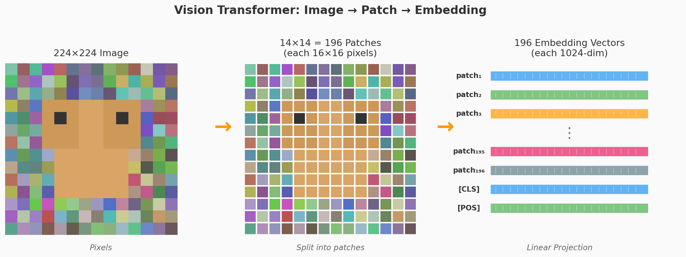
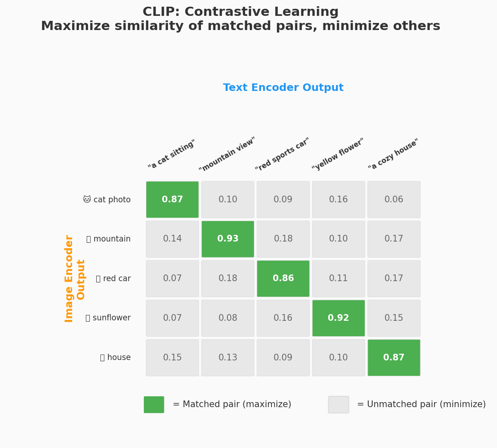
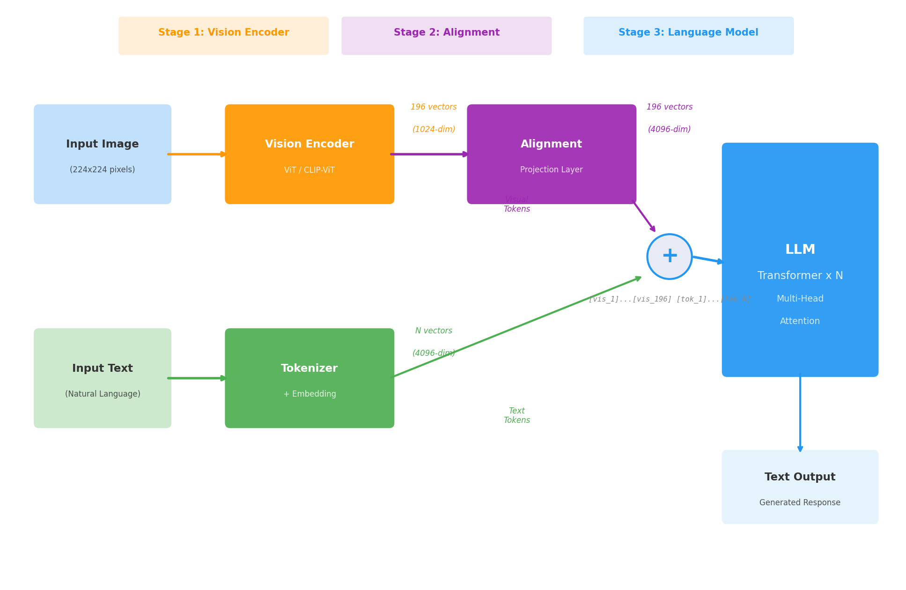
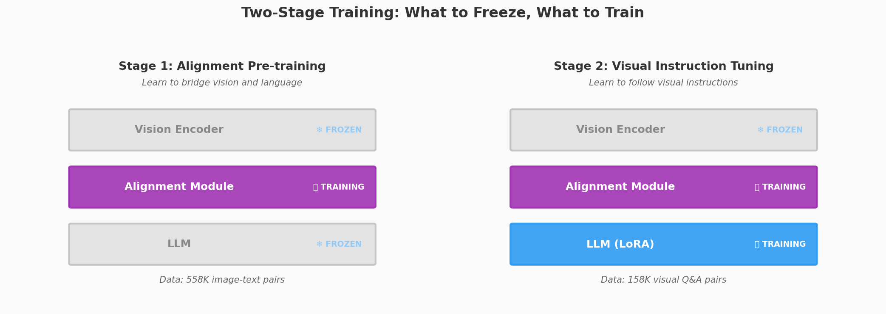

## 从 Embedding 说起

在 [《当数字学会了远近亲疏》](/ai-blog/posts/embedding/) 那篇文章中，我们走到了一个惊人的结论：

> 文字、图片、声音——不同的入口，同一个空间。"猫"这个概念，无论你写它、拍它、还是听它叫——在足够好的 Embedding 中，它们都是邻居。

**但那篇文章留了一个核心问题没有展开。**

好，它们在同一个空间了——然后呢？

当你给 GPT-4V 一张照片说"描述这张图"，它内部到底发生了什么？CLIP 只是让图文向量"靠近"，但 GPT-4V 能**看着图片生成一段话**——这中间的鸿沟是怎么跨过去的？

今天这篇文章就来回答这个问题。

---

## 一、两个世界的语言

### 文本：离散的、有限的

文本对计算机来说是"友好"的。词表是有限的（5 万到 15 万个 token），每个 token 有一个编号，通过 Embedding 矩阵查表得到一个向量。

```text
"国王戴着金色的王冠"
    ↓ Tokenizer
["国王", "戴", "着", "金色", "的", "王冠"]
    ↓ Embedding 查表
[vec₁, vec₂, vec₃, vec₄, vec₅, vec₆]    ← 每个 vec 是一个 4096 维的向量
```

这个过程在 Embedding 那篇文章里已经讲透了：**本质上就是查一张训练出来的表。**

### 图像：连续的、无穷的

图像就不一样了。一张 224×224 的 RGB 图像是一个 224×224×3 = 150,528 个数字的矩阵。每个像素的值是 0-255 之间的连续数值。

关键区别：

```text
文本: 词表有限（5万个）→ 可以为每个 token 存一行 Embedding → 查表
图像: 像素组合无穷    → 不可能为每种图像存一行 Embedding → 必须"计算"
```

**文本 Embedding 是查表，图像 Embedding 是计算。** 这个区别决定了后面所有的架构设计。

### Transformer 的限制

还有一个更实际的问题。Transformer（LLM 的核心架构）处理的是**序列**——一排 token，一个接一个。Attention 机制在 token 之间计算相关性。

文本天然就是序列。但图像是一个二维网格，不是序列。

**所以，第一个要解决的问题是：怎么把一张图变成一个 token 序列？**

但在回答这个问题之前，有一个更根本的问题需要先回答。

### 等一下——CNN 不是早就能处理图像了吗？

如果你对深度学习有一些了解，可能会问：**卷积神经网络（CNN）从 2012 年起就在图像识别上大杀四方了，为什么不继续用 CNN，非要用 Transformer？**

这个问题问得好。

CNN 在图像领域的成就是真实的：

```text
2012  AlexNet 赢 ImageNet 大赛，错误率直接砍半 → 深度学习爆发
2015  ResNet 做到 152 层，图像识别准确率超越人类
2017  人脸识别、自动驾驶、医学影像检测 → 全部基于 CNN
```

CNN 擅长图像，是因为它天生为图像设计——卷积核在图像上"滑动"，捕捉局部特征（边缘、纹理、形状），层层叠加从低级特征到高级语义。

**但 CNN 有一个根本局限：它的输出是一个固定的特征向量——一个"总结"，而不是一个"序列"。**

```text
CNN 能做的：
  一张图 → "这是猫" (分类)
  一张图 → "猫在这个位置" (检测)
  一张图 → "这些像素属于猫" (分割)

CNN 做不了的：
  一张图 + "图里有什么？" → 生成一段话回答
  一张图 + 一段文字 → 综合推理

因为 CNN 只输出一个"结论向量"，它没办法和文字序列混在一起做 Attention。
```

打个比方：CNN 像一个只会写"诊断结论"的医生——输入一张片子，输出"肺结节，3mm，右上叶"。它不会和你对话，不会回答"为什么你觉得是结节而不是血管断面？"

### Transformer：一个意外的"通用引擎"

2017 年 Transformer 为自然语言发明之后，大家逐渐发现一件意外的事：

```text
文本用 Transformer → GPT, BERT          → 效果最好
图像用 Transformer → ViT (2020)         → 追平甚至超越 CNN
语音用 Transformer → Whisper            → 效果最好
蛋白质用 Transformer → AlphaFold 2      → 革命性突破

一个架构，统一了所有领域。
```

为什么 Transformer 能做到这一点？因为它的工作方式是**模态无关的**：

```text
CNN: 用固定大小的卷积核在二维网格上"滑动"
     → 天然适合图像，但不适合变长序列（文本）

Transformer: 接收一组向量，用 Attention 计算每个向量和其他所有向量的关系
     → 它不关心这些向量来自哪里——文字、图像、音频，都只是"向量"
     → 模态无关 (modality-agnostic)
```

**所以，选择 Transformer 不是因为它处理图像比 CNN 更强——在纯图像任务上两者差不多。而是因为 Transformer 是目前唯一一个能同时处理多种模态的统一架构。**

一个有趣的事实：CLIP 最早的版本，图像编码器用的其实是 ResNet（一种 CNN）。后来才换成 ViT。这说明 CNN 并没有被"淘汰"——它仍然可以做视觉编码器。但不管用 CNN 还是 ViT 做视觉编码器，最终输出都要变成一组向量，喂进 Transformer LLM。整个系统的"大脑"是 Transformer，视觉编码器只是"眼睛"。

用 ViT 做"眼睛"的好处是：输入输出都是 Transformer，端到端同一种架构，优化更简单。

理解了这个背景，ViT 的出现就不再突兀了——它是让 Transformer 统一所有模态的关键一步。

---

## 二、让图像变成 token — Vision Transformer

### 一个优雅的想法

2020 年底，Google 的 Dosovitskiy 等人提出了一个看似简单但影响深远的想法：

> **把图像切成小块（patch），每个小块当作一个"视觉词元"（visual token）。**

就像文本被切成 token 一样，图像也可以被切成 patch。然后用 Transformer 处理这些 patch——**和处理文本用的是同一套架构**。

这就是 **Vision Transformer (ViT)**。论文的标题说明了一切：*"An Image is Worth 16×16 Words"*——一张图片值 16×16 个词。

> Dosovitskiy, A. et al. (2020). *An Image is Worth 16x16 Words: Transformers for Image Recognition at Scale*. ICLR 2021.

### 具体怎么做？

```text
一张 224×224 的图像：

  1. 切成 patch
     ────────────
     每个 patch 是 16×16 像素
     224 ÷ 16 = 14
     所以得到 14×14 = 196 个 patch

  2. 展平 (Flatten)
     ────────────
     每个 patch 原本是 16×16×3 = 768 个像素值
     把它展平成一个 768 维的向量

  3. 线性投影 (Linear Projection)
     ────────────
     用一个可学习的矩阵 E (768×D)，把每个 patch 向量投影到 D 维
     D 通常是 768 或 1024

  4. 加上位置编码
     ────────────
     每个 patch 加上一个可学习的位置向量
     让模型知道"这个 patch 在图像的哪个位置"

  5. 送入 Transformer
     ────────────
     196 个向量组成一个序列
     用标准的 Multi-Head Attention + MLP 处理
     和 GPT 处理文本 token 的方式完全一样
```



<div style="text-align: center; font-size: 0.85em; color: #888; margin-top: -10px; margin-bottom: 20px;">▲ Vision Transformer：图像 → 切 patch → 线性投影 → Embedding 向量序列</div>

### 和文本 Embedding 的对比

这个过程和文本 Embedding 有惊人的相似，也有关键的不同：

| | 文本 Embedding | 图像 Embedding (ViT) |
|---|-------|-----------|
| 输入单元 | Token（词/子词） | Patch（16×16 像素块） |
| 映射方式 | **查表**（Embedding 矩阵的一行） | **计算**（线性投影） |
| 输入维度 | 离散编号（如 1820） | 连续向量（768 维） |
| 输出维度 | 通常 768-4096 | 通常 768-1024 |
| 序列长度 | 可变（取决于文本长度） | 固定 196（14×14） |
| 位置编码 | 1D（第几个 token） | 2D → 1D（第几行第几列，展平） |

**核心洞察**：文本是从一个有限的词表中查表，所以用 `nn.Embedding`（一个矩阵）。图像的输入空间是连续的、无穷的，不可能为每种像素组合存一行，所以用线性投影（一次矩阵乘法）来"计算"出 Embedding。

**但从 Transformer 的角度看，文本 token 和视觉 token 长得一模一样**——都是一个固定维度的向量。Transformer 不关心这个向量是查表来的还是计算来的。这就是 Transformer 的通用性：**它是一个序列处理引擎，不挑食。**

### ViT 的一个额外 token：[CLS]

ViT 在 196 个 patch token 前面加了一个特殊的 **[CLS] token**（class token）。这个 token 没有对应任何图像区域，它的初始值是随机初始化的。

```text
输入序列: [CLS] [patch₁] [patch₂] ... [patch₁₉₆]

经过 N 层 Transformer 后:
  [CLS] 的输出向量通过 Attention 汇聚了所有 patch 的信息
  → 用这个向量做图像分类
```

[CLS] token 的作用是"总结全局信息"——它通过 Attention 和所有 patch 交互，最终得到一个代表整张图像的向量。

> 这个设计借鉴自 NLP 中的 BERT——BERT 也在序列开头放一个 [CLS] token 用于分类。**又一次，文本和视觉共享了同一个设计模式。**

---

## 三、对比学习 — 让文字和图片住进同一个空间

ViT 解决了"把图像变成 token 序列"的问题。但 ViT 输出的向量和 LLM 中文本的向量，**不在同一个空间**。

一个 ViT 训练出来做图像分类，它的向量空间被组织成"猫 vs 狗 vs 车 vs ..."。一个 GPT 训练出来做文本生成，它的向量空间被组织成"国王 vs 王后 vs 的 vs ..."。

**这两个空间没有任何对应关系。** "猫"的图像向量和"猫"的文本向量，可能指向完全不同的方向。

怎么让它们对齐？

### CLIP 的方案：一起训练，互相靠近

2021 年，OpenAI 提出了 **CLIP (Contrastive Language-Image Pre-training)**，用一个简单而强大的想法解决了这个问题：

> **不分别训练图像模型和文本模型，而是同时训练，让匹配的图文对的向量尽可能近，不匹配的尽可能远。**

> Radford, A. et al. (2021). *Learning Transferable Visual Models From Natural Language Supervision*. ICML.

### 训练数据

CLIP 从互联网上收集了 **4 亿个（图片, 文字描述）配对**。比如：

```text
(一张猫坐在垫子上的照片, "a cat sitting on a mat")
(一张日落的照片, "beautiful sunset over the ocean")
(一张红色跑车的照片, "red sports car on the road")
...
× 4 亿对
```

### 训练过程

CLIP 有两个编码器：一个**图像编码器**（ViT），一个**文本编码器**（Transformer）。训练时：

```text
一个 batch 有 N 个图文对（CLIP 原论文中 N = 32,768）

  图像编码器: img₁, img₂, ..., imgₙ  → I₁, I₂, ..., Iₙ  (图像向量)
  文本编码器: txt₁, txt₂, ..., txtₙ  → T₁, T₂, ..., Tₙ  (文本向量)

计算 N×N 的余弦相似度矩阵:

         T₁      T₂      T₃    ...   Tₙ
  I₁  [ 0.92   0.03    0.08   ...  0.01 ]  ← 希望对角线最大
  I₂  [ 0.05   0.89    0.02   ...  0.04 ]
  I₃  [ 0.01   0.07    0.91   ...  0.06 ]
  ...
  Iₙ  [ 0.03   0.02    0.01   ...  0.87 ]

训练目标：
  ✓ 对角线（匹配对）→ 相似度尽可能高
  ✗ 非对角线（不匹配对）→ 相似度尽可能低
```



<div style="text-align: center; font-size: 0.85em; color: #888; margin-top: -10px; margin-bottom: 20px;">▲ CLIP 对比学习：N×N 相似度矩阵，对角线是匹配对（绿色），其余是不匹配对</div>

### 对比学习的直觉

为什么这种方式有效？

```text
想象一个巨大的向量空间。训练开始时，图像向量和文本向量随机分布。

第一步：模型看到 (猫的照片, "a cat sitting")
  → 把"猫照片的向量"和"a cat sitting的向量"往一起拉
  → 同时把它们和 batch 中其他所有不匹配的向量推远

经过几十亿次这样的拉近/推远操作后：
  - 所有猫的图片向量，和所有关于猫的文字向量，聚在了一起
  - 所有汽车的图片向量，和所有关于汽车的文字向量，聚在了另一起
  - ...

最终：图像和文本共享了一个语义空间。
```

**这就是在 Embedding 文章中提到的"让文字和图片住进同一个空间"的具体实现方式。**

### 温度参数 τ

CLIP 的损失函数中有一个可学习的"温度参数" τ（tau）：

```text
相似度计算: sim(I, T) = cos(I, T) / τ

τ 小 → 相似度被放大 → 模型对"匹配/不匹配"的区分更严格
τ 大 → 相似度被压缩 → 模型对区分更宽容
```

CLIP 让 τ 也作为可学习的参数，让模型自己找到最合适的"严格程度"。这是一个优雅的设计——不用人为调参，让模型自己决定。

### 训练完成后能做什么？

```text
零样本分类 (Zero-Shot Classification):
  给一张新图片，和一组文字标签（"猫", "狗", "车", "飞机"...）
  计算图片向量和每个标签向量的相似度
  相似度最高的就是分类结果
  → 不需要任何标注数据！只需要写出类别名字

以文搜图:
  输入文字 "a dog playing in the snow"
  在图库中找和这段文字最相似的图片向量
  → 语义搜索

以图搜文:
  给一张图，找和它最匹配的文字描述
```

**CLIP 让图像和文本在同一个空间中用同一种"语言"交流。** 这为后面的多模态 LLM 奠定了基础——因为多模态 LLM 需要一个"已经懂得图像语义"的视觉编码器，而 CLIP 正好提供了这样一个编码器。

---

## 四、三段式架构 — 多模态 LLM 的工作原理

有了 ViT（把图像变成 token）和 CLIP（让图文对齐），终于可以回答今天的核心问题了：

**一个多模态 LLM 是怎么"看着图片说话"的？**

### 核心架构

当前主流的多模态 LLM（LLaVA, Qwen-VL, InternVL, GPT-4V 等）都采用类似的"三段式"架构：



<div style="text-align: center; font-size: 0.85em; color: #888; margin-top: -10px; margin-bottom: 20px;">▲ 多模态 LLM 架构：三个组件的协作——视觉编码器、对齐模块、语言模型</div>

### 三个组件的职责

**① 视觉编码器 — AI 的"眼睛"**

```text
输入: 一张图像 (224×224×3)
输出: 196 个视觉特征向量 (每个 1024 维)

通常使用预训练好的 CLIP-ViT，权重冻结不动。
为什么冻结？因为 CLIP 已经在 4 亿图文对上训练好了，
它已经"学会了看"——不需要从头学。
```

**② 对齐模块 — "翻译官"**

```text
输入: 196 个视觉向量 (1024 维)
输出: 196 个对齐后的向量 (4096 维)

问题: 视觉编码器输出的向量是 1024 维，
      LLM 的输入需要 4096 维。
      而且它们不在同一个空间——维度、含义都不匹配。

对齐模块做两件事:
  1. 维度映射: 1024 → 4096
  2. 语义对齐: 让视觉特征进入 LLM 能"理解"的空间
```

**③ LLM — "大脑"**

```text
输入: [视觉token₁]...[视觉token₁₉₆][文本token₁]...[文本tokₙ]
输出: 逐 token 生成文本回答

LLM 不知道（也不需要知道）前 196 个 token 来自图像。
对它来说，这就是一个普通的 token 序列。
它用标准的 Multi-Head Attention 处理这个序列——
文本 token 会 attend to 视觉 token，找到相关的视觉信息，
然后基于这些信息生成回答。
```

### 用一个具体例子走一遍

假设你给多模态 LLM 一张苹果的照片，问："这张图片里是什么？它是什么颜色的？"

```text
Step 1: 视觉编码器处理图像
  ────────────────────────
  苹果照片 (224×224)
    → ViT 切成 196 个 patch
    → 每个 patch 通过 Transformer 层
    → 输出 196 个 1024 维向量

  其中:
    苹果主体区域的 patch → 向量编码了"圆形、红色、光滑表面"的特征
    背景区域的 patch → 向量编码了"白色、平坦"的特征

Step 2: 对齐模块
  ────────────────────────
  196 个 1024 维向量
    → 线性投影: × W (1024×4096) + b
    → 196 个 4096 维向量

  这些向量被映射到了 LLM 的词向量空间附近——
  苹果区域的视觉 token 现在和 "苹果"、"红色" 等文字 token 在空间中距离较近

Step 3: LLM 处理混合序列
  ────────────────────────
  输入序列:
    [vis₁][vis₂]...[vis₁₉₆] [这张][图片][里是][什么][？][它][是][什么][颜色][的][？]
     ↑ 来自对齐模块              ↑ 来自 Tokenizer + Embedding

  Attention 在工作:
    当 LLM 生成回答时——
    "图片" 这个 token attend to 所有视觉 token
    → 发现苹果区域的视觉 token 贡献最大
    → 在隐状态中激活了"苹果"的概念

    "颜色" 这个 token attend to 苹果区域的视觉 token
    → 发现这些 token 编码了"红色"的特征
    → 在隐状态中激活了"红色"的概念

Step 4: 逐 token 生成回答
  ────────────────────────
  "图" → "片" → "中" → "是" → "一" → "个" → "红" → "色" → "的" → "苹" → "果" → "。"

  每生成一个 token，模型都可以回头 attend to 视觉 token，
  确保回答与图像内容一致。
```

> **关键理解**：多模态 LLM 并没有发明新的 Attention 机制。它用的就是标准的 Transformer Attention——只不过 Attention 的输入序列中，前面一段是视觉 token，后面一段是文本 token。**Transformer 本身不区分两者**，它只是在"一堆向量"之间计算相关性。

这也解释了为什么对齐模块如此重要——如果视觉 token 和文本 token 不在同一个向量空间里，Attention 计算出来的相关性就是无意义的。

---

## 五、对齐模块的三种方案 — 翻译官的不同风格

对齐模块是多模态 LLM 中设计空间最大的部分。不同的模型选择了不同的方案，各有优劣。

### 方案 A：线性投射 — 简单直接 (LLaVA)

```text
视觉特征 (196个, 1024维)
    ↓
    × W (1024×4096) + b    ← 就是一次矩阵乘法
    ↓
对齐后的视觉 token (196个, 4096维)

参数量: 1024 × 4096 ≈ 400 万
训练: 只需要训练这 400 万个参数
```

LLaVA（Liu et al., 2023）选择了最简单的方案——一个线性层。

> Liu, H. et al. (2023). *Visual Instruction Tuning*. NeurIPS.

为什么这么简单也能工作？

因为 CLIP 的视觉编码器已经学了一个很好的语义空间。视觉特征已经"知道"什么是猫、什么是红色。对齐模块只需要做一个**坐标变换**——把 1024 维的坐标系旋转/缩放/平移到 4096 维的 LLM 坐标系。

LLaVA 论文的一个重要发现是：**仅靠一个线性层，加上足够好的视觉编码器和足够好的训练数据，就能达到令人惊讶的效果。** 简单不等于差。

### 方案 B：Q-Former — 用 query 提问 (BLIP-2)

```text
视觉特征 (196个, 1024维)
    │
    │   32 个可学习的 query token
    │        ↓
    └──→ Cross-Attention: query attend to 视觉特征
                ↓
        32 个输出向量 (768维)
                ↓
            线性投影
                ↓
        32 个 LLM 输入 token (4096维)
```

BLIP-2（Li et al., 2023）用了一个更复杂的方案。它不是直接投影 196 个视觉 token，而是用 32 个**可学习的 query token** 通过 **Cross-Attention** 去"查询"视觉特征。

> Li, J. et al. (2023). *BLIP-2: Bootstrapping Language-Image Pre-training with Frozen Image Encoders and Large Language Models*. ICML.

**query 的直觉**：想象 32 个记者去采访 196 个目击者。每个记者有自己的"采访角度"（query），它通过 Attention 从 196 个目击者中提取最相关的信息。最终，32 个记者的报道（而不是 196 个目击者的原始证词）被提交给 LLM。

**Q-Former 的好处**：

1. **信息压缩**：196 → 32，减少了 LLM 需要处理的视觉 token 数，降低了计算成本
2. **可学习的提取**：query token 可以学到"什么信息对 LLM 最有用"
3. **灵活性**：query 的数量可以调，精度和效率可以权衡

**代价**：比线性投射复杂得多，有 ~188M 参数需要训练。

### 方案 C：动态分辨率 (Qwen-VL, InternVL)

```text
问题: 不同图片的有效内容大小不同
  - 一张全景照 → 需要高分辨率（大图切更多 patch）
  - 一个简单的图标 → 低分辨率就够了（小图少切几个 patch）

ViT 默认切固定数量的 patch (196个)——不管图片是什么。

动态分辨率方案:
  1. 根据图像内容，选择合适的分辨率
  2. 不同分辨率切出不同数量的 patch
  3. 用 Resampler 或 Perceiver 将可变数量的视觉 token
     压缩到固定数量

  例如 Qwen-VL:
    小图: 256 个 token
    中图: 512 个 token
    大图/高细节: 1280 个 token
```

这个方案在 Qwen-VL 和 InternVL 2 中被采用。好处是对高分辨率图像的细节保留更好，代价是实现复杂度更高。

### 三种方案对比

| | 线性投射 (LLaVA) | Q-Former (BLIP-2) | 动态分辨率 (Qwen-VL) |
|---|---|---|---|
| **复杂度** | 极简 | 中等 | 较高 |
| **对齐模块参数** | ~4M | ~188M | ~50-100M |
| **视觉 token 数** | 196（不变） | 32（压缩） | 256-1280（动态） |
| **细节保留** | 一般 | 较少（压缩了） | 好 |
| **适合场景** | 通用 | 效率优先 | 高细节需求 |

### 一个设计哲学的问题

这三种方案背后有一个更深的问题：**对齐模块应该做多少"理解"？**

```text
极简派 (LLaVA):
  对齐模块只做坐标变换，不做理解。
  理解全部交给 LLM。
  哲学: "把原始信息尽可能完整地传给 LLM，让 LLM 自己决定怎么用"

压缩派 (BLIP-2):
  对齐模块先做一轮信息提取，然后传给 LLM。
  哲学: "先帮 LLM 筛选好重要信息，减轻 LLM 的负担"

自适应派 (Qwen-VL):
  根据输入内容动态调整传递的信息量。
  哲学: "简单的图少传，复杂的图多传"
```

目前没有定论哪种更好——在不同的任务和规模下，答案可能不同。但 LLaVA 用最简单的方案取得了很好的效果，这本身就是一个值得思考的事实：**有时候，不在中间层过度加工，反而是更好的选择。**

---

## 六、训练过程 — 分阶段解冻

多模态 LLM 的训练不是"从头到尾一起训"，而是**分阶段**的。每个阶段解冻不同的组件。

### 为什么要分阶段？

```text
三个组件的状态:
  视觉编码器 → 在 CLIP 上预训练好了，已经"会看"
  LLM → 在大规模文本上预训练好了，已经"会说"
  对齐模块 → 随机初始化，什么都不会

如果一开始就全部一起训:
  对齐模块在学习"怎么翻译"的同时，
  可能会把 ViT 和 LLM 已经学好的知识搅乱
  → 灾难性遗忘 (catastrophic forgetting)

所以: 先只训练对齐模块（让它学会翻译），
      再逐步解冻其他部分（让整个系统磨合）。
```

### LLaVA 的两阶段训练

以 LLaVA 为例（最清晰的两阶段方案）：



<div style="text-align: center; font-size: 0.85em; color: #888; margin-top: -10px; margin-bottom: 20px;">▲ 两阶段训练：Stage 1 只训练对齐模块，Stage 2 解冻 LLM 做指令微调</div>

**Stage 1：图文对齐预训练（Feature Alignment）**

```text
目标: 让对齐模块学会"翻译"——把视觉特征翻译成 LLM 能理解的格式

冻结: ✅ 视觉编码器（CLIP ViT）    ← 已经会看了，别动
      ✅ LLM（如 Vicuna-13B）     ← 已经会说了，别动
训练: 🔥 对齐模块（线性投射层）     ← 从随机开始学

数据: 558,000 个 (图片, 文字描述) 配对
      来源: CC3M 数据集，GPT-4 帮忙生成描述

任务: 给一张图片，生成对应的文字描述
      让对齐模块学到: 怎么把视觉向量投射到 LLM 的空间中，
      使得 LLM 能基于视觉 token 生成正确的描述

训练时间: 约 4 小时 (8× A100)
```

这个阶段结束后，对齐模块已经学会了基本的翻译——但模型只会"描述图片"，还不会"回答关于图片的问题"。

**Stage 2：视觉指令微调（Visual Instruction Tuning）**

```text
目标: 让模型学会按照指令回答关于图片的问题

冻结: ✅ 视觉编码器             ← 继续冻结
训练: 🔥 对齐模块               ← 继续微调
      🔥 LLM（全参数或 LoRA）  ← 解冻！开始调整

数据: 158,000 条视觉问答/对话数据
      格式: (图片, 问题) → 回答
      用 GPT-4 / GPT-4V 帮忙生成高质量的问答对

例子:
  图片: 一张厨房的照片
  问题: "这个厨房有什么不寻常的地方？"
  回答: "这个厨房的不寻常之处在于水槽里堆满了脏盘子，
        而台面上摆着一个看起来很精致的蛋糕..."

训练时间: 约 10 小时 (8× A100)
```

这个阶段结束后，模型不仅会描述图片，还会回答各种问题、进行多轮对话、做推理。

### 为什么视觉编码器始终冻结？

```text
两个原因:

1. 效率: ViT 有 ~300M 参数，冻结它可以节省大量计算
2. 保护: CLIP-ViT 在 4 亿图文对上训练的视觉能力非常强，
         如果解冻它用少量数据微调，可能会破坏这种能力

但也有例外: 当领域和 CLIP 的预训练数据差异很大时
（比如医学影像、卫星图像），可能需要解冻 ViT 做适配。
```

---

## 七、从静态到动态 — 视频怎么处理？

静态图像的问题已经基本解决了。但现实中很多重要的视觉信息是**动态的**——视频、超声、DSA 造影序列。

### 核心挑战：时间维度

```text
静态图像: 一帧 → 196 个 token → 送入 LLM
视频:     T 帧 → T × 196 个 token → 送入 LLM?

如果 T = 8 帧:  8 × 196 = 1,568 个视觉 token
如果 T = 32 帧: 32 × 196 = 6,272 个视觉 token
如果 T = 1 秒 (24fps): 24 × 196 = 4,704 个视觉 token

LLM 的上下文窗口通常是 4K-128K 个 token。
视觉 token 太多会挤占文本空间，也会让 Attention 的计算量暴增
（Attention 的计算量和序列长度的平方成正比）。
```

### 三种处理方案

**方案 1：均匀抽帧**

```text
从视频中均匀抽取 N 帧（比如 8 帧）
每帧独立通过视觉编码器 → 8 × 196 = 1568 个 token
（可选）每帧做 token 压缩 → 8 × 64 = 512 个 token
拼接后送入 LLM

优点: 简单，复用静态图像的全部技术
缺点: 丢失了帧间的连续性，可能遗漏关键动作
```

**方案 2：时序 Attention**

```text
每帧独立编码后，加一层时序 Attention:
  帧 1 的 token 可以 attend to 帧 2, 3, ... 的 token
  → 建模帧间的变化（运动、变化、因果关系）

优点: 保留了时间信息
缺点: token 数翻倍增长，计算量大
```

**方案 3：3D 编码器（视频原生）**

```text
用 3D 卷积或 Video Transformer 直接处理 T×H×W 的视频张量
从一开始就在时间和空间上联合建模

优点: 时空信息保留最好
缺点: 计算量大，预训练模型较少
```

### 当前的前沿

| 模型 | 方案 | 最大帧数 |
|------|------|---------|
| Video-LLaVA | 均匀抽帧 | 8 帧 |
| LLaVA-NeXT-Video | 抽帧 + 压缩 | 32 帧 |
| Qwen-VL-Plus | 动态帧数 | 可变 |
| Gemini 1.5 | 原生长上下文 | 3600 帧 (1分钟) |

**视频理解仍然是一个活跃的前沿研究方向。** 尤其是长视频（几分钟到几小时）的理解，还远未解决。

### 动态影像序列的特殊性

医学中的 DSA 造影、超声视频等动态影像序列，和一般视频有关键的不同：

```text
一般视频:
  - 场景可能变化（切镜头、新场景）
  - 时间跨度长（分钟到小时）
  - 关注"发生了什么事"

动态影像序列:
  - 场景固定（同一个器官/血管）
  - 时间跨度短（几秒到几十秒）
  - 关注"变化的模式"（造影剂如何流动、血管如何显影）
  - 时间分辨率要求极高（帧间的微小变化很重要）
```

这意味着一般的抽帧方案可能不够——因为关键信息可能就在相邻两帧的微小差异中。**这是多模态 LLM 在专业领域落地时面临的真正挑战。**

---

## 八、边界与思考

### 多模态幻觉 — 模型"看见"了不存在的东西

多模态 LLM 继承了文本 LLM 的幻觉问题，而且可能更严重：

```text
文本幻觉: 模型编造一个事实
视觉幻觉: 模型声称看到了图中不存在的东西

例如:
  图中有一只猫坐在桌上
  模型回答: "图中有一只猫和一只狗坐在桌上"
  → 狗是幻觉出来的

为什么会这样?
  1. LLM 的先验知识太强——它"知道"猫和狗经常一起出现
  2. 视觉信息在传递过程中被压缩/丢失
  3. 对齐模块的映射不够精确
```

这在专业领域尤其危险——模型可能在影像中"看到"一个不存在的病灶。

### 细粒度理解的局限

当前多模态 LLM 在以下任务上仍然不稳定：

```text
✗ 精确计数: "图里有几个人？" → 经常出错
✗ 空间关系: "A 在 B 的左边还是右边？" → 不可靠
✗ 细小文字: 读取图中的小字 → 容易遗漏
✗ 遮挡物体: 被部分遮挡的物体 → 识别困难
```

这些局限来自 ViT 的 patch 机制——16×16 像素的 patch 可能把关键细节"切断"或模糊。高分辨率方案（如动态分辨率）正在改善这个问题，但还没有根本解决。

### 回到柏拉图洞穴

在 Embedding 文章的结尾，我们提到了柏拉图表示假说：

> 所有影子来自同一个"真实"。足够好的 Embedding 空间，就是对那个"真实"的逼近。

多模态 LLM 的架构印证了这个思想：

```text
文字 "苹果"
照片 苹果照片         → 经过各自的编码器 → 在 LLM 内部的同一个
声音 咬苹果的声音          Embedding 空间中 → 汇聚成同一个概念
                                              ↓
                                     LLM 用这个统一的表示做推理
```

**Transformer 的 Attention 机制不区分模态**——对它来说，来自文字的 token 和来自图像的 token，都只是"一个向量"。Attention 计算的是向量之间的相关性，不关心向量的来源。

这意味着，**多模态不是给 LLM "加装"了视觉能力，而是让不同的感知通道共享了同一个推理引擎**。就像人类不是用一个大脑做思考、另一个大脑做视觉——而是**视觉信息和语言信息在同一个神经网络中融合处理**。

当然，人类大脑的多模态整合远比当前的 AI 复杂得多。AI 的"融合"还停留在向量空间的对齐层面，而人类的感知融合涉及时间整合、空间整合、情感整合、记忆整合等多个层次。

**但方向是对的：不同的入口，同一个空间，同一个推理引擎。**

### 一个诚实的补充：拼接式 vs 原生多模态

本文讲的是 **LLaVA 式的"拼接"架构**——先分别训好视觉编码器和 LLM，再用对齐层把它们"接"起来。这是开源界最主流、最清晰的方案。

但 GPT-4o、Claude、Gemini 这些闭源模型，很可能用的不是这种架构。

```text
拼接式（LLaVA、开源模型）:
  分别训好视觉编码器和 LLM → 用对齐层"接线"
  优点: 简单、便宜、开源可复现
  缺点: 视觉和语言的融合深度有限

原生多模态（GPT-4o、Gemini）:
  从训练第一天起，视觉和语言就在同一个模型里联合训练
  不需要独立的"对齐层"，融合更深
  优点: 理论上视觉理解更强
  缺点: 训练成本极高，架构细节不公开
```

GPT-4o 的 "o" 就是 "omni"（全能），OpenAI 明确说它是原生多模态。Gemini 也是从头联合训练视觉和语言的。它们的内部架构和本文讲的 LLaVA 有本质区别——但具体怎么做的，谁也没见过。

**那本文讲的还有意义吗？有，而且很大。**

第一，**原理是对的**。不管是拼接式还是原生式，核心思想都是"把图像变成 token，和文字一起用 Attention 处理"。差异在工程实现，不在原理。

第二，**LLaVA 是可验证的**。它完全开源——代码、权重、论文都公开，你可以亲手验证每一步。GPT-4o 的架构只能猜。

第三，**对专业领域应用来说，拼接式恰恰是最实用的**。因为你不可能从头训练一个 GPT-4o，但你完全可以用 LLaVA 的方法，在开源模型上做领域微调。

就像学开车：教练车是手动挡，和你以后开的自动挡不完全一样。但方向盘、油门、刹车的原理是相通的。先理解手动挡，再开自动挡就很容易了。

<div style="background: rgba(76,175,80,0.08); border-left: 4px solid #4CAF50; padding: 12px 16px; margin: 20px 0; border-radius: 0 6px 6px 0;">

**一句话记住：** 多模态 LLM = 视觉编码器（把图变成 token）+ 对齐模块（翻译成 LLM 的语言）+ LLM（统一做推理）。**Transformer 不挑食——文字、图像、视频，进来都是向量，用同一套 Attention 处理。**

</div>

---

## 参考文献

1. Dosovitskiy, A. et al. (2020). *An Image is Worth 16x16 Words: Transformers for Image Recognition at Scale*. ICLR 2021.
2. Radford, A. et al. (2021). *Learning Transferable Visual Models From Natural Language Supervision* (CLIP). ICML.
3. Liu, H. et al. (2023). *Visual Instruction Tuning* (LLaVA). NeurIPS.
4. Li, J. et al. (2023). *BLIP-2: Bootstrapping Language-Image Pre-training with Frozen Image Encoders and Large Language Models*. ICML.
5. Girdhar, R. et al. (2023). *ImageBind: One Embedding Space To Bind Them All*. CVPR.
6. Huh, M. & Isola, P. (2024). *The Platonic Representation Hypothesis*. ICML.
7. Liu, H. et al. (2024). *LLaVA-NeXT: Improved Reasoning, OCR, and World Knowledge*.

---

<div style="margin-top: 30px; padding-top: 20px; border-top: 1px solid #e0e0e0; font-size: 0.9em; color: #888; line-height: 1.8;">

本文首发于「AI 学习笔记」博客：https://Jason-Azure.github.io/ai-blog/<br>
微信公众号：AI-lab学习笔记<br>
延伸阅读：[当数字学会了远近亲疏——Embedding](/ai-blog/posts/embedding/) · [Attention 机制零基础拆解](/ai-blog/posts/transformer-attention/) · [从语言本质到 QKV 设计](/ai-blog/posts/why-qkv/)

</div>
