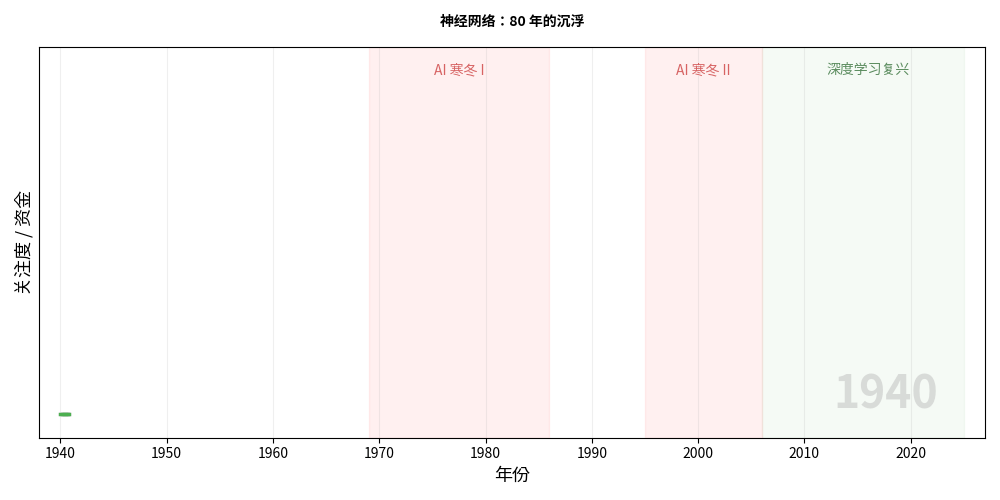
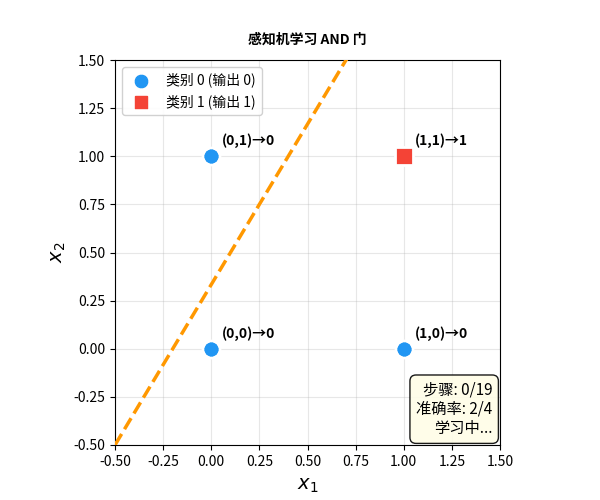
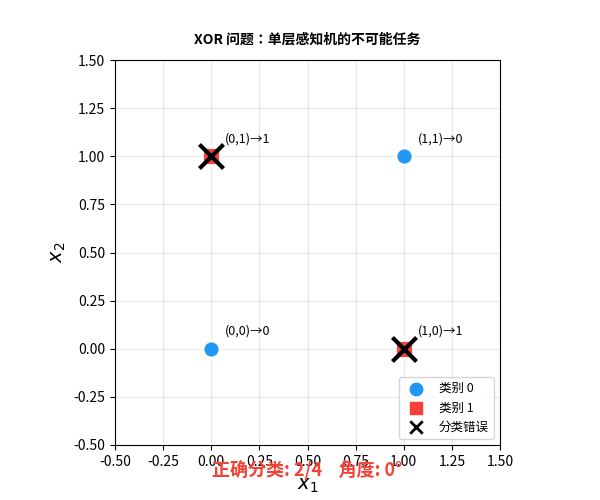
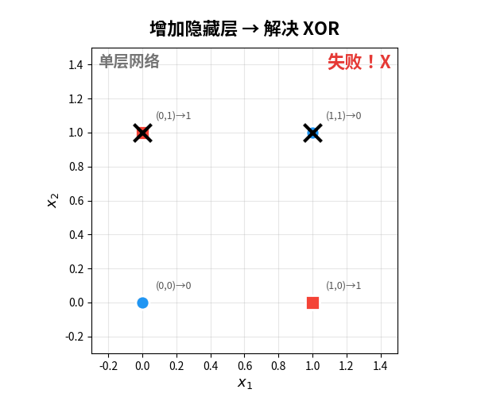
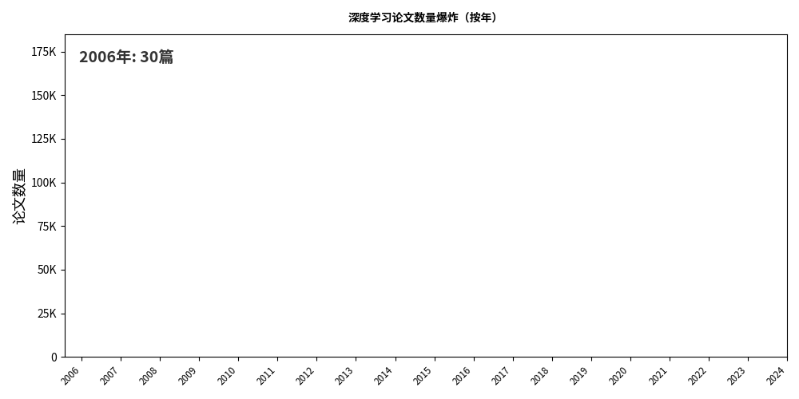

📖 导读

上一篇《函数的竞赛》，我们看到了神经网络在数学层面为什么能胜出——它是唯一同时满足可扩展、可学习、高维友好、能表示学习、能生成的函数拟合方法。

但数学上的优越性，并不意味着一帆风顺。

神经网络的真实历史是一部**跌宕起伏的连续剧**：被捧上神坛、被打入冷宫、在质疑中蛰伏、在绝境中重生。最不可思议的是——它的复兴居然需要**改名字**来甩掉旧名声的包袱。

这个故事告诉我们：**好技术不一定能成功。技术的命运，取决于人心。**

① 神经元的诞生 → ② XOR 死亡判决 → ③ 地下的火种 → ④ 改名记 → ⑤ 三大条件齐备 → ⑥ 无处不在 → ⑦ 结语

---

▲ 神经网络 80 年的关注度曲线——两次崛起，两次坠落，一次改名

---

## 第一章：神经元的诞生（1943–1958）🌟

### 一个大胆的类比

1943 年，神经科学家 Warren McCulloch 和数学家 Walter Pitts 发表了一篇论文，提出了一个简单到近乎天真的想法：

> **大脑中的神经元，可以用数学来模拟。**
>
> 一个神经元接收多个输入信号 → 加权求和 → 如果总和超过阈值就"激活"（输出 1），否则不激活（输出 0）。

这就是 **M-P 神经元**（McCulloch-Pitts Neuron）——人工神经网络的第一颗种子。

用今天的语言来写，M-P 神经元的公式就是：

**y = step(w₁x₁ + w₂x₂ + ... + b)**

输入 × 权重 → 求和 → 超过阈值就激活

但 M-P 神经元有一个致命限制：**权重是手动设定的，不会自己学习。**

### 感知机：会学习的神经元

1958 年，心理学家 Frank Rosenblatt 迈出了关键一步——他发明了**感知机（Perceptron）**。

感知机和 M-P 神经元的结构几乎一样，但有一个革命性的区别：**权重可以通过数据自动调整。**

**感知机学习规则：**

- 看一个样本，做出预测
- 如果预测**对了**：什么都不做
- 如果预测**错了**：调整权重，让下次更准
- 重复，直到所有样本都对

这是人类历史上第一个**能从数据中自动学习**的计算模型。

▲ 感知机学习 AND 门：决策边界从随机位置逐步调整，最终正确分离数据

### 媒体的狂欢

Rosenblatt 在海军研究所用硬件实现了感知机——一台叫 Mark I Perceptron 的机器，能学会识别简单的图案。

然后，媒体疯了。

> **《纽约时报》1958 年头条：**
>
> *"海军展示了电子计算机的胚胎——它被设计为能够行走、说话、看见、写字、自我复制，并意识到自身的存在。"*

能行走、说话、自我复制？一个只会做线性分类的简单机器？

**过度炒作，埋下了灾难的种子。**

---

## 第二章：死亡判决——XOR 问题（1969）❄️

### Minsky 的致命一击

1969 年，MIT 的人工智能大师 Marvin Minsky 和 Seymour Papert 出版了一本书：**《Perceptrons》**。

这本书用严格的数学证明了一个简单却致命的事实：

❌ 感知机的致命缺陷

单层感知机**无法学习 XOR（异或）函数**。

而 XOR 是计算机科学中最基本的逻辑运算之一。

XOR 是什么？非常简单：

| 输入 A | 输入 B | XOR 输出 |
|:------:|:------:|:--------:|
| 0 | 0 | 0 |
| 0 | 1 | **1** |
| 1 | 0 | **1** |
| 1 | 1 | 0 |

用大白话说：**"两个输入不一样时输出 1，一样时输出 0"**。

问题出在哪？感知机做决策的方式是**画一条直线**把两类数据分开。但 XOR 的四个点——无论你怎么画线，都不可能把对角线上的点分开：

▲ XOR 问题：无论决策边界怎么旋转，总有至少一个点被分错

### 一本书杀死了一个领域

从纯技术角度看，Minsky 说的完全正确。单层感知机确实无法解决非线性问题。

但问题在于**影响的传播方式**。

Minsky 是当时 AI 领域的绝对权威。他的书传递的信息被简化为：

> **"神经网络连 XOR 都解决不了，还搞什么？"**

结果是灾难性的：

- **研究经费断崖式下降**——资助机构不愿意投钱给"被证明不行"的方向
- **学术论文无处发表**——期刊编辑拒绝神经网络相关论文
- **研究人员纷纷转行**——做神经网络等于学术自杀
- **博士生被劝退**——"别做这个方向，毕不了业的"

这就是著名的**第一次 AI 寒冬**。

🤔 **讽刺的是**：多层感知机（MLP）可以轻松解决 XOR 问题——只需要加一个隐藏层。Minsky 自己也知道这一点。但他的书着重强调了单层的局限性，而对多层的可能性只是轻描淡写地提了一句。

---

## 第三章：地下的火种（1969–1986）🔥

### 被遗忘不等于不存在

在主流学术界抛弃神经网络的 17 年里，有少数研究者没有放弃。他们像地下的火种，在黑暗中缓慢燃烧。

他们面对的核心问题是：

> **加一个隐藏层就能解决 XOR——但怎么训练多层网络？**
>
> 感知机的学习规则只能调最后一层的权重。中间层的权重怎么调？

这个问题的答案，叫**反向传播（Backpropagation）**。

反向传播的核心思想出奇地简单：

**反向传播三步走：**

1. **前向传播**：把数据从输入层传到输出层，得到预测结果
2. **计算误差**：预测和真实答案的差距
3. **反向传播**：用链式法则，把误差从输出层**倒着传**回每一层，告诉每个权重"你该变多少"

本质上，反向传播就是微积分的**链式法则**在多层网络上的应用。它让误差信号能够"穿透"所有层，指导每个权重的更新方向。

反向传播的想法其实早在 1970 年代就有人提出，但真正引起轰动的是 1986 年 David Rumelhart、Geoffrey Hinton 和 Ronald Williams 在 *Nature* 上发表的论文。

### XOR 被解决了

有了反向传播，多层网络终于可以训练了。XOR 问题？加一个隐藏层就搞定：

▲ 单层 → 失败 ❌；增加隐藏层 → 两条线联合决策 → XOR 解决 ✅

单层感知机只能画一条线。加了隐藏层后，网络可以画**两条线**，用它们的组合区域来做分类。这就是"深度"的力量——**每加一层，就增加一种"折叠"空间的能力。**

---

## 第四章：第二次寒冬和改名记（1995–2012）🎭

### 短暂的春天，又一次冰封

反向传播让神经网络迎来了第二次春天。但好景不长。

到了 1990 年代中期，神经网络再次遇到了瓶颈：

- **层数加深，训练就崩**——梯度消失问题让超过 2-3 层的网络几乎无法训练
- **计算力不够**——当时的计算机跑不动大规模网络
- **数据量不够**——互联网还没有爆发，大规模数据集不存在
- **SVM 崛起**——支持向量机有严格的数学保证，效果也不差

更要命的是**名声问题**。经历了感知机的过度炒作和崩盘，"神经网络"这三个字在学术界已经变成了一个**负面标签**：

> "你还在做*神经网络*？"——同事投来异样的目光。
>
> "你的论文用了*神经网络*？"——审稿人直接拒稿。
>
> "你要申请*神经网络*项目经费？"——基金会连材料都不看。

Hinton 后来回忆说：**"在那个年代，如果你在论文里提到'神经网络'，论文就会被自动拒稿。"**

### 深度学习：一次精心策划的"改名"

2006 年，Geoffrey Hinton 做了一件看似不起眼但意义深远的事情：他给神经网络**换了个名字**。

🎯 关键转折

Hinton 不再叫它"Neural Networks（神经网络）"，而是叫它——

Deep Learning（深度学习）

为什么改名？Hinton 说得很坦率：

> *"我们需要一个新名字。'神经网络'这个词已经被污名化了。人们一听到这个名字，就会本能地拒绝。我们必须换一个名字，让他们愿意重新审视这个技术。"*

这是一个关于**人性**的深刻洞察：

- **同样的技术**，换个名字，人们就愿意重新看一眼
- **同样的论文**，题目里用"Deep Learning"代替"Neural Network"，就不会被秒拒
- **同样的项目**，换个名称申请经费，成功率截然不同

科学是客观的。但做科学的**人**不是。

"深度学习"这个名字选得也精妙——它暗示了"深层"和"学习"两个正面概念，同时完全不提"神经"二字，避免了所有历史包袱。

💡 **思考题**：今天我们说的"深度学习"、"神经网络"、"AI"，其实指的是同一族技术。但如果 Hinton 当年没有改名，而是继续叫"神经网络"，它的命运会不会完全不同？

---

## 第五章：三大条件终于齐备（2012–2017）🚀

### AlexNet：引爆点

2012 年，Hinton 的学生 Alex Krizhevsky 带着一个叫 **AlexNet** 的深度卷积神经网络参加了 ImageNet 图像识别大赛。

结果？

> **AlexNet 的错误率：15.3%**
>
> 第二名（传统方法）的错误率：26.2%
>
> 差距：**超过 10 个百分点**——这在学术界是碾压级的。

为什么偏偏是 2012 年？因为三个条件在这一年首次同时满足：

| 条件 | 1990s | 2012 |
|:----:|:------|:-----|
| **算法** | 反向传播有了，但梯度消失 | ReLU + Dropout + BatchNorm ✅ |
| **算力** | CPU 跑不动大网络 | GPU（NVIDIA CUDA）✅ |
| **数据** | 数据集小且稀缺 | ImageNet 120 万张标注图片 ✅ |

这就像火箭发射需要燃料、引擎和发射台——三者缺一不可。**神经网络不是突然变强了，而是等了 50 年，终于等到了它需要的一切。**

### Transformer：最后一块拼图

2017 年，Google 团队发表了论文 *Attention Is All You Need*，提出了 **Transformer** 架构。

Transformer 做了一个简单但深远的改变：

> **不再按顺序处理数据，而是让每个位置都能直接"看到"其他所有位置。**
>
> 这就是自注意力机制（Self-Attention）——让一句话中的每个词都能直接关注到其他所有词。

Transformer 带来了两个关键优势：

- **并行化**：不用等上一个词算完才能算下一个词，GPU 可以同时计算所有位置
- **长距离依赖**：第 1 个词可以直接关注第 1000 个词，不用像 RNN 那样"传话"

Transformer 解锁了**大规模语言模型**的可能性。GPT、BERT、ChatGPT——全部基于 Transformer。

---

## 第六章：从被遗忘到无处不在（2022–今天）🌍

### ChatGPT：全民知道了"神经网络"

2022 年 11 月 30 日，OpenAI 发布了 ChatGPT。两个月内用户突破一亿。

突然之间，每个人都在谈论"AI"、"大模型"、"神经网络"。

而这个技术的底座——就是当年被一本书判了死刑的那个东西。

▲ 深度学习论文数量的指数级爆炸——从 2006 年的 50 篇到 2024 年的 17 万篇

### 历史的讽刺

让我们把时间线拉回来，感受一下这段历史有多荒诞：

| 年份 | 发生了什么 | 社会评价 |
|:----:|:----------|:--------|
| 1958 | 感知机问世 | "将会改变世界！" |
| 1969 | 《Perceptrons》出版 | "垃圾，别浪费时间了" |
| 1986 | 反向传播论文 | "嗯，也许可以再看看" |
| 1995 | SVM 表现更好 | "又不行了，SVM 才是正道" |
| 2006 | Hinton 改名"深度学习" | "深度学习？新东西？看看" |
| 2012 | AlexNet 碾压传统方法 | "天哪，这东西真的行！" |
| 2022 | ChatGPT 发布 | **"改变世界！（这次是真的）"** |

**同一个技术，同一个数学原理，人类的评价翻了四次。**

---

## 结语：技术的命运，终究是人的命运

神经网络的 80 年历史，本质上是一个关于**人性**的故事。

- **过度炒作**（1958）导致了不切实际的期望
- **权威效应**（1969）让一本书杀死了一个领域
- **从众心理**（1970-1986）让所有人都远离"不受欢迎"的方向
- **标签效应**（2006）让改名字就能重获新生
- **羊群效应**（2012-今天）让所有人都涌向"热门"方向

技术本身从来没有变。**变的是人们看待它的方式。**

🎯 核心洞察

神经网络的故事给我们三个教训：

1. **好技术不一定能活下来**——资源、声誉和时机同样重要
2. **权威的判断可以是错的**——Minsky 的数学没错，但他的结论导致了 20 年的停滞
3. **科技也要懂人心**——Hinton 的"改名"策略，和技术本身的突破同样关键

下次有人问你"什么是深度学习"，你可以说：

> **它就是神经网络。一个被判过死刑、被冷落了 20 年、靠改名字复活的 80 岁老兵——如今统治着整个 AI 世界。**

---

**📚 延伸阅读**

- 上一篇：**函数的竞赛**——为什么数学世界偏偏选了神经网络来做 AI
- Minsky & Papert, *Perceptrons* (1969)——那本"杀死"神经网络的书
- Rumelhart, Hinton & Williams, *Learning representations by back-propagating errors* (1986)——反向传播的里程碑论文
- Krizhevsky et al., *ImageNet Classification with Deep Convolutional Neural Networks* (2012)——AlexNet，引爆深度学习革命
- Vaswani et al., *Attention Is All You Need* (2017)——Transformer，奠定大模型基石

**🎬 人物致敬**

2018 年图灵奖授予 Geoffrey Hinton、Yann LeCun 和 Yoshua Bengio——三位在"AI 寒冬"中坚守神经网络的研究者。他们用几十年的坚持，证明了一个被世界抛弃的技术可以改变世界。

