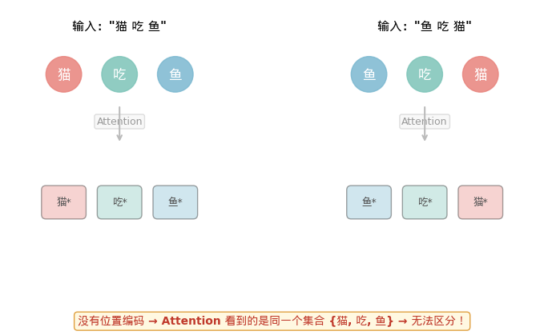
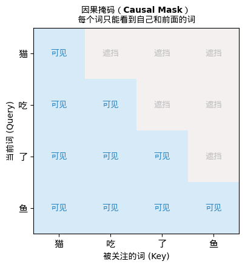
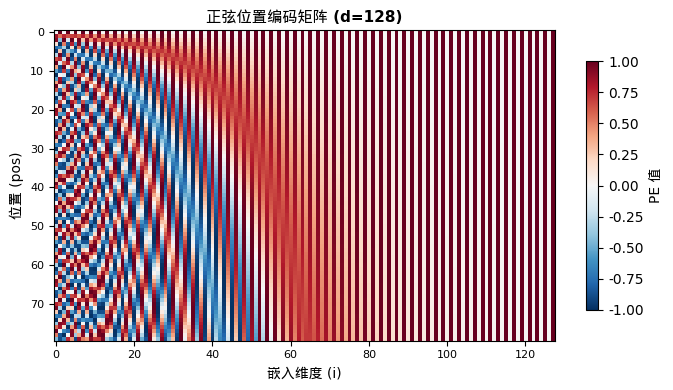
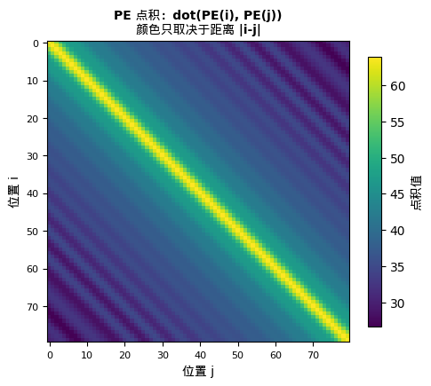
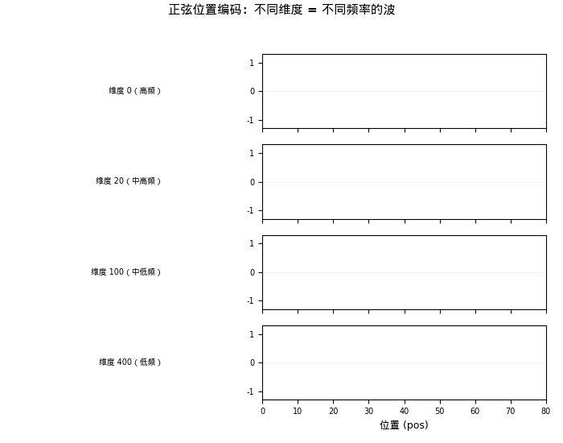
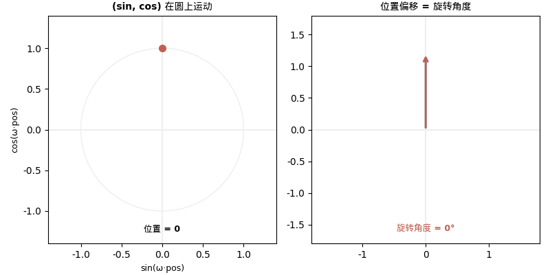
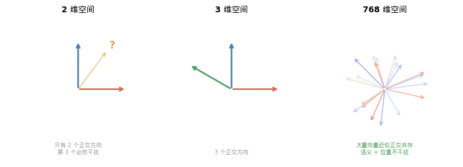
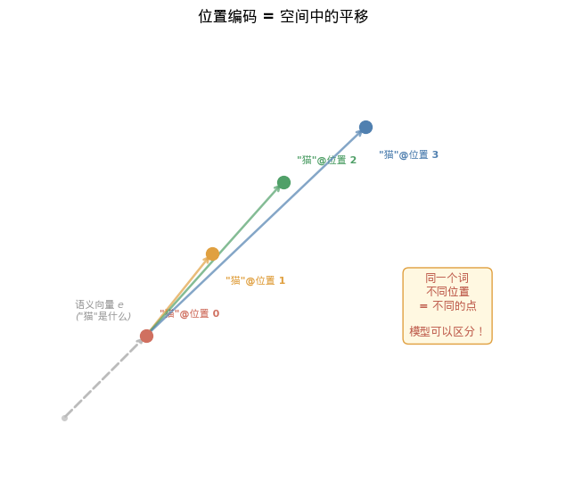
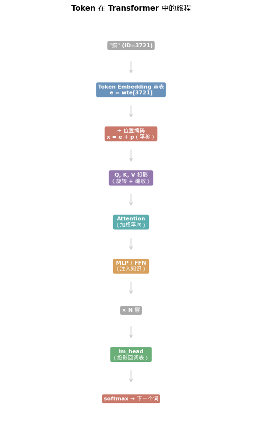
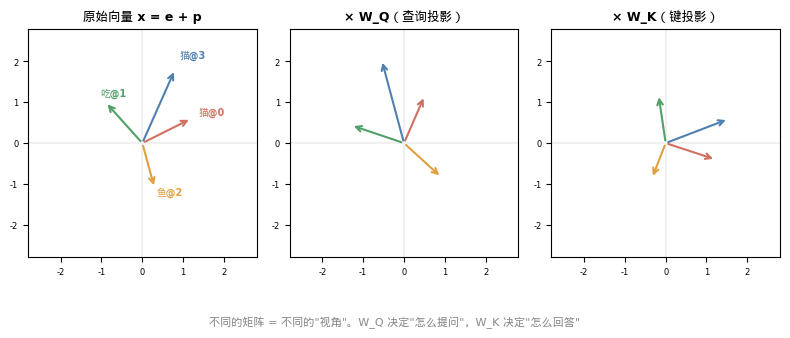

## 从上一篇的一行代码说起

上一篇 [《当数字学会了远近亲疏》](/ai-blog/posts/embedding/) 里，我们拆开了 Embedding 矩阵，看到了这行代码：

```python
# microgpt（Karpathy 的 200 行纯 Python GPT 实现）
tok_emb = state_dict['wte'][token_id]   # 查 Token Embedding 表
pos_emb = state_dict['wpe'][pos_id]     # 查 Position Embedding 表
x = [t + p for t, p in zip(tok_emb, pos_emb)]  # 逐元素相加
```

在 nanoGPT（Karpathy 的 PyTorch GPT 训练项目）中：

```python
tok_emb = self.transformer.wte(idx)   # (batch, seq_len, 768)
pos_emb = self.transformer.wpe(pos)   # (seq_len, 768)
x = self.transformer.drop(tok_emb + pos_emb)   # 直接加！
```

> 💡 **关于代码示例：** 本文引用的 microgpt 和 nanoGPT 是 Karpathy 开源的教学项目——前者 200 行零依赖，后者用 PyTorch。它们是理解 GPT 内部机制的最佳起点。如果你对代码不熟悉，可以先跳过代码块，专注于文字和图解——后续我会出视频逐行拆解这些代码。

当时我说了一句话：

> Token Embedding 告诉模型"这个词是什么"，Position Embedding 告诉模型"这个词在哪里"。

但我没有展开三个问题：

1. **为什么需要位置信息？** 没有它会怎样？
2. **位置信息为什么可以直接"加"上去？** 加上去不会破坏语义吗？
3. **位置到底该怎么编码？** 从 2017 年到今天，方案变了好几轮。

这三个问题，就是今天这篇文章的全部。

---

## 一、"猫吃鱼"和"鱼吃猫"——Transformer 的致命缺陷

### Attention 是一个"集合"操作，不是"序列"操作

让我们回到 Attention 的计算公式：

```text
Attention(Q, K, V) = softmax(Q·K^T / √d) · V
```

这个公式做的是什么？对于每个词，计算它和所有其他词的**相关度**（通过点积 Q·K^T），然后用这些相关度做加权平均。

**注意一个关键事实：点积是对称的。** 它只关心两个向量"是什么"，不关心它们"在哪里"。

如果你把输入 tokens 的顺序打乱，每个 token 和其他 token 的点积**完全不变**——输出只是跟着重新排列，内容一样。

> "If we permute the input sequence, the output sequence will be exactly the same, except permuted also."
>
> — Peter Bloem, *Transformers from Scratch*

**用一句话说：Transformer 天生是"置换不变"（permutation invariant）的。**

这意味着什么？

```text
输入 1: "猫 吃 鱼"
输入 2: "鱼 吃 猫"

没有位置编码 → Transformer 看到的是同一个词袋 {"猫", "吃", "鱼"}
              → 两个输入产生完全相同的输出
              → 谁吃谁？不知道。
```

**"猫吃鱼"和"鱼吃猫"，变成了同一件事。**

这不是一个小问题。这意味着没有位置信息的 Transformer，退化成了一个**词袋模型**——只知道句子里有哪些词，不知道词的顺序。而在自然语言中，词序承载了几乎所有的语法和大部分的语义。

<div style="text-align: center;">



</div>

<div style="text-align: center; font-size: 0.85em; color: #888; margin-top: -10px; margin-bottom: 20px;">▲ 没有位置编码时，Attention 只看向量内容，不看排列顺序——"猫吃鱼"和"鱼吃猫"无法区分</div>

### 语序对人类意味着什么？

在继续看技术方案之前，值得停下来想一想：**语言中的"位置"到底编码了什么信息？**

```text
"我 打了 他"     →  我是施暴者
"他 打了 我"     →  他是施暴者
同样的三个词，顺序一变，施受关系完全反转。

"不是 我 不想去"    →  否定的是意愿
"我 不是 不想去"    →  双重否定 ≈ 想去
否定词的位置决定了否定的范围。

"大漠 孤烟 直"    →  五言古诗的节奏
"孤烟 直 大漠"    →  不成句
词序即韵律，打乱则失去诗意。
```

更有意思的是，不同语言的词序差异非常大：

| 语言 | 基本语序 | "猫吃鱼" |
|------|---------|----------|
| 中文/英文 | SVO（主-谓-宾） | 猫 吃 鱼 / Cat eats fish |
| 日文/韩文 | SOV（主-宾-谓） | 猫が魚を食べる (猫-鱼-吃) |
| 阿拉伯语 | VSO（谓-主-宾） | يأكل القط السمكة (吃-猫-鱼) |

**全世界 ~6000 种语言，用了至少 6 种不同的基本语序。** 但无论哪种语序，顺序本身都携带了不可或缺的语法信息。

Transformer 要处理所有这些语言——它必须能感知位置。

### RNN 从来不需要担心这个问题

有意思的是，在 Transformer 之前的主流架构——RNN 和 LSTM——**天然就知道顺序**。

因为 RNN 的计算方式是：

```text
h₁ = f(h₀, x₁)     ← 必须先算 h₀ 才能算 h₁
h₂ = f(h₁, x₂)     ← 必须先算 h₁ 才能算 h₂
h₃ = f(h₂, x₃)     ← 必须先算 h₂ 才能算 h₃
```

**处理顺序本身就编码了位置。** 第 5 个词之所以"知道"自己是第 5 个，是因为它在第 4 个词之后被处理。隐状态 h₅ 包含了"我已经看过了前面 4 个词"这个信息。

但这也是 RNN 的致命弱点——**必须顺序处理，无法并行。** 一个 1000 词的句子，需要串行计算 1000 步。

Transformer 的革命性贡献正是**并行化**：所有词同时处理。但代价是——丢失了位置信息。

```text
RNN:         顺序处理 → 天然有位置 → 但无法并行
Transformer: 并行处理 → 丢失位置 → 需要人工注入
```

> 这是 Vaswani 等人在 2017 年原论文中的原话：
>
> "Since our model contains no recurrence and no convolution, in order for the model to make use of the order of the sequence, we must inject some information about the relative or absolute position of the tokens in the sequence."
>
> （由于我们的模型不包含循环也不包含卷积，为了让模型利用序列的顺序信息，我们必须注入关于 token 在序列中位置的信息。）
>
> Vaswani, A. et al. (2017). *Attention Is All You Need*. NeurIPS.

<div style="background: rgba(76,175,80,0.08); border-left: 4px solid #4CAF50; padding: 12px 16px; margin: 20px 0; border-radius: 0 6px 6px 0;">

**一句话记住：** Transformer 的 Attention 只看"谁和谁相关"，不看"谁在谁前面"。没有位置编码，"猫吃鱼"和"鱼吃猫"是同一件事。**位置编码是给并行化付出的代价。**

</div>

### 位置编码的"搭档"：因果掩码

位置编码告诉模型"你在哪里"。但还有另一个机制在同时工作，告诉模型"你能看到谁"——这就是**因果掩码（causal mask）**。

在 GPT 这类**自回归**语言模型中，第 5 个词在预测时不应该看到第 6、7、8... 个词——因为那些词还没有被生成。所以 Attention 的计算必须被**遮挡**：

```text
Attention 矩阵（4 个词的例子）：

        词1   词2   词3   词4
词1   [ ✓     ✗     ✗     ✗  ]  ← 词1 只能看自己
词2   [ ✓     ✓     ✗     ✗  ]  ← 词2 能看词1和自己
词3   [ ✓     ✓     ✓     ✗  ]  ← 词3 能看前3个
词4   [ ✓     ✓     ✓     ✓  ]  ← 词4 能看所有
```

这是一个**下三角矩阵**。在代码中：

```python
# nanoGPT 中的因果掩码
self.register_buffer("bias",
    torch.tril(torch.ones(block_size, block_size))  # 下三角矩阵
    .view(1, 1, block_size, block_size))

# Attention 计算时
att = (q @ k.transpose(-2, -1)) * (1.0 / math.sqrt(k.size(-1)))
att = att.masked_fill(self.bias[:,:,:T,:T] == 0, float('-inf'))  # 被遮挡的位置设为 -∞
att = F.softmax(att, dim=-1)  # softmax 后 -∞ 变成 0 → 完全不关注
```

**位置编码和因果掩码共同构建了"序列感"：**

| 机制 | 回答的问题 | 隐喻 |
|------|-----------|------|
| 位置编码 | "你在第几个位置？" | 座位号 |
| 因果掩码 | "你能看到哪些位置？" | 单向窗帘——只能往前看 |

没有位置编码 → 模型不知道词的排列。
没有因果掩码 → 模型"偷看"了还没生成的未来词。
**两者缺一不可，一起让 Transformer 从"集合处理器"变成"序列生成器"。**

<div style="text-align: center;">



</div>

<div style="text-align: center; font-size: 0.85em; color: #888; margin-top: -10px; margin-bottom: 20px;">▲ 因果掩码的下三角结构。蓝色"可见"表示可以关注，灰色"遮挡"表示被屏蔽（softmax 后权重为 0）</div>

> 值得注意的是：BERT 这类**双向**模型不使用因果掩码——它允许每个词看到所有其他词。这也是为什么 BERT 适合理解任务（已有完整句子），而 GPT 适合生成任务（逐词预测）。

---

## 二、正弦的密码——Vaswani 的原始方案

### 一个用波来表示位置的天才想法

在讲正弦编码之前，先回答一个更基本的问题：

**为什么不直接用 0、1、2、3... 这些数字来表示位置？**

这是最自然的想法。但它有三个致命问题：

```text
方案 1：直接用位置数字

位置 0 → 0
位置 1 → 1
位置 100 → 100
位置 999 → 999

问题：
1. 数值范围无界 — 位置 999 的数值是位置 1 的 999 倍，
   梯度会爆炸
2. 模型没见过 — 训练时最长 512，推理时遇到 513，
   这个数值在训练分布之外
3. 一个数字承载不了足够的信息 — 768 维的语义向量加上
   1 个位置数字？比例完全失衡
```

```text
方案 2：归一化到 [0, 1]

位置 0 → 0.000
位置 1 → 0.002  （序列长度 512 时）
位置 1 → 0.001  （序列长度 1024 时）

问题：
同一个位置在不同长度的句子中有不同的编码！
位置 1 在短句中是 0.01，在长句中是 0.001。
模型无法学到"第 1 个位置"的统一表示。
```

**两种直觉方案都失败了。** 我们需要一种编码，满足：
- 每个位置有**唯一**的表示
- 数值**有界**（不会爆炸）
- 不同位置之间的关系是**可学习的**
- 维度要和语义向量**匹配**（768 维）

Vaswani 团队在 2017 年提出了一个既简洁又深刻的方案：**用不同频率的正弦波和余弦波来编码每个位置。**

公式如下：

```text
PE(pos, 2i)   = sin(pos / 10000^(2i/d))
PE(pos, 2i+1) = cos(pos / 10000^(2i/d))
```

其中：
- `pos` = 词在句子中的位置（0, 1, 2, ...）
- `i` = 嵌入向量的维度索引（0, 1, 2, ..., d/2-1）
- `d` = 嵌入维度（如 512 或 768）

每两个相邻维度组成一对 (sin, cos)。一个 768 维的位置向量，由 384 对 (sin, cos) 组成。

> 如果你对 sin/cos 的本质还不太熟悉，推荐先看 [看见数学（八）：圆与波——三角函数的真面目](/ai-blog/posts/see-math-8-waves/)。那篇文章讲清了一个核心观点：**三角函数不是关于三角形的，它描述的是圆的运动和波的节奏。**

### 用一个迷你例子"看到"位置编码

公式太抽象？让我们用一个 d=8 的迷你向量，手算前几个位置的编码。

```text
d = 8，所以有 4 对 (sin, cos)
频率分别是：
  ω₀ = 1/10000^(0/8) = 1.000
  ω₁ = 1/10000^(2/8) = 0.100
  ω₂ = 1/10000^(4/8) = 0.010
  ω₃ = 1/10000^(6/8) = 0.001

位置 0 的编码：
  [sin(0×1.0), cos(0×1.0), sin(0×0.1), cos(0×0.1), ...]
= [0.000,      1.000,      0.000,      1.000,      0.000, 1.000, 0.000, 1.000]

位置 1 的编码：
  [sin(1×1.0), cos(1×1.0), sin(1×0.1), cos(1×0.1), ...]
= [0.841,      0.540,      0.100,      0.995,      0.010, 1.000, 0.001, 1.000]

位置 2 的编码：
  [sin(2×1.0), cos(2×1.0), sin(2×0.1), cos(2×0.1), ...]
= [0.909,     -0.416,      0.199,      0.980,      0.020, 1.000, 0.002, 1.000]
```

注意看规律：
- **前两个维度**变化剧烈（0→0.841→0.909）— 高频，区分相邻位置
- **后两个维度**几乎不变（0→0.001→0.002）— 低频，区分远距离位置

如果把所有位置的编码画成**热力图**——横轴是维度，纵轴是位置，颜色表示值的大小——你会看到一个极具辨识度的图案：

<div style="text-align: center;">



</div>

<div style="text-align: center; font-size: 0.85em; color: #888; margin-top: -10px; margin-bottom: 20px;">▲ 位置编码矩阵的热力图。左侧（低维度）条纹密集 = 高频；右侧（高维度）条纹稀疏 = 低频。每一行是一个位置的唯一"指纹"</div>

### 位置之间的"距离感"

正弦编码还有一个优美的性质：**两个位置编码向量的点积，只取决于它们之间的距离。**

```text
dot(PE(3), PE(5)) = dot(PE(10), PE(12)) = dot(PE(100), PE(102))
```

因为距离都是 2，所以点积相同。

<div style="text-align: center;">



</div>

<div style="text-align: center; font-size: 0.85em; color: #888; margin-top: -10px; margin-bottom: 20px;">▲ 位置 vs 位置的点积矩阵。颜色只取决于对角线方向（即距离），与具体位置无关——这就是"相对位置"的体现</div>

这意味着模型可以通过点积来感知"这两个词离多远"，而不需要知道它们的绝对位置。**正弦编码从一开始就内置了相对位置的信息。**

### 类比：二进制计数器

这个公式看起来很抽象。但如果你用一个类比来理解，就立刻清晰了。

想想**二进制计数器**：

```text
位置 0:  0 0 0 0 0 0 0 0
位置 1:  0 0 0 0 0 0 0 1  ← 最低位：每一步翻转
位置 2:  0 0 0 0 0 0 1 0  ← 次低位：每 2 步翻转
位置 3:  0 0 0 0 0 0 1 1
位置 4:  0 0 0 0 0 1 0 0  ← 第 3 位：每 4 步翻转
位置 5:  0 0 0 0 0 1 0 1
位置 6:  0 0 0 0 0 1 1 0
位置 7:  0 0 0 0 0 1 1 1
位置 8:  0 0 0 0 1 0 0 0  ← 第 4 位：每 8 步翻转
```

每一位都在以**不同的频率**翻转。低位翻转快，高位翻转慢。组合起来，每个数都有**唯一的**二进制表示。

**正弦位置编码就是这种计数器的连续、平滑版本：**

- 低维度（小 i）→ 高频正弦波 → 快速振荡 → 类似二进制的低位
- 高维度（大 i）→ 低频正弦波 → 缓慢变化 → 类似二进制的高位

<div style="text-align: center;">



</div>

<div style="text-align: center; font-size: 0.85em; color: #888; margin-top: -10px; margin-bottom: 20px;">▲ 每个维度是一个不同频率的波。低维度波动快（区分相邻位置），高维度波动慢（区分远距离位置）</div>

### 为什么用 sin 和 cos 配对？——因为旋转

**这是正弦编码最深刻的数学性质。**

原论文在第 3.5 节给出了选择正弦函数的核心理由：

> "We hypothesized it would allow the model to easily learn to attend by relative positions, since for any fixed offset k, PE(pos+k) can be represented as a **linear function** of PE(pos)."

翻译过来：**位置 pos+k 的编码，可以写成位置 pos 编码的线性变换。**

为什么？利用三角恒等式：

```text
sin(ω(pos+k)) = sin(ωpos)·cos(ωk) + cos(ωpos)·sin(ωk)
cos(ω(pos+k)) = cos(ωpos)·cos(ωk) - sin(ωpos)·sin(ωk)
```

写成矩阵形式：

```text
[sin(ω(pos+k))]   [cos(ωk)   sin(ωk)] [sin(ωpos)]
[cos(ω(pos+k))] = [-sin(ωk)  cos(ωk)] [cos(ωpos)]
```

**右边的 2×2 矩阵是什么？一个旋转矩阵！** 旋转角度是 ωk。

**而这个旋转矩阵只取决于偏移量 k，不取决于绝对位置 pos。**

这意味着：
- 从位置 3 到位置 7（偏移 k=4）的变换
- 和从位置 100 到位置 104（偏移 k=4）的变换
- **是同一个旋转矩阵！**

模型只需要学会一个"往后偏移 4 步"的线性变换，就能在任何位置使用它。**相对位置关系被编码为旋转——这就是为什么必须用 sin 和 cos 配对。**

> 只有同时使用 sin 和 cos，才能用线性变换表达 sin(x+k) 和 cos(x+k)。这不是审美选择，这是**数学必然**。
>
> Kazemnejad, A. *Transformer Architecture: The Positional Encoding*.

<div style="text-align: center;">



</div>

<div style="text-align: center; font-size: 0.85em; color: #888; margin-top: -10px; margin-bottom: 20px;">▲ 左：每对 (sin, cos) 构成圆上的一个点，位置递增 = 沿圆运动。右：从 pos=0 到 pos=n 的偏移就是一个固定角度的旋转</div>

### 10000 这个底数是什么意思？

公式中有一个看似随意的数字：10000。它是什么？

```text
频率 ω_i = 1 / 10000^(2i/d)
波长 λ_i = 2π × 10000^(2i/d)
```

- **最低维度（i=0）**：波长 = 2π ≈ 6.28 → 每 ~6 个位置一个完整周期
- **最高维度（i=d/2-1）**：波长 = 2π × 10000 ≈ 62832 → 可以区分约 10000 个位置

**10000 决定了模型能"看到"的最远距离。** 波长从 2π 到 10000·2π，构成一个**几何级数**。

底数太小（如 100）→ 高频波段太拥挤，位置分辨率不够。
底数太大（如 10^6）→ 低频波段过于稀疏，近距离分辨力浪费。
10000 是实验中找到的平衡点。

> 现代模型（如 LLaMA）在需要扩展上下文长度时，会调大这个底数。例如 NTK-aware scaling 把底数增大到 500000 来支持 100K+ token 的长上下文。

<div style="background: rgba(76,175,80,0.08); border-left: 4px solid #4CAF50; padding: 12px 16px; margin: 20px 0; border-radius: 0 6px 6px 0;">

**一句话记住：** 正弦位置编码 = 多频率的波。低维度的波区分近距离位置，高维度的波区分远距离位置。sin 和 cos 配对形成旋转，使得**相对位置变成了旋转角度**——不依赖于绝对位置。

</div>

---

## 三、最深的问题：为什么可以"加"？

### 这一步看起来太暴力了

让我们再看一次这行代码：

```python
x = tok_emb + pos_emb
```

Token embedding 是"猫"的语义向量——768 个数字，编码了"猫是动物、是宠物、有四条腿"等信息。

Position embedding 是"第 3 个位置"的向量——768 个数字，编码了"这是序列中的第 3 个元素"。

**直接逐元素相加。**

直觉上这很不安——你把一个关于"意思"的向量和一个关于"位置"的向量混在一起了。加完之后，原来的语义信息还在吗？位置信息能被正确提取吗？

**这是位置编码中最反直觉的一步。** 连广泛引用的 Kazemnejad 教程也坦承：

> "I couldn't find any theoretical reason for this question."
> （我找不到这个问题的理论性答案。）

但我们可以从多个角度理解为什么它能工作。

### 第一个原因：768 维空间大得超乎想象

在你的日常直觉中，加法意味着混合、覆盖。把红色颜料和蓝色颜料加在一起，你得到紫色——两种原色都无法恢复。

但这是在 2 维或 3 维空间里的直觉。

在 768 维空间中，情况完全不同。

**核心数学事实：在 d 维空间中，两个随机向量几乎一定是近似正交的。**

```text
两个随机 768 维单位向量的内积：
  期望值 E[⟨u, v⟩] = 0
  标准差 σ = 1/√768 ≈ 0.036

也就是说，典型的内积绝对值 < 0.04
→ 两个随机向量几乎垂直
```

这意味着什么？token embedding 和 position embedding 是**分别学习的**两组向量。在 768 维空间中，它们**自然倾向于占据不同的方向**。

**加在一起后，一个分量对另一个分量的"干扰"非常小——因为它们几乎正交。**

> 这和你在 [《高维空间——直觉失效的地方》](/ai-blog/posts/see-math-14-high-dimensions/) 中读到的现象一脉相承：高维空间有一种我们在三维世界中完全没有的"容量"——它可以同时容纳大量近似正交的方向。
>
> 2022 年，Anthropic 团队在 *Toy Models of Superposition* 中系统地研究了这个现象：神经网络可以在 d 维空间中**同时表示远超 d 个特征**——它们以近似正交的方式"叠加"在同一空间中。
>
> Elhage, N. et al. (2022). *Toy Models of Superposition*. Anthropic.

<div style="text-align: center;">



</div>

<div style="text-align: center; font-size: 0.85em; color: #888; margin-top: -10px; margin-bottom: 20px;">▲ 维度越高，可以容纳的近似正交向量越多。768 维中，语义和位置信息可以互不干扰地叠加</div>

### 第二个原因：Attention 能自动分离内容和位置

加法不是终点。加完之后，向量 x = e + p 要经过 Attention 层的 W_Q 和 W_K 投影。

让我们展开 Attention score 的计算：

```text
score(i,j) = (x_i · W_Q) · (x_j · W_K)^T

x_i = e_i + p_i  （第 i 个词的语义 + 位置）
x_j = e_j + p_j  （第 j 个词的语义 + 位置）
```

把 x = e + p 代入，展开得到**四项**：

```text
score(i,j) = (e_i·W_Q)(e_j·W_K)^T    ← ① 内容-内容
           + (e_i·W_Q)(p_j·W_K)^T    ← ② 内容-位置
           + (p_i·W_Q)(e_j·W_K)^T    ← ③ 位置-内容
           + (p_i·W_Q)(p_j·W_K)^T    ← ④ 位置-位置
```

**四项的含义——每一项都有用：**

| 项 | 含义 | 例子 |
|----|------|------|
| ① 内容-内容 | 两个词的语义相关度 | "猫"和"吃"是否常共现？ |
| ② 内容-位置 | 某个词偏好某个位置 | "The"偏好出现在句首 |
| ③ 位置-内容 | 某个位置偏好某类词 | 句首位置偏好冠词 |
| ④ 位置-位置 | 两个位置的固有关系 | 相邻位置应该互相关注 |

**关键洞察：W_Q 和 W_K 是可学习的线性变换。** 模型通过训练这些权重矩阵，可以学会**从混合信号中分别提取内容和位置信息**，并利用所有四种交互模式。

**加法并没有永久性地混合信息——线性层可以把它们重新分开。**

> 这正是 Ke et al. (2020) 在 TUPE 论文中验证的：如果用不同的 W_Q、W_K 分别处理内容和位置（即显式解耦），效果确实更好。这从侧面证明了**四项分解确实是模型在做的事情**。
>
> Ke, G. et al. (2020). *Rethinking Positional Encoding in Language Pre-training*. ICLR 2021.

### 第三个原因：参数效率

如果不用加法，还有什么选择？**拼接（concatenation）。**

```python
# 加法：维度不变
x = tok_emb + pos_emb         # (seq_len, 768)

# 拼接：维度翻倍！
x = torch.cat([tok_emb, pos_emb], dim=-1)  # (seq_len, 1536)
```

拼接后，所有后续层的输入维度翻倍 → W_Q、W_K、W_V 的参数量翻倍 → FFN 的参数量翻倍 → 整个模型大小约翻倍。

而加法的参数增量是**零**。

**在数学上，加法和拼接的信息表达能力是等价的**（因为线性层可以从叠加信号中分离分量），但加法远比拼接高效。

### 几何直觉：位置编码 = 空间平移

最后，用一个几何画面来理解：

在 768 维嵌入空间中，每个词有一个"语义坐标"（token embedding 的位置）。加上 position embedding，就是把这个点**平移**到空间中的另一个位置。

```text
"猫" 在位置 0:  e_cat + p_0  → 空间中的点 A
"猫" 在位置 5:  e_cat + p_5  → 空间中的点 B

A 和 B 的差 = p_5 - p_0 —— 这个平移向量只取决于位置差，不取决于具体哪个词。
```

**同一个词在不同位置，被平移到嵌入空间的不同区域。** 模型可以通过观察这些平移的模式来理解位置关系。

<div style="text-align: center;">



</div>

<div style="text-align: center; font-size: 0.85em; color: #888; margin-top: -10px; margin-bottom: 20px;">▲ "猫"的语义向量（灰色虚线箭头）加上不同位置的编码（彩色箭头），被平移到空间中不同的点。平移方向只取决于位置</div>

<div style="background: rgba(76,175,80,0.08); border-left: 4px solid #4CAF50; padding: 12px 16px; margin: 20px 0; border-radius: 0 6px 6px 0;">

**一句话记住：** 加法之所以可行，因为 768 维空间大得超乎想象——语义和位置可以近似正交地共存。Attention 的四项分解让模型能自动分离混合信号。**加法不是信息的破坏，而是信息的叠加。**

</div>

---

## 四、两种路线：固定公式 vs 学习出来

### 正弦编码 vs 学习式编码

Vaswani 在 2017 年的原论文中同时测试了两种方案：

| 特性 | 正弦式（Sinusoidal） | 学习式（Learned） |
|------|---------------------|-------------------|
| 参数量 | 0（固定公式） | block_size × d_model |
| 训练 | 无需训练 | 需要从数据中学习 |
| 性能 | 几乎相同 | 几乎相同 |
| 长度外推 | 理论上支持任意长度 | 只支持训练时的最大长度 |
| 实现 | 需要写公式 | 就是一个 nn.Embedding |

原论文的结论：

> "We also experimented with using learned positional embeddings instead, and found that the two versions produced **nearly identical results**."
>
> "We chose the sinusoidal version because it may allow the model to **extrapolate to sequence lengths longer** than the ones encountered during training."

**两种方案效果几乎一样。** Vaswani 选了正弦编码，因为它可能支持长度外推。

### GPT-2 选了另一条路

但 GPT-2（Radford et al., 2019）选择了**学习式位置编码**。

在 nanoGPT 的代码中，位置编码就是一张查找表——和 Token Embedding 结构完全相同：

```python
wte = nn.Embedding(vocab_size, n_embd)    # 词表 × 768 → 语义查表
wpe = nn.Embedding(block_size, n_embd)    # 最大长度 × 768 → 位置查表
```

**两张表，结构相同，含义不同。** 一张查"词是什么"，一张查"词在哪"。

在 microgpt 中也一样：

```python
state_dict = {
    'wte': matrix(vocab_size, n_embd),    # 27 × 16
    'wpe': matrix(block_size, n_embd),    # 16 × 16
    ...
}
```

microgpt 的 Position Embedding 只有 16 × 16 = 256 个参数。训练前是随机的，训练后自动学到了"位置 0 和位置 1 应该不同"这类结构。

**为什么 GPT-2 不用正弦编码？**

- 学习式更灵活，可以适配数据中的特殊位置模式
- GPT-2 的上下文长度固定为 1024，不需要外推
- 实现更简单，就是一行 nn.Embedding

### 学习式的局限

但学习式有一个硬伤：**位置 1025 该怎么办？**

训练时最长见过 1024 个 token，位置编码表只有 1024 行。第 1025 个位置？不存在。

正弦编码没有这个问题——公式可以计算任意位置的编码。

但在实践中，GPT-2 时代的上下文长度足够用了（1024 tokens ≈ 750 个英文单词）。

> nanoGPT 中有一个有趣的设计：计算模型参数量时，**位置嵌入的参数不算在内**：
>
> ```python
> def get_num_params(self, non_embedding=True):
>     n_params = sum(p.numel() for p in self.parameters())
>     if non_embedding:
>         n_params -= self.transformer.wpe.weight.numel()
>     return n_params
> ```
>
> 为什么？因为位置嵌入不参与最终输出的计算（没有 weight tying），它只是"标注"每个位置的辅助信息。

<div style="background: rgba(76,175,80,0.08); border-left: 4px solid #4CAF50; padding: 12px 16px; margin: 20px 0; border-radius: 0 6px 6px 0;">

**一句话记住：** 正弦编码是数学公式——零参数、可外推。学习式编码是查找表——有参数、更灵活。两者效果几乎相同。**GPT-2 选了查表，因为它够简单、够用。**

</div>

---

## 五、从绝对到相对：位置编码的进化

### 绝对位置的根本问题

无论正弦编码还是学习式编码，都属于**绝对位置编码**——给每个位置一个固定的标签：

```text
位置 0 → 向量 p₀
位置 1 → 向量 p₁
位置 47 → 向量 p₄₇
```

但在自然语言中，**相对位置比绝对位置重要得多**。

"小"修饰"猫"，是因为"小"在"猫"前面一个词——不管它们是出现在句子的第 3、4 位还是第 47、48 位。

```text
"那只小猫很可爱"     ← "小"在第3位修饰第4位的"猫"
"我看见了一只小猫"   ← "小"在第6位修饰第7位的"猫"

重要的不是绝对位置 3 或 6，而是相对偏移 -1
```

绝对位置编码的另一个问题：**加在输入层之后，经过多层 Transformer 的处理，位置信息可能被逐渐稀释。**

### Shaw et al. 2018：相对位置的先驱

Shaw 等人在 2018 年提出了一个关键改变：**不在输入层加位置编码，而是在 Attention 计算中直接注入相对位置信息。**

```text
传统 Attention:  score(i,j) = (x_i W_Q)(x_j W_K)^T

Shaw 的方法:     score(i,j) = (x_i W_Q)(x_j W_K + a_{i-j}^K)^T
                                           ^^^^^^^^^
                                    额外的相对位置嵌入
```

**a_{i-j}^K 只取决于两个位置的差 (i-j)，不取决于绝对位置。**

结果：在英德翻译上提升了 1.3 BLEU——证明了相对位置确实比绝对位置更好。

> Shaw, P., Uszkoreit, J. & Vaswani, A. (2018). *Self-Attention with Relative Position Representations*. NAACL.

### RoPE：旋转位置编码——当今的主流

2021 年，苏剑林提出了 **RoPE（Rotary Position Embedding）**——一种用**旋转**来编码位置的方案。它被 LLaMA、LLaMA 2/3、Qwen、Mistral、DeepSeek 等几乎所有现代开源 LLM 采用。

**RoPE 的核心思想**：还记得正弦编码中"每对 (sin, cos) 构成一个旋转"吗？RoPE 把这个思想推到极致——**直接旋转 Query 和 Key 向量**，而不是加在输入层上。

```text
传统加法：        x = tok_emb + pos_emb → 然后算 Q, K
RoPE：           先算 Q, K → 然后根据位置旋转 Q 和 K
```

#### 数学原理

把 Q 和 K 向量的每两个相邻维度看作一个复数：

```text
q = (q₁ + iq₂,  q₃ + iq₄,  ...,  q_{d-1} + iq_d) ∈ ℂ^{d/2}
```

对位置 m 处的向量，乘以一个旋转因子：

```text
f(q, m) = q · e^{imθ}
```

这里 θ 就是频率参数——和正弦编码用的**同一族频率**！

#### 为什么旋转能编码相对位置？

**最优雅的证明：**

```text
⟨f(q, m), f(k, n)⟩ = ⟨q·e^{imθ}, k·e^{inθ}⟩ = q·k · e^{i(m-n)θ}
```

**指数中只有 (m-n)！**

两个词的 Attention score 只取决于：
1. 它们的内容（q·k）
2. 它们的**相对位置**（m-n）

**绝对位置自动消失了。**

> "If we shift both the query and key by the same amount, changing absolute position but not relative position, this will lead both representations to be additionally rotated in the same manner — thus the angle between them will remain unchanged."
>
> — EleutherAI, *Rotary Embeddings: A Relative Affair*

#### 实际效果

EleutherAI 在 150M 参数模型上的对比实验：

```text
方法                     验证 Loss
学习式绝对位置编码       2.809
T5 相对位置编码          2.801
RoPE（旋转位置编码）     2.759  ← 最优
```

> Su, J. et al. (2021). *RoFormer: Enhanced Transformer with Rotary Position Embedding*. arXiv:2104.09864.

### ALiBi：最激进的简化

2022 年，Press 等人提出了一个更极端的方案：**完全不用位置嵌入！**

ALiBi（Attention with Linear Biases）直接在 Attention score 上减去一个与距离成正比的惩罚：

```text
score(i,j) = q_i · k_j  -  m · |i - j|
                          ^^^^^^^^^^^^^^^^
                          距离越远，分数越低
```

**没有额外参数，没有额外计算。** 只是一个简单的线性惩罚。

优势：在 1024 tokens 上训练的模型，可以直接外推到 2048 tokens——这是绝对位置编码做不到的。

> Press, O. et al. (2022). *Train Short, Test Long: Attention with Linear Biases Enables Input Length Extrapolation*. ICLR.

### 进化时间线

```text
2017  正弦编码 (Vaswani)       ← 加在输入层，固定公式
2019  学习式编码 (GPT-2)        ← 加在输入层，可学习查表
2018  相对位置编码 (Shaw)       ← 注入 Attention 层
2021  RoPE 旋转编码 (Su)        ← 旋转 Q/K 向量
2022  ALiBi 线性偏置 (Press)    ← 直接惩罚远距离
2023+ RoPE 成为主流             ← LLaMA/Qwen/Mistral/DeepSeek
```

**大趋势：从"加在输入层"→"注入 Attention 层"→"编码在 Q/K 的旋转中"。**

位置信息从一开始就被"糊"在输入上（可能被后续层稀释），进化到精确地编码在 Attention 计算的核心位置——Q 和 K 的交互之中。

<div style="background: rgba(76,175,80,0.08); border-left: 4px solid #4CAF50; padding: 12px 16px; margin: 20px 0; border-radius: 0 6px 6px 0;">

**一句话记住：** 绝对位置告诉模型"你在第 47 位"，相对位置告诉模型"你在那个词前面 3 步"。RoPE 用旋转优雅地实现了这一点——从正弦编码的旋转矩阵性质出发，把旋转直接作用在 Q 和 K 上。**今天所有主流 LLM 都用 RoPE。**

</div>

---

## 六、站远一点看：数据在 Transformer 中如何变形

### 从输入到输出的完整旅程

现在我们可以把 Embedding 和位置编码放在更大的图景中，看看一个 token 从输入到输出经历了什么：

```text
"猫" (token ID = 3721)

第 0 步：Token Embedding 查表
    → e = wte[3721]          # 768 维语义向量："猫"是什么

第 1 步：Position Embedding
    → p = wpe[2]             # 768 维位置向量：第 2 个位置
    → x = e + p              # 叠加：我是第 2 位的"猫"

第 2 步：进入 Transformer 层（重复 N 次）
    → LayerNorm(x)           # 归一化
    → Q, K, V = x·W_Q, x·W_K, x·W_V   # 线性投影
    → Attention(Q, K, V)     # 与其他词交互
    → x = x + Attention输出  # 残差连接
    → LayerNorm(x)           # 归一化
    → FFN(x)                 # 前馈网络：注入知识
    → x = x + FFN输出        # 残差连接

第 3 步：输出投影
    → logits = x · wte^T     # 用 Embedding 矩阵的转置投影回词表
    → probs = softmax(logits) # 选出下一个词
```

**每一步都是一次矩阵运算——向量被一个矩阵"变形"，投影到新的子空间。**

从这个视角看：

- **Token Embedding** 是第一次变形：从离散 ID 变成连续向量
- **Position Embedding 的加法** 是第二次变形：在语义空间中施加位置偏移
- **W_Q, W_K, W_V** 是第三次变形：把向量分别投影到"提问"、"回答"、"内容"三个子空间
- **Attention** 是一次加权平均：根据 Q·K 的相关度，混合不同位置的 V
- **FFN（MLP）** 是最复杂的变形：通过两层非线性变换注入世界知识

**每个矩阵都是一次线性变换——旋转、缩放、投影。** 这和你在 [《AI 的数学语言（四）：矩阵乘法》](/ai-blog/posts/math-for-ai-4-matmul/) 中学到的完全一致：矩阵乘法就是空间变换。

而位置编码的加法，在这个框架中看，就是最简单的一种空间变换——**平移**。

<div style="text-align: center;">



</div>

<div style="text-align: center; font-size: 0.85em; color: #888; margin-top: -10px; margin-bottom: 20px;">▲ 一个 token 从输入到输出的完整旅程。每一步都是向量在不同子空间中的变换</div>

每一步的矩阵运算——投影、旋转、缩放——都在改变向量在空间中的"位置"和"朝向"。下图用二维示意了 W_Q 和 W_K 如何将同一组向量投影到不同的子空间：

<div style="text-align: center;">



</div>

<div style="text-align: center; font-size: 0.85em; color: #888; margin-top: -10px; margin-bottom: 20px;">▲ 同一组向量（左），经过 W_Q（中）和 W_K（右）投影后，在空间中的相对关系发生了变化。不同的矩阵 = 不同的"观察视角"</div>

<div style="background: rgba(76,175,80,0.08); border-left: 4px solid #4CAF50; padding: 12px 16px; margin: 20px 0; border-radius: 0 6px 6px 0;">

**一句话记住：** Transformer 中的每一步都是矩阵运算——向量在不同的子空间中被投影、旋转、缩放。位置编码的加法只是最简单的一种变换：**平移**。它把"这是什么词"变成"这是第几个位置的什么词"。

</div>

---

<div style="border: 2px solid #FF9800; border-radius: 8px; padding: 15px 20px; margin: 20px 0; background: rgba(255,152,0,0.04);">

**本篇小结**

**一、置换不变性** — Transformer 的 Attention 只看向量内容，不看排列顺序。没有位置编码，"猫吃鱼"="鱼吃猫"。位置编码和因果掩码一起，让 Transformer 从"集合处理器"变成"序列生成器"。

**二、正弦编码** — 用不同频率的 sin/cos 波编码位置。低维高频区分近距离，高维低频区分远距离。sin+cos 配对形成旋转矩阵——相对位置变成旋转角度。

**三、为什么可以"加"** — 768 维空间中语义向量和位置向量近似正交，加法不会互相破坏。Attention 的四项分解让模型能自动分离内容和位置信号。加法的参数效率远高于拼接。

**四、固定 vs 学习** — 正弦编码：零参数、可外推。学习式编码：有参数、更灵活。GPT-2 用学习式，效果几乎一样。

**五、从绝对到相对** — 绝对位置不如相对位置重要。RoPE 用旋转编码相对位置，被所有现代 LLM 采用。ALiBi 更激进——直接用线性距离惩罚。

**六、大图景** — 位置编码的加法是 Transformer 数据流中最简单的变换：平移。后续的每一步（投影、Attention、FFN）都是更复杂的矩阵变换。

</div>

## 写在最后

Transformer 的发明者面对一个两难：

**要并行，就丢位置。要位置，就丢并行。**

他们的解决方案优雅得令人叹服：**用波来编码位置，然后加到语义向量上。**

这一步之所以成立，是因为三个层面的深刻原因：

1. **数学层面**：768 维空间有足够的"容量"让两种信息近似正交地共存
2. **机制层面**：Attention 的 W_Q、W_K 投影可以从混合信号中自动分离出内容和位置
3. **信号层面**：sin/cos 配对形成旋转矩阵，使相对位置关系成为与绝对位置无关的几何量

后来的故事——从绝对位置到相对位置，从加法到旋转——是沿着"让位置信息更精确、更高效"这条线不断演化的。

但 2017 年那个最初的直觉——**用不同频率的波来编码位置，然后直接叠加到语义上**——至今仍然是理解位置编码的最佳起点。

下次当你看到 `x = tok_emb + pos_emb` 这行代码时，你会知道：这不是一个粗暴的 hack。这是一次在 768 维空间中的精密操作——两种完全不同类型的信息，在人类无法直观想象的高维世界里，优雅地叠加共存。

---

> **参考文献**
>
> 1. Vaswani, A. et al. (2017). *Attention Is All You Need*. NeurIPS. arXiv:1706.03762. — 正弦位置编码的原始论文。
> 2. Su, J. et al. (2021). *RoFormer: Enhanced Transformer with Rotary Position Embedding*. arXiv:2104.09864. — RoPE 旋转位置编码。
> 3. Press, O. et al. (2022). *Train Short, Test Long: Attention with Linear Biases Enables Input Length Extrapolation*. ICLR. — ALiBi。
> 4. Shaw, P. et al. (2018). *Self-Attention with Relative Position Representations*. NAACL. — 相对位置编码的先驱。
> 5. Ke, G. et al. (2020). *Rethinking Positional Encoding in Language Pre-training*. ICLR 2021. — TUPE，解耦内容与位置。
> 6. Elhage, N. et al. (2022). *Toy Models of Superposition*. Anthropic. — 高维空间中的信息叠加。
> 7. Kazemnejad, A. *Transformer Architecture: The Positional Encoding*. — 最好的位置编码教程之一。
> 8. EleutherAI. *Rotary Embeddings: A Relative Affair*. — RoPE 的详细解释。
> 9. Peter Bloem. *Transformers from Scratch*. — Transformer 的置换不变性解释。
> 10. Karpathy, A. *microgpt*. GitHub Gist. — 200 行纯 Python GPT 实现。
>
> **推荐阅读**
>
> - Kazemnejad 的 [位置编码可视化教程](https://kazemnejad.com/blog/transformer_architecture_positional_encoding/)
> - EleutherAI 的 [RoPE 解析](https://blog.eleuther.ai/rotary-embeddings/)

---

<div style="margin-top: 30px; padding-top: 20px; border-top: 1px solid #e0e0e0; font-size: 14px; color: #999; line-height: 1.8;">

💡 相关文章

- [当数字学会了远近亲疏——从查表到 Embedding 的一步跨越](/ai-blog/posts/embedding/) — 本文的前篇
- [计算机只懂 0 和 1——从莫尔斯电码到 GPT 的编码简史](/ai-blog/posts/ascii-to-token/) — 编码的历史
- [看见数学（八）：圆与波——三角函数的真面目](/ai-blog/posts/see-math-8-waves/) — sin/cos 的本质
- [AI 的数学语言（四）：矩阵乘法——空间变换的语言](/ai-blog/posts/math-for-ai-4-matmul/) — 矩阵乘法就是空间变换
- [看见数学（十四）：高维空间——直觉失效的地方](/ai-blog/posts/see-math-14-high-dimensions/) — 768 维的"容量"

博客：https://Jason-Azure.github.io/ai-blog/

微信公众号：AI-lab学习笔记

</div>
