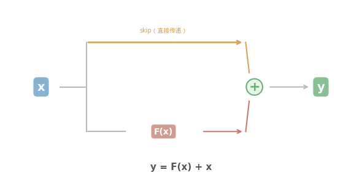
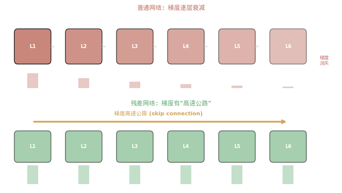
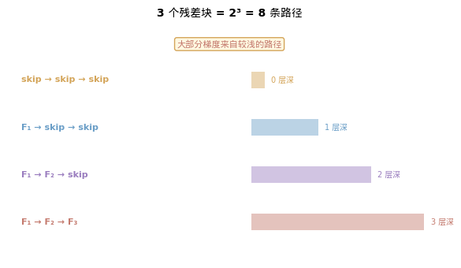
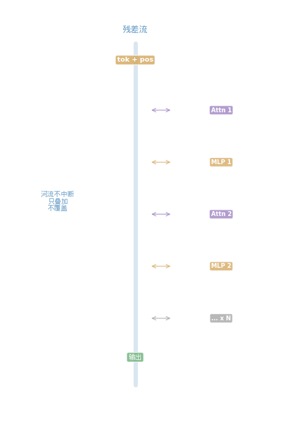
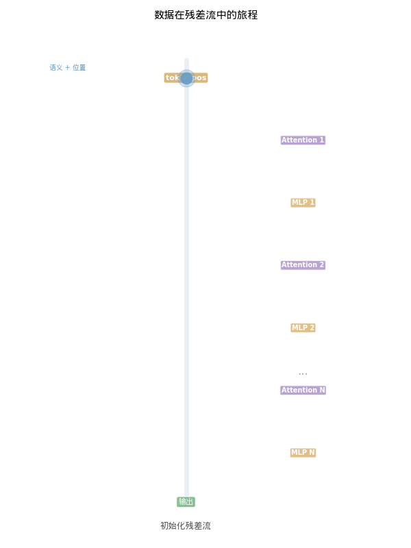

## 从一个反直觉的实验说起

2015 年，微软亚洲研究院的何恺明做了一个简单的实验：把一个图像识别网络从 20 层加深到 56 层。

直觉上，更深的网络应该更好——56 层网络至少不应该比 20 层差，因为它完全可以在前 20 层学完之后，让剩下的 36 层什么都不做（学成恒等映射 f(x) = x）。

但实验结果令人震惊：

```text
CIFAR-10 数据集上的训练误差：

20 层网络: ~5%
56 层网络: ~8%  ← 更深，但更差！
```

**不是过拟合。** 过拟合是训练误差低、测试误差高。但这里**训练误差也更高**——56 层网络连训练数据都拟合不好。

**更深的网络，反而更笨了。**

这个现象被称为**退化问题（degradation problem）**。它说明的不是模型容量的问题，而是**优化的问题**——让 36 层网络学会"什么都不做"，对标准的梯度下降来说，竟然做不到。

> "Deeper neural networks are more difficult to train."
>
> — He, K. et al. (2015). *Deep Residual Learning for Image Recognition*. CVPR 2016 Best Paper.

这个发现把深度学习推到了一个十字路口：**如果更深 ≠ 更好，那深度学习的"深"字还有意义吗？**

然后何恺明做了一件看似微不足道的事——他在网络中加了一个**加号**。

---

## 一、一个加号改变一切：y = F(x) + x

### 传统网络 vs 残差网络

传统的深度网络中，每一层学习一个变换 H(x)：

```text
输入 x → [第 1 层] → H₁(x) → [第 2 层] → H₂(H₁(x)) → ...

每一层的任务：从输入 x 直接学到输出 H(x)
```

何恺明的改变只有一步：**不让网络直接学 H(x)，而是让它学 F(x) = H(x) - x，然后把 x 加回来。**

```text
残差网络：
输入 x ──┬──→ [F(x): 几层网络] ──→ F(x)
          │                           │
          └────── 跳过（shortcut）──→ + ← 加回来！
                                      │
                                    x + F(x) = y

一行代码：y = F(x) + x
```

就这一个改变。**y = F(x) + x。**

<div style="text-align: center;">



</div>

<div style="text-align: center; font-size: 0.85em; color: #888; margin-top: -10px; margin-bottom: 20px;">▲ 输入 x 兵分两路：一路经过网络层 F(x)，一路直接跳过。两路在加号处汇合。即使 F(x) 学不好，x 也能完整传递</div>

> 💡 **关于代码示例：** 本文引用的 microgpt 和 nanoGPT 是 Karpathy 开源的教学项目——前者 200 行零依赖，后者用 PyTorch。如果你对代码不熟悉，可以先跳过代码块，专注于文字和图解——后续我会出视频逐行拆解这些代码。

在 nanoGPT 中，残差连接只有两行——可能是整个 Transformer 中最短但最关键的代码：

```python
# nanoGPT 中的 Transformer Block（model.py 第 103-106 行）
def forward(self, x):
    x = x + self.attn(self.ln_1(x))    # Attention 的输出 + 原始输入
    x = x + self.mlp(self.ln_2(x))     # MLP 的输出 + 原始输入
    return x
```

在 microgpt 中看得更清楚——因为它是纯 Python，没有任何抽象：

```python
# microgpt 中的残差连接（第 116-141 行）
for li in range(n_layer):
    # 1) Attention block
    x_residual = x                # ← 先把 x 存起来
    x = rmsnorm(x)
    # ... 一堆 Attention 计算 ...
    x = linear(x_attn, state_dict[f'layer{li}.attn_wo'])
    x = [a + b for a, b in zip(x, x_residual)]  # ← 加回来！

    # 2) MLP block
    x_residual = x                # ← 再存一次
    x = rmsnorm(x)
    x = linear(x, state_dict[f'layer{li}.mlp_fc1'])
    x = [xi.relu() for xi in x]
    x = linear(x, state_dict[f'layer{li}.mlp_fc2'])
    x = [a + b for a, b in zip(x, x_residual)]  # ← 又加回来！
```

**每个 Transformer 层做了两次残差连接：一次在 Attention 之后，一次在 MLP 之后。**

GPT-2 有 12 层，每层 2 次 → 24 次加法。
GPT-3 有 96 层，每层 2 次 → **192 次加法**。

这 192 次加法，是 GPT-3 能工作的根基。

<div style="background: rgba(76,175,80,0.08); border-left: 4px solid #4CAF50; padding: 12px 16px; margin: 20px 0; border-radius: 0 6px 6px 0;">

**一句话记住：** 残差连接 = 输出加上输入。`y = F(x) + x`。不是让网络从头学整个变换，而是让它只学**变化量**。这一个加号，让网络从 20 层扩展到了 1000 层。

</div>

---

## 二、为什么学"变化"比学"全部"更容易？

### 恒等映射的困境

回到退化问题。理论上，56 层网络可以包含一个 20 层的解——只要让多余的 36 层学成恒等映射 f(x) = x。

但在实践中，**让一堆非线性层学会"什么都不做"，出奇地困难。**

想象一下：一个层有几百个参数（权重和偏置），经过矩阵乘法和 ReLU 激活函数。要让这些参数恰好组合出 f(x) = x，需要权重矩阵精确等于单位矩阵，偏置精确等于零。虽然这在数学上是可能的，但梯度下降很难找到这个解——因为损失函数的地形（loss landscape）中，恒等映射的位置不是一个容易到达的"谷底"。

### 残差让"什么都不做"变成默认选项

加上残差连接之后，情况完全反转了。

```text
传统网络想"什么都不做"：
  需要学 H(x) = x → 困难（要让一堆非线性层精确输出 x）

残差网络想"什么都不做"：
  需要学 F(x) = 0 → 容易（只需要把权重推向零）
```

> "If the identity mapping f(x) = x is the desired underlying mapping, the residual mapping amounts to g(x) = 0 and it is thus easier to learn: we only need to push the weights and biases of the upper weight layer within the dotted-line box to zero."
>
> — d2l.ai, Chapter: ResNet

**残差连接把"什么都不做"从一个困难的优化目标，变成了网络的默认状态。**

每一层的真正任务变成了：**在保留原始信息的基础上，决定要"增加"什么。** 如果这一层没有什么有用的可以贡献——没关系，F(x) ≈ 0，输出 ≈ 输入，信息无损传递。

这就像写文章的两种方式：

```text
没有残差：每一层都在重写整篇文章
  → 第 1 层写了一个版本
  → 第 2 层推翻重写
  → 第 3 层又推翻重写
  → ...36 层之后，文章反而越来越差

有残差：每一层只做批注
  → 第 1 层在原文上标注了重点
  → 第 2 层补充了一个例子
  → 第 3 层修改了一个措辞
  → ...36 层之后，文章越来越精炼
```

**残差连接把每一层从"创作者"变成了"编辑者"。**

<div style="background: rgba(76,175,80,0.08); border-left: 4px solid #4CAF50; padding: 12px 16px; margin: 20px 0; border-radius: 0 6px 6px 0;">

**一句话记住：** 没有残差时，每一层必须从头学完整的变换——难。有残差时，每一层只需要学"在现有基础上改什么"——简单得多。**残差连接让"什么都不做"成为默认，让"做一点小改进"成为目标。**

</div>

---

## 三、梯度高速公路：为什么 +1 是关键

### 深层网络的梯度灾难

要理解残差连接为什么在数学上有效，我们需要看**反向传播**。

神经网络通过梯度下降来学习。梯度需要从最后一层**反向传播**到第一层。在一个 N 层的普通网络中：

```text
梯度 = ∂Loss/∂x₁ = (∂x₂/∂x₁) × (∂x₃/∂x₂) × ... × (∂xₙ/∂xₙ₋₁) × (∂Loss/∂xₙ)
```

这是一个**连乘**。如果每个因子都小于 1（比如 0.9），那么：

```text
0.9 × 0.9 × 0.9 × ... × 0.9  (56 次)
= 0.9⁵⁶
= 0.003

梯度衰减了 300 倍！
```

这就是**梯度消失（vanishing gradient）**。最前面的层几乎收不到梯度信号，根本无法学习。

如果每个因子大于 1（比如 1.1），则：

```text
1.1⁵⁶ = 235

梯度膨胀了 235 倍！→ 梯度爆炸
```

**连乘是危险的。太小消失，太大爆炸。**

### 残差连接：从连乘变成加法

现在看残差网络。`y = F(x) + x`，对 x 求导：

```text
∂y/∂x = ∂F(x)/∂x + 1
```

**那个 `+ 1` 就是一切的关键。**

无论 `∂F(x)/∂x` 多小——哪怕接近零——梯度至少还有 1。

```text
普通网络的梯度（56 层连乘）：
  0.9 × 0.9 × 0.9 × ... = 0.003 → 几乎消失

残差网络的梯度（每一步都有 +1）：
  梯度可以直接通过 skip connection "穿越"所有层
  → 至少有一条路径是畅通的
```

**残差连接创造了一条"梯度高速公路"——梯度可以不经过任何非线性变换，直接从最后一层流到第一层。**



<div style="text-align: center; font-size: 0.85em; color: #888; margin-top: -10px; margin-bottom: 20px;">▲ 上：普通网络中梯度经过每层的连乘，越来越弱。下：残差网络中梯度有一条"高速公路"直达早期层</div>

### 2ⁿ 条路径：集成而非堆叠

2016 年，Veit 等人从另一个角度揭示了残差网络的本质：

**一个 n 层的残差网络，其实包含 2ⁿ 条从输入到输出的路径。**

为什么？每个残差块都有两条路：走 F(x)（通过网络层处理）或走 x（直接跳过）。n 个块就有 2ⁿ 种组合。

```text
3 个残差块 → 2³ = 8 条路径：

路径 1: skip → skip → skip    （最短：0 层深）
路径 2: skip → skip → F₃      （1 层深）
路径 3: skip → F₂   → skip    （1 层深）
路径 4: F₁   → skip → skip    （1 层深）
路径 5: skip → F₂   → F₃      （2 层深）
路径 6: F₁   → skip → F₃      （2 层深）
路径 7: F₁   → F₂   → skip    （2 层深）
路径 8: F₁   → F₂   → F₃      （最长：3 层深）
```

**更惊人的发现：**

> "Most of the gradient comes from paths that are only 10-34 layers deep."
>
> — Veit, A. et al. (2016). *Residual Networks Behave Like Ensembles of Relatively Shallow Networks*. NeurIPS.

在一个 110 层的 ResNet 中，真正传递大部分梯度的路径只有 10-34 层深！网络并不是真的在用全部 110 层的深度——它更像是**大量浅层网络的投票集成**。

**删除实验进一步证实了这一点：** 从残差网络中删除任意一个中间层，性能只会**平缓退化**，不会崩溃。但如果从普通深层网络中删除一层——整个网络立即失效。

<div style="text-align: center;">



</div>

<div style="text-align: center; font-size: 0.85em; color: #888; margin-top: -10px; margin-bottom: 20px;">▲ 残差网络包含指数级的路径。梯度主要通过较浅的路径传播——网络更像是浅层网络的集成</div>

这说明残差网络的层与层之间是**松耦合**的——每一层做出独立的小贡献，而不是像流水线那样紧密依赖。

<div style="background: rgba(76,175,80,0.08); border-left: 4px solid #4CAF50; padding: 12px 16px; margin: 20px 0; border-radius: 0 6px 6px 0;">

**一句话记住：** 残差连接在反向传播中保证了 `∂y/∂x = ∂F/∂x + 1`，那个 **+1** 让梯度永远不会消失。而 n 个残差块创造了 2ⁿ 条路径——残差网络不是一条深管道，而是一个**浅路径的集成投票系统**。

</div>

---

## 四、残差流——重新理解 Transformer

### 不是"一层一层处理"，而是"一条河流"

现在把目光从 ResNet 转到 Transformer。

传统的理解方式是这样的：

```text
传统视角：逐层处理
  输入 → 第1层 → 第2层 → ... → 第96层 → 输出
```

2021 年，Anthropic 的 Elhage 等人提出了一种更深刻的理解方式：

> "不要把 Transformer 看作'一层一层的处理'，要看作一条**残差流（residual stream）**作为主干高速公路，Attention 和 MLP 只是在这条高速公路上的'读取和写入'操作。"
>
> Elhage, N. et al. (2021). *A Mathematical Framework for Transformer Circuits*. Anthropic.

**残差流的视角：**

```text
残差流视角：一条河流 + 沿河工厂

Token Embedding + Position Embedding
        ↓
    ═══════════════════════════════════  ← 残差流（河流）
        ↑↓
    Attention Layer 1 读取 & 写入      ← 沿河工厂 #1
        ↑↓
    ═══════════════════════════════════
        ↑↓
    MLP Layer 1 读取 & 写入            ← 沿河工厂 #2
        ↑↓
    ═══════════════════════════════════
        ↑↓
    Attention Layer 2 读取 & 写入      ← 沿河工厂 #3
        ↑↓
    ═══════════════════════════════════
        ...
        ↑↓
    ═══════════════════════════════════
        ↓
    Final LayerNorm → 输出
```

**河流从不中断。** Attention 和 MLP 是沿河建造的"工厂"——从河中取水（读取残差流），处理后再排回河中（写入残差流）。

用数学来说，在第 N 层之后，残差流中的向量等于：

```text
residual_stream = token_embedding
                + pos_embedding
                + attn_output[layer_1]
                + mlp_output[layer_1]
                + attn_output[layer_2]
                + mlp_output[layer_2]
                + ...
                + attn_output[layer_N]
                + mlp_output[layer_N]
```

**全部是加法！** 所有组件的输出被叠加在同一个向量中。

> "The output of each layer is the sum of the output of each component, and the input to each layer (the residual stream) is the sum of the output of every previous layer and thus the sum of the output of every previous component."
>
> — Elhage et al. (2021)

### 为什么这个视角如此重要？

因为它揭示了 Transformer 的真正架构：

**残差流是所有组件之间通信的唯一通道。**

- Attention 层不能直接和 MLP 层"说话"
- 第 3 层不能直接和第 7 层"说话"
- 所有通信都必须经过残差流——写入残差流，等下一个组件来读取

这就像一个公司的内部沟通全靠一块共享白板：

```text
白板（残差流）：
  - 第1层 Attention 写上："位置 3 的词和位置 1 的词高度相关"
  - 第1层 MLP 写上："这个模式对应的知识是..."
  - 第2层 Attention 读取白板，看到前面两条信息，写上新发现
  - 第2层 MLP 读取白板，进一步补充...
```

**白板（残差流）越来越丰富，但从不被擦掉——只有添加，没有删除。**

<div style="text-align: center;">



</div>

<div style="text-align: center; font-size: 0.85em; color: #888; margin-top: -10px; margin-bottom: 20px;">▲ 残差流是一条从头到尾不间断的信息河流。Attention 和 MLP 是沿河的工厂——从河中读取信息，处理后写回</div>

下面的动画展示了数据在残差流中的完整旅程——从 `tok_emb + pos_emb` 初始化开始，经过每一层的 Attention 和 MLP，信息越来越丰富，河流从不中断：

<div style="text-align: center;">



</div>

<div style="text-align: center; font-size: 0.85em; color: #888; margin-top: -10px; margin-bottom: 20px;">▲ 蓝色球 = 残差流中的数据。每经过一个"工厂"（Attention/MLP），新的信息被叠加进来，但原有信息完整保留</div>

### 回到 tok_emb + pos_emb

现在你可以重新理解 Transformer 的第一步了：

```python
x = tok_emb + pos_emb
```

这不只是"把位置加到语义上"。这是**残差流的初始化**——往河里注入了第一批水：语义信息 + 位置信息。

然后接下来的每一层，都是往这条河里继续注入新的信息：

```python
x = x + attention_output    # 注入：上下文关系
x = x + mlp_output          # 注入：世界知识
x = x + attention_output    # 注入：更深层的关系
x = x + mlp_output          # 注入：更精细的知识
...
```

**整个 Transformer 可以看作一连串的加法。** 从 `tok_emb + pos_emb` 开始，每一层加一点新东西，最终河流中的信息足够丰富，可以预测下一个词。

<div style="background: rgba(76,175,80,0.08); border-left: 4px solid #4CAF50; padding: 12px 16px; margin: 20px 0; border-radius: 0 6px 6px 0;">

**一句话记住：** Transformer 的核心不是 Attention，不是 MLP——是**残差流**。它是一条从头到尾不间断的信息河流，Attention 和 MLP 只是沿河的工厂。**整个 Transformer = 一连串的加法。**

</div>

---

## 五、为什么是"加法"而不是别的？

### 加法的四个独特优势

你可能会问：为什么非得用加法？可以用乘法、拼接或者其他操作吗？

**1. 加法保留信息**

```text
加法：y = x + F(x)
  → 原始信息 x 完整保留
  → F(x) 是增量
  → 理论上可以从 y 恢复 x（减去 F(x)）

乘法：y = x × G(x)
  → 如果 G(x) 的某个维度接近 0，那个维度的信息永久丢失
  → 不可逆
```

**加法是信息安全的。** 它保证了原始信息不会被破坏。

**2. 加法在高维空间中几乎不干扰**

这和我们在 [位置编码文章](/ai-blog/posts/positional-encoding/) 中讲过的原理完全一样：在 768 维空间中，不同来源的信息可以近似正交地叠加。

```text
残差流 = tok_emb（语义）
       + pos_emb（位置）
       + attn₁ 的输出（上下文关系 #1）
       + mlp₁ 的输出（知识 #1）
       + attn₂ 的输出（上下文关系 #2）
       + ...

这些信息在 768 维空间中各占不同的"方向"，
加在一起后可以被后续的线性投影分别提取。
```

**3. 加法的梯度是 +1**

前面讲过，`∂(x + F(x))/∂x = 1 + ∂F/∂x`。那个 **+1** 保证了梯度永远不会消失。

如果用乘法 `y = x × G(x)`，梯度是 `G(x) + x·∂G/∂x`——如果 G(x) 接近零，梯度也消失了。

**4. 加法不增加参数**

```text
加法：y = x + F(x)         → 额外参数：0
拼接：y = [x; F(x)]        → 后续层的参数量翻倍
门控：y = σ(W)·x + (1-σ(W))·F(x) → 额外学一个门控权重
```

加法是**零成本**的信息保留。

### 加法是 Transformer 的统一主题

现在让我们站远一点看。整个 Transformer 中，加法出现了多少次？

```text
x = tok_emb + pos_emb             ← 加法 #1：语义 + 位置
x = x + Attention(x)              ← 加法 #2：+ 上下文
x = x + MLP(x)                    ← 加法 #3：+ 知识
x = x + Attention(x)              ← 加法 #4
x = x + MLP(x)                    ← 加法 #5
...（重复 N 层）...
x = x + Attention(x)              ← 加法 #2N
x = x + MLP(x)                    ← 加法 #2N+1
```

**GPT-3 有 96 层 → 1 + 96×2 = 193 次加法。**

而"乘法"出现在哪里？在 Attention 的 Q·K 点积中（计算相关度），在 W_Q、W_K、W_V 的矩阵投影中（空间变换），在 MLP 的线性层中（特征提取）。

**乘法负责"变换"，加法负责"保留"。** 两者的分工泾渭分明。

<div style="background: rgba(76,175,80,0.08); border-left: 4px solid #4CAF50; padding: 12px 16px; margin: 20px 0; border-radius: 0 6px 6px 0;">

**一句话记住：** 加法保留信息、梯度为 +1、高维空间中近似正交、零额外参数。Transformer 中**乘法负责变换，加法负责保留**——193 次加法构成了 GPT-3 的信息高速公路。

</div>

---

## 六、从 20 层到 1000 层：残差连接的进化

### Pre-LN vs Post-LN：LayerNorm 放在哪里？

原始 Transformer（2017）把 LayerNorm 放在残差加法**之后**（Post-LN）：

```text
Post-LN:  output = LayerNorm(x + Sublayer(x))
```

GPT-2（2019）改成了放在残差加法**之前**（Pre-LN）：

```text
Pre-LN:   output = x + Sublayer(LayerNorm(x))
```

区别看似微小，但效果巨大。

> "At initialization, for the Post-LN Transformer, the expected gradients of the parameters near the output layer are large."
>
> "For Pre-LN Transformer, the gradients are well-behaved at initialization."
>
> — Xiong, R. et al. (2020). *On Layer Normalization in the Transformer Architecture*. ICML.

**直觉解释：**

- Post-LN 把 LayerNorm 放在残差加法之后 → **干扰了残差流的直接传递** → 梯度不稳定，必须用 warmup
- Pre-LN 把 LayerNorm 放在残差加法之前（在子层内部）→ **残差流的直接传递不受干扰** → 训练更稳定

**现状：** 几乎所有现代 LLM（GPT-2/3/4、LLaMA、Qwen、DeepSeek）都使用 Pre-LN 或其变体。

### ReZero：从零开始

2020 年，Bachlechner 等人提出了一个更极端的想法：**训练开始时，让每一层的贡献为零。**

```text
ReZero:  y = x + α · F(x)    # α 初始化为 0
```

训练开始时 α = 0 → `y = x + 0 = x` → 网络就是一个恒等映射。

然后 α 从 0 慢慢增长，每一层缓慢引入自己的贡献。

> "Gating each residual connection using a single zero-initialized parameter."
>
> — Bachlechner, T. et al. (2020). *ReZero is All You Need*. arXiv:2003.04887.

结果：12 层 Transformer 的**收敛速度快了 56%**。

### DeepNorm：1000 层 Transformer

2022 年，微软提出了 DeepNorm，成功训练了 **1000 层的 Transformer**——比之前最深的 Transformer 深一个数量级。

```text
DeepNorm:  output = LayerNorm(α · x + Sublayer(x))    # α > 1
```

通过理论推导的缩放系数 α 和初始化方案，保证了超深网络的梯度稳定性。

> "One order of magnitude deeper than previous deep Transformers."
>
> — Wang, H. et al. (2022). *DeepNet: Scaling Transformers to 1,000 Layers*. arXiv:2203.00555.

**200 层 3.2B 参数的模型超过了 48 层 12B 参数的模型**——证明了在残差连接的保护下，深度可以比宽度更高效。

### 从 2015 到 2022：一个加号的进化

```text
2015  y = F(x) + x              He: ResNet, 152 层
2017  LN(x + Sublayer(x))       Vaswani: Transformer, 6 层
2019  x + Sublayer(LN(x))       Radford: GPT-2, 12 层（Pre-LN）
2020  x + α·F(x), α₀=0         Bachlechner: ReZero, 收敛快 56%
2020  GPT-3                     Brown: 96 层 Transformer
2022  LN(α·x + F(x)), α>1      Wang: DeepNorm, 1000 层
```

**从 6 层到 1000 层，每一步的核心都是同一个操作：加法。** 变化的只是加法周围的细节——归一化放哪里、缩放系数怎么选。

<div style="background: rgba(76,175,80,0.08); border-left: 4px solid #4CAF50; padding: 12px 16px; margin: 20px 0; border-radius: 0 6px 6px 0;">

**一句话记住：** Pre-LN 让残差流不受干扰。ReZero 让每层从"什么都不做"开始。DeepNorm 把 Transformer 推到了 1000 层。**所有改进都围绕同一个核心：保护那个加号。**

</div>

---

## 七、编辑者而非重写者——一种认知类比

### 人类也是"残差式"学习的

想想你读一篇复杂文章的过程：

```text
第 1 遍：大致浏览，抓住主题
  → 你的"向量"从零变成：[主题=AI, 难度=中等, 长度=长]

第 2 遍：细读，理解核心论点
  → 你的"向量" += [论点=残差连接很重要, 证据=数学+实验]

第 3 遍：反思，连接已有知识
  → 你的"向量" += [连接=和上一篇位置编码的加法是同一件事]

第 4 遍：形成自己的观点
  → 你的"向量" += [观点=加法是深度学习的基石]
```

**每一遍都是在保留前一遍理解的基础上"加"上新的认知。你不会每读一遍就把前面的理解推翻重来。**

这正是残差连接的工作方式。

### 与 LSTM 的哲学对比

在 Transformer 之前，LSTM 用"遗忘门"来管理记忆：

```text
LSTM 的哲学：主动选择"保留什么"和"遗忘什么"
  → c_t = f_t ⊙ c_{t-1} + i_t ⊙ g_t
  → 遗忘门 f_t 控制丢弃多少旧信息
  → 输入门 i_t 控制接收多少新信息
  → 需要学习4个门控机制

残差连接的哲学：先保留一切，让后续层去提取需要的
  → y = x + F(x)
  → 旧信息完整保留（+x）
  → 新信息无条件叠加（+F(x)）
  → 一个加号搞定
```

**残差连接的简洁性赢了。** Transformer 用一个加号替代了 LSTM 的四个门控，而且效果更好。

这背后有一个深层的原因：**在足够高的维度中，"保留一切"比"选择性遗忘"更高效。** 因为 768 维空间有足够的容量来存储所有信息，而后续的 Attention 机制会自动学会"从海量信息中关注重要的"——这比让每一步都做选择性遗忘更灵活。

<div style="background: rgba(76,175,80,0.08); border-left: 4px solid #4CAF50; padding: 12px 16px; margin: 20px 0; border-radius: 0 6px 6px 0;">

**一句话记住：** 残差连接的哲学是"先保留一切，再选择性关注"——和人类的认知过程一致。我们读文章不会每读一遍就把前面忘掉，而是在已有理解的基础上**不断叠加**新的认知。

</div>

---

<div style="border: 2px solid #FF9800; border-radius: 8px; padding: 15px 20px; margin: 20px 0; background: rgba(255,152,0,0.04);">

**本篇小结**

**一、退化问题** — 56 层网络比 20 层更差——不是过拟合，是优化的困境。让网络学会"什么都不做"出奇地困难。

**二、y = F(x) + x** — 残差连接让网络只学"变化量"。什么都不做 = F(x)→0 = 只需要把权重推向零。每层从"创作者"变成"编辑者"。

**三、梯度高速公路** — `∂y/∂x = ∂F/∂x + 1`，那个 +1 保证梯度永不消失。n 个残差块 = 2ⁿ 条路径的集成，而非单一深管道。

**四、残差流** — Transformer 的核心是一条不间断的信息河流。Attention 和 MLP 只是沿河的工厂——从河中读取，处理后写回。整个 Transformer = 一连串加法。

**五、为什么是加法** — 保留信息、梯度 +1、高维近似正交、零额外参数。乘法负责变换，加法负责保留。

**六、从 20 到 1000 层** — Pre-LN 保护残差流不被干扰。ReZero 从零开始。DeepNorm 推到 1000 层。所有改进都围绕同一个核心：保护那个加号。

**七、认知类比** — 残差 = 在已有理解上叠加新认知，而不是推翻重来。先保留一切，再选择性关注——这比选择性遗忘更高效。

</div>

## 写在最后

2015 年，何恺明面对一个荒诞的事实：更深的网络反而更差。

他的解决方案只有一个符号：**+**。

`y = F(x) + x`。

这个加号做了三件事：
1. 让网络从"学会一切"变成"学会改变什么"
2. 让梯度从"逐层衰减"变成"有高速公路直达"
3. 让信息从"每层覆盖"变成"逐层叠加"

然后 Transformer 把这个加号用到了极致——`tok_emb + pos_emb + attn₁ + mlp₁ + attn₂ + mlp₂ + ...`——整个模型就是**一连串的加法**，一条从输入到输出的不间断信息河流。

回过头来看我们这个系列：

```text
ascii-to-token:    符号 → 数字（编码）
embedding:         数字 → 向量（查表 + 加法 #1: tok + pos）
位置编码:           位置 → 旋转（加法的数学本质）
残差连接:           深度 → 可能（加法 #2~193: 残差流）
```

**每一步的核心操作都是加法。** 把符号加成向量，把位置加到语义上，把每一层的输出加到残差流里。

如果说乘法是 Transformer 的肌肉（Attention 的点积、MLP 的线性变换），那么加法就是它的骨架——没有骨架，肌肉再强也站不起来。

**一个加号，撑起了整个深度学习。**

---

> **参考文献**
>
> 1. He, K. et al. (2015). *Deep Residual Learning for Image Recognition*. arXiv:1512.03385. CVPR 2016 Best Paper. — ResNet 原论文。
> 2. He, K. et al. (2016). *Identity Mappings in Deep Residual Networks*. arXiv:1603.05027. ECCV 2016. — 恒等映射的进一步分析。
> 3. Veit, A. et al. (2016). *Residual Networks Behave Like Ensembles of Relatively Shallow Networks*. arXiv:1605.06431. NeurIPS. — 集成路径的发现。
> 4. Vaswani, A. et al. (2017). *Attention Is All You Need*. arXiv:1706.03762. NeurIPS. — Transformer 中的残差连接。
> 5. Xiong, R. et al. (2020). *On Layer Normalization in the Transformer Architecture*. arXiv:2002.04745. ICML. — Pre-LN vs Post-LN。
> 6. Bachlechner, T. et al. (2020). *ReZero is All You Need*. arXiv:2003.04887. — 零初始化残差。
> 7. Wang, H. et al. (2022). *DeepNet: Scaling Transformers to 1,000 Layers*. arXiv:2203.00555. — 1000 层 Transformer。
> 8. Elhage, N. et al. (2021). *A Mathematical Framework for Transformer Circuits*. Anthropic. — 残差流的概念。
>
> **推荐阅读**
>
> - d2l.ai 的 [ResNet 章节](https://d2l.ai/chapter_convolutional-modern/resnet.html) — 残差连接的数学推导
> - Anthropic 的 [Transformer Circuits 系列](https://transformer-circuits.pub/) — 残差流的深入分析

---

<div style="margin-top: 30px; padding-top: 20px; border-top: 1px solid #e0e0e0; font-size: 14px; color: #999; line-height: 1.8;">

💡 相关文章

- [当数字学会了远近亲疏——从查表到 Embedding 的一步跨越](/ai-blog/posts/embedding/) — tok_emb + pos_emb 的第一次加法
- [第一个词和第五个词有什么不同？——位置编码的数学与直觉](/ai-blog/posts/positional-encoding/) — 为什么位置信息可以"加"上去
- [AI 的数学语言（六）：梯度下降——AI 怎么学习](/ai-blog/posts/math-for-ai-6-gradient/) — 反向传播的基础
- [看见数学（十四）：高维空间——直觉失效的地方](/ai-blog/posts/see-math-14-high-dimensions/) — 768 维空间的"容量"

博客：https://Jason-Azure.github.io/ai-blog/

微信公众号：AI-lab学习笔记

</div>
