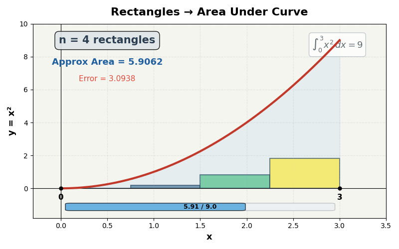
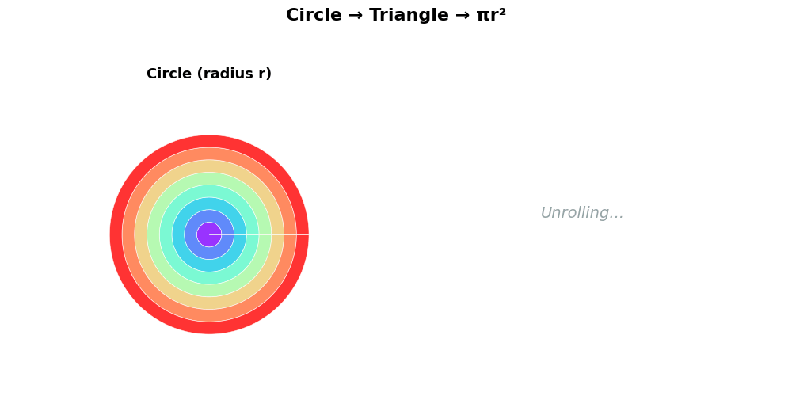

> 上一篇 [《微积分（上）》](/ai-blog/posts/see-math-9-calculus-1/) 里，我们学会了**微分**——把东西切碎，看每一小段的"速度"。
>
> 这一篇讲微积分的另一面——**积分**：**把切碎的东西加回来。**
>
> 这是第二幕的终曲。

> **系列导航**
>
> <div style="max-width: 660px; margin: 0.5em 0; font-size: 0.93em; line-height: 1.9;">
> <div style="border-left: 3px solid #ccc; padding-left: 12px; margin-bottom: 6px; padding: 8px 12px; color: #888;">
> 第一幕 · 数的觉醒（5 篇）+ 第二幕前四篇 <a href="/ai-blog/tags/看见数学/" style="color: #888;">→ 查看全部</a></div>
> <div style="border-left: 3px solid #ccc; padding-left: 12px; margin-bottom: 6px; padding: 8px 12px; color: #888;">
> ▹ <a href="/ai-blog/posts/see-math-9-calculus-1/" style="color: #888;">第九篇：微积分（上）——追问"此刻"</a></div>
> <div style="border-left: 3px solid #FF9800; padding-left: 12px; background: rgba(255,152,0,0.05); padding: 8px 12px; border-radius: 0 4px 4px 0;">
> <strong>▸ 第十篇（本文）：微积分（下）——加起来的艺术 【第二幕终曲】</strong></div>
> </div>

---

## 第一章：从速度到距离

上一篇我们学会了：**知道距离随时间的变化，求速度。** 那叫微分。

现在反过来：

> **如果你知道一辆车每一秒的速度，你能算出它总共走了多远吗？**

如果速度恒定——简单：

```text
匀速 60 km/h，开 2 小时
距离 = 速度 × 时间 = 60 × 2 = 120 km
```

画在坐标系上，这就是一个**矩形的面积**：

```text
速度
60 ─┤████████████████
    │████████████████
    │████████████████
    └────────────────→ 时间
    0       1       2

面积 = 底 × 高 = 2 × 60 = 120 = 距离
```

但如果速度在变呢？一会快一会慢？

这时候，"速度×时间"不管用了——因为速度**不是一个固定的数**。

怎么办？

**切碎。**

---

## 第二章：矩形逼近——积分的灵魂

方法简单到令人震惊：

> **把曲线下面的面积，切成一条一条的小矩形。矩形的面积你会算。然后把它们加起来。**

<div style="max-width: 660px; margin: 1.5em auto;">



</div>

看这个动图：

- 蓝色曲线是 y = x²
- 我们用**矩形**去**逼近**曲线下方的面积
- 4 个矩形：很粗糙，有明显的"台阶"
- 8 个矩形：好一点了
- 16 个 → 32 个 → 64 个 → 128 个……
- **矩形越多，逼近越精确，台阶越小**
- 当矩形数量趋向**无穷**——面积就是**精确的**

<div style="max-width: 660px; margin: 1.5em auto; padding: 20px; border-radius: 8px; border: 2px solid #E91E63; background: rgba(233,30,99,0.04);">

<div style="font-weight: bold; margin-bottom: 12px; font-size: 1.05em; color: #E91E63;">积分的核心思想（一句话版）</div>

```text
想知道一个不规则形状的面积？

  第一步：切成小矩形          （每个矩形面积 = 底 × 高）
  第二步：把所有矩形面积加起来  （求和）
  第三步：让矩形越来越窄       （宽度趋向 0）
  第四步：矩形的数量趋向无穷   （求极限）

  结果 = 精确的面积 = 积分
```

</div>

这和上一篇的微分是**完全对称的**：

```text
微分：两个点越来越近   → 割线变切线   → 得到"速度"（导数）
积分：矩形越来越窄    → 台阶变平滑   → 得到"面积"（积分）

微分：切碎，看局部
积分：加起来，看全局
```

> **一句话记住：** 积分就是"切碎→加起来→取极限"。把大东西切成无穷多小碎片，每个碎片简单到你能计算，然后把它们全加起来。

---

## 第三章：圆的面积——最美的推导

现在来看积分最优美的应用之一。

**你知道圆的面积公式 S = πr² 是怎么来的吗？**

大多数人只是"记住"了它。但让我告诉你它是怎么**推导**出来的——用积分的思想。

<div style="max-width: 660px; margin: 1.5em auto;">



</div>

方法：**把圆切成无穷多个同心细环，然后"展开"。**

<div style="max-width: 660px; margin: 1.5em auto; padding: 20px; border-radius: 8px; background: rgba(255,152,0,0.06); border: 1px solid rgba(255,152,0,0.2);">

<div style="font-weight: bold; margin-bottom: 12px; color: #FF9800; font-size: 1.05em;">πr² 的推导：把圆切成细环</div>

```text
第一步：想象一个半径为 r 的圆

第二步：把圆切成很多"同心环"（像树的年轮）
  最内环半径约 0，最外环半径 = r
  每个细环的宽度 = dr（无穷窄）

第三步：取出一个半径为 t 的细环
  周长 = 2πt
  宽度 = dt（无穷窄）
  面积 ≈ 2πt × dt  （细环展开≈长方形）

第四步：把所有细环的面积加起来
  总面积 = ∫₀ʳ 2πt dt
         = 2π × [t²/2]₀ʳ
         = 2π × r²/2
         = πr²

圆的面积 = πr²    ✓
```

</div>

但更直观的理解是这样的——

**把所有细环"剪开"拉直，按大小排列：**

<div style="max-width: 660px; margin: 1.5em auto; padding: 20px; border-radius: 8px; background: rgba(76,175,80,0.06); border: 1px solid rgba(76,175,80,0.2);">

<div style="font-weight: bold; margin-bottom: 12px; color: #4CAF50; font-size: 1.05em;">细环展开 → 三角形</div>

```text
最外环（周长最长）: ═══════════════════════  2πr
第二环:             ══════════════════════
第三环:             ════════════════════
  ...                ...
第二内环:           ═══
最内环（点）:        ·                      0

排列起来：

     ╱│
    ╱ │
   ╱  │ 高 = r
  ╱   │
 ╱    │
╱─────│
底 = 2πr

三角形面积 = ½ × 底 × 高
           = ½ × 2πr × r
           = πr²        ✓
```

</div>

**把圆切成无穷多个细环 → 展开 → 变成三角形 → 面积一目了然。**

这就是积分的灵魂：**把你不会算的形状（圆），切成你会算的形状（矩形/三角形），然后加起来。**

<div style="max-width: 640px; margin: 1.5em auto; padding: 15px 20px; border-radius: 8px; background: rgba(156,39,176,0.06); border-left: 4px solid #9C27B0;">

**刘徽的割圆术（263 年）** 用的是同样的思想！只不过他是从**外面**逼近——用正多边形包住圆，边数从 6 → 12 → 24 → 48 → 96……多边形越来越接近圆。这和积分的"矩形越来越窄"是同一个思想，方向不同而已。

刘徽比牛顿早了 **1400 年**，用同样的核心思想，算出了 π ≈ 3.1416。

</div>

> **一句话记住：** 积分 = 把大东西切成小碎片 → 每片很简单 → 加起来。圆的面积 πr² 就是这么来的：切成细环，展开变成三角形。

---

## 第四章：微积分基本定理——最美的硬币

现在来看人类数学史上最优美的定理之一：

<div style="max-width: 660px; margin: 1.5em auto; padding: 20px; border-radius: 8px; border: 2px solid #E91E63; background: rgba(233,30,99,0.04);">

<div style="font-weight: bold; margin-bottom: 12px; font-size: 1.1em; color: #E91E63; text-align: center;">微积分基本定理</div>

<div style="text-align: center; font-size: 1.2em; margin: 15px 0;">

**微分和积分是互逆的。**

</div>

```text
微分（求导）：知道"距离"→ 求"速度"    ← 切碎
积分：        知道"速度"→ 求"距离"    ← 加回来

它们是同一枚硬币的两面。
一个是拆，一个是装。
一个问"此刻有多快"，一个问"总共有多少"。
```

</div>

这意味着什么？

**如果你知道一个函数的导数，你就能反推出原函数。**

```text
f(x) = x²   →  导数 f'(x) = 2x    （微分）
g'(x) = 2x  →  原函数 g(x) = x²   （积分）

微分和积分互相"撤销"对方的操作
就像乘法和除法、加法和减法
```

这个定理是牛顿和莱布尼茨（独立地）在 17 世纪发现的，它把"求面积"和"求速度"这两个看似无关的问题统一了起来。

<div style="max-width: 660px; margin: 1.5em auto; padding: 20px; border-radius: 8px; background: rgba(33,150,243,0.06); border: 1px solid rgba(33,150,243,0.2);">

<div style="font-weight: bold; margin-bottom: 12px; color: #2196F3; font-size: 1.05em;">一句中国古语</div>

《**道德经**》第四十二章："**道生一，一生二，二生三，三生万物。**"

微积分也是如此——从"极限"这一个概念出发（道生一），分化出微分和积分（一生二），两者结合产生了解决无数问题的能力（二生三，三生万物）。物理学、工程学、经济学、生物学——现代科学的每一个分支，都离不开微积分。

</div>

---

## 第五章：连接 AI——概率分布的面积 = 1

积分在 AI 里的应用非常基础：**概率分布**。

还记得第五篇里讲的 softmax 吗？GPT 预测下一个词时，会给每个可能的词一个概率：

```text
"今天天气真___"

  好  → 45%
  棒  → 20%
  冷  → 15%
  热  → 10%
  差  → 5%
  ...其他 → 5%
```

这些概率加起来必须等于 **100%**。

当可能的选项从"几个"变成"无穷多个"（连续概率分布），"加起来等于 100%"就变成了——

**概率密度曲线下的面积 = 1。**

<div style="max-width: 660px; margin: 1.5em auto; padding: 20px; border-radius: 8px; background: rgba(76,175,80,0.06); border: 1px solid rgba(76,175,80,0.2);">

<div style="font-weight: bold; margin-bottom: 12px; color: #4CAF50; font-size: 1.05em;">概率分布的面积 = 1</div>

```text
正态分布（钟形曲线）：

          ▓▓▓▓
         ▓▓▓▓▓▓
        ▓▓▓▓▓▓▓▓
       ▓▓▓▓▓▓▓▓▓▓
     ░░▓▓▓▓▓▓▓▓▓▓░░
   ░░░░▓▓▓▓▓▓▓▓▓▓░░░░
 ░░░░░░▓▓▓▓▓▓▓▓▓▓░░░░░░
────────────────────────
            μ

整条曲线下方的面积 = 1（100%）
这是概率的铁律：所有可能性加起来 = 100%

怎么算这个面积？积分！
∫₋∞^∞ f(x)dx = 1
```

</div>

**AI 里几乎所有涉及"概率"的计算，底层都在做积分。**

- softmax 输出的概率之和 = 1（离散版的"面积 = 1"）
- 连续概率分布的归一化 = 积分
- 损失函数（cross-entropy）的定义里有对数和求和——本质是离散积分
- 扩散模型（生成图片的 AI）的核心数学是随机微分方程——微积分的高级形式

> **一句话记住：** 概率的铁律是"所有可能性加起来 = 100%"。当可能性是连续的，"加起来"就变成了积分。AI 的每一次概率计算，背后都站着积分。

---

## 第六章：第二幕的终点——回望全程

让我们站在终点，回望这五篇（第六到第十篇）的旅程：

<div style="max-width: 660px; margin: 1.5em auto; padding: 20px; border-radius: 8px; background: rgba(156,39,176,0.06); border: 1px solid rgba(156,39,176,0.2);">

<div style="font-weight: bold; margin-bottom: 12px; color: #9C27B0; font-size: 1.05em;">第二幕回顾：变化的语言</div>

```text
⑥ 函数          输入→输出的机器。GPT 是一个超大型函数。
      ↓
⑦ 指数爆炸      人脑理解不了的增长。AI 的 Scaling Law。
      ↓
⑧ 圆与波        sin/cos 是圆运动的影子。位置编码。
      ↓
⑨ 微积分（上）   切碎看速度。梯度 = 导数。AI 学习的根本。
      ↓
⑩ 微积分（下）   加起来看总量。面积 = 积分。概率之和 = 1。
```

**第一幕给了你"静止的工具"：数、坐标、方程。**

**第二幕给了你"变化的工具"：函数、指数、波、微积分。**

</div>

走到这里，你已经拥有了**理解 AI 所需的全部数学思想基础**：

<div style="max-width: 660px; margin: 1.5em auto; padding: 20px; border-radius: 8px; border: 2px solid #FF9800; background: rgba(255,152,0,0.04);">

<div style="font-weight: bold; margin-bottom: 12px; font-size: 1.05em; color: #FF9800;">从结绳记事到 AI——十篇的完整路线</div>

| 篇 | 数学概念 | 在 AI 里是什么 |
|---|---------|-------------|
| ① 结绳记事 | 抽象 | Tokenization：词→数字 |
| ② 零的发明 | 零与负数 | ReLU：负数→0（开关） |
| ③ 未知数 x | 代数 | 参数：几十亿个 x |
| ④ 坐标革命 | 坐标系 | 词嵌入：词→向量坐标 |
| ⑤ 方程的力量 | 方程组合 | Attention 公式 |
| ⑥ 函数 | 输入→输出 | GPT = 超大型函数 |
| ⑦ 指数爆炸 | 指数与对数 | softmax 的 eˣ + Scaling Law |
| ⑧ 圆与波 | sin/cos | 位置编码 |
| ⑨ 微积分（上）| 导数 | 梯度下降：AI 学习的核心 |
| ⑩ 微积分（下）| 积分 | 概率分布面积 = 1 |

</div>

**你从结绳记事走到了微积分。从一万年前走到了今天。人类走这段路花了几千年。而你只用了十篇文章。**

---

## 第七章：尾声——数学是人类的望远镜

走到这里，让我说几句心里话。

很多人告诉我他们"害怕数学"、"学不会数学"。我想告诉你——

**你已经学会了。**

回顾这十篇——你理解了抽象（结绳记事）、你接受了零和负数、你学会了给未知数取名字、你看见了方程的图形、你知道了 GPT 就是一个函数、你不再被指数骗到、你看见了 sin 是圆的影子、你亲手"求导"了、你理解了积分的灵魂。

**这些不是"简单的入门知识"。这些是数学最核心的思想。** 很多学了十几年数学的人，会算题但不理解这些思想。而你现在理解了。

<div style="max-width: 640px; margin: 1.5em auto; padding: 20px; border-radius: 8px; background: rgba(255,152,0,0.06); border-left: 4px solid #FF9800;">

数学不是一堆公式。数学是人类为了**看见"看不见的东西"**而发明的工具。

- 望远镜让你看见远方（天文学）
- 显微镜让你看见微小（生物学）
- 数学让你看见**规律、关系、变化、模式**——这些是任何光学仪器看不到的

**数学是人类的望远镜。** 而你现在，已经拿起了它。

</div>

---

## 动手实验

### 实验一：亲手做"积分"——矩形逼近

```python
# 用矩形逼近 y = x² 从 0 到 3 的面积
# 真实答案 = 9.0

def f(x):
    return x ** 2

print("矩形逼近 ∫₀³ x² dx 的面积")
print("理论精确值: 9.0")
print("─" * 45)
print(f"{'矩形数':>8}  {'近似面积':>10}  {'误差':>10}  精度")
print("─" * 45)

for n in [4, 8, 16, 32, 64, 128, 1024, 10000]:
    dx = 3.0 / n  # 每个矩形的宽度
    area = 0
    for i in range(n):
        x = i * dx
        area += f(x) * dx  # 矩形面积 = 高 × 宽
    error = abs(area - 9.0)
    pct = (1 - error/9) * 100
    print(f"{n:>8}  {area:>10.4f}  {error:>10.4f}  {pct:.2f}%")

# 输出：
#   矩形数      近似面积        误差  精度
# ─────────────────────────────────────────────
#        4      5.9063      3.0938  65.63%
#        8      7.3828      1.6172  82.03%
#       16      8.1797      0.8203  90.89%
#       32      8.5869      0.4131  95.41%
#       64      8.7927      0.2073  97.70%
#      128      8.8961      0.1039  98.85%
#     1024      8.9868      0.0132  99.85%
#    10000      8.9987      0.0013  99.99%  ← 几乎完美！
```

### 实验二：验证"概率之和 = 1"

```python
import math

# softmax：把任意数字变成概率（加起来 = 1）

scores = [2.0, 1.0, 0.5, 0.1, -0.5]
words = ["好", "棒", "冷", "热", "差"]

# softmax = e^x / sum(e^x)
exp_scores = [math.exp(s) for s in scores]
total = sum(exp_scores)
probs = [e / total for e in exp_scores]

print('"今天天气真___" 的概率分布：')
print("─" * 40)
for word, score, prob in zip(words, scores, probs):
    bar = "█" * int(prob * 50)
    print(f'  "{word}" 分数={score:>4.1f}  概率={prob:.1%}  {bar}')

print(f"\n概率之和 = {sum(probs):.6f}")
print("（必须等于 1.000000 —— 积分/求和的铁律）")

# 输出：
# "今天天气真___" 的概率分布：
# ────────────────────────────────────────
#   "好" 分数= 2.0  概率=52.1%  ██████████████████████████
#   "棒" 分数= 1.0  概率=19.2%  █████████
#   "冷" 分数= 0.5  概率=11.6%  █████
#   "热" 分数= 0.1  概率= 7.8%  ███
#   "差" 分数=-0.5  概率= 4.3%  ██
#
# 概率之和 = 1.000000
```

---

## 本篇小结

<div style="max-width: 660px; margin: 1.5em auto; padding: 20px; border-radius: 8px; border: 2px solid #FF9800; background: rgba(255,152,0,0.04);">

<div style="font-weight: bold; margin-bottom: 12px; font-size: 1.05em;">第二幕终曲 · 这篇文章讲了什么？</div>

**一、积分 = 切碎 → 加起来 → 取极限**
- 矩形越来越窄，面积越来越精确
- 和微分（切碎看速度）完全对称

**二、πr² 的优美推导**
- 圆切成同心细环 → 展开 → 排成三角形
- 面积 = ½ × 2πr × r = πr²
- 刘徽的割圆术——同一思想，早了 1400 年

**三、微积分基本定理**
- 微分和积分是互逆的——同一枚硬币的两面
- 一个切碎看速度，一个加起来看总量

**四、概率的铁律**
- 所有可能性加起来 = 100%
- 连续概率分布的面积 = 1
- AI 的每一次概率计算，背后都站着积分

**五、前两幕的完整路线**
- 从结绳记事到微积分，从抽象到积分
- 每一个概念都在 AI 里有对应
- 第三幕将走进"看不见的世界"——向量、矩阵、概率、高维

</div>

---

## 下一篇预告

两幕结束了，但数学的故事远没有结束。

我们学会了描述静止的世界（数、方程、坐标），也学会了描述变化的世界（函数、指数、波、微积分）。

接下来要面对的是——**那些人类感官无法直接感知的东西。**

> 高维空间、概率分布、梯度场……你摸不到、看不见，但 AI 恰恰就在这些"看不见的世界"里运行。

第三幕的第一个问题：

**如果一个事物需要用 768 个数来描述——这 768 个数组成的"一串数字"，叫什么？**

答案是：**向量。**

下一篇：**看见数学（十一）：向量——给万物一个坐标**

---

<div style="margin-top: 30px; padding-top: 20px; border-top: 1px solid #e0e0e0; font-size: 0.9em; color: #888; line-height: 1.8;">

**《看见数学》系列** — 从结绳记事到 AI，看见数学之美。<br>
本文首发于「AI 学习笔记」博客：https://Jason-Azure.github.io/ai-blog/<br>
微信公众号：AI-lab学习笔记<br>
系列文章完整列表见 [标签：看见数学](/ai-blog/tags/看见数学/)

</div>
