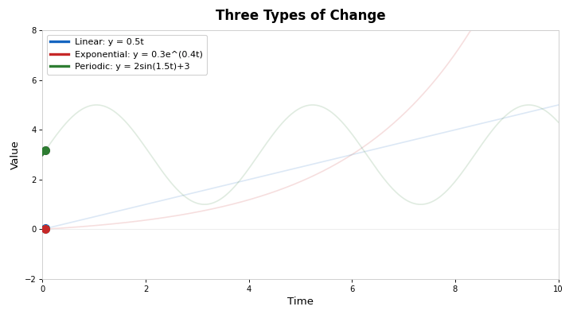
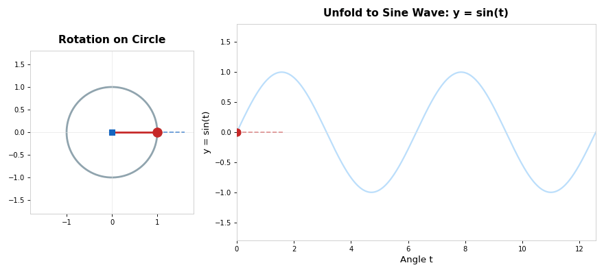
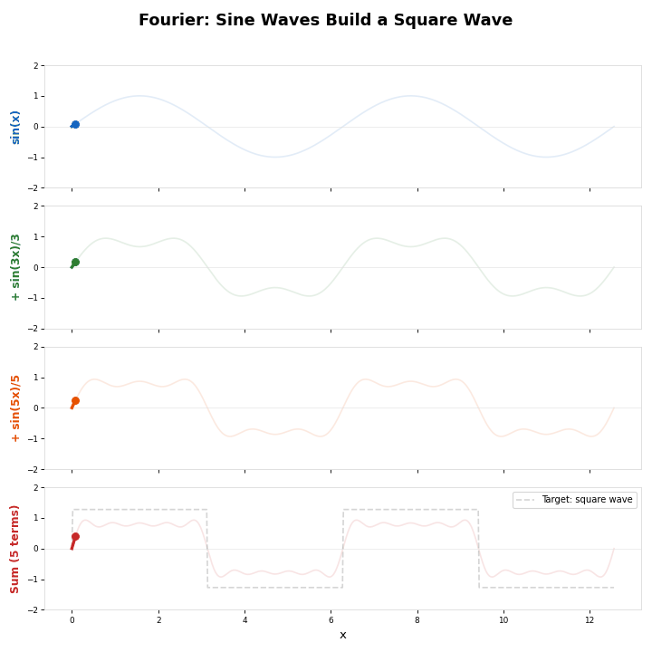

> 上一篇 [《指数爆炸》](/ai-blog/posts/see-math-7-exponential/) 里，我们见识了指数增长的"温和炸弹"。
>
> 我们已经认识了三种变化的两种：**线性**（直线）和**指数**（爆炸）。
>
> 现在来看第三种——也是自然界**最常见**的一种：**周而复始。**

> **系列导航**
>
> <div style="max-width: 660px; margin: 0.5em 0; font-size: 0.93em; line-height: 1.9;">
> <div style="border-left: 3px solid #ccc; padding-left: 12px; margin-bottom: 6px; padding: 8px 12px; color: #888;">
> 第一幕 · 数的觉醒（5 篇）<a href="/ai-blog/tags/看见数学/" style="color: #888;">→ 查看全部</a></div>
> <div style="border-left: 3px solid #ccc; padding-left: 12px; margin-bottom: 6px; padding: 8px 12px; color: #888;">
> ▹ <a href="/ai-blog/posts/see-math-6-functions/" style="color: #888;">第六篇：函数——万能的输入-输出机器</a></div>
> <div style="border-left: 3px solid #ccc; padding-left: 12px; margin-bottom: 6px; padding: 8px 12px; color: #888;">
> ▹ <a href="/ai-blog/posts/see-math-7-exponential/" style="color: #888;">第七篇：指数爆炸——人脑理解不了的增长</a></div>
> <div style="border-left: 3px solid #FF9800; padding-left: 12px; margin-bottom: 6px; background: rgba(255,152,0,0.05); padding: 8px 12px; border-radius: 0 4px 4px 0;">
> <strong>▸ 第八篇（本文）：圆与波——三角函数的真面目</strong></div>
> <div style="border-left: 3px solid #ccc; padding-left: 12px; margin-bottom: 6px; padding: 8px 12px; color: #888;">
> ▹ 第九篇：微积分（上）——追问"此刻"</div>
> <div style="border-left: 3px solid #ccc; padding-left: 12px; padding: 8px 12px; color: #888;">
> ▹ 第十篇：微积分（下）——加起来的艺术</div>
> </div>

---

## 第一章：三种变化的"脸"

在写三角函数之前，让我们先看一张动图，回顾我们已经认识的变化：

<div style="max-width: 660px; margin: 1.5em auto;">



</div>

**蓝色（线性）**：匀速前进，直直的，可预测。上一幕第一篇讲的。

**红色（指数）**：一开始温和，然后爆炸。上一篇刚讲的。

**绿色（周期）**：上去、下来、上去、下来……永远在循环。

第三种变化在生活中最常见——

- 白天和黑夜，周而复始
- 春夏秋冬，年年循环
- 心脏跳动，一辈子不停
- 潮涨潮落，日复一日
- 交流电，每秒 50 次正负交替

**描述这种"循环"的数学工具，就是三角函数——sin 和 cos。**

但在正式讲之前，我需要你做一件事：

> **忘掉你在学校学过的一切关于 sin/cos/tan 的东西。**
>
> 忘掉三角形、对边、邻边、斜边。忘掉那些让你头疼的公式。
>
> 我们从头开始。从一个**圆**开始。

---

## 第二章：一个点在圆上转圈

想象一个时钟。

秒针的尖端，在表盘上画着一个圆。

现在，我请你只盯着秒针尖端的**上下位置**（忽略左右）：

- 12 点位置：最高
- 3 点位置：中间
- 6 点位置：最低
- 9 点位置：中间
- 回到 12 点：又是最高

**上下位置随时间变化的轨迹，画出来就是——一条波浪线。**

这就是正弦波。

<div style="max-width: 660px; margin: 1.5em auto;">



</div>

**这是整篇文章最重要的动图。** 请仔细看：

- **左边**：一个点（红色）在圆上旋转
- 蓝色虚线跟踪这个点的 **y 坐标**（上下位置）
- **右边**：把 y 坐标随时间展开 → 就是正弦波 sin(θ)

**sin(θ) 就是"圆上旋转的影子"。**

<div style="max-width: 660px; margin: 1.5em auto; padding: 20px; border-radius: 8px; border: 2px solid #E91E63; background: rgba(233,30,99,0.04);">

<div style="font-weight: bold; margin-bottom: 12px; font-size: 1.05em; color: #E91E63;">核心理解</div>

```text
一个点在圆上匀速旋转

  它的 y 坐标（上下）随时间的变化 → sin（正弦）
  它的 x 坐标（左右）随时间的变化 → cos（余弦）

sin 和 cos 不是"三角形的边长比"
sin 和 cos 是"圆运动在坐标轴上的投影"
```

</div>

这就是三角函数的**真面目**。它不是关于三角形的——它是关于**圆和旋转**的。

三角形只是一个特殊情况：圆上的一个点、圆心、和那个点在 x 轴上的投影，三个点恰好构成一个直角三角形。但这只是"副产品"，不是本质。

> **一句话记住：** sin = 圆上旋转的上下投影。cos = 圆上旋转的左右投影。三角函数的本质是**圆**，不是三角形。

---

## 第三章：波无处不在

知道了 sin/cos 描述的是"循环"之后，你会发现——**波无处不在**。

<div style="max-width: 660px; margin: 1.5em auto; padding: 20px; border-radius: 8px; background: rgba(33,150,243,0.06); border: 1px solid rgba(33,150,243,0.2);">

<div style="font-weight: bold; margin-bottom: 12px; color: #2196F3; font-size: 1.05em;">世界是波做的</div>

| 现象 | 波的特征 | 周期 |
|------|---------|------|
| **声音** | 空气的振动 | 人耳听到 20Hz~20000Hz |
| **光** | 电磁波 | 频率极高（~10¹⁴ Hz） |
| **心跳** | 心脏的收缩舒张 | 约 1 秒一次（1Hz） |
| **四季** | 地球绕太阳 | 365 天一个周期 |
| **潮汐** | 月球引力 | 约 12 小时一个周期 |
| **交流电** | 电流方向交替 | 中国 50Hz（每秒 50 次） |
| **呼吸** | 肺的扩张收缩 | 约 4 秒一次 |
| **脑电波** | 神经元的电活动 | α 波 8-13Hz |

</div>

所有这些"波"，**都可以用 sin 函数来描述**。

区别只在于三个"旋钮"：

```text
f(t) = A · sin(2π · f · t + φ)

A = 振幅（波有多高——声音有多响、灯有多亮）
f = 频率（转得多快——音调有多高、颜色是什么）
φ = 相位（从哪里开始——波的起始位置）
```

**同一个公式，调不同的旋钮，描述了从声音到光到心跳的一切循环现象。**

<div style="max-width: 640px; margin: 1.5em auto; padding: 15px 20px; border-radius: 8px; background: rgba(76,175,80,0.06); border-left: 4px solid #4CAF50;">

**古人的"波"意识：** 中国古代没有 sin 函数，但对"周期循环"有深刻的感知。《**周易**》的核心思想就是**阴阳交替、循环往复**——阳极生阴、阴极生阳，正是正弦波"上到顶就开始下、下到底就开始上"的哲学表达。《**吕氏春秋**》记录了中国古代的十二律——用竹管长度精确对应音高，这本质上就是在用"物理长度"控制"声波频率"。

</div>

> **一句话记住：** 声音、光、心跳、四季——所有循环现象都是波。所有波都可以用 sin 描述。一个公式，三个旋钮（振幅、频率、相位），描述了整个波动的世界。

---

## 第四章：傅里叶的魔法——任何波都能拆

如果说 sin 是波的"原子"，那么 **傅里叶** 发现了一件更惊人的事：

> **任何形状的波，不管多复杂，都可以拆成一堆简单的 sin 波的叠加。**

就像——任何颜色都可以用红、绿、蓝三原色混合出来。任何声音都可以用一组纯音叠加出来。

<div style="max-width: 660px; margin: 1.5em auto;">



</div>

看这个动图：

- **第一行**：只有一个基本的 sin(x)——很光滑的波
- **第二行**：加上 sin(3x)/3——波开始有棱角了
- **第三行**：再加上 sin(5x)/5——棱角更明显了
- **第四行**：加上更多项——**越来越像一个方波！**

**圆润的正弦波，叠加足够多个，就能拼出方方正正的方波。**

这就是 **傅里叶变换** 的核心思想（1807 年提出）：

<div style="max-width: 660px; margin: 1.5em auto; padding: 20px; border-radius: 8px; background: rgba(255,152,0,0.06); border: 1px solid rgba(255,152,0,0.2);">

<div style="font-weight: bold; margin-bottom: 12px; color: #FF9800; font-size: 1.05em;">傅里叶变换的直觉</div>

```text
正方向（分解）：
  复杂的声音 → 拆成 → 一组频率不同的简单 sin 波
  就像把一首交响乐拆成单个乐器的声音

反方向（合成）：
  一组简单 sin 波 → 叠加 → 任意复杂的波形
  就像把各乐器的声音混合成交响乐
```

**你手机里的所有音频处理、图片压缩（JPEG）、语音识别，底层都在用傅里叶变换。**

</div>

这个思想的威力在于：**不管现实世界有多复杂，最终都可以拆解为最简单的"圆的旋转"。**

---

## 第五章：连接 AI——Transformer 的位置编码

现在来看 AI 里三角函数最精彩的应用。

Transformer（GPT 的核心架构）有一个问题需要解决：

> **"我 今天 很 开心"——AI 怎么知道"今天"是第 2 个词，不是第 4 个？**

因为 Transformer 是**同时处理所有词**的（不像人类一个一个读），它天然分不清顺序。所以需要给每个位置一个"标记"。

Transformer 的作者选择了什么来做位置标记？

**sin 和 cos。**

<div style="max-width: 660px; margin: 1.5em auto; padding: 20px; border-radius: 8px; background: rgba(76,175,80,0.06); border: 1px solid rgba(76,175,80,0.2);">

<div style="font-weight: bold; margin-bottom: 12px; color: #4CAF50; font-size: 1.05em;">位置编码：用波浪标记位置</div>

```text
位置 0: [sin(0), cos(0), sin(0), cos(0), ...]
位置 1: [sin(1), cos(1), sin(0.01), cos(0.01), ...]
位置 2: [sin(2), cos(2), sin(0.02), cos(0.02), ...]
...

不同频率的 sin/cos 组合起来，
每个位置都有一个独一无二的"指纹"。
```

</div>

为什么选 sin/cos？三个原因：

<div style="max-width: 660px; margin: 1.5em auto; padding: 20px; border-radius: 8px; background: rgba(156,39,176,0.06); border: 1px solid rgba(156,39,176,0.2);">

<div style="font-weight: bold; margin-bottom: 12px; color: #9C27B0; font-size: 1.05em;">为什么用 sin/cos 做位置编码？</div>

| 特性 | 为什么重要 |
|------|----------|
| **值域有界** [-1, 1] | 数值不会爆炸，不管句子多长 |
| **每个位置独特** | 多个频率的 sin/cos 组合形成唯一"指纹" |
| **相对距离可算** | sin(a+b) 可以用 sin(a)、cos(a)、sin(b)、cos(b) 算出来——AI 可以"推算"相对位置 |

</div>

**圆的旋转天然就有"位置感"——时钟的 3 点和 9 点看起来不同，12 点和 6 点看起来不同。每个角度（位置）都是独特的。**

Transformer 的作者就是利用了圆的这个特性，让 AI "知道"每个词在句子里的位置。

> **一句话记住：** Transformer 用 sin/cos 给每个词标记"你是第几个"。因为波天然有"每个位置都不同"和"位置之间的关系可以计算"的特性。圆的旋转，帮 AI 记住了词的顺序。

---

## 第六章：从圆到万物——中国古代的圆与波

最后，让我们致敬古人对"圆"和"循环"的理解。

<div style="max-width: 660px; margin: 1.5em auto; padding: 20px; border-radius: 8px; background: rgba(255,152,0,0.06); border: 1px solid rgba(255,152,0,0.2);">

<div style="font-weight: bold; margin-bottom: 12px; color: #FF9800; font-size: 1.05em;">中国文化中的"圆与波"</div>

| 概念 | 来源 | 对应的数学 |
|------|------|----------|
| 阴阳鱼太极图 | 《周易》 | sin/cos 的交替——正弦波的完美视觉化 |
| "天行有常" | 《荀子》 | 自然规律是周期性的——天体运行可用波描述 |
| 十二律 | 《吕氏春秋》 | 竹管长度 ↔ 音高频率——声波的物理控制 |
| 圭表测影 | 周代天文 | 日影长度随季节的变化 = 正弦曲线 |
| 农历 | 古代天文历法 | 月相变化 ≈ 29.5 天一个 sin 周期 |

</div>

圭表测影特别有意思。古人在地上立一根竿子（圭表），记录正午时刻影子的长度。

一年下来，影子长度的变化画出来——**就是一条正弦曲线**。

冬至最长，夏至最短，春分秋分居中。周而复始，年年如此。

**古人用竹竿和影子，"看见"了三角函数。只是他们不知道它叫 sin。**

---

## 动手实验

### 实验一：亲手画正弦波

```python
import math

# 用文字画一个正弦波！
width = 60
print("y = sin(x) 的手绘版：")
print()

for i in range(0, width):
    x = i * 4 * math.pi / width
    y = math.sin(x)
    # 把 y(-1~1) 映射到 0~30 的字符位置
    pos = int((y + 1) / 2 * 30)
    line = " " * pos + "●"
    print(f"  {line}")
```

### 实验二：波的叠加

```python
import math

# 看看多个 sin 叠加如何逼近方波
print("正弦波叠加逼近方波：")
print("─" * 50)

for n_terms in [1, 3, 5, 9]:
    print(f"\n{n_terms} 个正弦波叠加：")
    for i in range(40):
        x = i * 2 * math.pi / 40
        y = 0
        for k in range(n_terms):
            n = 2 * k + 1  # 奇数项：1, 3, 5, 7...
            y += math.sin(n * x) / n
        y *= 4 / math.pi  # 归一化

        pos = int((y + 1.5) / 3 * 35)
        pos = max(0, min(35, pos))
        print(f"  {'·' * pos}█")
```

---

## 本篇小结

<div style="max-width: 660px; margin: 1.5em auto; padding: 20px; border-radius: 8px; border: 2px solid #FF9800; background: rgba(255,152,0,0.04);">

<div style="font-weight: bold; margin-bottom: 12px; font-size: 1.05em;">这篇文章讲了什么？</div>

**一、三角函数的真面目**
- sin = 圆上旋转的上下投影，cos = 左右投影
- 本质是圆，不是三角形

**二、波无处不在**
- 声音、光、心跳、四季、交流电——全是波
- 一个公式 A·sin(2πft+φ)，三个旋钮，描述一切循环

**三、傅里叶的魔法**
- 任何复杂的波 = 一堆简单 sin 波的叠加
- 手机里的音频、图片压缩、语音识别——全在用

**四、AI 的位置编码**
- Transformer 用 sin/cos 给每个词标记位置
- 因为波天然有"每个位置独特"和"相对距离可算"的特性

**五、古人也"看见"了波**
- 阴阳太极 = sin/cos 的交替
- 圭表测影 = 正弦曲线的实测
- 十二律 = 声波频率的物理控制

</div>

---

## 下一篇预告

我们现在认识了三种变化：线性（直线）、指数（爆炸）、周期（循环）。

但有一个问题一直悬而未决：

> **变化有多"快"？**

一辆车在加速，在加速的**某一瞬间**，它的速度到底是多少？不是"平均速度"——是**此刻、此时、这一毫秒**的速度。

为了回答这个问题，人类花了 2000 年——从芝诺的乌龟到牛顿和莱布尼茨。答案是人类数学史上最深刻的发明之一：

**微积分。**

下一篇：**[看见数学（九）：微积分（上）——追问"此刻"](/ai-blog/posts/see-math-9-calculus-1/)**

---

<div style="margin-top: 30px; padding-top: 20px; border-top: 1px solid #e0e0e0; font-size: 0.9em; color: #888; line-height: 1.8;">

**《看见数学》系列** — 从结绳记事到 AI，看见数学之美。<br>
本文首发于「AI 学习笔记」博客：https://Jason-Azure.github.io/ai-blog/<br>
微信公众号：AI-lab学习笔记<br>
系列文章完整列表见 [标签：看见数学](/ai-blog/tags/看见数学/)

</div>
