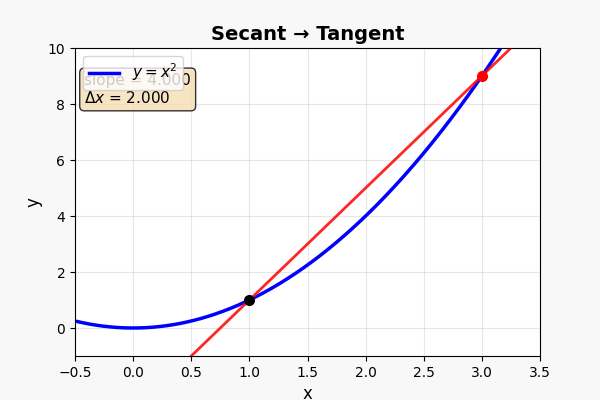
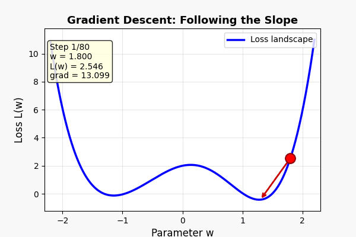

> 上一篇 [《圆与波》](/ai-blog/posts/see-math-8-waves/) 里，我们认识了第三种变化——周期循环。
>
> 线性、指数、周期——三种变化我们都认识了。
>
> 但有一个问题一直悬在那里，从未回答：
>
> **在变化的某一瞬间，变化到底有多快？**

> **系列导航**
>
> <div style="max-width: 660px; margin: 0.5em 0; font-size: 0.93em; line-height: 1.9;">
> <div style="border-left: 3px solid #ccc; padding-left: 12px; margin-bottom: 6px; padding: 8px 12px; color: #888;">
> 第一幕 · 数的觉醒（5 篇）+ 第二幕前三篇 <a href="/ai-blog/tags/看见数学/" style="color: #888;">→ 查看全部</a></div>
> <div style="border-left: 3px solid #FF9800; padding-left: 12px; margin-bottom: 6px; background: rgba(255,152,0,0.05); padding: 8px 12px; border-radius: 0 4px 4px 0;">
> <strong>▸ 第九篇（本文）：微积分（上）——追问"此刻"</strong></div>
> <div style="border-left: 3px solid #ccc; padding-left: 12px; padding: 8px 12px; color: #888;">
> ▹ 第十篇：微积分（下）——加起来的艺术</div>
> </div>

---

## 第一章：一个你每天都遇到的问题

你在开车。

仪表盘上的速度表显示：**80 km/h**。

这个"80"是什么意思？

你可能觉得这很简单——"就是说我现在每小时能走 80 公里呗。"

但认真想想，这个说法有点奇怪：

> 你并没有真的走了一个小时。你可能 5 秒后就踩了刹车。
>
> "每小时 80 公里"描述的不是你**真的走了**多远，而是——**如果你以此刻的状态继续走下去**，一小时后你会走多远。

这就是**瞬时速度**——**此刻、此时、这一毫秒**的速度。

问题来了：**怎么测量"此刻"的速度？**

<div style="max-width: 660px; margin: 1.5em auto; padding: 20px; border-radius: 8px; background: rgba(255,152,0,0.06); border: 1px solid rgba(255,152,0,0.2);">

<div style="font-weight: bold; margin-bottom: 12px; color: #FF9800; font-size: 1.05em;">平均速度 vs 瞬时速度</div>

```text
平均速度很好算：

  你 2 小时走了 160 公里
  平均速度 = 160 / 2 = 80 km/h

但这是"平均"——你可能前半小时堵车只走了 10 公里，
后面在高速上飙到 120 km/h。

瞬时速度问的是：
  在 10:32:45.237 这一刻，你到底在以多少速度运动？

  不是 2 小时的平均
  不是 1 分钟的平均
  不是 1 秒的平均
  是——"这一刻"
```

</div>

"这一刻"有多短？0.1 秒？0.001 秒？0.000001 秒？

**无穷短。**

为了回答这个问题，人类花了 **2000 年**。

---

## 第二章：芝诺的乌龟——一个 2500 年前的困惑

公元前 5 世纪，古希腊的哲学家**芝诺**提出了一系列著名的悖论。其中最有名的一个：

<div style="max-width: 660px; margin: 1.5em auto; padding: 20px; border-radius: 8px; background: rgba(33,150,243,0.06); border: 1px solid rgba(33,150,243,0.2);">

<div style="font-weight: bold; margin-bottom: 12px; color: #2196F3; font-size: 1.05em;">阿基里斯与乌龟</div>

```text
英雄阿基里斯和一只乌龟赛跑。
乌龟先出发 100 米。

阿基里斯跑到乌龟出发的位置时（100 米），
乌龟又往前走了 10 米。

阿基里斯再跑 10 米时，
乌龟又往前走了 1 米。

阿基里斯再跑 1 米时，
乌龟又往前走了 0.1 米。

……

阿基里斯似乎永远追不上乌龟？
```

</div>

当然，现实中阿基里斯很快就超过了乌龟。但芝诺的悖论揭示了一个深刻的问题：

**如何处理"无穷多个越来越小的东西"？**

100 + 10 + 1 + 0.1 + 0.01 + …… 无穷多项加起来，等于多少？

答案是 **111.111…… = 111⅑**（一个有限的数）。

**无穷多个东西加起来，可以是有限的。** 这个事实，人类直到 17 世纪才真正搞明白。

<div style="max-width: 640px; margin: 1.5em auto; padding: 15px 20px; border-radius: 8px; background: rgba(76,175,80,0.06); border-left: 4px solid #4CAF50;">

还记得第七篇里庄子的"**一尺之棰，日取其半，万世不竭**"吗？那也是同一个问题的另一面——½ + ¼ + ⅛ + …… = 1。无穷多个越来越小的碎片，加起来等于一个完整的"1"。

**芝诺和庄子在同一个时代（公元前 5 世纪），在地球的两端，思考着同一个问题。**

</div>

---

## 第三章：割线→切线——微积分的核心动画

芝诺的问题在 2000 年后被牛顿和莱布尼茨用一个精妙的方法解决了。

方法的核心是：**极限**。

让我用一个动画来展示：

<div style="max-width: 660px; margin: 1.5em auto;">



</div>

**这是微积分最核心的画面。** 仔细看：

1. 曲线 y = x² 上有**两个点** A 和 B
2. 连接 A 和 B 的直线叫**割线**（secant）——它代表两点之间的**平均变化率**
3. 当 B 点**沿着曲线向 A 滑动**时，割线在旋转
4. 当 B 无限接近 A 时——割线变成了**切线**（tangent）
5. **切线的斜率 = A 点的瞬时变化率 = 导数**

<div style="max-width: 660px; margin: 1.5em auto; padding: 20px; border-radius: 8px; border: 2px solid #E91E63; background: rgba(233,30,99,0.04);">

<div style="font-weight: bold; margin-bottom: 12px; font-size: 1.05em; color: #E91E63;">微积分的核心思想（一句话版）</div>

```text
想知道"此刻"变化有多快？

  取两个时刻，算平均变化率        → 割线
  让两个时刻越来越近              → 割线在旋转
  让时间间隔无限接近零            → 割线变成切线
  切线的斜率                     → 就是"此刻"的变化率

这个过程叫"求极限"
这个结果叫"导数"
```

</div>

翻译成速度的语言：

```text
过去 2 小时你走了 160 km  →  平均 80 km/h     （割线）
过去 1 分钟你走了 1.4 km  →  平均 84 km/h     （更细的割线）
过去 1 秒你走了 23 米    →  平均 82.8 km/h   （更更细的割线）
过去 0.001 秒……         →  ……               （越来越细）

当时间间隔→0            →  瞬时速度 83 km/h  （切线=导数）
```

> **一句话记住：** 导数 = 无限短时间内的变化率。求导就是把"平均"逼到"瞬间"——让两个点无限接近，割线变成切线。

---

## 第四章：导数——函数的"速度表"

导数有一个特别直观的理解：**它是函数的"速度表"。**

每个函数都有一条曲线。导数告诉你，曲线在每一个点的**坡度**是多少。

<div style="max-width: 660px; margin: 1.5em auto; padding: 20px; border-radius: 8px; background: rgba(33,150,243,0.06); border: 1px solid rgba(33,150,243,0.2);">

<div style="font-weight: bold; margin-bottom: 12px; color: #2196F3; font-size: 1.05em;">导数 = 坡度 = 速度</div>

```text
曲线很陡（上坡）  → 导数很大   → 变化很快
曲线很平          → 导数接近 0  → 几乎不变
曲线在下降        → 导数是负数  → 在变小
曲线在顶点        → 导数 = 0   → 瞬间"停"了

        ╱ ← 导数 = 正（上坡）
       ╱
      ╱── ← 导数 = 0（顶点）
         ╲
          ╲ ← 导数 = 负（下坡）
```

</div>

几个常见函数的导数：

<div style="max-width: 660px; margin: 1.5em auto; padding: 20px; border-radius: 8px; background: rgba(156,39,176,0.06); border: 1px solid rgba(156,39,176,0.2);">

<div style="font-weight: bold; margin-bottom: 12px; color: #9C27B0; font-size: 1.05em;">常见函数和它们的"速度表"</div>

| 函数 f(x) | 导数 f'(x) | 直觉 |
|-----------|-----------|------|
| f(x) = 5（常数） | f'(x) = 0 | 不动的东西没有速度 |
| f(x) = 2x + 1（直线） | f'(x) = 2 | 匀速变化，速度恒定 |
| f(x) = x²（抛物线） | f'(x) = 2x | 越来越快（x 越大越陡） |
| f(x) = sin(x)（波浪） | f'(x) = cos(x) | 波顶（sin=1）时速度为零，波中速度最快 |
| f(x) = eˣ（指数） | f'(x) = eˣ | 速度等于自身！越快就越更快——指数爆炸的数学本质 |

</div>

最后一行特别惊人：**eˣ 的导数就是它自己。** 它的"速度"等于它的"位置"——越高就越快，越快就越高。这就是指数增长"失控"的数学根源。

<div style="max-width: 640px; margin: 1.5em auto; padding: 15px 20px; border-radius: 8px; background: rgba(76,175,80,0.06); border-left: 4px solid #4CAF50;">

**刘徽的割圆术（263 年）** 本质上就是极限思想的应用：把圆用正多边形逼近，边数越多越接近圆。从 6 边形到 12 边形到 24 边形到 96 边形……刘徽做的事情和微积分里"让间隔趋近于零"完全一样——只是他用在了求面积，而牛顿用在了求速度。

中国人比牛顿早 1400 年使用了极限思想。只是没有把它发展成一套系统的理论。

</div>

> **一句话记住：** 导数就是函数在每一个点的"坡度"。坡度大→变化快，坡度零→到顶了，坡度负→在下降。学会看导数，你就拥有了一双看见"变化速度"的眼睛。

---

## 第五章：连接 AI——梯度就是导数

现在来看 AI。

在 [第三篇](/ai-blog/posts/see-math-3-unknown-x/) 我们说过：AI 训练就是"求解几十亿个 x"。

在 [第五篇](/ai-blog/posts/see-math-5-equations/) 我们看过注意力方程。

现在我们终于可以理解：**AI 到底是怎么"学习"的。**

答案只有两个字：**梯度**（Gradient）。

<div style="max-width: 660px; margin: 1.5em auto; padding: 20px; border-radius: 8px; background: rgba(255,152,0,0.06); border: 1px solid rgba(255,152,0,0.2);">

<div style="font-weight: bold; margin-bottom: 12px; color: #FF9800; font-size: 1.05em;">梯度 = 多维的导数</div>

```text
一维：导数告诉你"往左走还是往右走能下坡"
  函数 f(x) → 导数 f'(x) → 一个方向

多维：梯度告诉你"往哪个方向走能最快下坡"
  函数 f(x₁, x₂, ..., xₙ)
  → 梯度 = (∂f/∂x₁, ∂f/∂x₂, ..., ∂f/∂xₙ)
  → 一个包含所有方向信息的向量

一维是爬一条线，多维是爬一座山
梯度指向"最陡的下坡方向"
```

</div>

### AI 训练的三步循环

<div style="max-width: 660px; margin: 1.5em auto;">



</div>

AI 训练的每一步，做的事情就是：

<div style="max-width: 660px; margin: 1.5em auto; padding: 20px; border-radius: 8px; background: rgba(76,175,80,0.06); border: 1px solid rgba(76,175,80,0.2);">

<div style="font-weight: bold; margin-bottom: 12px; color: #4CAF50; font-size: 1.05em;">梯度下降：AI 学习的三步循环</div>

```text
第一步：算"差距"
  把数据丢进模型 → 看预测结果 → 和正确答案对比
  差距 = loss（损失函数）
  loss 越大 = 模型越差

第二步：算"方向"
  对 loss 求梯度（导数！）
  梯度告诉你："调哪些参数，往哪个方向调，能让 loss 下降最快"

第三步：走一步
  沿着梯度方向，把参数微调一点点
  loss 会稍微下降

重复。重复。重复几十万次。

就像蒙着眼睛在山上找谷底：
  每一步都用脚感受坡度（求导数）
  然后往最陡的下坡方向走一步（梯度下降）
  走几万步后——你到了谷底（模型训练完成）
```

</div>

还记得我们在实验室跑 microgpt 时看到的吗？

```text
step 0, loss = 3.367  ← 刚开始，山顶
step 100, loss = 2.741  ← 下坡中
step 500, loss = 2.112  ← 继续下
step 1000, loss = 1.924  ← 快到谷底了
```

**每一步 loss 的下降，背后就是一次"求导→沿梯度走一步"。**

整个深度学习、整个 AI 训练——几千亿美元的产业——最核心的数学操作就是：**求导数。**

<div style="max-width: 660px; margin: 1.5em auto; padding: 20px; border-radius: 8px; background: rgba(33,150,243,0.06); border: 1px solid rgba(33,150,243,0.2);">

<div style="font-weight: bold; margin-bottom: 12px; color: #2196F3; font-size: 1.05em;">日常类比 vs AI 训练</div>

| | 蒙眼下山 | AI 训练 |
|---|---------|--------|
| **你在哪** | 山上的某个位置 | 参数的当前值 |
| **目标** | 找到谷底 | 让 loss 最小 |
| **怎么走** | 用脚感受坡度 | 求梯度（导数） |
| **每一步** | 往最陡的方向走一步 | 沿梯度方向调参数 |
| **重复** | 走几百步 | 迭代几十万步 |
| **结束** | 到了谷底 | loss 不再下降 |

</div>

> **一句话记住：** 梯度 = 多维的导数。AI 训练的每一步都在求导数——"loss 往哪个方向下降最快？"。微积分不是考试里的"天书"，它是 AI 会学习的根本原因。

---

## 第六章：微积分为什么花了 2000 年？

从芝诺（公元前 5 世纪）到牛顿和莱布尼茨（17 世纪），人类花了 2000 年才建立微积分。

为什么这么难？

因为微积分要求人类接受一个**极其反直觉**的操作：

<div style="max-width: 660px; margin: 1.5em auto; padding: 20px; border-radius: 8px; border: 2px solid #FF9800; background: rgba(255,152,0,0.04);">

<div style="font-weight: bold; margin-bottom: 12px; font-size: 1.05em; color: #FF9800;">微积分要你接受的事</div>

```text
① 两个点可以"无限接近"但不重合
  → 极限的概念

② 一段"无穷短"的距离不是零，但也不是任何正数
  → 无穷小的概念

③ 无穷多个"无穷小"的东西加起来可以是有限的
  → 芝诺悖论的解答

④ 一条弯曲的线，放大到足够大，看起来是直的
  → 局部线性化（切线）
```

每一条都在挑战人类的日常直觉。

这就是为什么微积分这么"难"——**不是计算难，是概念难。**

但一旦你接受了这些概念，整个世界就打开了。

</div>

从这个角度看，我们的《看见数学》系列一直在做同样的事：

- 第一篇：接受"抽象"（数字不是实物）
- 第二篇：接受"零"和"负数"（不存在的也有意义）
- 第三篇：接受"x"（不知道的也能处理）
- 第七篇：接受"指数"（大脑跟不上的也是真的）
- 本篇：接受"极限"（无穷短不是零）

**数学的每一次飞跃，都是在要求人类接受一个"不舒服"的新概念。而每一次接受，都打开了一个新世界。**

---

## 动手实验

### 实验一：亲手"求导"

```python
# 用数值方法感受"导数"——让 h 越来越小

def f(x):
    """我们的函数：f(x) = x²"""
    return x ** 2

x = 3  # 在 x=3 这个点求导
print(f"f(x) = x²  在 x = {x} 处的导数")
print(f"理论值：f'(3) = 2×3 = 6")
print()
print(f"{'h':>12}  {'近似导数':>12}  {'误差':>10}")
print("─" * 40)

for exp in range(1, 11):
    h = 10 ** (-exp)
    derivative = (f(x + h) - f(x)) / h  # 割线斜率
    error = abs(derivative - 6)
    print(f"{h:>12.1e}  {derivative:>12.8f}  {error:>10.2e}")

# 输出：
#            h      近似导数          误差
# ────────────────────────────────────────
#    1.0e-01    6.10000000    1.00e-01  ← 割线，还差一点
#    1.0e-02    6.01000000    1.00e-02  ← 更近了
#    1.0e-03    6.00100000    1.00e-03
#    1.0e-04    6.00010000    1.00e-04
#    1.0e-05    6.00001000    1.00e-05
#    ...
#    1.0e-10    6.00000000    ...       ← 几乎完美！切线！

# h 越小 → 割线越接近切线 → 近似导数越接近真实导数
```

### 实验二：模拟梯度下降

```python
# 蒙眼下山：梯度下降找最小值

def f(x):
    """一个有"谷底"的函数"""
    return (x - 3) ** 2 + 1  # 最小值在 x=3, f=1

def df(x):
    """f 的导数"""
    return 2 * (x - 3)

# 从 x=10 出发，找谷底
x = 10.0
learning_rate = 0.1

print("梯度下降：从 x=10 出发，找 f(x) = (x-3)² + 1 的最小值")
print("─" * 50)
print(f"{'步数':>4}  {'x':>8}  {'f(x)':>8}  {'导数':>8}  {'方向'}")
print("─" * 50)

for step in range(15):
    gradient = df(x)
    fx = f(x)
    direction = "←" if gradient > 0 else "→"
    if abs(gradient) < 0.01:
        direction = "✓ 到了！"

    if step < 8 or step >= 13:
        print(f"{step:>4}  {x:>8.3f}  {fx:>8.3f}  {gradient:>8.3f}  {direction}")

    x = x - learning_rate * gradient  # 沿梯度反方向走

    if step == 7:
        print(f" ...  （省略中间步骤）")

# 输出：
#    0    10.000    50.000    14.000  ←  （导数正=右边太高，往左走）
#    1     8.600    32.360    11.200  ←
#    2     7.480    21.350     8.960  ←
#    ...
#   14     3.006     1.000     0.011  ✓ 到了！
```

---

## 本篇小结

<div style="max-width: 660px; margin: 1.5em auto; padding: 20px; border-radius: 8px; border: 2px solid #FF9800; background: rgba(255,152,0,0.04);">

<div style="font-weight: bold; margin-bottom: 12px; font-size: 1.05em;">这篇文章讲了什么？</div>

**一、"此刻"的速度**
- 平均速度容易算，瞬时速度需要"无穷短"的时间间隔
- 为了定义"此刻"，人类花了 2000 年

**二、芝诺的遗产**
- 无穷多个无穷小加起来可以是有限的
- 庄子和芝诺在同一时代思考同一个问题

**三、割线→切线→导数**
- 两个点越来越近 → 割线变切线 → 切线斜率 = 导数
- 这是微积分最核心的画面

**四、导数 = 函数的"速度表"**
- 坡度大→变化快，坡度零→到顶了，坡度负→在下降
- eˣ 的导数是它自己——指数爆炸的数学根源

**五、AI 训练 = 求导数**
- 梯度 = 多维的导数 = "往哪个方向走能最快下坡"
- 整个深度学习的核心操作就是：求导→沿梯度走一步→重复

**六、微积分为什么花了 2000 年**
- 不是计算难，是概念难——接受极限、无穷小、局部线性化
- 数学的每一次飞跃，都是接受一个"不舒服"的新概念

</div>

---

## 下一篇预告

微积分有两面。这一篇讲了第一面——**微分**（导数）：把东西切碎，看每一小段的"速度"。

下一篇讲第二面——**积分**：把切碎的东西**加回来**。

> 如果你知道一辆车每一秒的速度，你能算出它总共走了多远吗？
>
> 如果你把一个圆切成无穷多个细环，展开来，会变成什么形状？

答案是：**πr²。** 而推导它的方法，美到让你屏息。

下一篇是第二幕的终曲：**[看见数学（十）：微积分（下）——加起来的艺术](/ai-blog/posts/see-math-10-calculus-2/)**

---

<div style="margin-top: 30px; padding-top: 20px; border-top: 1px solid #e0e0e0; font-size: 0.9em; color: #888; line-height: 1.8;">

**《看见数学》系列** — 从结绳记事到 AI，看见数学之美。<br>
本文首发于「AI 学习笔记」博客：https://Jason-Azure.github.io/ai-blog/<br>
微信公众号：AI-lab学习笔记<br>
系列文章完整列表见 [标签：看见数学](/ai-blog/tags/看见数学/)

</div>
