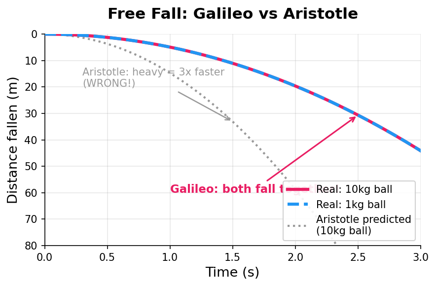
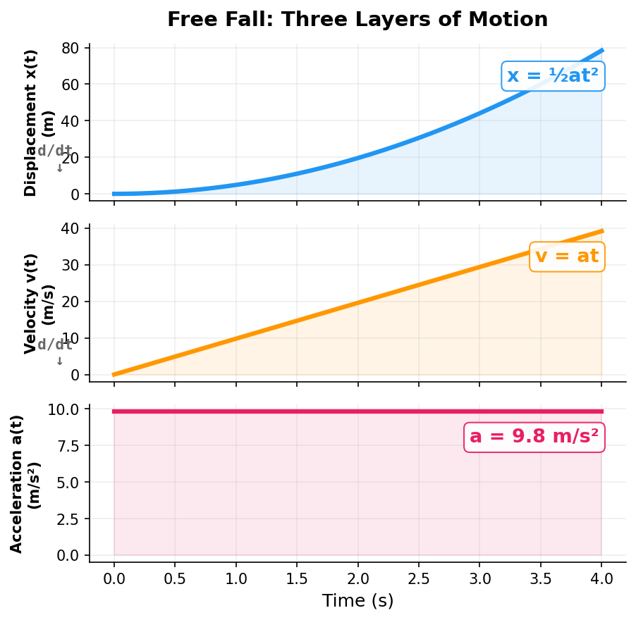
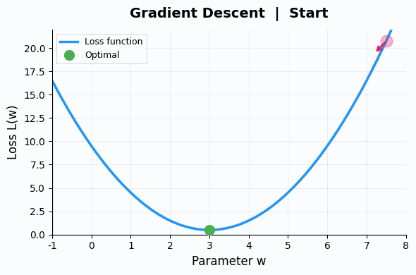

## 写在前面：为什么要写"看见物理"

"看见数学"系列写完之后，有读者留言，问能不能也写一写高中物理。

我想了想——**不但可以，而且必须写。**

因为我在写"看见数学"的过程中，越来越强烈地意识到一件事：AI 里面到处都是物理学。Temperature、Entropy、Momentum、Diffusion、Energy Landscape……这些不是比喻，不是文学修辞——**它们就是物理学的原始概念，被直接搬进了 AI。**

但这个系列不只是为了讲 AI。

**它也是给正在学物理的中学生写的。** 给觉得物理"难"的人写的。给学过但忘了、想重新理解的人写的。

物理课本教你 $v = v_0 + at$，告诉你"匀变速直线运动公式"。但从来没人停下来告诉你：

> **这个公式在说什么？人类为什么需要它？它描述的是世界的哪一面？**

更没人告诉你：

> **你学的这些东西，和今天最前沿的 AI 技术，用的是同一套思想。**

这个系列，就是来补这一课的。

---

### 先祛个魅

你有没有发现，物理学里到处都是"XX力学"这种吓人的名字？

- 经典力学
- 量子力学
- 统计力学
- 热力学
- 电动力学
- 流体力学
- ……

这事要怪牛顿。

1687 年牛顿出版了《自然哲学的数学原理》（Principia），用"力学"（mechanics，源自希腊语 μηχανική，原意是"关于巧妙装置的学问"）建立了一套解释万物运动的体系。这本书太成功了——它让"力学"这个词变成了"严谨的物理学"的代名词。

之后的物理学家们发现了新的分支，也纷纷搬出"力学"来命名自己的领域：研究热的叫"热力学"，研究微观粒子的叫"量子力学"，用统计方法的叫"统计力学"……好像不带上"力学"两个字，就显得不够硬核，不够科学。

**这种"蹭品牌"的行为，在学术界至今屡见不鲜。** 人类在追求真理、保持理性的同时，摆脱不了主观和感性的左右——给自己的学问挂一个响亮的名头，就是一种感性。

**但真理不需要响亮的名头。**

所谓"经典力学"，就是研究**东西怎么动**的学问。

所谓"热力学"，就是研究**热量怎么跑**的学问。

所谓"量子力学"，就是研究**很小很小的东西的行为**的学问。

就这么简单。没有任何一条物理定律是"普通人理解不了"的。它们描述的，都是你每天能看到、能感受到的世界。

### 一个更大的魅要祛：物理学从哪来？

顺便说一件你可能不知道的事——

**"物理学"这个学科，很年轻。"物理学家"这个职业，更年轻。**

在牛顿的时代，根本没有"物理学家"这个词。牛顿给自己的书起的名字是《自然哲学的数学原理》——**自然哲学**（Natural Philosophy），不是"物理学"。

在 19 世纪以前，研究自然的人统一叫做**自然哲学家**（Natural Philosopher）。数学、物理、化学、生物、天文——全都混在"自然哲学"这口大锅里。牛顿研究引力，也研究光学，也研究炼金术；达芬奇画蒙娜丽莎，也解剖尸体，也设计飞行器；亚里士多德同时是物理学家、生物学家、逻辑学家和政治学家——因为在他的时代，这些根本就是**同一个东西**。

```text
古希腊（公元前）：一切学问都叫"哲学"
  ↓
中世纪：研究自然的叫"自然哲学"
  ↓
17世纪：牛顿的巨著叫《自然哲学的数学原理》
  ↓
1833年：William Whewell 才发明了"scientist"（科学家）这个词
  ↓
19世纪末：物理、化学、生物才正式分家

牛顿从来不知道自己是个"物理学家"——
这个词在他死后一百多年才被发明出来。
```

今天我们学物理、学化学、学生物，觉得它们是完全不同的学科。但回到源头，它们都是同一个冲动的产物——**人类想弄明白这个世界是怎么运转的**。

好了，让我们从最简单的问题开始——

**东西为什么会动？**

> **系列导航**
>
> <div style="max-width: 660px; margin: 0.5em 0; font-size: 0.93em; line-height: 1.9;">
> <div style="border-left: 3px solid #FF9800; padding-left: 12px; margin-bottom: 6px; background: rgba(255,152,0,0.05); padding: 8px 12px; border-radius: 0 4px 4px 0;">
> <strong>▸ 第一篇（本文）：运动——世界从"动"开始</strong></div>
> <div style="border-left: 3px solid #ccc; padding-left: 12px; margin-bottom: 6px; padding: 8px 12px; color: #888;">
> ▹ <a href="/ai-blog/posts/see-physics-2-force/" style="color: #888;">第二篇：力——看不见的手</a></div>
> <div style="border-left: 3px solid #ccc; padding-left: 12px; margin-bottom: 6px; padding: 8px 12px; color: #888;">
> ▹ <a href="/ai-blog/posts/see-physics-3-energy/" style="color: #888;">第三篇：能量——不灭的守恒量</a></div>
> <div style="border-left: 3px solid #ccc; padding-left: 12px; padding: 8px 12px; color: #888;">
> ▹ <a href="/ai-blog/posts/see-physics-4-momentum/" style="color: #888;">第四篇：动量——惯性的力量</a></div>
> </div>
>
> 如果你已经读过 [《看见数学》系列](/ai-blog/tags/看见数学/)，会发现物理和数学的关系比你想象的更深——物理提出问题，数学发明工具来回答。

---

## 第一章：两千年的错觉

**公元前 340 年，雅典。**

亚里士多德——古希腊最伟大的思想家，写下了一个"显而易见"的结论：

> "重的东西比轻的东西落得快。"

你觉得呢？一块大石头和一片树叶同时从楼上扔下去，谁先落地？

显然是石头对吧？

**亚里士多德也是这么想的。** 而且全世界的人，跟他想了两千年。

他的理由也很"合理"：重的东西有更强的"趋向自然位置"的倾向，所以下落更快。

这套说法统治了整个西方世界接近 **2000 年**。两千年里，无数聪明人读过这句话，觉得有道理，就接受了。

**没有人去试一下。**

<div style="max-width: 640px; margin: 1.5em auto; padding: 20px; border-radius: 8px; background: rgba(255,152,0,0.06); border: 1px solid rgba(255,152,0,0.2);">

<div style="font-weight: bold; margin-bottom: 12px; color: #FF9800; font-size: 1.05em;">为什么两千年没人质疑？</div>

这件事本身就值得深思。一个错误的结论，为什么能存活两千年？

原因不是古人笨。原因是：

- **日常经验似乎验证了它**——石头确实比树叶落得快（因为空气阻力）
- **权威效应**——亚里士多德说的，谁敢反对？
- **没有"实验"的传统**——古希腊人重视逻辑推理，轻视动手测量

这三条，至今仍在左右我们的思维。你以为的"常识"，有多少是未经验证的"两千年错觉"？

</div>

> **一句话记住：** "显而易见"是思维最危险的陷阱。物理学的第一课：不要相信"看起来对"的东西，要去**测量**。

---

## 第二章：伽利略的转向——从"为什么"到"怎么"

**1589 年，意大利比萨。**

一个 25 岁的数学教授，做了一件两千年来没人做过的事。

传说他从比萨斜塔上同时扔下一个重球和一个轻球。

两个球**几乎同时落地**。

<div style="max-width: 600px; margin: 1.5em auto;">



</div>

比萨斜塔实验是否真的发生过，历史学家至今有争议。但伽利略确实做了大量的**斜面实验**——让球沿着斜面滚下来，精确测量不同时间点的距离。

**这才是真正的革命所在。**

伽利略之前的人都在问：**"东西为什么会动？"** ——为什么石头会落下？因为它要回到"自然位置"。为什么火焰往上飘？因为它的本性是向上。

这些回答听起来有道理，但**什么都没告诉你**。你无法用它们做任何预测。

伽利略换了一个问题：

> **"东西怎么动？"**

不问"为什么落下"。问"**落下的速度是多少？怎么变的？每一秒比上一秒快多少？**"

<div style="max-width: 640px; margin: 1.5em auto; padding: 20px; border-radius: 8px; background: rgba(33,150,243,0.06); border: 1px solid rgba(33,150,243,0.2);">

<div style="font-weight: bold; margin-bottom: 12px; color: #2196F3; font-size: 1.05em;">伽利略的转向</div>

| 亚里士多德的问题 | 伽利略的问题 |
|:---:|:---:|
| **为什么**东西会落下？ | 东西落下时**速度怎么变**？ |
| 因为它有"趋向自然位置"的本性 | 速度每秒增加 9.8 m/s |
| 听起来深刻，但无法验证 | 可以测量、验证、预测 |
| 哲学 | **科学** |

这不是一个"更好的回答"——这是**一种全新的提问方式**。

物理学和哲学，在这一刻分道扬镳。

</div>

> **一句话记住：** 伽利略的革命不是发现了什么新东西。他的革命是：**换了一种提问方式**。从"为什么"到"怎么"——从追问终极原因，到精确描述过程。这就是科学方法的诞生。

---

## 第三章：描述运动的语言——位移、速度、加速度

好了，伽利略说我们不问"为什么"，我们问"怎么动"。

那怎么描述"怎么动"呢？你需要三个词。

**第一个词：位移（在哪）**

位移回答一个问题：**你从哪到哪，移了多远？**

```text
你从家走到学校：
  路程（走了多少路）：1.5 km（拐弯抹角，实际走的路）
  位移（直线距离）：0.8 km 向东北（起点到终点的直线）

位移 ≠ 路程
位移关心的是"结果"，不是"过程"
```

**第二个词：速度（多快）**

速度回答一个问题：**位移变化有多快？**

```text
你走了 0.8 km，用了 10 分钟。

平均速度 = 位移 / 时间 = 0.8 km / 10 min = 4.8 km/h

但你不是每一秒都走这么快。
有时快有时慢。
```

每一个瞬间的速度是多少？这就是**瞬时速度**——你需要把时间间隔取得越来越小，取到无穷小。

等等，"无穷小的时间间隔里的变化量"——这不就是**导数**吗？

没错。速度就是位移对时间的**导数**。

$$v = \frac{dx}{dt}$$

如果你读过[《看见数学（九）：微积分——变化的语言》](/ai-blog/posts/see-math-9-calculus/)，你已经知道导数是什么了。这里你看到了它第一个也是最经典的用途——**描述运动**。

事实上，牛顿发明微积分，就是**为了描述运动**。不是先有微积分，再用到物理——是物理**需要**一种描述变化的语言，微积分才被发明出来。

> **物理提出问题，数学发明工具来回答。** 这是物理和数学关系的核心。

**第三个词：加速度（变化的变化）**

加速度是**最反直觉**的一个。

速度描述的是"位置变化有多快"。

加速度描述的是"**速度变化有多快**"。

```text
一辆车：
  速度大 ≠ 加速度大
  速度变得快 = 加速度大

  时速 200 km/h 匀速巡航的高铁 → 加速度 = 0
  从 0 到 60 的电动车起步瞬间 → 加速度很大

  加速度是速度的导数。
  速度是位移的导数。

  加速度 = 位移的二阶导数。
```

$$a = \frac{dv}{dt} = \frac{d^2x}{dt^2}$$

<div style="max-width: 640px; margin: 1.5em auto; padding: 20px; border-radius: 8px; background: rgba(76,175,80,0.06); border: 1px solid rgba(76,175,80,0.2);">

<div style="font-weight: bold; margin-bottom: 12px; color: #4CAF50; font-size: 1.05em;">三个词的关系</div>

<div style="max-width: 600px; margin: 1.5em auto;">



</div>

</div>

> **一句话记住：** 位移、速度、加速度不是三个独立的概念——它们是**同一个运动的三个层次**，用导数和积分连接。理解了这一点，运动学公式就不用背了，因为它们都是一回事。

---

## 第四章：伽利略的发现——自由落体

好，有了这三个词，我们可以精确描述伽利略发现了什么。

伽利略通过斜面实验发现：一个自由下落的物体（忽略空气阻力），

**加速度是恒定的。**

不管它有多重，不管它已经落了多久——每一秒钟，速度都增加相同的量。

```text
地球上，这个恒定的加速度约为：

  g ≈ 9.8 m/s²

含义：每过 1 秒，下落速度增加 9.8 m/s

  第 0 秒：v = 0 m/s        （从静止开始）
  第 1 秒：v = 9.8 m/s      （约 35 km/h）
  第 2 秒：v = 19.6 m/s     （约 71 km/h）
  第 3 秒：v = 29.4 m/s     （约 106 km/h）
  第 4 秒：v = 39.2 m/s     （约 141 km/h）

4 秒，从 0 加速到 141 km/h。
这就是重力加速度的威力。
```

那课本上那些"匀变速直线运动"的公式呢？

$$v = v_0 + at$$

$$x = v_0 t + \frac{1}{2}at^2$$

**你不需要背这些公式。** 它们全是加速度恒定这一个事实的数学推论。

如果你知道"加速度是速度对时间的导数"，反过来——

- 对加速度 $a$（常数）做积分，得到速度 $v = v_0 + at$
- 对速度再做一次积分，得到位移 $x = v_0 t + \frac{1}{2}at^2$

两个公式，就是两次积分。没有任何神秘的地方。

<div style="max-width: 640px; margin: 1.5em auto; padding: 20px; border-radius: 8px; border: 2px solid #9C27B0; background: rgba(156,39,176,0.04);">

<div style="font-weight: bold; margin-bottom: 12px; font-size: 1.05em; color: #9C27B0;">公式不是从天上掉下来的</div>

```text
已知：加速度 a 是常数

第一次积分：
  ∫a dt = at + C₁     → 速度 v = v₀ + at    ✓

第二次积分：
  ∫(v₀ + at) dt = v₀t + ½at² + C₂
                                    → 位移 x = v₀t + ½at²   ✓

两个公式 = 两次积分。
学了微积分之后，运动学公式全是"算"出来的，不用背。
```

这就是物理和数学的关系：

- **物理**告诉你："加速度是恒定的"（这是实验发现的事实）
- **数学**负责推导出所有公式（这是逻辑的必然结果）

</div>

> **一句话记住：** 物理不需要"背公式"。物理只需要理解**一个核心事实**，然后用数学推出其余一切。如果你在背公式，说明你还没找到那个核心事实。

---

## 第五章：连接 AI——梯度就是"变化的速度"

现在来看一件你可能想不到的事。

**AI 训练模型的核心算法，用的就是"速度"和"加速度"的思想。**

当你训练一个 AI 模型（比如 GPT），本质上在做一件事：

> 找到一组参数，让模型的预测误差（损失函数）尽可能小。

这就像在一片山地里找最低的谷底：

<div style="max-width: 600px; margin: 1.5em auto;">



</div>

怎么找到谷底？最直觉的方法：

**看脚下哪边是下坡，往那边走。**

"脚下哪边是下坡"——这就是**梯度（gradient）**。

梯度是什么？**梯度就是损失函数对参数的导数。**

$$\text{梯度} = \frac{\partial L}{\partial w}$$

把这个和运动学放在一起看：

<div style="max-width: 640px; margin: 1.5em auto; padding: 20px; border-radius: 8px; background: rgba(33,150,243,0.06); border: 1px solid rgba(33,150,243,0.2);">

<div style="font-weight: bold; margin-bottom: 12px; color: #2196F3; font-size: 1.05em;">运动学 vs 梯度下降</div>

| 物理 | AI 训练 |
|:---:|:---:|
| 位置 $x$ | 模型参数 $w$ |
| 速度 $v = dx/dt$ | 参数更新方向 $\Delta w$ |
| 加速度 $a$ | 学习率 × 梯度 |
| 球沿山坡滚下 | 参数沿梯度方向更新 |
| 谷底 = 势能最低点 | 谷底 = 损失最小的参数 |
| 摩擦力让球停下 | 学习率衰减让训练收敛 |

</div>

再看一个更直接的对应。

AI 优化器里有一个著名的技巧叫 **Momentum（动量）**。它的意思是：更新参数时，不只看当前的梯度，还"记住"之前的更新方向，像一个有惯性的球。

```text
没有动量：
  每一步都只看当前的梯度方向
  容易在山谷里来回震荡
  ← → ← → ← →   （走不远）

有动量：
  记住之前在往哪个方向走
  像一个有惯性的球，越滚越有方向
  → → → → → →   （直奔谷底）
```

"动量"这个词不是比喻——它就是从物理学的动量概念直接借过来的。

物理学课本上的 $p = mv$，和 AI 优化器里的 Momentum 参数，描述的是**同一种思想**：惯性让运动更稳定。

> **一句话记住：** AI 训练 = 一个球在损失函数的山地上滚。梯度是"坡度"，Momentum 是"惯性"。你在物理课上学的运动学，正是 AI 工程师每天在用的东西。

---

## 第六章：更深的问题——"动"是绝对的吗？

伽利略还发现了一件比自由落体更深刻的事。

想象你坐在一艘平稳行驶的船上（没有窗户）。你在船舱里扔一个球，球的运动轨迹和你在岸上扔一个球**完全一样**。

**你无法通过任何实验判断自己是"在动"还是"静止"。**

这就是**伽利略相对性原理**——运动是**相对的**。

```text
你坐在火车上，看窗外的树在往后跑。
窗外的人看你在往前跑。

谁在动？

答案：都在动，也都没在动。
取决于你选谁当"参考"。

没有"绝对静止"这回事。
```

这个想法后来被爱因斯坦推到了极致——狭义相对论。但它的种子是伽利略种下的。

这也暗示了一种重要的思维方式：**很多看似"绝对"的东西，其实取决于你的参考系。**

<div style="max-width: 640px; margin: 1.5em auto; padding: 20px; border-radius: 8px; background: rgba(76,175,80,0.06); border-left: 4px solid #4CAF50;">

<p style="margin: 0; font-size: 0.95em; line-height: 1.75; color: #555;"><strong>参考系思维：</strong> 物理学告诉你：没有"客观"的运动，只有"相对于某个参考系"的运动。这种思维方式远远超出物理学本身——在讨论经济增长、个人成长、甚至道德判断时，"你站在什么参考系里？"往往是最关键的问题。</p>

</div>

---

## 第七章：物理学家的故事——伽利略的代价

伽利略不只是一个聪明的科学家。他是一个**用一生与权威对抗的人**。

1633 年，69 岁的伽利略被罗马宗教裁判所传唤。罪名是：宣传"地球围绕太阳转"的日心说。

教会给了他一个选择：要么认错，要么受刑。

伽利略选择了认错。他跪在法庭上，宣读了一份声明：

> "我放弃、诅咒并痛恨上述错误和异端……"

传说他站起来时，低声说了一句：

> **"Eppur si muove."**（但它确实在动。）

<div style="max-width: 640px; margin: 1.5em auto; padding: 20px; border-radius: 8px; background: rgba(255,152,0,0.06); border: 1px solid rgba(255,152,0,0.2);">

<div style="font-weight: bold; margin-bottom: 12px; color: #FF9800; font-size: 1.05em;">这句话可能是后人虚构的</div>

历史学家认为伽利略在法庭上不太可能说出这句话（太危险了）。这句话最早出现在他去世一百多年后的记载中。

但它为什么流传至今？因为它代表了一种精神：

**真理不因为你否认它就不存在。**

地球不会因为权威说它不动，就真的不动。自由落体不会因为亚里士多德说重的快，就真的重的快。

科学的力量不在于科学家有多聪明，在于**科学的方法**——实验、测量、验证——不因任何人的意志而改变结果。

</div>

伽利略被判终身软禁。他在软禁中度过了生命最后的 8 年，双目失明，但仍然在写作。他最伟大的著作《两种新科学的对话》，就是在软禁期间完成的。

1642 年 1 月 8 日，伽利略去世。

同一年的 12 月 25 日，一个婴儿出生在英国一个小村庄里。

他的名字叫**艾萨克·牛顿**。

> 伽利略问了"怎么动"。牛顿将回答"为什么动"。但牛顿的"为什么"和亚里士多德的"为什么"完全不同——它不是哲学猜想，而是**可以精确计算的数学定律**。

这是下一篇的故事。

---

## 本篇小结

<div style="max-width: 660px; margin: 1.5em auto; padding: 20px; border-radius: 8px; border: 2px solid #FF9800; background: rgba(255,152,0,0.04);">

<div style="font-weight: bold; margin-bottom: 12px; font-size: 1.05em;">这篇文章讲了什么？</div>

**一、两千年的错觉**
- 亚里士多德说"重的落得快"，全世界信了 2000 年
- 没人去验证——权威 + "常识" = 最危险的思维陷阱

**二、伽利略的转向**
- 不再问"为什么动"，改问"怎么动"
- 从哲学猜想到精确测量——科学方法的诞生

**三、描述运动的三层语言**
- 位移 → 速度 → 加速度，就是三层导数
- 运动学公式 = 加速度恒定这一个事实的两次积分
- **物理提出问题，数学发明工具来回答**

**四、自由落体**
- 所有物体的重力加速度相同（约 9.8 m/s²）
- 与重量无关——伽利略最反直觉的发现

**五、梯度下降 = 球沿山坡滚**
- AI 训练的核心算法，就是物理学的运动
- 梯度 = 坡度，Momentum = 惯性
- 物理课上学的东西，AI 工程师每天在用

**六、运动是相对的**
- 没有"绝对静止"，只有"相对于参考系的运动"
- 这种思维方式远超物理学本身

</div>

---

## 下一篇预告

伽利略告诉我们"东西怎么动"。但一个更深的问题还没回答：

> **"东西为什么会动？"**

牛顿用三条定律回答了这个问题。而其中最反直觉的一条，不是 F=ma，而是**第一定律**——

一个不受力的物体，不是静止不动的。它会**永远匀速运动下去**。

这颠覆了人类两千年的直觉。它改变了"运动"的含义本身。

下一篇：**看见物理（二）：力——看不见的手**

---

## 动手实验

如果你想亲手"看见"自由落体和梯度下降的关系，可以试试这段代码：

```python
# 纯 Python，零依赖

# ===== 实验 1：模拟自由落体 =====
print("=== 自由落体 ===")
g = 9.8    # 重力加速度 m/s²
v = 0      # 初速度
x = 0      # 初始高度（向下为正）
dt = 0.5   # 时间步长

for step in range(9):
    t = step * dt
    v = g * t                    # v = at（速度 = 加速度 × 时间）
    x = 0.5 * g * t * t          # x = ½at²
    print(f"  t={t:.1f}s  速度={v:5.1f} m/s  下落={x:6.1f} m")

# ===== 实验 2：梯度下降找最低点 =====
print("\n=== 梯度下降 ===")
print("目标：找到 f(x) = (x-3)² 的最低点\n")

x = 10.0           # 从 x=10 开始
lr = 0.1            # 学习率（相当于物理里的"步长"）
momentum = 0.0
beta = 0.9          # 动量系数

for step in range(20):
    # 当前的"海拔"（损失值）
    loss = (x - 3) ** 2
    # 梯度 = 导数 = 2(x-3) = "坡度"
    grad = 2 * (x - 3)
    # 动量更新（像有惯性的球）
    momentum = beta * momentum + grad
    # 沿梯度方向走一步
    x = x - lr * momentum

    if step % 3 == 0 or step == 19:
        bar = "█" * int(loss / 2) if loss > 0.5 else "▎"
        print(f"  第{step+1:2d}步  x={x:.4f}  损失={loss:.4f}  {bar}")

print(f"\n  最终 x={x:.4f}（最优解是 3.0）")
print(f"  梯度下降 = 一个有动量的球在抛物线上滚到谷底")
```

运行之后你会看到：自由落体是加速度恒定的运动，梯度下降是"球在损失函数上滚"——**同一套思想，两个世界**。

---

## 延伸阅读

想更深入了解本篇内容？推荐以下资料：

- **《两种新科学的对话》** ——伽利略，物理学的奠基之作。用对话体写成，400 年后读起来仍然清晰有趣
- **Feynman Lectures on Physics, Vol. 1, Ch. 8: Motion** ——费曼讲物理，运动学章节，大师级的直觉讲解
- **3Blue1Brown："微积分的本质"系列** ——YouTube/B 站均有，用动画展示导数与运动的关系

---

<div style="margin-top: 30px; padding-top: 20px; border-top: 1px solid #e0e0e0; font-size: 0.9em; color: #888; line-height: 1.8;">

**《看见物理》系列** — 从运动到世界模型，看见物理之美。<br>
本文首发于「AI 学习笔记」博客：https://Jason-Azure.github.io/ai-blog/<br>
微信公众号：AI-lab学习笔记<br>
系列文章完整列表见 [标签：看见物理](/ai-blog/tags/看见物理/)

</div>
