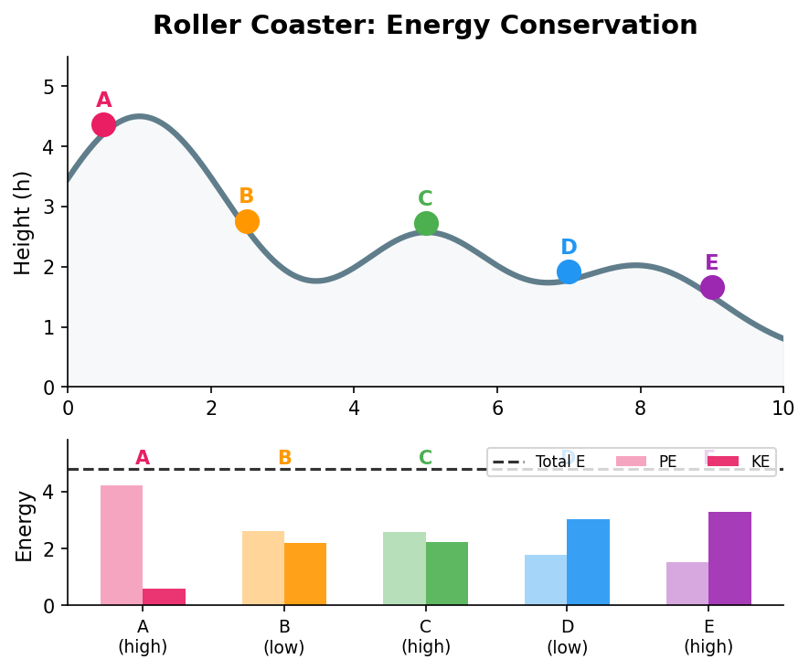
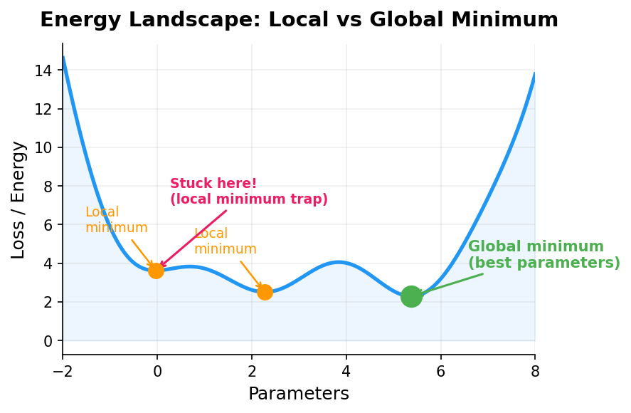
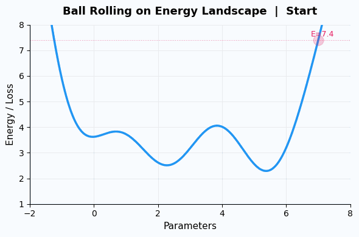

## 上一篇回顾

牛顿用 F=ma 统一了天上地下一切运动。给定力的公式和初始条件，就能预测物体的整个未来。

但我们留了一个问题：**力太复杂了。**

一个系统里有很多物体，它们之间相互作用，力的方向和大小时刻在变——直接用 F=ma 去算，有时候难得令人绝望。

有没有一种方法，可以**不管力的细节**，直接从更高的角度描述运动？

有。这个方法叫做**能量**。

> **系列导航**
>
> <div style="max-width: 660px; margin: 0.5em 0; font-size: 0.93em; line-height: 1.9;">
> <div style="border-left: 3px solid #ccc; padding-left: 12px; margin-bottom: 6px; padding: 8px 12px; color: #888;">
> ▹ <a href="/ai-blog/posts/see-physics-1-motion/" style="color: #888;">第一篇：运动——世界从"动"开始</a></div>
> <div style="border-left: 3px solid #ccc; padding-left: 12px; margin-bottom: 6px; padding: 8px 12px; color: #888;">
> ▹ <a href="/ai-blog/posts/see-physics-2-force/" style="color: #888;">第二篇：力——看不见的手</a></div>
> <div style="border-left: 3px solid #FF9800; padding-left: 12px; margin-bottom: 6px; background: rgba(255,152,0,0.05); padding: 8px 12px; border-radius: 0 4px 4px 0;">
> <strong>▸ 第三篇（本文）：能量——不灭的守恒量</strong></div>
> <div style="border-left: 3px solid #ccc; padding-left: 12px; padding: 8px 12px; color: #888;">
> ▹ <a href="/ai-blog/posts/see-physics-4-momentum/" style="color: #888;">第四篇：动量——惯性的力量</a></div>
> </div>

---

## 第一章：宇宙正在走向死亡吗？

太阳每秒烧掉 400 万吨物质。银河系里有上千亿颗恒星在做同样的事。

迟早，它们都会烧完。

到那时候——没有光，没有热，没有任何运动。一片永恒的、漆黑的、冰冷的虚无。

**这是宇宙的结局吗？**

物理学家管这叫"热寂"（heat death）。它是不是真的会发生，取决于一个看似简单的问题：

**有没有一种"东西"，它永远不会消失，也永远不会凭空出现？**

这个问题困扰了物理学家两百多年。

1840 年代，几个人几乎同时想通了：

- 德国医生迈尔（Julius Robert von Mayer），在给水手放血时发现热带地区的静脉血更红——人体在热带需要的热量更少，但**能量没有消失，只是换了形式**
- 英国啤酒商焦耳（James Prescott Joule），在自家酒厂反复做实验，精确测量了机械运动怎么变成热量
- 德国物理学家亥姆霍兹（Hermann von Helmholtz），用数学证明了这一切

他们各自独立发现了同一件事：

> **能量不会凭空消失，也不会凭空产生。它只会从一种形式变成另一种形式。**

这就是**能量守恒定律**——整个物理学最基本的定律之一。

<div style="max-width: 640px; margin: 1.5em auto; padding: 20px; border-radius: 8px; background: rgba(255,152,0,0.06); border: 1px solid rgba(255,152,0,0.2);">

<div style="font-weight: bold; margin-bottom: 12px; color: #FF9800; font-size: 1.05em;">一个医生、一个啤酒商、一个物理学家</div>

发现能量守恒的三个人，背景完全不同。这件事本身就说明：**自然界的真理不在乎你的身份。** 只要你认真观察、仔细测量，不管你是医生还是商人，真理都会向你展示同样的答案。

这和上一篇说的一样：**方法比人重要。**

</div>

> **一句话记住：** 宇宙中有一种"东西"，它能变换形态，但总量永远不变。这个东西叫能量。

---

## 第二章：能量的两副面孔——动能和势能

能量有很多种形式：热能、光能、化学能、核能……但在力学里，最基本的只有两种：

**动能：运动的能量**

一个运动的物体拥有动能。它的公式是：

$$E_k = \frac{1}{2}mv^2$$

翻译成人话：**越重、越快的东西，动能越大。**

```text
一辆静止的车：动能 = 0
同一辆车以 60 km/h 行驶：动能 = ½mv²
同一辆车以 120 km/h 行驶：动能 = ½m(2v)² = 4 × ½mv²

速度翻倍 → 动能变为 4 倍（不是 2 倍！）

这就是为什么高速公路上的交通事故比城市道路严重得多。
时速 120 的撞击能量是时速 60 的 4 倍，不是 2 倍。
```

**势能：位置的能量**

一个被举高的物体拥有重力势能。它的公式是：

$$E_p = mgh$$

翻译成人话：**越重、越高的东西，势能越大。**

```text
桌子上的一杯水：有势能（相对于地面）
水掉到地上：势能变成了动能
水溅开、静止：动能变成了热能（水和地面都微微变热了）

能量没有消失。只是换了马甲。
```

---

## 第三章：过山车——能量守恒的完美演示

理解能量守恒最直觉的方式：**想象一辆过山车。**

<div style="max-width: 600px; margin: 1.5em auto;">



</div>

过山车从最高点 A 出发，不需要任何发动机——重力就够了。

```text
位置 A（最高点）：
  势能 = 最大（因为最高）
  动能 = 最小（速度最慢）
  总能量 = 势能 + 动能

位置 D（最低点）：
  势能 = 最小（因为最低）
  动能 = 最大（速度最快）
  总能量 = 势能 + 动能   ← 和 A 一样！

一路上：
  势能减少多少 → 动能就增加多少
  势能增加多少 → 动能就减少多少
  总能量始终不变
```

**你不需要知道力的方向、大小、怎么变化。你只需要知道：总能量不变。**

这就是能量方法的威力——它**绕过了力的细节**，直接告诉你结果。

<div style="max-width: 640px; margin: 1.5em auto; padding: 20px; border-radius: 8px; background: rgba(33,150,243,0.06); border: 1px solid rgba(33,150,243,0.2);">

<div style="font-weight: bold; margin-bottom: 12px; color: #2196F3; font-size: 1.05em;">F=ma vs 能量守恒</div>

| 方法 | 做法 | 优点 | 缺点 |
|:---:|:---:|:---:|:---:|
| **F=ma** | 分析每一个力，列方程，解微分方程 | 给出完整轨迹（每个时刻的位置和速度） | 力复杂时几乎无法计算 |
| **能量守恒** | 只看初态和终态，列能量方程 | 简单粗暴，直接出结果 | 只告诉你"最终状态"，不告诉你"路上经历了什么" |

两种方法不是竞争关系——它们是**同一个物理学的两种视角**。

就像看一座山，你可以从山脚一步一步爬（F=ma），也可以坐缆车直接看山顶和山脚的高度差（能量守恒）。答案是一样的，只是走的路不同。

</div>

> **一句话记住：** 能量守恒让你不用管过程，只看结果。这不是"偷懒"，而是一种**更高层次的理解**：当你找到了不变量，过程中的细节就变得不重要了。

---

## 第四章：为什么能量守恒如此特别？

你可能觉得：能量守恒不就是"总量不变"吗？有什么了不起的？

它的了不起之处，不在于"总量不变"这个事实，而在于这个事实背后的**哲学含义**：

**在一个不断变化的世界里，存在一个永远不变的量。**

想想这有多惊人。

宇宙里的一切都在变：星星在燃烧，河流在流淌，生物在生死循环，你的身体每秒有数百万个细胞在死亡和诞生——

但有一个数字，从宇宙大爆炸到今天，**从来没有变过**。

这就是能量。

<div style="max-width: 640px; margin: 1.5em auto; padding: 20px; border-radius: 8px; border: 2px solid #9C27B0; background: rgba(156,39,176,0.04);">

<div style="font-weight: bold; margin-bottom: 12px; font-size: 1.05em; color: #9C27B0;">守恒量——变化中的锚点</div>

物理学最深刻的追求之一，就是在变化中找到不变量。

- 能量守恒——不管发生什么，总能量不变
- 动量守恒——不管怎么碰撞，总动量不变（下一篇讲）
- 电荷守恒——不管怎么反应，总电荷不变
- 角动量守恒——花样滑冰选手收紧手臂就转得更快

每一个守恒量，都是你理解宇宙的一个**锚点**。世界在变，但这些数字不变。抓住了它们，你就抓住了混乱中的秩序。

这种思维方式远超物理学：

- 会计查账：不管钱怎么转，总额不变 → 如果变了，就是有人做假账
- 化学反应：不管怎么反应，原子种类和数量不变
- 编程调试：不管程序怎么跑，某些量应该保持不变（不变量/invariant）——如果变了，就是有 bug

</div>

> **一句话记住：** 能量守恒的深意不是"能量不会消失"。它的深意是：**在一个一切都在变的宇宙里，物理学找到了永远不变的东西。** 找到不变量，就是找到了理解世界的钥匙。

---

## 第五章：连接 AI——损失函数就是能量景观

现在来到最精彩的连接。

上一篇我们说过：AI 训练就像"球沿山坡滚到谷底"。

现在你学了能量，就能更精确地理解这句话了：

**AI 的损失函数，就是一个"能量景观"。训练的过程，就是在这个能量景观上寻找能量最低的点。**

<div style="max-width: 600px; margin: 1.5em auto;">



</div>

```text
物理                          AI
━━━━━━━━━━━━━━━━━━━━━━━━━━━━━━━━━━━━━━━
势能 E(x)                     损失函数 L(w)
位置 x                        模型参数 w
势能最低点                     损失最小 = 最优模型
球沿山坡滚下                   梯度下降
球被卡在小坑里                 陷入局部最小值
给球一个推力让它跳出小坑       加随机扰动 / 提高学习率
```

<div style="max-width: 600px; margin: 1.5em auto;">



</div>

这里有一个物理学给 AI 的直接启发：**局部最小值问题**。

过山车在一个小山谷里会停下来——即使远处有更深的山谷。物理上，球被"困"在了势能阱里。

AI 训练也一样：梯度下降可能找到一个"还不错"的参数（局部最小值），但不是"最好"的参数（全局最小值）。

怎么逃出局部最小值？物理给出了直觉：

```text
物理的方法：给球加点能量（推一下），让它跳出小坑
  → AI 的做法：加随机噪声（stochastic gradient descent）
  → 或者：先用大学习率"震荡"，再慢慢减小
  → 这个思想直接来自物理学的"模拟退火"（simulated annealing）

模拟退火：
  先加热（高温 → 粒子乱跑 → 探索整个景观）
  再冷却（低温 → 粒子冻住 → 定型在最低点附近）

和 AI 的训练策略一模一样：
  先用大学习率（大步探索）
  再用小学习率（精细收敛）
```

<div style="max-width: 640px; margin: 1.5em auto; padding: 20px; border-radius: 8px; background: rgba(76,175,80,0.06); border-left: 4px solid #4CAF50;">

<p style="margin: 0; font-size: 0.95em; line-height: 1.75; color: #555;"><strong>Hopfield 网络——物理学家发明的神经网络：</strong> 2024 年诺贝尔物理学奖颁给了 John Hopfield 和 Geoffrey Hinton。Hopfield 在 1982 年发明了 Hopfield 网络——他直接把物理学的"能量函数"搬到了神经网络里。网络的每个状态对应一个"能量"，学习的过程就是让网络滚到能量最低的状态。<br><br>这不是比喻。Hopfield 网络的数学和物理学的自旋玻璃模型<strong>完全相同</strong>。诺贝尔物理学奖委员会因此认定：神经网络是物理学的分支成果。</p>

</div>

> **一句话记住：** AI 的损失函数 = 物理的能量景观。训练 = 找能量最低点。局部最小值 = 势能阱。模拟退火 = 先加热探索，再冷却定型。物理学不只是 AI 的灵感来源——它是 AI 的数学基础。

---

## 第六章：能量守恒的背后——一个更深的秘密

读到这里，你可能会问：能量守恒"就是这样"吗？它是一条碰巧成立的经验规律，还是有更深层的原因？

1918 年，一位女数学家证明了一个定理。这个定理说：

**能量守恒不是巧合。它成立，是因为宇宙有一种特殊的对称性。**

什么对称性？哪位数学家？这个定理为什么被称为"理论物理学最美的定理"？

这些问题，我们留给下一篇。在那里，你将看到：动量守恒、能量守恒、角动量守恒——这三条看似独立的定律，其实是**同一个原理的三个表现**。

> **一句话记住：** 能量守恒不是"刚好如此"。它的背后有一个更深的原因——下一篇揭晓。

---

## 本篇小结

<div style="max-width: 660px; margin: 1.5em auto; padding: 20px; border-radius: 8px; border: 2px solid #FF9800; background: rgba(255,152,0,0.04);">

<div style="font-weight: bold; margin-bottom: 12px; font-size: 1.05em;">这篇文章讲了什么？</div>

**一、宇宙正在走向死亡吗？**
- 太阳在燃烧，恒星在消亡——但有一个"东西"永远不会消失
- 一个医生、一个啤酒商、一个物理学家各自独立发现了它

**二、动能和势能——运动的能量 vs 位置的能量**
- 动能 = ½mv²，速度翻倍 → 能量变 4 倍
- 势能 = mgh，高度越高 → 势能越大
- 两者可以互相转化，总和不变

**三、过山车——能量方法的威力**
- 不用分析力的细节，只看初态和终态
- 能量守恒和 F=ma 是同一个物理学的两种视角

**四、守恒量——变化世界中的锚点**
- 能量守恒的深意：在一切都在变的宇宙里，找到了不变的东西
- 这种思维方式远超物理学

**五、损失函数 = 能量景观**
- AI 训练 = 在能量景观上寻找最低点
- 局部最小值 = 势能阱，模拟退火 = 先加热再冷却
- 2024 诺贝尔奖：Hopfield 网络的数学 = 物理的自旋玻璃模型

**六、能量守恒的背后——悬念**
- 能量守恒不是巧合，它背后有一个更深的原因
- 下一篇揭晓：对称性 → 守恒律

</div>

---

## 下一篇预告

上面我们留了一个悬念：能量守恒不是巧合——它背后有一个更深的原因。

下一篇，我们将揭晓这个原因。一位被纳粹驱逐、被大学拒绝的女数学家，证明了物理学最美的定理：**每一条守恒律，都对应宇宙的一种对称性。**

同时，我们将认识另一个守恒量——**动量**。它在碰撞中比能量更可靠：即使能量变成了热和声音，动量也一焦耳都不会少。

而在 AI 优化器里，**Momentum**（动量）是一个关键参数。它让参数更新有了"惯性"，不会被每一步的噪声带跑。这个名字不是比喻——它就是物理动量的直接移植。

下一篇：**[看见物理（四）：动量——惯性的力量](/ai-blog/posts/see-physics-4-momentum/)**

---

## 动手实验

亲手体验"能量守恒"和"在能量景观上寻找最低点"：

```python
# 纯 Python，零依赖
import math

# ===== 实验 1：过山车能量守恒 =====
print("=== 过山车能量守恒 ===\n")

g = 9.8
m = 1.0  # 质量 1 kg

heights = [10, 6, 8, 3, 5]  # 轨道上 5 个位置的高度（米）
labels  = ['A', 'B', 'C', 'D', 'E']
total_E = m * g * heights[0]  # 从最高点静止出发

for h, label in zip(heights, labels):
    PE = m * g * h
    KE = total_E - PE
    v = math.sqrt(2 * KE / m) if KE > 0 else 0
    print(f"  位置 {label}: 高度={h:4.1f}m  势能={PE:5.1f}J  "
          f"动能={KE:5.1f}J  速度={v:4.1f}m/s  "
          f"总能量={PE+KE:5.1f}J")

print(f"\n  总能量始终 = {total_E:.1f}J，一焦耳都没少！")

# ===== 实验 2：在能量景观上寻找最低点 =====
print("\n=== 能量景观上的梯度下降 ===")
print("能量函数有多个山谷（局部最小值）\n")

def energy(x):
    """一个有多个谷底的能量景观"""
    return 0.05*(x-1)**2 * (x-5)**2 + 0.8*math.sin(2*x) + 3

def gradient(x):
    dx = 0.0001
    return (energy(x+dx) - energy(x-dx)) / (2*dx)

# 从不同起点出发，看看会落入哪个谷底
for start in [0.0, 3.0, 7.0]:
    x = start
    lr = 0.05
    for step in range(200):
        grad = gradient(x)
        x = x - lr * grad

    print(f"  起点 x={start:.1f} → 最终 x={x:.2f}, "
          f"能量={energy(x):.3f}  "
          f"{'← 全局最低！' if energy(x) < 2.5 else '← 局部最小值（被困住了）'}")

print(f"\n  不同起点 → 不同谷底。")
print(f"  这就是AI训练的核心难题：怎么避免被困在局部最小值。")
```

---

## 延伸阅读

- **Feynman Lectures on Physics, Vol. 1, Ch. 4: Conservation of Energy** ——费曼用"丹尼斯和他妈妈的积木"比喻讲能量守恒，经典中的经典
- **《时间简史》** ——霍金，能量守恒与宇宙起源的关系
- **Emmy Noether 的故事** ——数学家中的传奇，值得每个学生了解
- **Hopfield, 1982, "Neural networks and physical systems with emergent collective computational abilities"** ——物理学家发明神经网络的原始论文

---

<div style="margin-top: 30px; padding-top: 20px; border-top: 1px solid #e0e0e0; font-size: 0.9em; color: #888; line-height: 1.8;">

**《看见物理》系列** — 从运动到世界模型，看见物理之美。<br>
本文首发于「AI 学习笔记」博客：https://Jason-Azure.github.io/ai-blog/<br>
微信公众号：AI-lab学习笔记<br>
系列文章完整列表见 [标签：看见物理](/ai-blog/tags/看见物理/)

</div>
