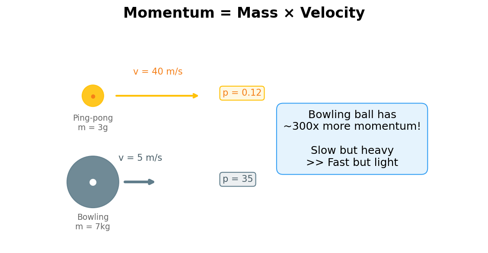
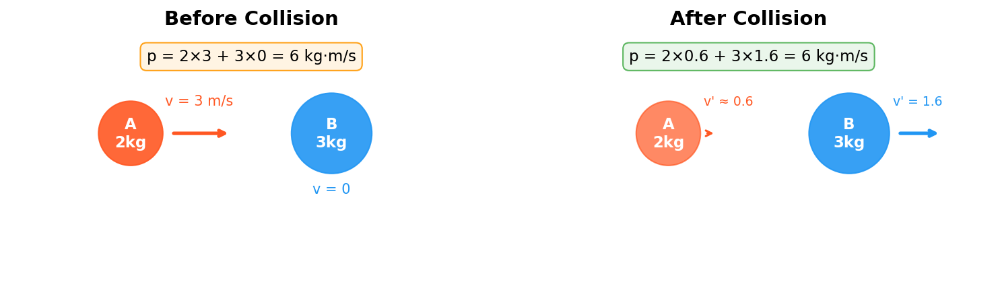
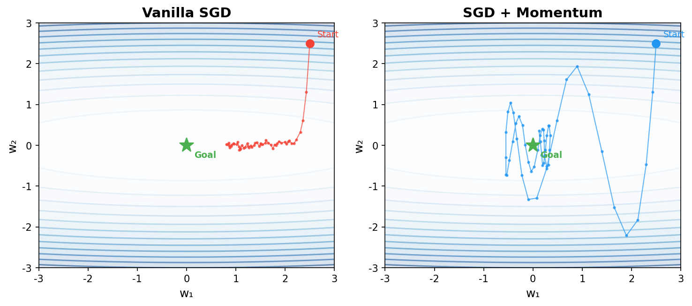

## 上一篇回顾

能量守恒告诉我们：在一个不断变化的世界里，存在一个永远不变的量。

我们用能量的视角重新理解了 AI 训练——损失函数就是能量景观，训练就是在能量景观上寻找最低点。

但我们留了两个钩子：

- **还有另一个守恒量，在很多场景下比能量更好用。** 它就是**动量**。
- **能量守恒不是巧合——它背后有一个更深的原因。** 这一篇揭晓。

> **系列导航**
>
> <div style="max-width: 660px; margin: 0.5em 0; font-size: 0.93em; line-height: 1.9;">
> <div style="border-left: 3px solid #ccc; padding-left: 12px; margin-bottom: 6px; padding: 8px 12px; color: #888;">
> ▹ <a href="/ai-blog/posts/see-physics-1-motion/" style="color: #888;">第一篇：运动——世界从"动"开始</a></div>
> <div style="border-left: 3px solid #ccc; padding-left: 12px; margin-bottom: 6px; padding: 8px 12px; color: #888;">
> ▹ <a href="/ai-blog/posts/see-physics-2-force/" style="color: #888;">第二篇：力——看不见的手</a></div>
> <div style="border-left: 3px solid #ccc; padding-left: 12px; margin-bottom: 6px; padding: 8px 12px; color: #888;">
> ▹ <a href="/ai-blog/posts/see-physics-3-energy/" style="color: #888;">第三篇：能量——不灭的守恒量</a></div>
> <div style="border-left: 3px solid #FF9800; padding-left: 12px; margin-bottom: 6px; background: rgba(255,152,0,0.05); padding: 8px 12px; border-radius: 0 4px 4px 0;">
> <strong>▸ 第四篇（本文）：动量——惯性的力量</strong></div>
> <div style="border-left: 3px solid #ccc; padding-left: 12px; padding: 8px 12px; color: #888;">
> ▹ 第五篇：热与分子——承认无知（即将发布）</div>
> </div>

---

## 第一章：碰撞——物理学最古老的实验

先给你一个让人头皮发麻的事实：

**你每走一步，地球都在向反方向微微移动。**

这不是比喻。你的脚蹬地面向前走，根据牛顿第三定律，地面也在推你。但反过来——你也在推地球。你向前走一步，地球就向后退一点。

只是地球的质量是你的 10²³ 倍。所以地球被你推动的距离，大约是一个原子核直径的十亿分之一。

**但它确实动了。**

这个事实背后的原理，就是今天要讲的——**动量守恒**。

---

现在来看一个更日常的场景。

你在台球桌上，白球撞上了红球。白球停了，红球飞走了。

**白球的"运动"去哪了？**

上一篇你已经知道了——能量守恒。白球的动能传给了红球。

但这里有个微妙的问题：能量只告诉你"总量不变"，**它不告诉你方向。**

想象两辆一模一样的车迎面相撞，速度相同。碰撞后两辆车都停了。

```text
碰撞前：车 A → 60 km/h    车 B ← 60 km/h
碰撞后：车 A 停             车 B 停

动能去哪了？变成了热、声音、车身变形。
能量守恒？✓（动能 → 热能 + 声能 + 变形能）

但还有一个量也守恒了——而且它告诉你更多信息。
```

这个量就是**动量**（momentum）。

> **一句话记住：** 能量只告诉你"总量不变"。动量不仅告诉你"总量不变"，还告诉你**方向**。

---

## 第二章：动量——质量乘以速度

动量的定义极其简单：

$$p = mv$$

翻译成人话：**动量 = 质量 × 速度。**

但注意——速度是有方向的（物理学里叫"矢量"），所以**动量也有方向**。

<div style="max-width: 600px; margin: 1.5em auto;">



</div>

```text
一个乒乓球（3 克）以 40 m/s 飞过来：
  动量 = 0.003 × 40 = 0.12 kg·m/s
  → 你用手一挡就停了

一个保龄球（7 公斤）以 5 m/s 滚过来：
  动量 = 7 × 5 = 35 kg·m/s
  → 你挡不住，手会被砸

保龄球的速度是乒乓球的 1/8，但动量是乒乓球的 300 倍。

动量 = 质量 × 速度。重的东西，即使慢，动量也大。
这就是"惯性的力量"——重的东西很难停下来。
```

<div style="max-width: 640px; margin: 1.5em auto; padding: 20px; border-radius: 8px; background: rgba(255,152,0,0.06); border: 1px solid rgba(255,152,0,0.2);">

<div style="font-weight: bold; margin-bottom: 12px; color: #FF9800; font-size: 1.05em;">动量 vs 动能：不一样的守恒</div>

| | 动量 p = mv | 动能 E = ½mv² |
|:---:|:---:|:---:|
| **有没有方向？** | 有（矢量） | 没有（标量） |
| **碰撞中守恒？** | 总是守恒 | 不一定（可以变成热） |
| **速度的权重** | 线性（v） | 平方（v²） |

**一个惊人的事实：** 在碰撞中，动能可能损失（变成热和声音），但**动量永远不会损失**。

这就是为什么动量在很多场景下比能量更有用。

</div>

---

## 第三章：动量守恒——碰撞中不变的量

**动量守恒定律**说的是：

> **如果没有外力作用，一个系统的总动量永远不变。**

<div style="max-width: 600px; margin: 1.5em auto;">



</div>

来看最经典的例子——两球碰撞：

```text
碰撞前：
  球 A：m=2kg, v=3m/s →    动量 = 2×3 = +6
  球 B：m=3kg, v=0          动量 = 3×0 = 0
  总动量 = 6 kg·m/s

碰撞后：
  球 A 减速，球 B 被撞飞
  不管怎么撞——弹性碰撞、非弹性碰撞、完全粘在一起——
  总动量 = 6 kg·m/s    ← 一点都没变！

碰撞中能量可能损失（变成热和声音），但动量不会。
```

再看一个更有趣的例子——**火箭发射**：

```text
火箭怎么在真空中前进？没有空气可以"推"。

答案：动量守恒。

发射前：总动量 = 0（火箭静止）
发射后：
  燃气高速向后喷出 → 动量向后
  火箭必须向前飞   → 动量向前
  总动量 = 0        ← 还是零！

火箭不是"推空气"前进的。
它是把一部分质量（燃气）高速向后扔出去，
自己获得了等量的、向前的动量。

这和你站在冰面上扔保龄球完全一样——
你扔球向前，你自己就会向后滑。
```

> **一句话记住：** 动量守恒不需要"碰到什么东西"。只要没有外力，不管内部发生什么（碰撞、爆炸、分裂），总动量不变。

<div style="max-width: 640px; margin: 1.5em auto; padding: 20px; border-radius: 8px; background: rgba(76,175,80,0.06); border-left: 4px solid #4CAF50;">

<p style="margin: 0; font-size: 0.95em; line-height: 1.75; color: #555;"><strong>牛顿摆——为什么只弹起一个球？</strong></p>

<p style="margin: 0.5em 0 0 0; font-size: 0.95em; line-height: 1.75; color: #555;">办公桌上常见的「牛顿摆」：五个钢球排成一排，拉起一个球松手，撞击后只有另一端的一个球弹起。为什么不是两个球以一半的速度弹起？</p>

<p style="margin: 0.5em 0 0 0; font-size: 0.95em; line-height: 1.75; color: #555;">因为<strong>必须同时满足动量守恒和能量守恒</strong>。</p>

<p style="margin: 0.5em 0 0 0; font-size: 0.95em; line-height: 1.75; color: #555;">如果两个球以一半速度弹起：动量 = 2m × v/2 = mv ✓ 但动能 = 2 × ½m(v/2)² = ¼mv² ✗（只有原来的一半！能量不守恒）</p>

<p style="margin: 0.5em 0 0 0; font-size: 0.95em; line-height: 1.75; color: #555;">唯一同时满足两个守恒律的解：一个球以原速弹起。动量和能量缺一不可——它们联手决定了碰撞的结局。</p>

</div>

---

## 第四章：为什么动量守恒？——诺特定理揭晓

上一篇我们留了一个悬念：能量守恒不是巧合，它背后有一个更深的原因。

现在是揭晓的时刻。

1918 年，女数学家 Emmy Noether（艾米·诺特）证明了一个定理，它被称为**理论物理学最美的定理**：

> **每一条守恒律，都对应一种对称性。**

什么意思？

```text
时间对称性 → 能量守恒
  （物理规律今天适用，明天也适用 → 能量守恒）

空间对称性 → 动量守恒
  （物理规律在这里适用，在那里也适用 → 动量守恒）

旋转对称性 → 角动量守恒
  （物理规律不管朝哪个方向都一样 → 角动量守恒）
```

**这不是三条独立的定律。它们是同一个原理（诺特定理）的三个表现。**

想想这有多震撼。能量守恒成立，不是因为"碰巧如此"——**而是因为宇宙的物理定律不随时间改变**。如果明天的物理定律和今天不一样，能量就不守恒了。

同样，动量守恒成立，是因为**物理定律不因地点而异**。在北京做实验和在纽约做实验，物理定律一模一样。这件事看起来理所当然，但它的数学后果是：动量守恒。

```text
想象一下：如果宇宙的物理定律在不同地方是不同的——

在客厅里 F=ma
在厨房里 F=2ma
在卧室里 F=0.5ma

那你从客厅推一个球到厨房，球的行为就会突然改变。
动量就不守恒了。

但物理定律不会因为你换了个房间而改变。
在地球上 F=ma，在火星上也是 F=ma。
在银河系这头和那头，物理定律一模一样。

这种空间的均匀性 → 动量守恒。
```

<div style="max-width: 640px; margin: 1.5em auto; padding: 20px; border-radius: 8px; border: 2px solid #9C27B0; background: rgba(156,39,176,0.04);">

<div style="font-weight: bold; margin-bottom: 12px; font-size: 1.05em; color: #9C27B0;">对称性 → 守恒律：物理学最深刻的联系</div>

```text
时间对称性（今天 = 明天）     → 能量守恒
空间对称性（这里 = 那里）     → 动量守恒
旋转对称性（这个方向 = 那个方向） → 角动量守恒
```

守恒律不是"凑巧成立"的经验。它们成立，是因为**宇宙有对称性**。

如果某天我们发现某个守恒律被打破了——那意味着宇宙的某种对称性被打破了。这将是物理学的地震。

</div>

<div style="max-width: 640px; margin: 1.5em auto; padding: 20px; border-radius: 8px; background: rgba(255,152,0,0.06); border: 1px solid rgba(255,152,0,0.2);">

<div style="font-weight: bold; margin-bottom: 12px; color: #FF9800; font-size: 1.05em;">Emmy Noether 的故事</div>

诺特是 20 世纪最伟大的数学家之一，但因为是女性，她在哥廷根大学长期不能获得正式教职。希尔伯特（当时最著名的数学家）愤怒地说："我不明白候选人的性别怎么能成为反对她成为教授的理由。毕竟，这是大学，不是澡堂。"

她最终还是被纳粹驱逐到了美国。1935 年去世时只有 53 岁。

爱因斯坦在她的讣告中写道："诺特是自女性接受高等教育以来，最重要的有创造力的数学天才。"

一个被大学拒绝、被国家驱逐的人，证明了物理学最美的定理。

</div>

> **一句话记住：** 守恒律不是"刚好如此"的经验总结。每一条守恒律的背后，都是宇宙的一种对称性。能量守恒 ← 时间对称，动量守恒 ← 空间对称。这是物理学最深层的美。

---

## 第五章：连接 AI——Momentum 优化器

现在来到最精彩的连接。

AI 训练中，最基本的优化算法是**梯度下降**（SGD）。但纯粹的梯度下降有一个大问题：

**它没有"记忆"——每一步只看当前这一步的梯度。**

想象你在一个窄长的峡谷里找出路。纯 SGD 就像一个失忆的人：每一步只看脚下最陡的方向，然后迈一步。结果他在峡谷两壁之间来回弹跳，却沿峡谷方向前进得极慢。

怎么解决？物理学家给了答案：**给它加上动量。**

<div style="max-width: 600px; margin: 1.5em auto;">



</div>

核心直觉只需要一句话：

> **一个重的保龄球沿峡谷滚动时，不会被路上的小坑带偏。因为它有惯性——过去的运动会延续。**

这就是 Momentum 优化器的全部精髓。它"记住"了过去的方向，不会被单步的噪声和随机波动牵着鼻子走。

```text
普通 SGD：     每一步只看当前梯度 → 容易被噪声带偏
Momentum SGD： 每一步 = 90% 的历史方向 + 10% 的当前梯度
               → 方向稳定，不来回弹跳

就像保龄球 vs 乒乓球：
保龄球沿峡谷稳稳滚到终点（Momentum）
乒乓球在峡谷里乱飞（纯 SGD）
```

**效果是什么？**

- **在峡谷里不再来回弹跳：** 横向的震荡互相抵消，纵向的前进持续积累——像一个重球沿峡谷方向稳定滚动
- **不容易被噪声带偏：** 单步噪声只占很小的权重，历史动量占了大头——小干扰影响不大

<div style="max-width: 640px; margin: 1.5em auto; padding: 20px; border-radius: 8px; background: rgba(33,150,243,0.06); border: 1px solid rgba(33,150,243,0.2);">

<div style="font-weight: bold; margin-bottom: 12px; color: #2196F3; font-size: 1.05em;">从 Momentum 到 Adam——AI 优化的进化</div>

物理动量给了 AI 优化的第一次飞跃。但故事没有结束：

```text
SGD                → 每步只看当前梯度（失忆的人）
SGD + Momentum     → 加上"惯性"（记住过去的方向）
Adam (2014)        → 动量 + 自适应学习率（聪明的保龄球）
```

Adam 不仅记住了方向（像 Momentum），还会自动调整步幅：路平坦的地方迈大步，路颠簸的地方迈小步。它的名字来自 "Adaptive Moment Estimation"——"moment"就是物理学里的"矩"。

Adam 论文（Kingma & Ba, 2014）至今被引用超过 20 万次，是深度学习领域被引用最多的论文之一。它的核心思想——**用动量来稳定优化过程**——直接来自物理学。

公式细节？留给动手实验部分，你可以亲手跑一遍 SGD 和 Momentum 的对比。

</div>

> **一句话记住：** AI 优化器里的 Momentum 不是比喻。它就是物理动量的直接移植：重的球不容易被小坑带偏。从 SGD 到 Momentum 到 Adam，物理学的动量概念贯穿始终。

---

## 第六章：惠更斯和莱布尼茨——一场争了半个世纪的辩论

在收官之前，讲一个串联第三篇和第四篇的故事。

17 世纪，物理学家们对一个问题吵得不可开交：

**"运动的真正度量"到底是什么？**

一派以惠更斯（Christiaan Huygens）为代表，他说：碰撞前后守恒的量是 **mv**（质量乘以速度）——这就是动量。惠更斯是第一个正确表述动量守恒的人。他用碰撞实验反复验证：不管两个球怎么撞，碰前碰后的 mv 总和不变。

另一派以莱布尼茨（Gottfried Wilhelm Leibniz）为代表，他说：不对！真正守恒的量应该是 **mv²**（质量乘以速度的平方）——他管这叫 "vis viva"（活力）。这就是动能的前身。

```text
惠更斯：运动的真正度量 = mv（动量）
莱布尼茨：运动的真正度量 = mv²（活力 ≈ 动能）

两派各执一词，争论了将近半个世纪。
```

谁对了？

**两个人都对了。**

mv 和 mv² 是两个不同的守恒量，它们在不同的场景下各有各的用处：

- **动量（mv）**：在碰撞中永远守恒，而且有方向
- **动能（½mv²）**：在弹性碰撞中守恒，但在非弹性碰撞中会变成热

<div style="max-width: 640px; margin: 1.5em auto; padding: 20px; border-radius: 8px; background: rgba(96,125,139,0.06); border-left: 4px solid #607D8B;">

<p style="margin: 0; font-size: 0.95em; line-height: 1.75; color: #555;"><strong>一场"错误的战争"：</strong> 惠更斯和莱布尼茨争的不是"谁对谁错"，而是"哪个量才是'最基本的'"——这个问题本身就问错了。自然界不会只用一把尺子来衡量运动。动量和动能是运动的两副面孔，缺一不可。</p>

<p style="margin: 0.5em 0 0 0; font-size: 0.95em; line-height: 1.75; color: #555;">这个故事完美呼应了第三篇（能量）和第四篇（动量）的关系：<strong>它们不是竞争，而是互补</strong>。就像牛顿摆告诉我们的——只有同时满足动量守恒和能量守恒，才能解出碰撞的最终结局。</p>

</div>

> **一句话记住：** 惠更斯说动量守恒，莱布尼茨说动能守恒。争了半个世纪，发现两人都对。自然界用两把尺子衡量运动——少一把都不行。

---

## 第七章：牛顿的遗产——从第一幕到第二幕

这是第一幕的最后一篇。让我们回顾一下整个旅程：

```text
第一篇（运动）：伽利略教我们——不问"为什么动"，问"怎么动"
              → AI 的梯度 = "变化的速度"

第二篇（力）：  牛顿用 F=ma 统一天上地下
              → AI 的梯度下降 = "力驱动的运动"

第三篇（能量）：能量守恒 = 变化中找不变量
              → AI 的损失函数 = 能量景观

第四篇（动量）：动量守恒 + 诺特定理 = 对称性的力量
              → AI 的 Momentum 优化器 = 物理动量的移植
```

四篇文章，一条线索：**牛顿建立的确定性世界观。**

在这个世界里，一切都是可预测的。给我初始条件和力的公式，我就能算出任何时刻的状态。F=ma 是一部"宇宙计算器"。

**但这个世界观有一个致命的问题。**

想象一杯热水。里面有大约 10²⁵ 个水分子。每个分子都遵守 F=ma。原则上，如果你知道每个分子的位置和速度，你就能预测整杯水的未来。

**但你不可能知道 10²⁵ 个分子的位置和速度。**

牛顿力学在面对"太多粒子"时彻底失效了——不是理论错了，而是**无法使用**。

怎么办？

物理学做了一个惊人的选择：**放弃追踪每一个粒子，转而用统计的方法描述整体。**

这就是第二幕的开始：**从确定的世界，走向不确定的世界。**

<div style="max-width: 640px; margin: 1.5em auto; padding: 20px; border-radius: 8px; background: rgba(76,175,80,0.06); border-left: 4px solid #4CAF50;">

<p style="margin: 0; font-size: 0.95em; line-height: 1.75; color: #555;"><strong>这和 AI 走过的路完全一样：</strong></p>
<p style="margin: 0.5em 0 0 0; font-size: 0.95em; line-height: 1.75; color: #555;">早期 AI（1950-80年代）试图用规则系统精确编程每一条知识——就像牛顿试图追踪每一个粒子。</p>
<p style="margin: 0.5em 0 0 0; font-size: 0.95em; line-height: 1.75; color: #555;">后来人们发现这条路走不通：世界太复杂了，规则太多了。</p>
<p style="margin: 0.5em 0 0 0; font-size: 0.95em; line-height: 1.75; color: #555;">于是 AI 做了和物理学一样的选择：<strong>放弃精确规则，转向统计学习。</strong></p>
<p style="margin: 0.5em 0 0 0; font-size: 0.95em; line-height: 1.75; color: #555;">机器学习 = 从数据中找统计规律。和热力学 = 从分子混乱中找统计规律，一模一样。</p>

</div>

> 下一篇，我们将进入物理学的第二次认知革命——**热力学**。在那里，"承认无知"不是失败，而是一种更深刻的智慧。

---

## 本篇小结

<div style="max-width: 660px; margin: 1.5em auto; padding: 20px; border-radius: 8px; border: 2px solid #FF9800; background: rgba(255,152,0,0.04);">

<div style="font-weight: bold; margin-bottom: 12px; font-size: 1.05em;">这篇文章讲了什么？</div>

**一、碰撞——动量的起源**
- 你走路时地球在向反方向微微移动——这就是动量守恒
- 能量只告诉你"总量不变"，动量还告诉你方向
- 碰撞中动能可以损失，但动量永远守恒

**二、p = mv——质量乘以速度**
- 动量是矢量（有方向），动能是标量（没方向）
- 重的东西即使慢，动量也大——"惯性的力量"

**三、动量守恒——比能量守恒更基本**
- 没有外力，总动量永远不变
- 火箭不是"推空气"前进，是动量守恒的结果
- 牛顿摆：必须同时满足动量守恒 + 能量守恒

**四、诺特定理——守恒律背后是对称性**
- 空间对称性（这里 = 那里）→ 动量守恒
- Emmy Noether 的故事：被大学拒绝的女数学家，证明了物理学最美的定理
- 守恒律不是经验总结，是宇宙对称性的数学后果

**五、AI 的 Momentum 优化器**
- 核心直觉：重的球不容易被小坑带偏
- 加上 Momentum：积累历史方向，给参数更新加"惯性"
- Adam = Momentum + 自适应学习率，目前最常用

**六、惠更斯 vs 莱布尼茨——争了半世纪**
- 动量和动能是运动的两副面孔，缺一不可
- 第三篇（能量）和第四篇（动量）的完美呼应

**七、第一幕收官**
- 牛顿的确定性世界在 10²⁵ 个粒子面前崩溃
- 物理学的选择：放弃精确，转向统计 → 第二幕开始

</div>

---

## 下一篇预告

一杯热水放在桌上，它会慢慢变凉。

为什么不会反过来——从周围空气里"吸收"热量，自己变得更热？

能量守恒并不禁止这件事。从热的地方到冷的地方转移热量，和从冷的地方到热的地方转移热量，总能量都不变。

**但它就是不会发生。**

这个问题困扰了物理学家一百年，直到一种叫**熵**的概念被发明出来。

熵解释了为什么时间有方向——为什么碎了的鸡蛋不会自己复原，为什么热水不会自己变更热，为什么混在一起的牛奶不会自己和咖啡分开。

更神奇的是：克劳修斯在 1865 年发明的热力学熵，香农在 1948 年重新发现并改名叫"信息熵"，然后 AI 用它做了"交叉熵损失函数"。

同一个概念，三次转生。从蒸汽机到电报到 ChatGPT。

下一篇：**[看见物理（五）：热与分子——承认无知](/ai-blog/posts/see-physics-5-heat/)**

---

## 动手实验

亲手体验"动量守恒"和"Momentum 优化器 vs 普通 SGD"：

```python
# 纯 Python，零依赖
import math

# ===== 实验 1：碰撞中的动量守恒 =====
print("=== 碰撞中的动量守恒 ===\n")

# 一维弹性碰撞公式
def elastic_collision(m1, v1, m2, v2):
    v1_new = ((m1 - m2) * v1 + 2 * m2 * v2) / (m1 + m2)
    v2_new = ((m2 - m1) * v2 + 2 * m1 * v1) / (m1 + m2)
    return v1_new, v2_new

cases = [
    ("台球（等质量）",    1, 3, 1, 0),
    ("轻撞重",           1, 3, 10, 0),
    ("重撞轻",           10, 3, 1, 0),
    ("对撞",             2, 3, 2, -3),
]

for name, m1, v1, m2, v2 in cases:
    v1n, v2n = elastic_collision(m1, v1, m2, v2)
    p_before = m1*v1 + m2*v2
    p_after  = m1*v1n + m2*v2n
    print(f"  {name}:")
    print(f"    碰前: A({m1}kg, {v1:+.1f}m/s) B({m2}kg, {v2:+.1f}m/s) → 总动量={p_before:+.1f}")
    print(f"    碰后: A({m1}kg, {v1n:+.1f}m/s) B({m2}kg, {v2n:+.1f}m/s) → 总动量={p_after:+.1f}")
    print(f"    动量守恒 ✓\n")

# ===== 实验 2：SGD vs Momentum 优化器 =====
print("=== SGD vs Momentum 优化器 ===")
print("目标函数: f(x,y) = 0.1x² + 2y²（窄长峡谷）\n")

def f(x, y):
    return 0.1 * x**2 + 2 * y**2

def grad_f(x, y):
    return 0.2 * x, 4.0 * y

# 普通 SGD
x, y = 5.0, 5.0
lr = 0.12
print("  普通 SGD:")
for step in range(20):
    gx, gy = grad_f(x, y)
    x -= lr * gx
    y -= lr * gy
    if step % 4 == 0:
        print(f"    step {step:2d}: ({x:+6.3f}, {y:+6.3f})  loss={f(x,y):.4f}")

print(f"    最终: ({x:+.4f}, {y:+.4f})  loss={f(x,y):.6f}")

# SGD + Momentum
x, y = 5.0, 5.0
vx, vy = 0, 0
beta = 0.9
print(f"\n  SGD + Momentum (β={beta}):")
for step in range(20):
    gx, gy = grad_f(x, y)
    vx = beta * vx + lr * gx
    vy = beta * vy + lr * gy
    x -= vx
    y -= vy
    if step % 4 == 0:
        print(f"    step {step:2d}: ({x:+6.3f}, {y:+6.3f})  loss={f(x,y):.4f}")

print(f"    最终: ({x:+.4f}, {y:+.4f})  loss={f(x,y):.6f}")

print("\n  对比：Momentum 版本收敛更快、更平滑。")
print("  在窄长峡谷里，Momentum 不会来回弹跳，而是稳定前进。")
```

---

## 延伸阅读

- **Feynman Lectures on Physics, Vol. 1, Ch. 9-10: Momentum** ——费曼讲动量守恒和碰撞
- **Emmy Noether 的故事** ——被大学拒绝、被国家驱逐的女数学家，证明了理论物理学最美的定理
- **惠更斯 vs 莱布尼茨的"活力之争"（vis viva controversy）** ——物理学史上最著名的"两个人都对了"的争论
- **Kingma & Ba, 2014, "Adam: A Method for Stochastic Optimization"** ——Adam 优化器的原始论文，被引用 20 万+次
- **Sebastian Ruder, "An Overview of Gradient Descent Optimization Algorithms"** ——各种优化器的直观比较，经典博客文章

---

<div style="margin-top: 30px; padding-top: 20px; border-top: 1px solid #e0e0e0; font-size: 0.9em; color: #888; line-height: 1.8;">

**《看见物理》系列** — 从运动到世界模型，看见物理之美。<br>
本文首发于「AI 学习笔记」博客：https://Jason-Azure.github.io/ai-blog/<br>
微信公众号：AI-lab学习笔记<br>
系列文章完整列表见 [标签：看见物理](/ai-blog/tags/看见物理/)

</div>
