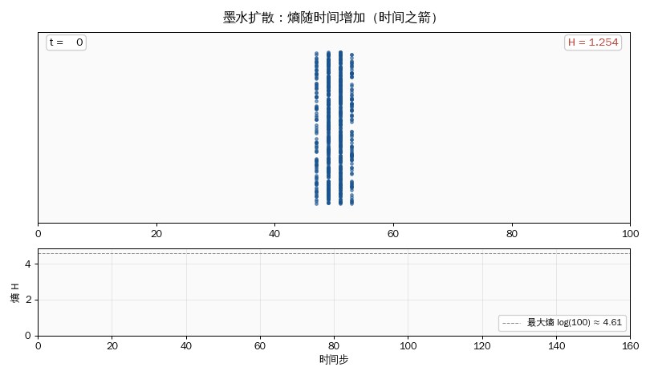
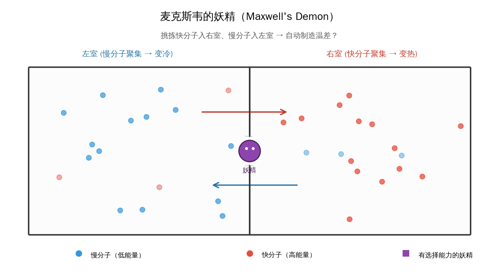
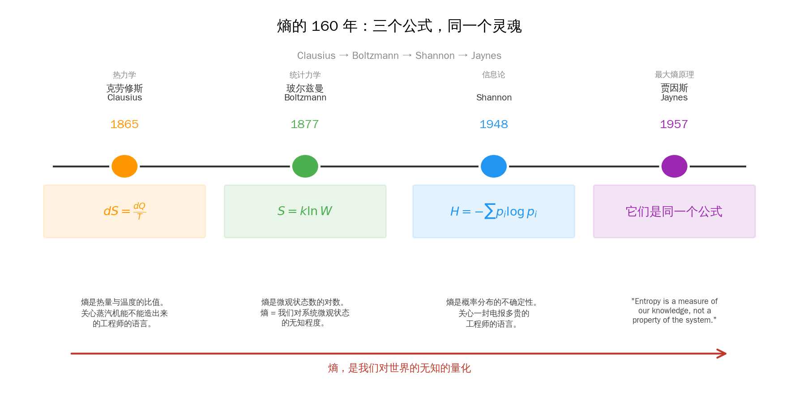

## 上一篇回顾

动量守恒的根源是**空间的平移对称性**——宇宙的哪个位置都一样。能量守恒的根源是**时间的平移对称性**——宇宙的哪个时刻都一样。

Noether 定理告诉我们：**对称即守恒**。

这是一个非常优美的世界图景：对称性藏在一切守恒律的背后，像一张看不见的骨架支撑着所有的物理学。

但这篇，我们要讲一条**打破这种对称美学**的定律。

一条让物理学家爱因斯坦都承认"我相信它是唯一一条永远不会被推翻的普遍定律"的定律。

一条既粗鲁、又不可逆、又让整个宇宙向着死亡走去的定律。

**热力学第二定律。**

它的核心概念只有一个字——**熵**。

> **系列导航**
>
> <div style="max-width: 660px; margin: 0.5em 0; font-size: 0.93em; line-height: 1.9;">
> <div style="border-left: 3px solid #ccc; padding-left: 12px; margin-bottom: 6px; padding: 8px 12px; color: #888;">
> ▹ <a href="/ai-blog/posts/see-physics-1-motion/" style="color: #888;">第一篇：运动——世界从"动"开始</a></div>
> <div style="border-left: 3px solid #ccc; padding-left: 12px; margin-bottom: 6px; padding: 8px 12px; color: #888;">
> ▹ <a href="/ai-blog/posts/see-physics-2-force/" style="color: #888;">第二篇：力——看不见的手</a></div>
> <div style="border-left: 3px solid #ccc; padding-left: 12px; margin-bottom: 6px; padding: 8px 12px; color: #888;">
> ▹ <a href="/ai-blog/posts/see-physics-3-energy/" style="color: #888;">第三篇：能量——不灭的守恒量</a></div>
> <div style="border-left: 3px solid #ccc; padding-left: 12px; margin-bottom: 6px; padding: 8px 12px; color: #888;">
> ▹ <a href="/ai-blog/posts/see-physics-4-momentum/" style="color: #888;">第四篇：动量——惯性的力量</a></div>
> <div style="border-left: 3px solid #FF9800; padding-left: 12px; margin-bottom: 6px; background: rgba(255,152,0,0.05); padding: 8px 12px; border-radius: 0 4px 4px 0;">
> <strong>▸ 第五篇（本文）：熵——承认无知的勇气</strong></div>
> </div>

---

## 第一章：一台永远造不出来的机器

**1824 年，法国。**

一个名叫萨迪·卡诺（Sadi Carnot）的 28 岁工程师，写了一本只有 118 页的小册子：《论火的动力》。

那是蒸汽机的黄金时代。英国的瓦特已经改良了蒸汽机 60 年，整个欧洲都在为一件事疯狂——**如何让蒸汽机的效率再高一点。** 煤是钱，蒸汽是钱，每一个百分点的效率都意味着帝国的竞争力。

工程师们试遍了一切：更大的锅炉、更高的压力、更精密的阀门、更好的润滑。效率在缓慢提升，但似乎永远撞在一堵看不见的墙上。

卡诺是个理论派。他没有去改阀门，他问了一个完全不同的问题：

> **蒸汽机的效率，有没有一个理论上限？**

换句话说：**无论工艺多完美，从 100 度的蒸汽里榨取 100 焦耳的热，能变成多少焦耳的功？**

这个问题看起来疯狂——在 1824 年，没有人知道"能量"是什么（焦耳定律要等 15 年），没有人见过"原子"（玻尔兹曼还没出生）。但卡诺凭借纯粹的逻辑推理，得到了一个惊人的结论：

**蒸汽机的最高效率，只取决于热源和冷源的温度差。**

$$
\eta_{\max} = 1 - \frac{T_{\text{冷}}}{T_{\text{热}}}
$$

这个公式说了一件非常残酷的事：**如果你的冷凝器温度是 20 度（293K），热锅炉是 200 度（473K），无论你怎么设计机器，效率永远不可能超过 38%。** 剩下的 62%，必然作为"废热"流入冷凝器，无可挽回。

**你不是技术不行。你是在跟宇宙的法律作对。**

卡诺没有等到他的结论被承认。他 36 岁死于霍乱，论文被埋没了 20 年。直到 1850 年代，一个叫鲁道夫·克劳修斯（Rudolf Clausius）的德国物理学家把卡诺的思想翻译成现代数学语言，这条"宇宙法律"才正式获得它的名字。

1865 年，克劳修斯造了一个词：

> **Entropie。**

希腊词根 τροπή（trope）= 转化。前缀 en- 是模仿"energy（能量）"起的。克劳修斯自己解释说：

> *"我特意让这个新词和 energy 听起来相似——因为这两个量在物理学里是如此密切相关，以至于它们在名字上的相似是恰当的。"*

一个新词，一个新概念，一条新定律，写在克劳修斯 1865 年论文的最后两行——那是物理学史上最有名的两句话：

> **"宇宙的能量是恒定的。"**
>
> **"宇宙的熵趋于极大。"**

*"Die Energie der Welt ist konstant. Die Entropie der Welt strebt einem Maximum zu."*

能量不会消失，但**能量会变得越来越没用**。

---

## 第二章：时间为什么只有一个方向

### 牛顿的方程是对称的

回想一下第二篇里牛顿的 F=ma。这条方程有一个非常奇怪的性质：

**它不知道时间是向前还是向后流的。**

把一段台球碰撞的视频倒过来播放——撞散的球回到聚集状态，撞击变成分离。这在牛顿力学里**完全合法**。每一帧画面都精确满足 F=ma。时间反演之后，方程依然成立。

能量守恒？也对称。动量守恒？也对称。

**但你的眼睛一秒钟就能看出来这个视频是倒放的。** 为什么？

因为生活里有大量的**只朝一个方向走**的事情：

- 一杯热咖啡放久了会变凉，从来不会自动变热。
- 一滴墨水滴进水里会扩散，从来不会自己聚成一滴。
- 一个鸡蛋摔在地上会碎，从来不会自己拼回来。
- 一张纸烧成灰，从来不会自己变回纸。

每一个单独的分子碰撞都遵守时间对称的牛顿方程。但**大量分子聚在一起做统计平均**时，时间突然就有了方向。

这个方向，就是熵增的方向。

### 爱丁顿的那句名言

1927 年，英国天体物理学家亚瑟·爱丁顿（Arthur Eddington）写下了物理学史上最有名的一句断言：

> *"如果你的理论与热力学第二定律不符——对你来说没有别的办法，只能在最深的羞辱中崩塌。"*

（*If your theory is found to be against the second law of thermodynamics I can give you no hope; there is nothing for it but to collapse in deepest humiliation.*）

他还创造了一个词来形容这件事——**时间之箭**（*the arrow of time*）。

宇宙的钟不是牛顿的钟。牛顿的钟可以正转可以倒转。但**热力学的钟**只能朝一个方向走：有序 → 无序，集中 → 扩散，能用 → 废掉。

<div style="max-width: 660px; margin: 1.5em auto; padding: 20px; border-radius: 8px; background: rgba(33,150,243,0.06); border: 1px solid rgba(33,150,243,0.2);">

<div style="font-weight: bold; margin-bottom: 12px; color: #2196F3; font-size: 1.05em;">💡 反直觉的真相</div>

**微观定律是时间对称的，宏观现象却不是。** 时间之箭不是来自单个粒子的运动方程，它是来自"我们只能看到宏观"这个限制。这不是物理学的缺陷，而是物理学最深的哲学发现之一——**时间的方向性，是统计的方向性。**

</div>

这就引出了一个巨大的问题：

**如果牛顿方程不管方向，那"熵"到底是什么？它是一个真实的物理量，还是只是我们看世界的方式？**



1877 年，一个维也纳人给出了答案。

---

## 第三章：玻尔兹曼的翻译

（*本节内容在 [《玻尔兹曼的遗产》](/ai-blog/posts/boltzmann-legacy/) 里有完整展开，这里只做一个必要的回顾。*）

克劳修斯定义的熵是"宏观"的——它是热量 Q 和温度 T 的比值。你可以测量它，但你摸不到它是什么。

路德维希·玻尔兹曼（Ludwig Boltzmann）做了一件彻底改变物理学的事：**他把熵和分子的无序联系起来。**

他说：熵不是什么神秘的能量。熵**衡量的是同一个宏观状态，可以对应多少种不同的微观安排**。

<div style="max-width: 660px; margin: 1.5em auto; padding: 20px; border-radius: 8px; background: rgba(255,152,0,0.06); border: 1px solid rgba(255,152,0,0.2);">

<div style="font-weight: bold; margin-bottom: 12px; color: #FF9800; font-size: 1.05em;">🎲 一个扑克的例子</div>

打一手牌，你拿到"同花顺"会尖叫——因为只有极少数的发牌方式能凑成同花顺。

你拿到"随机的五张散牌"不会尖叫——因为**绝大多数**的发牌方式都是这样。

同花顺：**低熵**（微观安排少）。<br>
随机散牌：**高熵**（微观安排多）。

宇宙"趋向极大熵"——不是因为它主动追求混乱，而是因为**混乱的状态比有序的状态多太多了**。扑克洗牌洗久了不会洗出同花顺，不是因为同花顺被禁止，而是因为它太稀有。

</div>

玻尔兹曼把这句话写成了一个公式，刻在他的墓碑上：

$$
S = k \ln W
$$

- S 是熵（宏观）
- W 是对应的微观状态数（"混乱度"）
- k 是玻尔兹曼常数（连接宏观温度和微观分子能量的桥梁）

**熵 = 我们对系统微观状态的无知程度。**

宏观上你只知道"这杯咖啡是 80 度"，但在微观上，有无数种分子排布都能产生 80 度的咖啡——你不知道是哪一种。熵衡量的就是这份"不知道"的数量。

**热力学第二定律的深层含义被彻底改写了**——它不再是"宇宙必然衰败"，而是：

> **宇宙必然从"我们能精确描述的状态"，走向"我们只能统计描述的状态"。**
>
> **熵增，就是无知增。**

这是一个哲学上震耳欲聋的转向：**一个物理量，竟然是衡量观察者的无知程度的。** 它既属于系统，也属于你。

这种观念在 1877 年太超前了，整整半个世纪之后才有人真正读懂它。

---

## 第四章：麦克斯韦的妖精，和一个 120 年的悖论

就在玻尔兹曼写下 S = k ln W 的那一年之前，1867 年，苏格兰物理学家詹姆斯·克拉克·麦克斯韦（James Clerk Maxwell）在一封信里，发明了一个让物理学家头疼了 120 年的**思想实验**。

### 一个有鬼的盒子

想象一个盒子，中间有一堵隔板，隔板上有一扇小门。盒子的两边都装着温度均匀的气体——意思是：**快分子和慢分子均匀混合**。

现在想象有一个小妖精站在门旁边。他有一个超能力：**他能看见每一个分子**。



他做这样一件事：
- 只要看到**快分子**从左边冲过来，他就打开门，让它进入**右边**。
- 只要看到**慢分子**从右边冲过来，他就打开门，让它进入**左边**。
- 其他的分子，他一律不开门。

过了一会儿会发生什么？

- 右边：聚满了快分子 → 温度升高。
- 左边：只剩慢分子 → 温度降低。

**盒子自动从均匀温度变成了一冷一热！**

这意味着什么？意味着**你不用做功，就制造了温差**。有温差就可以驱动热机，有热机就可以产生无穷的能量。

这只妖精，**打败了热力学第二定律。**

### 120 年的悖论

麦克斯韦自己没当真——他只是用这个思想实验调皮地暗示：**第二定律是统计的，不是绝对的**。

但一代代物理学家不服气。如果第二定律真的是宇宙的铁律，那它必须能解释为什么这只妖精是不可能的。

**1929 年**，匈牙利物理学家利奥·西拉德（Leo Szilard）——后来说服爱因斯坦签曼哈顿计划那封信的人——迈出了第一步。他说：妖精要做决定，必须**获取信息**（知道哪个分子是快的）。获取信息本身就要消耗能量。

但真正的答案，要等到 1961 年。

### Landauer 原理：信息是物理的

**1961 年，IBM 研究员罗尔夫·兰道尔（Rolf Landauer）证明了一件惊人的事：**

> **擦除 1 比特的信息，必然产生至少 $kT \ln 2$ 的热量。**

这不是工程限制，这是**宇宙的法律**。

你想想这件事的震撼之处：

- 信息，这个似乎是抽象的东西——书里的字、硬盘上的 0/1、你脑子里的记忆——**在物理学上，有实实在在的能量代价**。
- 你电脑里每次 CPU "清零一个寄存器"，每次你按 delete，都必然向环境释放最小量的热。
- Google 的数据中心之所以发热，根本原因不是电子的欧姆损耗——是**信息擦除**。

回到麦克斯韦的妖精：妖精**记住了**哪些分子是快的、哪些是慢的。他的大脑（或者记录本）里积累了信息。当他要"重置"这些记忆来继续工作时，**他必须擦除**。擦除一比特就产生 $kT \ln 2$ 的热量。**这份热量，恰恰等于他通过分拣分子获得的熵减**。

妖精并没有打败第二定律。他只是把热力学的代价，藏进了自己的大脑里。

<div style="max-width: 660px; margin: 1.5em auto; padding: 20px; border-radius: 8px; background: rgba(156,39,176,0.06); border: 1px solid rgba(156,39,176,0.2);">

<div style="font-weight: bold; margin-bottom: 12px; color: #9C27B0; font-size: 1.05em;">🧠 这个发现有多重要？</div>

**兰道尔原理完成了一件物理学家没有意识到他们在等待的事：它把"信息"正式焊进了物理学。** 信息不再是抽象概念，它是一个物理量，有能量，有熵。

物理熵和信息熵，从这一刻起，不再是两样东西。**它们是同一样东西的两个名字。**

</div>

---

## 第五章：三个公式，同一个灵魂

现在我们可以拉一条时间线了。

### 1865 · 克劳修斯：热的账本

$$
dS = \frac{dQ}{T}
$$

熵是热量与温度的比值。关心"蒸汽机能不能造出来"的工程师的语言。

### 1877 · 玻尔兹曼：微观的翻译

$$
S = k \ln W
$$

熵是微观状态数的对数。关心"原子存在吗"的理论物理学家的语言。

### 1948 · Shannon：信息的代价

$$
H = -\sum_i p_i \log p_i
$$

熵是概率分布的不确定性。关心"一封电报多贵"的工程师的语言。

（*这条线的完整故事在 [《信息论——从电报到 GPT 的暗线》](/ai-blog/posts/see-math-extra-information-theory/) 里。*）

### 1957 · Jaynes：它们是同一个东西

三条公式横跨 83 年，被三个完全不同领域的人写出来，描述的对象看起来毫无关联——蒸汽、分子、电报。

**但它们竟然是同一个公式。**

1957 年，一个叫埃德温·贾因斯（Edwin Jaynes）的美国物理学家写了一篇标题极其平静的论文：*Information Theory and Statistical Mechanics*（《信息论与统计力学》）。

这篇论文证明了一件事——**所有的热力学，都可以从信息论推出来**。

贾因斯的观点是一个让物理学家坐立不安、让信息论学家会心一笑的论断：

> *"Entropy is a measure of our knowledge, not a property of the system."*
>
> **"熵，衡量的是我们的知识，不是系统的属性。"**

你面前一杯咖啡有多少熵？贾因斯说：**取决于你对它知道多少**。

一个刚入门的学生只知道"温度"——对他来说这杯咖啡的熵是 S₁。一个能分辨每一个分子运动的妖精——对他来说这杯咖啡的熵是 0。

**"熵，不是杯子里的，是你和杯子之间的。"**



这句话在 1957 年听起来像异端邪说。但是 60 年后，当神经网络开始用**概率分布**来描述这个世界时，贾因斯的观点变成了整个领域最朴素的第一性原理：

**你的模型有多诚实，衡量的就是它对自己的无知有多清楚。**

这就把我们带到了 AI。

---

## 第六章：AI 是一台与熵共舞的机器

现代 AI 的每一个核心组件，都能在熵的语言里找到自己的位置。

### 6.1 Softmax：最诚实的分布

给定一堆分数（logits），你要把它们变成一个概率分布。怎么变？

直觉：**最合理的概率分布，应该是在满足约束的前提下，熵最大的那个**——也就是说，你不应该给出比"你实际知道的"更多的信息。这叫**最大熵原理**（Maximum Entropy Principle），贾因斯 1957 年论文的核心。

你能证明：**在给定 logits 为约束的情况下，熵最大的分布，就是 Softmax 分布。**

$$
p_i = \frac{e^{z_i / T}}{\sum_j e^{z_j / T}}
$$

**Softmax 不是拍脑袋想的函数。它是"最谦虚的概率分布"。** 它恰好是玻尔兹曼 1877 年为热力学写下的分布形式。同一个公式。

（*完整推导在 [《玻尔兹曼的遗产》](/ai-blog/posts/boltzmann-legacy/) 和 [《为什么用 -log(p) 做损失函数》](/ai-blog/posts/cross-entropy-loss/)。*）

### 6.2 温度：熵的旋钮

Softmax 里那个 T，不是一个比喻，它**就是**物理温度。

- T → 0：分布塌缩到最大 logit，熵 → 0。模型变成复读机。
- T → ∞：分布变均匀，熵 → 极大。模型变成骰子。
- T = 1：标准采样。

你在调 ChatGPT 的 `temperature` 参数时，你**字面意义上**在调节输出分布的熵。热一点——更多样、更创新、也更胡说。冷一点——更保守、更稳定、也更无聊。

### 6.3 交叉熵损失：量化无知的距离

GPT 训练时用的损失函数，叫**交叉熵**（Cross-Entropy）：

$$
L = -\sum_i p_i^{\text{真实}} \log p_i^{\text{模型}}
$$

拆开看，它说的是：

> **"模型的预测分布，离真实分布有多远？"**

训练一个 LLM，本质上就是在做一件事：**把模型对下一个 token 的无知，压缩到和世界的实际无知一样低。**

你不能要求模型比世界更确定——那是过拟合，是幻觉的温床。

你也不能让模型比世界更糊涂——那是欠训练，是胡话。

**训练的终点，是让 AI 的无知分布，精确等于世界的无知分布。** 这就是诚实。

### 6.4 Diffusion 模型：一台时间反演机

2020 年之后横扫图像界的 Stable Diffusion、DALL-E、Midjourney，用的都是**扩散模型**。它做的事情很简单：

- **正向过程**：把一张清晰的猫图片，一步步加噪声，直到它变成纯粹的随机噪声。**熵在增加，时间之箭在前进。**
- **逆向过程**：训练一个神经网络，学会**从噪声里一步步还原出猫**。**熵在减少，时间之箭在后退。**

扩散模型字面意义上是**一台反抗热力学第二定律的机器**。

当然它不真的违反物理——这个"反熵"的过程，代价是在 GPU 上燃烧的电、发出的热。你"从无到有地生成了一张猫的图片"，同时数据中心的空调在向大气散发着等价的热量。兰道尔原理没有被破坏，它只是被重新分配了。

**麦克斯韦的妖精，是 Diffusion 模型的祖先。**

### 6.5 幻觉：熵增的另一个名字

一个被反复训练的 LLM，接收到一个它不熟悉的问题时，会怎么做？

它不会说"我不知道"——因为它的采样机制永远要选一个 token。

它会**从熵较高的分布中采样一个听起来合理的词**。一个，再一个，再一个。每一步都是局部合理的，但整段话可能完全是虚构的。

**这就是 AI 幻觉的数学本质——模型没有一个机制把"我不知道"转化为"沉默"。它只会继续从概率分布里采样，而概率分布的熵，不会告诉它何时停下。**

（*关于这件事的深度拆解，我会用下一篇独立文章展开。*）

---

## 第七章：承认无知，是一切理解的开始

让我们回到最开始。

1824 年的卡诺坐下来问：**为什么蒸汽机有效率上限？** 他的答案是熵。

1877 年的玻尔兹曼坐下来问：**为什么时间只朝一个方向流？** 他的答案是熵。

1948 年的 Shannon 坐下来问：**为什么电报是有代价的？** 他的答案是熵。

1957 年的贾因斯坐下来问：**物理熵和信息熵，为什么长得一模一样？** 他的答案：它们本来就是一件事。

2017 年至今，一群做 AI 的人坐下来问：**一个模型怎样才算真的诚实？** 他们的答案：最小化交叉熵。

**这条链条，160 年，贯穿 5 个学科，共享一个灵魂。**

那个灵魂是什么？

> **熵，是我们对世界的无知的量化。**
>
> **任何试图描述这个世界的系统——不管是蒸汽机、分子、电报、还是 GPT——都必须学会诚实地面对自己的无知。**

这是人类智识史上非常罕见的事情——**一个概念，从一台冒烟的机器里诞生，最后安放在你手机里 AI 助手的心脏**。160 年间它从没改变形状。改变的只是它的名字。

第一篇我说过，物理课本从不告诉你公式背后的故事。我写这个系列就是为了告诉你：

**那些公式从来不是拿来应付考试的。它们是 300 年来人类最聪明的头脑，诚实地面对自己不懂的东西，一行一行写下来的"我不知道"的清单。**

承认无知，是理解世界的第一步。

这句话适用于蒸汽机，适用于分子，适用于电报，也适用于 ChatGPT。

---

## 延伸阅读

- **Rudolf Clausius, 1865, *The Mechanical Theory of Heat*** — 熵概念诞生的原始文献，德文原版中可以看到他为什么选择"Entropie"这个词
- **Edwin T. Jaynes, 1957, *Information Theory and Statistical Mechanics*** — 一篇改变物理学理解的论文，20 页，免费在线
- **Charles H. Bennett, 1982, *The Thermodynamics of Computation*** — 把 Landauer 原理完整应用到计算过程，是"信息即物理"的集大成
- **Sean Carroll, 2010, *From Eternity to Here*** — 面向大众的"时间之箭"科普，Carroll 是当今最擅长讲熵的物理学家
- **Claude Shannon, 1948, *A Mathematical Theory of Communication*** — 信息熵的诞生论文，26 页，文字极为优雅
- **本系列内部链接：**
  - [《玻尔兹曼的遗产》](/ai-blog/posts/boltzmann-legacy/) — 本篇第三章的完整展开
  - [《信息论——从电报到 GPT 的一条暗线》](/ai-blog/posts/see-math-extra-information-theory/) — 本篇第五章的完整展开
  - [《为什么用 -log(p) 做损失函数》](/ai-blog/posts/cross-entropy-loss/) — 本篇第六章第 3 节的完整推导

---

## 附：Python 小实验——看见熵增

一段 40 行代码，直接让你看到熵增和 Softmax 的熵随温度变化。

```python
import numpy as np

# ===== 实验 1：墨水扩散，熵在增加 =====
print("=== 墨水扩散：熵在增加 ===")
# 100 个格子，初始所有粒子都在中间（低熵状态）
N_CELLS = 100
N_PARTICLES = 1000
positions = np.full(N_PARTICLES, N_CELLS // 2)  # 都在 50

def entropy_from_positions(positions, n_cells):
    counts = np.bincount(positions, minlength=n_cells).astype(float)
    p = counts / counts.sum()
    p = p[p > 0]
    return -(p * np.log(p)).sum()

print(f"  初始 (全挤在中间):         熵 = {entropy_from_positions(positions, N_CELLS):.3f}")

# 随机游走 1000 步
for step in range(1, 1001):
    positions = np.clip(positions + np.random.choice([-1, 1], N_PARTICLES), 0, N_CELLS - 1)
    if step in [10, 100, 1000]:
        print(f"  第 {step:4d} 步 (逐渐扩散):       熵 = {entropy_from_positions(positions, N_CELLS):.3f}")

print("  观察：熵单调递增 → 时间之箭。\n")

# ===== 实验 2：Softmax 的熵随温度变化 =====
print("=== Softmax 温度效应 ===")
logits = np.array([3.0, 2.0, 1.0, 0.5, 0.0])

def softmax_with_temp(logits, T):
    z = logits / T
    e = np.exp(z - z.max())
    return e / e.sum()

def entropy(p):
    p = p[p > 0]
    return -(p * np.log(p)).sum()

print("  logits =", logits)
print("  最大熵 (5 个词均匀):", f"{np.log(5):.3f}\n")

for T in [0.1, 0.5, 1.0, 2.0, 10.0]:
    p = softmax_with_temp(logits, T)
    H = entropy(p)
    bar = "█" * int(H / np.log(5) * 40)
    print(f"  T={T:4.1f}  熵={H:.3f}  {bar}")
    print(f"         分布={np.round(p, 3)}")

print("\n  观察：T 越大，分布越平，熵越高。T 就是熵的旋钮。")
```

运行后你会看到：

- 墨水从中心扩散，熵从 0 单调增加到接近 log(100) ≈ 4.6。
- Softmax 的熵在 T=0.1 时接近 0（几乎一定选最大 logit），在 T=10 时接近 log(5)（几乎均匀）。

**这两个过程在数学上是同一件事。**

---

<div style="margin-top: 30px; padding-top: 20px; border-top: 1px solid #e0e0e0; font-size: 0.9em; color: #888; line-height: 1.8;">

**下一篇预告：《看见物理（六）：相变——量变到质变**<br>
水变冰是相变。磁铁被加热失去磁性是相变。GPT-3 到 GPT-4 突然"会推理"也是相变。物理学家有一整套数学来描述"量变到质变"——它叫临界现象理论。今天 AI 研究者讨论的"涌现能力"（Emergent Abilities），是这套理论 150 年前的直系后裔。

**本文首发于「AI 学习笔记」博客**：https://Jason-Azure.github.io/ai-blog/<br>
微信公众号：**AI-lab学习笔记**<br>
系列文章完整列表见 [标签：看见物理](/ai-blog/tags/看见物理/)

</div>
