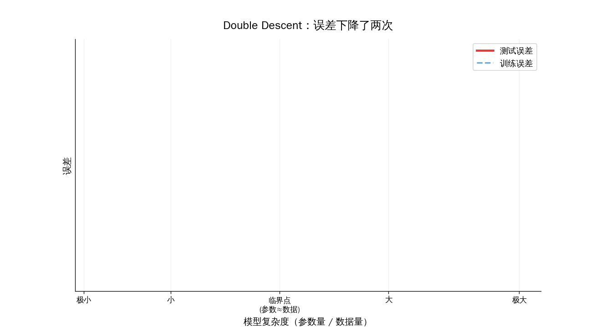
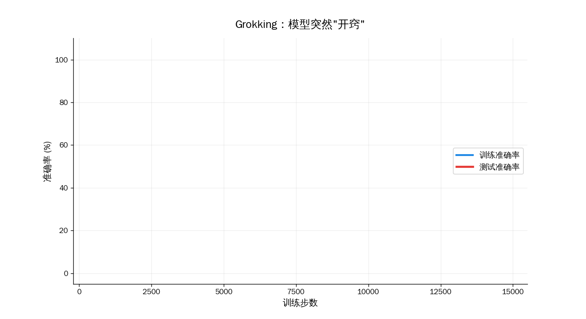
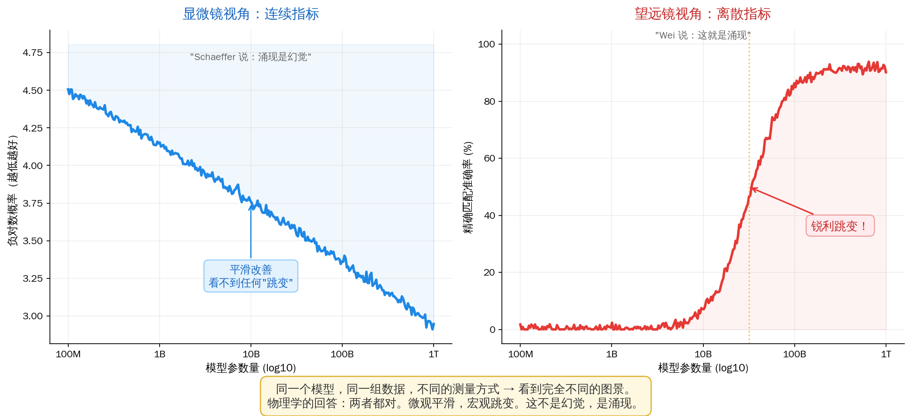

## 上一篇回顾

上一篇讲了熵——人类第一次承认"我不知道"，并把无知量化成数学。

玻尔兹曼说 $S = k \ln W$：**一个宏观状态对应的微观安排越多，熵越大**。Shannon 说 $H = -\sum p_i \log p_i$：**一个分布越不确定，信息量越大**。贾因斯把两个公式焊在一起：**它们本来就是同一件事——熵衡量的是你对世界的无知。**

这条结论有一个默认假设：**无知是平滑的**。你加热一杯咖啡，温度连续上升，分子混乱度连续增加，熵连续增大。一切都在平稳地变化。

但如果你把那杯咖啡换成一壶水，继续加热到 100 度——

**一切就不再平滑了。**

> **系列导航**
>
> <div style="max-width: 660px; margin: 0.5em 0; font-size: 0.93em; line-height: 1.9;">
> <div style="border-left: 3px solid #ccc; padding-left: 12px; margin-bottom: 6px; padding: 8px 12px; color: #888;">
> ▹ <a href="/ai-blog/posts/see-physics-1-motion/" style="color: #888;">第一篇：运动——世界从"动"开始</a></div>
> <div style="border-left: 3px solid #ccc; padding-left: 12px; margin-bottom: 6px; padding: 8px 12px; color: #888;">
> ▹ <a href="/ai-blog/posts/see-physics-2-force/" style="color: #888;">第二篇：力——看不见的手</a></div>
> <div style="border-left: 3px solid #ccc; padding-left: 12px; margin-bottom: 6px; padding: 8px 12px; color: #888;">
> ▹ <a href="/ai-blog/posts/see-physics-3-energy/" style="color: #888;">第三篇：能量——不灭的守恒量</a></div>
> <div style="border-left: 3px solid #ccc; padding-left: 12px; margin-bottom: 6px; padding: 8px 12px; color: #888;">
> ▹ <a href="/ai-blog/posts/see-physics-4-momentum/" style="color: #888;">第四篇：动量——惯性的力量</a></div>
> <div style="border-left: 3px solid #ccc; padding-left: 12px; margin-bottom: 6px; padding: 8px 12px; color: #888;">
> ▹ <a href="/ai-blog/posts/see-physics-5-entropy/" style="color: #888;">第五篇：熵——承认无知的勇气</a></div>
> <div style="border-left: 3px solid #FF9800; padding-left: 12px; margin-bottom: 6px; background: rgba(255,152,0,0.05); padding: 8px 12px; border-radius: 0 4px 4px 0;">
> <strong>▸ 第六篇（本文）：相变——量变到质变的数学</strong></div>
> </div>

---

## 第一章：99 度和 100 度之间

你烧一壶水。

从 20 度到 30 度，水还是水。从 30 度到 80 度，水还是水。从 80 度到 99 度，水依然是水——每一度的变化都是连续的、温和的、毫无戏剧性的。密度下降一点，粘度小一点，分子运动快一点。

**99 度的水和 98 度的水，几乎没有区别。**

然后，100 度。

水沸腾了。气泡从底部涌出，液体的密度从 1000 kg/m³ 跳到 0.6 kg/m³——**三个数量级的断崖**。这不是"稍微变了"，这是"彻底变成了另一种东西"。

**前面 80 度的平滑 + 平滑 + 平滑，最后一度变成了——突然。**

物理学家给这个"突然"取了名字：**相变**（phase transition）。

如果这只是烧水的趣闻，它不值得写一篇文章。但事实是，相变是一个**普适的**数学结构，它出现在：

- **磁铁加热到居里温度**——磁性突然消失
- **超导体在临界温度以下**——电阻突然归零
- **液晶显示器切换**——分子方向集体突变
- **GPT-3 到 GPT-4 的"涌现能力"**——这是本文真正要去的地方

上一篇我们学到：**熵是平滑的统计**。这一篇要讲的是：**在某些特殊的点，平滑会被打断，统计本身会发生质变。**

---

## 第二章：磁铁的秘密

为什么物理学家不用"沸水"来讲相变，而偏爱用磁铁？

因为磁铁更**干净**。

一块铁磁体，内部有无数个原子，每个原子像一根小指南针，有自己的磁矩。当这些原子磁矩**整齐地排成一个方向**，宏观上就表现为"有磁性"。

现在把磁铁加热。温度升高，原子抖动加剧。你可能直觉上预期：磁性会**慢慢减弱**——从"非常有磁性"到"有点有磁性"到"微弱的磁性"到"没有磁性"。

**但现实不是这样的。**

铁磁体的磁性随温度变化的实际曲线是：**在 770°C（居里温度）以下，磁化强度慢慢下降——然后在居里温度附近，一头栽下悬崖。**

不是逐渐消失，是**几乎在一瞬间归零**。冷却下来，它又恢复。

19 世纪末的物理学家可以理解"温度高了分子乱了"。但他们无法理解：**为什么是突然的？** 为什么不是平滑地弱下去？

这个问题等了 50 年才有真正的答案。而答案来自一个极其简单的模型。

---

## 第三章：Ising 模型——用最小的玩具说最大的真理

1920 年，德国物理学家 Wilhelm Lenz 给他的博士生 Ernst Ising 出了一个题：**用最简单的模型解释铁磁性。**

Ising 提出的模型极简到令人怀疑它能不能用：

> 一排 N 个"小磁针"（自旋），每个只能取两个方向：↑ 或 ↓。
>
> 规则只有两条：
> - **相邻同向**，能量低（它们喜欢这样）
> - **相邻反向**，能量高（它们不喜欢这样）
>
> 温度是一个调节旋钮：越高，系统越不在乎能量，越倾向随机；越低，系统越在乎能量，越倾向整齐。

如果你读过[第三篇（能量）](/ai-blog/posts/see-physics-3-energy/)，会立刻认出这个结构：Ising 模型就是一个**能量景观**。每一种自旋排列对应景观上的一个点，能量最低的排列——"全部同向"——就是景观最深的谷底。温度的作用是让系统在谷底附近震荡还是翻越山脊自由游荡。

**温度就是上一篇 Softmax 里的 T。** 这不是比喻——它们用的是同一个分布（玻尔兹曼分布），同一个数学（[上一篇](/ai-blog/posts/see-physics-5-entropy/)里推导过了）。

Ising 算了一维的情况——结果让他灰心丧气：**一维 Ising 模型没有相变**。无论温度多低，自旋都不会集体对齐。

Ising 以为这说明模型不行，就转行去当中学老师了。

**但 Ising 错了。** 错不在模型——错在他只算了一维。

20 年后，1944 年，挪威物理学家 Lars Onsager 把 Ising 模型从一条线推广成一张**棋盘**——二维。然后他精确求解了它。

结果震惊了整个物理学界：

- 在某个临界温度 $T_c$ 以下，所有自旋**集体对齐**——出现宏观磁化
- 在 $T_c$ 以上，磁化为零
- 这个转变是**锐利的**——不是平滑过渡

Onsager 精确解被认为是 20 世纪最困难的数学物理成就之一。它告诉我们：**维度，是决定相变能否发生的关键因素。**

一条线上，自旋的邻居太少，噪声压过秩序。一张棋盘上，每个自旋有四个邻居——**集体的力量足以对抗热噪声**，秩序得以突然涌现。

**但最根本的问题还没回答：为什么是"突然"的？**

---

## 第四章：临界点——奇点的物理学

Onsager 的解揭示了一件更深的事。

在临界温度 $T_c$ **附近**——不是"到达"，是"附近"——**系统的所有性质都变得疯狂**：

- **关联长度**（两个自旋相互影响的最远距离）→ 发散到**无穷大**
- **磁化率**（系统对外界微小扰动的响应）→ 发散到**无穷大**
- **比热**（每升高一度需要吸收多少热量）→ 发散到**无穷大**

在上一篇里，我们学过熵衡量的是系统的微观状态数。正常情况下，你扰动一个原子，只影响它附近几个邻居——系统的响应是**局部的**。

但在临界点附近：**你推动一个原子，整个系统都在回应。**

每一个原子和每一个原子相关。不只是邻居，不只是邻居的邻居——**所有的**。这叫**长程关联**。

这就是相变为什么是"突然"的答案：

> **临界点不是一个普通的点。它是一个奇点——在那里，微小的扰动可以引起全局的改变。系统变成了一台"放大器"，把微观的涨落放大成宏观的质变。**

<div style="max-width: 660px; margin: 1.5em auto; padding: 20px; border-radius: 8px; background: rgba(33,150,243,0.06); border: 1px solid rgba(33,150,243,0.2);">

<div style="font-weight: bold; margin-bottom: 12px; color: #2196F3; font-size: 1.05em;">回想第五篇的一段话</div>

上一篇讲到玻尔兹曼和 Jaynes 的洞察：**熵衡量的是我们对系统的无知**。在临界点，关联长度发散到无穷——意味着**你必须知道每一个原子的状态才能预测系统的行为**。你的无知被"传播"到了整个系统。

换句话说：**临界点是熵的奇点——是无知被最大化放大的地方。**

</div>

这也是为什么物理学家对临界点如此着迷。它是自然界的一台**放大器**——把微观的随机涨落，变成宏观的集体行为。

---

## 第五章：重整化群——用"缩放"来理解世界

1966 年，芝加哥大学的 Leo Kadanoff 想到了一个革命性的思路。

他说：不要算方程，我们来**换一个分辨率**看。

想象你在显微镜下看一张 Ising 模型的棋盘。每 2×2 格合并成一个"块"——按少数服从多数决定方向。然后你把新的棋盘再合并一次，再合并一次。

**关键观察：在大部分温度下，每放大一次，系统都会"变样"——要么越来越有序，要么越来越无序。但在临界温度 $T_c$，无论你怎么放大，系统看起来都一样。**

不是完全一样——但统计性质不变。远看和近看，形状不同但结构相同。这叫**尺度不变**，也叫**自相似**。

云远看是云，近看还是云。海岸线远看是曲折的，近看还是曲折的。临界点附近的 Ising 模型也是这样。

1971 年，Cornell 的 Kenneth Wilson 把 Kadanoff 的直觉发展成完整的数学——**重整化群**（Renormalization Group, RG）。Wilson 因此获得 1982 年诺贝尔物理学奖。

RG 的核心是一个精妙的观察：

> 定义一个操作 $R$：把系统缩放一倍（4 个自旋合并成 1 个）。
>
> 在 $T_c$：应用 $R$ 之后，系统**变回自己**。$T_c$ 是 $R$ 的**不动点**。
>
> 在 $T_c$ 以上：应用 $R$ 之后，系统越来越"无序"，远离临界点。
>
> 在 $T_c$ 以下：应用 $R$ 之后，系统越来越"有序"，远离临界点。

**这就解释了相变的普适性**——为什么水、磁铁、超导体这些完全不同的物理系统，在各自的临界点附近表现出**相同的数学行为**？

因为 RG 告诉我们：微观细节在缩放过程中被"洗掉"了。无论你的系统是水分子还是铁原子，只要它在临界点附近，缩放后都会流向同一个不动点。**物理学家把这些共享同一个不动点的系统归入同一个"普适类"（universality class）。**

一个临界点，统治了它附近的所有行为。微观细节不重要——**重要的只有几个关键参数：维度、对称性、相互作用的程数。**

---

## 第六章：从物理到 AI——涌现

2022 年 6 月，Google 和 Stanford 的研究者联合发表了一篇论文：*Emergent Abilities of Large Language Models*。

他们在图表上画了这样的曲线：

- **横轴**：模型参数量（从 1 亿到 1 万亿）
- **纵轴**：某个任务的准确率

对小模型——准确率接近零。对更大的模型——接近零。对再大的模型——还是接近零。

**然后到某个参数量——准确率突然跳到 50%、80%。**


- **三位数加法**：小模型做不到，到某个规模突然做到
- **思维链推理**：小模型 CoT 提示**反而损害**性能，大模型 CoT 提示**大幅提升**——这种符号翻转本身就是相变的典型特征
- **指令跟随**：没到某个规模完全无效，过了某个规模几乎完美

这些被称为**涌现能力**（emergent abilities）。

**当物理学家看到这些曲线，他们的反应是：这不就是磁化曲线吗？**

低于居里温度，自旋杂乱无章。高于居里温度——不，等等，方向反了——低于临界参数量，模型一片混乱。高于临界参数量，能力突然涌现。

**曲线的形状几乎一模一样。**

---

## 第七章：AI 的两次相变——Double Descent 和 Grokking

如果涌现是 AI 在**模型规模**维度上的相变，那 AI 在**训练时间**维度上有没有相变？

有。而且不止一次。

### 7.1 Double Descent——人们差一点错过了大模型

（*这个故事的完整版在 [《为什么把模型做大就能变聪明？》](/ai-blog/posts/why-llm-understand-world/) 里。这里只讲它和相变的关系。*）

在 2019 年之前，机器学习界有一条铁律：**模型太大就会过拟合**。

这是经典统计学习理论的核心预测——经典的 U 型曲线。模型太小，欠拟合；模型太大，过拟合；中间有个"甜蜜点"。所有教科书都这么写，所有人都信。

**所以当时没有人认真考虑训练万亿参数的语言模型。** 那不就是过拟合的极端案例吗？

然后 Belkin（2019）和 OpenAI 的 Nakkiran、Sutskever 等人做了一件简单的事：**他们没有在过拟合点停下来，而是继续把模型做大——大得多。**

他们看到了一条惊人的曲线：

> 测试误差先下降（学习），再上升（过拟合），**然后又下降了**——而且比之前的最优点还低。

**误差曲线下降了两次。** 他们管这叫 **Double Descent**。



<div style="max-width: 660px; margin: 1.5em auto; padding: 20px; border-radius: 8px; background: rgba(255,152,0,0.06); border: 1px solid rgba(255,152,0,0.2);">

<div style="font-weight: bold; margin-bottom: 12px; color: #FF9800; font-size: 1.05em;">相变的视角</div>

Double Descent 的"峰值"，出现在一个精确的临界点：**模型参数数量 ≈ 训练数据量**。在这个点，模型恰好能"背下"所有训练数据，但还没有"富余的空间"去压缩规律。

这个峰值就是一个**相变点**——统计物理学家早在 1990 年代就用自旋玻璃理论研究过类似现象（如 Krogh & Hertz 1992 用统计力学分析神经网络泛化）。模型从"记忆模式"到"理解模式"的转变，在数学上和 Ising 模型从无序到有序的转变是同一类现象。

过了这个临界点，模型进入"过参数化"区域——参数远多于数据。直觉上这应该更糟，但实际上模型反而开始学到真正的规律。

**为什么？** 因为在过参数化区域，参数空间太大了，优化器反而更容易找到**简洁的解**——就像一个房间太大了，家具反而不会堵在门口。这就是彩票假说的直觉：大模型里藏着一个精巧的小模型，过参数化让这个小模型更容易被找到。

</div>

### 7.2 Grokking——模型突然"开窍"的那一刻

2021 年，OpenAI 研究者 Alethea Power 等人发表了一篇让所有人震惊的论文。

他们训练一个小 Transformer 做模算术（$a + b \bmod 97$），只给它看 30% 的可能输入。

训练过程：

1. **100 步**：训练集被完全记住——训练准确率 100%
2. **100 到 10000 步**：测试集准确率一直是随机猜（≈ 1%）。模型只是在"背答案"
3. **第 10000 步附近**：测试准确率突然从 1% **跳到接近 100%**

**模型突然从"背答案"变成了"理解规则"。**



这个现象叫 **Grokking**——源自 Heinlein 的科幻小说《异乡异客》，意为"彻底领悟"。

后续研究（Nanda et al. 2023）用可解释性工具打开模型的内部：

- **过拟合阶段**：内部是一堆乱七八糟的记忆电路
- **临界点附近**：离散傅立叶变换的表示开始从噪声里浮现
- **Grokking 之后**：整个网络变成一个干净的加法机

**这和 Ising 模型的相变精确对应：**

|            | Ising 相变             | Grokking              |
| ---------- | ---------------------- | --------------------- |
| 控制参数   | 温度 T                 | 训练步数              |
| 序参数     | 磁化强度               | 测试准确率            |
| 临界点     | 居里温度 $T_c$         | Grokking 步数         |
| 临界点一侧 | 无序（自旋杂乱）       | 记忆（测试失败）      |
| 临界点另侧 | 有序（自旋对齐）       | 理解（测试成功）      |
| 过渡方式   | 锐利、集体、普适       | 锐利、集体            |

**Double Descent 和 Grokking，是 AI 在两个不同维度上的相变：**

```
Double Descent: 模型大小从小到大 → 经过临界点 → 从记忆到理解
Grokking:       训练时间从短到长 → 经过临界点 → 从记忆到理解
```

两者都是同一件事：**系统在某个参数的连续变化中，经历了集体的、突然的、结构性的重组。**

而且 Nakkiran 等人 2019 年就发现了一件惊人的事：Double Descent 不只在模型规模维度发生——**它在训练时间维度也发生**。固定模型大小，训练得更久——误差先降后升再降。

**这意味着 Double Descent 和 Grokking 是同一枚硬币的两面。**

---

## 第八章：涌现是真的吗？——三种视角

2023 年，Stanford 的 Schaeffer 等人发表了一篇引发激烈争论的论文：*Are Emergent Abilities of Large Language Models a Mirage?*

他们的论点：如果把评估指标从"精确匹配（0 或 1）"换成"每个 token 的对数概率"，那些看似锐利的跳变曲线就变成了平滑的改善。涌现，是离散指标制造出来的幻觉。

这场争论的核心是认真的科学问题。三种视角各有深刻之处：

<div style="max-width: 660px; margin: 1.5em auto; padding: 20px; border-radius: 8px; background: rgba(96,125,139,0.06); border: 1px solid rgba(96,125,139,0.15);">

**视角一：涌现是测量效应**（Schaeffer et al.）

底层能力平滑提升，只是 0/1 指标制造了视觉上的"跳变"。换成连续指标就消失了。

**视角二：涌现是真实的跳变**（Wei et al. / OpenAI）

人类评估 AI 就是用 0/1 评估的——律师不会看"判例名称 47% 正确"就接受。在实际使用意义上，大模型和小模型之间存在**质的差别**，这个质的差别是真实的。

**视角三：两者都对，但看的层次不同**（统计物理学派）

底层可以是平滑的，但**高层行为仍然表现出相变**。这和物理里一模一样：每个水分子都遵守平滑的牛顿方程，但 $10^{23}$ 个分子聚在一起——沸腾就是突然的。

</div>

第三种视角是目前最有解释力的。MIT、Santa Fe Institute、Max Planck Institute 都有研究组在用统计力学的工具分析神经网络。

上一篇的结论——**"微观定律是时间对称的，宏观现象却不是"**——在这里有一个完美的平行：

> **微观指标是平滑的，宏观能力却是跳变的。**



举几个具体的例子，你就能感受到这句话的分量：

- **翻译质量**：用 BLEU 分数（连续指标）评估，从 GPT-3 到 GPT-4 的翻译质量是**平滑上升**的——每一代提升几个百分点，没有任何戏剧性的跳变。但如果你问"这段翻译能不能直接交给客户用？"（0/1 判断），答案从 GPT-3 的"不行"**突然**变成 GPT-4 的"可以"。同一个进步，不同的标尺，看到了完全不同的风景。

- **数学推理**：测量模型在每一步推理中的 token 预测概率，曲线一路平滑上升。但测量"最终答案是否正确"——小模型全错，大模型突然全对。因为数学推理是一条**长链**：每一步的微小改善在链上累积、放大，直到某个规模——整条链第一次完整地串了起来。这和临界点附近**关联长度发散到无穷**是一回事：局部的微小改善终于传播到了全局。

- **代码生成**：让模型写一个冒泡排序。用"每一行的语法正确率"衡量，进步是平滑的。用"程序能不能跑通"衡量——小模型一行都跑不过编译器，某个规模的模型突然能写出完整可执行的程序。从"每行有 80% 的概率正确"到"整段代码能跑"，中间隔着一个 $0.8^{20} \approx 1\%$ 的概率断崖。

**物理学家看到这些例子会说：这就是相变。** 水分子在 99 度时的微观运动和 100 度时几乎没有区别（"连续指标"下是平滑的），但宏观上液态变成了气态（"离散判断"下是跳变的）。微观平滑和宏观跳变从来不矛盾——它们是同一个现实的两个切面。

不同层次看到不同的东西。这不是幻觉，是**涌现的定义本身**。

---

## 第九章：为什么不只是比喻

有人会说："AI 涌现和物理相变只是比喻，别当真。"

**它们远不只是比喻。** 这两件事共享的不是修辞，是数学。

Ising 模型、神经网络训练、经济泡沫破裂、鸟群突然转向、细胞分化，它们在数学上属于同一族：

> **大量元素** + **简单局部规则** + **随某个参数连续改变** → 在**某个临界值**发生**集体的质变**。

[第三篇](/ai-blog/posts/see-physics-3-energy/)讲了 AI 训练是在"能量景观"上寻找最低点。这一篇告诉你：**这片能量景观本身可以发生相变**——随着温度（学习率）、模型规模或训练时间的变化，景观的形状会突然重组，局部最小值会突然消失或出现。Grokking 就是模型从一个"记忆谷"突然跌入了一个更深的"理解谷"。

[第四篇](/ai-blog/posts/see-physics-4-momentum/)讲了动量优化器给参数更新加上"惯性"。在相变的视角下，这个惯性有了新的含义：**它帮助系统在临界点附近越过能量壁垒**，让相变更容易发生。没有惯性的 SGD 更容易被困在浅谷里，错过那个更深的"理解谷"。

物理学花了近百年（从 Van der Waals 1873 到 Wilson 1971）建立了描述"量变到质变"的数学。AI 研究者现在正在借用这套工具。

这不是巧合，也不是比喻。**它是数学。**

---

## 第十章：相变告诉我们的三件事

让我们回到 99 度和 100 度之间那一度。

物理上，那一度里发生的事是：**水分子之间的氢键集体瓦解**。前面每一度都在积累——但每一度都不够。直到 100 度——**突破临界点**。

相变给我们留下三个深刻的直觉。任何时候你看到"突然的、集体的"改变，都可以用这三个问题来理解它：

**一、临界点存在吗？**

有没有一个可调参数（温度、模型大小、训练时长）？有没有一个临界值，过了就"开窍"，没过就不行？这个过渡是锐利的还是平滑的？

如果是锐利的——你可能在看一个相变。

**二、什么在集体变化？**

相变的核心是集体行为。不是单个原子变化，是一大群元素同时重组。在 AI 里：不是单个神经元突然"理解"了，是**一整个表示结构**在某个训练步骤突然完成了重组。Grokking 的可解释性研究精确地看到了这一点。

**三、离临界点有多远？**

物理学家最重要的直觉是：**你不知道自己离临界点有多远**。水在 99 度时不会告诉你"还差一度就沸腾了"。大模型在涌现前一刻也不会告诉你"再加一倍参数就开窍了"。

> **这就是为什么 AI 的下一步让所有人害怕又兴奋。我们可能正在某个临界点附近——但"附近"的含义，只有事后才知道。**

---

## 尾声：从熵到相变

上一篇的结论是：**熵是人类承认无知的勇气。**

这一篇加了一句：**相变是这份无知中突然涌现的秩序。**

一个多世纪的物理学告诉我们两件看似矛盾的事：第一，世界在大部分时间里是平滑的、渐进的、可预测的。第二，世界在某些特殊的点是锐利的、集体的、不可预测的。

熵和相变，是同一枚硬币的两面。熵描述了系统在平滑变化中的统计行为；相变描述了统计行为本身的突变。

AI 同时继承了这两个概念——交叉熵损失是它的训练目标，涌现能力是它的相变现象。

**我们在等下一个临界点。**

---

## 附：Python 小实验——亲眼看见相变

一段 60 行代码，用 Monte Carlo 方法模拟 2D Ising 模型——直接让你看到自旋系统在临界温度附近的相变。

```python
import numpy as np

# ===== 2D Ising 模型 Monte Carlo 模拟 =====
print("=== 2D Ising 模型：亲眼看见相变 ===\n")

N = 32           # 32x32 格子
J = 1.0          # 耦合常数
Tc = 2 * J / np.log(1 + np.sqrt(2))  # Onsager 精确解: ≈ 2.269
STEPS = 50000    # 每个温度的 Monte Carlo 步数
WARMUP = 10000   # 预热步数

def metropolis_step(grid, T):
    """一步 Metropolis 更新：随机翻转一个自旋，按玻尔兹曼概率接受"""
    i, j = np.random.randint(0, N, size=2)
    # 周期边界条件下四个邻居的自旋之和
    neighbors = (grid[(i+1)%N, j] + grid[(i-1)%N, j] +
                 grid[i, (j+1)%N] + grid[i, (j-1)%N])
    dE = 2 * J * grid[i, j] * neighbors
    if dE <= 0 or np.random.random() < np.exp(-dE / T):
        grid[i, j] *= -1

def measure(grid):
    """测量磁化强度（序参数）"""
    return np.abs(grid.sum()) / grid.size

# 在不同温度下测量磁化强度
temperatures = np.linspace(1.0, 4.0, 25)
magnetizations = []

print(f"  Onsager 精确临界温度 Tc = {Tc:.3f}\n")
print(f"  {'温度 T':>8s}  {'磁化 |M|':>10s}  可视化")
print(f"  {'─'*8}  {'─'*10}  {'─'*30}")

for T in temperatures:
    grid = np.ones((N, N), dtype=int)  # 全部 ↑ 开始
    # 预热
    for _ in range(WARMUP * N * N // 100):
        metropolis_step(grid, T)
    # 测量
    mag_samples = []
    for step in range(STEPS):
        metropolis_step(grid, T)
        if step % (N * N) == 0:
            mag_samples.append(measure(grid))
    m = np.mean(mag_samples)
    magnetizations.append(m)
    bar = "█" * int(m * 40)
    marker = " ← Tc 附近！" if abs(T - Tc) < 0.2 else ""
    print(f"  T={T:5.2f}   |M|={m:.3f}   {bar}{marker}")

# 打印观察结论
print(f"\n  ━━━ 观察 ━━━")
print(f"  T < {Tc:.1f} (低温): 自旋集体对齐, |M| ≈ 1    → 有序相")
print(f"  T ≈ {Tc:.1f} (临界): 磁化急剧下降              → 相变！")
print(f"  T > {Tc:.1f} (高温): 自旋随机朝向, |M| ≈ 0    → 无序相")
print(f"\n  这就是 Ising 模型的相变：量变到质变，平滑变突然。")
print(f"  涌现能力的曲线，长得几乎一模一样。")
```

运行后你会看到：

- **低温**（T < 2.3）：磁化 |M| 接近 1——所有自旋整齐排列
- **临界温度附近**（T ≈ 2.27）：磁化**急剧下降**
- **高温**（T > 2.3）：磁化接近 0——自旋完全随机

**曲线的形状和 AI 涌现能力的曲线几乎一模一样。它们不是"像"——它们是同一个数学。**

---

## 延伸阅读

- Wei et al., 2022, [*Emergent Abilities of Large Language Models*](https://arxiv.org/abs/2206.07682)
- Schaeffer et al., 2023, [*Are Emergent Abilities of Large Language Models a Mirage?*](https://arxiv.org/abs/2304.15004)
- Power et al., 2022, [*Grokking: Generalization Beyond Overfitting*](https://arxiv.org/abs/2201.02177)
- Nanda et al., 2023, [*Progress Measures for Grokking via Mechanistic Interpretability*](https://arxiv.org/abs/2301.05217)
- Belkin et al., 2019, [*Reconciling Modern ML Practice and the Bias-Variance Trade-off*](https://arxiv.org/abs/1812.11118) — Double Descent 命名论文
- Nakkiran et al., 2019, [*Deep Double Descent*](https://arxiv.org/abs/1912.02292) — 三个维度上的 Double Descent
- Kenneth G. Wilson, 1971, *Renormalization Group and Critical Phenomena*（诺贝尔奖基础）
- **本系列内部链接：**
  - [《看见物理（三）：能量》](/ai-blog/posts/see-physics-3-energy/) — 能量景观与损失函数
  - [《看见物理（四）：动量》](/ai-blog/posts/see-physics-4-momentum/) — Momentum 优化器
  - [《看见物理（五）：熵》](/ai-blog/posts/see-physics-5-entropy/) — 熵、玻尔兹曼分布、Softmax
  - [《为什么把模型做大就能变聪明？》](/ai-blog/posts/why-llm-understand-world/) — Double Descent 完整展开
  - [《玻尔兹曼的遗产》](/ai-blog/posts/boltzmann-legacy/) — S = k ln W 的深层故事

---

<div style="margin-top: 30px; padding-top: 20px; border-top: 1px solid #e0e0e0; font-size: 0.9em; color: #888; line-height: 1.8;">

**本文首发于「AI 学习笔记」博客**：https://Jason-Azure.github.io/ai-blog/<br>
微信公众号：**AI-lab学习笔记**<br>
系列文章完整列表见 [标签：看见物理](/ai-blog/tags/看见物理/)

</div>
