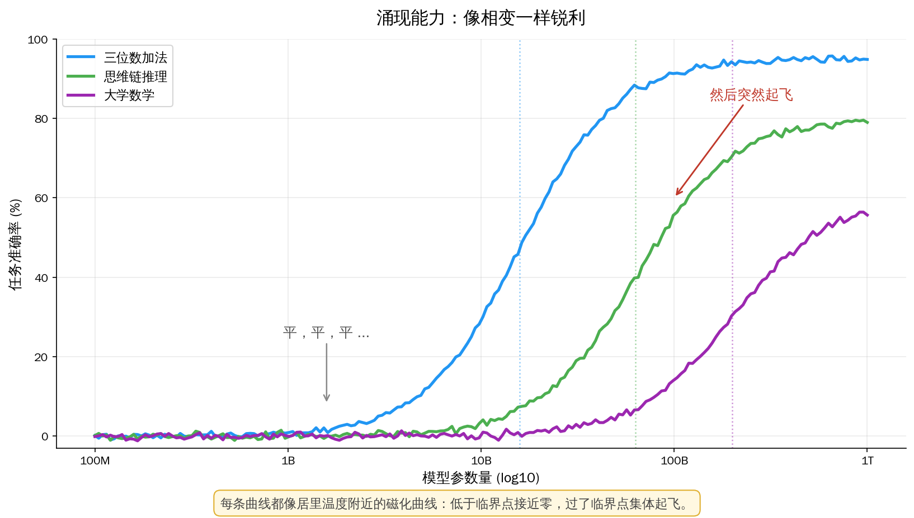

## 上一篇回顾

熵不是公式，是人类第一次承认"我不知道"，并把这份无知量化。玻尔兹曼把它定义成**微观状态的对数**，Shannon 把它定义成**消息的不确定性**。两件事在本质上是同一件事——**压缩**。

这一篇，我们讨论另一个同样古老、同样深刻的现象：**相变**。

---

## 开篇：99 度和 100 度之间

你烧一壶水。温度计在 99 度。水还是水——液态、透明、有流动性。

再加一秒钟，温度计到 100 度。水开始沸腾——气泡从底部冒上来，一部分液体**突然**变成气体。

**这一度里发生了什么？**

物理学家花了 150 年回答这个问题。因为这里有一件很奇怪的事：

- 从 20 度加热到 99 度——水的每一个属性（密度、粘度、热容）都**平滑地**变化
- 从 99 度到 100 度——水的属性**突然**跳变。密度从 1000 kg/m³ 变到 0.6 kg/m³，整整少了三个数量级

**平滑 + 平滑 + 平滑 + ... + 突然。**

物理学家给这个"突然"取了个名字：**相变**（phase transition）。

这个概念不只是用来解释烧水。它是一个**普适的**数学结构，存在于：

- 磁铁加热——居里温度以下是磁的，以上是非磁的
- 超导体——临界温度以下电阻为零，以上正常导电
- 液晶显示器——温度变化，液晶分子方向突变
- 细胞信号传递——信号强度到某个阈值才触发
- **AI 模型涌现能力**——这是本文真正想带你到的地方

---

## 第一章：磁铁的秘密

为了把相变讲清楚，物理学家喜欢用一个比水更干净的例子：**铁磁体**。

拿一块磁铁，它能吸引铁钉——因为内部无数个原子磁矩**整齐地排成一个方向**。

现在把这块磁铁加热。加到大约 770 度（铁的**居里温度**），一件神奇的事发生了：

**磁性突然消失。**

不是逐渐减弱——是到了某个精确温度，磁性几乎在一瞬间归零。冷却下来，它又恢复。

这件事让 19 世纪末的物理学家非常困惑。他们能接受"温度高了原子震动大了排列乱了"——但**为什么是突然的？** 为什么不是平滑地弱下去？

这个问题等了 50 年才有真正的答案。

---

## 第二章：Ising 模型——物理学最简单的"玩具"

1920 年，德国物理学家 Wilhelm Lenz 给他的学生 Ernst Ising 提了一个博士课题：**用最简单的模型解释铁磁性**。

Ising 提出的模型简单到不可思议：

> 想象一条直线上排列着 N 个"小磁针"（自旋），每个只能取两个方向：**↑** 或 **↓**。
>
> 规则：
> - 相邻的两个自旋如果**同向**，能量低（相互吸引，喜欢这样）
> - 相邻的两个自旋如果**反向**，能量高（相互排斥）
> - 温度越高，系统越不在乎能量，越倾向于随机
> - 温度越低，系统越倾向于集体对齐

问：温度从高到低，这一排自旋会怎么变化？

Ising 算出来了——**一维的情况下，永远不会出现磁化**。高温低温都一样，集体自旋方向都是 0（平均）。

这个结果让 Ising 本人灰心丧气——他以为这个模型不能解释铁磁性，就转行不干物理了（他后来当了中学老师）。

**但 Ising 错了——错在他只算了一维。**

20 年后，1944 年，挪威物理学家 Lars Onsager 解出了**二维 Ising 模型**——把自旋排成一张棋盘格。

**结果震惊世界：**

- 在某个临界温度 T_c 以下，所有自旋**突然集体对齐**——出现磁化
- 在 T_c 以上，磁化为 0
- 这个转变是**锐利**的——不是平滑过渡

这是人类第一次**从微观第一性原理推出宏观的相变**。Onsager 的这篇论文被认为是 20 世纪最困难的数学物理成就之一。

**但我们要问的问题还没解决：为什么是"突然"的？**

---

## 第三章：临界点附近——发生了什么诡异的事情

Onsager 的解还揭示了一件更诡异的事。

在临界温度 T_c **附近**——就那一小片温度区间——**系统的每一个性质都变得疯狂**。

- **关联长度**（两个自旋相互影响的距离）→ 变得无穷大
- **磁化率**（对外磁场的响应）→ 发散到无穷
- **比热**（温度每升高一度吸收多少热量）→ 发散到无穷

换句话说：

> **在临界点附近，这个系统里**每一个原子都和每一个原子相关**。不只是它的邻居、邻居的邻居——而是**所有的**。**

这叫**长程关联**。正常情况下，你推动一个原子，只能影响它附近。临界点附近，你推动一个原子，**整个系统都在回应**。

**这就是为什么相变是"突然"的：临界点不是一个普通的点，是一个**奇点**——在那里，微小的扰动可以引起全局的改变。**

这也是为什么物理学家对临界点着迷。临界点是一个**自然界把小变成大的机器**。

---

## 第四章：Kadanoff 和 Wilson——缩放的视角

1966 年，芝加哥大学的物理学家 Leo Kadanoff 想到了一个革命性的办法来理解相变。

他说：我们不要算方程，我们来**放大或缩小**看这个系统。

想象你在看一张 Ising 模型的棋盘，2x2 像素分辨率。每 4 个自旋合并成一个"块自旋"——按多数决定方向（3 个 ↑ 和 1 个 ↓ → 合并为 ↑）。

**关键观察：** 在临界温度，放大或缩小看，**系统看起来是一样的**。

不是完全一样——但统计性质（磁化、涨落模式）**尺度不变**。这叫**自相似**。

这和云、海岸线、山脉一样。云远看是云，近看还是云——形状不同但统计相似。这叫**分形**。

> **相变临界点是一个尺度不变的系统。**

1971 年，康奈尔大学的 Kenneth Wilson 把 Kadanoff 的直觉发展成一套完整的数学——**重整化群**（renormalization group, RG）。Wilson 因此拿了 1982 年诺贝尔物理学奖。

RG 的洞见是这样的：

> 想象一个操作 R，它把一个系统缩放一倍（4 个自旋合并成 1 个，相当于"放远一步看"）。
>
> 在临界温度 T_c：应用 R 之后，系统**变回自己**。T_c 是 R 的**不动点**。
>
> 在 T_c 以上：应用 R 之后，系统越来越"无序"，远离临界点
> 在 T_c 以下：应用 R 之后，系统越来越"有序"，远离临界点

**这就是为什么相变有普适性**——水、磁铁、超导体——都在各自的临界点附近向同一个数学结构靠拢，这些结构叫**普适类**（universality classes）。

一个临界点决定了系统在它附近的所有行为。这个在物理学里叫 **普适性**（universality）——**微观细节不重要，临界点附近只有几个关键参数。**

---

## 第五章：从物理到 AI——涌现

让我们把这套物理直觉带到 AI 领域。

2022 年 6 月，Google 和 Stanford 的研究者联合发表了一篇论文：*Emergent Abilities of Large Language Models*。

他们在图表上画了这样的曲线：

- **横轴**：模型参数量（10 亿 → 1000 亿 → 1 万亿）
- **纵轴**：某个任务的准确率（比如三位数加法、大学数学、思维链推理）

对小模型——准确率接近 0。
对更大的模型——准确率接近 0。
对再大的模型——准确率接近 0。
**然后到某个参数量——准确率突然跳到 50%、80%。**

这些被叫做**涌现能力**（emergent abilities）。

举几个具体例子：

- **大三位数加法**：在 GPT-3 小模型里是 0%。到了某个规模，突然到 80%
- **大学数学题**：在 GPT-3.5 水平几乎做不出。到 GPT-4 规模，能做出一大半
- **In-context learning**（根据几个例子学会新任务）：小模型完全做不到。大模型能做到

**这看起来像什么？像相变。**

2022-2024 年，AI 圈对此展开激烈争论：

- **OpenAI/DeepMind 派：** 这是真的涌现，像水到 100 度突然沸腾
- **Stanford 派（Schaeffer et al. 2023）：** 这是测量幻觉。准确率是离散的 0/1 指标，如果换成连续指标（困惑度、BLEU），会看到平滑改善
- **统计物理派（MIT、Santa Fe Institute）：** 即使底层是平滑的，**高层行为仍然表现出相变**——因为不是随机神经元突然开始工作，是**集体行为**发生了质变

第三种观点是我认为最有道理的。

---

## 第六章：Grokking——AI 的临界点

2022 年 1 月，OpenAI 研究者 Alethea Power 等人发表了一篇让所有人震惊的论文：*Grokking: Generalization Beyond Overfitting on Small Algorithmic Datasets*。

他们做了这样一个实验：

- 训练一个小 Transformer 做模算术（比如 $a + b \bmod 97$）
- 给它看 30% 的可能输入作为训练集

结果：

- **训练集** 100 步就被过拟合完了——训练准确率 100%
- **测试集** 几万步都是随机猜——准确率 1%（= 1/97）
- 然后继续训练...训练...训练...
- **到大约 10000 步**，测试准确率突然从 1% 跳到 100%

**模型突然"开窍"了**——从记忆模式突然变成**理解规则**。

这个现象叫 **grokking**（源自 Heinlein 小说《异乡异客》，意为"彻底领悟"）。

后续研究（Nanda et al. 2023）用可解释性工具打开模型看：

- 过拟合阶段：模型里是一堆乱七八糟的**记忆电路**
- 临界点附近：**离散傅立叶变换的表示**开始从噪声里浮现
- Grokking 之后：整个模型变成一个漂亮的**加法机**

**这和 Ising 模型的相变一模一样**：

|            | Ising 相变             | Grokking              |
| ---------- | ---------------------- | --------------------- |
| 控制参数   | 温度 T                 | 训练步数（或学习率）  |
| 序参数     | 磁化                   | 测试准确率            |
| 临界点     | 居里温度 T_c           | Grokking 步数         |
| 临界点以下 | 无序（自旋乱）         | 记忆（测试失败）      |
| 临界点以上 | 有序（自旋对齐）       | 理解（测试成功）      |
| 过渡       | 锐利、集体、普适       | 锐利、集体、疑似普适  |

当你让一个物理学家看 grokking 曲线，他的第一反应是：**"这是相变"**。

这不是巧合。神经网络在训练时，**参数空间**的行为和物理系统在**相空间**的行为有深层的数学相似。两者都是在高维空间里寻找低能态，两者都可能在临界点附近发生集体的结构重组。

---

## 第七章：涌现是真的吗？——Jason Wei 的辩护

这里要认真反驳一下 Schaeffer 2023 那篇"涌现是测量幻觉"的论文。

他们的论点是：如果你把评估指标从"精确匹配（0 或 1）"换成"每个 token 的对数概率"，曲线就变成连续上升。

**但这忽略了一件事：**

> **人类评估 AI 就是用精确匹配评估的**。律师不会看到"这个判例名称 47% 正确"就接受 —— 要么正确，要么错。

**准确率的非线性**不是幻觉，它是**实际使用场景中的真实现象**。Google 股价蒸发 1000 亿不是因为 Bard 的 perplexity 高了 5%，是因为它**答错了**。

更重要的是——即使是连续的改善曲线，在大量任务上都显示出**临界行为**：

- 加法任务：从 5B 参数以下基本不行，5B 以上快速改善
- 思维链：小模型 CoT 提示**反而损害**性能，大模型 CoT 提示**大幅提升**性能——这种符号翻转是相变的典型特征
- 指令跟随：没到某个规模，完全不跟随 ; 到了某个规模，几乎完美跟随

**我的判断：涌现能力既是真的，也需要谨慎。**

- **真的**——因为在实际可用性意义上，大模型和小模型存在质的差别
- **谨慎**——因为我们不知道**下一个涌现能力**会在什么规模出现。这是为什么 AGI 时间线这么难预测

---

## 第八章：把相变的直觉装进脑子

我想留给你一套直觉工具。任何时候你看到"突然的、集体的、普适的"改变，都可以问：

**1. 这是相变吗？**

- 有没有一个可调参数（温度、模型大小、学习时长）？
- 有没有一个临界值，过了就"开窍"，没过就不行？
- 这个过渡是锐利的还是平滑的？

**2. 是什么在集体变化？**

- 相变的核心是**集体行为**。不是单个原子变化，是一大群元素集体改变。
- 在 AI 里：不是单个神经元突然"理解"了，是**一整个表示结构**突然重组了。

**3. 有没有长程关联？**

- 临界点附近，远处的元素也会响应——"牵一发而动全身"。
- 在 AI 里：grokking 的时候，改一个参数会让整个网络的性能跳变——这就是关联长度发散的迹象。

**这三个问题，就是物理学家 150 年攒下来的相变直觉的全部精华。**

---

## 第九章：为什么是相变，不只是比喻？

有人会说："AI 涌现和物理相变只是比喻，别当真。"

**我不同意。**

这两件事共享一个更深的数学结构——**复杂系统在高维空间的集体行为**。Ising 模型、神经网络训练、经济泡沫、鸟群转向、细胞分化，它们在数学上属于同一族：

> **大量元素**，**简单局部规则**，**随某个参数的连续改变**，在**某个临界值**发生**集体的质变**。

这不是"像"，这是**是**。

物理学花了 150 年（从 Van der Waals 1873 到 Wilson 1971）建立了描述这件事的数学。AI 研究者现在正在借用这套工具。Santa Fe Institute、MIT、Max Planck Institute 都有专门研究神经网络 RG（重整化群）的小组。

**AI 是下一个物理实验室。**

不是因为神经网络是物理对象，而是因为它们和物理对象**共享同一门数学**。

---

## 第十章：回到开篇

让我们回到 99 度和 100 度之间那一度。

物理上，那一度里发生的事是：**水分子之间的氢键集体瓦解**。前面每一度都在积累——但每一度都不够。直到 100 度——**突破临界点**。

哲学上，这一度告诉我们一件事：

> **世界不是平滑的。**

它充满了临界点、奇点、相变。大部分时间里，事情以渐进方式发生。但每隔一段，一个临界点就到了，世界**突然**进入另一个状态。

这个洞察不只适用于物理。它适用于：

- **历史**：法国大革命前的法国社会，每一天都和前一天差不多。到某一天——就爆了
- **个人**：你学某门学科，前 1000 小时可能都是混沌。然后某一刻你"开窍"
- **技术**：Transformer 架构 2017 年出来时没人觉得是革命性的。到某个规模——整个世界被它重塑
- **AI**：我们可能正在某个临界点附近。不知道下一步是什么——但知道一定**不是平滑的延长**

**相变告诉我们：**质变**是累积到临界的**量变**的结果。但"累积"和"临界"都是事后才看得清的东西。**

这就是为什么历史总是让我们意外。这就是为什么 AI 的下一步让我们害怕又兴奋。

**我们在等下一个临界点。**

---

## 📖 下一篇预告：《看见物理（七）：量子——观察者与被观察》

为什么电子有时像粒子、有时像波？为什么测量会改变结果？贝叶斯和薛定谔在本质上说的是同一件事吗？量子力学的奇怪之处，在于它强迫你把**观察者**放进方程里——这是人类科学史上最革命的一步，也是 LLM 生成每一个 token 的基础。

---

## 📚 延伸阅读

- Wen et al., 2022, [*Emergent Abilities of Large Language Models*](https://arxiv.org/abs/2206.07682)
- Schaeffer et al., 2023, [*Are Emergent Abilities of Large Language Models a Mirage?*](https://arxiv.org/abs/2304.15004)
- Power et al., 2022, [*Grokking: Generalization Beyond Overfitting*](https://arxiv.org/abs/2201.02177)
- Nanda et al., 2023, [*Progress Measures for Grokking via Mechanistic Interpretability*](https://arxiv.org/abs/2301.05217)
- Kenneth G. Wilson, 1971, *Renormalization Group and Critical Phenomena*（诺贝尔奖基础）
- Stanley, H. E., 1971, *Introduction to Phase Transitions and Critical Phenomena*（经典教材）
