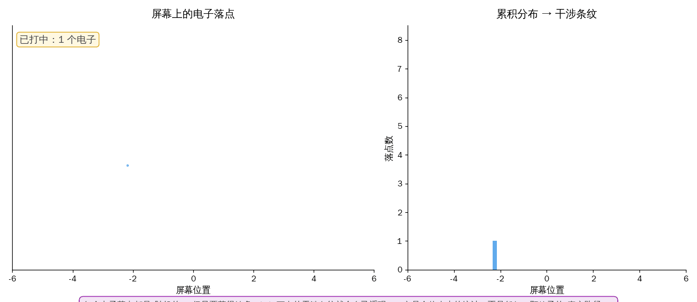
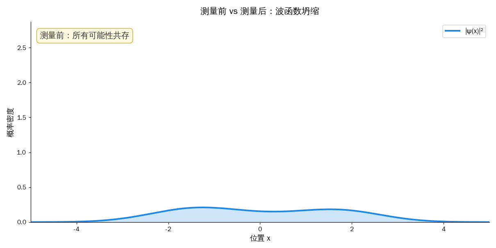
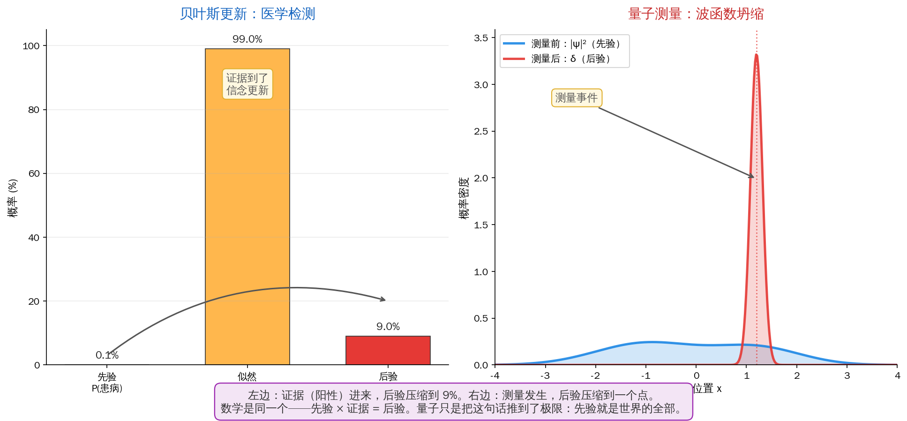

## 上一篇回顾

上一篇讲了相变——一群水分子在 99 度到 100 度之间的那一秒，集体做出了决定：不再当液体。

相变教我们：**世界在大多数时候是平滑的，但在某些特殊点上会发生集体的、锐利的、不可预测的跳变。** 涌现能力、Grokking、Double Descent——它们都是这套"突然"的现代表弟。

但相变再神奇，它描述的仍然是**一群**粒子的行为。温度、密度、磁化强度，都是统计量——你把 10²³ 个粒子的行为平均一下才能看到相变。

那**单个**粒子呢？

你可能以为：个体行为平凡无奇，奇妙的是"群体"。

**但量子力学告诉我们，真正的诡异不在大，而在小。一颗电子，就足以颠覆整个古典世界观。**

> **系列导航**
>
> <div style="max-width: 660px; margin: 0.5em 0; font-size: 0.93em; line-height: 1.9;">
> <div style="border-left: 3px solid #ccc; padding-left: 12px; margin-bottom: 6px; padding: 8px 12px; color: #888;">
> ▹ <a href="/ai-blog/posts/see-physics-1-motion/" style="color: #888;">第一篇：运动——世界从"动"开始</a></div>
> <div style="border-left: 3px solid #ccc; padding-left: 12px; margin-bottom: 6px; padding: 8px 12px; color: #888;">
> ▹ <a href="/ai-blog/posts/see-physics-2-force/" style="color: #888;">第二篇：力——看不见的手</a></div>
> <div style="border-left: 3px solid #ccc; padding-left: 12px; margin-bottom: 6px; padding: 8px 12px; color: #888;">
> ▹ <a href="/ai-blog/posts/see-physics-3-energy/" style="color: #888;">第三篇：能量——不灭的守恒量</a></div>
> <div style="border-left: 3px solid #ccc; padding-left: 12px; margin-bottom: 6px; padding: 8px 12px; color: #888;">
> ▹ <a href="/ai-blog/posts/see-physics-4-momentum/" style="color: #888;">第四篇：动量——惯性的力量</a></div>
> <div style="border-left: 3px solid #ccc; padding-left: 12px; margin-bottom: 6px; padding: 8px 12px; color: #888;">
> ▹ <a href="/ai-blog/posts/see-physics-5-entropy/" style="color: #888;">第五篇：熵——承认无知的勇气</a></div>
> <div style="border-left: 3px solid #ccc; padding-left: 12px; margin-bottom: 6px; padding: 8px 12px; color: #888;">
> ▹ <a href="/ai-blog/posts/see-physics-6-phase-transition/" style="color: #888;">第六篇：相变——量变到质变的数学</a></div>
> <div style="border-left: 3px solid #FF9800; padding-left: 12px; margin-bottom: 6px; background: rgba(255,152,0,0.05); padding: 8px 12px; border-radius: 0 4px 4px 0;">
> <strong>▸ 第七篇（本文）：量子——观察者与被观察</strong></div>
> </div>

---

## 第一章：爱因斯坦下半生不得安宁的那句话

1927 年 10 月，比利时布鲁塞尔，索尔维（Solvay）国际物理学会议。

29 个人挤进一张合影——其中 17 个人拿过或将要拿诺贝尔奖。坐在前排正中的是爱因斯坦，他 48 岁，是这个房间里最有名的人。

但主角不是他。主角是一群比他年轻十几岁的人：玻尔、海森堡、薛定谔、狄拉克、泡利——他们带着一套刚刚拼凑好的新物理学：**量子力学**。

这套理论的核心主张，让爱因斯坦无法接受：

- **粒子的位置不是一个确定的数，而是一个概率分布**
- **在你测量之前，问"电子在哪里"这个问题没有答案**
- **不是"我们不知道它在哪"——而是它根本就不在任何地方**

会议间隙，爱因斯坦对玻尔说了一句后来被引用了一万次的话：

> **"上帝不掷骰子。"**
>
> —— Einstein to Bohr, 1927

玻尔毫不客气地回了一句：

> **"爱因斯坦，不要再告诉上帝该做什么了。"**

这场辩论持续了整整 28 年，直到爱因斯坦 1955 年去世。他没有赢。

但真正的问题不在"谁赢"——真正的问题是：**玻尔说的那套到底是什么意思？**

在**没人看**的时候，电子在哪里？

这一篇，就是关于这个看似无聊、实则深不见底的问题。

---

## 第二章：双缝实验——粒子在等什么？

在讲量子力学之前，让我先给你看一个实验。它简单到可以在高中物理课里演示，奇怪到每一个看懂的人都会失眠。

**实验装置：** 一支电子枪，朝一块挡板发射电子。挡板上开两道细缝。缝后面放一张感光屏。

电子枪一次**只发射一个**电子。每个电子要么穿过左缝，要么穿过右缝，然后打在感光屏的某个位置上。

你关掉灯，开枪。一声响，屏上出现一个亮点。

再一声响，又一个亮点。

再，再，再——

你打了 10 个，看起来是随机分布。打了 100 个，还是随机。打了 1000 个——

**屏上慢慢浮现出一排明暗相间的干涉条纹。**



等等。这不对劲。

**干涉条纹是"波"才有的现象。** 当两列波同时穿过两条缝，它们会在某些位置同相叠加（更亮），在某些位置反相抵消（更暗）。这就是光学课讲过的托马斯·杨实验（1801）。

**但电子不是波，电子是粒子。** 而且你是**一个一个**发的，每次只有一个电子在装置里——它在和谁干涉？

一个可能的解释：每个电子在穿过缝时，分成两半，一半穿左缝，一半穿右缝，然后**自己和自己干涉**。

那我们来验证一下。在左缝旁边放一个小探测器，看看电子到底走了哪一边。

**实验重做。一个个电子打过去。**

屏上——

**干涉条纹消失了。** 只剩下两团随机的亮点堆——左缝一团，右缝一团，像两个独立的散弹目标。

**你一看它，它就"老实"了。**

你把探测器拿掉，不看。条纹又回来了。

放回去看。条纹又消失。

这个实验的恐怖之处在于：**"看"不是一个被动的动作**。你放一个探测器，不管这探测器多温柔多无害，只要它能记录"电子从哪边过"，这个信息一旦存在，干涉就死了。

物理学家把这叫做"which-path information"。它的含义很残酷：

> **有些信息的存在方式，本身就改变了实验的结果。**

---

## 第三章：波函数——世界的"可能性云"

双缝实验逼着物理学家接受一件事：**电子不是小弹珠。** 弹珠走一条路，但电子走"所有的路"。

于是有了**波函数**（wave function）。

1926 年，奥地利物理学家薛定谔（Erwin Schrödinger）写下了那条后来挂在无数大学办公室上的方程：

$$
i\hbar \frac{\partial \psi}{\partial t} = \hat{H} \psi
$$

你不需要看懂它——你只需要知道 ψ（"普赛"）代表什么。

**ψ(x, t) 不是粒子的位置。** 它是一个复数函数，对每个时空点 (x, t) 给出一个值。

真正有物理意义的是它的模的平方 **|ψ(x, t)|²**，玻恩（Max Born，1926）告诉我们：

> **|ψ(x, t)|² = 在时刻 t、位置 x 找到这个粒子的概率密度。**

注意这句话的微妙：ψ 不是粒子，ψ 是关于粒子的概率分布。一颗电子对应一朵"可能性的云"，这朵云在空间中伸展、振荡、弥散。

在双缝实验里，ψ 穿过左缝产生一朵云，穿过右缝产生另一朵云，两朵云在屏前相遇，**干涉**。屏上每个位置的亮度 = |ψ 左 + ψ 右|²——这就是条纹。

所以"一个电子同时走两条缝"并不是说电子像果冻一样真的被掰成两半。它的意思是：

> **ψ 这朵云既可以穿过左缝，也可以穿过右缝——而"哪一朵真正发生了"，在没测量前没有答案。**

然后你测量。你把探测器放在屏上，记下电子打在哪里。

**这时候 ψ 做了一件极其奇怪的事：它瞬间"坍缩"——从一朵弥散在整个屏上的云，压缩成你刚刚测到的那一个点。**



坍缩之前，粒子"在所有地方又不在任何地方"。
坍缩之后，粒子"就在这里"。

**中间发生了什么？**

薛定谔方程**不能回答这个问题**——因为坍缩不是由它描述的。薛定谔方程告诉你波函数怎么平滑演化，但测量那一瞬的"跳"，方程里没有。

物理学给这个跳起了一个含糊的名字：**测量问题**（measurement problem）。

而"测量"到底是什么？这个问题从 1927 年问到今天，**没有公认的答案**。

---

## 第四章：薛定谔的猫

薛定谔自己对这套理论也不舒服。他本来是想用 ψ 来**拯救**古典物理——他以为 ψ 可以像声波一样是某种真实的扰动。

但玻恩和玻尔说：不，ψ 只是概率。

薛定谔气坏了。1935 年，他写了一篇论文，里面编了一个极其恶毒的思想实验，打算一锤子把这套概率解释砸扁。这就是传说中的**薛定谔的猫**。

<div style="max-width: 660px; margin: 1.5em auto; padding: 20px; border-radius: 8px; background: rgba(255,152,0,0.06); border: 1px solid rgba(255,152,0,0.2);">

<div style="font-weight: bold; margin-bottom: 12px; color: #FF9800; font-size: 1.05em;">薛定谔的思想实验</div>

一只活猫，关在一个铁盒里。

盒里有：
- 一个放射性原子（每小时有 50% 概率衰变）
- 一个盖革计数器（探测衰变）
- 一个毒气瓶（被计数器触发后释放毒气）

一小时后，原子的波函数是"衰变 + 未衰变"的叠加态。

按量子力学的规则，**整个系统**——原子、计数器、毒气、猫——都应该处于**叠加态**。

**问：打开盒子之前，猫是死是活？**

</div>

薛定谔的目的是**归谬**：一颗原子在叠加态我能忍，但猫在"又死又活"的叠加态——这太荒谬了，说明这套理论有毛病。

**结果事与愿违。** 物理学家们看完文章说：没错，猫就是又死又活的。

这不是一个让量子力学丢脸的思想实验——这是一个**把测量问题逼到台前**的思想实验。

因为它问了一个无法回避的问题：

> **"测量"到底是什么？是探测器盖革计数器咔嗒一声？是毒气释放？是猫死了？是你打开盒子？还是你意识到猫死了？**
>
> **这条链条，坍缩到底发生在哪一环？"**

- 如果坍缩发生在原子层面——那么为什么电子双缝不在电子离开缝的瞬间就坍缩？
- 如果坍缩发生在宏观物体层面——那么"宏观"的界线在哪里？10 个原子？10¹⁰ 个？
- 如果坍缩发生在意识接触信息的瞬间——那在这之前，月亮真的在那里吗？

这些问题至今没有公认答案。物理学界分成了好几个教派：

- **哥本哈根派**（Bohr, Heisenberg）：别问这么多，计算出来对得上实验就够了。"Shut up and calculate."
- **多世界派**（Everett, 1957）：坍缩是幻觉，每次测量都分裂出一个平行宇宙。又死又活的猫分叉成"死猫宇宙"和"活猫宇宙"。
- **隐变量派**（de Broglie, Bohm）：粒子其实一直有确定位置，我们只是看不到"隐变量"。
- **QBism / 量子贝叶斯派**（Fuchs, Mermin, 2001+）：波函数不是世界的状态——是**观察者的信念**。—— 本文第七章要讲的主角。

在继续之前，我们得先处理掉一个重要的反对意见——**隐变量派**。因为爱因斯坦就是这一派的精神领袖，而他 1935 年还有最后一张牌没打。

---

## 第五章：爱因斯坦的最后一击——EPR 与贝尔

1935 年，爱因斯坦联合两位年轻同事波多尔斯基（Podolsky）和罗森（Rosen）发表了一篇论文，标题直接掀桌子：**《量子力学对物理实在的描述是否完备？》**

这就是物理学史上著名的 **EPR 悖论**。

爱因斯坦的论证思路大概是这样的：

1. 制造两个**纠缠**的粒子 A 和 B，让它们飞向相反方向，分开很远——比如 A 在地球，B 在月球。
2. 按量子力学，A 和 B 的属性（比如自旋）在测量前都是"叠加的"。
3. 但 A 和 B 有一个守恒律：它们的自旋**必须相反**。
4. 现在你测量 A，发现自旋朝上——那 B 的自旋必然朝下。
5. **问题来了：** B 是怎么"瞬间"知道自己应该朝下的？信息不是不能超光速吗？

爱因斯坦得出一个漂亮的结论：**要么量子力学允许超光速通信（他坚决不信），要么 A 和 B 其实早就各自有确定的自旋——只是量子力学没告诉我们。** 后者就是"隐变量"。

爱因斯坦的判决：**量子力学是一个不完备的理论。真实的物理图像比它更深。**

这个论证漂亮到让当时的玻尔头皮发麻。玻尔回应了，但回应含糊，大家都没听懂——也包括玻尔自己。

这件事就这样**悬而未决了 29 年**。

1964 年，北爱尔兰一个叫约翰·贝尔（John Bell）的物理学家做了一件看似不可能的事：**他把"是否有隐变量"这个哲学问题，变成了一个可以用实验验证的数学不等式。**

这就是**贝尔不等式**。它的核心思想是这样的：

> **如果爱因斯坦是对的（存在隐变量，且没有超光速），那么对纠缠粒子做某些特定组合的测量时，一个关于相关度的数值必须 ≤ 2。**
>
> **如果玻尔是对的（量子力学是完备的），那个数值可以达到 2√2 ≈ 2.83。**

两种世界观给出了**不同的数字**。谁对谁错，做实验就行。

1972 年，第一次实验。1982 年，法国物理学家 Alain Aspect 做了第一个真正严谨的实验。结果——

**2.70 ± 0.05。** 明显大于 2。

爱因斯坦错了。

之后四十年，不同实验室用不同粒子、不同距离、不同方法，把所有可能的漏洞一个个堵上。2015 年，代尔夫特大学做出了"无漏洞贝尔实验"——结论同样无情：

> **不存在隐变量。量子力学就是完备的。世界在根子上是概率的。**

2022 年，诺贝尔物理学奖颁给了 Aspect、Clauser、Zeilinger 三人——表彰他们用实验证明了：

**爱因斯坦错了，而且错得很彻底。**

---

## 第六章：概率到底是什么？

好。让我们暂停一下。

我们刚刚在三章里走完了量子力学最戏剧性的那段路：双缝 → 波函数 → 坍缩 → EPR → 贝尔 → 诺奖。结论是：**世界在根子上就是概率的。**

但这句话——**"世界在根子上就是概率的"**——到底是什么意思？

你可能没意识到，它其实非常古怪。

让我们把它和上一篇讲过的**经典概率**作对比。

<div style="max-width: 700px; margin: 1.5em auto; padding: 20px; border-radius: 8px; background: rgba(33,150,243,0.06); border: 1px solid rgba(33,150,243,0.2);">

<div style="font-weight: bold; margin-bottom: 12px; color: #2196F3; font-size: 1.05em;">经典概率 vs 量子概率</div>

**经典概率**（骰子、热力学、熵）：

- 骰子掉在桌上是 3 点——这个结果由骰子的精确初始条件 + 空气流动 + 桌面摩擦力**唯一决定**
- 我们说"有 1/6 概率是 3 点"只是因为**我们不知道**这些初始条件
- **概率 = 对无知的定量描述**
- 这是[上一篇](/ai-blog/posts/see-physics-5-entropy/)讲的熵：熵 = 你不知道的信息量

**量子概率**（电子位置、自旋）：

- 电子落在屏的 x 位置——贝尔实验告诉我们，这个结果**不是由任何隐藏变量决定的**
- 即使你知道全宇宙的所有信息，你仍然只能说"有 |ψ(x)|² 的概率落在 x"
- **概率不是无知，概率就是实在本身**

</div>

这是量子力学最让人睡不着觉的地方。

经典概率是一把"无知的遮羞布"——只要你愿意努力，原则上可以把概率消除，换成确定性。

**量子概率是"布后面没有东西"。** 遮羞布就是真相。

这个世界观让很多物理学家无法接受。因为你可以追问：

- 如果概率不是对某个底层真相的无知，那它是关于**什么**的？
- 如果电子没有确定位置，那"电子"这个词到底在指什么？
- "一个粒子" 和 "一个概率分布"——哪个才是实在？

整整一个世纪，物理学家用三种不同的答案来应付：

1. **别问**（哥本哈根派）：闭嘴计算。
2. **都在**（多世界派）：每一种可能都真实存在，分裂成多个宇宙。
3. **信念**（QBism）：波函数不是关于世界的陈述，是关于**你**的陈述。

前两种答案都试图**保住实在**——要么让它躲在"不该问"的角落，要么让它膨胀成无数个宇宙。

只有第三种，彻底放弃了"实在"这个旧框架——然后给了我们一个惊人的新视角。

这个视角，和你上个月读过的**一篇文章**有关。

---

## 第七章：量子贝叶斯主义——Fuchs 的答案

你还记得[贝叶斯定理那篇文章](/ai-blog/posts/bayes-not-expected/)里那个医学检测的题目吗？

一个罕见病患病率 0.1%，检测准确率 99%。你的检测结果是阳性。真正患病的概率是多少？

**答案不是 99%，是 9%。**

为什么？因为你有**先验**（绝大多数人没病）。阳性这个**证据**确实让你更新了信念，但它没把你推到 99%，只推到了 9%。

贝叶斯定理的简化形式是：

$$
\underbrace{P(\text{病} | \text{阳性})}_{\text{后验}} \propto \underbrace{P(\text{阳性} | \text{病})}_{\text{似然}} \times \underbrace{P(\text{病})}_{\text{先验}}
$$

先验 × 证据 = 后验。

你的每次"学习"都是这样一个更新。贝叶斯派对概率的主张是：**概率不是"客观的频率"，而是"某个主体在某个证据状态下的合理信念"。**

现在请你戴上这副眼镜，重读量子测量。

2001 年，美国物理学家 **Christopher Fuchs** 和两位同事（Schack, Caves）提出一个激进的想法，后来叫 **QBism**（Quantum Bayesianism，量子贝叶斯主义）：

> **波函数 ψ 不是世界的状态。**
>
> **|ψ(x)|² 不是一个"客观的概率"——它是观察者关于"如果我测量会得到什么"的主观信念。**
>
> **测量不是"揭开真相"——测量是观察者进行一次贝叶斯更新的过程。**
>
> **坍缩不是物理事件——坍缩就是你的信念从先验分布更新到后验分布。**

让我们一一翻译：

| 贝叶斯（医学检测） | 量子（QBism 视角） |
|---|---|
| 先验 P(病) = 0.1% | 波函数 \|ψ\|² ：测量前的信念分布 |
| 证据：检测阳性 | 测量事件：探测器响了 |
| 似然 P(阳性\|病) | 算符的谱：每个可能结果对应的投影 |
| 后验 P(病\|阳性) = 9% | 坍缩后的波函数：新的信念分布 |



这张图的核心是：**左边和右边用的是同一套数学。**

先验 × 证据 = 后验。

只不过在医学检测里，先验是关于"病人到底有没有病"的信念——背后有一个事实在那里，我们只是不知道。在量子测量里，QBism 说：**先验就是世界的全部**。没有"背后的事实"，ψ 就是一切。测量那一刻，观察者把自己的信念更新了，仅此而已。

这个视角一下子解决了薛定谔的猫那个"坍缩到底发生在哪一环"的问题——

**QBism 的答案：坍缩发生在观察者学习到新信息的那一刻。** 它不是一个物理事件，它是一个**信息事件**。猫对自己的状态没有疑问；盖革计数器也没有；"又死又活"只存在于**还没打开盒子的你**的信念里。你打开盒子，你更新信念，坍缩就发生了——**但这个坍缩只发生在你这里**。它甚至不是同时发生在你和旁边同事身上：同事还没看，对他来说猫还是叠加的。

这听起来像唯我论，但 QBism 小心地避开了。它不说"意识创造实在"——它只说：**"波函数是关于我的，不是关于猫的"**。

就像概率 0.1% 是关于"我这个预测者"的，不是关于"病人体内"的。

这个观点**没有解决所有问题**（物理学没有哪派能解决所有问题）。但它完成了一件极其漂亮的事：

> **它让量子力学变成了贝叶斯定理的一种极端形式——一种把"信念"推到实在根基上的贝叶斯定理。**

**你去年读了贝叶斯文章。那篇文章告诉你："学习就是信念的更新。"**

**这一篇告诉你：物理学 100 年的争吵，最后绕回了同一句话。**

---

## 第八章：AI 里的"波函数"

到这里，如果你一直跟着这个系列走，你可能已经猜到了 AI 的位置。

让我们把 QBism 的结构拿到手边，对着 LLM 比划一下。

**LLM 生成文字的过程是什么？**

给定一段上文，模型输出一个关于"下一个 token"的概率分布。比如你输入：

> "今天天气很"

模型输出大致是：

| Token | 概率 |
|---|---|
| 好 | 0.42 |
| 不错 | 0.18 |
| 糟糕 | 0.11 |
| 冷 | 0.09 |
| ……（几万种可能）…… | … |

这个分布就是**模型关于"下一个字该是什么"的信念**。

你执行一次**采样**，随机抽一个 token。比如抽到"好"。

**看到了吗？**

- 采样前：分布弥散在整个词表上——"好"和"糟糕"都有可能
- 采样后：一个具体的 token 出现了
- 下一步推理开始时：模型基于这个新 token 重新计算下一个分布

这个过程和波函数坍缩**在数学结构上是一样的**：

$$
\underbrace{p(\text{下一个 token})}_{\text{先验分布}} \;\xrightarrow{\text{采样}}\; \underbrace{\text{具体的 token}}_{\text{观察事件}} \;\xrightarrow{\text{新 context}}\; \underbrace{p(\text{再下一个 token})}_{\text{更新后的先验}}
$$

对照一下：

| 量子（QBism） | LLM 生成 |
|---|---|
| 波函数 ψ | 模型输出的 next-token 分布 |
| \|ψ\|² | softmax 概率 |
| 测量事件 | sampling（采样 + 解码） |
| 坍缩到具体结果 | 生成出一个具体 token |
| 温度（热力学类比） | temperature 参数（控制分布锐度） |

这个对应**不是比喻**——采样本身就是"从概率分布中抽一个点"的数学操作，波函数坍缩也是"从 \|ψ\|² 中抽一个点"的数学操作。**它们是同一个动词。**

再看一个更直接的例子：**扩散模型**（Diffusion Models，Stable Diffusion / DALL-E 的底层）。

扩散模型的生成过程更像物理：

1. 从一张**纯噪声**的图开始（最大熵 = 最均匀的"先验"）
2. 一步步**去噪**，每一步都是在"根据已经确定的部分，更新对剩余部分的信念分布"
3. 最后收敛到一张具体的图（"坍缩"完成）

这整个过程用到的数学叫"随机微分方程的逆过程"——它字面上就是薛定谔方程的**扩散版**。2021 年 Yang Song 和 Stefano Ermon 的经典论文 *Score-Based Generative Modeling* 就是在把这个数学骨架讲清楚。

**你下次用 Stable Diffusion 生成一张图——注意看进度条。你看到的不只是像素在变清晰，你看到的是一个高维波函数在被你"一点点测量"。**

再往前一步，人类教 AI 的核心流程——**后训练（RLHF、DPO、SFT）**——本质也是贝叶斯更新：

- 预训练：在互联网海量数据上形成**先验**（模型的初始信念分布）
- SFT / RLHF：用高质量的人类反馈作为**证据**（似然）
- 微调后的模型：新的**后验**信念分布

这条链条在[贝叶斯定理那篇](/ai-blog/posts/bayes-not-expected/)里详细展开过。这里我们多加一句：**这条链条的数学形状，和量子测量是同一个形状。**

所以 LLM 生成文字、扩散模型画画、RLHF 对齐——三件事表面上毫不相关，底层都是同一件事：

> **维护一个关于世界的信念分布，然后在证据到来时，按贝叶斯的方式更新它。**

这就是 AI。这也是量子力学。这也是一个牧师 260 年前在英国小镇上写下的那条公式。

---

## 第九章：量子留给我们的三个直觉

让我们回到那只又死又活的猫。

量子力学走了 100 年，从爱因斯坦不服到贝尔不等式实验证伪再到 QBism 的重新解读。它给我们留下了三个深刻的直觉——任何你未来读 AI、读认知科学、读任何关于"信念与事实"的话题时，都可以用它们来解构。

**一、观察不是被动的。**

在经典世界里，你看一朵花不改变这朵花。在量子世界里，"看"这个动作定义了"被看到的是什么"。

这不是玄学——这是贝尔不等式实验反复验证的事实。它的现代含义是：**你对世界的描述，和你用什么方式问问题，紧紧绑在一起。** AI 问答里的"prompt 决定答案的质量"——是这件事的一个庸俗投影。

**二、信念和实在的界限是模糊的。**

QBism 的终极主张是：波函数是关于"你"的，不是关于"它"的。

这听起来像唯心主义，但它其实是一种极端的操作主义：**如果有两种描述在所有可能实验中都给出相同预测，它们就是同一件事。** "世界的真实状态"这种形而上学语言，不能做出任何预测，所以它可以被安全地扔掉。

这个态度在 AI 里有直接对应。LLM 的"理解"是否"真实"？它是否"真的知道"自己在说什么？
QBism 给你一个工具：**别问它的内部状态是什么，问它和环境的交互满足什么规则。** 如果规则对得上，描述就够了。

**三、概率是第一性原理。**

160 年前，玻尔兹曼说概率来自无知。100 年前，量子力学说概率就是实在本身。

这两件事不矛盾——它们是同一个光谱的两端。贝叶斯定理把它们缝在了一起：**任何概率都是关于某个主体在某个信息状态下的合理信念。** 主体可以是物理学家（熵），可以是测试病人的医生（医学贝叶斯），可以是生成文字的 LLM（next-token 分布），可以是宇宙本身（量子 \|ψ\|²）。

**它们用的是同一套数学。** 这不是巧合——这是这个系列从第一篇到现在一直在铺的暗线：**物理学和 AI 共享的，不是某个比喻，而是同一套描述世界的工具。**

---

## 尾声：从相变到量子

上一篇的结论是：**相变是无知中突然涌现的秩序。**

这一篇加了一句：**量子是秩序本身的不可消除的不确定性。**

相变讲的是**群体的突然**：一群水分子在一度之内集体决定不再当液体。
量子讲的是**个体的不确定**：一颗电子在测量前不在任何地方。

这两个"突然"合起来，就是 AI 今天的样貌——

- LLM 的涌现能力：模型规模的相变
- LLM 的 token 采样：波函数的坍缩
- RLHF 训练：贝叶斯式的信念更新

**一个由相变描述的宏观对象，内部运转着量子式的微观机制，通过贝叶斯式的规则学习世界。** 三层物理学，全部在现代 AI 系统里被同时启用。

下一篇（**第八篇**），是这个系列的**收官**：**对称性——诺特、杨振宁、宇宙的骨架**。我们会从守恒律回到最开始（第四篇动量），看看诺特定理如何把"守恒"和"对称"焊成同一件事，再看杨振宁如何把同一个想法推广到整个粒子物理的"标准模型"。对称性是**整个物理学的隐藏 API**——也是 AI 里等变性（equivariance）、归一化、旋转不变卷积的数学骨架。

在那之前——如果你这一篇只带走一句话，让它是：

> **量子力学不是关于"粒子在哪里"的理论，它是关于"一个观察者在何种信息状态下、持有何种合理信念"的理论。**
>
> **上帝不掷骰子。是你。**

---

## 附：Python 小实验——亲手做一次双缝

一段 30 行代码，从 \|ψ\|² 采样来重建干涉条纹。体会"每一发都是随机，累积起来是秩序"——这就是量子概率的全部精神。

```python
import numpy as np

print("=== 双缝实验：从 |ψ|² 采样看到干涉条纹 ===\n")

# 定义双缝产生的 |ψ|²（归一化的概率密度）
x = np.linspace(-6, 6, 600)
envelope = np.exp(-x**2 / 14.0)           # 缝的宽度决定的整体包络
pattern = envelope * np.cos(1.8 * x)**2   # 两列波干涉：cos² 条纹
pattern += 0.02                            # 加一个小底噪免得条纹绝零
pattern /= pattern.sum()                   # 归一化 → 概率分布

# 分阶段模拟"发射 n 个电子"
for n in [5, 50, 500, 5000]:
    hits = np.random.choice(x, size=n, p=pattern)
    # 用 40 个 bin 画简单字符直方图
    counts, edges = np.histogram(hits, bins=40, range=(-6, 6))
    max_c = counts.max() if counts.max() > 0 else 1
    print(f"━━━ 发射 {n} 个电子 ━━━")
    for c in counts:
        bar = "█" * int(c / max_c * 40)
        print(f"  {bar}")
    print()

print("观察：")
print("  n=5：  杂乱 —— 你说'这是粒子行为，随机的'")
print("  n=50： 有点起伏 —— 还不清楚")
print("  n=500：条纹开始显形 —— 波函数在浮现")
print("  n=5000：清晰的干涉条纹 —— |ψ|² 被完整重建")
print()
print("没有任何一颗电子'知道'干涉条纹的存在。")
print("条纹是 |ψ|² 的统计——是全体未来的分布，不是任何个体的路径。")
```

运行这段代码，你会看到条纹从噪声中浮现。这个过程——**从采样累积出分布**——就是物理学家做量子实验时，在屏幕前做了一万次的事情。

也是每次 LLM 生成一段话时，在内部隐藏做的事情。

---

## 延伸阅读

- Niels Bohr, 1928, *The Quantum Postulate and the Recent Development of Atomic Theory*
- Albert Einstein, Boris Podolsky, Nathan Rosen, 1935, [*Can Quantum-Mechanical Description of Physical Reality Be Considered Complete?*](https://journals.aps.org/pr/abstract/10.1103/PhysRev.47.777) —— EPR 原论文
- John S. Bell, 1964, [*On the Einstein-Podolsky-Rosen Paradox*](https://cds.cern.ch/record/111654/files/vol1p195-200_001.pdf) —— 贝尔不等式
- Alain Aspect et al., 1982, [*Experimental Test of Bell's Inequalities Using Time-Varying Analyzers*](https://journals.aps.org/prl/abstract/10.1103/PhysRevLett.49.1804)
- [The Nobel Prize in Physics 2022](https://www.nobelprize.org/prizes/physics/2022/summary/) —— Aspect, Clauser, Zeilinger
- Christopher A. Fuchs, 2010, [*QBism, the Perimeter of Quantum Bayesianism*](https://arxiv.org/abs/1003.5209)
- N. David Mermin, 2014, *Physics: QBism puts the scientist back into science*, Nature 507
- Hansen et al., 2015, [*Loophole-free Bell inequality violation using electron spins separated by 1.3 km*](https://arxiv.org/abs/1508.05949) —— 代尔夫特无漏洞实验
- Yang Song, Stefano Ermon, 2021, [*Score-Based Generative Modeling through Stochastic Differential Equations*](https://arxiv.org/abs/2011.13456) —— 扩散模型的 SDE 数学骨架
- **本系列内部链接：**
  - [《看见物理（五）：熵》](/ai-blog/posts/see-physics-5-entropy/) —— 经典概率 = 无知
  - [《看见物理（六）：相变》](/ai-blog/posts/see-physics-6-phase-transition/) —— 群体的突然
  - [《贝叶斯没有想到的事》](/ai-blog/posts/bayes-not-expected/) —— 本文第七、八章的前传

---

<div style="margin-top: 30px; padding-top: 20px; border-top: 1px solid #e0e0e0; font-size: 0.9em; color: #888; line-height: 1.8;">

**本文首发于「AI 学习笔记」博客**：https://Jason-Azure.github.io/ai-blog/<br>
微信公众号：**AI-lab学习笔记**<br>
系列文章完整列表见 [标签：看见物理](/ai-blog/tags/看见物理/)

</div>
