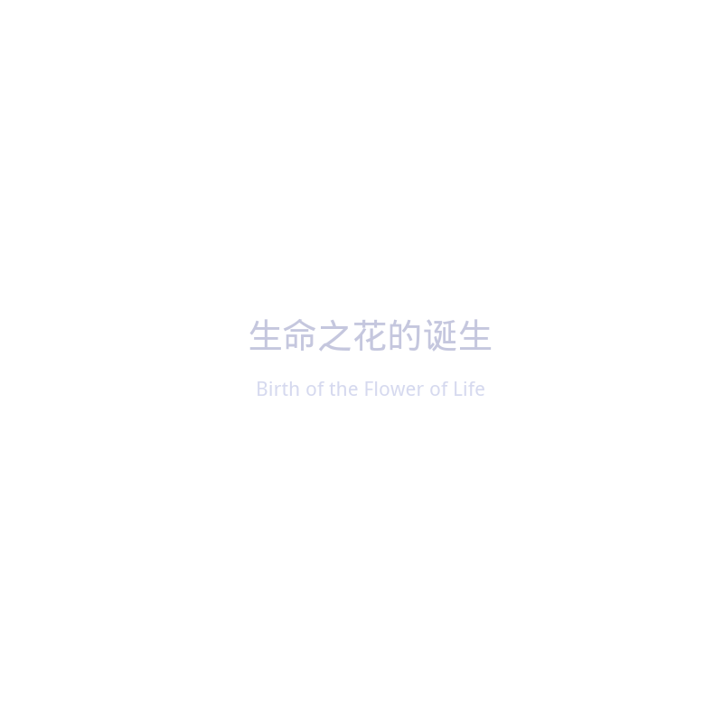
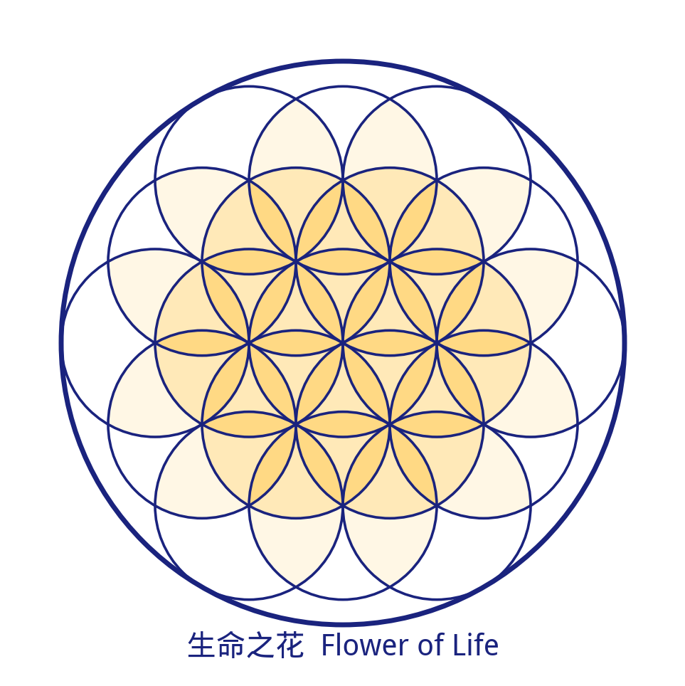
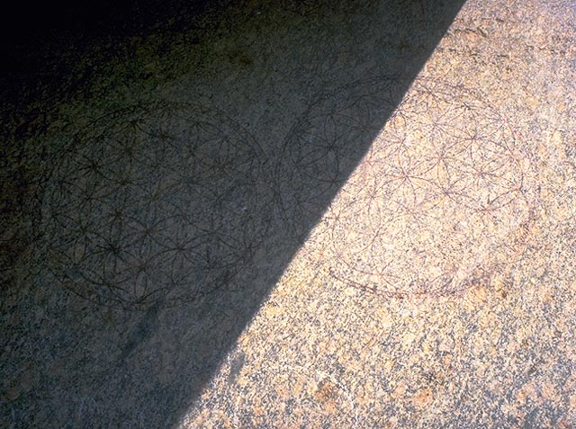
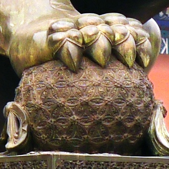

找一张白纸，画一个圆。

再画一个同样大小的圆，让它的圆心恰好落在第一个圆的边缘。

看那个重叠的区域——两头尖、中间鼓的杏仁形。

恭喜你。你刚刚做了一件六千年前埃及人做过的事，两千年前凯尔特人做过的事，五百年前达·芬奇做过的事，六百年前紫禁城的工匠做过的事。

而且，你刚刚用纯几何的方式，把 $\sqrt{3}$ 放在了纸上。

---

## 一、杏仁形的秘密

这个两头尖的形状有个名字，叫做 **Vesica Piscis**（鱼形囊）。拉丁文直译是"鱼的膀胱"——名字不雅，但数学很美。

让我们看看这个形状到底藏了什么。


设两个圆的半径都是 r。因为第二个圆的圆心落在第一个圆的边缘上，两个圆心之间的距离也等于 r。

现在，看两个圆的交点。从一个交点到另一个交点的距离是多少？

画一条从圆心到交点的连线，你会得到一个三角形：两条边都等于 r（半径），底边等于 r（圆心距）。这是一个**等边三角形**。

等边三角形的高 = ($\sqrt{3}$/2) × 边长 = ($\sqrt{3}$/2) × r。

两个交点之间的距离 = 高度的两倍 = **r$\sqrt{3}$**。

就这样。两个等圆的最简单重叠，自然涌现出了 $\sqrt{3}$——一个无法用任何分数表达的无理数。

> **$\sqrt{3}$ 不是被"计算"出来的。它是被"画"出来的。**

这就是几何的力量：你不需要知道什么是无理数，不需要知道什么是代数，你只需要一个圆规——一个比文字还古老的工具——就能把一个数学上无穷不循环的数字，精确地放在纸上。

---

## 二、无理数的产房

$\sqrt{3}$ 不孤单。

从 Vesica Piscis 出发，你可以用纯几何的方式（只用圆规和直尺）构造出几乎所有重要的无理数：

- **$\sqrt{2}$**：画一个正方形，它的对角线就是边长的 $\sqrt{2}$ 倍。而正方形可以从 Vesica Piscis 中直接提取——两个圆的公共弦就是正方形对角线的天然起点。

- **$\sqrt{5}$**：画一个长宽比为 1:2 的矩形，它的对角线就是 $\sqrt{5}$。

- **黄金比例 φ**：有了 $\sqrt{5}$，黄金比例就水到渠成—— **φ = (1+$\sqrt{5}$)/2 ≈ 1.618...**

一条链条浮现了：


```text
两个圆相交
    ↓
  √3 涌现
    ↓
  √2（正方形对角线）
    ↓
  √5（1:2 矩形对角线）
    ↓
  φ = (1+√5)/2（黄金比例）
```

**Vesica Piscis 是无理数的"产房"。** 从这一个最简单的几何动作——两圆相交——出发，数学中最重要的几个常数依次诞生。

你可能会说：这只是几何推导的小把戏。

但想想看——毕达哥拉斯的学生希帕索斯因为发现 $\sqrt{2}$ 是无理数而被同门扔进了大海（传说中）。古希腊人为"不可公度量"（无法用分数表达的长度）困扰了几百年。

而圆规和直尺，早在任何人思考"什么是无理数"之前，就已经默默地把这些数字画在了地上。

手比脑先到达真理。这件事值得安静地想一想。

---

## 三、一条规则，一朵花

现在，让我们继续画。

你已经有了两个圆和一个 Vesica Piscis。在两个圆的两个交点上，分别以它们为圆心，再画两个等大的圆。

然后在新的交点上继续画。

遵循一条规则：**每个新圆的圆心，落在已有圆的交点上。**



第一步：1 个圆。

第二步：2 个圆。中间出现了 Vesica Piscis。

第三步：7 个圆。六个圆围绕中心圆排列，像花瓣。这个图案叫做 **Seed of Life**（生命种子）。

第四步：继续扩展到 19 个圆。花瓣层层绽放。这个图案叫做 **Flower of Life**（生命之花）。

整个过程只用了一条规则，一把圆规。没有尺子，没有数字，没有方程。

但如果你仔细看这朵花，你会发现它里面藏满了正六边形、正三角形、正方形。它的对称群是 **p6m**——平面上对称性最高的壁纸群之一。它的圆心排列构成**三角晶格**——自然界中原子最密堆积的方式。

一条规则，生长出一整个数学宇宙。


*19 个等径圆构成的生命之花——从一个圆规动作中生长出来的完美对称*

---

## 四、一朵花开遍世界

到这里，如果生命之花只是一个漂亮的几何练习，那我们可以满意地合上本子了。

但历史不答应。

**埃及，阿拜多斯（Abydos）。** 在古埃及最神圣的遗址之一——奥西里斯神庙（Osireion）的花岗岩石柱上，用红赭石烙印着完整的生命之花图案。这座神庙的历史可追溯至公元前 1300 年左右，部分学者认为其基础结构更为古老。


*埃及阿拜多斯奥西里斯神庙石柱上的生命之花图案（图源: Wikimedia Commons, CC BY-SA 3.0）*

**中国，北京紫禁城。** 太和门前的铜狮子，右爪下踩着一个绣球。这个绣球的表面，雕刻着精确的生命之花图案。明代工匠留下了这个几何密码，五百多年来接受着数以亿计游客的目光——但很少有人低头仔细看过。


*北京紫禁城太和门铜狮脚下绣球上的生命之花图案（图源: Wikimedia Commons, CC BY-SA 3.0）*

**土耳其，以弗所（Ephesus）。** 罗马时期的大理石地板上。

**印度，阿姆利则金庙。** 锡克教最神圣的寺庙。

**以色列，马萨达（Masada）。** 希律王宫殿的遗址中。

六个文明。四个大洲。时间跨度超过三千年。

没有已知的直接文化传播路径。

同一个图案。

为什么？

我不知道。这个系列也不会假装知道。但这个问题本身——为什么不同文明的人，在互不相识的情况下，用一模一样的方式画圆？——值得我们带着它继续走下去。

---

## 五、达·芬奇的痴迷

在所有研究过生命之花的人中，有一个人的痴迷程度超过其他所有人。

列奥纳多·达·芬奇（Leonardo da Vinci, 1452–1519）。

在他的《大西洋手稿》（Codex Atlanticus）中——那部收藏在米兰安布罗西亚图书馆的庞大笔记集——有多个页面被生命之花的几何研究占满。最著名的是 folio 307v。

达·芬奇不是以神秘主义的心态画这些圆的。他是工程师，他在**分析结构**。

他标注了比例。测量了角度。研究了每一个交点产生的几何形状。他试图理解，为什么这样一个简单的构造规则，能生长出如此丰富的数学关系。

这和他在《维特鲁威人》中做的事情是一样的——用圆和方来丈量人体，用几何来理解世界。

不过有一件事特别值得注意。

达·芬奇在这些手稿中，不只是画了圆。**他在圆的交点之间画了直线。**

当你选出生命之花中特定的 13 个圆，去掉花瓣只留圆心，然后把每一个圆心和其他所有 12 个圆心用直线连接——C(13,2) = 78 条线——一个新的图案出现了。

它叫做 **Metatron's Cube**（麦塔特隆立方体）。

而藏在这个看似纷繁的线条图案里的，是宇宙中所有可能的完美形状。

但那是下一个故事了。

---

## 六、一个安静的事实

让我们回到这篇文章的起点。

一张白纸。两个圆。

从这个最简单的几何动作中：

- 涌现出 $\sqrt{3}$、$\sqrt{2}$、$\sqrt{5}$、黄金比例 φ——数学中最基本的无理数家族。
- 生长出生命之花——一个在六千年间独立出现在至少六个文明中的几何图案。
- 启发了达·芬奇——人类历史上最伟大的通才之一——的大量几何研究。

这不是巧合，也不是神秘主义。这是一个**安静的事实**：最简单的操作，有时候包含着最深的结构。

圆规比方程古老。画圆比计算古老。手比脑先触碰到真理。

而我们的旅程才刚刚开始。

---

> **下一篇：** 达·芬奇在圆的交点之间画了直线，一个叫做"麦塔特隆立方体"的图案浮现了。在这个图案里，藏着宇宙中仅有的五种完美形状。25 岁的开普勒用它们来解释太阳系——他错了，但他追问的问题是对的。
>
> → [两个圆之后（二）：完美的形状只有五个](/posts/two-circles-2/)

---

*本文是「两个圆之后」系列的第一篇。这个系列从一个圆规开始，穿越几何、编码、代数与意识，追问一个没有答案的问题：为什么人类在每一个文明、每一个时代，都看见了同一组数学结构？*

*系列目录：*
1. ***两个圆相遇的地方** — 鱼形囊、$\sqrt{3}$，以及一朵开遍世界的花*（本篇）
2. *完美的形状只有五个 — 生命之花、麦塔特隆立方体与开普勒的宇宙模型*
3. *伏羲的计算机 — 六十四卦、邵雍方阵与莱布尼茨收到的那封信*
4. *相生相克的数学 — 五行、八卦，与藏在占卜里的代数结构*
5. *向内画圆 — 金华宗旨、荣格与意识的几何*
