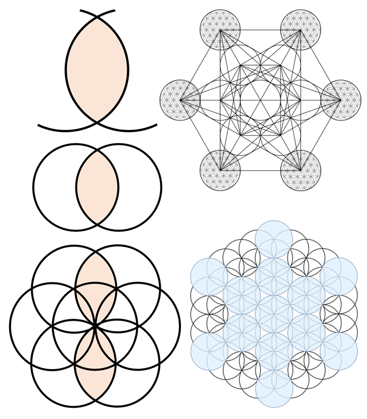
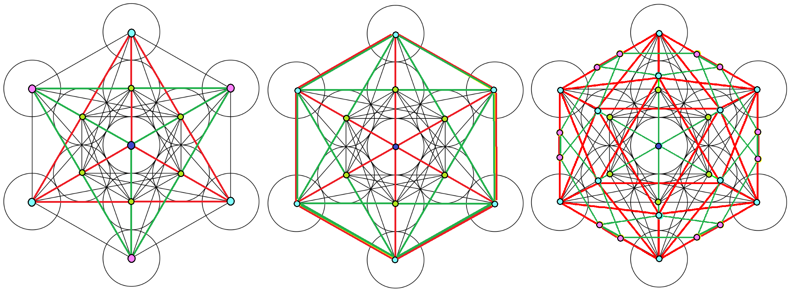
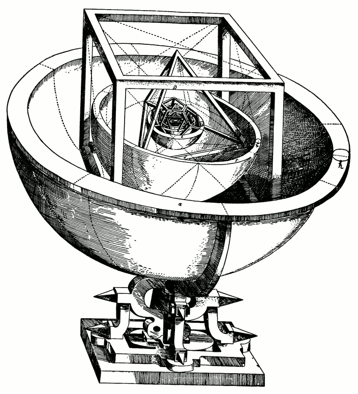
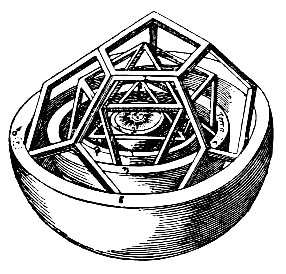

1596 年，德国图宾根大学。一个 25 岁的年轻人出版了他的第一本书。

他叫约翰内斯·开普勒（Johannes Kepler）。书名叫《宇宙的奥秘》（*Mysterium Cosmographicum*）。在这本书里，他提出了一个大胆到近乎疯狂的想法：太阳系中六颗行星（当时已知的全部）的轨道间距，是由五个嵌套的几何体决定的。

土星和木星之间，嵌一个正六面体。木星和火星之间，嵌一个正四面体。火星和地球之间，嵌一个正十二面体。地球和金星之间，嵌一个正二十面体。金星和水星之间，嵌一个正八面体。

五个间隔。五个几何体。不多不少。

他错了。行星轨道是椭圆，不是由嵌套的几何体决定的——后来，他自己证明了这件事。

但他追问的那个问题是对的：为什么宇宙中完美的形状，恰好只有五个？

---

## 一、从花到果实

上一篇的结尾，达·芬奇在生命之花的交点之间画了直线。

让我们跟着他的手，走一遍这个过程。

生命之花是 19 个等径圆的层层绽放。但如果你把最外层的花瓣去掉——那些不完整的、被截断的弧线——只留下 13 个完整的圆，你会得到一个更精炼的图案。

它叫做 **Fruit of Life**（生命果实）。

13 个圆。13 个圆心。

现在，做一件简单的事：把每一个圆心和其他所有圆心用直线连接。

13 个点，每对之间一条线。组合数学告诉我们：$C(13, 2) = \frac{13 \times 12}{2} = 78$ 条线。

78 条直线。一个致密的线条网络。

这个图案有一个名字：**Metatron's Cube**（麦塔特隆立方体）。

*从 Vesica Piscis 到生命之花到麦塔特隆立方体——一条规则的层层展开*

名字来自犹太教和基督教神秘主义传统中的大天使麦塔特隆（Metatron），据说是天使中最接近神的存在，负责守护创世的蓝图。中世纪的神秘学家相信，这个图案包含了一切几何形式的原型。

但让我们抛开名字和传说，只看数学。

在这 78 条线构成的致密网络中，如果你选对了线条——只挑出某些特定的边——你会看见一些东西从混沌中浮现：

完美的几何体。

不是一个，不是两个，而是全部五个。

宇宙中仅有的五种完美形状，全部藏在这张由 13 个圆心和 78 条直线构成的图案里。

*麦塔特隆立方体中的五种柏拉图立体——用不同颜色标出的正四面体、正六面体、正八面体、正十二面体和正二十面体*

---

## 二、五个，不多不少

这五种形状叫做**柏拉图立体**（Platonic Solids）。

什么是"完美"？规则很严格：

1. 每一个面都是**同一种**正多边形（等边等角）。
2. 每一个顶点处，**同样数量**的面以**同样的方式**汇聚。
3. 整个形体是**凸**的——没有凹陷，没有洞。

满足这三条规则的三维形体，在整个数学宇宙中，只有五个。

| 名称 | 面数 | 每个面的形状 | 柏拉图的元素 |
|------|------|-------------|-------------|
| 正四面体（Tetrahedron） | 4 | 正三角形 | 火 🔥 |
| 正六面体（Cube） | 6 | 正方形 | 土 🌍 |
| 正八面体（Octahedron） | 8 | 正三角形 | 气 💨 |
| 正二十面体（Icosahedron） | 20 | 正三角形 | 水 💧 |
| 正十二面体（Dodecahedron） | 12 | 正五边形 | 宇宙 ✨ |

柏拉图在他的《蒂迈欧篇》（*Timaeus*，约公元前 360 年）中，把四种元素分配给了前四种形体：火是最尖锐的正四面体，土是最稳固的正六面体，气是正八面体，水是圆滑的正二十面体。至于第五种——正十二面体——他留给了整个宇宙。他说，"神用它来安排整个天穹的星座。"

但柏拉图不只是在分配标签。在《蒂迈欧篇》中，他给出了一个惊人的推理：一切都从三角形开始。他认为，正三角形和等腰直角三角形是物质世界的最小构造单元。正四面体由 4 × 2 = 8 个直角三角形拼成，正八面体由 8 × 2 = 16 个，正二十面体由 20 × 2 = 40 个。所以火、气、水可以互相转化——它们的面可以拆散重组。

但正六面体的面是正方形，正十二面体的面是正五边形——它们的三角形基础不同。所以土不能变成火。宇宙独立于万物。

错得很美。

但为什么只有五种？

答案在于一个简单的算术约束。

在每一个顶点处，若干个正多边形围绕着它聚合。要形成一个凸起的"角"——而不是平铺——这些面的内角之和必须**严格小于 360°**。

正三角形的内角是 60°：
- 3 个三角形：$3 \times 60° = 180°$ ✓ → 正四面体
- 4 个三角形：$4 \times 60° = 240°$ ✓ → 正八面体
- 5 个三角形：$5 \times 60° = 300°$ ✓ → 正二十面体
- 6 个三角形：$6 \times 60° = 360°$ ✗ 平铺，不弯曲

正方形的内角是 90°：
- 3 个正方形：$3 \times 90° = 270°$ ✓ → 正六面体
- 4 个正方形：$4 \times 90° = 360°$ ✗ 平铺

正五边形的内角是 108°：
- 3 个正五边形：$3 \times 108° = 324°$ ✓ → 正十二面体
- 4 个正五边形：$4 \times 108° = 432°$ ✗ 超过 360°

正六边形的内角是 120°：
- 3 个正六边形：$3 \times 120° = 360°$ ✗ 平铺

正七边形及以上：三个面的内角之和就已经超过 360°，连第一关都过不了。

就这样。穷举完毕。五种组合，五种形体。不是经验规律，不是偶然巧合，而是逻辑的必然。

三维空间中的"完美"，被角度的算术锁死了。

---

## 三、欧拉的签名

1750 年，瑞士数学家莱昂哈德·欧拉（Leonhard Euler）注意到了一件事。

他数了数每个柏拉图立体的顶点（V）、边（E）和面（F），然后做了一个简单的运算：

| 形体 | 顶点 V | 边 E | 面 F | V − E + F |
|------|--------|------|------|-----------|
| 正四面体 | 4 | 6 | 4 | **2** |
| 正六面体 | 8 | 12 | 6 | **2** |
| 正八面体 | 6 | 12 | 8 | **2** |
| 正二十面体 | 12 | 30 | 20 | **2** |
| 正十二面体 | 20 | 30 | 12 | **2** |

$V - E + F = 2$

五种形体，顶点数不同，边数不同，面数不同。但这个数——顶点减边加面——永远等于 2。

这就是**欧拉公式**。

它不只对柏拉图立体成立。任何凸多面体——不管多么扭曲、多么不规则，只要它是凸的、没有洞的——这个数都等于 2。把正方体的一个顶点拽歪，边变弯，面变皱，只要不撕破，不戳洞，$V - E + F$ 永远是 2。

这意味着什么？

它意味着这个数字不属于"几何"。它属于某种更深的东西。它不关心长度、角度、面积。它只关心"连接方式"——什么跟什么相邻，什么围着什么。

形状可以弯曲，可以拉伸，可以揉捏。但这个数字不变。

这就是**拓扑学**（topology）的种子。

一门研究"在连续变形下什么东西不变"的数学。橡皮泥的数学。

欧拉发现这件事的时候，距离柏拉图列举出五种完美立体，已经过去了超过两千年。

两千年。同样的五个形状。但欧拉看到的，是柏拉图从未看到的——不是形状本身，而是形状背后更深处的不变量。

数学就是这样一层一层剥开的。每一层看到的都是同一个对象，但看到的"东西"完全不同。

---

## 四、开普勒的宇宙嵌套

让我们回到开头那个 25 岁的年轻人。

1595 年 7 月 19 日，开普勒正在格拉茨的一所中学里教数学。他在黑板上画几何图形给学生看——在正三角形外面画外接圆，在外接圆外面画正方形，在正方形外面再画外接圆，如此交替。

突然，他停住了。

这些同心圆的半径比——内圆与外圆的比值——让他想到了一个东西：行星轨道之间的间距。

他后来写道："我几乎相信自己触碰到了造物主的思想。"

从那一刻起，他开始了长达一年的疯狂计算。他的想法是：在三维空间中，正好有五种柏拉图立体。太阳系有六颗行星。六颗行星之间有五个间隔。五个间隔，五种立体。一一对应。

他的嵌套模型是这样的：

*开普勒《宇宙的奥秘》中的行星嵌套模型——五种柏拉图立体决定六颗行星的轨道间距*

从外到内：

**土星** → 正六面体（立方体） → **木星** → 正四面体 → **火星** → 正十二面体 → **地球** → 正二十面体 → **金星** → 正八面体 → **水星**

每种立体的内切球对应内侧行星的轨道，外接球对应外侧行星的轨道。

*嵌套结构的另一视角——从土星到水星，五层几何体如同俄罗斯套娃*

他算了。数据竟然粗略地对上了——至少在当时的观测精度下。

他兴奋地出版了《宇宙的奥秘》。第谷·布拉赫（Tycho Brahe）读了这本书，虽然不认同结论，但欣赏这个年轻人的数学才华，邀请他来布拉格做助手。第谷去世后，开普勒继承了他精确到前所未有程度的行星观测数据。

然后，开普勒用这些数据推翻了自己。

行星轨道不是正圆。它们是椭圆。五种柏拉图立体的嵌套模型，精巧但错误。

开普勒花了二十多年接受这个事实。但他始终没有放弃一个更深层的信念：**几何决定物理。形状不是装饰，是原因。**

他错在了具体方案上。但他的直觉——数学结构在最深处规定了自然界的运行方式——在另一个层次上被验证了。牛顿的万有引力定律、麦克斯韦方程组、爱因斯坦的广义相对论，都是"几何即物理"这个信念的后代。

而柏拉图立体本身呢？它们在沉寂了两千多年后，在一个完全意想不到的地方复活了。

1985 年，三位化学家——罗伯特·柯尔（Robert Curl）、哈罗德·克罗托（Harold Kroto）和理查德·斯莫利（Richard Smalley）——发现了一种新的碳分子。60 个碳原子，排列成 12 个正五边形和 20 个正六边形，恰好构成一个截角正二十面体。

它的形状和足球一模一样。

他们给它起了个名字：**巴克明斯特富勒烯**（Buckminsterfullerene，简称 C₆₀）。名字来自建筑师巴克明斯特·富勒（Buckminster Fuller），他发明了用正二十面体截面构建的测地线穹顶（geodesic dome）——那些由三角形和五边形拼成的半球形建筑结构。

2600 年前柏拉图写在纸上的形状，被自然界用碳原子重新拼了一遍。

1996 年，这三位化学家因此获得了诺贝尔化学奖。

---

## 五、达·芬奇的线框

在开普勒出生之前四十年，在柯尔和克罗托出生之前五百年，有一个人已经在纸上用一种前无古人的方式画出了柏拉图立体。

列奥纳多·达·芬奇。

1509 年，数学家卢卡·帕乔利（Luca Pacioli）出版了《神圣比例》（*De Divina Proportione*）——一本关于黄金比例在建筑和艺术中应用的著作。帕乔利是达·芬奇的朋友和数学导师。他请达·芬奇为这本书绘制插图。

达·芬奇画了六十幅几何体的插图。其中包括全部五种柏拉图立体，以及它们的各种变体——截角体、星形体。

但真正革命性的不是他画了什么，而是他**怎么画**。

在达·芬奇之前，所有人画三维几何体的方式都是一样的：画实心面。一个正方体就是三个可见面，涂上阴影，像个盒子。

达·芬奇做了一件从没人做过的事：他只画了**边**。

他去掉了面，只留下棱线。他把每一条边画成有宽度的骨架——像细木条搭成的框架。面是空的，透明的。你可以透过前面看到后面。

这就是**线框渲染**（wireframe rendering）——500 年后，计算机图形学赖以起步的技术。

达·芬奇在 1509 年发明了它。

没有电脑，没有矩阵运算，没有透视投影算法。只有一支笔，一双理解三维结构的眼睛，和一个念头：如果去掉表面，结构会更清晰。

这个念头本身就是一种数学直觉。面是直觉的诱惑——我们习惯看"物体"。但边才是结构的骨骼——连接关系，拓扑本质。

达·芬奇去掉面只留下边的那一刻，他做的事情和欧拉在两百多年后做的事情，本质上一样：越过表面，看向深处的连接。

一个用画笔，一个用公式。他们看到了同一个东西。

---

## 六、一个安静的追问

让我们安静地站一步，回看来路。

一张白纸。两个圆。

从两个圆，长出了生命之花。从花中提取果实——13 个圆心。用 78 条直线连接它们——麦塔特隆立方体。从线条的交织中，五种完美的几何体浮现。

两千四百年前，柏拉图用它们来编码元素。

四百年前，开普勒用它们来编码行星。

五百年前，达·芬奇用一种全新的方式画出了它们的骨骼。

两百七十年前，欧拉在它们身上发现了一个不变的数字。

四十年前，碳原子自己拼成了其中一种形状。

同一组结构。同一个约束——角度之和小于 360°。五种形体，不多不少。从古希腊到诺贝尔奖，这个事实没有改变过。

到目前为止，我们一直在用**眼睛**看几何。圆是画出来的。立体是搭出来的。对称是看出来的。

但在地球的另一边，有人用完全不同的方式触碰到了同样的数学结构。

他们没有画圆。他们画的是——横线。

连续的横线，和断开的横线。

每一根线只有两种状态：**连**，或者**断**。

六根线叠在一起。每根线两种选择。$2^6 = 64$ 种组合。

六个比特。六十四种可能。

一本叫做《易经》的书。

---

> **下一篇：** 连续和断裂，阴和阳，0 和 1。三千年前的六爻卦象，与莱布尼茨发明的二进制，为什么拥有相同的结构？邵雍用一张方阵把六十四卦排列整齐——莱布尼茨看到这张图时，震惊了。
>
> → [两个圆之后（三）：伏羲的计算机](/posts/two-circles-3/)

---

*本文是「两个圆之后」系列的第二篇。这个系列从一个圆规开始，穿越几何、编码、代数与意识，追问一个没有答案的问题：为什么人类在每一个文明、每一个时代，都看见了同一组数学结构？*

*系列目录：*
1. *[两个圆相遇的地方](/posts/two-circles-1/) — 鱼形囊、$\sqrt{3}$，以及一朵开遍世界的花*
2. ***完美的形状只有五个** — 生命之花、麦塔特隆立方体与开普勒的宇宙模型*（本篇）
3. *伏羲的计算机 — 六十四卦、邵雍方阵与莱布尼茨收到的那封信*
4. *相生相克的数学 — 五行、八卦，与藏在占卜里的代数结构*
5. *向内画圆 — 金华宗旨、荣格与意识的几何*
