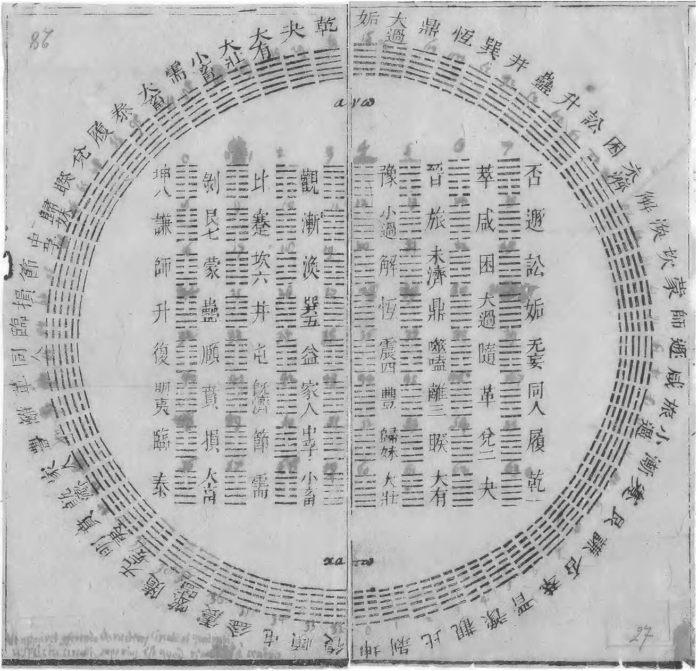

1701 年。汉诺威。

五十五岁的莱布尼茨（Gottfried Wilhelm Leibniz, 1646–1716）在书房里拆开一封从北京寄来的信。

寄信人叫白晋（Joachim Bouvet, 1656–1730），一位在康熙皇帝宫廷中教授西方数学的法国耶稣会士。白晋与莱布尼茨通信已有多年，两人的话题从中国哲学到数学方法无所不包。但这一次，白晋在信中附了一样东西——一幅来自宋代学者邵雍的图。

**伏羲六十四卦方圆图。**

六十四个由断线和连线组成的符号，排列成方形和圆形两种阵列。莱布尼茨看着这幅图，看了很久。

因为他认出了它。

这和他独自推演了二十年的二进制计数表——逢二进一，只用 0 和 1 表达一切数字——**严丝合缝**。

*莱布尼茨收藏并标注的伏羲六十四卦方圆图。上方为圆图（先天六十四卦圆形排列），下方为方图（方阵排列）。这幅图由白晋从北京寄出，成为莱布尼茨 1703 年二进制论文的核心参考。（图源: Wikimedia Commons, Public Domain）*

这个故事的每一个环节——八卦的结构、六十四卦的完备性、邵雍的排序、白晋的信、莱布尼茨的论文——都有据可查。

让我们一个一个看。

---

## 一、八卦：三个比特

八卦的基本单位是**爻**（yáo）。

只有两种：

- **阳爻** ⚊ ——一条连续的线
- **阴爻** ⚋ ——一条断开的线

两种状态。连 或 断。有 或 无。1 或 0。

如果你学过计算机科学，你会立刻认出这个结构：这是一个**比特**（bit）。一个只取两个值的信息单位。

现在，把三个爻从下往上叠在一起。每个位置有 2 种选择，三个位置就有 $2^3 = 8$ 种组合。

这就是**八卦**。

| 卦名 | 卦象 | 二进制 | 十进制 | 自然象征 |
|:---:|:---:|:---:|:---:|:---:|
| 坤 | ☷ | 000 | 0 | 地 |
| 艮 | ☶ | 001 | 1 | 山 |
| 坎 | ☵ | 010 | 2 | 水 |
| 巽 | ☴ | 011 | 3 | 风 |
| 震 | ☳ | 100 | 4 | 雷 |
| 离 | ☲ | 101 | 5 | 火 |
| 兑 | ☱ | 110 | 6 | 泽 |
| 乾 | ☰ | 111 | 7 | 天 |

这里有一个需要特别说明的地方。

上面这张表的对应关系——阴爻为 0、阳爻为 1、从底部读起——**不是**后人牵强附会出来的。在邵雍的"先天八卦"排列中，八卦的顺序恰好就是：坤（000）、艮（001）、坎（010）、巽（011）、震（100）、离（101）、兑（110）、乾（111）。

从 0 数到 7。

一个也不差。一个也不乱。

这就是莱布尼茨看到那幅图时震惊的原因。这不是"可以解释为"二进制——这**就是**二进制计数。

---

## 二、六十四卦：六比特的完备空间

八卦是三爻的穷举。但《易经》没有止步于此。

把两个三爻卦上下叠合——下卦（内卦）三爻 + 上卦（外卦）三爻——就得到一个**六爻卦**。

下卦有 8 种，上卦有 8 种，$8 \times 8 = 64$ 种组合。

或者，用信息论的语言说：六个比特，$2^6 = 64$ 种状态。

**六十四卦不多不少，恰好覆盖了六比特的全部可能性。**

这意味着什么？

意味着六十四卦是一个**完备的编码系统**。在六比特的空间里，没有任何一种状态被遗漏，也没有任何一种状态被重复。每一个六位二进制数，都有且仅有一个卦与之对应。

如果你觉得"完备"这个词太学术，换一种说法：六十四卦之于六比特，就像 26 个字母之于英文拼写——它覆盖了所有的基本可能，你不需要更多，也不能更少。

让我们做一个有趣的类比。

**ASCII 编码**（美国信息交换标准代码），计算机时代最早的字符编码标准，使用 7 个比特编码 128 个字符——26 个大写字母、26 个小写字母、10 个数字、32 个控制字符和 34 个标点符号。它诞生于 1963 年。

六十四卦使用 6 个比特编码 64 个"状态"。它的编码逻辑出现于——如果我们按邵雍的排列算——大约公元 1060 年。

当然，必须立刻说清楚：**这个类比是结构性的，不是功能性的。** ASCII 编码字符，六十四卦编码"宇宙的状态"。ASCII 的设计者明确知道自己在做信息编码，而创造六十四卦的人（无论是传说中的伏羲，还是历史上的周文王）想的是天道、变化和占卜。

但从数学结构的角度看，两者做了同一件事：**在一个有限的比特空间里，建立了一套完备的、无冗余的编码。**

这件事本身就值得注意。它说明"完备编码"不是现代信息论的发明——它是一种自然的数学结构，不同时代的人会因为不同的理由抵达同一个答案。

---

## 三、邵雍的先天图

邵雍（1011–1077），北宋理学家。

在那个群星璀璨的时代——范仲淹写《岳阳楼记》，司马光编《资治通鉴》，苏轼写前后《赤壁赋》——邵雍是一个特别安静的存在。他住在洛阳，自号"安乐先生"，终日研究象数之学。用现代的话说，他是一个沉迷于数学模式的理论家。

他最重要的成就是对《易经》先天图的系统化整理。他把六十四卦排成了一个严格的序列——这就是后来被称为"伏羲六十四卦方圆图"的东西。

**圆图**把六十四卦排成一个环，乾（111111）在正上方，坤（000000）在正下方，中间的卦按二进制顺序排列。

**方图**把六十四卦排成一个 8×8 的方阵，横轴是上卦（外卦），纵轴是下卦（内卦）。每一行、每一列都是一个完整的八卦序列。

关键事实是这个——

**邵雍的排序，从坤到乾，就是从 000000 到 111111 的计数——即从十进制的 0 到 63。**

不是"大致对应"。不是"如果你换一下顺序就能对上"。是**逐个对应，严丝合缝**。

| 位置 | 卦名 | 二进制 | 十进制 |
|:---:|:---:|:---:|:---:|
| 第 1 | 坤 | 000000 | 0 |
| 第 2 | 剥 | 000001 | 1 |
| 第 3 | 比 | 000010 | 2 |
| 第 4 | 观 | 000011 | 3 |
| … | … | … | … |
| 第 61 | 大壮 | 111100 | 60 |
| 第 62 | 夬 | 111101 | 61 |
| 第 63 | 大有 | 111110 | 62 |
| 第 64 | 乾 | 111111 | 63 |

现在，让我们把时间线摆出来。

**邵雍完成先天图的系统化：约 1060 年。**

**莱布尼茨发表二进制论文：1703 年。**

中间相隔六百多年。

这个时间差是这个故事中最令人沉默的部分。

但我必须同时说另一件事——邵雍**并没有**"发明二进制"。他没有写过"逢二进一"这四个字，没有讨论过二进制的运算规则，没有建立过二进制与十进制之间的转换方法。他追求的是**宇宙的秩序**——天地万物的生成规律、阴阳消长的数学结构。他用"加一倍法"来描述自己的排列原则："一分为二，二分为四，四分为八"——这当然就是 $2^0, 2^1, 2^2, 2^3$ 的指数增长，但在邵雍的体系里，这是太极生两仪、两仪生四象的宇宙论，不是计数系统。

所以准确的表述是：**邵雍的先天图在数学结构上等价于二进制计数，但它的设计动机和认知框架与莱布尼茨完全不同。**

这比"中国人发明了二进制"更有趣。因为它引出一个更深的问题：**为什么两个生活在不同世纪、不同大陆、追问完全不同问题的人，会抵达同一个数学结构？**

---

## 四、白晋与莱布尼茨

这个故事的桥梁是一个法国人。

白晋（Joachim Bouvet），法国耶稣会士，1687 年受路易十四派遣前往中国。他在康熙的宫廷里待了将近三十年，教皇帝西方数学和天文学，同时自己深入研究中国典籍——尤其是《易经》。

白晋不是一般的传教士。他是"索隐派"（Figurism）的代表人物，相信中国古代典籍中隐藏着与基督教一致的原始启示。这个信念驱使他对《易经》做了极其细致的研究——不是作为占卜手册，而是作为一种哲学与数学的文本。

他与莱布尼茨的通信始于 1697 年。莱布尼茨对中国文化的兴趣是真诚的——他曾写过一本《中国近事》（Novissima Sinica），主张欧洲应向中国学习实用哲学。

1701 年，白晋在一封信中向莱布尼茨介绍了邵雍的先天图，并附上了那幅六十四卦方圆图。

莱布尼茨的反应记录在他的论文和通信中。他早在 1679 年就开始独立研究二进制算术，写下了一篇关于二进制的手稿（De Progressione Dyadica）。但他长期犹豫是否发表——因为他不确定这套只用 0 和 1 的计数法是否有足够的实用价值来吸引数学界的关注。

白晋的信改变了一切。

看到邵雍的先天图后，莱布尼茨确信二进制不仅仅是一种数学游戏——它是一种**具有深刻哲学意义的结构**，古老的中国智慧已经从另一条路径抵达了同一个真理。

1703 年，莱布尼茨在法国皇家科学院发表了他的论文：**《二进制算术阐释——兼论其用途及伏羲氏所用数字的意义》**（Explication de l'arithmétique binaire, qui se sert des seuls caractères 0 et 1, avec des remarques sur son utilité, et sur ce qu'elle donne le sens des anciennes figures Chinoises de Fohy）。

注意这个标题。莱布尼茨没有把伏羲的六十四卦放在脚注里——他把它写进了**论文标题**。

在论文中，莱布尼茨做了一件有趣的事。他把二进制与基督教神学联系在一起：**上帝（1）从虚无（0）中创造万物**——"creatio ex nihilo"。1 和 0 不仅仅是数字，它们象征着存在与虚空、光与暗、有与无。

而伏羲的六十四卦，在莱布尼茨看来，正是这种原始真理在中国文明中的体现。

这里有一个微妙的讽刺：白晋认为中国典籍中隐藏着基督教的启示，莱布尼茨认为二进制揭示了上帝创世的密码——**两个欧洲人各自从中国这面镜子里看到了自己想看的东西。** 这并不削弱这件事的数学意义，但它提醒我们：当不同文明的知识碰撞时，"理解"和"误解"往往同时发生。

不过，有一件事是客观的，不受诠释框架影响的：

**邵雍的先天图的排列顺序，与二进制自然数序列的排列顺序，在数学上完全等价。**

这个事实不依赖于白晋的神学，不依赖于莱布尼茨的哲学，不依赖于邵雍的宇宙论。

它只是一个数学事实。

---

## 五、不做判断

让我们最后把一条线索铺清楚。

《系辞传》说："易有太极，是生两仪，两仪生四象，四象生八卦。"

翻译成数学：

$$2^0 = 1 \quad \text{（太极：一个未分的整体）}$$

$$2^1 = 2 \quad \text{（两仪：阴与阳）}$$

$$2^2 = 4 \quad \text{（四象：太阳、少阴、少阳、太阴）}$$

$$2^3 = 8 \quad \text{（八卦）}$$

继续——

$$2^6 = 64 \quad \text{（六十四卦）}$$

这是一棵**完美的二叉树**。每一次分裂，可能性翻倍。从 1 到 2，从 2 到 4，从 4 到 8，从 8 到 64。指数增长。二进制的自然结构。

这条"太极→两仪→四象→八卦"的生成链，用现代语言描述，就是一个**递归的二分过程**。

到此为止，这篇文章已经摆出了所有的事实。

现在我要做一件这个系列承诺要做的事情：**不做判断。**

你可能很想说："所以中国人在宋朝就发明了二进制！比莱布尼茨早六百年！"

不要这样说。

邵雍没有建立二进制的运算体系。他没有做过二进制加法，没有讨论过进位规则，没有考虑过用 0 和 1 来表示任意数量。他构建的是一个**宇宙论的分类系统**，不是一个**算术计算系统**。把"先天图的排列等价于二进制"直接翻译成"邵雍发明了二进制"，是一种概念上的跳跃。

你可能也想说："这只是巧合。阴阳两分本来就会产生二进制结构，没什么了不起的。"

也不要这样说。

因为"阴阳两分"只是起点。把它系统地推演到六十四个状态的完备空间，并且建立一个严格的排序使之与自然数序列精确对应——这件事绝非"自然而然"就会发生的。历史上有很多二元分类系统（是/非、真/假、黑/白），但几乎没有一个被推演到六十四态的完备穷举并配以严格排序。邵雍做到了。莱布尼茨做到了。中间隔了六百年和一整个欧亚大陆。

**事实就是事实。它不需要被拔高，也不需要被贬低。**

一千年前的洛阳，一个安静的学者，出于对天道秩序的追问，把六十四个符号排成了一个从全阴到全阳的完美序列。

六百年后的汉诺威，一个博学的数学家，出于对计算本质的追问，用 0 和 1 建立了一套新的计数法。

当他们的成果隔着时空相遇时，严丝合缝。

这就是全部。

---

> **下一篇：** 二进制是"编码"——把世界分成 0 和 1。但五行不是编码，它是"关系"——金木水火土之间的相生与相克，构成了一个循环的网络。而这个网络，有一个精确的现代数学名字：循环群 $Z_5$ 上的两个生成元。
>
> → [两个圆之后（四）：相生相克的数学](/posts/two-circles-4/)

---

*本文是「两个圆之后」系列的第三篇。这个系列从一个圆规开始，穿越几何、编码、代数与意识，追问一个没有答案的问题：为什么人类在每一个文明、每一个时代，都看见了同一组数学结构？*

*系列目录：*
1. *[两个圆相遇的地方](/posts/two-circles-1/) — 鱼形囊、$\sqrt{3}$，以及一朵开遍世界的花*
2. *[完美的形状只有五个](/posts/two-circles-2/) — 生命之花、麦塔特隆立方体与开普勒的宇宙模型*
3. ***伏羲的计算机** — 六十四卦、邵雍方阵与莱布尼茨收到的那封信*（本篇）
4. *相生相克的数学 — 五行、八卦，与藏在占卜里的代数结构*
5. *向内画圆 — 金华宗旨、荣格与意识的几何*
