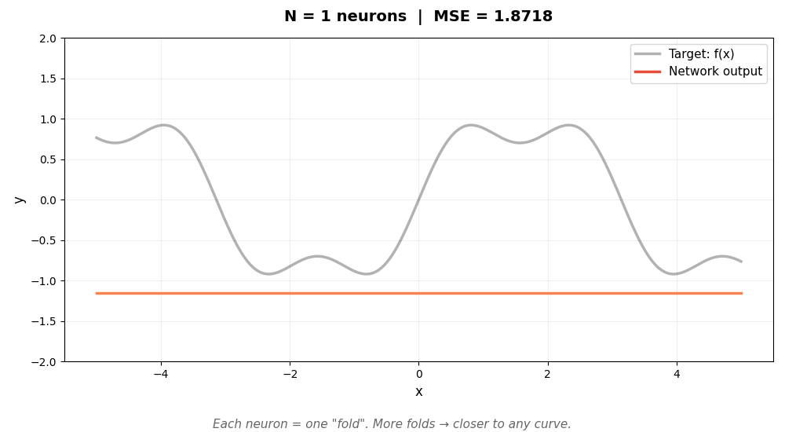
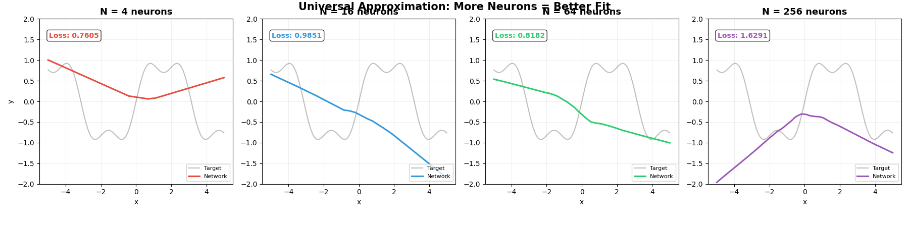
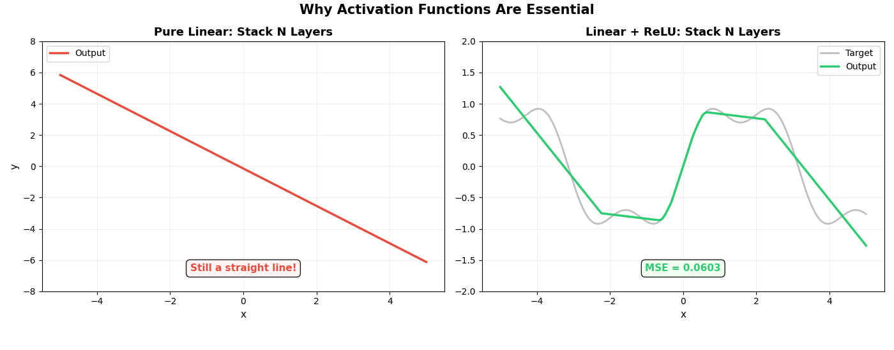

## 序：一个让人困惑的事实

ChatGPT 能写诗、能编程、能通过律师资格考试。

但如果你拆开它的引擎看，核心操作只有两个：

1. **矩阵乘法**（线性变换）
2. **激活函数**（非线性变换）

就这两样东西，反复叠加，叠了几十层——然后"智能"就涌现了？

这听起来不可思议。就好像有人告诉你：用乐高积木和胶水，就能造出一架会飞的飞机。

但这不是魔法，背后有 70 年的思想演进，和一个关键的数学定理作为底气。

---

## 第一章：AI 的两条路线

AI 领域从诞生那天起，就存在两个根本不同的思想流派。理解这两条路线，你就理解了 AI 发展的主线。

### 符号主义：把知识写成规则

**核心思路：** 智能 = 逻辑推理。人把知识整理成规则，机器按规则执行。

想象你要教机器认猫。符号主义的做法是写一本手册：

> "有毛、四条腿、尖耳朵、会喵喵叫 → 这是猫"

再想象教人做菜。符号主义的做法是给一本精确菜谱：

> "油温 180 度，盐 3 克，翻炒 2 分钟"

优点很明显：**过程透明、结果可解释、可以复现。** 你问机器"为什么判断这是猫"，它能告诉你"因为满足了规则第 3 条第 2 款"。

1997 年，IBM 的深蓝击败国际象棋世界冠军卡斯帕罗夫，靠的就是穷举走法加上人类专家手写的评估规则。这是符号主义的巅峰时刻。

**但致命问题来了——规则写不完。**

遇到无毛猫（斯芬克斯猫），规则就崩了。"杯子倒了水会洒"这种常识，你怎么写规则？几亿条也写不完。世界太复杂了，人类的知识根本无法穷举。

就像你想写一本包含全人类所有知识的百科全书——**写到头秃也写不完。**

### 联结主义：让机器自己学

**核心思路：** 智能 = 连接和学习。人搭好网络结构，机器从数据中自己发现规律。

灵感来自人脑——860 亿个神经元，通过突触连接。没有人给大脑写过规则手册，婴儿是通过**不断地看、听、触摸**，自己调整大脑中神经元的连接强度来学习的。

教机器认猫？联结主义的做法是：给机器看**一万张**猫的照片，每张告诉它"这是猫"或"这不是猫"。看多了，连无毛猫也能认出来。

教人做菜？让他去饭店**吃一万顿饭**，然后进厨房自己试。试错中学会。你问他"为什么放这么多盐"，他说"感觉对"——解释不清楚，但就是好吃。

### 一张表看清两条路线

|  | 符号主义 | 联结主义 |
|:---|:---|:---|
| **核心思路** | 把知识**写成规则**，让机器推理 | 把知识**藏在连接**里，让机器学 |
| **类比** | 背字典 —— 查表、对号入座 | 小孩学说话 —— 听多了自然会 |
| **谁在思考** | **人**想好逻辑，机器只是执行 | **机器**在数据中发现模式 |
| **优点** | 过程可解释，结果可追溯 | 能处理模糊、复杂的问题 |
| **缺点** | 规则写不完，脆弱 | 结果难解释（"黑箱"） |
| **代表** | 专家系统、IBM 深蓝 | 深度学习、GPT、AlphaGo |

---

## 第二章：70 年拉锯战

这两条路线不是和平共处，而是**此消彼长的交锋**。

### 第一幕：符号主义的黄金年代（1956—1990s）

1956 年达特茅斯会议，AI 诞生。主流思路就是符号主义——把世界翻译成符号和规则，机器就能思考。

专家系统一度风靡：医疗诊断系统把几千条规则写进去，`IF 发烧 AND 咳嗽 AND 白细胞高 THEN 肺炎`。但遇到病人同时有三种病，规则就打架了。

而联结主义在这段时期命运多舛。1958 年 Rosenblatt 发明感知机，媒体欢呼"思考的机器"。但 1969 年 Minsky 出书证明感知机的局限性，联结主义被打入冷宫——这就是第一次 AI 寒冬。

### 第二幕：联结主义的蛰伏与崛起

联结主义的想法——模仿大脑的神经网络——其实 1943 年就有了，比"人工智能"这个词还早 13 年。但它一直等不到三个关键条件：

```text
      2000年之前                    2012年之后
      缺数据 ❌                     互联网 → 海量数据 ✅
      缺算力 ❌                     GPU/TPU → 暴力计算 ✅
      缺算法 ❌                     Transformer 等突破 ✅
```

三件套凑齐后，2012 年 AlexNet 碾压传统方法，深度学习爆发。2017 年 Transformer 出现。2022 年 ChatGPT 让每个普通人都感受到了 AI 的力量。

### 第三幕：一局围棋定乾坤

如果你只记一件事来理解两条路线的胜负，就记这个：

> **深蓝（1997，下象棋）= 符号主义的巅峰。** 暴力搜索 + 人写的评估规则。
>
> **AlphaGo（2016，下围棋）= 联结主义的胜利。** 神经网络 + 自我对弈学习。

围棋的可能性是宇宙原子数量的 N 倍，穷举不可能。符号主义在围棋面前彻底投降，联结主义却赢了。

**今天你用的 ChatGPT、AI 画画、AI 写代码，全是联结主义的产物。**

---

## 第三章：联结主义靠谱吗？是瞎猜还是有基础？

有人会问：联结主义说"搭好网络让机器自己学"——那人类设计网络结构、设定训练方法，是拍脑袋猜的吗？

**绝对不是。** 要分三层来看。

### 第一层：数学地基——有严格证明 ✅

底层的核心算法都有扎实的数学保障：

| 原理 | 来源 | 保障了什么 |
|:---|:---|:---|
| 梯度下降 | 1847 年柯西提出 | 参数朝正确方向调整 |
| 反向传播 | 微积分链式法则 | 高效计算每个参数该调多少 |
| 万能近似定理 | 1989 年数学证明 | 网络的"天花板"是无限的 |

这些**不是猜的**，是有 170 年数学保障的。

### 第二层：工程原理——前人经验凝结的规范 🔶

中间层有大量工程上的发现：深度网络比宽网络更高效、Dropout 防过拟合、BatchNorm 加速训练、残差连接让超深网络可训练。这些有理论直觉，也有大量实验验证。

### 第三层：经验调参——确实靠试 🔶

学习率多少？模型多少层？训练多少步？GPT-4 该多大？**这些确实大量靠实验。**

2017 年 NeurIPS 大会上，Ali Rahimi 说深度学习像"**炼金术**"——有效，但不完全知道为什么。Meta 首席科学家 LeCun 回应：

> "这不是炼金术，这是**工程**。莱特兄弟造出飞机的时候，空气动力学理论也不完善。你不需要完全理解，也能造出改变世界的东西。"

### 盖房子的类比

```text
物理定律（万有引力、材料力学）    → 不可违反的硬约束
                                    深度学习的数学基础就在这一层

建筑规范（承重墙多厚、钢筋间距）  → 前人经验凝结的标准
                                    深度学习的工程原理就在这一层

建筑师的审美（窗户多大、层高多少）→ 有道理，也有主观判断
                                    深度学习的调参就在这一层
```

工程学的本质就是：**理论不需要完美，先造出来能用，然后不断改进。**

---

## 第四章：万能近似定理——联结主义的信心保证书

三层结构中，最底层那个"万能近似定理"是什么？为什么它这么重要？

### 先理解"函数"

别被数学名词吓到。"函数"就是**给一个输入，得到一个输出的规律**：

| 输入 | 输出 |
|:---|:---|
| 一张照片 | "这是猫" / "这是狗" |
| 一句中文 | 一句英文翻译 |
| 你说的上半句话 | AI 接的下半句 |

这些输入→输出的对应关系，在数学上都叫"函数"。

### 定理说了什么？

1989 年，数学家 George Cybenko 证明了：

> **一个神经网络，只要中间的神经元足够多，就可以逼近任意连续函数。**

用大白话说：

> **"只要网络够大，理论上没有它学不会的规律。"**

### 定理的公式

```text
             N
F(x)  =    Σ   αᵢ · σ( wᵢᵀ · x + bᵢ )
            i=1

对任意 ε > 0，存在 N，使得 | F(x) - f(x) | < ε
```

每个符号的含义：

| 符号 | 含义 | 大白话 |
|:---|:---|:---|
| x | 输入 | 你喂给网络的数据 |
| wᵢ | 权重 | 这个神经元"关注"输入的哪些方面 |
| bᵢ | 偏置 | 调整神经元的"触发阈值" |
| σ | 激活函数 | 引入非线性的"开关" |
| αᵢ | 输出权重 | 这个神经元的"投票权重" |
| f(x) | 目标函数 | 真实世界的规律 |
| F(x) | 网络输出 | 网络算出的近似结果 |
| ε | 最大误差 | 你想要多精确 |
| N | 神经元数量 | "乐高积木"的数量 |

### 乐高积木的类比

任何形状——大象、汽车、城堡——都可以用足够多的乐高积木拼出来。

每个神经元就是一块小积木，单独看很简单。但足够多的简单零件组合在一起，可以表达任意复杂的东西。

定理说的就是：**不管你要的 ε 多小（精度多高），都存在一个足够大的 N（积木够多），让网络达到这个精度。**

### 关键的"但是"

定理只说了**"能"**，没说**"怎么"**：

| 定理保证了 ✅ | 定理没说 ❌ |
|:---|:---|
| 存在一组完美的参数 | 怎么找到那组参数 |
| 一层隐藏层理论上就够 | 一层实际上效率极低 |
| 对任意精度都有解 | 需要多少个神经元 |
|  | 需要多少训练数据 |

这就像空气动力学告诉莱特兄弟"人类理论上可以飞"——**剩下的，是工程问题。**

---

## 第五章：为什么用矩阵？为什么要激活函数？

现在到了最核心的问题：GPT 的引擎里为什么是矩阵乘法 + 激活函数？

### 矩阵 = 线性变换

矩阵是人类掌握得最透彻的数学工具，`y = Wx + b`。它不只是"简单"，而是：

- ✅ 有 200 年的线性代数理论支撑
- ✅ GPU 天生擅长矩阵乘法，计算极快
- ✅ 可以求导（训练必须算梯度）
- ✅ 可以一层接一层组合

但矩阵有个**致命局限**：它只能做"直来直去"的变换。一条直线经过矩阵变换后，永远还是直线。

**更要命的是：纯线性叠加 = 永远是直线。**

```text
第一层: y₁ = 2x + 1
第二层: y₂ = 0.5 × y₁ - 0.5

合并后: y = 1.0x + 0.0  ← 还是一条直线！

不管你叠 100 层还是 1000 层，结果都一样：一条直线。
```

数学上，线性函数的组合还是线性函数。这就意味着：光靠矩阵，神经网络只能画直线，永远拟合不了现实世界那些弯弯曲曲的规律。

### ReLU：一行代码打破僵局

ReLU 可能是人类发明的最简单的非线性函数：

```text
ReLU(x) = max(0, x)

就这一行。
  x > 0  → 保持不变
  x ≤ 0  → 变成 0
```

它在线性计算后引入了一个"折"。就这一个折，就打破了线性的封印。

### 折的威力

一个神经元 = 线性变换 + ReLU = 产生一个"折"

```text
1 个折  → 只能做 V 形
2 个折  → 可以做一个凸起
4 个折  → 开始有曲线的轮廓
8 个折  → 相当接近目标了
```

**关键洞见：足够多的"折"可以拼出任何曲线。** 这就是万能近似定理的几何直觉。

下面的动图展示了这个过程。灰色曲线是我们想逼近的目标函数 `sin(x) + 0.3sin(3x)`，彩色线是神经网络的输出。随着神经元增加，折越来越多，逼近越来越精确：



> 每个神经元是一个"可调节的折"。w 和 b 决定折的位置和角度，α 决定折的高度。足够多的折拼在一起，可以逼近任意曲线——这就是万能近似定理的直觉。

---

## 第六章：动图演示——让机器自己学

前面的折是人手动设计的。但真正的神经网络不需要人来调——**机器通过梯度下降自己找到最优参数**。

下面的动图展示了 PyTorch 训练的实际过程。四个不同大小的网络（4、16、64、256 个神经元）同时学习拟合同一条曲线：



请注意几个关键现象：

1. **一开始全是乱线**——随机初始化的参数，网络什么都不知道
2. **逐渐有形状了**——梯度下降在不断调整参数，让网络靠近目标
3. **N 越大，最终效果越好**——神经元越多，"折"越多，逼近越精确
4. **但 N=4 怎么调都不够用**——积木太少，拼不出复杂的形状

这正是万能近似定理的实践验证：**N 足够大 → 误差可以无限小。**

### 纯线性 vs 加了激活函数

最后一张动图直接对比了两条路线。左边是纯线性网络（没有激活函数），右边是加了 ReLU 的网络，两者同时增加层数：



左边不管加多少层，**永远是一条直线**——这就是线性的宿命。

右边加了 ReLU 后，随着层数增加，逼近越来越精确。

> 矩阵负责"直来直去"的计算，ReLU 负责"拐弯"。一个拐弯不够，就用更多。足够多的拐弯叠在一起，可以拟合任何曲线——**这就是神经网络的全部秘密。**

---

## 第七章：从定理到 ChatGPT

万能近似定理是 1989 年证明的，ChatGPT 是 2022 年发布的。中间差了 33 年的工程攻关：

```text
1989  万能近似定理         "理论上可以"
  │
  │   但实际上：网络太小、数据太少、算力太弱
  │
  ▼
2012  AlexNet              "实际上可以了"
  │
  │   更深的网络、更多的数据、GPU 暴力计算
  │
  ▼
2017  Transformer          "可以做得非常好"
  │
  │   注意力机制、Scaling Law
  │
  ▼
2022  ChatGPT              "好到普通人都能感受到"
```

ChatGPT 的核心结构（Transformer）本质上还是：

```text
矩阵乘法 → 激活函数 → 矩阵乘法 → 激活函数 → ...

重复几十层，每层有数十亿个参数
```

只不过它加了注意力机制（让网络能"关注"输入的不同部分）、位置编码（让网络理解语序）、Layer Normalization（让训练更稳定）等工程改进。

但万变不离其宗：**线性变换 + 非线性激活**，这个基本结构从 1989 年到今天没有变过。

万能近似定理就是最底层的信心保证：这条路的天花板是无限的，剩下的都是工程问题。

---

## 结语：70 年的回望

回到开头的问题：为什么矩阵和激活函数就能涌现智能？

因为：

1. **万能近似定理**在数学上保证了——任何输入到输出的规律，神经网络都能学会（只要够大）
2. **矩阵**提供了高效的线性计算基础——200 年的数学，GPU 可以暴力加速
3. **激活函数**用最简单的方式打破了线性的封印——一行代码 `max(0, x)` 就够了
4. **梯度下降**让机器能自己找到最优参数——不需要人手动调

四件事合在一起：**理论保证 + 高效计算 + 非线性能力 + 自动学习 = 涌现智能的基础。**

AI 走到今天，不是一拍脑袋的灵感，而是 70 年两条路线碰撞的结果：

> 符号主义教会了我们：让机器按规则做事——但规则写不完。
>
> 联结主义教会了我们：让机器自己从数据中学习——而数学证明了这条路走得通。

今天联结主义赢了。但工程学的精神贯穿始终——

**理论不需要完美，先造出来，能用，然后不断改进。** 莱特兄弟如此，深度学习也是如此。

---

*本文的动图由 PyTorch 实际训练生成——每一帧都是真实的梯度下降过程，不是模拟动画。*

*演示代码：`~/demo_linear_vs_nonlinear.py`*
