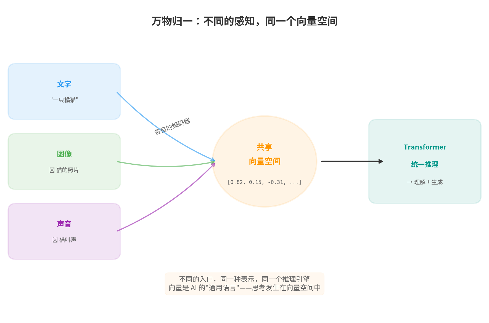
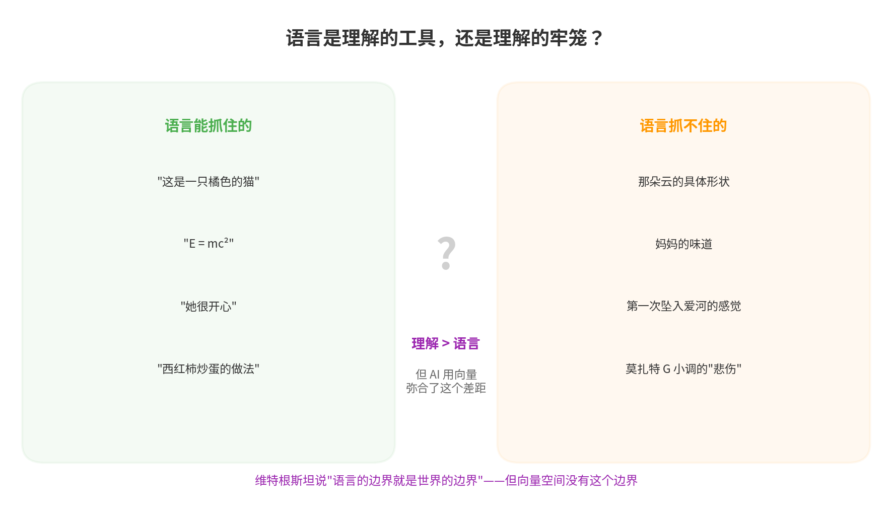
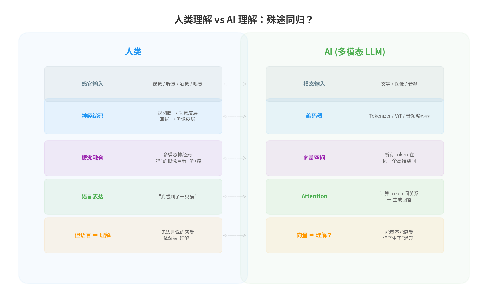

## 从一句话说起

在 [多模态文章](/ai-blog/posts/multimodal-llm-architecture/) 的结尾，我写了一句话：

> **多模态并没有发明新的"理解"机制，而是把所有模态都翻译成同一种语言——向量，然后让 Transformer 用它已经会的 Attention 机制来处理一切。**

写完之后我停了一下。

因为这句话的分量比我预想的要重。它不仅仅是在描述一个技术事实——它触及了一个更根本的问题：

**理解这个世界，最终都要变成语言吗？**

---

## 一、AI 的选择：向量

先回顾一个事实。

当今最强的多模态 AI 是这样工作的：

<div style="text-align: center; margin: 20px 0;">

</div>

<div style="text-align: center; font-size: 0.85em; color: #888; margin-top: -10px; margin-bottom: 20px;">▲ 万物归一：文字、图像、声音——不同的入口，同一个向量空间</div>

```text
文字  → Tokenizer → 向量序列 ──┐
图片  → ViT       → 向量序列 ──┼──→ Transformer → 统一推理 → 输出
声音  → 音频编码器 → 向量序列 ──┘
```

对 Transformer 来说，进来的都是**向量**。它不关心这个向量来自文字、图片还是声音。它只做一件事：用 Attention 计算每个向量和其他所有向量之间的关系。

这意味着，**AI 用来"理解"世界的基本单位，不是词，不是像素，不是声波——而是向量。**

向量是一组数字。比如 `[0.82, 0.15, -0.31, 0.67, ...]`，可能有 768 维，也可能有 4096 维。每个维度没有人类可读的含义——你不能说"第 7 维代表颜色"或"第 42 维代表情感"。但这组数字**整体**编码了某种语义。

当我们说"猫的图片和'猫'这个词在向量空间中很近"时，我们在说的是：**AI 找到了一种超越具体模态的表示方式，用纯数学的距离来刻画语义的远近。**

这是一个非常不人类的选择。

---

## 二、人类的选择：语言

人类理解世界的历史，几乎就是语言演化的历史。

```text
具体经验 → 命名 → 概念 → 推理 → 知识体系

"那个又红又圆又甜的东西" → "苹果"
"太阳从那边出来"         → "东方"
"东西落到地上"           → "重力"
"F = ma"                → 牛顿力学
```

语言做了一件了不起的事：**它把连续的、混沌的感觉经验，切割成离散的、可操作的概念。**

有了"苹果"这个词，你不需要每次都重新描述"那个又红又圆又甜的东西"。有了"重力"这个概念，你不需要每次都从头推导为什么东西会落到地上。

**语言是人类发明的最强大的压缩工具。** 它把无穷的经验压缩成有限的词汇，让我们能用几十万个词描述一个无穷复杂的世界。

在 [《压缩即智能》](/ai-blog/posts/opening-essay/) 那篇开篇文章中我们说过：

> 智能的本质是压缩——用更少的东西表示更多的东西。

语言就是人类版的"压缩"。

所以你的直觉是对的：**理解最终要变成语言——至少对于人类来说是这样的。** 我们思考时使用语言，我们交流时依赖语言，我们建构知识体系时离不开语言。

但这里有一个微妙的问题——

---

## 三、语言的边界

1921 年，维特根斯坦在《逻辑哲学论》中写下了一句著名的话：

> **"我的语言的边界就是我的世界的边界。"**
>
> (Die Grenzen meiner Sprache bedeuten die Grenzen meiner Welt.)

这句话有两种读法。

**读法一（限制性）**：你只能思考你能用语言表达的东西。语言之外没有思想。

**读法二（描述性）**：语言能到达的地方就是你世界的范围——语言越丰富，世界越大。

不管哪种读法，它都预设了一个前提：**语言 = 理解的边界。**

但真的是这样吗？

<div style="text-align: center; margin: 20px 0;">

</div>

<div style="text-align: center; font-size: 0.85em; color: #888; margin-top: -10px; margin-bottom: 20px;">▲ 人类的理解范围远大于语言能表达的范围</div>

想一想你自己的经验：

```text
你能用语言完美描述的：
  "这是一只橘色的猫"     → 语言足够
  "1 + 1 = 2"           → 语言足够
  "她比我高 5 厘米"      → 语言足够

你无法用语言完美描述的：
  妈妈做的红烧肉的味道   → 你能说"咸鲜""入味"，但这和真实的味觉差了十万八千里
  第一次看到大海的震撼   → "壮观""辽阔"——词语太单薄了
  莫扎特 G 小调 40 号交响曲的第一乐章为什么让人心碎
                        → 你可以写一万字乐评，但不如听 30 秒
  你的脸                → 你能说"瓜子脸、大眼睛"，但这描述适用于几百万人
```

**我们理解的东西，远远多于我们能说出来的东西。**

心理学家称之为"内隐知识"（tacit knowledge）——波兰尼的名言是"我们知道的比我们能说出来的多得多"（We know more than we can tell）。

一个经验丰富的面包师知道面团什么时候揉好了——他能感觉到面团的弹性、湿度、温度。但如果你让他用语言精确描述这个判断标准，他做不到。

一个围棋高手看一眼棋盘就知道"形势不好"——但如果你让他精确解释为什么，他可能只能说"感觉"。

**这些理解是真实的、有效的、但超越了语言的表达能力。**

---

## 四、向量：一种比语言更宽的表示

回到 AI。

当我们说"向量是 AI 的通用语言"时，有一个关键的区别：**向量不是人类语言。**

人类语言是离散的——"猫"或者"不是猫"，中间没有连续过渡。

向量是连续的——在"猫"的向量和"狗"的向量之间，有无穷多个中间状态。

```text
人类语言的世界：
  "猫"  "狗"  "老虎"  "狮子"
   ●     ●     ●      ●     ← 离散的点，互不连接

向量空间的世界：
  猫 ———— 狗
  |        |
  |        |     ← 连续的空间，可以平滑过渡
  |        |
  老虎 ——— 狮子

  你可以有一个"30% 猫 + 70% 狗"的向量
  → 这个向量在人类语言中没有对应的词
  → 但它在数学上是有意义的
```

这引出一个令人不安的可能性：

> **向量空间中存在大量"没有对应人类语言的概念"。**

模型可能在向量空间中发现了一些语义关系，这些关系对生成正确答案非常重要，但人类没有为它们命名过。

我们在 [Embedding 文章](/ai-blog/posts/embedding/) 中提到过 Word2Vec 的经典发现：

```text
vec("国王") - vec("男人") + vec("女人") ≈ vec("王后")
```

这个向量运算揭示了一个语义关系——性别与权力的交叉。人类当然理解"国王对应王后"，但我们不太会用"性别维度上的平移"来描述这种关系。**向量空间提供了一种人类语言没有的描述方式。**

在更高维的空间里，这种"语言无法命名但数学上有意义"的结构只会更多。

---

## 五、人类和 AI 的对比：殊途同归？

把人类的理解过程和 AI 的理解过程放在一起看，会发现一个有趣的对称性：

<div style="text-align: center; margin: 20px 0;">

</div>

<div style="text-align: center; font-size: 0.85em; color: #888; margin-top: -10px; margin-bottom: 20px;">▲ 人类用神经元，AI 用向量——但两者的处理流程惊人地相似</div>

<div style="overflow-x: auto; margin: 20px 0;">
<table style="width: 100%; border-collapse: collapse; font-size: 15px; line-height: 1.8;">
<thead>
<tr>
<th style="text-align: center; padding: 10px 16px; border-bottom: 3px solid #2196F3; color: #2196F3; font-size: 17px; width: 50%;">🧠 人类</th>
<th style="text-align: center; padding: 10px 16px; border-bottom: 3px solid #4CAF50; color: #4CAF50; font-size: 17px; width: 50%;">🤖 AI</th>
</tr>
</thead>
<tbody>
<tr>
<td style="padding: 10px 16px; border-bottom: 1px solid #eee; vertical-align: top;"><strong>感官输入</strong><br/>眼睛、耳朵、皮肤</td>
<td style="padding: 10px 16px; border-bottom: 1px solid #eee; vertical-align: top;"><strong>模态输入</strong><br/>像素、音频波形、字符</td>
</tr>
<tr>
<td style="padding: 10px 16px; border-bottom: 1px solid #eee; vertical-align: top;"><strong>神经编码</strong><br/>视网膜 → 视觉皮层<br/>耳蜗 → 听觉皮层</td>
<td style="padding: 10px 16px; border-bottom: 1px solid #eee; vertical-align: top;"><strong>编码器</strong><br/>ViT / 音频编码器 / Tokenizer</td>
</tr>
<tr>
<td style="padding: 10px 16px; border-bottom: 1px solid #eee; vertical-align: top;"><strong>概念融合</strong><br/>"猫"= 看到的形状 +<br/>听到的叫声 + 摸到的毛</td>
<td style="padding: 10px 16px; border-bottom: 1px solid #eee; vertical-align: top;"><strong>向量空间</strong><br/>所有模态的 token 在<br/>同一个高维空间中</td>
</tr>
<tr>
<td style="padding: 10px 16px; border-bottom: 1px solid #eee; vertical-align: top;"><strong>高阶推理</strong><br/>联想、推理、判断</td>
<td style="padding: 10px 16px; border-bottom: 1px solid #eee; vertical-align: top;"><strong>Attention</strong><br/>计算 token 间的关系</td>
</tr>
<tr>
<td style="padding: 10px 16px; vertical-align: top;"><strong>语言输出</strong><br/>"我看到了一只猫"</td>
<td style="padding: 10px 16px; vertical-align: top;"><strong>文本生成</strong><br/>"This is a cat"</td>
</tr>
</tbody>
</table>
</div>

两者有一个关键的相同点和一个关键的不同点：

**相同点：都需要一个"统一的中间表示"。**

人类大脑中有一种被称为"多模态神经元"的细胞——它对特定的概念做出反应，不管这个概念是通过视觉、听觉还是触觉传入的。2021 年 OpenAI 的研究发现，CLIP 模型中也存在类似的"多模态神经元"——对"蜘蛛人"这个概念响应的神经元，既对蜘蛛人的图片响应，也对"spider-man"这个文字响应。

**不同点：人类的中间表示不（完全）是语言，AI 的中间表示不（完全）是数字。**

人类在"概念"层面思考时，使用的不仅仅是语言。当你想象一只猫时，你脑中浮现的不是"猫"这两个字符，而是一团包含视觉形象、触感记忆、声音记忆的综合体验。语言只是这个综合体验的一个**标签**。

同样，AI 在向量空间中"理解"时，使用的也不仅仅是数字。那些数字编码了某种结构——我们可以用数学工具（余弦相似度、聚类分析）来探测这个结构的某些方面，但我们无法完全"读懂"一个 4096 维的向量在"想"什么。

---

## 六、三种关于"理解"的立场

这里涉及到一个古老的哲学分歧。让我们把它具体化：

### 立场一：语言决定论（强版本）

> 没有语言就没有思想。理解 = 用语言表述。

```text
代表人物: 沃尔夫 (Benjamin Lee Whorf)
核心主张: 你说什么语言，就有什么样的思想
         没有词汇的概念就不存在于你的思维中

例子:
  俄语有两个词表示蓝色 (голубой=浅蓝, синий=深蓝)
  → 实验表明俄语使用者区分蓝色深浅的速度比英语使用者更快
  → 语言确实影响了感知

AI 视角下的问题:
  LLM 只处理 token（离散的语言符号）
  → 它的"理解"完全建立在语言之上
  → 纯文本 LLM 是语言决定论的完美实验品
  → 结论: 它确实展现了令人惊讶的"理解"能力
     但它无法理解它没有见过的概念
```

如果这个立场是对的，那 LLM 的成功就有了一个优雅的解释：**语言确实够用了。** 人类用语言记录了足够多的知识，LLM 通过学习这些语言就"理解"了世界。

### 立场二：具身认知（强版本）

> 真正的理解需要身体。没有感觉、没有运动、没有物理交互，就没有真正的理解。

```text
代表人物: 梅洛-庞蒂, Rodney Brooks, Yann LeCun
核心主张: 语言是思想的"影子"，不是思想本身
         只学语言的 AI 只学到了影子，没学到实体

例子:
  你说"这杯咖啡很烫" → LLM 能回答"小心别烫到"
  但 LLM 从未"感觉过"烫是什么
  → 它理解了语言层面的"烫"
  → 但没有理解物理层面的"烫"

LeCun 的批评:
  "LLM 是在文本的表面上滑行"
  它学到了 token 之间的统计关系
  但没有建立关于物理世界的内部模型
  → 所以它会犯物理常识错误
```

如果这个立场是对的，那多模态 AI 是一个有趣的中间地带——它接触到了图像和声音（不仅仅是文字），但它仍然没有"身体"，不能真正和物理世界交互。

### 立场三：表示主义（多模态 AI 暗示的立场）

> 重要的不是"用什么"理解，而是"表示的结构"是否正确。

```text
核心主张: 理解 = 建立正确的内部表示
         语言是一种表示，向量也是一种表示
         只要表示的结构能正确反映世界的结构，
         就可以说"理解"了

柏拉图表示假说 (Huh & Isola, 2024):
  不同的模型，不同的训练数据，不同的模态
  → 如果训练得足够好
  → 最终都会收敛到相似的内部表示
  → 因为它们都在逼近同一个"现实的结构"

多模态 AI 支持这个立场:
  文字编码器和视觉编码器分别训练
  → 但在足够好的训练后
  → 它们的向量空间自动对齐
  → "猫"的文字向量和猫的图片向量指向同一个方向
  → 不同的入口，同一个结构
```

这是最让我着迷的立场。它暗示：**世界本身有一个"结构"，不管你用语言、用向量、还是用神经元去捕捉它，捕捉到的都是同一个东西。**

---

## 七、向量比语言"宽"在哪里？

如果接受"表示主义"的立场，那向量和语言作为两种表示方式，各有什么特点？

```text
语言的特点:
  ✓ 离散的 → 可以被人类阅读和交流
  ✓ 有语法 → 可以组合出无穷多的句子
  ✓ 社会性 → 在人与人之间传递
  ✗ 有限的 → 词汇是有限的，无法穷举所有概念
  ✗ 模糊的 → "红色"的边界在哪里？每个人的理解不同
  ✗ 文化绑定的 → 有些概念在某种语言中不存在

向量的特点:
  ✓ 连续的 → 可以表示任意精细的语义差异
  ✓ 跨模态 → 文字、图片、声音都用同一种表示
  ✓ 可计算 → 可以做加减法、求距离、做聚类
  ✗ 不可读 → 人类看不懂 4096 个数字
  ✗ 无社会性 → 不能在人与人之间直接交流
  ✗ 依赖训练 → 向量的含义完全由训练过程决定
```

向量比语言"宽"的关键在于：**它不需要"命名"就能表示。**

```text
语言需要命名:
  你必须有"猫"这个词，才能在语言中引用这个概念。
  如果一种文化从未见过猫，他们的语言中就没有"猫"这个词，
  就不能（在语言层面）方便地讨论猫。

向量不需要命名:
  在训练过程中，如果模型见过很多猫的图片，
  它的向量空间中自然会形成一个"猫簇"——
  即使没有任何人给它标注"这是猫"。
  DINOv2 就是这样：纯图片训练，没有任何文字标注，
  它的向量空间中依然自动出现了按物种、颜色、姿态组织的结构。
```

这是一个深刻的差异。**语言是"命名后才能思考"，向量是"结构先于命名"。**

---

## 八、那人类的"思考"到底用什么？

回到你最初的问题：**理解最终都要变成语言吗？**

我的回答是：**不完全是。**

人类的理解分为多个层次：

```text
层次 1: 感觉 (sensation)
  → 最底层，视觉、听觉、触觉的原始信号
  → 完全无语言，婴儿和动物也有
  → 对应 AI: 原始像素、音频波形

层次 2: 知觉 (perception)
  → 把感觉组织成有意义的整体
  → "那个东西是一只猫"
  → 大部分无语言（你不需要在心里默念"猫"就能认出猫）
  → 对应 AI: 视觉编码器的输出向量

层次 3: 概念 (concept)
  → 抽象的范畴，可以跨越具体经验
  → "猫是一种哺乳动物""所有猫都有胡须"
  → 通常与语言绑定，但不完全依赖语言
  → 对应 AI: 向量空间中的聚类结构

层次 4: 命题 (proposition)
  → 可以判断真假的陈述
  → "这只猫是橘色的""猫比狗独立"
  → 几乎完全用语言表达
  → 对应 AI: 文本 token 序列

层次 5: 理论 (theory)
  → 命题之间的系统关系
  → "猫是猫科动物，猫科属于食肉目..."
  → 完全依赖语言
  → 对应 AI: 长文本中的推理链
```

**关键洞察：越往底层，越不依赖语言；越往高层，越依赖语言。**

当你欣赏一幅画的美时，你在层次 1-2 活动——语言几乎无能为力。
当你证明一个数学定理时，你在层次 4-5 活动——语言（或数学符号这种特殊语言）是不可或缺的。

大多数日常思考在层次 2-4 之间——**语言参与了，但不是全部。** 你开车时做了无数判断（距离、速度、何时变道），这些判断大部分不经过语言层面的思考。

---

## 九、AI 给我们的启示

多模态 AI 的存在，给这个古老的哲学问题增加了一个新的实验数据点：

```text
实验结果:
  一个系统，
  没有身体，
  没有感觉器官，
  没有童年经历，
  只有向量和矩阵运算——

  却能够:
  ✓ 识别图片中的物体
  ✓ 描述场景中的空间关系
  ✓ 理解图片中的情绪和氛围
  ✓ 回答关于图片的推理问题
  ✓ 听懂语音中的情感
  ✓ 做跨模态的联想和类比

这证明了什么？
  → 至少对于许多任务，
    "正确的表示结构"比"真实的感知体验"更重要
  → 向量确实可以承载"某种理解"
```

但也别高兴太早。同样的 AI：

```text
  ✗ 不知道热水烫手是什么感觉
  ✗ 不理解为什么蒲公英让人想到离别
  ✗ 不明白为什么这首歌让你想起 2007 年的那个下午
  ✗ 不能从一次摔倒中学到"地滑要小心"的身体性教训
```

**这些不是"还没来得及训练"的能力，而是向量表示可能永远无法触及的领域——因为它们需要的不是更多的数据，而是一个身体。**

---

## 十、回到那句话

让我重新审视开头的那句话：

> 多模态并没有发明新的"理解"机制，而是把所有模态都翻译成同一种语言——向量，然后让 Transformer 用它已经会的 Attention 机制来处理一切。

现在我想补充：

**"翻译成向量"这件事，既是 AI 的力量之源，也是它的天花板。**

力量在于：向量是一种比人类语言**更宽**的表示——它是连续的、跨模态的、可计算的，能捕捉到语言无法命名的结构。

天花板在于：向量毕竟只是数字。它可以**编码**一只猫的全部视觉特征，但它不能**成为**看到一只猫的那个体验。

```text
哲学家内格尔 (Thomas Nagel) 1974 年的经典提问:
  "做一只蝙蝠是什么感觉？"
  (What is it like to be a bat?)

  蝙蝠用超声波"看"世界。
  你可以完全理解超声波的物理学、
  蝙蝠大脑的神经回路、
  声波反射的计算方式——
  但你永远不知道"用超声波看世界"是什么感觉。

同样:
  AI 可以完全处理一张猫的图片、
  生成完美的描述、
  回答所有关于这张图的问题——
  但它不知道"看到一只猫"是什么感觉。

  因为它没有"感觉"这个维度。
  向量空间里没有"体验"这个坐标轴。
```

### 那么，理解到底需要什么？

也许，人类的理解是这样一个三层蛋糕：

<div style="overflow-x: auto; margin: 20px 0;">
<table style="width: 100%; border-collapse: collapse; font-size: 15px; line-height: 1.8;">
<tr>
<td style="padding: 12px 16px; background: rgba(76,175,80,0.08); border: 2px solid #4CAF50; border-bottom: 1px solid #4CAF50; vertical-align: top; width: 60%;"><strong>语言层：</strong>命题、推理、知识体系<br/>"猫是哺乳动物""E = mc²"</td>
<td style="padding: 12px 16px; background: rgba(76,175,80,0.08); border: 2px solid #4CAF50; border-left: none; border-bottom: 1px solid #4CAF50; vertical-align: top; color: #4CAF50; font-weight: bold;">✅ AI 做得很好<br/><span style="font-weight: normal;">LLM 的主场</span></td>
</tr>
<tr>
<td style="padding: 12px 16px; background: rgba(255,152,0,0.08); border: 2px solid #FF9800; border-top: none; border-bottom: 1px solid #FF9800; vertical-align: top;"><strong>表示层：</strong>概念、模式、结构<br/>向量空间中的聚类和关系</td>
<td style="padding: 12px 16px; background: rgba(255,152,0,0.08); border: 2px solid #FF9800; border-left: none; border-top: none; border-bottom: 1px solid #FF9800; vertical-align: top; color: #FF9800; font-weight: bold;">🔄 AI 正在学会<br/><span style="font-weight: normal;">多模态 AI 的前沿</span></td>
</tr>
<tr>
<td style="padding: 12px 16px; background: rgba(244,67,54,0.08); border: 2px solid #F44336; border-top: none; vertical-align: top;"><strong>体验层：</strong>感受、情感、主观性<br/>"这朵花很美""妈妈的味道"</td>
<td style="padding: 12px 16px; background: rgba(244,67,54,0.08); border: 2px solid #F44336; border-left: none; border-top: none; vertical-align: top; color: #F44336; font-weight: bold;">❓ AI 可能永远缺失<br/><span style="font-weight: normal;">需要"有身体"</span></td>
</tr>
</table>
</div>

AI 正在征服前两层。第三层——也许那是人类最后的领地。

但也许不是。也许体验只是另一种信息结构，终将被某种更高维的表示所捕获。

**我们不知道答案。这正是这个问题迷人的地方。**

---

## 尾声：向量时代

回到最初的问题：理解这个世界，最终都要变成语言吗？

我现在的回答是：

**对人类来说——大部分是的，但不全是。** 我们的高阶思维几乎完全依赖语言，但我们最深层的理解——身体的、感官的、情感的——超越了语言。

**对 AI 来说——不需要。** AI 用了一种比语言更底层的表示：向量。向量不是词，不是句子，不是任何人类可读的符号。但它在数学上足够丰富，能够承载跨越文字、图像、声音的语义结构。

也许最深刻的启示是这个：

> **人类用语言把混沌的世界切割成可理解的碎片。AI 用向量把碎片重新编织成一个连续的整体。**

语言是一把刀，它通过切割来理解——给万物起名，画出边界，区分你我。

向量是一张网，它通过连接来理解——万物都是一个高维空间中的一个点，点与点之间有无数的路径和关系。

两种理解方式，一个世界。

<div style="background: rgba(76,175,80,0.08); border-left: 4px solid #4CAF50; padding: 12px 16px; margin: 20px 0; border-radius: 0 6px 6px 0;">

**一句话记住：** 人类用语言把世界切成碎片来理解，AI 用向量把碎片织成连续的空间来理解。语言是刀，向量是网——不同的工具，同一个世界。理解的本质也许不在于用什么工具，而在于是否捕捉到了世界的结构。

</div>

---

## 参考文献

1. Wittgenstein, L. (1921). *Tractatus Logico-Philosophicus*. (语言边界论)
2. Polanyi, M. (1966). *The Tacit Dimension*. (内隐知识)
3. Nagel, T. (1974). *What Is It Like to Be a Bat?* The Philosophical Review. (主观体验)
4. Huh, M. & Isola, P. (2024). *The Platonic Representation Hypothesis*. ICML. (表示收敛)
5. Goh, G. et al. (2021). *Multimodal Neurons in Artificial Neural Networks*. Distill. (CLIP 多模态神经元)
6. Brooks, R. (1990). *Elephants Don't Play Chess*. Robotics and Autonomous Systems. (具身认知)
7. Radford, A. et al. (2021). *Learning Transferable Visual Models From Natural Language Supervision* (CLIP). ICML.
8. Oquab, M. et al. (2023). *DINOv2: Learning Robust Visual Features without Supervision*. TMLR.

---

<div style="margin-top: 30px; padding-top: 20px; border-top: 1px solid #e0e0e0; font-size: 0.9em; color: #888; line-height: 1.8;">

本文首发于「AI 学习笔记」博客：https://Jason-Azure.github.io/ai-blog/<br>
微信公众号：AI-lab学习笔记<br>
延伸阅读：[当 AI 学会了看——多模态大模型架构拆解](/ai-blog/posts/multimodal-llm-architecture/) · [谁给了 AI 一双眼睛——CLIP 与开源军备竞赛](/ai-blog/posts/clip-open-source-story/) · [当数字学会了远近亲疏——Embedding](/ai-blog/posts/embedding/) · [压缩即智能](/ai-blog/posts/opening-essay/)

</div>
