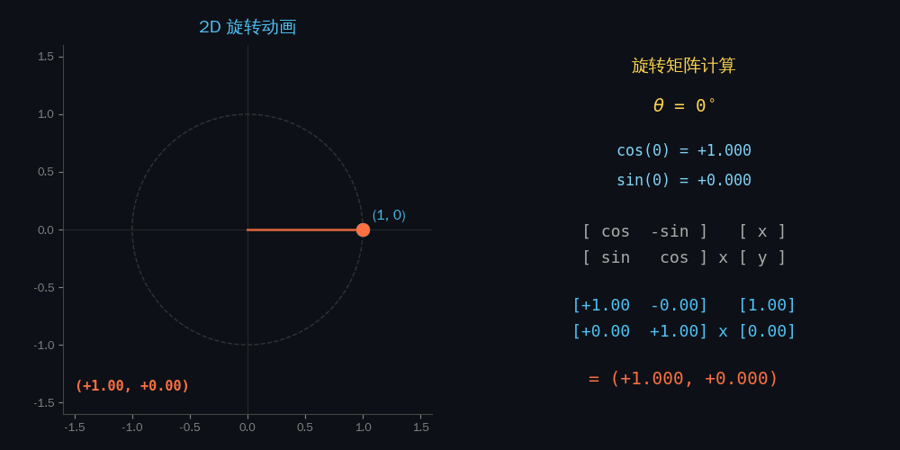
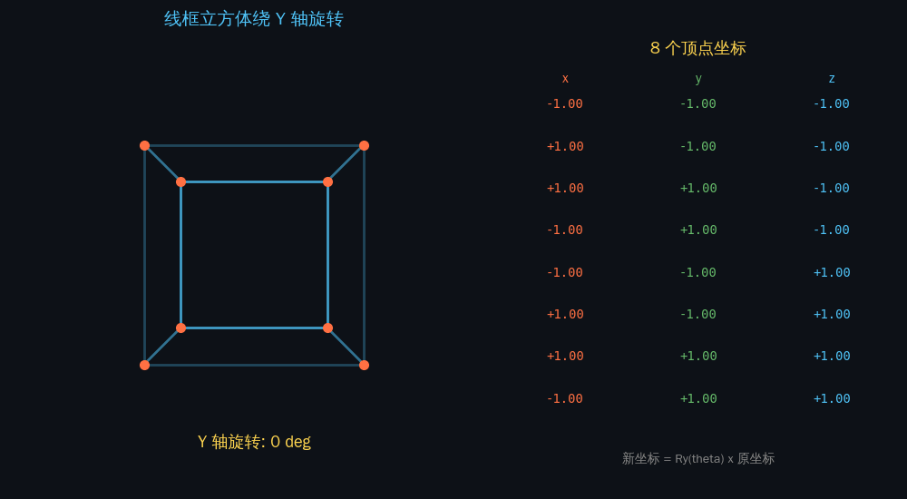
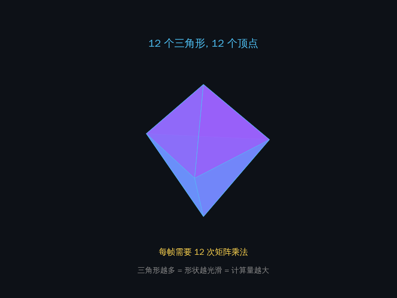
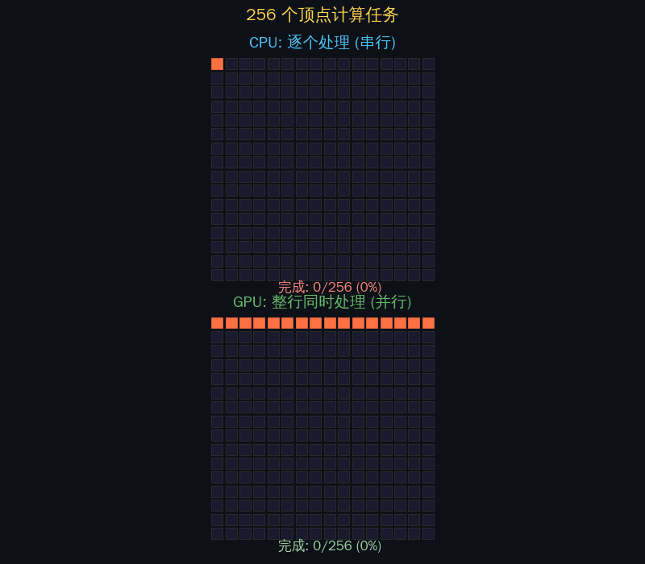
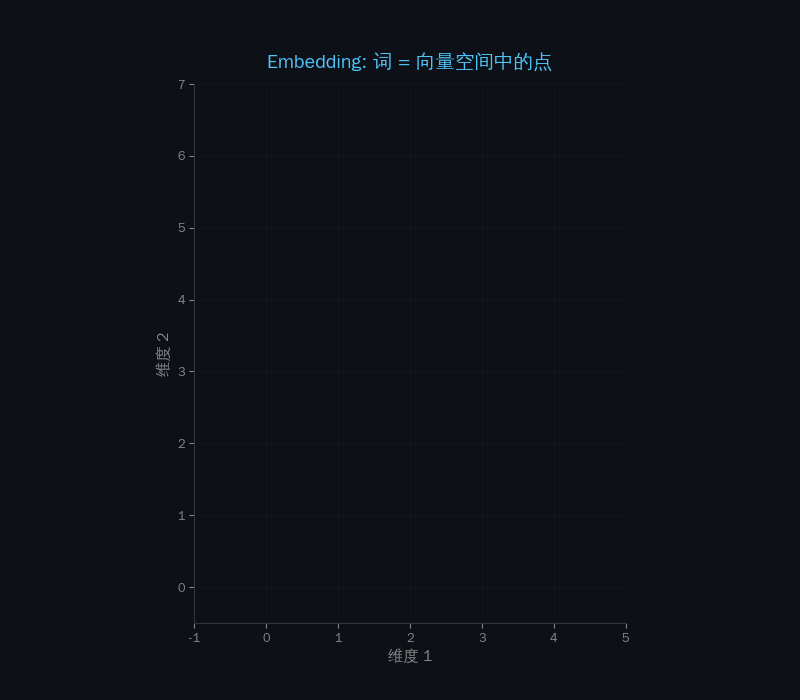

## 一个反直觉的事实

训练 ChatGPT 用了 **上万块** NVIDIA A100 GPU。

GPU——Graphics Processing Unit——**图形**处理单元。一块为了让游戏画面更流畅而设计的芯片，怎么就成了 AI 革命的引擎？

语言理解和游戏画面，看起来毫无关系。但如果你拆开它们的底层，你会发现——**它们在做完全一样的数学运算**。

这篇文章要回答一个问题：

> **GPU 不知道自己在画画还是在思考，它只知道自己在做矩阵乘法。**

---

## 第一章：GPU 的老本行——把三角形变成画面

### 3D 画面是怎么生成的

你在游戏里看到的一切——角色、建筑、爆炸特效——都是由无数个**三角形**拼出来的。

<div style="text-align: center; margin: 25px 0;">
<div style="display: inline-block; background: linear-gradient(135deg, #1a1a2e 0%, #16213e 100%); border-radius: 12px; padding: 30px 40px; color: #e0e0e0; font-family: monospace; font-size: 14px; line-height: 1.8;">
<div style="color: #4fc3f7; font-weight: bold; margin-bottom: 10px;">🎮 3D 渲染流水线</div>
<span style="background: #2d5016; padding: 4px 12px; border-radius: 4px; color: #a5d6a7;">建模</span>
<span style="color: #666; margin: 0 6px;">→</span>
<span style="background: #4a148c; padding: 4px 12px; border-radius: 4px; color: #ce93d8;">顶点变换</span>
<span style="color: #666; margin: 0 6px;">→</span>
<span style="background: #bf360c; padding: 4px 12px; border-radius: 4px; color: #ffab91;">光栅化</span>
<span style="color: #666; margin: 0 6px;">→</span>
<span style="background: #01579b; padding: 4px 12px; border-radius: 4px; color: #81d4fa;">着色</span>
<span style="color: #666; margin: 0 6px;">→</span>
<span style="background: #1b5e20; padding: 4px 12px; border-radius: 4px; color: #a5d6a7;">屏幕</span>
<div style="margin-top: 12px; font-size: 12px; color: #888;">
顶点坐标 → <strong style="color: #ce93d8;">矩阵变换</strong> → 像素填充 → 颜色计算 → 显示
</div>
</div>
</div>

关键数字：

| 场景 | 三角形数量 | 顶点数量 |
|------|-----------|---------|
| 一个立方体 | 12 个 | 8 个 |
| 一个游戏角色 | ~100,000 个 | ~50,000 个 |
| 一帧完整画面 | 数百万个 | **数百万个** |
| 每秒 60 帧 | → | **每秒处理上亿个顶点** |

每个顶点都要经过坐标变换——旋转、缩放、透视投影——才能从 3D 空间映射到你的 2D 屏幕上。

**而每一次坐标变换，就是一次矩阵乘法。**

### 旋转一个点 = 一次矩阵乘法

这是 3D 图形学里最基础的操作：把一个点绕原点旋转 θ 度。



看上面的动画：蓝色点 (1, 0) 经过旋转矩阵变换后，变成了橙色点。右侧实时显示矩阵计算过程——**每一帧的新位置，都是矩阵 × 旧坐标算出来的**。

<div style="overflow-x: auto; margin: 20px 0;">
<div style="display: flex; align-items: center; justify-content: center; gap: 30px; flex-wrap: wrap;">

<div style="position: relative; width: 220px; height: 220px; margin: 10px;">
<svg viewBox="0 0 220 220" style="width: 100%; height: 100%;">
<!-- 坐标轴 -->
<line x1="110" y1="20" x2="110" y2="200" stroke="#888" stroke-width="1" stroke-dasharray="4"/>
<line x1="20" y1="110" x2="200" y2="110" stroke="#888" stroke-width="1" stroke-dasharray="4"/>
<!-- 圆弧 -->
<circle cx="110" cy="110" r="70" fill="none" stroke="#444" stroke-width="1" stroke-dasharray="3"/>
<!-- 原始点 -->
<line x1="110" y1="110" x2="180" y2="110" stroke="#4fc3f7" stroke-width="2"/>
<circle cx="180" cy="110" r="6" fill="#4fc3f7"/>
<text x="188" y="108" fill="#4fc3f7" font-size="13" font-family="monospace">(x, y)</text>
<!-- 旋转后的点 -->
<line x1="110" y1="110" x2="159.5" y2="60.5" stroke="#ff7043" stroke-width="2"/>
<circle cx="159.5" cy="60.5" r="6" fill="#ff7043"/>
<text x="163" y="55" fill="#ff7043" font-size="13" font-family="monospace">(x', y')</text>
<!-- 角度弧 -->
<path d="M 140 110 A 30 30 0 0 0 145 80" fill="none" stroke="#ffd54f" stroke-width="2"/>
<text x="148" y="100" fill="#ffd54f" font-size="14" font-family="monospace">θ</text>
</svg>
</div>

<div style="font-family: monospace; font-size: 15px; line-height: 2.2; background: #1a1a2e; padding: 20px 25px; border-radius: 10px; color: #e0e0e0;">
<div style="color: #ffd54f; margin-bottom: 5px;">2D 旋转公式：</div>
┌ <span style="color: #ff7043;">x'</span> ┐ &nbsp; ┌ cos<span style="color: #ffd54f;">θ</span> &nbsp;-sin<span style="color: #ffd54f;">θ</span> ┐ &nbsp; ┌ <span style="color: #4fc3f7;">x</span> ┐<br>
│ &nbsp;&nbsp;│ = │ &nbsp;&nbsp;&nbsp;&nbsp;&nbsp;&nbsp;&nbsp;&nbsp;&nbsp;&nbsp;&nbsp;│ × │ &nbsp;&nbsp;│<br>
└ <span style="color: #ff7043;">y'</span> ┘ &nbsp; └ sin<span style="color: #ffd54f;">θ</span> &nbsp;&nbsp;cos<span style="color: #ffd54f;">θ</span> ┘ &nbsp; └ <span style="color: #4fc3f7;">y</span> ┘
</div>

</div>
</div>

在真正的 3D 游戏中也一样。下面的动画展示一个线框立方体（8 个顶点、12 条边）绕 Y 轴旋转，右侧实时显示每个顶点坐标的变化：



**游戏里物体的旋转，每一帧都是 8 次矩阵乘法。** 一个游戏角色有 5 万个顶点，那就是 5 万次。

每个顶点要经历**一连串**矩阵乘法：

```text
最终位置 = 投影矩阵 × 视图矩阵 × 模型矩阵 × 顶点坐标
             4×4         4×4         4×4         4×1
            (透视)      (摄像机)    (物体位置)   (原始坐标)
```

那一帧完整的游戏画面有多少三角形呢？



上面的动画展示了一个球面从粗糙到光滑的过程——**三角形越多，形状越光滑，但每个三角形的顶点都要做矩阵乘法**。现代游戏一帧有数百万个三角形。

**关键洞察：每个顶点的变换公式完全一样，只是输入坐标不同。**

一百万个顶点，同一道数学题，只是数据不同——这就是 GPU 存在的理由。

### CPU vs GPU：教授 vs 全班同学

先看一个直观的对比动画——256 个计算任务，CPU 逐个处理 vs GPU 整行同时处理：



**GPU 快不是因为单个核心更快，而是因为同时做。** 一万个简单核心同时工作，碾压一个超强核心。

<div style="display: flex; gap: 20px; flex-wrap: wrap; margin: 25px 0; justify-content: center;">

<div style="flex: 1; min-width: 280px; max-width: 400px; background: linear-gradient(135deg, #1a237e 0%, #0d47a1 100%); border-radius: 12px; padding: 25px; color: white;">
<div style="text-align: center; font-weight: bold; font-size: 18px; margin-bottom: 15px;">🧑‍🏫 CPU 方式（串行）</div>
<div style="font-family: monospace; font-size: 13px; line-height: 2;">
<div style="opacity: 0.5;">⬜ 顶点 1 → [变换] → ✅</div>
<div style="opacity: 0.7;">⬜ 顶点 2 → [变换] → ✅</div>
<div style="background: rgba(255,255,255,0.15); padding: 2px 8px; border-radius: 4px;">⬜ 顶点 3 → [变换中...] ⏳</div>
<div style="opacity: 0.3;">⬜ 顶点 4 → [等待...]</div>
<div style="opacity: 0.3;">⬜ 顶点 5 → [等待...]</div>
<div style="opacity: 0.2;">⬜ ... × 100万</div>
</div>
<div style="text-align: center; margin-top: 15px; color: #ff8a80; font-weight: bold;">
一个天才，一次做一道题<br>完成 100万个顶点需要 N 步
</div>
</div>

<div style="flex: 1; min-width: 280px; max-width: 400px; background: linear-gradient(135deg, #1b5e20 0%, #2e7d32 100%); border-radius: 12px; padding: 25px; color: white;">
<div style="text-align: center; font-weight: bold; font-size: 18px; margin-bottom: 15px;">🏭 GPU 方式（并行）</div>
<div style="font-family: monospace; font-size: 13px; line-height: 2;">
<div>⬜ 顶点 1 → [核心 0001] → ✅</div>
<div>⬜ 顶点 2 → [核心 0002] → ✅</div>
<div>⬜ 顶点 3 → [核心 0003] → ✅</div>
<div>⬜ 顶点 4 → [核心 0004] → ✅</div>
<div>⬜ 顶点 5 → [核心 0005] → ✅</div>
<div>⬜ ... × 16384 核心同时工作</div>
</div>
<div style="text-align: center; margin-top: 15px; color: #a5d6a7; font-weight: bold;">
一万个小学生，同时做同一道题<br>完成 100万个顶点只需 ~1 步
</div>
</div>

</div>

> **比喻：CPU 是一个数学天才，什么难题都能解，但一次只做一道。GPU 是一万个小学生，只会做乘法和加法，但同时做。当你的任务是"一百万道加法题"时，一万个小学生完胜。**

---

## 第二章：GPU 的架构——为并行而生

### 芯片级对比

CPU 和 GPU 在设计哲学上是完全不同的物种：

<div style="overflow-x: auto; margin: 25px 0;">
<div style="display: flex; gap: 20px; justify-content: center; flex-wrap: wrap;">

<div style="min-width: 280px; max-width: 380px; border: 2px solid #1565c0; border-radius: 12px; padding: 20px; background: linear-gradient(180deg, #e3f2fd 0%, #fff 100%);">
<div style="text-align: center; font-weight: bold; font-size: 17px; color: #1565c0; margin-bottom: 15px;">CPU — 少数精英</div>
<div style="display: grid; grid-template-columns: 1fr 1fr; gap: 8px; margin-bottom: 12px;">
<div style="background: #1565c0; color: white; padding: 15px 10px; border-radius: 8px; text-align: center; font-size: 12px;"><strong style="font-size: 16px;">核心 1</strong><br>超强单核</div>
<div style="background: #1565c0; color: white; padding: 15px 10px; border-radius: 8px; text-align: center; font-size: 12px;"><strong style="font-size: 16px;">核心 2</strong><br>超强单核</div>
<div style="background: #1565c0; color: white; padding: 15px 10px; border-radius: 8px; text-align: center; font-size: 12px;"><strong style="font-size: 16px;">核心 3</strong><br>超强单核</div>
<div style="background: #1565c0; color: white; padding: 15px 10px; border-radius: 8px; text-align: center; font-size: 12px;"><strong style="font-size: 16px;">核心 4</strong><br>超强单核</div>
</div>
<div style="background: #bbdefb; padding: 10px; border-radius: 6px; text-align: center; font-size: 13px; color: #1565c0;">
<strong>大缓存 + 复杂控制逻辑</strong><br>
分支预测、乱序执行、虚拟化...
</div>
<div style="text-align: center; margin-top: 10px; font-size: 13px; color: #666;">
4~24 核，每核都很<strong>强大</strong><br>
擅长：复杂逻辑、分支判断
</div>
</div>

<div style="min-width: 280px; max-width: 380px; border: 2px solid #2e7d32; border-radius: 12px; padding: 20px; background: linear-gradient(180deg, #e8f5e9 0%, #fff 100%);">
<div style="text-align: center; font-weight: bold; font-size: 17px; color: #2e7d32; margin-bottom: 15px;">GPU — 大规模军团</div>
<div style="display: flex; flex-wrap: wrap; gap: 2px; justify-content: center; margin-bottom: 12px; padding: 10px; background: #2e7d32; border-radius: 8px;">
<span style="display: inline-block; width: 6px; height: 6px; background: #a5d6a7; border-radius: 1px;"></span>
<span style="display: inline-block; width: 6px; height: 6px; background: #a5d6a7; border-radius: 1px;"></span>
<span style="display: inline-block; width: 6px; height: 6px; background: #a5d6a7; border-radius: 1px;"></span>
<span style="display: inline-block; width: 6px; height: 6px; background: #a5d6a7; border-radius: 1px;"></span>
<span style="display: inline-block; width: 6px; height: 6px; background: #a5d6a7; border-radius: 1px;"></span>
<span style="display: inline-block; width: 6px; height: 6px; background: #a5d6a7; border-radius: 1px;"></span>
<span style="display: inline-block; width: 6px; height: 6px; background: #a5d6a7; border-radius: 1px;"></span>
<span style="display: inline-block; width: 6px; height: 6px; background: #a5d6a7; border-radius: 1px;"></span>
<span style="display: inline-block; width: 6px; height: 6px; background: #a5d6a7; border-radius: 1px;"></span>
<span style="display: inline-block; width: 6px; height: 6px; background: #a5d6a7; border-radius: 1px;"></span>
<span style="display: inline-block; width: 6px; height: 6px; background: #a5d6a7; border-radius: 1px;"></span>
<span style="display: inline-block; width: 6px; height: 6px; background: #a5d6a7; border-radius: 1px;"></span>
<span style="display: inline-block; width: 6px; height: 6px; background: #a5d6a7; border-radius: 1px;"></span>
<span style="display: inline-block; width: 6px; height: 6px; background: #a5d6a7; border-radius: 1px;"></span>
<span style="display: inline-block; width: 6px; height: 6px; background: #a5d6a7; border-radius: 1px;"></span>
<span style="display: inline-block; width: 6px; height: 6px; background: #a5d6a7; border-radius: 1px;"></span>
<span style="display: inline-block; width: 6px; height: 6px; background: #81c784; border-radius: 1px;"></span>
<span style="display: inline-block; width: 6px; height: 6px; background: #81c784; border-radius: 1px;"></span>
<span style="display: inline-block; width: 6px; height: 6px; background: #81c784; border-radius: 1px;"></span>
<span style="display: inline-block; width: 6px; height: 6px; background: #81c784; border-radius: 1px;"></span>
<span style="display: inline-block; width: 6px; height: 6px; background: #81c784; border-radius: 1px;"></span>
<span style="display: inline-block; width: 6px; height: 6px; background: #81c784; border-radius: 1px;"></span>
<span style="display: inline-block; width: 6px; height: 6px; background: #81c784; border-radius: 1px;"></span>
<span style="display: inline-block; width: 6px; height: 6px; background: #81c784; border-radius: 1px;"></span>
<span style="display: inline-block; width: 6px; height: 6px; background: #66bb6a; border-radius: 1px;"></span>
<span style="display: inline-block; width: 6px; height: 6px; background: #66bb6a; border-radius: 1px;"></span>
<span style="display: inline-block; width: 6px; height: 6px; background: #66bb6a; border-radius: 1px;"></span>
<span style="display: inline-block; width: 6px; height: 6px; background: #66bb6a; border-radius: 1px;"></span>
<span style="display: inline-block; width: 6px; height: 6px; background: #66bb6a; border-radius: 1px;"></span>
<span style="display: inline-block; width: 6px; height: 6px; background: #66bb6a; border-radius: 1px;"></span>
<span style="display: inline-block; width: 6px; height: 6px; background: #66bb6a; border-radius: 1px;"></span>
<span style="display: inline-block; width: 6px; height: 6px; background: #66bb6a; border-radius: 1px;"></span>
<span style="display: inline-block; width: 6px; height: 6px; background: #a5d6a7; border-radius: 1px;"></span>
<span style="display: inline-block; width: 6px; height: 6px; background: #a5d6a7; border-radius: 1px;"></span>
<span style="display: inline-block; width: 6px; height: 6px; background: #a5d6a7; border-radius: 1px;"></span>
<span style="display: inline-block; width: 6px; height: 6px; background: #a5d6a7; border-radius: 1px;"></span>
<span style="display: inline-block; width: 6px; height: 6px; background: #a5d6a7; border-radius: 1px;"></span>
<span style="display: inline-block; width: 6px; height: 6px; background: #a5d6a7; border-radius: 1px;"></span>
<span style="display: inline-block; width: 6px; height: 6px; background: #a5d6a7; border-radius: 1px;"></span>
<span style="display: inline-block; width: 6px; height: 6px; background: #a5d6a7; border-radius: 1px;"></span>
<span style="display: inline-block; width: 6px; height: 6px; background: #81c784; border-radius: 1px;"></span>
<span style="display: inline-block; width: 6px; height: 6px; background: #81c784; border-radius: 1px;"></span>
<span style="display: inline-block; width: 6px; height: 6px; background: #81c784; border-radius: 1px;"></span>
<span style="display: inline-block; width: 6px; height: 6px; background: #81c784; border-radius: 1px;"></span>
<span style="display: inline-block; width: 6px; height: 6px; background: #81c784; border-radius: 1px;"></span>
<span style="display: inline-block; width: 6px; height: 6px; background: #81c784; border-radius: 1px;"></span>
<span style="display: inline-block; width: 6px; height: 6px; background: #81c784; border-radius: 1px;"></span>
<span style="display: inline-block; width: 6px; height: 6px; background: #81c784; border-radius: 1px;"></span>
<span style="display: inline-block; width: 6px; height: 6px; background: #66bb6a; border-radius: 1px;"></span>
<span style="display: inline-block; width: 6px; height: 6px; background: #66bb6a; border-radius: 1px;"></span>
<span style="display: inline-block; width: 6px; height: 6px; background: #66bb6a; border-radius: 1px;"></span>
<span style="display: inline-block; width: 6px; height: 6px; background: #66bb6a; border-radius: 1px;"></span>
<span style="display: inline-block; width: 6px; height: 6px; background: #66bb6a; border-radius: 1px;"></span>
<span style="display: inline-block; width: 6px; height: 6px; background: #66bb6a; border-radius: 1px;"></span>
<span style="display: inline-block; width: 6px; height: 6px; background: #66bb6a; border-radius: 1px;"></span>
<span style="display: inline-block; width: 6px; height: 6px; background: #66bb6a; border-radius: 1px;"></span>
<span style="display: inline-block; width: 6px; height: 6px; background: #a5d6a7; border-radius: 1px;"></span>
<span style="display: inline-block; width: 6px; height: 6px; background: #a5d6a7; border-radius: 1px;"></span>
<span style="display: inline-block; width: 6px; height: 6px; background: #a5d6a7; border-radius: 1px;"></span>
<span style="display: inline-block; width: 6px; height: 6px; background: #a5d6a7; border-radius: 1px;"></span>
<span style="display: inline-block; width: 6px; height: 6px; background: #a5d6a7; border-radius: 1px;"></span>
<span style="display: inline-block; width: 6px; height: 6px; background: #a5d6a7; border-radius: 1px;"></span>
<span style="display: inline-block; width: 6px; height: 6px; background: #a5d6a7; border-radius: 1px;"></span>
<span style="display: inline-block; width: 6px; height: 6px; background: #a5d6a7; border-radius: 1px;"></span>
</div>
<div style="background: #c8e6c9; padding: 10px; border-radius: 6px; text-align: center; font-size: 13px; color: #2e7d32;">
<strong>超高带宽显存 (HBM/GDDR6)</strong><br>
简单控制，海量算力
</div>
<div style="text-align: center; margin-top: 10px; font-size: 13px; color: #666;">
数千~万核，每核都很<strong>简单</strong><br>
擅长：相同运算 × 海量数据
</div>
</div>

</div>
</div>

### 关键数字对比

| 指标 | CPU (i9-14900K) | GPU (RTX 4090) | 倍数 |
|:---:|:---:|:---:|:---:|
| 核心数 | 24 | 16,384 | **~680×** |
| 时钟频率 | 6.0 GHz | 2.5 GHz | 0.4× |
| 内存带宽 | 90 GB/s | 1,008 GB/s | **11×** |
| FP32 算力 | ~1 TFLOPS | **83 TFLOPS** | **83×** |
| 功耗 | 253W | 450W | 1.8× |

注意：GPU 的时钟频率反而**更低**。它不靠单核速度取胜，而是靠**数量碾压**。

每瓦性能在矩阵运算上，GPU 完胜。

### CUDA：让 GPU 不只画画

2006 年，NVIDIA 做了一个改变历史的决定：发布 **CUDA**（Compute Unified Device Architecture）。

在此之前，GPU 只能通过图形 API（OpenGL、DirectX）来编程——你只能告诉它"画一个三角形"，不能让它做任意数学计算。

CUDA 打破了这个限制。它让程序员可以用类 C 语言直接在 GPU 上运行**任意代码**。GPU 从"只能画图的专用芯片"变成了"通用并行计算引擎"。

> **2006 年的 CUDA，是 AI 革命的基础设施转折点。** 没有它，就没有后来 AlexNet 的突破，就没有深度学习的爆发，就没有 ChatGPT。

---

## 第三章：LLM 里全是矩阵乘法

GPU 这么擅长矩阵运算，那 LLM 里有多少矩阵运算呢？

**答案是：几乎全是。**

### 第一步：Embedding——把词变成向量

在进入 Transformer 之前，每个词（token）首先要通过 **Embedding 查表**，变成向量空间中的一个点：



上面的动画展示了经典的词向量类比关系：**King - Man + Woman ≈ Queen**。这不是巧合，而是因为 Embedding 矩阵在训练中学到了语义关系。Embedding 本质上就是一次矩阵查表——用 token ID 去索引一个巨大的矩阵。

### Transformer 一层的计算流程

一个 Transformer Block（无论 GPT、Claude 还是 DeepSeek 都在用）的内部，是这样的：

<div style="background: linear-gradient(135deg, #f5f5f5 0%, #fafafa 100%); border: 2px solid #e0e0e0; border-radius: 12px; padding: 25px; margin: 25px 0; overflow-x: auto;">
<div style="text-align: center; font-weight: bold; color: #333; font-size: 17px; margin-bottom: 20px;">Transformer 一层 = 8 次矩阵乘法</div>

<div style="font-family: monospace; font-size: 13px; line-height: 2.4; max-width: 600px; margin: 0 auto;">
<div style="color: #666;">输入 X <span style="color: #999;">[seq_len × d_model]</span></div>
<div style="color: #666;">&nbsp;&nbsp;│</div>
<div>&nbsp;&nbsp;├→ X × W<sub>Q</sub> = <span style="color: #e65100; font-weight: bold;">Q</span> &nbsp;<span style="background: #fff3e0; padding: 2px 8px; border-radius: 3px; color: #e65100; font-size: 11px;">矩阵乘法 ①</span></div>
<div>&nbsp;&nbsp;├→ X × W<sub>K</sub> = <span style="color: #e65100; font-weight: bold;">K</span> &nbsp;<span style="background: #fff3e0; padding: 2px 8px; border-radius: 3px; color: #e65100; font-size: 11px;">矩阵乘法 ②</span></div>
<div>&nbsp;&nbsp;├→ X × W<sub>V</sub> = <span style="color: #e65100; font-weight: bold;">V</span> &nbsp;<span style="background: #fff3e0; padding: 2px 8px; border-radius: 3px; color: #e65100; font-size: 11px;">矩阵乘法 ③</span></div>
<div style="color: #666;">&nbsp;&nbsp;│</div>
<div>&nbsp;&nbsp;├→ Q × K<sup>T</sup> = <span style="color: #1565c0; font-weight: bold;">Scores</span> &nbsp;<span style="background: #e3f2fd; padding: 2px 8px; border-radius: 3px; color: #1565c0; font-size: 11px;">矩阵乘法 ④</span></div>
<div>&nbsp;&nbsp;├→ softmax(Scores) × V = <span style="color: #1565c0; font-weight: bold;">Attn</span> &nbsp;<span style="background: #e3f2fd; padding: 2px 8px; border-radius: 3px; color: #1565c0; font-size: 11px;">矩阵乘法 ⑤</span></div>
<div style="color: #666;">&nbsp;&nbsp;│</div>
<div>&nbsp;&nbsp;├→ Attn × W<sub>O</sub> = <span style="color: #2e7d32; font-weight: bold;">Output</span> &nbsp;<span style="background: #e8f5e9; padding: 2px 8px; border-radius: 3px; color: #2e7d32; font-size: 11px;">矩阵乘法 ⑥</span></div>
<div style="color: #666;">&nbsp;&nbsp;│</div>
<div>&nbsp;&nbsp;├→ X × W<sub>1</sub> → GELU &nbsp;<span style="background: #fce4ec; padding: 2px 8px; border-radius: 3px; color: #c62828; font-size: 11px;">矩阵乘法 ⑦</span></div>
<div>&nbsp;&nbsp;└→ &nbsp;&nbsp;&nbsp;&nbsp;&nbsp;&nbsp;× W<sub>2</sub> = <span style="color: #c62828; font-weight: bold;">FFN out</span> &nbsp;<span style="background: #fce4ec; padding: 2px 8px; border-radius: 3px; color: #c62828; font-size: 11px;">矩阵乘法 ⑧</span></div>
<div style="color: #666;">&nbsp;&nbsp;│</div>
<div style="color: #666;">输出 <span style="color: #999;">[seq_len × d_model]</span></div>
</div>
</div>

**一层 Transformer = 8 次大矩阵乘法。**

其中矩阵乘法 ⑦⑧ 就是 MLP 层——Transformer 的"思考肌肉"。下面的动画展示了 MLP 的核心过程：


**MLP 就是：升维 → 筛选 → 降维，核心是两次矩阵乘法。** 升维让模型有更大的空间去"思考"，GELU 激活函数筛掉不重要的特征，降维把结果压缩回原来的维度。

那 GPT-3 有 96 层，所以：

| 模型 | 层数 | 每次推理矩阵乘法次数 |
|:---:|:---:|:---:|
| GPT-2 small | 12 | 96 |
| GPT-2 large | 36 | 288 |
| GPT-3 | 96 | **768** |
| GPT-4 (估算) | ~120 | **~960** |

**生成每一个 token，都要把这几百次矩阵乘法从头跑一遍。**

### 一次矩阵乘法有多少计算？

以 GPT-2 的一个全连接层为例：

```text
输入 × 权重 = 输出
[512×768] × [768×768] = [512×768]

这一次乘法包含：
  512 × 768 × 768 = 301,989,888 次乘法
                   ≈ 3 亿次浮点运算

而这只是一层里 8 个矩阵乘法中的一个！
```

### 实际数字：GPT-3 生成一个 token 的计算量

<div style="background: linear-gradient(135deg, #1a1a2e 0%, #16213e 100%); border-radius: 12px; padding: 25px; color: #e0e0e0; margin: 25px 0;">
<div style="text-align: center; font-size: 17px; font-weight: bold; color: #4fc3f7; margin-bottom: 15px;">GPT-3 (175B 参数) 生成 1 个 token</div>

<div style="display: flex; gap: 15px; flex-wrap: wrap; justify-content: center; margin-top: 15px;">
<div style="flex: 1; min-width: 200px; background: rgba(255,255,255,0.08); border-radius: 8px; padding: 15px; text-align: center;">
<div style="font-size: 28px; font-weight: bold; color: #ff7043;">~350 GFLOP</div>
<div style="font-size: 13px; color: #999; margin-top: 5px;">每个 token 的计算量<br>(3500 亿次浮点运算)</div>
</div>
<div style="flex: 1; min-width: 200px; background: rgba(255,255,255,0.08); border-radius: 8px; padding: 15px; text-align: center;">
<div style="font-size: 28px; font-weight: bold; color: #4fc3f7;">~1.1 ms</div>
<div style="font-size: 13px; color: #999; margin-top: 5px;">A100 GPU 耗时<br>(312 TFLOPS 算力)</div>
</div>
<div style="flex: 1; min-width: 200px; background: rgba(255,255,255,0.08); border-radius: 8px; padding: 15px; text-align: center;">
<div style="font-size: 28px; font-weight: bold; color: #ff8a80;">~350 秒</div>
<div style="font-size: 13px; color: #999; margin-top: 5px;">CPU 耗时<br>(~1 TFLOPS 算力)</div>
</div>
</div>

<div style="text-align: center; margin-top: 15px; font-size: 14px; color: #ffd54f;">
生成一段 500 token 的回复：<br>
GPU ≈ 0.6 秒 &nbsp;&nbsp;|&nbsp;&nbsp; CPU ≈ <strong>48 小时</strong>
</div>
</div>

如果用 CPU 来跑 GPT-3，你问它一个问题，**要等两天才能收到回复**。

这就是为什么 LLM 必须用 GPU。

---

## 第四章：游戏画面 vs LLM——同一个本质

现在我们可以把两件事放在一起看了：

<div style="display: flex; gap: 0; flex-wrap: wrap; margin: 25px 0; justify-content: center;">

<div style="flex: 1; min-width: 270px; max-width: 400px; border: 2px solid #1565c0; border-radius: 12px 0 0 12px; padding: 20px; background: #e3f2fd;">
<div style="text-align: center; font-weight: bold; font-size: 17px; color: #1565c0; margin-bottom: 15px;">🎮 3D 游戏</div>
<div style="font-size: 14px; line-height: 2.2;">
📐 百万个<strong>顶点</strong><br>
🔢 每个做 4×4 <strong>矩阵乘法</strong><br>
🔄 所有顶点<strong>同一个公式</strong><br>
🕐 每秒 <strong>60 帧</strong><br>
🖼️ 结果 = <strong>一帧画面</strong>
</div>
<div style="margin-top: 15px; padding-top: 12px; border-top: 1px solid #90caf9;">
<div style="font-size: 13px; color: #1565c0;">
✅ 大规模并行<br>
✅ 相同操作重复<br>
✅ 计算密集<br>
✅ 矩阵运算为主
</div>
</div>
</div>

<div style="display: flex; align-items: center; justify-content: center; background: #333; padding: 0 15px; color: white; font-size: 24px; font-weight: bold; min-height: 100px;">
=
</div>

<div style="flex: 1; min-width: 270px; max-width: 400px; border: 2px solid #2e7d32; border-radius: 0 12px 12px 0; padding: 20px; background: #e8f5e9;">
<div style="text-align: center; font-weight: bold; font-size: 17px; color: #2e7d32; margin-bottom: 15px;">🤖 LLM 推理</div>
<div style="font-size: 14px; line-height: 2.2;">
🧮 百万个<strong>参数</strong><br>
🔢 每层做 d×d <strong>矩阵乘法</strong><br>
🔄 所有 token <strong>同一个公式</strong><br>
🕐 每秒数十个 <strong>token</strong><br>
💬 结果 = <strong>下一个词</strong>
</div>
<div style="margin-top: 15px; padding-top: 12px; border-top: 1px solid #a5d6a7;">
<div style="font-size: 13px; color: #2e7d32;">
✅ 大规模并行<br>
✅ 相同操作重复<br>
✅ 计算密集<br>
✅ 矩阵运算为主
</div>
</div>
</div>

</div>

<div style="text-align: center; margin: 20px 0; font-size: 16px;">
<strong>同一种数学 → 同一种硬件 → 不同的奇迹</strong>
</div>

> GPU 不知道它在渲染一个爆炸场景还是在回答"量子力学是什么"。对它来说，这两件事在硅片上的操作是一样的：**从显存读取矩阵 → 做大量乘加运算 → 写回结果。**

这就是为什么一块"游戏显卡"能成为 AI 引擎的原因——不是偶然的跨界，而是**数学本质的一致性**。

---

## 第五章：从 AlexNet 到 H100——GPU 如何成为 AI 的心脏

GPU 成为 AI 核心硬件不是一夜之间发生的，而是一条跨越 20 年的路：

<div style="position: relative; padding: 20px 0 20px 40px; margin: 25px 0;">

<div style="position: absolute; left: 18px; top: 0; bottom: 0; width: 3px; background: linear-gradient(to bottom, #1565c0, #2e7d32, #e65100, #c62828);"></div>

<div style="position: relative; margin-bottom: 25px; padding-left: 25px;">
<div style="position: absolute; left: -13px; top: 4px; width: 14px; height: 14px; background: #1565c0; border-radius: 50%; border: 3px solid #e3f2fd;"></div>
<div style="font-weight: bold; color: #1565c0;">2006 — CUDA 发布</div>
<div style="font-size: 14px; color: #666; margin-top: 4px;">NVIDIA 让 GPU 可以做通用计算。当时几乎没人关注。</div>
</div>

<div style="position: relative; margin-bottom: 25px; padding-left: 25px;">
<div style="position: absolute; left: -13px; top: 4px; width: 14px; height: 14px; background: #1565c0; border-radius: 50%; border: 3px solid #e3f2fd;"></div>
<div style="font-weight: bold; color: #1565c0;">2012 — AlexNet 震惊世界</div>
<div style="font-size: 14px; color: #666; margin-top: 4px;">用 2 块 GTX 580 GPU 训练的神经网络，碾压所有传统方法赢得 ImageNet 竞赛。<br><strong>深度学习 + GPU</strong> 的组合第一次证明了自己。</div>
</div>

<div style="position: relative; margin-bottom: 25px; padding-left: 25px;">
<div style="position: absolute; left: -13px; top: 4px; width: 14px; height: 14px; background: #2e7d32; border-radius: 50%; border: 3px solid #e8f5e9;"></div>
<div style="font-weight: bold; color: #2e7d32;">2017 — Transformer 诞生</div>
<div style="font-size: 14px; color: #666; margin-top: 4px;">Google 发表 "Attention Is All You Need"。Transformer 的核心操作——<br>矩阵乘法——完美匹配 GPU 架构。</div>
</div>

<div style="position: relative; margin-bottom: 25px; padding-left: 25px;">
<div style="position: absolute; left: -13px; top: 4px; width: 14px; height: 14px; background: #2e7d32; border-radius: 50%; border: 3px solid #e8f5e9;"></div>
<div style="font-weight: bold; color: #2e7d32;">2018 — V100 + Tensor Core</div>
<div style="font-size: 14px; color: #666; margin-top: 4px;">NVIDIA 推出专为矩阵乘法设计的硬件单元 Tensor Core。GPU 从"也能做 AI"变成"专门做 AI"。</div>
</div>

<div style="position: relative; margin-bottom: 25px; padding-left: 25px;">
<div style="position: absolute; left: -13px; top: 4px; width: 14px; height: 14px; background: #e65100; border-radius: 50%; border: 3px solid #fff3e0;"></div>
<div style="font-weight: bold; color: #e65100;">2020 — GPT-3 发布</div>
<div style="font-size: 14px; color: #666; margin-top: 4px;">OpenAI 用上万块 V100 训练 1750 亿参数模型。GPU 集群成为 AI 实验室的标配。</div>
</div>

<div style="position: relative; margin-bottom: 25px; padding-left: 25px;">
<div style="position: absolute; left: -13px; top: 4px; width: 14px; height: 14px; background: #c62828; border-radius: 50%; border: 3px solid #ffebee;"></div>
<div style="font-weight: bold; color: #c62828;">2022 — ChatGPT 引爆 AI 革命</div>
<div style="font-size: 14px; color: #666; margin-top: 4px;">NVIDIA 股价起飞。A100/H100 一卡难求，黑市价翻倍。</div>
</div>

<div style="position: relative; margin-bottom: 25px; padding-left: 25px;">
<div style="position: absolute; left: -13px; top: 4px; width: 14px; height: 14px; background: #c62828; border-radius: 50%; border: 3px solid #ffebee;"></div>
<div style="font-weight: bold; color: #c62828;">2023 — NVIDIA 市值破万亿</div>
<div style="font-size: 14px; color: #666; margin-top: 4px;">一家"显卡公司"成为全球最值钱的公司之一。Jensen Huang 从"卖游戏显卡的"变成了"AI 教父"。</div>
</div>

<div style="position: relative; padding-left: 25px;">
<div style="position: absolute; left: -13px; top: 4px; width: 14px; height: 14px; background: #c62828; border-radius: 50%; border: 3px solid #ffebee;"></div>
<div style="font-weight: bold; color: #c62828;">2024-2025 — Blackwell 架构</div>
<div style="font-size: 14px; color: #666; margin-top: 4px;">B200/GB200 专为大模型设计：FP4 精度、NVLink 互联、单卡 20 PFLOPS AI 算力。</div>
</div>

</div>

---

## 第六章：动手验证——在 VM 上跑矩阵乘法

> 以下 Demo 在本文作者的 AI Lab VM（8 核 CPU, 无 GPU）上实测。

### 实验 1：纯 Python vs PyTorch 矩阵乘法

```text
纯 Python 64×64 矩阵乘法: 25.5 ms
  → 如果算 4096×4096: 预估 ≈ 112 分钟!

PyTorch CPU (BLAS 优化):
   矩阵大小         耗时      加速比
   64×64         0.01ms    2,378×
   256×256       0.11ms   14,306×
   1024×1024     4.75ms   21,995×
   4096×4096   287.15ms   23,305× 🚀
```

**同样是 CPU，用了优化的线性代数库（BLAS）后，快了 2 万倍。** GPU 还会在此基础上再快几十到上百倍。

### 实验 2：模拟 Transformer 一层的运算

模拟 GPT-2 small 配置（d_model=768, seq_len=512）：

```text
  操作                   矩阵形状                        耗时
  Q = X × W_Q          [512×768]×[768×768]              1.40ms
  K = X × W_K          [512×768]×[768×768]              1.42ms
  V = X × W_V          [512×768]×[768×768]              1.31ms
  Scores = Q × Kᵀ      [512×768]×[768×512]              7.63ms
  Attn = Scores × V    [512×512]×[512×768]              0.80ms
  Out = Attn × W_O     [512×768]×[768×768]              1.37ms
  FFN_up = X × W₁      [512×768]×[768×3072]             4.66ms
  FFN_down = h × W₂    [512×3072]×[3072×768]            4.93ms
  ─────────────────────────────────────────────────────────────
  合计 (一层)                                           23.52ms

  GPT-2 有 12 层 → 总计 ≈ 282ms
  GPT-3 有 96 层, d=12288 → 计算量是这个的 ~24,000 倍
```

8 个矩阵乘法，占了 Transformer 一层几乎全部的计算量。其他操作（LayerNorm、softmax、GELU）相比之下微不足道。

### 实验 3：矩阵乘法的可并行度

```text
1024×1024 矩阵:
  矩阵乘法 (A @ B):   4.35ms   (493 GFLOPS)
  逐元素乘 (A * B):   2.30ms   (0.46 GFLOPS)

矩阵乘法的运算量是逐元素乘的 1024×
但耗时只多了 1.9×
```

**运算量多了 1024 倍，耗时只多了 2 倍。** 这就是矩阵乘法的可并行优化能力——每一个乘加操作都是独立的，可以同时做。这正是 GPU 的天赐之粮。

> Demo 脚本: `~/demo_gpu_matmul.py`，可在 VM 上直接运行复现以上数据。

---

## 第七章：不只是快——GPU 生态为何不可替代

GPU 成为 AI 的标准计算平台，不仅因为硬件快，更因为十几年积累的**软件生态**：

| 层次 | 代表 | 作用 |
|------|------|------|
| **硬件** | Tensor Core | 专门做矩阵乘法的硬件单元，比通用 CUDA 核心再快数倍 |
| **数学库** | cuBLAS | 针对 NVIDIA GPU 深度优化的线性代数库 |
| **深度学习库** | cuDNN | 卷积、Attention 等操作的 GPU 加速实现 |
| **推理优化** | TensorRT | 模型部署时的图优化、量化、内核融合 |
| **框架层** | PyTorch CUDA | 一行 `.cuda()` 就把计算从 CPU 搬到 GPU |
| **通信** | NCCL / NVLink | 多卡训练时 GPU 之间的高速互联 |

这套生态经过 **十几年积累**，形成了 NVIDIA 的护城河。

### 竞争者在追赶

| 平台 | 厂商 | 现状 |
|------|------|------|
| **ROCm** | AMD | 硬件不差，但软件生态远不如 CUDA |
| **TPU** | Google | Transformer 推理极快，但只在 Google Cloud 上可用 |
| **昇腾** | 华为 | 国产替代方案，在国内快速推进 |
| **Trainium/Inferentia** | AWS | 亚马逊自研，生态刚起步 |
| **Apple Silicon** | Apple | 统一内存很有潜力，训练生态待完善 |

**目前的现实是：如果你要训练或部署大模型，NVIDIA GPU 仍然是最稳妥的选择。**

### 一个常被忽视的瓶颈：显存带宽

很多人以为 GPU 快是因为算力大。但在大模型推理中，真正的瓶颈往往不是算力，而是**内存带宽**。

```text
推理时的数据流：
  显存 → GPU 核心 → 计算 → 写回显存
         ↑
    这一步才是瓶颈！
    (memory-bound，而非 compute-bound)

GPT-3 的 175B 参数 = 350GB (FP16)
每生成一个 token，要把这 350GB 参数全读一遍

A100 显存带宽: 2 TB/s → 理论上 175ms/token
H100 显存带宽: 3.35 TB/s → 理论上 104ms/token
CPU 内存带宽: 0.09 TB/s → 理论上 3,889ms/token
```

**GPU 的显存带宽是 CPU 的 20~40 倍，这是大模型推理速度差异的另一个关键来源。**

---

## 总结：一句话回答标题

> GPU 本来是为了每秒把**百万个三角形顶点**做矩阵变换、渲染成游戏画面而设计的。
>
> LLM 恰好也需要每秒对**百万个参数**做矩阵乘法、推算出下一个词。
>
> **同一种数学，同一种硬件，不同的奇迹。**

<div style="background: linear-gradient(135deg, #1a1a2e 0%, #16213e 100%); border-radius: 12px; padding: 30px; color: #e0e0e0; margin: 30px 0; text-align: center;">
<div style="font-size: 20px; font-weight: bold; color: #ffd54f; margin-bottom: 20px;">全文逻辑链</div>
<div style="display: flex; align-items: center; justify-content: center; gap: 8px; flex-wrap: wrap; font-size: 14px;">
<span style="background: #1565c0; padding: 8px 14px; border-radius: 6px; color: white;">3D 游戏需要<br>大量顶点变换</span>
<span style="color: #666;">→</span>
<span style="background: #1565c0; padding: 8px 14px; border-radius: 6px; color: white;">顶点变换<br>= 矩阵乘法</span>
<span style="color: #666;">→</span>
<span style="background: #2e7d32; padding: 8px 14px; border-radius: 6px; color: white;">GPU 为<br>并行矩阵乘而生</span>
<span style="color: #666;">→</span>
<span style="background: #e65100; padding: 8px 14px; border-radius: 6px; color: white;">LLM 也全是<br>矩阵乘法</span>
<span style="color: #666;">→</span>
<span style="background: #c62828; padding: 8px 14px; border-radius: 6px; color: white;">所以 LLM<br>用 GPU</span>
</div>
</div>

---

## 参考文献

1. NVIDIA, *CUDA C Programming Guide*, [docs.nvidia.com/cuda](https://docs.nvidia.com/cuda/cuda-c-programming-guide/)
2. Vaswani et al., *"Attention Is All You Need"*, NeurIPS 2017, [arXiv:1706.03762](https://arxiv.org/abs/1706.03762)
3. Krizhevsky et al., *"ImageNet Classification with Deep Convolutional Neural Networks"* (AlexNet), NeurIPS 2012
4. Brown et al., *"Language Models are Few-Shot Learners"* (GPT-3), NeurIPS 2020, [arXiv:2005.14165](https://arxiv.org/abs/2005.14165)
5. Andrej Karpathy, *"Let's build GPT: from scratch, in code, spelled out"*, YouTube, 2023
6. Horace He, *"Making Deep Learning Go Brrrr From First Principles"*, 2022, [horace.io](https://horace.io/brrr_intro.html)
7. Tim Dettmers, *"Which GPU for Deep Learning?"*, 2023, [timdettmers.com](https://timdettmers.com/2023/01/30/which-gpu-for-deep-learning/)
8. NVIDIA, *"How GPU Computing Works"*, GTC 2021

---

*本文 Demo 脚本可在 AI Lab VM 上直接运行：`python3 ~/demo_gpu_matmul.py`*
