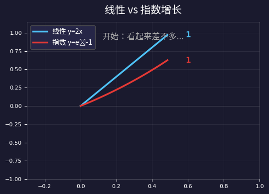
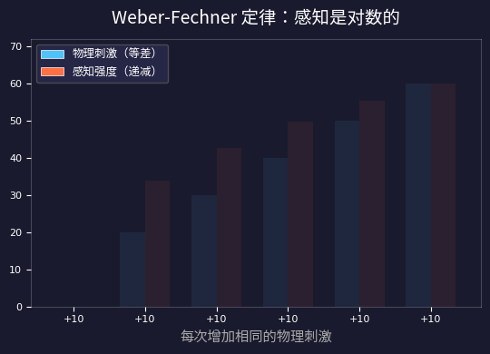
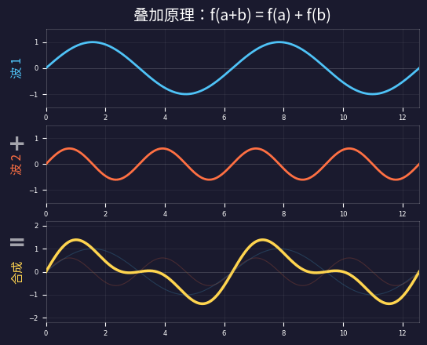
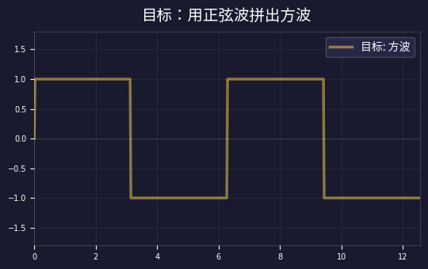
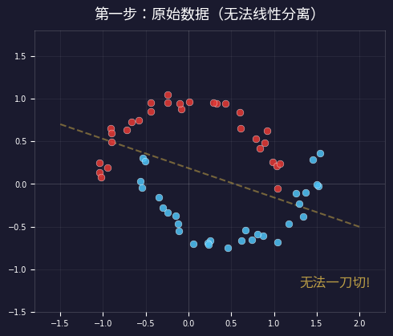
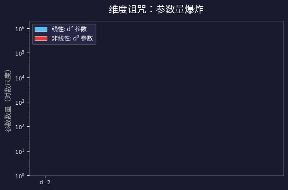

> 如果有人问你：**AI 里最重要的数学是什么？**
>
> 你大概会说"矩阵乘法"、"梯度下降"、"反向传播"。
>
> 但如果追问一句：**为什么偏偏是这些？为什么不是更"复杂"的数学？**
>
> 答案只有两个字：**线性**。

今天这篇文章，我们不写公式推导，而是追问一个更深的问题：

> **为什么人类选择了线性？是数学的必然，还是大脑的偏见？**

---

## 一、你的大脑在骗你——线性直觉的"甜蜜陷阱"

先做一道简单的题：

> **池塘里的睡莲每天翻倍增长。第 48 天铺满整个池塘。**
>
> **问：什么时候铺满一半？**

大多数人的第一反应是"第 24 天"——因为 48 的一半是 24，多直觉啊。

正确答案是**第 47 天**。因为"每天翻倍"意味着**指数增长**，最后一天就翻了一倍。

你的大脑为什么会犯这个错？因为**人脑的默认模式是线性思维**——它天然假设增长是匀速的，像一条直线。



这不是你的错。这是**进化**的结果。

在人类 99% 的进化史里，我们面对的世界大多是**近似线性**的：走 10 步比走 5 步远一倍，吃两个苹果比吃一个饱一倍。线性思维足以生存。

但大脑的这种"线性默认值"还有更深的表现——

### Weber-Fechner 定律：你的感觉在"骗"你

1860 年，心理物理学家 Fechner 发现了一条惊人的规律：

> **感知 = log(物理刺激)**
>
> 人的感知不是线性的，而是对数的。

什么意思？做个实验：

- 白开水里加 1 勺糖 → 嗯，甜了好多！
- 再加 1 勺 → 嗯，甜了一点。
- 再加 1 勺 → 嗯…好像差不多？

每次加的糖**一样多**（物理刺激等差），但你**感觉到的变化越来越小**（感知递减）。



这条定律对**亮度、声音、重量、温度**全部成立。它说明：

> **人脑用对数压缩世界，再用线性去理解它。**
>
> 线性不是世界的本质，而是大脑的"操作系统"。

那么问题来了：如果线性只是人脑的偏见，**为什么科学家和工程师也选择了线性？**

---

## 二、什么是线性？——一个规则统治一切

"线性"这个词听起来很数学，但核心只有**一条规则**：

> **f(a + b) = f(a) + f(b)**
>
> 整体的效果 = 各部分效果之和

用买水果来理解：

- **线性的**：3 斤苹果的价格 = 1 斤苹果的价格 × 3（没有打折也没有加价）
- **非线性的**：买 3 斤打八折——总价不等于单价的 3 倍了

线性的本质是：**没有惊喜，没有交互效应**。各部分独立，互不干扰。

这条规则在物理学中有一个更响亮的名字——**叠加原理**。

### 叠加原理：线性在物理中的化身

两个波同时传播时会怎样？答案是：**各走各的，互不干扰**。合成波 = 波1 + 波2。



这不仅仅是波的特性。叠加原理**统治着物理学的大半江山**：

| 领域 | 线性叠加的例子 |
|------|--------------|
| 电路 | 两个电压源 → 总电压 = V₁ + V₂ |
| 光学 | 两束光叠加 → 干涉条纹可以精确计算 |
| 力学 | 多个力同时作用 → 合力 = 各力之和 |
| 量子力学 | 薛定谔方程是线性的 → 波函数可叠加 |

为什么叠加原理如此普遍？因为**线性是自然界小扰动的普遍近似**：只要变化不太大，大部分物理现象都可以近似为线性的。

---

## 三、线性为什么"简单"？——从有限推无限

在[上一篇（#22 矩阵乘法的几何直觉）](/ai-blog/posts/geometric-intuition/)里，我们看到了一个惊人的事实：

> **只要知道基向量 i 和 j 去了哪里，就知道整个空间的每一个点去了哪里。**
>
> 一个 d 维的线性变换，只需要 d×d 个数字就能完全描述。

这就是线性的核心优势：**用有限的信息控制无限的行为**。

来看一张对比表：

| 特性 | 线性 | 非线性 |
|------|------|-------|
| 参数量 | **d² 个** | 无穷（任意函数） |
| 可预测性 | **知道基 → 知道一切** | 每个点都可能惊喜 |
| 可逆性 | **行列式≠0就可逆** | 不一定可逆 |
| 可组合性 | **矩阵乘法就是组合** | 组合后行为不可控 |
| 可学习性 | **梯度固定、优化凸** | 梯度可能爆炸/消失 |

线性变换具有四个"超能力"：

1. **有限参数**：d×d 个数字就够了
2. **完全可预测**：不会有意外行为
3. **可以组合**：A·B 还是线性的
4. **容易学习**：梯度下降保证收敛

> **一句话总结：**
>
> 线性 = 用 d² 个数字控制无穷个点的变换。这就是"从有限推无限"的力量。

---

## 四、自然界的线性密码——波、光、声音

1807 年，一位叫**傅里叶**的法国数学家提出了一个疯狂的想法：

> **任何形状的波，都可以拆成一组正弦波的叠加。**
>
> 方波、三角波、锯齿波……全部都可以。

当时的数学家们觉得他疯了。但后来的 200 年证明：**他是对的**。

看看一个方波如何被正弦波一层层"拼"出来：



为什么这能成功？因为**正弦波是线性系统的特征函数**。

这句话什么意思？还记得线性代数里的**特征向量**吗？

> **特征向量**：矩阵 A 作用在向量 v 上，v 的方向不变，只被缩放 → **Av = λv**
>
> **特征函数**：线性系统作用在正弦波上，波的形状不变，只改变大小和延迟

具体来说：你往一个线性系统（比如一个音箱、一根光纤）里输入一个正弦波 sin(ωt)，出来的**还是同频率的正弦波**，只不过可能变响了/变轻了（振幅变化），或者延迟了一下（相位偏移）：

```text
输入：sin(ωt)　→　线性系统　→　输出：A · sin(ωt + φ)

频率 ω 没变！只是振幅 A 和相位 φ 改变了
```

这太好了！因为这意味着我们可以**"拆开→逐个分析→合起来"**：

1. 把任意信号**拆**成一组正弦波（傅里叶分解）
2. 每个正弦波**独立**通过系统（形状不变，互不干扰）
3. 把结果**加起来**就是最终输出（叠加原理）

如果系统是**非线性的**，正弦波进去后会"变形"——产生新的频率（谐波失真），各频率之间互相耦合，就没法拆开分析了。所以非线性系统至今难以分析。

### 彩蛋：Transformer 的位置编码也是正弦波！

Vaswani 等人在 2017 年的原始 Transformer 论文中，选择了一个巧妙的位置编码方式：

```text
PE(pos, 2i)   = sin(pos / 10000^(2i/d))
PE(pos, 2i+1) = cos(pos / 10000^(2i/d))
```

为什么偏偏用正弦/余弦？正是因为正余弦的**线性特性**：

- **相对位置可以线性表示**：sin(pos+k) 和 cos(pos+k) 可以写成 sin(pos) 和 cos(pos) 的线性组合。这意味着模型可以通过**一个固定的线性变换**学会"往前看 k 个位置"。
- **不同频率编码不同尺度**：低频正弦波编码大范围位置关系（"这句话在文章开头还是结尾"），高频正弦波编码局部位置关系（"这个词和前一个词"）——正好像傅里叶分析一样！

正弦波的"特征函数"性质，让位置信息可以**优雅地注入到线性计算流**中，不会干扰其他维度——又是叠加原理。

傅里叶的这个思想彻底改变了人类文明：

| 技术 | 怎么用线性（傅里叶） |
|------|-------------------|
| MP3 音乐 | 拆成频率 → 扔掉人耳听不见的 → 压缩 10 倍 |
| JPEG 图片 | 拆成空间频率 → 扔掉眼睛看不出的 → 压缩 20 倍 |
| 5G 通信 | OFDM：把数据分配到不同频率的正弦波上并行传输 |
| 语音识别 | 声音 → 频谱图 → 让 AI 识别模式 |
| Transformer | 位置编码 = 不同频率的正弦波 → 编码序列位置 |

**从 1807 年的傅里叶到 2017 年的 Transformer——正弦波跨越了 210 年，仍然是线性世界里最好用的"基础零件"。**

---

## 五、神经网络的分工——搬运工与工头

现在回到 AI。

如果线性这么好，为什么不全用线性？答案是一个致命的问题：

> **多层线性 = 一层线性**
>
> 矩阵 A × 矩阵 B = 矩阵 C，还是一个线性变换。堆 100 层线性层，等于 1 层。白搭。

这就是为什么 1989 年 Cybenko 的**万能近似定理**（回忆 [#19 篇](/ai-blog/posts/universal-approximation/)）如此重要——它说：

> **只要在线性层之间插入一个非线性激活函数（比如 ReLU），神经网络就可以逼近任意连续函数。**

神经网络的秘密就在于**分工**：

| 角色 | 谁来做 | 干什么 | 比喻 |
|------|-------|-------|------|
| **搬运工** | 线性层 (W·x + b) | 旋转、拉伸、搬运数据 | 把东西摆到合适的位置 |
| **工头** | ReLU / GELU | 折叠空间、做决策 | 决定哪些留下，哪些扔掉 |



在 Transformer 里，这种分工无处不在：

| Transformer 组件 | 线性部分 | 非线性部分 |
|-----------------|---------|-----------|
| Attention（[#18](/ai-blog/posts/why-qkv/)） | W_Q, W_K, W_V 投影 | softmax（选择性聚焦） |
| MLP（[#20](/ai-blog/posts/mlp-knowledge/)） | W₁升维, W₂降维 | GELU / ReLU（决策） |
| Embedding | 查表 = 矩阵乘法 | — |
| Output Head | 线性投影到词表 | softmax（概率化） |

> **GPT 的 96% 计算量都花在线性运算（矩阵乘法）上。**
>
> 非线性只占很小的比例，但正是那一点点"折叠"，让网络拥有了无穷的表达力。

---

## 六、高维诅咒与线性的救赎

前面说了线性的好处。但还有一个更深层的原因让线性成为唯一的选择：**维度诅咒**。

想象你要描述一个函数：

- 1 维：把区间分成 10 段 → 需要 **10** 个样本
- 2 维：10×10 的网格 → 需要 **100** 个样本
- 10 维：10¹⁰ = **100 亿**个样本
- 100 维：10¹⁰⁰ 个样本 → **比宇宙中的原子还多**

这就是**维度诅咒**：维度每增加一点，需要的数据就指数级爆炸。

但如果你限制自己只考虑**线性函数**呢？

> **100 维的一般函数：需要 10¹⁰⁰ 个参数**
>
> **100 维的线性函数：只需要 10,000 个参数 (100²)**
>
> 差了 10⁹⁶ 倍——这不是数量级的差别，这是物理上可能与不可能的差别。



这就是为什么整个机器学习领域都遵循**奥卡姆剃刀**原则：

> *"如无必要，勿增实体。"*
>
> —— 奥卡姆的威廉，14 世纪

在 AI 里，这个原则变成了：

1. **先用线性**做主体计算（便宜、可靠、参数少）
2. **只在必要时**加一点非线性（提供表达力）
3. **用正则化**惩罚过度复杂（L1/L2/Dropout）

线性不是因为"懒"才被选择。**在高维世界里，线性是唯一能承受的复杂度。**

---

## 七、线性是人类认知的边界

最后，我想说一个更大的观察。

如果你回顾整个科学史，你会发现一个惊人的模式：

> **科学的方法论 = 找到一个坐标系，使得现象看起来是线性的。**

- 牛顿力学：F = ma → 力和加速度成正比（线性！）
- 热力学：温度感觉非线性？取对数 → 线性了
- 相对论：时空弯曲？局部近似 → 还是线性
- 量子力学：波函数演化？薛定谔方程是线性的

人类能理解的数学，**本质上都是线性的**。非线性现象（湍流、混沌、三体问题），至今仍是未解之谜。

所以答案就出来了：

> **AI 离不开线性，因为——**
>
> 线性是人类能理解、能计算、能优化的**最强工具**。
>
> 而非线性的那一点点"调味"，给了线性突破边界的能力。

### 闭环总结：线性在每个维度上的角色

| 维度 | 线性的角色 | 一句话 |
|------|-----------|-------|
| 认知 | 大脑的默认操作系统 | 我们天生用线性思考 |
| 数学 | 有限参数控制无限行为 | d² 个数字搞定一切 |
| 物理 | 叠加原理 + 傅里叶分析 | 拆开、分析、合起来 |
| AI 工程 | 搬运工（96% 的计算量） | 线性搬运 + 非线性折叠 |
| 统计 | 对抗维度诅咒的武器 | 奥卡姆剃刀的数学实现 |
| 哲学 | 人类认知的边界 | 能理解的 = 能线性化的 |

---

### AI 数学系列回顾 (#19—#23)

| 篇号 | 标题 | 核心问题 |
|------|------|---------|
| 19 | 万能近似定理 | 为什么神经网络能学任何函数？ |
| 20 | MLP 知识仓库 | 知识存在哪里？怎么存的？ |
| 21 | 为什么需要 GPU | GPU 为什么比 CPU 快 100 倍？ |
| 22 | 矩阵乘法的几何直觉 | 矩阵乘法在几何上干了什么？ |
| **23** | **为什么 AI 离不开线性（本文）** | **线性为什么是 AI 的基石？** |

---

> 从第 19 篇到今天，我们走过了一条完整的链条：
>
> **万能近似 → 知识存储 → 硬件加速 → 几何直觉 → 线性本质**
>
> 现在你知道了：AI 不是因为"凑巧"选了线性——
>
> **线性是人类认知能力所能触及的最远边界。在这条边界上，我们用 d² 个数字控制无穷个点，用一点点非线性打破边界——这就是 AI 的全部魔法。**
