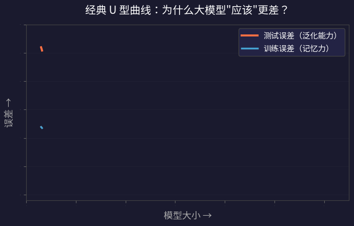
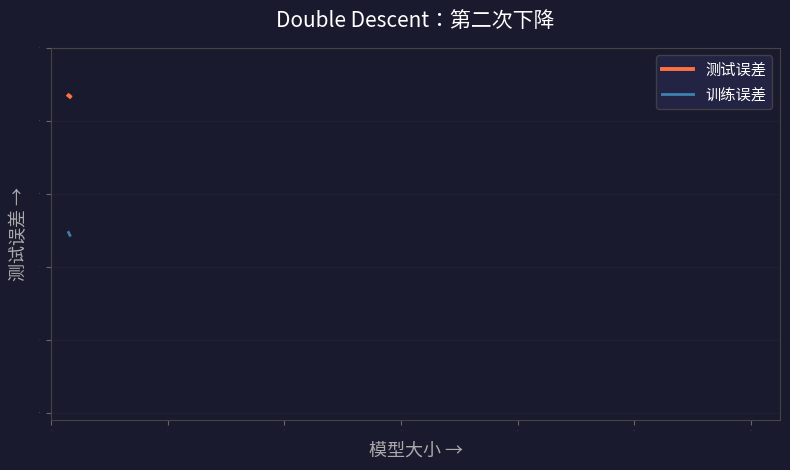
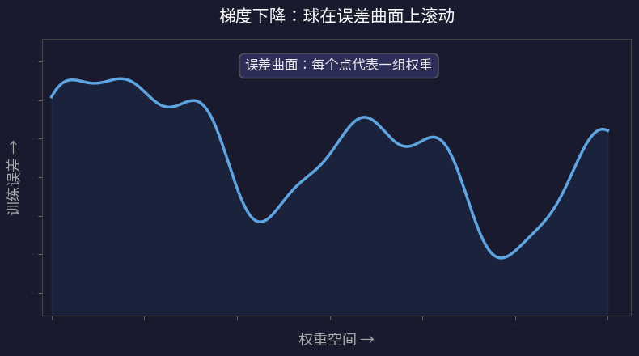
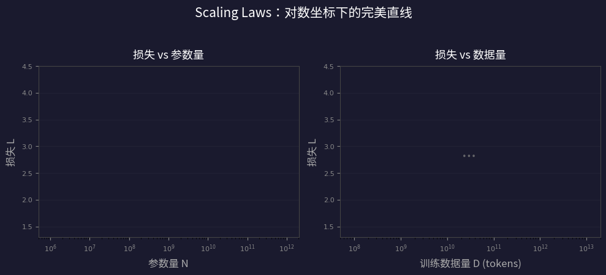

## 引言

你一定听过这样的说法：

> "GPT 不就是一个大号的自动补全吗？它只是在做统计，不可能真正理解任何东西。"

这种质疑不是外行的偏见——它背后站着 **300 年的统计学习理论**。这套理论有一个核心预测：**模型越大，表现越差。** 大模型会过拟合——背下所有训练样本，但面对新数据一塌糊涂。

然而现实打了理论一个耳光。从 GPT-3 到 GPT-4 到 Claude，模型越来越大，能力也越来越强。全世界的公司和政府砸下数百亿美元继续 scaling，没有人在缩小模型。

这到底是怎么回事？是理论错了，还是我们遗漏了什么？

本文基于 YouTube 频道 Algorithmic Simplicity 的视频 [*"THIS is why large language models can understand the world"*](https://www.youtube.com/watch?v=UKcWu1l_UNw)，结合论文调研和延伸思考，试图把这个问题彻底讲清楚。我们将沿着四条线索，拼出一幅完整的图景：

<div style="max-width: 640px; margin: 1.5em auto; font-size: 0.93em; line-height: 1.9;">

<div style="border-left: 3px solid #FF9800; padding-left: 14px; margin-bottom: 10px;">
<strong>第一幕：悖论</strong><br>
<span style="color: var(--secondary);">过拟合和 U 型曲线 —— 传统理论为什么说大模型必死</span>
</div>

<div style="border-left: 3px solid #2196F3; padding-left: 14px; margin-bottom: 10px;">
<strong>第二幕：反转</strong><br>
<span style="color: var(--secondary);">Double Descent —— 有人不信邪，发现了什么</span>
</div>

<div style="border-left: 3px solid #4CAF50; padding-left: 14px; margin-bottom: 10px;">
<strong>第三幕：解释</strong><br>
<span style="color: var(--secondary);">彩票假说 —— 大模型里藏着一个精巧的小模型</span>
</div>

<div style="border-left: 3px solid #9C27B0; padding-left: 14px; margin-bottom: 10px;">
<strong>第四幕：远景</strong><br>
<span style="color: var(--secondary);">Scaling Laws + 压缩即智能 —— 通往世界模型之路</span>
</div>

</div>

> **阅读前提：** 不需要机器学习基础。每个概念都会从直觉讲起。

---

## 第一幕：悖论 —— 大模型应该更差，不是更好

### 两种学法：理解 vs 死记硬背

想象你在训练一个神经网络学**加法**。你给它一堆例子：

| 输入 | 期望输出 |
|------|---------|
| 13 + 28 | 41 |
| 245 + 817 | 1062 |
| 9 + 4 | 13 |
| ... | ... |

网络调整自己的权重（weights），直到能正确地把输入映射到输出。

但"正确"有两种方式：

**方式 A：学到算法**
> 模型掌握了"逐位相加、遇十进一"的规则。只要 5 行代码就能描述，不管有多少训练样本。

**方式 B：背答案**
> 模型在内部构建了一张查找表（lookup table），把每个训练样本和它的答案都记下来。碰到见过的题，直接查表回答。

方式 A 只需要很少的"存储空间"（几行规则），但能**泛化**到任何新数字。方式 B 需要巨大的存储空间（所有训练样本），但碰到没见过的题就**完全猜不对**。

这就像考试作弊：背下所有答案 vs 真正理解知识。

问题是：**绝大多数能拟合训练数据的权重配置，行为上都更像查找表，而不是算法。** 如果把模型看作在所有可能的解中随机挑一个，它几乎一定会挑到"背答案"那种。

这就是**过拟合（overfitting）**：模型完美记住了训练数据的每一个细节，但没有学到数据背后的规律，所以无法泛化到新情况。

### 经典解法：把模型缩小

传统的解决办法非常直觉——**限制模型的容量**。

如果模型没有足够的权重来存储 10 万个训练样本的所有信息，它就无法构建查找表。但即使是很小的网络，也有足够的容量来实现"加法算法"——毕竟那只需要 5 行代码。

所以，如果我们把模型的大小调到**刚好能准确拟合训练数据、但不能更大**的程度，唯一可行的解就是那个简洁的底层规则。模型被迫去"理解"，而不是"死记"。

这是一个非常普遍的现象。**几乎总是**，数据背后的规律/机制是表示那些数据的**最紧凑方式**。

### U 型曲线：传统理论的核心预测

把这个逻辑画成图，就是机器学习教科书里的经典 **U 型曲线**：



- **左侧（太小）：** 模型连训练数据都拟合不好（欠拟合）
- **中间（刚好）：** 模型容量恰好够学规律，泛化最好
- **右侧（太大）：** 模型开始背答案，泛化变差（过拟合）

最大的模型甚至能实现**零训练误差**——完美背下了所有训练数据。但它的测试误差并不是最低的。最好的模型是中间那个。

这就是为什么 **5 年前，没有人认真考虑训练万亿参数的语言模型。** 如果你问当时的 AI 研究者：

> "把一个几万亿参数的神经网络扔到互联网文本上训练，你觉得怎么样？"

他们会说：

> "那不就是过拟合吗？它会记住训练集，变成一只**随机鹦鹉**（stochastic parrot），重复它背过的东西。不会有真正的理解。"

那时候没有人想着 scaling（扩大规模），因为它"不可能有用"。所有人都在研究更好的学习算法和网络架构。

---

## 第二幕：反转 —— 有人不信邪

### Double Descent：第二次下降

2019 年，两篇论文打破了这个僵局。

首先是 Mikhail Belkin 等人的论文 [*Reconciling Modern Machine Learning Practice and the Bias-Variance Trade-off*](https://arxiv.org/abs/1812.11118)（2019, PNAS），正式给这个现象命名为 **"Double Descent"（双重下降）**。

然后是 OpenAI 的 Preetum Nakkiran、Ilya Sutskever 等人的论文 [*Deep Double Descent: Where Bigger Models and More Data Can Hurt*](https://arxiv.org/abs/1912.02292)（ICLR 2020），大规模验证了这个现象。

他们做了什么？和之前的实验一样，训练不同大小的神经网络。但关键区别是：**他们没有在过拟合点停下来，而是继续把模型做大——大得多。**

结果出人意料：



**在模型大到足以完美背下所有训练数据之后，测试误差竟然又开始下降了！而且降得比之前的最优点还低，似乎没有尽头。**

这就是 **Double Descent** —— 曲线下降了两次。

### 这不是小打小闹

Nakkiran 等人在 **ResNet-18、5层CNN、Transformer** 多个架构上，在 **CIFAR-10/100、机器翻译** 多个任务上都观察到了这个现象。而且他们发现 Double Descent 沿着**三个独立的维度**发生：

| 维度 | 描述 |
|------|------|
| **模型大小** | 固定数据量和训练时间，增大模型 → 误差先降后升再降 |
| **训练时间** | 固定模型大小，训练更久 → 误差先降后升再降 |
| **数据量** | 固定模型，增加数据 → 在某些情况下，**更多数据反而更差** |

最后一点尤其反直觉：**增加训练数据有时候会让模型变差。** 这直接违反了"数据越多越好"的常识。原因是更多数据会把模型推入"插值峰值"附近——那个模型容量恰好等于数据量、压力最大的临界区域。

### 但他们是"不信邪"还是有理论支撑？

这是你问的好问题。答案是：**两者都有，但层次不同。**

**理论上有先兆，但被忽视了。** 早在 1990 年代，统计物理学家（Krogh & Hertz 1992, Opper & Kinzel 1995）用统计力学方法分析线性模型时，就预测了在"模型参数数量 ≈ 数据量"这个临界点会出现误差尖峰。但这些结果局限在简单的线性模型中，没有人把它和深度学习联系起来。

2017-2018 年，更直接的先兆出现了：

- **Advani & Saxe (2017)** 用随机矩阵理论证明，过参数化网络存在一个"冻结子空间"，防止过拟合——这是理论上第一次解释为什么"做大不会变差"
- **Spigler et al. (2018)** 用物理学中的**堵塞转变（jamming transition）** 类比，描述了欠参数化→过参数化之间的相变

**但 2019 年 Belkin 等人的真正贡献是概念性的：** 他们刻意在**不加任何正则化**的条件下，跨越完整的模型复杂度谱（包括那个关键的插值点），识别出了这个普遍模式，并赋予它一个响亮的名字。

为什么之前没有人注意到？因为**实际训练中几乎总是用正则化**（dropout, weight decay, early stopping, data augmentation），而正则化**压平了那个峰值**，掩盖了完整的双重下降曲线。Belkin 等人相当于掀开了帘子。

**所以，不完全是"赌一下"，但也不是理论自信地预测。** 更准确地说，是有人足够大胆地去探索理论留下的灰色地带，而那里恰好藏着金矿。

---

## 第三幕：解释 —— 大模型里藏着一个精巧的小模型

### 96% 的权重没用

Double Descent 表明大模型确实更好。但**为什么**？这不是明摆着违反奥卡姆剃刀吗？

几乎同一时期，MIT 的 Jonathan Frankle 和 Michael Carbin 发表了另一篇改变游戏规则的论文：[*The Lottery Ticket Hypothesis: Finding Sparse, Trainable Neural Networks*](https://arxiv.org/abs/1803.03635)（ICLR 2019，**最佳论文奖**）。

他们的发现非常惊人：**一个大型神经网络中，高达 96% 的权重可以被移除，剩下的 4% 子网络性能完全不变。**

具体实验结果：

| 架构 | 数据集 | 可剪掉的权重比例 |
|------|--------|---------------|
| Lenet-300-100 | MNIST | ~79% |
| Conv-2/4/6 | CIFAR-10 | 74–92% |
| VGG-19 | CIFAR-10 | 73–98.5% |
| ResNet-18 | CIFAR-10 | 73–98.5% |

他们用的剪枝方法叫**迭代幅度剪枝（Iterative Magnitude Pruning, IMP）：**

1. 随机初始化一个大网络，记录初始权重 θ₀
2. 完整训练这个网络
3. 删掉**绝对值最小**的 10% 权重（它们贡献最少）
4. 把**剩余权重重置**回初始值 θ₀
5. 重复步骤 2-4 约 30 轮

最终剩下的小网络（原始的 4%），从它的**原始随机初始化**出发重新训练，就能达到和完整大网络一样的性能！

### 彩票假说：为什么大网络能找到好解

这意味着：**大网络里真正干活的，是一个非常小的子网络。** 其余都是"废料"。这就是为什么它能泛化——真正的模型很简洁。

但问题来了：**既然那个小网络就够了，为什么不一开始就训练它？**

答案藏在**初始化**里。

要理解这一点，需要知道神经网络的训练方式——**梯度下降（Gradient Descent）**。它的核心思想是：对每个训练样本，微调所有权重，让输出更接近正确答案。

我们通常把这个过程想象成一个球在**误差曲面**上滚动：



- **球** = 当前的权重配置
- **曲面的高度** = 该权重配置的训练误差
- **球的起点** = 随机初始化
- **目标** = 滚到最低点（最优权重）

问题是：球可能**卡在局部最优**——当前位置四周都是上坡，但远处有更低的谷底。梯度下降永远找不到那个更好的解。

关键差异：
- **大网络：** 误差曲面有很多路径通向好的解。无论从哪里出发，球都很容易滚到一个不错的谷底
- **小网络：** 好解对应的谷底很窄。绝大多数随机起点都会让球卡在糟糕的局部最优

现在，想象大网络内部有**无数个小子网络**，每个子网络有不同的随机初始化。大多数子网络的初始化都很糟糕，没法学好。但只要**有一个子网络恰好有幸运的初始化**，它就能独自解决整个训练任务。

**这就是彩票假说的核心比喻：**

> 每个子网络就是一张彩票。单张彩票中奖的概率微乎其微。但当你有 **几十亿张彩票** 时，中奖就是必然事件。

而且：

- 网络越大 → 子网络数量**指数级增长** → 更多彩票
- 更多彩票 → 连**更小的**子网络也能中奖
- 更小的子网络 = **更简洁的模型** = **更好的泛化**

### 反直觉的结论

> **网络越大 → 中奖的子网络越小 → 学到的模型越简洁 → 泛化越好。**

统计学习理论没有错！**最简洁的模型仍然是最好的泛化器。** 大网络不是违反了奥卡姆剃刀，而是**帮助找到了更利的剃刀**。

这也解释了为什么**大网络训练更快**：一个工作假说是，拥有更好初始化的子网络会**更快地拟合数据**。它在其他子网络还没来得及学到任何东西之前，就率先解决了任务。

### 但为什么没有人只留下那 4%？

这是你提的一个非常好的问题。答案是：**没有人这么做，因为实操中行不通。**

原因有几个：

**1. 找彩票的代价太大**

IMP 需要反复训练完整的大网络——训练、剪枝、重置、再训练——重复 30 轮。对于训练一次就花数千万美元的 LLM，这意味着要花 **30 倍** 的训练成本才能找到"中奖彩票"。这完全不划算。

**2. 非结构化稀疏在硬件上跑不快**

IMP 产生的是**非结构化稀疏**——权重矩阵里随机散落着零。虽然 96% 的权重是零，但现代 GPU 是为**密集矩阵乘法**优化的。一个 96% 稀疏但散落着零的矩阵，在 GPU 上并不会比密集矩阵快 25 倍——可能只快 2 倍，甚至不快。

**3. 对大模型可能不成立**

Frankle 自己的后续研究 [(Frankle et al., 2019)](https://arxiv.org/abs/1903.01611) 发现，在更大的网络（如 ResNet-50 + ImageNet）上，回退到初始权重 θ₀ 的做法**会失败**。他们必须回退到训练早期的权重（"late rewinding"），而不是最初的随机值。这削弱了原始假说的优雅性。

**4. 论文中的 4% 只是上界**

视频作者也指出了这一点：IMP 使用的"每轮删最小权重"策略并不保证能找到**最小的**子网络。真正起作用的子网络可能比 4% 还小得多。但我们还没有更好的方法来找到它。

### 那现代 LLM 实际上怎么做？

既然不能直接"只留 4%"，行业走了几条实用路线：

| 方法 | 核心思路 | 代表 |
|------|---------|------|
| **量化 (Quantization)** | 降低每个权重的数值精度（FP16→INT4） | GPTQ, AWQ, GGUF |
| **知识蒸馏 (Distillation)** | 大模型当老师，训练小模型模仿它 | DistilBERT, TinyLlama, Llama 3.2 1B/3B |
| **结构化剪枝 (Structured Pruning)** | 删整行整列（对硬件友好） | SliceGPT, Sheared LLaMA |
| **混合专家 (MoE)** | 每次只激活部分参数 | Mixtral, DeepSeek-V3, GPT-4 (传闻) |

其中 **MoE（混合专家）** 是最接近彩票假说精神的架构设计：

> Mixtral 8x7B 有 470 亿总参数，但每个 token 只激活其中 2 个专家（约 130 亿参数）。DeepSeek-V3 更极端，每个 token 激活的参数比例更低。

**MoE 实现了彩票假说的承诺——每次推理只用一小部分参数——但通过架构设计，而不是事后剪枝。**

> 你 VM 上的 Ollama 模型（DeepSeek-R1:1.5b, Qwen3:0.6b）使用的是**量化**技术——用更少的比特存储每个权重。这是目前最广泛部署的 LLM 压缩方案。

---

## 第四幕：远景 —— Scaling Laws 与压缩即智能

### Scaling Laws：预测的力量

前三幕告诉我们大模型为什么能泛化。但它们能泛化到**什么程度**？泛化的速度有多快？

2020 年，OpenAI 的 Jared Kaplan、Dario Amodei 等人发表了一篇里程碑式的论文：[*Scaling Laws for Neural Language Models*](https://arxiv.org/abs/2001.08361)，发现了一个极其惊人的规律。

**语言模型的损失（loss）与模型大小、数据量、计算量之间存在光滑的幂律关系，跨越七个数量级！**



| 关系 | 公式 | 含义 |
|------|------|------|
| 损失 vs 参数量 (N) | L(N) ∝ N^{-0.076} | 参数翻倍，损失降 ~5% |
| 损失 vs 数据量 (D) | L(D) ∝ D^{-0.095} | 数据翻倍，损失降 ~6.5% |
| 损失 vs 计算量 (C) | L(C) ∝ C^{-0.050} | 算力翻倍，损失降 ~3.4% |

这些关系在对数坐标上画出来是完美的直线，像物理学定律一样优美。而且它们与具体的架构细节（层数、头数、维度宽窄）几乎无关——**只有总参数量 N 才重要**。

### 小指数，大后果

注意到指数有多小了吗？0.076、0.095、0.050——这意味着**收益递减极其严重**：

| 投入增加 | 损失降低（通过增大模型） |
|---------|-------------------|
| 10 倍 | ~16% |
| 100 倍 | ~29% |
| 1000 倍 | ~41% |
| 10000 倍 | ~52% |

砸 10000 倍的资源，只换来一半的损失降低。这就是为什么 Scaling 如此昂贵——但有趣的是，那些微小的损失降低往往对应着**质的能力飞跃**（涌现能力）。

### Chinchilla 修正：数据和模型同样重要

2022 年，DeepMind 的 Hoffmann 等人发表了 [*Training Compute-Optimal Large Language Models*](https://arxiv.org/abs/2203.15556)（即"Chinchilla 论文"），对 Kaplan 的 Scaling Laws 做了关键修正：

| | Kaplan (2020) | Chinchilla (2022) |
|---|---|---|
| 算力增加 10 倍时... | 模型扩 5.5 倍，数据扩 1.8 倍 | **模型和数据各扩 ~3.2 倍** |
| 核心观点 | 模型越大越好 | **模型和数据要同步扩大** |
| 最优比例 | 没有明确说 | **约 20 个 token/参数** |

为了验证，DeepMind 训练了 Chinchilla（700 亿参数）—— 用和 Gopher（2800 亿参数）相同的算力，但 **4 倍的训练数据**。结果：**700 亿的 Chinchilla 在几乎所有基准上打败了 2800 亿的 Gopher，也打败了 1750 亿的 GPT-3。**

更少的参数 + 更多的数据 = 更好的性能 + 更低的部署成本。

### Scaling Laws 和前两幕的联系

Scaling Laws 描述的正是 **Double Descent 曲线右侧** 那个持续下降的区域。现代 LLM 运行在"过参数化"区域的深处——远远超过了插值峰值——这就是为什么 Scaling Laws 看起来如此光滑。

而彩票假说提供了**机制性解释**：更大的网络之所以 scale，是因为它们包含**指数级增长**的子网络，使得优化过程能找到**越来越简洁**的内部模型。

### 奥卡姆剃刀：科学的基石

这一切最终回到了一个 700 年前的哲学原则——**奥卡姆剃刀（Occam's Razor）**：

> **"如无必要，勿增实体。"**
> —— 奥卡姆的威廉，约 1320 年

在现代信息论中，这被精确形式化为多个等价原则：

| 原则 | 提出者 | 年份 | 核心思想 |
|------|--------|------|---------|
| **Solomonoff 归纳** | Ray Solomonoff | 1964 | 最佳预测 = 对每种假说按其最短程序长度加权 |
| **Kolmogorov 复杂度** | Andrey Kolmogorov | 1965 | 一个事物的真正复杂度 = 能生成它的最短程序 |
| **最小描述长度 (MDL)** | Jorma Rissanen | 1978 | 最佳模型 = 使"模型描述长度 + 数据描述长度"之和最小 |
| **Hutter Prize** | Marcus Hutter | 2006 | 50 万欧元奖金——谁能最好地压缩维基百科 |

它们都在说同一件事：

> **理解 = 找到最简洁的描述 = 压缩。**

### 语言模型就是压缩器

这个联系不是隐喻，而是**数学上严格等价的**。

根据 Shannon 信源编码定理：一个能以交叉熵损失 L 预测下一个 token 的模型，可以被直接转化为一个**压缩算法**，用 L/ln(2) 比特编码每个 token。损失越低 = 压缩越好。

DeepMind 2024 年的论文 [*Language Modeling Is Compression*](https://arxiv.org/abs/2309.10668)（Delétang et al.）实证验证了这一点：

| 数据类型 | Chinchilla 70B 压缩率 | 专用压缩器压缩率 |
|---------|---------------------|----------------|
| **ImageNet 图片** | 43.4% | PNG: 58.5% |
| **LibriSpeech 音频** | 16.4% | FLAC: 30.3% |

**一个只在文本上训练的语言模型，连图片和音频都能比专用算法压缩得更好。** 这不是魔法——它说明语言模型学到的不是"语言的表面模式"，而是某种更通用的数据结构理解。

### 终极问题：能生成互联网所有文本的最短程序是什么？

现在我们可以问一个极端的问题：

> 如果一个完美的学习算法被训练来预测互联网上所有文本的下一个词，它最终会学到什么？

根据 Solomonoff 归纳的框架，它会趋向于找到**能生成这些文本的最短程序**。那么，这个最短程序是什么？

视频作者提出了一个大胆的推理链：

```text
互联网文本 ← 人类写的
人类 ← 人脑产生的
人脑 ← 物理规律驱动的
物理规律 ← 量子力学 + 初始条件

所以：能生成互联网文本的最短程序 ≈
    几千行量子力学代码 + 人脑初始配置 = 一个人脑模拟器
```

这个"程序"描述起来非常短（物理学标准模型相当简洁），但运行起来需要天文数字的算力。

**如果这个推理成立，那么一个足够强大的下一个词预测器，在理论极限上，就等价于一个人脑模拟器**——它必然拥有世界模型、常识理解、推理能力。

当然，这是一个**极限论证**（limit argument），不是对当前 LLM 的描述。当前的 LLM 远远达不到完美压缩。但它指明了一个方向：Scaling 不是在往沙漠里灌水，而是在**沿着一条通往理解的路前进**——只是我们不知道终点还有多远。

### Othello-GPT：实验证据

以上推理听起来很哲学，但有没有实验证据？有的。

2023 年，Kenneth Li 等人发表了 [*Emergent World Representations*](https://arxiv.org/abs/2210.13382)（ICLR 2023 Oral，前 5% 论文），做了一个精彩的实验：

他们训练了一个 GPT 模型，**只给它看 Othello（黑白棋）的走法序列**——类似于 "C4 D3 C3 E6..."——从不给它看棋盘、不告诉它规则、不提供任何空间信息。

然后用探测器（probe）检查模型内部。发现了什么？

> **模型自发地在内部形成了完整的 8×8 棋盘状态表征！** 它能追踪每个格子是黑棋、白棋还是空的。

更关键的是，研究者做了**干预实验**：人为修改模型内部的棋盘表征，模型的走法预测会随之改变。这证明这个表征不只是统计噪声——**模型真的在用它来做决策**。

一个从未"看到"过棋盘的模型，为了预测下一步棋，**被迫在内部构建了一个棋盘的世界模型。**

这正是"压缩即理解"论点的最佳实证：**预测的压力迫使模型发展出对底层世界的结构性理解。**

同年，Gurnee & Tegmark [(arXiv:2310.02207)](https://arxiv.org/abs/2310.02207) 在 Llama-2 模型中发现了类似的现象：模型内部存在**线性的空间和时间表征**——专门编码地理坐标的"空间神经元"和编码时间顺序的"时间神经元"。

---

## Yann LeCun 的反对意见

任何公允的讨论都不能回避反方观点。图灵奖得主、Meta 首席 AI 科学家 **Yann LeCun** 是"LLM 通往 AGI"路线最著名的批评者。他的核心论点：

1. **人类不会把常识写出来。** 你不会在互联网上写"苹果掉下来不会飞到天上去"，因为这太显而易见了。既然训练数据里没有这些常识，LLM 怎么学？

2. **自回归生成有根本缺陷。** 逐词生成会导致误差累积，无法进行真正的推理和规划。

3. **LLM 会幻觉。** 没有真正的世界模型，所以会自信地胡说。

### 反驳

1. **好的学习算法学的不是数据表面，而是生成数据的机制。** 即使常识没有被显式写出来，它仍然是生成那些文本的**必要条件**。一个足够好的压缩器必须推断出这些隐含的规则，否则无法达到最优压缩。Othello-GPT 就是证明——棋盘规则从未出现在训练数据中，但模型推断出了它们。

2. **Chain-of-Thought、推理模型（o1, DeepSeek-R1）** 已经部分解决了自回归的局限性——通过在推理时分配更多计算来进行搜索和验证。

3. **幻觉问题是程度问题，不是本质问题。** 人类也会产生"幻觉"（错误记忆、认知偏差）。随着模型能力提升，幻觉率在持续下降。

---

## 视频作者的判断

视频的最后，作者给出了一个非常有分寸的个人观点：

| 问题 | 他的立场 |
|------|---------|
| 纯靠 Scaling 能到 AGI 吗？ | **不够。** 改进速率太慢，收益递减太严重 |
| 语言建模这个**目标**本身能到 AGI 吗？ | **可以。** 但需要更好的学习算法/架构 |
| 方向 | 更好的架构 + 外部工具 + 预测下一个词 |

换句话说：**下一个词预测是正确的目标函数，但当前的 Transformer + 梯度下降可能不是最优的求解器。** 未来可能出现全新的架构或训练方法，在更少的算力下达到同样的压缩效果。

有趣的是，这个判断正在被现实验证。2024-2025 年最重要的进展不是更大的模型，而是**推理时计算（test-time compute）**——OpenAI o1/o3、DeepSeek-R1 这类模型通过在推理阶段"多想一会儿"来提升能力。这本质上是在 Scaling 的三个维度（参数、数据、算力）之外，开辟了第四个维度：**推理时间。**

---

## 全景拼图：五个概念如何连成一条线

让我们把本文所有核心概念串联起来：

```text
                   奥卡姆剃刀 (1320)
                   "最简解释最好"
                        │
                        ▼
              Solomonoff 归纳 (1964)
              "最短程序 = 最佳预测"
                        │
                        ▼
         ┌──────────────┼──────────────┐
         │              │              │
         ▼              ▼              ▼
    彩票假说         Scaling Laws    压缩=智能
    (2019)           (2020)         (Hutter)
    "大网络找到      "损失随规模     "预测=压缩
     更小的解"       幂律下降"       =理解"
         │              │              │
         └──────────────┼──────────────┘
                        │
                        ▼
              Double Descent (2019)
              "过参数化后泛化更好"
                        │
                        ▼
              世界模型涌现 (2023)
              Othello-GPT / 空间时间神经元
                        │
                        ▼
                  ┌─────┴─────┐
                  │           │
                  ▼           ▼
             当前 LLM     未来方向
             (有限压缩)   (更好的压缩器)
```

**一句话总结：**

> **大模型的力量不在于它有多少参数，而在于海量参数帮助它搜索到一个极其精巧的小模型——而这个小模型，就是对世界最好的压缩。压缩，就是理解。**

---

## 论文索引

本文涉及的主要论文，按时间排列：

| # | 论文 | 作者 | 年份 | 贡献 |
|---|------|------|------|------|
| 1 | [The Lottery Ticket Hypothesis](https://arxiv.org/abs/1803.03635) | Frankle & Carbin (MIT) | 2019 | 大网络中藏着可独立训练的小子网络 |
| 2 | [Reconciling Modern ML and Bias-Variance](https://arxiv.org/abs/1812.11118) | Belkin et al. | 2019 | 命名"Double Descent"现象 |
| 3 | [Deep Double Descent](https://arxiv.org/abs/1912.02292) | Nakkiran, Sutskever et al. | 2019 | 三个维度上的 Double Descent |
| 4 | [Scaling Laws for Neural LMs](https://arxiv.org/abs/2001.08361) | Kaplan, Amodei et al. (OpenAI) | 2020 | 损失与规模的幂律关系 |
| 5 | [Chinchilla](https://arxiv.org/abs/2203.15556) | Hoffmann et al. (DeepMind) | 2022 | 数据和模型应同步扩大 |
| 6 | [Othello-GPT](https://arxiv.org/abs/2210.13382) | Kenneth Li et al. | 2023 | 序列预测自发产生世界模型 |
| 7 | [Space and Time in LLMs](https://arxiv.org/abs/2310.02207) | Gurnee & Tegmark | 2023 | LLM 内部的空间/时间表征 |
| 8 | [Language Modeling Is Compression](https://arxiv.org/abs/2309.10668) | Delétang et al. (DeepMind) | 2024 | LLM 是通用压缩器 |
| 9 | [SparseGPT](https://arxiv.org/abs/2301.00774) | Frantar & Alistarh | 2023 | 一次性剪枝大模型 |
| 10 | [Wanda](https://arxiv.org/abs/2306.11695) | Sun et al. | 2024 | 基于权重×激活的 LLM 剪枝 |

---

## 写在最后

你可能注意到了，这篇文章的主题——**压缩即智能**——正是本博客开篇语的核心命题。

当我第一次写下"更高级的策略不是压缩数据本身，而是压缩生成数据的引导程序"时，说的正是 Solomonoff 归纳的核心思想。而今天这篇文章，通过 Double Descent、彩票假说、Scaling Laws 三条实证线索，为那个哲学命题提供了坚实的科学基础。

如果你和我一样，越来越觉得 LLM 不只是"大号的自动补全"，那么恭喜——你开始触碰到这个领域最深层的脉络了。

> **模型不需要被告知世界是什么样的。它只需要被要求预测下一个词——然后，为了做好这件事，它会自己去发现世界。**

---

*感谢 [Algorithmic Simplicity](https://www.youtube.com/@algorithmicsimplicity) 的精彩视频激发了这篇文章的写作。*
