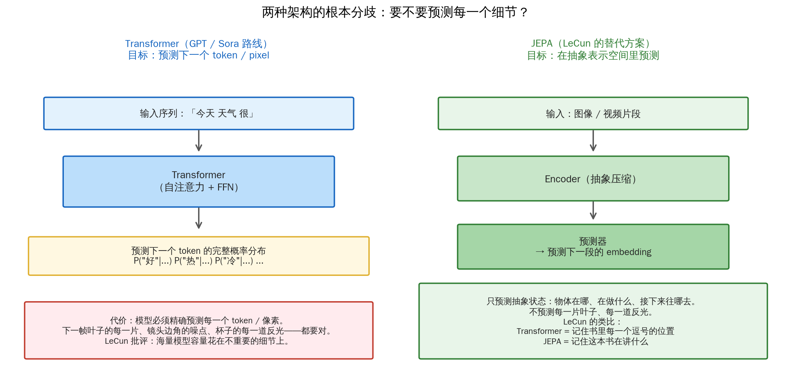

## 开篇：三个让 AI 圈尴尬的瞬间

**瞬间一。** 2024 年，你在 GPT-4o 里让它画一只手。图是好看的——线条流畅、光影逼真——只有一个问题：那只手有**六根**手指。你让它重画，它画了七根。再重画，五根——但大拇指长得像小指。

**瞬间二。** 2024 年 2 月，OpenAI 发布 Sora，号称"世界模拟器"。演示视频里：一个女人在东京街头走路、樱花飘落、灯光闪烁、精美无比。但仔细看有一段——**一个玻璃杯被打翻，玻璃直接穿过桌子落到了地板**。OpenAI 自己的技术博客里展示了这段视频，承认"模型对物理仍有理解限制"。

**瞬间三。** 2016 年 3 月，AlphaGo 在第 37 手下了那个震惊全世界的棋。赛后记者问李世石："你觉得它**知道**自己在下围棋吗？" 李世石沉默了很久，说："我不知道。它走的每一步都像在思考，但也可能它什么都没想。"

这三个瞬间指向同一个问题：

**AI 到底**理解**什么？**

它画不对手指，是因为不懂"手是什么、人有几根手指"——还是因为"它懂，只是没有**把手这个概念表征得好**"？

它让玻璃穿过桌子，是因为**根本没有物理概念**——还是因为"它有，只是调用不到"？

这个问题听起来像哲学系的午后闲谈。但 **AGI 走哪条路，一半取决于这个问题的答案。**

---

## 第一章：LeCun 的十年异议

如果你只能记住本文里一个人的名字，记住这个：**Yann LeCun**。

他不是普通人。他是**卷积神经网络**的发明人之一。1989 年他在贝尔实验室用 CNN 识别手写邮政编码——那是深度学习工业应用的第一个重大胜利。2018 年他和 Hinton、Bengio 一起获得图灵奖——AI 界的诺贝尔。现在他是 Meta 首席 AI 科学家。

这样一个人，却是**主流 LLM 路线最大声的反对者**。

从 2016 年开始，LeCun 就在不同场合表达过这个核心论点。2022 年到 2024 年，他在 Twitter、访谈、演讲里说得越来越直白：

> "LLM 是一条**死胡同**（off-ramp）。它们永远不会达到人类级别的智能。"

这不是谦虚或修辞。他讲了一个非常具体的技术论点：

**LLM 学的是**文本表层的统计模式**，不是**世界的因果和物理结构**。**

他常用的类比是："**一只猫比目前任何 LLM 都更懂这个世界。**"

为什么？因为一只猫知道：

- 从桌子上跳下去会落地（重力）
- 推一下玻璃杯它会滑动（摩擦和动量）
- 躲到沙发后面主人就看不见它（遮挡、空间）
- 听到罐头声音意味着吃的要来了（因果关联）

**这些常识一只猫用几个月就学会了。GPT-4 读遍整个互联网，还是会说"6 根手指"。**

LeCun 有一个更激进的数字对比：一个 17 岁的青少年，**20 小时**就能学会开车。一个现代自动驾驶系统，用**几百万小时**的驾驶数据，还没法可靠处理边缘情况。

他的结论是：**人类是通过感知和互动学习世界的，不是通过文本。** LLM 走反了路。

他提出了一个替代方案，叫 **JEPA**（Joint Embedding Predictive Architecture），我们第四章会详细讲。核心思想是：**不要预测下一个 token，要预测抽象表示空间里的下一个状态**。

这话在 2022 年听起来像在说"深度学习走错了路"——在一个 LLM 刚刚让所有人疯狂、OpenAI 估值破千亿美元的时刻，这是极不讨好的观点。

但 LeCun 坚持了 10 年。

---

## 第二章：Hinton 的反驳

**Geoffrey Hinton**——深度学习之父，LeCun 的图灵奖合作者，2024 年诺贝尔物理学奖得主（和 Hopfield 一起拿的，因为反向传播）。

如果有一个人和 LeCun 平起平坐，就是 Hinton。

2023 年，77 岁的 Hinton 辞去了 Google 的职位。所有人都以为他会站出来批评 LLM 的局限性——毕竟他是"AI 将毁灭人类"的预警者。很多记者以为他会赞同 LeCun。

**他恰恰相反。**

Hinton 说："**LLM 其实已经在理解了。你只是没看见它在理解。**"

他最著名的一段话（多次在访谈里重复）：

> "当你把整个互联网的文本压缩进一个固定大小的模型——几百 GB 变成几十 GB——你不可能只靠记忆做到。你必须**提炼出世界的结构**。这个结构就是一种理解。"

这个说法和贾因斯 1957 年谈熵时说的话几乎是一脉的——**压缩即理解**。

Hinton 的论据很直接：

- 你能问 GPT "如果我把一个苹果放到碗里，然后把碗倒过来，苹果在哪里？"它答对。它没有身体，没有眼睛，没有手——但它**答对了**。这不是"理解"是什么？
- 你能问它 "假如动物不会疼，人类会更喜欢吃肉吗？"它能给出复杂的反事实推理。**它在心里模拟一个不存在的世界**。
- 你能问它翻译一首从来没被翻译过的俄语诗。**它用的不是查表，是语义上的把握**。

Hinton 有一个很重要的**思想轨迹转变**：

> "我以前以为，AI 要真正理解世界，必须像人一样有感知、有身体、有互动。我 2023 年改变了看法。我认为 LLM 证明了：**理解**可以**从足够丰富的文本压缩中涌现出来**。"

这段话分量极重。它等于说：**LeCun 基于的那个'人类怎么学习'的前提，可能根本不适用于硅基智能。**

于是两位图灵奖得主，一位诺贝尔物理学奖得主，在 AI 理解世界这件事上，站到了**彼此的对立面**。

整个 AI 界分裂成了两派。

---

## 第三章：硬证据——LLM 内部到底有没有世界模型？

哲学辩论没有尽头，但近几年有一些**实证**工作让这场辩论有了锚点。

### 证据一：Othello-GPT（Li 等人, 2022）

这是一个非常聪明的实验。

研究者拿一个标准的 Transformer，只喂它一件东西：**Othello 棋谱序列**（比如 "e4 d6 c4 e5 ..."）。不告诉它棋盘长什么样、不告诉它规则、不告诉它这是游戏。

就是一堆看起来像乱码的短字符串。

训练完后，研究者对模型内部激活做了一个叫 **probing**（探针）的实验：能不能从模型的中间层激活，还原出**此时棋盘的完整状态**？

**能。**

他们用一个简单的线性分类器，就能从模型内部读出每个格子上是黑子、白子还是空。准确率接近 100%。

**这意味着什么？**

这个模型从来没见过一张棋盘。它只见过字符串。但它**自发**在内部构建了一个 8×8 的棋盘表征，并且用这个表征来预测下一步合法走法。

一年后，Neel Nanda 等人做了一个更狠的实验：他们**编辑**模型内部的棋盘表征，强行把某个格子的状态改成"白子在这里"——结果模型**接下来的预测**就按照这个被编辑过的棋盘状态来走。

**这不是"看起来像"。这是一个**真正的**棋盘模型**。

如果一个只读过棋谱的模型能涌现出棋盘表征，**一个读过整个互联网的模型，在内部涌现了什么？**

### 证据二：空间和时间（Gurnee & Tegmark, 2023）

Max Tegmark（MIT 物理学家、作家）和学生 Wes Gurnee 做了另一个实验。

他们收集了一大堆真实世界地点（城市、国家、地标）的名字，喂给 LLaMA，然后对内部激活做降维可视化。

结果：**这些地点在模型里的表征位置，和它们在地球上的真实经纬度，几乎是一张地图的线性变换。** 纽约在东北、东京在东、巴黎在中部欧洲——一张模型内部的**真实世界地图**。

他们又做了时间版本：历史事件、人物生卒年。**模型内部有一根时间轴**。

标题取得很直白：*Language Models Represent Space and Time*。

### 证据三：Anthropic 的稀疏自编码器（2024）

这个更狠。

Anthropic 2024 年发表的可解释性论文里，用一种叫 **Sparse Autoencoder（SAE）** 的技术，从 Claude 3 Sonnet 的中间层分离出了**百万级数量的"单一概念"特征**。

其中一个特征精确对应：**"金门大桥"**。

不是"大桥"、不是"旧金山"、不是"建筑"——**精确到金门大桥**。当激活这个特征，模型的回答会变得执着地提到金门大桥。当抑制这个特征，模型会"忘记"这个概念。

他们还发现了"Python 代码错误"、"不确定性"、"即将发生的恶意行为"等等上万个可识别的语义特征。

**这不是一个只会接词的词表。这是一个**有内部概念结构**的系统。**

### 这些证据加起来说明什么？

说明 **LLM 内部确实学到了某种世界模型**。不是完整的物理引擎，不是婴儿那种 grounded 的常识，但也**不是纯粹的表层模式匹配**。

它学到了**某种中间状态**：比字符串统计更深，比人类认知更浅。

LeCun 派的反驳：**"这不是真正的世界模型。这是文本诱导出的**伪世界模型**，碰巧在分布内能用，一出分布就崩溃。"**

这个反驳也有证据——就是 Sora 里的玻璃穿桌、GPT 画的 6 根手指。

于是辩论继续。

---

## 第四章：JEPA 和 Transformer —— 架构分歧到底在哪？

LeCun 不只是批评 LLM，他提出了替代方案。

要理解他的方案，先要看清 Transformer 到底在做什么：

> **Transformer 训练目标：** 给定前 n 个 token，预测第 n+1 个 token。

这个目标逼迫模型学习**所有像素级（token 级）细节**。

LeCun 的批评：**这就是问题所在。**

想象你让一个人看一小时视频，然后预测下一帧。这是不可能的任务——因为下一帧有无数种可能（光的微小变化、灰尘飘动、背景噪声）。所以模型为了**最小化损失**，必须学会**给很多可能结果分配概率**。大量的模型容量被浪费在预测**不重要的细节**上。

LeCun 的方案 **JEPA（Joint Embedding Predictive Architecture）**：

> **JEPA 训练目标：** 给定输入，预测**抽象表示空间里**下一个状态——不是像素、不是 token。

图示：

这个区别听起来技术，但后果巨大：

- Transformer **必须**学习细节，因为细节是它的损失函数
- JEPA **不学习细节**，它只学习"重要的是什么"

LeCun 用一个比喻：

> "Transformer 预测下一个 token 就像你努力记住一本书里每一个逗号的位置。JEPA 预测下一个 embedding 就像你记住这本书**在讲什么**。"

2024 年，Meta 发布了 **V-JEPA**（视频版 JEPA）。它不预测下一帧的像素，而是预测下一段的抽象表示。初步结果显示：在**物理合理性判断**任务上（"这个视频的物理规律对吗？"），V-JEPA 比自回归视频模型强得多。

但——**Sora 的路线不是 JEPA，是 DiT（Diffusion Transformer）**。

这就是本文的 cliffhanger。我们留到第六章说。

---

## 第五章：婴儿是怎么学世界的？

LeCun 派有一个最强的论据来自**发展心理学**。

心理学家发现：婴儿在非常早的时候，就已经掌握了大量关于物理世界的常识——**远早于他们掌握语言**。

- **3 个月**：物体恒存（object permanence）——物体被盖住它仍然存在
- **5 个月**：重力——松手的东西会往下掉
- **6 个月**：固态性——两个固体不能占据同一空间
- **9 个月**：因果——A 推 B 导致 B 动
- **1 岁**：工具使用——用棍子把够不到的东西拉近

**这一切都是在不会说话的年纪完成的。**

婴儿不是读了一本《物理学入门》才知道这些。他们是**通过身体和感知**慢慢建立了一个关于这个世界的**因果引擎**。

这个引擎比任何 LLM 都强大——因为它不只是**描述**世界，它还能**预测**未观察的情况（一个球滚出视野，婴儿知道它会从另一边出来）、**想象**反事实（如果这个东西松手会怎样？）。

LeCun 的论点：

> "真正的智能需要一个**世界模型**，一个能让你在脑子里**模拟**事情、**预测**后果、**想象**未发生的事情的东西。"
>
> "纯文本训练永远建不起这个引擎。因为文本里没有**因果**，只有**共现**。"

反对派（Hinton 和 Anthropic 可解释性团队）的回应：

> "LLM **从文本里也在学习因果结构**。因为人类写作时**已经把因果编码进了句子结构**。"
>
> "证据就是 LLM 能做反事实推理（'如果拿破仑没有入侵俄国，欧洲会怎样？'），能做类比推理（'这件事就像..."），能做 chain-of-thought 推理。这些不是表层匹配能做到的。"

谁对？

我的看法：**LeCun 在一件事上对——LLM 缺少 grounded 的物理常识**。这是为什么会有 6 根手指和穿桌玻璃。**Hinton 在另一件事上对——LLM 内部确实在学抽象结构**。这是为什么它能做反事实和类比。

两件事不矛盾。**"理解"不是一个二值属性，是一个多维的、不均匀的东西。**

---

## 第六章：Sora —— 一个测试案例

2024 年 2 月，OpenAI 发布 Sora。视频质量震惊了全世界。OpenAI 的博客里有一个大胆的声明：

> "Sora 是一个**视频生成模型**，但我们相信它也是一个**世界模拟器的早期版本**。"

这个声明立刻引爆了整个辩论。**Sora 到底有没有世界模型？**

OpenAI 派的论证（也是 Hinton 派的延伸）：

- Sora 能生成符合遮挡关系的视频（前景挡住后景）
- Sora 能生成符合重力的视频（东西会落下）
- Sora 能生成看起来有一致物理的视频（摄像机移动后场景保持一致）
- **这不是学到了某种物理模型是什么？**

LeCun 派的反驳：

- Sora **经常**出错。玻璃穿桌、绳子穿手、一个人走着走着变成两个人
- 这些错误不是"不够好"，而是**物理上不可能**——一个真正有物理模型的系统不会犯这些错
- Sora 学到的是"**看起来像真实视频**的统计分布"，不是"真实物理"
- **伪造**符合物理的片段 ≠ **知道**物理

关键技术细节：**Sora 用的不是 JEPA，而是 DiT（Diffusion Transformer）**——本质上还是"预测 pixel 级别的细节"的路线。LeCun 派认为这就是问题根源。

到底 Sora 算什么？

我的判断：**Sora 是一个非常强的"物理外观伪造器"，配了某种弱的物理先验**。它不是 LeCun 理想中的世界模型，但也不是纯表层的模式匹配。

它是一个**中间产物**——像 LLM 一样。

而这个中间产物足够好用，就让 OpenAI 又融了 400 亿美元。

---

## 第七章："理解"到底是什么？

所有这些辩论最终会撞到同一个问题：

**"理解"到底是什么？**

哲学上有两个经典答案，值得知道：

### 答案一：Searle 的中文房间（1980）

哲学家 John Searle 提出了一个思想实验。想象一个只会说英语的人被关在一个房间里。外面的人用中文写纸条递进来，屋里这个人查一本详细的规则书（用英语写的），按规则写出中文回应，递出去。

**外面看起来：这个人懂中文。实际上：他完全不懂，他只是在查表。**

Searle 的论点：**符号处理 ≠ 理解。再强大的 LLM 也只是中文房间，不真的懂。**

### 答案二：能做到就是懂（Turing, 1950）

图灵的答案：**如果一个系统的行为和"真正懂"的系统**无法区分**，那么问它"是否真懂"就没有意义。这是个伪问题。**

Hinton 基本上是图灵派。他的观点：理解是**能做预测、能泛化、能类比、能反事实推理**的能力。LLM 能做这些，所以它懂——至少懂某种程度。

### 我的观点

我认为 Searle 的中文房间**问对了问题但给错了答案**。

对的问题是："符号操作和真的懂之间有区别吗？"错的答案是"肯定有"。

真实情况可能是：**理解是一条连续光谱，不是二元开关**。

- 一个温度计"懂"温度吗？某种意义上懂——它对温度**有反应**并**表达出来**。
- 一只猫"懂"重力吗？是的——它能预测跳下去会落地。
- 一个 LLM "懂"拿破仑吗？某种意义上懂——它能正确回答大量关于拿破仑的问题、做反事实推理。
- 一个婴儿"懂"妈妈吗？是的——但也不完全像大人那样懂。

**每一个系统都"懂"一些东西，"不懂"另一些东西。问"它是否真懂"是在把一个光谱压成一个点。**

这个视角下：

- LLM **部分**懂世界——懂文本能捕捉的那部分
- LLM **不懂**世界——不懂感知接地的物理直觉
- 婴儿**懂**世界的物理，但**不懂**很多概念、关系、历史
- LeCun 和 Hinton 都对——他们在说这个光谱的**不同切片**

---

## 第八章：未完成的赌局

这场辩论 5 年内不会有答案。两条路都在前进：

**LLM 路线**（OpenAI, Anthropic, DeepMind, xAI, Mistral, 中国各家）：
- 继续 scale
- 加 Agent 能力（让 LLM 调用工具、浏览、写代码）
- 加 chain-of-thought 推理
- 加多模态（视觉、音频、视频）
- 押注"规模会带来涌现的理解"

**JEPA / 世界模型路线**（Meta FAIR, 部分学院派, DeepMind 的某些项目）：
- 学习抽象表示而不是 token
- 用视频、机器人数据做自监督
- 显式训练因果和物理
- 押注"接地的感知才能通向真正的智能"

**你的钱该押哪边？**

我的判断：**赢家很可能是某种混合体**。纯 LLM 路线会撞墙（手指、玻璃穿桌不是技术细节，是架构限制），但完全抛弃 LLM 去重建 JEPA 系统也太慢。

未来 5 年大概会出现的东西是：**LLM 作为"语言接口 + 符号推理"，世界模型（类 JEPA）作为"感知 + 物理引擎"，两者紧密耦合**。你跟它说话用 LLM，它在脑子里模拟物理用世界模型。

类似人类——我们的**大脑皮层**（LLM 式的语言符号处理）和**小脑、基底节**（世界模型式的运动感知控制）本来就是分工的。

如果这个判断对，这场争论真正的胜者**既不是 LeCun 也不是 Hinton**——是**下一代架构**。

---

## 第九章：回到开篇

让我们回到那三个瞬间。

**GPT-4 画 6 根手指**——LeCun 对。它没有 grounded 的手的概念，只有"一般图片里有手这种东西"的统计。

**Sora 玻璃穿桌**——LeCun 对。它没有真正的物理引擎，只有"看起来像有物理的视频分布"。

**AlphaGo 下第 37 手**——Hinton 对。它**确实**在某种意义上"懂"围棋。它不是查表，不是表层模式匹配。它学到了围棋的**深层结构**，以一种连李世石都无法完全理解的方式。

两派都没错，他们在讲**同一个智能的不同切面**。

"AI 懂不懂这个世界"这个问题本身**不是对的问题**。对的问题是：**它懂哪些部分、不懂哪些部分、为什么？**

回答这个问题，你就同时明白了 AI 在 2026 年**能做什么、不能做什么、以及下一步会做什么**。

这比"AGI 什么时候实现"的庸俗问题有趣太多了。

---

## 附：一个小思考 —— 你懂这个世界吗？

测试一下你的"世界模型"：

1. **物理：** 如果一个篮球和一个羽毛同时从楼顶扔下（真空里），谁先落地？（答案：同时）
2. **反事实：** 如果地球自转停止了，会发生什么？（答案：大气、海洋以 1600 公里/小时向东甩出；赤道被甩平）
3. **类比：** 国家之于首都，如同 _____ 之于 CPU？（答案：电脑）
4. **因果：** 为什么秋天叶子会变黄？（答案：日照减少 → 叶绿素降解，原本被遮住的类胡萝卜素显色）

你能答出来几个？

有意思的是：**GPT-4 也能答出来**。

那你和 GPT-4 的差别在哪？

也许在于——当你读到"一个篮球和一个羽毛"时，**你脑子里真的看到了它们在空中**。你能**想象**这个场景、能**感受**重力、能在心里**跑一遍**这个实验。

你不是在查表。你在**模拟**。

GPT-4 可能——**也许**——做到了一部分这件事。但到什么程度，**没有人真正知道**。

这就是世界模型之争的终极意义。我们在追问一个古老的问题——**理解是什么？**——只不过我们现在有了一个新的研究对象：**一个会说话但从没见过世界的东西**。

---

## 📚 延伸阅读

- Yann LeCun, 2022, [*A Path Towards Autonomous Machine Intelligence*](https://openreview.net/pdf?id=BZ5a1r-kVsf) —— JEPA 的原始论文
- Geoffrey Hinton, 2024 NeurIPS 演讲 —— "AI 已经在理解"的核心表达
- Li et al., 2022, [*Emergent World Representations: Othello-GPT*](https://arxiv.org/abs/2210.13382)
- Gurnee & Tegmark, 2023, [*Language Models Represent Space and Time*](https://arxiv.org/abs/2310.02207)
- Anthropic, 2024, [*Scaling Monosemanticity (Sparse Autoencoders on Claude 3)*](https://transformer-circuits.pub/2024/scaling-monosemanticity/)
- Searle, J., 1980, *Minds, Brains, and Programs* —— 中文房间论证
- Spelke, E., 1994, *Initial Knowledge: Six Suggestions* —— 婴儿核心物理认知研究
- OpenAI, 2024, [*Video generation models as world simulators*](https://openai.com/research/video-generation-models-as-world-simulators) —— Sora 技术博客
